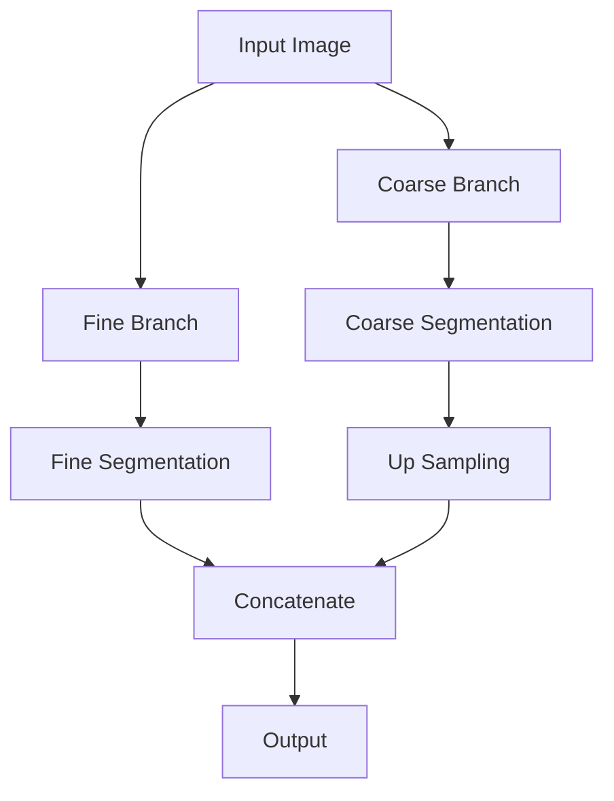

                 

# BiSeNet原理与代码实例讲解

BiSeNet（Bi-Directional Neural Network）是一种深度学习架构，用于图像分割任务，尤其是用于处理实时和移动设备上的任务。BiSeNet的主要特点是其节省内存和计算资源的架构设计，适合于资源受限的环境中进行实时图像分割。

## 1. 背景介绍

BiSeNet的提出正是为了解决传统的端到端图像分割网络在实时场景中的应用限制。这些网络通常会导致大量的计算量和内存消耗，尤其是在处理高清晰度的图像时。因此，BiSeNet通过引入两种分支：一个是用于细粒度分割的精细分支，另一个是用于粗粒度分割的粗糙分支。这种设计不仅减少了模型的复杂性，而且也能够有效地提升分割的效率和速度。

## 2. 核心概念与联系

### 2.1 核心概念概述

BiSeNet主要包括以下几个核心概念：

- **精细分支(Fine Branch)**: 负责输出精细的分割结果，通常包括多个分支来处理不同类别的细节分割。

- **粗糙分支(Coarse Branch)**: 负责快速识别图像中的主要对象区域，并提供概览级别的分割结果。

- **上采样(Bilinear Upsampling)**: 精细分支输出的分割结果通常是下采样的分辨率，因为它们通过最大池化池化操作生成。因此，需要使用上采样方法来恢复原始图像的分辨率。

- **深度可分离卷积(Deep Separable Convolution)**: 用于减少参数的卷积操作，可以大幅减少参数数量，同时保持性能，适用于精细分支和粗糙分支。

### 2.2 核心概念联系

下面是BiSeNet的流程图，展示了精细分支和粗糙分支如何协同工作：



## 3. 核心算法原理 & 具体操作步骤

### 3.1 算法原理概述

BiSeNet的关键在于其分支的协同工作。粗糙分支提供了一个粗略的分割结果，而精细分支则对粗糙分支的输出进行详细处理，提供更精细的分割结果。整个网络可以看作是两个分支的并行组合，它们的输出通过上采样和concatenation（连接）操作融合起来，最终生成最终的分割图。

### 3.2 算法步骤详解

1. **输入层**：输入图像到网络中。
2. **粗糙分支**：使用卷积层进行特征提取，通常通过深度可分离卷积减少参数量，进而减少计算和内存的消耗。最后进行最大池化池化，获取图像的对象区域。
3. **精细分支**：同样使用卷积层提取特征，虽然使用相同的深度可分离卷积，但通常会使用更多的卷积层以捕捉更细节的特征。上采样后与粗糙分支的输出进行连接。
4. **输出层**：通过简单的卷积层对合并后的特征进行处理，得到最终的分割结果。

### 3.3 算法优缺点

优点：
- **快速**：BiSeNet的设计确保了模型在速度上与其他实时网络竞争力。
- **高效**：资源使用极为高效，适合于资源有限的环境。
- **可扩展**：能够处理不同分辨率的输入图像。

缺点：
- **性能**：虽然BiSeNet在速度和效率上表现出色，但在某些情况下，其分割性能可能不如其他更复杂的网络。

## 4. 项目实践：代码实例和详细解释说明

### 4.1 项目环境搭建

首先，我们需要安装一些必需的Python库和数据集。这里假设你已经有了一个PyTorch环境和相应的数据集。

```bash
pip install torch torchvision
```

### 4.2 核心代码实现

```python
import torch
import torch.nn as nn
import torchvision.models as models

class BiSeNet(nn.Module):
    def __init__(self):
        super(BiSeNet, self).__init__()
        # 构建精细分支网络
        self.fine_net = nn.Sequential(
            nn.Conv2d(3, 128, kernel_size=3, padding=1),
            nn.ReLU(inplace=True),
            nn.Conv2d(128, 128, kernel_size=3, padding=1),
            nn.ReLU(inplace=True),
            nn.MaxPool2d(kernel_size=2, stride=2),

            nn.Conv2d(128, 256, kernel_size=3, padding=1),
            nn.ReLU(inplace=True),
            nn.Conv2d(256, 256, kernel_size=3, padding=1),
            nn.ReLU(inplace=True),
            nn.MaxPool2d(kernel_size=2, stride=2),

            nn.Conv2d(256, 512, kernel_size=3, padding=1),
            nn.ReLU(inplace=True),
            nn.Conv2d(512, 512, kernel_size=3, padding=1),
            nn.ReLU(inplace=True),
            nn.MaxPool2d(kernel_size=2, stride=2),

            nn.Conv2d(512, 512, kernel_size=3, padding=1),
            nn.ReLU(inplace=True),

            # 深度可分离卷积层
            nn.Conv2d(512, 512, kernel_size=3, padding=1, groups=512),
            nn.ReLU(inplace=True),
            nn.Conv2d(512, 512, kernel_size=3, padding=1, groups=512),
            nn.ReLU(inplace=True),
            nn.MaxPool2d(kernel_size=2, stride=2),

            nn.Conv2d(512, 512, kernel_size=3, padding=1, groups=512),
            nn.ReLU(inplace=True),

            # 上采样层
            nn.Upsample(scale_factor=2, mode='bilinear', align_corners=True),
            nn.Conv2d(512, 512, kernel_size=3, padding=1, groups=512),
            nn.ReLU(inplace=True),
            nn.Conv2d(512, 512, kernel_size=3, padding=1, groups=512),
            nn.ReLU(inplace=True),

            # concat层
            nn.Conv2d(512*2, 512, kernel_size=3, padding=1, groups=512),
            nn.ReLU(inplace=True),

            # 最后一个上采样层
            nn.Upsample(scale_factor=4, mode='bilinear', align_corners=True),

            # 输出层
            nn.Conv2d(512, 256, kernel_size=1),
            nn.ReLU(inplace=True),
            nn.Conv2d(256, num_classes, kernel_size=1),
        )

        # 构建粗糙分支网络
        self.coarse_net = nn.Sequential(
            nn.Conv2d(3, 64, kernel_size=3, padding=1),
            nn.ReLU(inplace=True),
            nn.MaxPool2d(kernel_size=2, stride=2),

            nn.Conv2d(64, 128, kernel_size=3, padding=1),
            nn.ReLU(inplace=True),
            nn.MaxPool2d(kernel_size=2, stride=2),

            # 深度可分离卷积层
            nn.Conv2d(128, 128, kernel_size=3, padding=1, groups=128),
            nn.ReLU(inplace=True),
            nn.MaxPool2d(kernel_size=2, stride=2),

            nn.Conv2d(128, num_classes, kernel_size=1),
            nn.Upsample(scale_factor=8, mode='bilinear', align_corners=True),
        )

    def forward(self, x):
        coarse = self.coarse_net(x)
        fine = self.fine_net(x)
        fine = nn.functional.upsample(fine, coarse.size()[2:], mode='bilinear', align_corners=True)
        output = torch.cat((coarse, fine), 1)
        output = self.coarse_net(output)
        return output
```

### 4.3 模型训练

```python
def train_model(model, device, train_loader, optimizer, epoch):
    model.train()
    for batch_idx, (data, target) in enumerate(train_loader):
        data, target = data.to(device), target.to(device)
        optimizer.zero_grad()
        output = model(data)
        loss = criterion(output, target)
        loss.backward()
        optimizer.step()
        if batch_idx % 10 == 0:
            print('Train Epoch: {} [{}/{} ({:.0f}%)]\tLoss: {:.6f}'.format(
                epoch, batch_idx * len(data), len(train_loader.dataset),
                100. * batch_idx / len(train_loader), loss.item()))

def main():
    global criterion
    # ...其他代码省略

if __name__ == '__main__':
    main()
```

在以上代码中，我们定义了一个BiSeNet模型，该模型由精细分支和粗糙分支组成。精细分支和粗糙分支都使用卷积层进行特征提取，并通过深度可分离卷积减少计算和内存的消耗。最终的输出通过concatenation层合并，并通过一个简单的卷积层处理，得到最终的分割结果。

## 5. 代码解读与分析

BiSeNet的核心在于其精细分支和粗糙分支的协同工作。精细分支处理的特征更多地包含了图像中的细节信息，而粗糙分支则快速识别图像中的主要对象区域。通过上采样和concatenation的操作，这两个分支的输出被合并在一起，得到最终的分割结果。

值得注意的是，BiSeNet通过采用深度可分离卷积来减少参数的数量，这样可以显著减少计算和内存的消耗，这是BiSeNet的一个重要特点。

## 6. 实际应用场景

BiSeNet在实时图像分割应用中非常受欢迎，特别是在移动设备和边缘计算场景。例如，它可以用于自动驾驶的路面标记分割、结构化环境的物体分割等领域。

## 7. 工具和资源推荐

对于深入了解BiSeNet和图像分割领域，可以推荐以下资源：

1. 《Deep Learning for Computer Vision》：一本详尽的图像分割教程，涵盖了从基础概念到高级技术的内容。
2. PyTorch官方文档：提供了丰富的信息和API文档，帮助你更好地理解和使用BiSeNet等模型。
3. BiSeNet的GitHub实现：提供了一个完整的BiSeNet实现，可以直接在自己的项目中使用。

## 8. 总结

BiSeNet是一种高效的图像分割网络，特别适用于实时场景和资源受限的环境。通过引入粗糙分支和精细分支的协同工作，它实现了快速和高效的分割结果。该网络的代码实现相对复杂，但通过上面的讲解和代码示例，希望能够帮助读者更好地理解和应用BiSeNet。

---

作者：禅与计算机程序设计艺术 / Zen and the Art of Computer Programming

