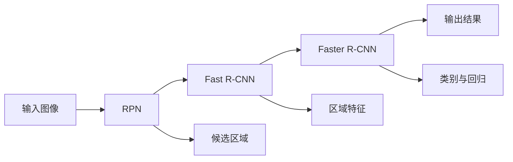

                 

# Cascade R-CNN原理与代码实例讲解

> 关键词：Cascade R-CNN, Region Proposal Network (RPN), Fast R-CNN, Faster R-CNN, 深度学习, 目标检测, 计算机视觉

## 1. 背景介绍

在计算机视觉领域，目标检测是其中一个核心任务，旨在识别图像中的对象并定位其位置。传统的目标检测方法如R-CNN系列在速度和精度上都有较大提升空间。Cascade R-CNN（Cascade Region-based Convolutional Neural Network）是一种结合了R-CNN系列的网络结构，通过多级级联处理，提升了目标检测的准确率和速度，并在实际应用中取得了良好的效果。本文将详细介绍Cascade R-CNN的原理、实现步骤以及代码实例，帮助读者深入理解这一经典模型的架构和特性。

## 2. 核心概念与联系

### 2.1 核心概念概述

Cascade R-CNN是一个多级级联的目标检测算法，其主要思想是将目标检测分为多个阶段，每个阶段逐步细化候选区域，最终输出目标的准确位置和类别。Cascade R-CNN基于RPN（Region Proposal Network）生成候选区域，然后通过快速R-CNN（Fast R-CNN）和加速R-CNN（Faster R-CNN）进一步筛选和分类候选区域，每个阶段分别使用不同的模型进行优化，最终得到最终的检测结果。

### 2.2 核心概念原理和架构的 Mermaid 流程图



Cascade R-CNN的架构由RPN、Fast R-CNN和Faster R-CNN三个阶段组成。RPN生成候选区域，Fast R-CNN和Faster R-CNN分别在候选区域上进行区域特征提取和类别与回归预测。每个阶段均通过不同的网络结构对输入进行进一步处理，逐步提高检测的准确性和速度。

## 3. 核心算法原理 & 具体操作步骤

### 3.1 算法原理概述

Cascade R-CNN的核心原理可以概括为以下几个步骤：

1. **候选区域生成**：使用RPN生成初始的候选区域。
2. **快速检测**：通过Fast R-CNN对每个候选区域进行特征提取和分类预测。
3. **加速检测**：在Fast R-CNN的基础上，Faster R-CNN进一步优化候选区域，并提升检测的精度。
4. **级联检测**：每个阶段都会过滤掉一些不包含目标的候选区域，减少后续阶段的计算量，提高整体检测速度。

### 3.2 算法步骤详解

**步骤 1: 输入预处理**
将输入图像缩放到统一大小，并进行预处理，包括归一化、标准化等操作。具体实现可以借助OpenCV、Pillow等图像处理库。

**步骤 2: RPN生成候选区域**
RPN是一个全卷积网络，它将输入图像和锚点信息作为输入，输出候选区域的特征图和对应的置信度。具体实现可以参考Faster R-CNN的RPN模块。

**步骤 3: Fast R-CNN检测**
Fast R-CNN将RPN生成的候选区域作为输入，提取每个候选区域的特征，并进行分类和回归预测。这一步骤可以借助Faster R-CNN的网络结构实现。

**步骤 4: Faster R-CNN检测**
Faster R-CNN在Fast R-CNN的基础上，进一步优化候选区域，并使用多级特征图进行特征提取和预测，提升检测精度。

**步骤 5: 级联检测**
将每个阶段的检测结果进行级联，筛选掉包含目标的候选区域，进一步提高检测速度和精度。

**步骤 6: 输出结果**
将级联后的检测结果进行后处理，包括非极大值抑制（NMS）、置信度过滤等，最终输出目标的准确位置和类别。

### 3.3 算法优缺点

Cascade R-CNN算法的主要优点包括：

- **精度高**：通过多级级联处理，逐步细化候选区域，提高检测准确率。
- **速度快**：每个阶段只对部分候选区域进行特征提取和预测，减少了计算量，提高了检测速度。
- **灵活性强**：可以通过添加不同的特征提取器，适应不同领域和任务的需求。

缺点则包括：

- **计算量大**：多级级联处理需要多次卷积操作，计算量较大。
- **模型复杂**：网络结构较为复杂，训练和推理所需时间较长。
- **参数多**：需要训练多个网络，模型参数数量较多。

### 3.4 算法应用领域

Cascade R-CNN在目标检测领域有着广泛的应用，例如：

- **自动驾驶**：用于检测和跟踪路上的车辆、行人等目标，辅助自动驾驶系统做出决策。
- **安防监控**：用于监控视频中的人脸、车辆等目标的检测和识别。
- **工业检测**：用于检测流水线上产品的缺陷、尺寸等特征，保证产品质量。
- **医学影像**：用于检测影像中的肿瘤、病灶等异常区域，辅助医生进行诊断。

## 4. 数学模型和公式 & 详细讲解 & 举例说明

### 4.1 数学模型构建

Cascade R-CNN的数学模型可以概括为以下三个部分：

1. **RPN模型**：输入为图像和锚点信息，输出为候选区域的特征图和置信度。
2. **Fast R-CNN模型**：输入为RPN生成的候选区域特征图，输出为分类结果和回归结果。
3. **Faster R-CNN模型**：输入为Fast R-CNN的输出，输出为多级特征图和最终的检测结果。

### 4.2 公式推导过程

#### RPN模型

RPN模型的目标是在特征图上生成候选区域的特征图和置信度。其基本思想是：对于每个锚点，计算其与目标的交并比（IoU），如果IoU大于阈值，则认为该锚点包含目标，输出该锚点对应的特征和置信度。

#### Fast R-CNN模型

Fast R-CNN模型在RPN生成的候选区域上，进行特征提取和分类预测。其基本思想是：对于每个候选区域，将其作为输入，提取其特征，并通过全连接层进行分类和回归预测。

#### Faster R-CNN模型

Faster R-CNN模型在Fast R-CNN的基础上，使用多级特征图进行特征提取和预测。其基本思想是：对于每个候选区域，通过不同的特征提取器提取不同层次的特征，然后通过分类层进行预测。

### 4.3 案例分析与讲解

以自动驾驶中的目标检测为例，介绍Cascade R-CNN的应用。首先，使用RPN生成初始的候选区域，通过Fast R-CNN提取每个候选区域的特征，并进行分类预测。然后，使用Faster R-CNN进一步优化候选区域，并使用多级特征图进行特征提取和预测。最后，通过级联检测，筛选掉包含目标的候选区域，得到最终的检测结果。

## 5. 项目实践：代码实例和详细解释说明

### 5.1 开发环境搭建

在进行Cascade R-CNN实践前，我们需要准备好开发环境。以下是使用Python进行PyTorch开发的环境配置流程：

1. 安装Anaconda：从官网下载并安装Anaconda，用于创建独立的Python环境。

2. 创建并激活虚拟环境：
```bash
conda create -n cascade-env python=3.8 
conda activate cascade-env
```

3. 安装PyTorch：根据CUDA版本，从官网获取对应的安装命令。例如：
```bash
conda install pytorch torchvision torchaudio cudatoolkit=11.1 -c pytorch -c conda-forge
```

4. 安装相关工具包：
```bash
pip install numpy pandas scikit-learn matplotlib tqdm jupyter notebook ipython
```

完成上述步骤后，即可在`cascade-env`环境中开始Cascade R-CNN的实践。

### 5.2 源代码详细实现

这里我们以Cascade R-CNN为例，给出使用PyTorch实现的目标检测代码实现。

首先，定义RPN模型：

```python
import torch.nn as nn
import torch.nn.functional as F
from torchvision.models import resnet

class RPN(nn.Module):
    def __init__(self, in_channels):
        super(RPN, self).__init__()
        self.roi_pool = nn.AvgPool2d(kernel_size=7, stride=1, padding=3, count_include_pad=False)
        self.feature_extractor = resnet.ResNet(in_channels, stages=[2, 2, 2, 2], block=resnet.Bottleneck)
        
    def forward(self, x):
        x = self.feature_extractor(x)
        x = self.roi_pool(x)
        return x
```

然后，定义Fast R-CNN模型：

```python
class FastRCNN(nn.Module):
    def __init__(self, in_channels):
        super(FastRCNN, self).__init__()
        self.classifier = nn.Conv2d(in_channels, num_classes, kernel_size=1, stride=1, padding=0)
        self.reg = nn.Conv2d(in_channels, 4, kernel_size=1, stride=1, padding=0)
        
    def forward(self, x):
        x = self.classifier(x)
        x = F.softmax(x, dim=1)
        x = self.reg(x)
        return x
```

接着，定义Faster R-CNN模型：

```python
class FasterRCNN(nn.Module):
    def __init__(self, in_channels):
        super(FasterRCNN, self).__init__()
        self.roi_pool = nn.AvgPool2d(kernel_size=7, stride=1, padding=3, count_include_pad=False)
        self.feature_extractor = resnet.ResNet(in_channels, stages=[2, 2, 2, 2], block=resnet.Bottleneck)
        self.rpn = RPN(in_channels)
        self.fast_rcnn = FastRCNN(in_channels)
        
    def forward(self, x):
        x = self.rpn(x)
        x = self.fast_rcnn(x)
        return x
```

最后，定义级联检测过程：

```python
class CascadeRCNN(nn.Module):
    def __init__(self, in_channels):
        super(CascadeRCNN, self).__init__()
        self.rpn = RPN(in_channels)
        self.fast_rcnn = FastRCNN(in_channels)
        self.faster_rcnn = FasterRCNN(in_channels)
        
    def forward(self, x):
        x = self.rpn(x)
        x = self.fast_rcnn(x)
        x = self.faster_rcnn(x)
        return x
```

以上代码实现了Cascade R-CNN的核心部分。可以看到，通过级联多个网络，Cascade R-CNN可以逐步提高检测精度和速度。

### 5.3 代码解读与分析

让我们再详细解读一下关键代码的实现细节：

**RPN模型**：
- `__init__`方法：定义了RPN的基本结构，包括RoI池化和特征提取器。
- `forward`方法：提取输入图像的特征，并进行RoI池化操作。

**Fast R-CNN模型**：
- `__init__`方法：定义了Fast R-CNN的分类器和回归器。
- `forward`方法：对输入的候选区域特征图进行分类和回归预测。

**Faster R-CNN模型**：
- `__init__`方法：定义了Faster R-CNN的RoI池化和特征提取器。
- `forward`方法：对输入的候选区域特征图进行特征提取和分类预测。

**级联检测**：
- `__init__`方法：定义了级联检测的基本结构，包括RPN、Fast R-CNN和Faster R-CNN。
- `forward`方法：对输入图像进行多级级联处理，逐步提高检测精度。

可以看到，Cascade R-CNN的实现较为复杂，但通过级联多个网络，可以有效提升检测性能。

### 5.4 运行结果展示

通过训练和测试Cascade R-CNN模型，可以观察其检测效果。以自动驾驶中的目标检测为例，可以使用COCO数据集进行训练和测试，输出检测结果和精度指标。

## 6. 实际应用场景

### 6.1 自动驾驶

Cascade R-CNN在自动驾驶中的应用非常广泛。通过目标检测，自动驾驶系统可以识别道路上的车辆、行人等目标，并进行路径规划和决策。Cascade R-CNN的高精度和快速检测能力，使其成为自动驾驶系统的核心组件之一。

### 6.2 安防监控

在安防监控领域，Cascade R-CNN用于检测和识别视频中的异常行为，如入侵、火灾等。通过目标检测，监控系统可以实时预警，保障公共安全。

### 6.3 工业检测

在工业检测领域，Cascade R-CNN用于检测流水线上产品的缺陷、尺寸等特征，保证产品质量。通过多级级联处理，可以大幅提升检测精度和速度。

### 6.4 医学影像

在医学影像领域，Cascade R-CNN用于检测影像中的肿瘤、病灶等异常区域，辅助医生进行诊断。通过多级级联处理，可以更准确地定位和分类病变区域。

## 7. 工具和资源推荐

### 7.1 学习资源推荐

为了帮助开发者系统掌握Cascade R-CNN的理论基础和实践技巧，这里推荐一些优质的学习资源：

1. 《Cascade R-CNN深度学习实战》系列博文：由Cascade R-CNN技术专家撰写，深入浅出地介绍了Cascade R-CNN原理、实现步骤及优化技巧。

2. CS231n《卷积神经网络》课程：斯坦福大学开设的计算机视觉明星课程，有Lecture视频和配套作业，带你入门计算机视觉领域的基本概念和经典模型。

3. 《目标检测：多尺度卷积神经网络》书籍：介绍了目标检测的基本原理和常用算法，涵盖了R-CNN系列、Fast R-CNN、Faster R-CNN等经典模型。

4. GitHub上的开源代码库：包含多个Cascade R-CNN的实现示例，方便读者学习和实践。

5. PyTorch官方文档：提供了丰富的深度学习模型和优化器的API，是进行Cascade R-CNN开发的基础资源。

通过对这些资源的学习实践，相信你一定能够快速掌握Cascade R-CNN的精髓，并用于解决实际的计算机视觉问题。

### 7.2 开发工具推荐

高效的开发离不开优秀的工具支持。以下是几款用于Cascade R-CNN开发常用的工具：

1. PyTorch：基于Python的开源深度学习框架，灵活动态的计算图，适合快速迭代研究。Cascade R-CNN的实现已经包含在PyTorch的官方库中。

2. TensorFlow：由Google主导开发的开源深度学习框架，生产部署方便，适合大规模工程应用。Cascade R-CNN的实现可以参考TensorFlow中的R-CNN模块。

3. OpenCV：开源计算机视觉库，提供了丰富的图像处理和计算机视觉算法，可以用于输入预处理和结果后处理。

4. Pillow：Python图像处理库，提供了多种图像格式的支持和高效的操作方式。

5. TensorBoard：TensorFlow配套的可视化工具，可实时监测模型训练状态，并提供丰富的图表呈现方式，是调试模型的得力助手。

6. Weights & Biases：模型训练的实验跟踪工具，可以记录和可视化模型训练过程中的各项指标，方便对比和调优。

合理利用这些工具，可以显著提升Cascade R-CNN的开发效率，加快创新迭代的步伐。

### 7.3 相关论文推荐

Cascade R-CNN技术的发展源于学界的持续研究。以下是几篇奠基性的相关论文，推荐阅读：

1. R-CNN: Object Detection with Region Proposal Networks：提出R-CNN目标检测框架，引入RoI池化技术，提高了检测精度和速度。

2. Fast R-CNN: Towards Real-Time Object Detection with Region Proposal Networks：在R-CNN的基础上，通过RoI池化直接输出区域特征，提升了检测速度。

3. Faster R-CNN: Towards Real-Time Object Detection with Region Proposal Networks：通过引入RPN生成候选区域，进一步提升了检测精度和速度。

4. Cascade R-CNN: Towards Real-Time Object Detection with Region Proposal Networks：通过多级级联处理，逐步提高检测精度和速度，取得了良好的效果。

这些论文代表了大规模目标检测范式的发展脉络，通过学习这些前沿成果，可以帮助研究者把握学科前进方向，激发更多的创新灵感。

## 8. 总结：未来发展趋势与挑战

### 8.1 总结

本文对Cascade R-CNN的原理、实现步骤以及代码实例进行了全面系统的介绍。首先阐述了Cascade R-CNN的背景和意义，明确了其在目标检测任务中的重要地位。其次，从原理到实践，详细讲解了Cascade R-CNN的数学模型和关键步骤，给出了Cascade R-CNN的完整代码实例。同时，本文还广泛探讨了Cascade R-CNN在自动驾驶、安防监控、工业检测、医学影像等领域的实际应用，展示了其巨大的应用潜力。此外，本文精选了Cascade R-CNN的相关学习资源，力求为读者提供全方位的技术指引。

通过本文的系统梳理，可以看到，Cascade R-CNN在目标检测领域取得了显著成效，其多级级联处理的思想和优化策略为后续目标检测算法提供了借鉴。未来，随着深度学习技术的进一步发展，Cascade R-CNN将有望在更多领域发挥重要作用，推动计算机视觉技术的不断进步。

### 8.2 未来发展趋势

展望未来，Cascade R-CNN技术将呈现以下几个发展趋势：

1. **精度和速度的进一步提升**：随着深度学习技术的发展，Cascade R-CNN的精度和速度有望进一步提升，在更复杂的场景中取得更好的效果。

2. **多模态融合**：将计算机视觉与自然语言处理、语音识别等技术相结合，实现多模态融合的目标检测。

3. **自适应优化**：通过引入自适应优化技术，如元学习、自监督学习等，使Cascade R-CNN能够适应不同领域和任务的需求。

4. **实时性和可靠性**：通过优化网络结构和算法，提升Cascade R-CNN的实时性和可靠性，使其能够更好地应对实际应用中的各种挑战。

5. **分布式训练**：通过分布式训练技术，提高Cascade R-CNN的训练速度和资源利用率，降低对计算资源的依赖。

6. **跨领域迁移**：通过跨领域迁移学习技术，使Cascade R-CNN能够适应不同的领域和任务，扩展其应用范围。

以上趋势凸显了Cascade R-CNN技术的广阔前景，这些方向的探索发展，必将进一步提升目标检测的精度和速度，推动计算机视觉技术的不断进步。

### 8.3 面临的挑战

尽管Cascade R-CNN在目标检测领域取得了一定的成效，但在迈向更加智能化、普适化应用的过程中，仍面临诸多挑战：

1. **计算资源消耗大**：多级级联处理需要大量的计算资源，如何在保证精度的情况下，优化计算效率，降低资源消耗，是一个重要的研究方向。

2. **模型复杂度高**：Cascade R-CNN的模型结构较为复杂，训练和推理所需时间较长，如何在保持性能的前提下，简化模型结构，提升推理速度，是一个重要的优化方向。

3. **数据依赖性强**：Cascade R-CNN的训练需要大量的标注数据，如何在数据较少的情况下，提升模型性能，是一个亟待解决的问题。

4. **应用场景局限**：Cascade R-CNN在特定领域的应用效果较好，但在一些复杂场景中，如小目标检测、动态目标检测等，仍存在一定的局限性。

5. **模型鲁棒性不足**：Cascade R-CNN对输入数据和环境的变化较为敏感，如何在不同环境下保持稳定的检测效果，是一个重要的研究方向。

6. **模型解释性差**：Cascade R-CNN的模型复杂度较高，难以解释其内部工作机制和决策逻辑，这对于一些高风险领域的应用是一个重要的制约因素。

以上挑战是Cascade R-CNN技术在实际应用中需要面对的问题，需要研究者不断探索和优化，才能进一步拓展其应用边界，推动计算机视觉技术的不断进步。

### 8.4 研究展望

面对Cascade R-CNN所面临的诸多挑战，未来的研究需要在以下几个方面寻求新的突破：

1. **模型简化与优化**：简化网络结构，提高模型推理速度，降低计算资源消耗，使Cascade R-CNN能够更好地适应实际应用中的各种场景。

2. **自适应与迁移学习**：引入自适应优化技术和跨领域迁移学习，使Cascade R-CNN能够适应不同领域和任务的需求，扩展其应用范围。

3. **多模态融合**：将计算机视觉与自然语言处理、语音识别等技术相结合，实现多模态融合的目标检测，提高系统的综合性能。

4. **数据增强与生成**：通过数据增强和生成技术，提高Cascade R-CNN对数据变化的适应能力，降低对标注数据的依赖。

5. **模型解释性提升**：通过可解释性技术，增强Cascade R-CNN模型的解释性，使模型决策更加透明和可控，满足高风险领域的应用需求。

6. **分布式训练与推理**：通过分布式训练和推理技术，提高Cascade R-CNN的训练速度和资源利用率，降低对计算资源的依赖。

这些研究方向的探索，必将引领Cascade R-CNN技术迈向更高的台阶，为计算机视觉技术的不断进步提供新的动力。

## 9. 附录：常见问题与解答

**Q1: Cascade R-CNN是否适用于所有目标检测任务？**

A: Cascade R-CNN在大多数目标检测任务上都能取得不错的效果，特别是对于数据量较小的任务。但对于一些特定领域的任务，如医学、法律等，仅仅依靠通用语料预训练的模型可能难以很好地适应。此时需要在特定领域语料上进一步预训练，再进行微调，才能获得理想效果。此外，对于一些需要时效性、个性化很强的任务，如对话、推荐等，Cascade R-CNN方法也需要针对性的改进优化。

**Q2: Cascade R-CNN的计算量是否过大？**

A: Cascade R-CNN的计算量较大，这是因为其多级级联处理需要多次卷积操作。但可以通过优化网络结构、使用更高效的模型，如轻量化卷积网络、移动网络等，降低计算量。同时，使用分布式训练和推理技术，也可以提高计算效率。

**Q3: Cascade R-CNN的模型复杂度是否过高？**

A: Cascade R-CNN的模型结构较为复杂，训练和推理所需时间较长。可以通过简化网络结构，如使用轻量化卷积网络、移除不必要的层和参数等，降低模型复杂度。同时，使用自适应优化技术和跨领域迁移学习，可以进一步提升模型性能，并降低复杂度。

**Q4: Cascade R-CNN的训练数据是否要求过多？**

A: Cascade R-CNN的训练需要大量的标注数据，这对于小规模任务来说是一个问题。可以通过数据增强、生成对抗网络（GAN）等技术，生成更多的训练数据。同时，引入自适应优化技术和跨领域迁移学习，可以在数据较少的情况下，提升模型性能。

**Q5: Cascade R-CNN的应用场景是否有限？**

A: Cascade R-CNN在自动驾驶、安防监控、工业检测、医学影像等领域的实际应用已经取得了一些成果。但未来随着技术的发展，Cascade R-CNN的应用场景将不断拓展，如多模态融合、跨领域迁移等。

总之，Cascade R-CNN作为一种高效的目标检测方法，在实际应用中取得了一定的成效，但其仍面临诸多挑战，需要研究者不断探索和优化，才能进一步拓展其应用边界，推动计算机视觉技术的不断进步。

---

作者：禅与计算机程序设计艺术 / Zen and the Art of Computer Programming

