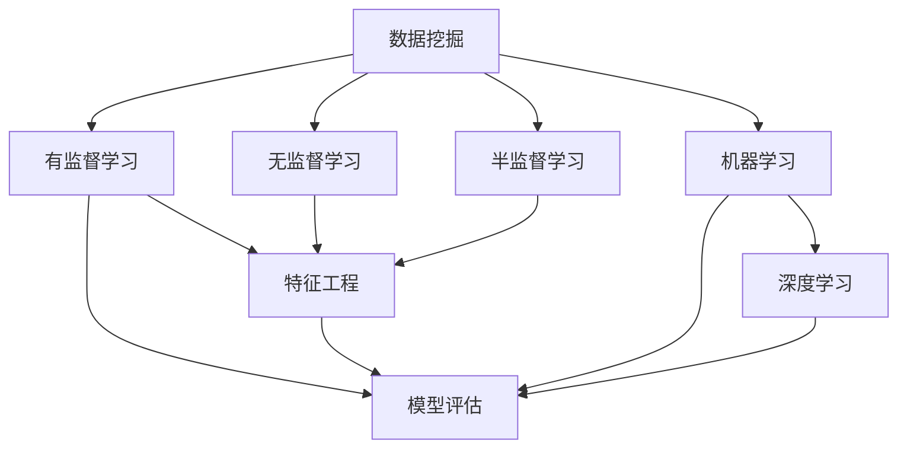

                 

# Data Mining 原理与代码实战案例讲解

> 关键词：数据挖掘,机器学习,数据预处理,特征工程,模型评估,Python实践

## 1. 背景介绍

### 1.1 问题由来
在当今大数据时代，数据被视为一种重要的资产，如何从海量数据中提取有用的信息和知识，成为企业和科研机构关注的焦点。数据挖掘(Data Mining)正是将复杂的数据集转化为有价值信息的关键技术。数据挖掘不仅应用于学术界，更广泛应用于金融、医疗、电商等各行各业。

### 1.2 问题核心关键点
数据挖掘的核心理念是通过分析历史数据，找出数据中的规律、趋势、异常等，从而帮助人们做出更加精准的决策。数据挖掘方法可以分为有监督学习、无监督学习和半监督学习三大类。其中，有监督学习是数据挖掘中最常见的一种方法，其核心思想是利用已标注的训练集，训练出一个能够对新数据进行预测或分类的模型。有监督学习模型的训练过程一般包括以下步骤：数据预处理、特征工程、模型选择与训练、模型评估与调优。

### 1.3 问题研究意义
掌握数据挖掘的原理与实践，能够帮助从业者更好地理解数据的本质，提炼出有价值的知识，实现业务问题的解决。数据挖掘的实践不仅能提升个人的技术能力，还能为企业创造更大的商业价值，推动行业智能化转型升级。

## 2. 核心概念与联系

### 2.1 核心概念概述

为更好地理解数据挖掘的原理与实践，本节将介绍几个关键概念：

- 数据挖掘(Data Mining)：通过分析数据集，提取有价值信息的自动化过程。常见的数据挖掘任务包括分类、聚类、关联规则挖掘、异常检测等。
- 有监督学习(Supervised Learning)：使用标注数据训练模型，对新数据进行预测或分类。有监督学习包括回归、分类、序列预测等任务。
- 特征工程(Feature Engineering)：选择、构造、选择特征，以提升模型的预测能力。特征工程是数据挖掘中至关重要的步骤。
- 模型评估(Model Evaluation)：通过性能指标如准确率、召回率、F1值、ROC曲线等，评估模型的优劣，并调整参数，提高模型性能。
- 机器学习(Machine Learning)：利用算法对数据进行训练，并预测未来数据的技术。机器学习是数据挖掘的重要工具。
- 深度学习(Deep Learning)：基于人工神经网络进行学习，以多层非线性变换提取特征。深度学习在图像、语音、自然语言处理等领域取得突破性进展。

这些核心概念之间的逻辑关系可以通过以下Mermaid流程图来展示：



这个流程图展示了大数据挖掘的核心概念及其之间的关系：

1. 数据挖掘涉及多类学习范式。
2. 特征工程在数据挖掘中至关重要。
3. 模型评估用于衡量模型性能，指导参数调优。
4. 机器学习和深度学习是数据挖掘的主要技术手段。

这些概念共同构成了数据挖掘的知识体系，帮助从业者更好地理解数据挖掘的过程和应用。

## 3. 核心算法原理 & 具体操作步骤

### 3.1 算法原理概述

有监督学习的数据挖掘主要分为数据预处理、特征工程、模型选择与训练、模型评估与调优四个步骤。每个步骤的详细原理和操作步骤如下：

1. **数据预处理**：清洗数据，填补缺失值，处理异常值，对数据进行标准化、归一化等处理。
2. **特征工程**：选择合适的特征，并进行特征构造、降维等操作，以提高模型的预测能力。
3. **模型选择与训练**：根据问题类型选择适合的模型，如线性回归、决策树、随机森林、SVM、神经网络等，并使用训练集对模型进行训练。
4. **模型评估与调优**：在验证集上评估模型性能，根据性能指标调整模型参数，直到模型表现最优。

### 3.2 算法步骤详解

#### 3.2.1 数据预处理

**数据清洗**：
数据清洗是数据预处理的首要步骤。数据清洗的目的是确保数据质量，提升模型的预测能力。常见的数据清洗操作包括：

- 删除重复记录：使用唯一性约束或检查去重。
- 处理缺失值：使用均值、中位数、众数等填补缺失值；或删除缺失值较多的记录。
- 处理异常值：根据业务知识或统计方法，识别和处理异常值。

例如，在电商数据集中，可以使用以下代码对缺失值进行处理：

```python
import pandas as pd
from sklearn.impute import SimpleImputer

# 读取数据
df = pd.read_csv('data.csv')

# 删除缺失值较多的记录
df = df.dropna(thresh=len(df) * 0.9)

# 使用均值填补缺失值
imp = SimpleImputer(strategy='mean')
df['feature'] = imp.fit_transform(df[['feature']])
```

**数据标准化**：
数据标准化是将数据按比例缩放，使不同特征的数值范围相近，以提高模型性能。常用的标准化方法包括均值标准化和最小-最大标准化。

例如，使用均值标准化对数据进行缩放：

```python
from sklearn.preprocessing import StandardScaler

# 标准化数据
scaler = StandardScaler()
scaled_data = scaler.fit_transform(df[['feature']])
```

#### 3.2.2 特征工程

**特征选择**：
特征选择是特征工程中的重要步骤。特征选择的目的是减少特征数量，提升模型性能。常见的特征选择方法包括：

- 方差选择：选择方差较大的特征。
- 相关系数选择：选择与目标变量相关性较高的特征。
- 信息增益选择：选择信息增益较大的特征。

例如，使用相关系数选择特征：

```python
import numpy as np
from sklearn.feature_selection import SelectKBest, f_regression

# 选择与目标变量相关性较高的特征
selector = SelectKBest(f_regression, k=10)
selected_features = selector.fit_transform(X, y)
```

**特征构造**：
特征构造是通过计算现有特征的组合或派生特征，以提升模型性能。常见的特征构造方法包括：

- 多项式特征：对连续变量进行多项式变换。
- 离散化：将连续变量离散化为若干个离散值。
- 时间特征：计算时间相关的特征，如小时、日、周等。

例如，使用多项式特征进行特征构造：

```python
from sklearn.preprocessing import PolynomialFeatures

# 构造多项式特征
poly = PolynomialFeatures(degree=2, include_bias=False)
poly_features = poly.fit_transform(X)
```

#### 3.2.3 模型选择与训练

**模型选择**：
根据数据集的大小、特征的复杂性、预测的目标，选择合适的模型。常见的模型包括：

- 线性回归：用于连续变量的预测。
- 决策树：用于分类和回归问题。
- 随机森林：用于分类和回归问题。
- 支持向量机(SVM)：用于分类问题。
- 神经网络：用于复杂的预测问题。

例如，选择线性回归模型：

```python
from sklearn.linear_model import LinearRegression

# 创建线性回归模型
model = LinearRegression()
```

**模型训练**：
使用训练集对模型进行训练。常见的训练方法包括：

- 交叉验证：将数据集分为训练集和验证集，使用交叉验证评估模型性能。
- 梯度下降法：使用梯度下降法对模型进行训练。
- 正则化：使用L1正则或L2正则对模型进行约束，防止过拟合。

例如，使用交叉验证对模型进行训练：

```python
from sklearn.model_selection import cross_val_score
from sklearn.linear_model import LinearRegression

# 使用交叉验证评估模型性能
scores = cross_val_score(model, X_train, y_train, cv=5)
```

#### 3.2.4 模型评估与调优

**模型评估**：
使用验证集评估模型性能，根据性能指标调整模型参数。常见的性能指标包括：

- 准确率：模型正确预测的样本数占总样本数的比例。
- 召回率：模型正确预测的正样本数占所有正样本数的比例。
- F1值：综合考虑准确率和召回率的指标。
- ROC曲线：衡量模型在不同阈值下的真阳性率和假阳性率。

例如，使用F1值评估模型性能：

```python
from sklearn.metrics import f1_score

# 计算F1值
f1 = f1_score(y_true, y_pred)
```

**模型调优**：
根据模型评估结果，调整模型参数，以提高模型性能。常见的调优方法包括：

- 调整学习率：调整学习率，防止模型过拟合或欠拟合。
- 调整正则化强度：调整正则化强度，防止模型过拟合。
- 调整模型结构：增加或减少模型层数，调整神经元数量等。

例如，使用网格搜索对模型进行调优：

```python
from sklearn.model_selection import GridSearchCV

# 网格搜索调优
param_grid = {'C': [0.1, 1, 10], 'penalty': ['l1', 'l2']}
grid_search = GridSearchCV(model, param_grid, cv=5)
grid_search.fit(X_train, y_train)
```

### 3.3 算法优缺点

#### 3.3.1 优点

- **高效性**：有监督学习的数据挖掘可以快速从数据中提取有用的信息，提升决策效率。
- **泛化能力**：通过使用大量标注数据，有监督学习模型能够学习到数据的一般规律，具有较好的泛化能力。
- **可解释性**：有监督学习模型可以通过模型参数和决策规则，解释预测结果的依据。

#### 3.3.2 缺点

- **依赖标注数据**：有监督学习依赖标注数据，标注数据的获取和处理成本较高。
- **过拟合风险**：有监督学习模型容易在标注数据过少或噪声较多的情况下，发生过拟合。
- **模型复杂度高**：有监督学习模型通常需要较多的训练数据和计算资源，模型复杂度高。

### 3.4 算法应用领域

数据挖掘在多个领域有着广泛的应用，具体如下：

- **金融风险管理**：使用数据挖掘对金融市场数据进行分析，识别风险因素，进行风险预警。
- **医疗诊断**：使用数据挖掘对医疗数据进行分析，预测疾病发生概率，辅助诊断。
- **电商推荐**：使用数据挖掘对用户行为数据进行分析，进行商品推荐。
- **交通分析**：使用数据挖掘对交通数据进行分析，优化交通流量，减少拥堵。
- **社交网络分析**：使用数据挖掘对社交网络数据进行分析，挖掘社交关系，进行用户行为预测。

以上领域只是数据挖掘应用的一部分，随着数据挖掘技术的不断进步，数据挖掘的应用场景将更加广泛。

## 4. 数学模型和公式 & 详细讲解 & 举例说明

### 4.1 数学模型构建

#### 4.1.1 线性回归模型

线性回归模型用于预测连续变量。其数学模型可以表示为：

$$
y = \beta_0 + \beta_1x_1 + \beta_2x_2 + ... + \beta_nx_n + \epsilon
$$

其中，$y$ 为目标变量，$x_i$ 为特征变量，$\beta_i$ 为模型参数，$\epsilon$ 为误差项。

### 4.2 公式推导过程

#### 4.2.1 线性回归模型推导

在线性回归模型中，目标变量 $y$ 与特征变量 $x_i$ 之间存在线性关系，因此可以通过最小二乘法求解模型参数 $\beta_i$。最小二乘法的目标是最小化残差平方和，即：

$$
\min_{\beta} \sum_{i=1}^n (y_i - (\beta_0 + \beta_1x_{i1} + ... + \beta_nx_{in}))^2
$$

通过求解上述最小化问题，可以得到模型参数的闭式解：

$$
\beta = (X^TX)^{-1}X^Ty
$$

其中，$X$ 为特征矩阵，$y$ 为目标向量。

### 4.3 案例分析与讲解

#### 4.3.1 线性回归案例

假设有一个电商数据集，包含用户年龄、收入、购物金额等特征，以及购物次数这一目标变量。我们可以使用线性回归模型预测购物次数。

```python
from sklearn.linear_model import LinearRegression
import pandas as pd
from sklearn.metrics import r2_score

# 读取数据
df = pd.read_csv('data.csv')

# 数据预处理
X = df[['age', 'income']]
y = df['shopping_frequency']

# 创建线性回归模型
model = LinearRegression()

# 训练模型
model.fit(X, y)

# 评估模型
y_pred = model.predict(X)
r2 = r2_score(y, y_pred)
```

通过以上代码，我们可以得到购物次数的预测结果和模型的决定系数，评估模型的预测性能。

## 5. 项目实践：代码实例和详细解释说明

### 5.1 开发环境搭建

在进行数据挖掘实践前，我们需要准备好开发环境。以下是使用Python进行sklearn开发的环境配置流程：

1. 安装Anaconda：从官网下载并安装Anaconda，用于创建独立的Python环境。

2. 创建并激活虚拟环境：
```bash
conda create -n sklearn-env python=3.8 
conda activate sklearn-env
```

3. 安装sklearn：
```bash
conda install scikit-learn
```

4. 安装各类工具包：
```bash
pip install numpy pandas scikit-learn matplotlib tqdm jupyter notebook ipython
```

完成上述步骤后，即可在`sklearn-env`环境中开始数据挖掘实践。

### 5.2 源代码详细实现

下面我们以电商推荐系统为例，给出使用sklearn进行线性回归的数据挖掘代码实现。

首先，定义数据处理函数：

```python
import pandas as pd
from sklearn.model_selection import train_test_split

def load_data(file_path):
    # 读取数据集
    df = pd.read_csv(file_path)
    
    # 数据预处理
    X = df.drop('target', axis=1)
    y = df['target']
    
    # 划分训练集和测试集
    X_train, X_test, y_train, y_test = train_test_split(X, y, test_size=0.2, random_state=42)
    
    return X_train, X_test, y_train, y_test
```

然后，定义模型训练函数：

```python
from sklearn.linear_model import LinearRegression
from sklearn.metrics import mean_squared_error

def train_model(X_train, y_train):
    # 创建线性回归模型
    model = LinearRegression()
    
    # 训练模型
    model.fit(X_train, y_train)
    
    # 评估模型
    y_pred = model.predict(X_train)
    mse = mean_squared_error(y_train, y_pred)
    
    return model, mse
```

接着，定义模型评估函数：

```python
from sklearn.metrics import r2_score

def evaluate_model(model, X_test, y_test):
    # 评估模型
    y_pred = model.predict(X_test)
    r2 = r2_score(y_test, y_pred)
    
    return r2
```

最后，启动训练流程并在测试集上评估：

```python
# 加载数据集
X_train, X_test, y_train, y_test = load_data('data.csv')

# 训练模型
model, mse = train_model(X_train, y_train)

# 评估模型
r2 = evaluate_model(model, X_test, y_test)

# 输出结果
print(f'训练集均方误差：{mse:.3f}')
print(f'测试集R^2值：{r2:.3f}')
```

以上就是使用sklearn进行线性回归的数据挖掘代码实现。可以看到，sklearn库提供了完整的模型训练、评估和调优接口，使得数据挖掘任务变得简单易行。

### 5.3 代码解读与分析

让我们再详细解读一下关键代码的实现细节：

**load_data函数**：
- `load_data`函数用于加载数据集，并进行数据预处理和分割。
- 读取数据集，并使用`drop`方法去除目标变量列。
- 使用`train_test_split`方法将数据集划分为训练集和测试集。
- 返回训练集和测试集的数据。

**train_model函数**：
- `train_model`函数用于训练线性回归模型，并计算训练集均方误差。
- 创建线性回归模型，并使用训练集数据进行拟合。
- 使用`predict`方法进行模型预测，计算均方误差。
- 返回模型和均方误差。

**evaluate_model函数**：
- `evaluate_model`函数用于评估模型，计算测试集R^2值。
- 使用模型对测试集进行预测，并计算R^2值。
- 返回R^2值。

**训练流程**：
- 加载数据集
- 训练模型并计算训练集均方误差
- 评估模型并计算测试集R^2值
- 输出结果

可以看到，sklearn库使得数据挖掘任务的实现变得简洁高效。开发者可以将更多精力放在模型选择、特征工程、模型评估等高层逻辑上，而不必过多关注底层的实现细节。

当然，工业级的系统实现还需考虑更多因素，如模型的保存和部署、超参数的自动搜索、更灵活的任务适配层等。但核心的数据挖掘流程基本与此类似。

## 6. 实际应用场景

### 6.1 电商推荐系统

电商推荐系统是数据挖掘技术的重要应用之一。通过分析用户的历史购买记录、浏览行为、评价数据等，推荐系统会生成个性化的商品推荐列表，提升用户购买体验。

在技术实现上，可以收集用户的浏览、点击、购买等行为数据，使用数据挖掘技术分析用户兴趣和行为模式，预测用户可能感兴趣的商品。通过构建用户-商品评分矩阵，并使用协同过滤算法或矩阵分解算法，推荐系统可以对用户进行精确推荐。

### 6.2 金融风险管理

金融行业需要实时监测市场动态，识别潜在风险。数据挖掘技术可以帮助金融机构分析历史交易数据，识别市场趋势、异常交易等，提前预警风险。

具体而言，可以使用数据挖掘技术对交易数据进行分类，识别欺诈交易、异常交易等。通过分析交易金额、时间、地点等信息，构建交易网络，并使用图挖掘算法分析网络结构，发现潜在风险点。同时，利用时间序列分析等方法，预测市场走势，帮助金融机构制定风险控制策略。

### 6.3 医疗诊断

医疗诊断是数据挖掘技术的重要应用之一。通过分析医疗数据，预测疾病发生概率，辅助医生诊断。

具体而言，可以使用数据挖掘技术对医疗数据进行分类，识别疾病风险因素。通过分析病历、影像、基因等信息，构建疾病诊断模型，预测疾病发生概率，辅助医生制定治疗方案。

### 6.4 社交网络分析

社交网络分析是数据挖掘技术的重要应用之一。通过分析社交网络数据，挖掘社交关系，预测用户行为。

具体而言，可以使用数据挖掘技术对社交网络数据进行分析，构建社交关系图。通过分析用户之间的互动关系，预测用户行为模式，进行用户画像、关系推荐等应用。

## 7. 工具和资源推荐

### 7.1 学习资源推荐

为了帮助开发者系统掌握数据挖掘的理论基础和实践技巧，这里推荐一些优质的学习资源：

1. 《Python机器学习》系列书籍：由机器学习专家撰写，全面介绍了机器学习的基本概念、算法和实践技巧。
2. Kaggle平台：数据挖掘竞赛平台，提供大量真实数据集和竞赛题目，供开发者练习和竞赛。
3. UCI数据集：斯坦福大学开源的数据集，包含大量经典数据集，供开发者研究和使用。
4. Coursera平台：提供多门数据挖掘相关课程，涵盖机器学习、统计学、数据处理等多个领域。
5. DataCamp平台：提供Python、R、SQL等编程语言的数据科学课程，帮助开发者掌握数据挖掘技能。

通过对这些资源的学习实践，相信你一定能够快速掌握数据挖掘的精髓，并用于解决实际的业务问题。

### 7.2 开发工具推荐

高效的开发离不开优秀的工具支持。以下是几款用于数据挖掘开发的常用工具：

1. Python：Python是数据挖掘的主流编程语言，具有简单易学、开源免费的特点。
2. R语言：R语言是数据科学领域的另一重要工具，具有丰富的统计分析和可视化库。
3. Excel：Excel是数据分析的常用工具，具有强大的数据处理和可视化功能。
4. SPSS：SPSS是数据分析的商业软件，具有丰富的统计分析和可视化工具。
5. SQL：SQL是数据管理和查询的语言，广泛用于数据库操作和数据分析。

合理利用这些工具，可以显著提升数据挖掘任务的开发效率，加快创新迭代的步伐。

### 7.3 相关论文推荐

数据挖掘技术的发展离不开学界的持续研究。以下是几篇奠基性的相关论文，推荐阅读：

1. "Introduction to Data Mining" by Charles Franklin：该书系统介绍了数据挖掘的基本概念、方法和应用。
2. "The Elements of Statistical Learning" by Trevor Hastie, Robert Tibshirani, Jerome Friedman：该书介绍了机器学习的基本概念、算法和实践技巧，被视为机器学习领域的经典教材。
3. "Data Mining and Statistical Learning" by Whang-Yuh Lee：该书介绍了数据挖掘的基本概念、方法和应用，并讨论了数据挖掘的伦理和安全问题。
4. "Handbook of Knowledge Discovery and Data Mining" by Zbigniew Gries：该书系统介绍了数据挖掘的基本概念、方法和应用，适合作为数据挖掘领域的参考书。
5. "Data Mining Techniques and Applications" by K.U. Lee：该书介绍了数据挖掘的基本概念、方法和应用，并讨论了数据挖掘的挑战和未来方向。

这些论文代表了大数据挖掘的发展脉络。通过学习这些前沿成果，可以帮助研究者把握学科前进方向，激发更多的创新灵感。

## 8. 总结：未来发展趋势与挑战

### 8.1 总结

本文对数据挖掘的原理与实践进行了全面系统的介绍。首先阐述了数据挖掘的背景、核心概念和研究意义，明确了数据挖掘在业务决策中的重要价值。其次，从数据预处理、特征工程、模型选择与训练、模型评估与调优四个方面，详细讲解了数据挖掘的具体步骤和方法。同时，本文还广泛探讨了数据挖掘在电商推荐、金融风险管理、医疗诊断、社交网络分析等多个行业领域的应用前景，展示了数据挖掘范式的巨大潜力。最后，本文精选了数据挖掘的各类学习资源，力求为读者提供全方位的技术指引。

通过本文的系统梳理，可以看到，数据挖掘技术在各行各业中的应用前景广阔，数据挖掘的实践不仅能提升个人的技术能力，还能为企业创造更大的商业价值，推动行业智能化转型升级。未来，随着数据挖掘技术的不断进步，数据挖掘的应用场景将更加广泛。

### 8.2 未来发展趋势

展望未来，数据挖掘技术将呈现以下几个发展趋势：

1. **自动化和智能化**：数据挖掘将向自动化和智能化方向发展，通过自动化特征选择、模型选择、参数调优等，减少人工干预，提高数据挖掘的效率和精度。
2. **多模态数据挖掘**：数据挖掘将向多模态方向发展，结合文本、图像、视频、语音等多模态数据，进行联合分析和挖掘。
3. **深度学习和强化学习结合**：深度学习将与强化学习结合，提升数据挖掘的复杂性和精度。
4. **数据隐私保护**：随着数据挖掘技术的广泛应用，数据隐私保护将成为重要议题，如何在大数据分析和挖掘中保护用户隐私，成为未来的研究方向。
5. **边缘计算和联邦学习**：数据挖掘将向边缘计算和联邦学习方向发展，提升数据挖掘的实时性和隐私保护水平。
6. **分布式数据挖掘**：随着数据量的增加，分布式数据挖掘将成为重要研究方向，如何在大规模数据集上进行高效的分布式挖掘，成为未来的挑战。

以上趋势凸显了数据挖掘技术的广阔前景。这些方向的探索发展，必将进一步提升数据挖掘系统的性能和应用范围，为大数据时代带来新的机遇和挑战。

### 8.3 面临的挑战

尽管数据挖掘技术已经取得了显著成就，但在迈向更加智能化、普适化应用的过程中，它仍面临着诸多挑战：

1. **数据质量问题**：数据挖掘依赖高质量的数据，数据缺失、噪声、异常等会严重影响数据挖掘的效果。如何提高数据质量，是未来研究的重要方向。
2. **算法复杂度**：数据挖掘算法通常较为复杂，计算资源消耗较大，如何提高算法的效率，降低计算成本，是未来的研究方向。
3. **模型泛化能力**：数据挖掘模型通常面临过拟合问题，如何在保持模型复杂度的同时，提高模型的泛化能力，是未来的研究方向。
4. **数据隐私和安全**：随着数据挖掘技术的广泛应用，数据隐私和安全问题将成为重要议题，如何在数据挖掘中保护用户隐私，成为未来的研究方向。
5. **模型解释性**：数据挖掘模型通常较为复杂，难以解释其内部工作机制和决策逻辑。如何赋予模型更强的可解释性，成为未来的研究方向。
6. **数据分布变化**：随着数据分布的变化，数据挖掘模型需要不断更新和调整，以保持其性能。如何提高模型的鲁棒性，适应数据分布的变化，是未来的研究方向。

### 8.4 研究展望

面对数据挖掘面临的挑战，未来的研究需要在以下几个方面寻求新的突破：

1. **自动化特征选择和模型选择**：开发自动化特征选择和模型选择算法，减少人工干预，提高数据挖掘的效率和精度。
2. **分布式和边缘计算**：开发分布式和边缘计算数据挖掘算法，提升数据挖掘的实时性和效率。
3. **深度学习和强化学习结合**：结合深度学习和强化学习，提升数据挖掘的复杂性和精度。
4. **模型可解释性**：开发可解释性更强的数据挖掘模型，增强模型的透明度和可信度。
5. **数据隐私保护**：开发数据隐私保护算法，保护用户隐私，增强数据挖掘的安全性。
6. **多模态数据挖掘**：结合文本、图像、视频、语音等多模态数据，进行联合分析和挖掘。

这些研究方向的探索，必将引领数据挖掘技术迈向更高的台阶，为构建安全、可靠、可解释、可控的数据挖掘系统铺平道路。面向未来，数据挖掘技术还需要与其他人工智能技术进行更深入的融合，如知识表示、因果推理、强化学习等，多路径协同发力，共同推动人工智能技术的发展。只有勇于创新、敢于突破，才能不断拓展数据挖掘的边界，让数据挖掘技术更好地服务于人类社会。

## 9. 附录：常见问题与解答

**Q1：数据挖掘中的特征工程是什么？**

A: 特征工程是指在数据挖掘中，对原始数据进行处理和构造，提取特征，以提高模型预测能力的过程。特征工程包括特征选择、特征构造、特征降维等多个环节，是数据挖掘中至关重要的一环。

**Q2：数据挖掘中的模型评估指标有哪些？**

A: 数据挖掘中的模型评估指标包括准确率、召回率、F1值、ROC曲线等。准确率衡量模型预测正确的样本数占总样本数的比例；召回率衡量模型正确预测的正样本数占所有正样本数的比例；F1值综合考虑准确率和召回率；ROC曲线衡量模型在不同阈值下的真阳性率和假阳性率。

**Q3：数据挖掘中的交叉验证是什么？**

A: 交叉验证是指将数据集划分为训练集和验证集，使用训练集对模型进行训练，使用验证集对模型进行评估的过程。交叉验证可以防止模型过拟合，提高模型泛化能力。

**Q4：数据挖掘中的集成学习是什么？**

A: 集成学习是指将多个模型进行组合，形成更强大的预测模型。常见的集成学习方法包括Bagging、Boosting、Stacking等。集成学习可以提高模型性能，降低模型风险。

**Q5：数据挖掘中的深度学习是什么？**

A: 深度学习是指利用多层神经网络对数据进行学习，以提取特征的过程。深度学习在图像、语音、自然语言处理等领域取得了突破性进展。深度学习可以处理复杂的数据，提升模型预测能力。

---

作者：禅与计算机程序设计艺术 / Zen and the Art of Computer Programming

