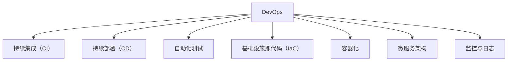

                 

# DevOps 文化：理解开发和运营的结合

## 1. 背景介绍

### 1.1 问题由来

在软件开发的过程中，开发团队和运维团队之间的协作一直是软件工程的痛点。开发人员专注于代码的编写和功能的实现，而运维人员则负责系统的部署和故障的解决，两者之间的工作内容和关注点存在较大差异，容易导致沟通不畅和协同效率低下。

为了改善这种局面，DevOps文化应运而生。DevOps（Development Operations）是一种将开发（Development）和运维（Operations）两个环节紧密结合的文化理念和方法论，旨在通过自动化和持续交付（Continuous Delivery），提高软件交付效率和系统稳定性。

### 1.2 问题核心关键点

DevOps文化强调以下关键点：

- **自动化**：通过自动化测试、自动化部署、自动化监控等手段，减少人工操作，提高效率。
- **持续交付**：通过持续集成（Continuous Integration, CI）和持续部署（Continuous Deployment, CD），缩短软件交付周期，提升交付质量。
- **跨团队协作**：打破开发和运维的壁垒，通过协作和沟通，提高团队整体效率。
- **质量控制**：通过自动化测试和代码审查等手段，保障软件质量和稳定性。
- **持续反馈**：通过日志、监控等手段，及时发现和解决问题，形成闭环反馈机制。

通过这些关键点的实现，DevOps文化能够显著提升软件开发的效率和质量，降低故障率，提升用户满意度。

## 2. 核心概念与联系

### 2.1 核心概念概述

为更好地理解DevOps文化，本节将介绍几个密切相关的核心概念：

- **DevOps**：一种文化理念和方法论，旨在通过自动化和持续交付，提高软件交付效率和系统稳定性。
- **持续集成（CI）**：通过自动化集成和测试，将代码变更快速集成到共享代码库中，并持续进行构建和测试，以确保代码质量。
- **持续部署（CD）**：通过自动化部署工具，将经过测试的代码自动部署到生产环境中，以实现快速发布和快速回滚。
- **自动化测试**：通过编写自动化测试脚本，对代码变更进行持续的测试，以确保软件质量和性能。
- **基础设施即代码（Infrastructure as Code, IaC）**：将运维操作自动化，使用代码描述基础设施配置，提升运维效率和一致性。
- **容器化**：通过Docker等容器技术，将应用和依赖打包成独立的运行环境，实现跨平台和自动化部署。
- **微服务架构**：将应用拆分成多个独立的服务，通过轻量级通信协议和自动发现机制，提升系统的扩展性和维护性。
- **监控与日志**：通过实时监控和日志记录，及时发现系统异常和性能问题，形成闭环反馈机制。

这些核心概念之间的逻辑关系可以通过以下Mermaid流程图来展示：



这个流程图展示了大语言模型的核心概念及其之间的关系：

1. DevOps文化是整个理念的起点，涵盖了持续集成、持续部署、自动化测试、IaC、容器化、微服务架构和监控与日志等多个方面。
2. 持续集成和持续部署是DevOps文化中的核心实践，通过自动化流程实现快速交付和快速回滚。
3. 自动化测试和IaC提升软件质量和运维效率，容器化和微服务架构提升系统的扩展性和维护性。
4. 监控与日志保障系统稳定性和性能，形成闭环反馈机制，不断优化软件交付流程。

## 3. 核心算法原理 & 具体操作步骤

### 3.1 算法原理概述

DevOps文化的核心在于自动化和持续交付，其理论基础包括自动化测试、持续集成和持续部署等技术。具体实现过程中，通过自动化工具链，将开发、测试、部署和运维各个环节串联起来，形成自动化流程，实现快速交付和高效运维。

形式化地，假设软件开发过程涉及多个组件，包括代码变更（A）、构建（B）、测试（C）、部署（D）和监控（E）等。DevOps的自动化流程可以表示为：

$$
\begin{align*}
\text{A} &\rightarrow \text{B} \rightarrow \text{C} \rightarrow \text{D} \rightarrow \text{E} \\
\text{A} &\leftarrow \text{D} \rightarrow \text{C} \rightarrow \text{B} \rightarrow \text{A}
\end{align*}
$$

其中箭头表示依赖关系，循环箭头表示反向依赖和闭环反馈。

### 3.2 算法步骤详解

基于DevOps文化的自动化流程，常见的操作步骤包括：

**Step 1: 开发环境搭建**

- 开发环境搭建是DevOps文化的基础，需要准备开发所需的各种工具和环境，如IDE、版本控制、自动化测试框架等。
- 使用Docker等容器技术，搭建一致的开发和测试环境，确保开发代码的兼容性。

**Step 2: 持续集成**

- 持续集成（CI）是DevOps文化的核心环节，通过自动化集成和测试，快速发现和修复代码问题。
- 使用Jenkins、Travis CI等CI工具，自动构建和运行测试用例，生成构建报告和测试报告。
- 设置CI流水线的触发条件，如代码变更、时间间隔等，实现持续的自动化集成。

**Step 3: 持续部署**

- 持续部署（CD）是将经过测试的代码自动部署到生产环境的过程，实现快速发布和快速回滚。
- 使用Jenkins、Ansible等CD工具，根据测试报告和部署策略，自动部署代码到目标环境。
- 设置CD流水线的触发条件，如构建成功、手动触发等，实现持续的自动化部署。

**Step 4: 自动化测试**

- 自动化测试是保障代码质量和性能的重要手段，通过编写自动化测试脚本，对代码变更进行持续的测试。
- 使用Selenium、JUnit等测试框架，编写单元测试、集成测试、性能测试等测试用例。
- 设置自动化测试的触发条件，如代码变更、时间间隔等，实现持续的自动化测试。

**Step 5: 基础设施即代码**

- 基础设施即代码（IaC）是DevOps文化的另一重要实践，通过代码描述基础设施配置，提升运维效率和一致性。
- 使用Terraform、Ansible等IaC工具，编写基础设施的配置文件，自动部署和管理资源。
- 设置IaC流水线的触发条件，如代码变更、时间间隔等，实现持续的自动化部署。

**Step 6: 容器化**

- 容器化是通过Docker等容器技术，将应用和依赖打包成独立的运行环境，实现跨平台和自动化部署。
- 使用Docker、Kubernetes等容器技术，将应用和依赖打包成Docker镜像，并进行自动化部署和管理。
- 设置容器化流水线的触发条件，如构建成功、时间间隔等，实现持续的自动化部署。

**Step 7: 微服务架构**

- 微服务架构是将应用拆分成多个独立的服务，通过轻量级通信协议和自动发现机制，提升系统的扩展性和维护性。
- 使用Spring Boot、Java EE等框架，将应用拆分成多个微服务，并通过RESTful API或消息队列进行通信。
- 设置微服务流水线的触发条件，如构建成功、时间间隔等，实现持续的自动化部署。

**Step 8: 监控与日志**

- 监控与日志是保障系统稳定性和性能的重要手段，通过实时监控和日志记录，及时发现和解决问题，形成闭环反馈机制。
- 使用Prometheus、Grafana等监控工具，实时监控系统性能指标和日志记录。
- 设置监控和日志流水线的触发条件，如性能异常、异常日志等，实现持续的自动化监控和日志记录。

以上是DevOps文化下的常见操作步骤，通过自动化工具链将开发、测试、部署和运维各个环节串联起来，实现快速交付和高效运维。

### 3.3 算法优缺点

DevOps文化具有以下优点：

1. **提升交付效率**：通过持续集成和持续部署，实现快速交付和快速回滚，缩短软件交付周期，提升交付质量。
2. **提高系统稳定性**：通过自动化测试和监控，及时发现和修复代码问题和系统异常，提升系统稳定性。
3. **降低开发成本**：通过自动化工具链，减少人工操作，降低开发和运维成本。
4. **增强团队协作**：打破开发和运维的壁垒，通过协作和沟通，提高团队整体效率。

同时，DevOps文化也存在一些局限性：

1. **复杂度高**：自动化流程和工具链的设置和维护较为复杂，需要一定的技术积累和实践经验。
2. **依赖工具链**：依赖特定的工具链和环境，一旦出现问题，需要及时调整和维护。
3. **易受环境变化影响**：自动化流程和工具链的设置依赖于具体环境和配置，一旦环境变化，需要及时调整和优化。
4. **安全风险**：自动化流程和工具链的使用增加了系统的安全风险，需要采取相应的安全措施。

尽管存在这些局限性，但就目前而言，DevOps文化仍是软件交付和系统运维的主流范式。未来相关研究的重点在于如何进一步降低自动化流程的复杂度，提高工具链的通用性和安全性，以及如何更好地实现自动化流程与人工干预的平衡。

### 3.4 算法应用领域

DevOps文化在软件开发和系统运维中的应用十分广泛，包括但不限于以下几个领域：

- **软件开发**：应用于软件开发的全生命周期，从需求分析、设计、编码到测试、部署、运维，实现持续交付和高效运维。
- **移动应用开发**：应用于移动应用的开发和运维，通过自动化测试和持续集成，提升移动应用的开发效率和用户体验。
- **云计算**：应用于云计算的部署和运维，通过IaC和容器化，实现快速部署和弹性伸缩。
- **大数据**：应用于大数据的开发和运维，通过持续集成和自动化部署，提升大数据的开发效率和数据质量。
- **人工智能**：应用于AI模型的开发和运维，通过自动化测试和持续集成，提升AI模型的开发效率和模型质量。

除了上述这些领域，DevOps文化还在其他诸多场景中得到了广泛应用，为软件开发和系统运维带来了新的变革。

## 4. 数学模型和公式 & 详细讲解 & 举例说明

### 4.1 数学模型构建

本节将使用数学语言对DevOps文化的自动化流程进行更加严格的刻画。

假设软件开发过程涉及多个组件，包括代码变更（A）、构建（B）、测试（C）、部署（D）和监控（E）等。

定义各个组件的执行时间和成本，分别为：

$$
\begin{align*}
T_A &= \text{代码变更时间} \\
C_A &= \text{代码变更成本} \\
T_B &= \text{构建时间} \\
C_B &= \text{构建成本} \\
T_C &= \text{测试时间} \\
C_C &= \text{测试成本} \\
T_D &= \text{部署时间} \\
C_D &= \text{部署成本} \\
T_E &= \text{监控时间} \\
C_E &= \text{监控成本}
\end{align*}
$$

DevOps自动化流程的目标是最小化总时间和总成本，即：

$$
\begin{align*}
\text{最小化总时间} &= \min(T_A + T_B + T_C + T_D + T_E) \\
\text{最小化总成本} &= \min(C_A + C_B + C_C + C_D + C_E)
\end{align*}
$$

### 4.2 公式推导过程

以下我们以最小化总时间为例，推导DevOps自动化流程的最优化问题。

首先，构建一个线性规划模型：

$$
\begin{align*}
\text{最小化} & \quad T_A + T_B + T_C + T_D + T_E \\
\text{约束条件} & \quad \text{持续集成和持续部署} \\
& \quad \text{自动化测试} \\
& \quad \text{基础设施即代码} \\
& \quad \text{容器化} \\
& \quad \text{微服务架构} \\
& \quad \text{监控与日志}
\end{align*}
$$

其中，持续集成和持续部署的约束条件为：

$$
T_D \leq T_A + T_B + T_C
$$

自动化测试的约束条件为：

$$
T_C \leq T_A + T_B
$$

基础设施即代码的约束条件为：

$$
T_E \leq T_B + T_D
$$

容器化和微服务架构的约束条件为：

$$
T_D \leq T_A + T_B + T_C
$$

监控与日志的约束条件为：

$$
T_E \leq T_B + T_D
$$

通过求解上述线性规划模型，即可找到最小化总时间的最优解。

### 4.3 案例分析与讲解

以一个典型的软件开发项目为例，分析DevOps自动化流程的实际应用。

假设该项目需要开发一个Web应用，涉及多个组件和环节，包括前端开发（A）、后端开发（B）、数据库开发（C）、前端测试（D）、后端测试（E）、数据库测试（F）、部署（G）和监控（H）等。

- **持续集成**：通过Jenkins等CI工具，自动化构建和运行测试用例，生成构建报告和测试报告，设置CI流水线的触发条件为代码变更和每日定时触发，实现持续的自动化集成和测试。
- **持续部署**：通过Jenkins等CD工具，根据测试报告和部署策略，自动部署代码到目标环境，设置CD流水线的触发条件为构建成功和手动触发，实现持续的自动化部署。
- **自动化测试**：通过Selenium、JUnit等测试框架，编写单元测试、集成测试、性能测试等测试用例，设置自动化测试的触发条件为代码变更和每日定时触发，实现持续的自动化测试。
- **基础设施即代码**：通过Terraform等IaC工具，编写基础设施的配置文件，自动部署和管理资源，设置IaC流水线的触发条件为代码变更和每日定时触发，实现持续的自动化部署。
- **容器化**：通过Docker等容器技术，将应用和依赖打包成独立的运行环境，设置容器化流水线的触发条件为构建成功和每日定时触发，实现持续的自动化部署。
- **微服务架构**：通过Spring Boot、Java EE等框架，将应用拆分成多个微服务，并通过RESTful API或消息队列进行通信，设置微服务流水线的触发条件为构建成功和每日定时触发，实现持续的自动化部署。
- **监控与日志**：通过Prometheus、Grafana等监控工具，实时监控系统性能指标和日志记录，设置监控和日志流水线的触发条件为性能异常和异常日志，实现持续的自动化监控和日志记录。

通过上述自动化流程的实施，该项目能够实现快速交付和高效运维，显著提升开发效率和系统稳定性。

## 5. 项目实践：代码实例和详细解释说明

### 5.1 开发环境搭建

在进行DevOps实践前，我们需要准备好开发环境。以下是使用Jenkins进行CI/CD流程的配置步骤：

1. 安装Jenkins：从官网下载并安装Jenkins，作为CI/CD工具。
2. 配置Jenkins环境：配置Jenkins环境变量，如JAVA_HOME、Maven_HOME等。
3. 安装插件：安装必要的Jenkins插件，如Pipeline插件、Git插件、Maven插件等。
4. 配置代码仓库：配置代码仓库信息，如Git仓库地址、分支等。
5. 配置CI流水线：编写CI流水线脚本，定义构建和测试步骤。

### 5.2 源代码详细实现

下面以Web应用开发项目为例，给出使用Jenkins进行CI/CD流程的Python代码实现。

首先，定义CI流水线脚本：

```python
pipeline {
    agent any
    stages {
        stage('构建') {
            steps {
                sh 'mvn package'
            }
        }
        stage('测试') {
            steps {
                sh 'mvn test'
            }
        }
        stage('部署') {
            steps {
                withCredentials('kubernetesCredentials') {
                    sh 'kubectl apply -f .'
                }
            }
        }
    }
}
```

然后，配置Jenkins环境：

```python
hudson.util.FormValidation.validate('${JAVA_HOME}') 
hudson.util.FormValidation.validate('${MVN_HOME}') 
hudson.util.FormValidation.validate('${M2_HOME}')
hudson.util.FormValidation.validate('${GIT_URL}') 
hudson.util.FormValidation.validate('${GIT_BRANCH}') 
hudson.util.FormValidation.validate('${KUBERNETES_USERNAME}') 
hudson.util.FormValidation.validate('${KUBERNETES_PASSWORD}')
```

最后，启动Jenkins并验证CI流水线是否正常运行：

```python
pipeline {
    agent any
    stages {
        stage('构建') {
            steps {
                sh 'mvn package'
            }
        }
        stage('测试') {
            steps {
                sh 'mvn test'
            }
        }
        stage('部署') {
            steps {
                withCredentials('kubernetesCredentials') {
                    sh 'kubectl apply -f .'
                }
            }
        }
    }
}
```

以上就是使用Jenkins进行Web应用开发项目CI/CD流程的完整代码实现。可以看到，通过编写Jenkins流水线脚本，可以方便地实现持续集成和持续部署，提升开发效率和系统稳定性。

### 5.3 代码解读与分析

让我们再详细解读一下关键代码的实现细节：

**Pipeline脚本**：
- `pipeline`关键字定义了整个流水线。
- `agent any`表示使用任意的代理执行流水线。
- `stages`关键字定义了流水线的多个阶段，包括构建、测试、部署等。
- `steps`关键字定义了每个阶段的具体操作。

**Jenkins环境配置**：
- 使用`validate`方法验证环境变量是否正确设置。
- 分别验证了Java环境、Maven环境、Git仓库地址、分支、Kubernetes用户名和密码等关键变量。

**Jenkins环境验证**：
- 使用`pipeline`关键字定义整个流水线。
- `stages`关键字定义了流水线的多个阶段，包括构建、测试、部署等。
- `steps`关键字定义了每个阶段的具体操作。

通过上述步骤，即可在Jenkins上搭建CI/CD流水线，实现Web应用开发项目的自动化流程。开发者可以将更多精力放在业务逻辑开发上，而不必过多关注底层的CI/CD流程。

当然，工业级的系统实现还需考虑更多因素，如流水线的监控、告警、异常处理等。但核心的CI/CD流程基本与此类似。

## 6. 实际应用场景

### 6.1 软件开发

DevOps文化在软件开发中的应用十分广泛，可以应用于软件开发的全生命周期，从需求分析、设计、编码到测试、部署、运维，实现持续交付和高效运维。

在技术实现上，可以构建持续集成流水线，实现代码的自动化构建、测试和部署，提升开发效率和系统稳定性。

### 6.2 移动应用开发

DevOps文化在移动应用开发中的应用，通过自动化测试和持续集成，提升移动应用的开发效率和用户体验。

在技术实现上，可以构建持续集成流水线，实现移动应用的自动化构建、测试和部署，提升开发效率和应用质量。

### 6.3 云计算

DevOps文化在云计算中的应用，通过基础设施即代码和容器化技术，实现快速部署和弹性伸缩。

在技术实现上，可以构建持续集成流水线，实现云计算环境的自动化部署和运维，提升资源利用率和系统稳定性。

### 6.4 大数据

DevOps文化在大数据中的应用，通过持续集成和自动化部署，提升大数据的开发效率和数据质量。

在技术实现上，可以构建持续集成流水线，实现大数据的自动化构建、测试和部署，提升数据处理效率和数据质量。

### 6.5 人工智能

DevOps文化在人工智能中的应用，通过自动化测试和持续集成，提升AI模型的开发效率和模型质量。

在技术实现上，可以构建持续集成流水线，实现AI模型的自动化构建、测试和部署，提升模型开发效率和模型质量。

## 7. 工具和资源推荐

### 7.1 学习资源推荐

为了帮助开发者系统掌握DevOps文化的理论基础和实践技巧，这里推荐一些优质的学习资源：

1. **《DevOps实践指南》**：由Bryan Sullivan和John Willis所著，全面介绍了DevOps文化的概念、实践和工具，适合初学者入门。
2. **《CI/CD最佳实践》**：由Christopher Quinn所著，详细讲解了CI/CD的原理、工具和最佳实践，适合有一定基础的开发者。
3. **《Docker实战》**：由Docker公司编写，详细介绍了Docker容器技术的原理和应用，适合容器化部署的学习。
4. **《Kubernetes权威指南》**：由Brian Griner和Aaron Newland所著，详细讲解了Kubernetes的原理、工具和最佳实践，适合Kubernetes部署的学习。
5. **《Jenkins官方文档》**：Jenkins官方文档，提供了丰富的教程和示例，适合Jenkins配置和使用的学习。
6. **《Prometheus官方文档》**：Prometheus官方文档，提供了丰富的教程和示例，适合Prometheus监控的学习。

通过对这些资源的学习实践，相信你一定能够快速掌握DevOps文化的精髓，并用于解决实际的软件开发和系统运维问题。

### 7.2 开发工具推荐

高效的开发离不开优秀的工具支持。以下是几款用于DevOps实践开发的常用工具：

1. **Jenkins**：开源的CI/CD工具，支持多种插件和自动化流程，适合构建持续集成和持续部署流水线。
2. **GitLab**：开源的Git仓库和CI/CD平台，提供丰富的开发和运维工具，适合软件开发和系统运维的集成。
3. **Docker**：开源的容器化技术，将应用和依赖打包成独立的运行环境，适合跨平台和自动化部署。
4. **Kubernetes**：开源的容器编排平台，支持动态伸缩和自动化部署，适合云计算和微服务架构的部署。
5. **Prometheus**：开源的监控工具，提供实时的性能指标和告警，适合监控和日志记录。
6. **Grafana**：开源的可视化工具，与Prometheus等监控工具集成，适合监控数据的可视化展示。
7. **JIRA**：开源的项目管理工具，提供丰富的任务管理和跟踪功能，适合团队协作和项目管理。

合理利用这些工具，可以显著提升DevOps实践的开发效率，加快创新迭代的步伐。

### 7.3 相关论文推荐

DevOps文化的发展源于学界的持续研究。以下是几篇奠基性的相关论文，推荐阅读：

1. **《Continuous Delivery: Reliable Software Releases through Automated Testing》**：由Jez Humble和David Farley所著，详细介绍了持续交付的概念和实现方法。
2. **《The DevOps Handbook》**：由Gene Kim、Patrick Debois和John Willis所著，全面介绍了DevOps文化的概念、实践和工具，适合深入学习。
3. **《Infrastructure as Code: The Future of Cloud Computing》**：由Brian Sullivan所著，详细介绍了基础设施即代码的概念和实现方法。
4. **《Docker: The Definitive Guide》**：由Docker公司编写，详细介绍了Docker容器技术的原理和应用。
5. **《Kubernetes: Up and Running》**：由Bryan Sullivan和Rohini Rao所著，详细讲解了Kubernetes的原理、工具和最佳实践。

这些论文代表了大规模语言模型微调技术的发展脉络。通过学习这些前沿成果，可以帮助研究者把握学科前进方向，激发更多的创新灵感。

## 8. 总结：未来发展趋势与挑战

### 8.1 总结

本文对DevOps文化的自动化流程进行了全面系统的介绍。首先阐述了DevOps文化的背景和意义，明确了持续集成、持续部署、自动化测试、IaC、容器化、微服务架构和监控与日志等多个关键点的实践方法。其次，从原理到实践，详细讲解了DevOps文化的具体操作步骤，给出了DevOps文化在软件开发、移动应用开发、云计算、大数据、人工智能等多个领域的应用实例。

通过本文的系统梳理，可以看到，DevOps文化已经广泛应用于软件开发和系统运维的各个环节，显著提升了开发效率和系统稳定性。未来，随着DevOps实践的不断演进，软件开发和系统运维将朝着更加自动化、高效化和安全化的方向发展。

### 8.2 未来发展趋势

展望未来，DevOps文化将呈现以下几个发展趋势：

1. **持续集成和持续部署**：持续集成和持续部署将继续发展，成为软件开发和系统运维的标准流程，实现快速交付和高效运维。
2. **自动化测试和监控**：自动化测试和监控将得到广泛应用，保障软件质量和系统稳定性，提高开发效率和用户满意度。
3. **基础设施即代码**：基础设施即代码将继续发展，提升运维效率和一致性，实现资源自动化管理和部署。
4. **容器化和微服务架构**：容器化和微服务架构将继续发展，提升系统的扩展性和维护性，实现快速部署和弹性伸缩。
5. **云原生技术**：云原生技术将继续发展，实现服务的自描述、自发现和自伸缩，提升云服务的可扩展性和可维护性。
6. **DevSecOps**：DevSecOps将得到广泛应用，将安全融入持续集成和持续部署流程，提升系统的安全性和可靠性。

以上趋势凸显了DevOps文化的广阔前景。这些方向的探索发展，必将进一步提升软件开发和系统运维的效率和质量，推动软件工程向更加自动化、高效化和安全化的方向发展。

### 8.3 面临的挑战

尽管DevOps文化已经取得了显著成效，但在迈向更加智能化、普适化应用的过程中，它仍面临着诸多挑战：

1. **复杂度高**：自动化流程和工具链的设置和维护较为复杂，需要一定的技术积累和实践经验。
2. **依赖工具链**：依赖特定的工具链和环境，一旦出现问题，需要及时调整和维护。
3. **易受环境变化影响**：自动化流程和工具链的设置依赖于具体环境和配置，一旦环境变化，需要及时调整和优化。
4. **安全风险**：自动化流程和工具链的使用增加了系统的安全风险，需要采取相应的安全措施。
5. **成本高**：自动化流程和工具链的设置和维护需要一定的成本投入，需要权衡成本与收益。

尽管存在这些挑战，但就目前而言，DevOps文化仍是软件开发和系统运维的主流范式。未来相关研究的重点在于如何进一步降低自动化流程的复杂度，提高工具链的通用性和安全性，以及如何更好地实现自动化流程与人工干预的平衡。

### 8.4 研究展望

面对DevOps文化所面临的挑战，未来的研究需要在以下几个方面寻求新的突破：

1. **简化自动化流程**：通过优化自动化流程和工具链的设置，降低复杂度，提升易用性。
2. **提升工具链的通用性**：开发更加通用的自动化工具和框架，提高工具链的适用范围和兼容性。
3. **增强安全性**：将安全融入自动化流程和工具链的设计和实现，保障系统的安全性和可靠性。
4. **降低成本**：优化自动化流程和工具链的设置和维护，降低成本投入，提高经济效益。
5. **增强可解释性**：提升自动化流程和工具链的可解释性，帮助开发者更好地理解其内部工作机制和决策逻辑。

这些研究方向的探索，必将引领DevOps文化向更高的台阶，为软件开发和系统运维带来新的变革。唯有从自动化流程、工具链、安全、成本、可解释性等多个维度协同发力，才能真正实现软件开发和系统运维的自动化、高效化和安全化。

## 9. 附录：常见问题与解答

**Q1：DevOps文化与敏捷开发有什么区别？**

A: DevOps文化和敏捷开发都是提高软件开发效率和质量的方法论，但两者关注的重点有所不同。敏捷开发更侧重于团队协作和快速迭代，而DevOps文化则更侧重于自动化和持续交付。DevOps文化通过持续集成和持续部署，实现快速交付和高效运维，从而提升软件交付效率和系统稳定性。

**Q2：DevOps文化是否适用于所有的软件开发团队？**

A: DevOps文化适用于大多数软件开发团队，尤其是大型和复杂的软件项目。它通过自动化和持续交付，提升开发效率和系统稳定性，适用于快速交付和高效运维的场景。但对于一些小型或简单的项目，或者开发流程较为简单的团队，DevOps文化的引入可能不如敏捷开发来得高效。

**Q3：如何选择合适的CI/CD工具？**

A: 选择合适的CI/CD工具需要考虑以下几个因素：

- **易用性**：工具的易用性和学习成本，是否易于配置和使用。
- **扩展性**：工具的扩展性和兼容性，是否支持多种开发语言和框架。
- **集成性**：工具的集成能力和API接口，是否易于与其他工具和系统集成。
- **性能**：工具的性能和稳定性，是否能支持高并发和大规模部署。
- **社区支持**：工具的社区支持和文档资料，是否丰富和活跃。

根据这些因素，可以选择适合自己的CI/CD工具，如Jenkins、GitLab CI、Travis CI等。

**Q4：如何提升DevOps文化的安全性？**

A: 提升DevOps文化的安全性可以从以下几个方面入手：

- **权限控制**：通过设置严格的权限控制，限制对敏感资源的访问权限。
- **代码审查**：通过代码审查和静态分析工具，及时发现和修复安全漏洞。
- **自动化安全测试**：通过自动化安全测试工具，对代码和系统进行定期的安全扫描和测试。
- **漏洞管理**：通过漏洞管理工具，及时修复已知的漏洞和安全问题。
- **安全培训**：对团队成员进行安全培训，提高安全意识和技能。

通过这些措施，可以提升DevOps文化的安全性和可靠性，保障系统的安全运行。

**Q5：如何降低DevOps文化的复杂度？**

A: 降低DevOps文化的复杂度可以从以下几个方面入手：

- **简化自动化流程**：通过优化自动化流程和工具链的设置，降低复杂度，提升易用性。
- **标准化配置**：通过标准化配置和模板，减少配置复杂度和出错概率。
- **模块化设计**：通过模块化设计和组件化构建，降低复杂度和维护成本。
- **自动化测试**：通过自动化测试工具，减少人工操作和出错概率。
- **持续反馈**：通过持续反馈机制，及时发现和解决问题，优化自动化流程。

通过这些措施，可以降低DevOps文化的复杂度，提高开发和运维效率。

---

作者：禅与计算机程序设计艺术 / Zen and the Art of Computer Programming

