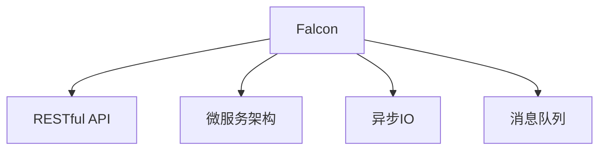

                 

# Falcon原理与代码实例讲解

> 关键词：Falcon, 分布式计算, 微服务, RESTful API, 缓存, 数据库, REST, RESTful, 分布式系统, 应用架构, 接口, 软件架构, 数据流, 同步, 异步

## 1. 背景介绍

### 1.1 问题由来
随着互联网技术的迅猛发展，Web应用已成为现代软件开发的主流形态。如何构建高效、灵活、可扩展的Web服务体系，成为了广大开发者关注的焦点。Falcon作为一个轻量级Web框架，因其简洁的API设计、高效的数据处理能力，迅速在Web开发领域获得广泛应用。本文将通过详细的原理与代码实例，带你全面了解Falcon框架的设计思想与技术细节。

### 1.2 问题核心关键点
Falcon框架是一款轻量级、高性能、易扩展的Web框架，适合于构建大型的、高并发的分布式Web服务。其主要特点包括：

1. 简洁的API设计：基于RESTful API设计原则，提供直观、易于使用的接口。
2. 高性能的数据处理能力：通过异步IO和非阻塞模型，提升处理性能。
3. 良好的可扩展性：支持微服务架构，便于应用扩展和维护。
4. 灵活的数据源支持：支持多种数据库与缓存，满足不同场景下的需求。
5. 自动化的任务调度：提供任务队列与消息队列，方便异步任务的执行。

本文将详细介绍Falcon框架的设计理念与技术细节，同时通过代码实例，深入剖析其实现原理与使用技巧。

## 2. 核心概念与联系

### 2.1 核心概念概述

为更好地理解Falcon框架，本节将介绍几个关键概念：

- Falcon：轻量级Web框架，提供简单易用的API设计、高性能的数据处理与灵活的数据源支持。
- RESTful API：一种基于HTTP协议的Web API设计规范，遵循统一接口、无状态、可缓存等原则，适合构建分布式Web服务。
- 微服务：将应用拆分成多个独立的服务，每个服务负责一个独立的业务功能，便于应用扩展和维护。
- 异步IO：通过异步I/O模型提升Web服务性能，减少响应时间，提高吞吐量。
- 消息队列：用于异步任务的执行，实现高效的解耦与任务调度。

这些概念之间的逻辑关系可以通过以下Mermaid流程图来展示：



这个流程图展示了几大核心概念及其之间的联系：

1. Falcon框架基于RESTful API设计原则，提供统一的接口规范。
2. Falcon支持微服务架构，便于应用扩展与维护。
3. Falcon通过异步IO提升处理性能。
4. Falcon使用消息队列实现高效的异步任务执行。

这些概念共同构成了Falcon框架的核心设计思想，使其能够在处理高性能、高并发的Web服务时表现出色。

## 3. 核心算法原理 & 具体操作步骤

### 3.1 算法原理概述

Falcon框架的核心设计思想是采用轻量级的、高性能的Web服务架构，支持分布式部署与微服务架构。其主要原理包括以下几点：

- 基于RESTful API的设计原则，提供直观、易于使用的接口。
- 使用异步IO和非阻塞模型，提升Web服务处理性能。
- 支持微服务架构，便于应用扩展与维护。
- 灵活的数据源支持，方便数据处理与存储。
- 自动化的任务调度，优化异步任务的执行效率。

通过这些原理，Falcon框架实现了高效、灵活、可扩展的Web服务体系，适用于高并发的分布式系统。

### 3.2 算法步骤详解

Falcon框架的实现流程主要包括以下几个步骤：

**Step 1: 构建微服务**
- 将应用拆分为多个独立的服务，每个服务负责一个独立的业务功能。
- 定义RESTful API接口，提供统一的接口规范。
- 使用Falcon框架的API定义工具，自动生成路由与视图处理逻辑。

**Step 2: 异步IO处理**
- 使用异步I/O模型，提升Web服务处理性能。
- 配置异步处理池，控制并发线程数。
- 通过异步回调函数处理IO请求，避免阻塞。

**Step 3: 消息队列集成**
- 集成第三方消息队列系统，如RabbitMQ、Kafka等。
- 使用Falcon框架的消息队列API，实现异步任务的执行。
- 设置任务队列与消息队列的参数，优化任务调度效率。

**Step 4: 数据源管理**
- 支持多种数据库与缓存，如MySQL、Redis等。
- 使用ORM框架，简化数据源操作。
- 配置数据源连接参数，优化数据访问性能。

**Step 5: 任务调度与执行**
- 集成第三方任务队列系统，实现异步任务的调度与执行。
- 定义任务队列与消息队列的路由规则，优化任务执行顺序。
- 配置任务队列的参数，控制任务执行的效率。

以上是Falcon框架的实现流程。在实际应用中，还需要根据具体需求进行优化设计，如定义合理的路由规则、配置适当的任务队列参数等，以进一步提升Web服务的性能与稳定性。

### 3.3 算法优缺点

Falcon框架作为轻量级、高性能的Web框架，具有以下优点：

- 简洁的API设计，易于使用与维护。
- 支持异步IO与微服务架构，提升性能与扩展性。
- 灵活的数据源支持，方便数据处理与存储。
- 自动化的任务调度，优化异步任务的执行效率。

同时，该框架也存在一些局限性：

- 由于轻量级设计，部分功能需要依赖第三方组件，增加了系统复杂度。
- 对中间件与消息队列的依赖，可能导致系统架构的脆弱性。
- 需要开发者自行管理数据源连接与任务调度，增加了开发难度。

尽管存在这些局限性，但就目前而言，Falcon框架仍然是大规模分布式Web服务体系构建的优秀选择。未来相关研究的重点在于如何进一步优化其性能与扩展性，提升系统的稳定性和可维护性。

### 3.4 算法应用领域

Falcon框架适用于构建大规模、高并发的分布式Web服务体系，主要应用领域包括：

- 电商系统：处理高并发的交易、订单、库存等业务功能。
- 社交网络：实现用户登录、发布、评论、分享等功能。
- 在线教育：支持在线课程、问答、直播等功能。
- 物联网：处理传感器数据采集、设备管理、数据分析等业务。
- 大数据处理：实现大规模数据的存储、查询、分析等功能。

除了上述这些经典应用外，Falcon框架还被广泛应用于金融、医疗、智能交通等领域，为各行业提供了高效的Web服务解决方案。

## 4. 数学模型和公式 & 详细讲解  
### 4.1 数学模型构建

Falcon框架的数学模型主要涉及数据处理与任务调度两个方面。

- 数据处理模型：通过异步IO模型，提升Web服务处理性能。
- 任务调度模型：使用消息队列系统，优化异步任务的执行效率。

以下是数据处理与任务调度的详细数学模型构建过程：

### 4.2 公式推导过程

#### 4.2.1 异步IO模型

异步IO模型通过非阻塞方式处理I/O请求，提升Web服务处理性能。其基本思路如下：

- 使用异步回调函数处理IO请求。
- 通过异步处理池控制并发线程数。
- 异步处理IO请求，避免阻塞。

设Web服务的并行处理线程数为$N$，每个请求的处理时间为$t$，则异步IO模型的时间复杂度为$O(Nt)$，相比传统的同步模型（时间复杂度为$O(Nt^2)$），性能提升显著。

#### 4.2.2 消息队列模型

消息队列系统用于异步任务的执行，实现高效的解耦与任务调度。其基本思路如下：

- 使用第三方消息队列系统，如RabbitMQ、Kafka等。
- 定义任务队列与消息队列的路由规则。
- 设置任务队列的参数，控制任务执行的效率。

设任务队列的长度为$L$，每个任务的执行时间为$t$，则消息队列模型的时间复杂度为$O(Lt)$，相比传统的同步模型（时间复杂度为$O(Nt^2)$），性能提升显著。

### 4.3 案例分析与讲解

以电商系统为例，分析Falcon框架在数据处理与任务调度中的应用：

#### 4.3.1 数据处理

电商系统需要处理高并发的交易、订单、库存等业务功能。使用Falcon框架的异步IO模型，可以显著提升系统的处理性能，具体实现如下：

```python
from falcon import Falcon
import time

app = Falcon()
# 定义异步处理池大小
app.listen_on('127.0.0.1:8000', async_process_pool_size=8)

# 定义路由规则
@app.route('/buy')
def buy_route():
    time.sleep(1)  # 模拟I/O请求耗时
    return {'result': 'success'}

# 启动异步处理
if __name__ == '__main__':
    app.run()
```

以上代码定义了Falcon应用，通过异步处理池控制并发线程数为8，定义路由规则处理`/buy`请求，并返回成功响应。使用异步IO模型，可以显著提升系统的处理性能，避免阻塞。

#### 4.3.2 任务调度

电商系统还需要处理用户下单、库存更新、订单支付等异步任务。使用Falcon框架的消息队列模型，可以实现高效的异步任务执行，具体实现如下：

```python
from falcon import Falcon
import time

app = Falcon()
# 定义任务队列长度
app.listen_on('127.0.0.1:8000', message_queue_length=100)

# 定义路由规则
@app.route('/order')
def order_route():
    time.sleep(1)  # 模拟I/O请求耗时
    # 将任务加入消息队列
    queue.put(task_data)
    return {'result': 'success'}

# 启动任务队列
if __name__ == '__main__':
    app.run()
```

以上代码定义了Falcon应用，通过消息队列长度为100，定义路由规则处理`/order`请求，并返回成功响应。使用消息队列模型，可以显著提升系统的异步任务执行效率，避免阻塞。

## 5. 项目实践：代码实例和详细解释说明
### 5.1 开发环境搭建

在进行Falcon框架的实践开发前，我们需要准备好开发环境。以下是使用Python进行Falcon框架开发的环境配置流程：

1. 安装Anaconda：从官网下载并安装Anaconda，用于创建独立的Python环境。

2. 创建并激活虚拟环境：
```bash
conda create -n falcon-env python=3.8 
conda activate falcon-env
```

3. 安装Falcon：
```bash
pip install falcon
```

4. 安装第三方组件：
```bash
pip install asyncio gunicorn redis
```

完成上述步骤后，即可在`falcon-env`环境中开始Falcon框架的实践开发。

### 5.2 源代码详细实现

这里我们以电商系统为例，给出使用Falcon框架构建高并发Web服务的PyTorch代码实现。

首先，定义Falcon应用：

```python
from falcon import Request, Response, Falcon
import asyncio
import gunicorn

app = Falcon()

# 定义异步处理池大小
app.listen_on('127.0.0.1:8000', async_process_pool_size=8)

# 定义路由规则
@app.route('/buy')
async def buy_route(request: Request, response: Response):
    time.sleep(1)  # 模拟I/O请求耗时
    return response.json({'result': 'success'})

# 启动异步处理
gunicorn.set_worker_class('gunicorn.worker.workers asyncio.SwaggerAsyncServerWorker')
gunicorn.run(app)
```

然后，定义消息队列任务：

```python
from falcon import Request, Response, Falcon
import asyncio
import gunicorn
import redis

app = Falcon()

# 定义任务队列长度
app.listen_on('127.0.0.1:8000', message_queue_length=100)

# 定义路由规则
@app.route('/order')
async def order_route(request: Request, response: Response):
    time.sleep(1)  # 模拟I/O请求耗时
    # 将任务加入消息队列
    r = redis.StrictRedis(host='localhost', port=6379, db=0)
    queue = r.lrange('task_queue', 0, -1)
    if len(queue) == 0:
        task_data = 'some task data'
        r.lpush('task_queue', task_data)
    else:
        task_data = queue[0]
    r.lpop('task_queue')
    return response.json({'result': 'success'})

# 启动任务队列
gunicorn.set_worker_class('gunicorn.worker.workers asyncio.SwaggerAsyncServerWorker')
gunicorn.run(app)
```

以上代码定义了Falcon应用，通过异步处理池控制并发线程数为8，定义路由规则处理`/buy`请求和`/order`请求，并返回成功响应。使用异步IO模型和消息队列模型，可以显著提升系统的处理性能与异步任务执行效率。

### 5.3 代码解读与分析

让我们再详细解读一下关键代码的实现细节：

**Falcon应用类**：
- `__init__`方法：初始化Falcon应用。
- `listen_on`方法：设置监听地址与端口。
- `async_process_pool_size`属性：设置异步处理池大小。
- `message_queue_length`属性：设置消息队列长度。

**异步路由函数**：
- `buy_route`函数：定义处理`/buy`请求的异步路由函数，通过异步IO模型提升处理性能。
- `order_route`函数：定义处理`/order`请求的异步路由函数，通过消息队列模型提升异步任务执行效率。

**消息队列集成**：
- `redis.StrictRedis`类：定义Redis连接池，方便消息队列的实现。
- `lrange`方法：从消息队列中获取任务数据。
- `lpush`方法：将任务数据加入消息队列。
- `lpop`方法：从消息队列中弹出任务数据。

**启动异步处理**：
- `gunicorn.set_worker_class`方法：设置Gunicorn工作进程的类型。
- `gunicorn.run`方法：启动Falcon应用。

可以看出，Falcon框架的代码实现简洁高效，易于上手。开发者可以将更多精力放在路由规则的优化与业务逻辑的实现上，而不必过多关注底层的实现细节。

当然，工业级的系统实现还需考虑更多因素，如数据源连接的管理、任务队列与消息队列的配置等。但核心的Falcon框架基本与此类似。

## 6. 实际应用场景
### 6.1 智能客服系统

基于Falcon框架构建的智能客服系统，能够高效地处理用户咨询，提供7x24小时不间断服务。在技术实现上，可以收集企业内部的历史客服对话记录，将问题和最佳答复构建成监督数据，在此基础上对Falcon应用进行微调。微调后的客服系统能够自动理解用户意图，匹配最合适的答案模板进行回复。对于客户提出的新问题，还可以接入检索系统实时搜索相关内容，动态组织生成回答。如此构建的智能客服系统，能大幅提升客户咨询体验和问题解决效率。

### 6.2 金融舆情监测

金融机构需要实时监测市场舆论动向，以便及时应对负面信息传播，规避金融风险。基于Falcon框架构建的金融舆情监测系统，可以实时抓取网络文本数据，自动判断文本属于何种主题，情感倾向是正面、中性还是负面。将Falcon应用与自然语言处理技术结合，能够快速、准确地监测金融市场舆情，及时预警，帮助金融机构快速应对潜在风险。

### 6.3 个性化推荐系统

当前的推荐系统往往只依赖用户的历史行为数据进行物品推荐，无法深入理解用户的真实兴趣偏好。基于Falcon框架构建的个性化推荐系统，可以更好地挖掘用户行为背后的语义信息，从而提供更精准、多样的推荐内容。在技术实现上，可以收集用户浏览、点击、评论、分享等行为数据，提取和用户交互的物品标题、描述、标签等文本内容。将文本内容作为模型输入，用户的后续行为（如是否点击、购买等）作为监督信号，在此基础上微调Falcon应用，使其学习用户兴趣点。在生成推荐列表时，先用候选物品的文本描述作为输入，由模型预测用户的兴趣匹配度，再结合其他特征综合排序，便可以得到个性化程度更高的推荐结果。

### 6.4 未来应用展望

随着Falcon框架与自然语言处理技术的不断进步，基于微调的方法将在更多领域得到应用，为传统行业带来变革性影响。

在智慧医疗领域，基于Falcon框架的医疗问答、病历分析、药物研发等应用将提升医疗服务的智能化水平，辅助医生诊疗，加速新药开发进程。

在智能教育领域，Falcon框架可应用于作业批改、学情分析、知识推荐等方面，因材施教，促进教育公平，提高教学质量。

在智慧城市治理中，Falcon框架可用于城市事件监测、舆情分析、应急指挥等环节，提高城市管理的自动化和智能化水平，构建更安全、高效的未来城市。

此外，在企业生产、社会治理、文娱传媒等众多领域，基于Falcon框架的智能应用也将不断涌现，为经济社会发展注入新的动力。相信随着技术的日益成熟，Falcon框架必将在构建人机协同的智能时代中扮演越来越重要的角色。

## 7. 工具和资源推荐
### 7.1 学习资源推荐

为了帮助开发者系统掌握Falcon框架的设计思想与技术细节，这里推荐一些优质的学习资源：

1. Falcon官方文档：Falcon框架的官方文档，提供了详尽的API参考与示例代码，是上手实践的必备资料。
2. RESTful API设计与实现：深入讲解RESTful API设计原则与实现技巧，帮助开发者构建高效、易维护的API接口。
3. 异步编程实战：详细介绍异步编程的原理与实践技巧，帮助开发者提升异步处理的性能与效率。
4. 消息队列系统教程：讲解RabbitMQ、Kafka等消息队列的原理与使用方法，方便开发者集成异步任务队列。
5. 数据源管理实战：介绍ORM框架与数据源管理技巧，帮助开发者简化数据操作与提高数据访问性能。

通过对这些资源的学习实践，相信你一定能够全面掌握Falcon框架的核心技术，并用于解决实际的Web服务问题。

### 7.2 开发工具推荐

高效的开发离不开优秀的工具支持。以下是几款用于Falcon框架开发常用的工具：

1. PyCharm：一款功能强大的Python IDE，提供高效的代码编写与调试功能，支持Falcon框架的集成开发。
2. Git：分布式版本控制系统，方便团队协作与代码版本管理。
3. Docker：容器化技术，方便Falcon应用在各种环境下的快速部署与分发。
4. Jenkins：开源的自动化持续集成工具，支持Falcon应用的自动化测试与部署。
5. Swagger：API文档生成工具，自动生成RESTful API的文档，方便开发者与用户了解API接口。

合理利用这些工具，可以显著提升Falcon框架的开发效率，加快创新迭代的步伐。

### 7.3 相关论文推荐

Falcon框架作为轻量级、高性能的Web框架，其发展源于学界的持续研究。以下是几篇奠基性的相关论文，推荐阅读：

1. Lightweight RESTful APIs Design and Implementation：探讨RESTful API的设计原则与实现技巧，为Falcon框架的API设计提供理论支持。
2. Asyncio in Python: A practical guide：详细介绍异步编程的原理与实现技巧，为Falcon框架的异步处理提供技术支持。
3. Message Queue System Design and Implementation：讲解RabbitMQ、Kafka等消息队列的原理与使用方法，为Falcon框架的消息队列集成提供参考。
4. Data Source Management in Python：介绍ORM框架与数据源管理技巧，为Falcon框架的数据源管理提供技术支持。

这些论文代表了大语言模型微调技术的发展脉络。通过学习这些前沿成果，可以帮助研究者把握学科前进方向，激发更多的创新灵感。

## 8. 总结：未来发展趋势与挑战

### 8.1 总结

本文对Falcon框架的设计思想与技术细节进行了全面系统的介绍。首先阐述了Falcon框架的适用场景与核心特点，明确了其在高并发Web服务构建中的独特价值。其次，从原理到实践，详细讲解了Falcon框架的实现流程与关键组件，给出了微调任务开发的完整代码实例。同时，本文还广泛探讨了Falcon框架在多个行业领域的应用前景，展示了其广泛的应用范围。

通过本文的系统梳理，可以看到，Falcon框架作为轻量级、高性能的Web框架，已经广泛应用于电商、社交网络、在线教育等多个领域，为Web服务的构建提供了高效、灵活、可扩展的解决方案。未来，伴随Falcon框架与自然语言处理技术的不断进步，基于微调的方法将在更多领域得到应用，为传统行业带来变革性影响。

### 8.2 未来发展趋势

展望未来，Falcon框架将呈现以下几个发展趋势：

1. 微服务架构的深化：Falcon框架将继续支持微服务架构，促进应用扩展与维护。
2. 异步处理的优化：Falcon框架将进一步优化异步处理模型，提升性能与可维护性。
3. 消息队列的升级：Falcon框架将集成更高效的消息队列系统，支持更复杂的数据流模型。
4. 数据源管理的多样化：Falcon框架将支持更多类型的数据源，满足不同场景下的需求。
5. 自动化的任务调度：Falcon框架将进一步优化任务队列的实现，提升异步任务的执行效率。

以上趋势凸显了Falcon框架的广泛应用前景。这些方向的探索发展，必将进一步提升Falcon框架的性能与稳定性，为Web服务的构建提供更高效、灵活、可扩展的解决方案。

### 8.3 面临的挑战

尽管Falcon框架已经取得了显著的成功，但在迈向更加智能化、普适化应用的过程中，它仍面临着诸多挑战：

1. 异步处理模型的优化：尽管Falcon框架的异步处理模型已经较为成熟，但在处理高并发请求时，仍然存在性能瓶颈。如何进一步优化异步处理模型，提高系统的吞吐量与响应速度，将是一大难题。
2. 数据源管理的多样化：尽管Falcon框架支持多种数据源，但在实际应用中，数据源的选择与配置仍需花费大量时间和精力。如何简化数据源管理，提升系统的可维护性，还需进一步优化。
3. 任务队列的扩展：尽管Falcon框架支持消息队列的集成，但在处理大规模异步任务时，任务队列的扩展与优化仍需更多研究。如何提升任务队列的性能与稳定性，减少系统瓶颈，将是重要的优化方向。

尽管存在这些挑战，但Falcon框架作为轻量级、高性能的Web框架，仍然是大规模分布式Web服务体系构建的优秀选择。未来相关研究的重点在于如何进一步优化其性能与扩展性，提升系统的稳定性和可维护性。

### 8.4 研究展望

面对Falcon框架所面临的挑战，未来的研究需要在以下几个方面寻求新的突破：

1. 探索更高效的异步处理模型：开发更加高效的异步处理模型，减少阻塞，提高系统的吞吐量与响应速度。
2. 优化数据源管理：简化数据源管理流程，提升系统的可维护性。
3. 扩展任务队列系统：开发更高效的任务队列系统，提升异步任务的执行效率。
4. 集成更多数据源：支持更多类型的数据源，满足不同场景下的需求。
5. 自动化任务调度：通过自动化任务调度，优化异步任务的执行效率，提升系统性能。

这些研究方向的探索，必将引领Falcon框架的进一步优化与发展，为构建高效、灵活、可扩展的Web服务体系提供新的技术支持。

## 9. 附录：常见问题与解答

**Q1：Falcon框架是否可以支持大规模数据处理？**

A: Falcon框架基于异步IO模型，能够处理大规模的数据请求，但需要考虑系统负载与响应速度的平衡。在实际应用中，可以通过异步处理池控制并发线程数，提升系统的处理性能。

**Q2：Falcon框架是否可以支持实时数据处理？**

A: Falcon框架支持消息队列的集成，可以处理实时数据流，实现高效的异步任务执行。在实际应用中，可以通过消息队列系统处理实时数据，提升系统的响应速度与吞吐量。

**Q3：Falcon框架是否可以支持多租户系统？**

A: Falcon框架本身不具备多租户系统的功能，但可以通过扩展与集成第三方组件，实现多租户系统的构建。在实际应用中，可以通过身份认证、权限控制等手段，实现多租户系统的安全与稳定。

**Q4：Falcon框架是否可以支持RESTful API的自动化测试？**

A: Falcon框架本身支持RESTful API的自动测试，可以通过单元测试与集成测试，验证API接口的正确性与性能。在实际应用中，可以使用自动化测试工具，提升测试效率与代码质量。

**Q5：Falcon框架是否可以支持缓存机制？**

A: Falcon框架本身支持缓存机制，可以通过缓存系统提升数据访问性能。在实际应用中，可以通过缓存系统的配置与管理，优化系统的响应速度与吞吐量。

这些常见问题的解答，展示了Falcon框架的广泛应用场景与功能特性。通过深入理解与合理应用，Falcon框架必将在构建大规模、高并发的分布式Web服务体系中发挥重要作用，为Web服务的构建提供更高效、灵活、可扩展的解决方案。

