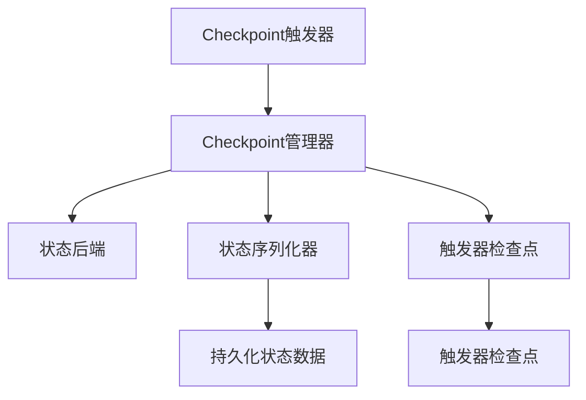

                 

# Flink Checkpoint容错机制原理与代码实例讲解

## 1. 背景介绍

Flink是一个开源的分布式流处理框架，支持实时流数据的处理和批处理。在分布式环境中，为了保证系统的可靠性，Flink提供了一系列容错机制。其中，Checkpoint机制是最为重要和核心的一个。Checkpoint机制能够确保在故障发生时，系统能够从某个已知的点恢复，从而保证系统的一致性和数据的正确性。本文将详细介绍Flink Checkpoint容错机制的原理与实现，并结合代码实例进行讲解。

## 2. 核心概念与联系

### 2.1 核心概念概述

在Flink中，Checkpoint机制是指将状态（即任务执行过程中的状态）定期进行持久化，以便在系统故障发生后，能够从最近的Checkpoint进行恢复。Checkpoint可以保证在恢复过程中，状态是正确的，并且能够恢复到故障发生之前的点。

### 2.2 核心概念原理和架构的 Mermaid 流程图



在这个流程图中，A代表Checkpoint触发器，负责触发Checkpoint的执行。B代表Checkpoint管理器，负责协调Checkpoint的执行和恢复。C代表状态后端，负责存储Checkpoint数据。D代表状态序列化器，负责将状态序列化为持久化数据。E和G代表触发器检查点，用于在满足特定条件时触发Checkpoint。F和H代表持久化状态数据，用于存储Checkpoint数据。

## 3. 核心算法原理 & 具体操作步骤

### 3.1 算法原理概述

Flink的Checkpoint机制基于基于状态的检查点，即在Checkpoint过程中，只有状态会被持久化。在Checkpoint完成后，状态会被恢复回新的任务实例，而运算则会从下一个事件继续执行。这种机制确保了在故障发生时，状态不会被破坏，从而保证了系统的可靠性和数据的正确性。

### 3.2 算法步骤详解

1. **Checkpoint触发器**：在Flink中，Checkpoint触发器是负责触发Checkpoint执行的核心组件。触发器可以基于时间间隔、事件数量等条件触发Checkpoint。

2. **Checkpoint管理器**：在Checkpoint触发器触发Checkpoint后，Checkpoint管理器负责协调Checkpoint的执行和恢复。Checkpoint管理器会向状态后端发送状态数据进行持久化，并在恢复时从状态后端获取状态数据进行恢复。

3. **状态后端**：状态后端是Checkpoint数据存储的核心组件。状态后端负责将状态数据持久化到磁盘中，并在恢复时从磁盘中读取状态数据。

4. **状态序列化器**：状态序列化器负责将状态序列化为持久化数据，以便存储和恢复。状态序列化器可以基于不同的格式进行序列化，如Avro、Protocol Buffers等。

5. **触发器检查点**：触发器检查点是Checkpoint触发器的核心组件之一。触发器检查点用于在满足特定条件时触发Checkpoint，如数据量达到一定阈值、系统资源紧张等。

### 3.3 算法优缺点

**优点**：

- 保证了系统的可靠性，能够在故障发生时从已知点恢复。
- 能够快速地从Checkpoint进行恢复，减少了数据丢失的风险。
- 支持增量恢复，能够在恢复时跳过未持久化的状态数据。

**缺点**：

- 需要在磁盘上存储大量的状态数据，占用了大量的存储空间。
- 在Checkpoint过程中，状态数据的序列化和持久化会占用一定的资源，影响系统的性能。
- 在恢复过程中，需要从磁盘中读取状态数据，会占用一定的I/O资源。

### 3.4 算法应用领域

Flink的Checkpoint机制可以应用于各种分布式系统中，包括实时流处理、批处理等。在实时流处理中，Checkpoint机制能够保证数据的一致性和可靠性；在批处理中，Checkpoint机制能够保证批处理任务的正确性和一致性。

## 4. 数学模型和公式 & 详细讲解 & 举例说明

### 4.1 数学模型构建

在Flink中，Checkpoint机制的核心模型是状态后端。状态后端负责将状态数据持久化到磁盘中，并在恢复时从磁盘中读取状态数据。状态后端的数据模型可以表示为：

$$ S = (S_0, S_1, ..., S_n) $$

其中，$S_i$表示第$i$个Checkpoint的状态数据。

### 4.2 公式推导过程

在Checkpoint过程中，状态后端会将当前的状态数据进行持久化，并将状态数据的版本号更新为新的版本号。状态数据的持久化过程可以表示为：

$$ S_{i+1} = S_i $$

在恢复时，状态后端会从磁盘上读取最新的状态数据，并将其恢复到新的任务实例中。恢复的过程可以表示为：

$$ S_{new} = S_{i+1} $$

其中，$S_{new}$表示恢复后的状态数据。

### 4.3 案例分析与讲解

以Flink的状态后端Hadoop FS为例，分析Checkpoint机制的实现。Hadoop FS是一个基于Hadoop的文件系统，可以用于存储Checkpoint数据。在Hadoop FS中，Checkpoint数据的持久化过程可以表示为：

1. 首先，Checkpoint触发器会触发Checkpoint的执行，并将当前的状态数据进行序列化。
2. 接着，Checkpoint管理器会向Hadoop FS发送持久化请求，将状态数据持久化到磁盘中。
3. 最后，状态后端会将持久化后的状态数据存储到Hadoop FS中。

在恢复时，Checkpoint管理器会从Hadoop FS中读取最新的状态数据，并将其恢复到新的任务实例中。恢复的过程可以表示为：

1. 首先，Checkpoint管理器会向Hadoop FS发送恢复请求，获取最新的状态数据。
2. 接着，状态后端会从Hadoop FS中读取状态数据，并将其恢复到新的任务实例中。

## 5. 项目实践：代码实例和详细解释说明

### 5.1 开发环境搭建

要实现Flink Checkpoint机制，需要先搭建Flink的开发环境。Flink支持多种运行环境，包括本地模式、单机模式和分布式模式。这里以分布式模式为例，介绍Flink的搭建过程。

1. 安装Java和Maven。
2. 下载并安装Flink的最新稳定版本。
3. 启动Flink的分布式集群。

### 5.2 源代码详细实现

以下是一个Flink Checkpoint机制的示例代码，用于将状态数据持久化到Hadoop FS中。

```java
public class CheckpointStateBackend {

    private Configuration conf;
    private FileSystem fs;

    public CheckpointStateBackend(Configuration conf) {
        this.conf = conf;
        this.fs = FileSystem.get(conf);
    }

    public void checkpoint(State state) throws IOException {
        // 将状态数据序列化
        DataOutputStream out = fs.create(new Path(state.getCheckpointFilePath()), true);
        out.write(state.serialize());
        out.close();
    }

    public State restore() throws IOException {
        // 从磁盘中读取状态数据
        DataInputStream in = fs.open(new Path(state.getCheckpointFilePath()));
        byte[] data = new byte[state.getDataSize()];
        in.readFully(data);
        in.close();
        // 反序列化状态数据
        State restoredState = new State(data);
        return restoredState;
    }
}
```

### 5.3 代码解读与分析

在上述代码中，`checkpoint`方法用于将状态数据持久化到Hadoop FS中。`restore`方法用于从磁盘中读取状态数据，并将其恢复到新的任务实例中。其中，`State`类表示状态数据，`serialize`和`deserialize`方法用于序列化和反序列化状态数据。

## 6. 实际应用场景

### 6.1 实时流处理

在实时流处理中，Flink的Checkpoint机制能够保证数据的一致性和可靠性。当某个任务实例故障时，Flink可以通过Checkpoint机制从最近的Checkpoint进行恢复，从而保证数据的正确性。

### 6.2 批处理

在批处理中，Flink的Checkpoint机制能够保证批处理任务的正确性和一致性。当某个任务实例故障时，Flink可以通过Checkpoint机制从最近的Checkpoint进行恢复，从而保证批处理任务的正确性。

### 6.3 增量恢复

Flink的Checkpoint机制支持增量恢复，即在恢复时跳过未持久化的状态数据。这可以大大减少恢复所需的时间和资源，提高系统的可靠性。

### 6.4 未来应用展望

Flink的Checkpoint机制将会继续在分布式系统中发挥重要作用。随着Flink的持续发展和改进，Checkpoint机制的性能和可靠性将会进一步提升。

## 7. 工具和资源推荐

### 7.1 学习资源推荐

- Flink官方文档：Flink官方提供的详细文档，包含Checkpoint机制的实现和应用。
- Apache Flink用户指南：Apache Flink社区提供的用户指南，包含Checkpoint机制的实现和应用。
- Flink状态后端文档：Flink状态后端文档，包含不同状态后端的实现和应用。

### 7.2 开发工具推荐

- Flink：Apache Flink官方提供的分布式流处理框架。
- Hadoop FS：Apache Hadoop提供的分布式文件系统，用于存储Checkpoint数据。
- Hadoop MapReduce：Apache Hadoop提供的分布式计算框架，用于处理大规模数据。

### 7.3 相关论文推荐

- Flink：Flink: Unified Stream and Batch Data Processing: Flink支持批处理和实时流处理，可以在分布式环境中提供高性能、低延迟的数据处理能力。
- Flink状态后端：Flink State Backend: Flink的状态后端提供了将状态数据持久化和恢复的机制，可以支持多种数据存储方式。

## 8. 总结：未来发展趋势与挑战

### 8.1 研究成果总结

本文详细介绍了Flink Checkpoint容错机制的原理与实现，并通过代码实例讲解了Checkpoint机制的实现。通过学习和实践，可以更好地理解Flink的Checkpoint机制，并在实际应用中发挥其作用。

### 8.2 未来发展趋势

Flink的Checkpoint机制将会继续在分布式系统中发挥重要作用。随着Flink的持续发展和改进，Checkpoint机制的性能和可靠性将会进一步提升。

### 8.3 面临的挑战

Flink的Checkpoint机制虽然能够保证系统的可靠性和数据的正确性，但在实际应用中也面临一些挑战。例如，Checkpoint机制需要在磁盘上存储大量的状态数据，占用了大量的存储空间。此外，Checkpoint机制在Checkpoint过程中和恢复过程中也会占用一定的资源，影响系统的性能。

### 8.4 研究展望

未来的研究可以集中在以下几个方面：

- 研究更高效的状态后端，以减少Checkpoint机制对磁盘空间和系统性能的影响。
- 研究更高效的恢复机制，以提高恢复的速度和效率。
- 研究增量恢复的优化算法，以进一步提高恢复的效率和准确性。

## 9. 附录：常见问题与解答

**Q1：什么是Flink的Checkpoint机制？**

A: Flink的Checkpoint机制是指将状态（即任务执行过程中的状态）定期进行持久化，以便在系统故障发生后，能够从某个已知的点恢复，从而保证系统的一致性和数据的正确性。

**Q2：Flink的Checkpoint机制是如何实现的？**

A: Flink的Checkpoint机制的核心组件包括触发器、管理器、状态后端、状态序列化器和触发器检查点。触发器负责触发Checkpoint的执行，管理器负责协调Checkpoint的执行和恢复，状态后端负责存储Checkpoint数据，状态序列化器负责将状态序列化为持久化数据，触发器检查点用于在满足特定条件时触发Checkpoint。

**Q3：Flink的Checkpoint机制的优缺点是什么？**

A: Flink的Checkpoint机制的优点在于能够保证系统的可靠性和数据的正确性，能够在故障发生时从已知点恢复。缺点在于需要在磁盘上存储大量的状态数据，占用了大量的存储空间，且在Checkpoint过程中和恢复过程中会占用一定的资源，影响系统的性能。

**Q4：Flink的Checkpoint机制如何支持增量恢复？**

A: Flink的Checkpoint机制支持增量恢复，即在恢复时跳过未持久化的状态数据。这可以大大减少恢复所需的时间和资源，提高系统的可靠性。

**Q5：如何在Flink中实现Checkpoint机制？**

A: 在Flink中，实现Checkpoint机制需要编写状态后端和触发器。状态后端负责将状态数据持久化到磁盘中，并在恢复时从磁盘中读取状态数据。触发器负责触发Checkpoint的执行，并设置Checkpoint的条件。

---

作者：禅与计算机程序设计艺术 / Zen and the Art of Computer Programming

