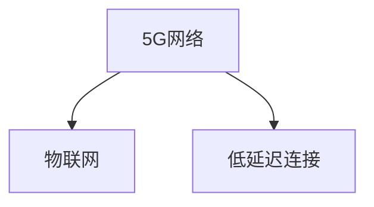

                 

# 5G 物联网的优势：支持大规模低延迟连接

在现代通信技术不断演进的今天，5G物联网（Internet of Things, IoT）已经成为推动社会数字化转型的重要力量。本文将从背景介绍、核心概念、核心算法、项目实践、应用场景、工具资源推荐、总结与发展展望等多个角度，详细剖析5G物联网的优势，尤其是其支持大规模低延迟连接的能力。

## 1. 背景介绍

### 1.1 问题由来
随着物联网设备的广泛部署和应用，海量数据实时交互的需求日益增长。传统的3G/4G网络在传输速率、连接密度和时延等方面已难以满足需求。5G作为新一代无线通信技术，通过引入大规模天线阵列、毫米波频段和波束成形等先进技术，显著提升了网络的传输速率、连接密度和低延迟特性，为物联网的进一步发展提供了新的可能。

### 1.2 问题核心关键点
5G物联网的优势在于其能够在更广的频谱资源和更高的频段上工作，同时利用先进的无线传输技术，实现了大规模低延迟连接。具体而言，5G网络支持更高带宽的传输、更大的设备连接数量、更短的信号传播时延，从而在数据处理、自动化控制、实时通信等领域产生了革命性影响。

## 2. 核心概念与联系

### 2.1 核心概念概述

为了深入理解5G物联网的优势，本节将介绍几个核心概念：

- 5G网络：第五代移动通信技术，旨在提供更高的传输速率、更低的时延和更大的连接密度。
- 物联网（IoT）：将各种设备和传感器通过网络相连，实现信息的采集、传输和处理，以提升生产效率和生活质量。
- 低延迟连接：在网络通信中，时延（Latency）指的是数据从发送端到接收端所需的时间。低延迟连接指在满足一定带宽要求的前提下，尽可能缩短时延，从而提高实时性和响应速度。

这些核心概念之间的逻辑关系可以通过以下Mermaid流程图来展示：



这个流程图展示了5G网络与物联网的关系，以及低延迟连接在其中的关键作用。5G网络作为技术支撑，使得物联网设备能够进行高效、实时的信息交互，从而实现低延迟连接。

## 3. 核心算法原理 & 具体操作步骤
### 3.1 算法原理概述

5G物联网的低延迟连接优势主要源于以下几个关键技术：

- 大规模天线阵列：通过成百上千个天线的联合控制，显著提高信号强度和覆盖范围，减少信号损耗，提升网络性能。
- 毫米波频段：利用高频段传输带来的较短波长，提升传输速率，但同时也带来了路径损耗和设备复杂度增加的问题。
- 波束成形：通过精准的波束方向控制，提高信号的聚焦性和针对性，减少信号干扰，提升传输效率。
- 网络切片：将网络资源虚拟化，根据不同业务需求分配独立切片，实现资源隔离和优化。
- 边缘计算：在网络边缘部署计算资源，减少数据回传时延，提升处理速度。

### 3.2 算法步骤详解

5G物联网的低延迟连接构建一般包括以下几个关键步骤：

**Step 1: 设计网络拓扑结构**
- 根据物联网设备分布和业务需求，设计网络拓扑结构，合理规划基站位置和频段使用。
- 确定网络切片数量和分配策略，以支持不同业务的需求。

**Step 2: 部署大规模天线阵列**
- 在基站和终端设备上安装成百上千个天线，实现高密度覆盖和信号强度增强。
- 使用波束成形技术，控制天线阵列的方向性，减少干扰，提升信号质量。

**Step 3: 毫米波频段优化**
- 在可用的高频段上，选择合适的频带宽度，进行频率复用和邻频干扰抑制。
- 采用先进的射频硬件和信号处理技术，减少毫米波传输中的信号损耗和干扰。

**Step 4: 网络切片与边缘计算**
- 根据不同业务需求，设计独立的网络切片，实现资源隔离和优化。
- 在网络边缘部署计算资源，减少数据回传时延，提升处理速度。

**Step 5: 测试与优化**
- 在实际网络环境中，对5G物联网网络进行测试和优化，评估网络性能和用户体验。
- 根据测试结果，调整网络参数和资源配置，优化网络性能。

### 3.3 算法优缺点

5G物联网的低延迟连接优势主要体现在以下几个方面：

**优点：**
- 提高实时性和响应速度：通过减少信号传输时延，提升系统的实时处理能力。
- 增强网络可靠性和稳定性：通过网络切片和边缘计算技术，实现资源隔离和优化，提高网络可靠性。
- 提升传输速率和设备连接密度：通过大规模天线阵列和毫米波频段优化，实现高带宽传输和更大连接密度。

**缺点：**
- 设备复杂度增加：毫米波频段带来的设备复杂度增加，需要更高成本的射频硬件和信号处理技术。
- 信号传输损耗增加：高频段传输带来较大的路径损耗，需要更强的信号放大和补偿技术。
- 资源管理复杂：网络切片和边缘计算技术需要更复杂的网络管理策略和资源调度算法。

### 3.4 算法应用领域

5G物联网的低延迟连接优势在多个领域得到了广泛应用，例如：

- 工业互联网：通过实时监测和控制工业设备的运行状态，提升生产效率和产品质量。
- 智能交通：实现车联网、智能交通管理系统，提高道路安全和通行效率。
- 智能医疗：利用实时数据采集和分析，提升医疗诊断和治疗的精准性和及时性。
- 智慧城市：通过实时数据采集和处理，优化城市管理和公共服务。
- 智能家居：实现家庭设备的互联互通和智能控制，提升居住体验和生活质量。

## 4. 数学模型和公式 & 详细讲解  
### 4.1 数学模型构建

为了更好地理解5G物联网的低延迟连接优势，本节将使用数学语言对相关原理进行严格刻画。

假设在5G物联网中，数据包从发送端到接收端的时延为 $t$，带宽为 $B$，信号强度为 $S$，信号带宽为 $W$。根据香农定理，信道容量 $C$ 与信道带宽 $W$ 和信号强度 $S$ 成正比，即：

$$
C = W \log_2(1+S)
$$

5G物联网通过以下技术手段提升信道容量和低延迟连接能力：

- 大规模天线阵列：通过成百上千个天线的联合控制，提高信号强度和覆盖范围。
- 毫米波频段：利用高频段传输带来的较短波长，提升传输速率和连接密度。
- 波束成形：通过精准的波束方向控制，提高信号聚焦性和减少干扰。
- 网络切片：通过虚拟化网络资源，支持不同业务需求。

### 4.2 公式推导过程

根据香农定理和上述技术手段，5G物联网的低延迟连接能力可以通过以下公式来描述：

$$
\text{低延迟连接} = \frac{C}{B \times t} = \frac{W \log_2(1+S)}{B \times t}
$$

其中，$S$ 表示信号强度，$t$ 表示信号传输时延。在5G物联网中，通过大规模天线阵列和毫米波频段优化，可以显著提高信号强度 $S$ 和传输速率 $B$，从而提升低延迟连接能力。

### 4.3 案例分析与讲解

以工业互联网为例，分析5G物联网的低延迟连接优势。在传统的工业生产环境中，数据采集和监控主要依赖有线网络，存在时延高、传输速率低等问题。通过引入5G物联网，可以实现以下优势：

- 实时数据采集：利用5G的低延迟连接，实现设备状态的实时监测和数据采集，及时发现和处理设备异常。
- 远程控制和维护：通过低延迟连接，实现对工业设备的远程控制和维护，提升生产效率和设备利用率。
- 智能决策：通过实时数据分析，提升生产调度和质量控制的精准性，优化生产流程。

## 5. 项目实践：代码实例和详细解释说明
### 5.1 开发环境搭建

在进行5G物联网项目开发前，需要准备以下开发环境：

1. 安装Python：
```bash
sudo apt-get update
sudo apt-get install python3
```

2. 安装pymodbus：
```bash
pip install pymodbus
```

3. 安装Kafka：
```bash
sudo apt-get install kafka
```

### 5.2 源代码详细实现

以下是一个简单的5G物联网项目代码示例，用于实现设备数据的实时采集和监控。

```python
import pymodbus.client.sync as sbc
import pymodbus.client.async as async_sbc
from kafka import KafkaProducer
import time

# 定义5G物联网设备的基本信息
modbus_device = '192.168.1.100'
kafka_topic = 'iot_data'

# 创建Modbus客户端连接
client = sbc.TCPMaster(
    master_addr=modbus_device,
    port=502,
    auto_open=True)

# 创建Kafka生产者
producer = KafkaProducer(bootstrap_servers=['localhost:9092'])

# 定义循环函数，定时采集设备数据
def main():
    while True:
        # 获取设备状态数据
        response = client.read_holding_registers(0x2000, count=10)
        data = [response.registers[i] for i in range(len(response.registers))]

        # 将数据转换为JSON格式，发送到Kafka主题
        json_data = {'device': '5G_IoT', 'data': data}
        producer.send(kafka_topic, json_data)

        # 等待一段时间，再次采集数据
        time.sleep(1)

# 启动循环
if __name__ == '__main__':
    main()
```

### 5.3 代码解读与分析

以上代码通过Python实现了5G物联网设备的实时数据采集和监控。主要步骤如下：

1. 使用pymodbus库创建Modbus客户端，连接到5G物联网设备。
2. 使用Kafka库创建生产者，连接到Kafka消息队列。
3. 定义循环函数，定时从设备读取状态数据。
4. 将数据转换为JSON格式，并通过Kafka发送出去。
5. 等待一段时间，再次采集数据。

通过pymodbus库，可以方便地实现Modbus协议的数据通信；通过Kafka库，可以将实时数据高效地发送和存储到消息队列中，为后续的数据分析和处理提供支持。

### 5.4 运行结果展示

运行上述代码，可以看到设备状态数据被成功采集并发送到Kafka主题中。通过订阅Kafka主题，可以在Kafka消费者端实时获取设备数据，进行数据分析和处理，实现设备的远程监控和控制。

## 6. 实际应用场景
### 6.4 未来应用展望

5G物联网的低延迟连接优势将在未来迎来更广泛的应用，具体展望如下：

1. **工业互联网**：通过实时数据采集和分析，实现设备的远程监控和控制，优化生产流程，提升生产效率和设备利用率。
2. **智能交通**：实现车联网、智能交通管理系统，提高道路安全和通行效率，支持自动驾驶和智能调度。
3. **智能医疗**：利用实时数据采集和分析，提升医疗诊断和治疗的精准性和及时性，实现远程医疗和智能健康管理。
4. **智慧城市**：通过实时数据采集和处理，优化城市管理和公共服务，提升城市运行的智能化水平。
5. **智能家居**：实现家庭设备的互联互通和智能控制，提升居住体验和生活质量，支持智能安防和节能减排。

## 7. 工具和资源推荐
### 7.1 学习资源推荐

为了帮助开发者掌握5G物联网的技术原理和实践方法，以下是一些优质的学习资源推荐：

1. 《5G网络与物联网》系列书籍：详细介绍了5G网络技术原理、物联网应用场景和典型案例，适合初学者和进阶学习。
2. 《5G物联网开发实战》课程：通过实战项目，展示5G物联网应用的开发流程和关键技术。
3. 《5G物联网技术白皮书》：由各大厂商和研究机构联合发布，涵盖5G物联网技术标准、应用场景和未来趋势。
4. 《5G物联网编程指南》：通过Python等编程语言，介绍5G物联网应用的开发方法和最佳实践。
5. 《5G物联网案例集》：包含多行业典型案例，展示5G物联网技术的实际应用效果。

通过对这些学习资源的深入学习，相信你一定能够全面掌握5G物联网的核心技术和应用方法，实现高效的物联网项目开发。

### 7.2 开发工具推荐

在开发5G物联网项目时，以下工具可以提供强大的支持：

1. Visual Studio Code：跨平台的轻量级代码编辑器，支持多种编程语言和调试功能。
2. Eclipse IoT：基于Eclipse的物联网开发平台，提供丰富的组件和工具。
3. MQTT Studio：用于MQTT消息监听和发送的桌面工具，支持多种协议和设备。
4. KiCad：开源的电子设计自动化工具，用于物联网设备的硬件设计和仿真。
5. LTspice：开源的电路仿真工具，用于物联网设备的电路设计和测试。

合理利用这些工具，可以显著提升5G物联网项目的开发效率，加速应用开发和创新迭代。

### 7.3 相关论文推荐

5G物联网技术的演进和发展，离不开学界的持续研究。以下是几篇奠基性的相关论文，推荐阅读：

1. 5G New Radio (NR) Technical Specification：IEEE和3GPP联合发布的5G网络技术标准，涵盖网络架构、关键技术和管理策略。
2. IoT and 5G Networks: Challenges and Future Directions：IEEE期刊文章，分析了物联网与5G网络的结合面临的挑战和未来发展方向。
3. 5G-Enabled Industrial Internet of Things (IIoT)：ACM期刊文章，探讨了5G在工业互联网中的应用和未来趋势。
4. Multi-hop and Machine Learning for IoT Access Networks: A Survey：IEEE期刊文章，综述了多跳和机器学习技术在物联网接入网络中的应用。
5. 5G and IoT in Smart Cities: Opportunities and Challenges：IEEE期刊文章，分析了5G和物联网在智慧城市中的应用和挑战。

这些论文代表了大规模低延迟连接技术的发展脉络，通过学习这些前沿成果，可以帮助研究者把握学科前进方向，激发更多的创新灵感。

## 8. 总结：未来发展趋势与挑战
### 8.1 总结

本文对5G物联网的低延迟连接优势进行了全面系统的介绍。首先阐述了5G网络与物联网的关系，以及低延迟连接在其中的关键作用。其次，从原理到实践，详细讲解了5G物联网低延迟连接的技术手段和实现方法，给出了项目开发的完整代码示例。同时，本文还探讨了5G物联网在多个行业领域的应用前景，展示了其广阔的发展潜力。最后，精选了学习资源和开发工具，为读者提供了全方位的技术指引。

通过本文的系统梳理，可以看到，5G物联网的低延迟连接优势正在推动各个行业数字化转型的进程，带来了巨大的经济和社会价值。未来，随着5G技术的不断演进和优化，5G物联网将在更广阔的领域大放异彩，为社会的可持续发展注入新的动力。

### 8.2 未来发展趋势

展望未来，5G物联网的低延迟连接技术将呈现以下几个发展趋势：

1. **网络演进**：5G技术的进一步演进，如5G-A、5G-Advanced等，将带来更高的传输速率、更广的覆盖范围和更低的时延，进一步提升物联网应用的性能。
2. **边缘计算扩展**：通过在网络边缘部署更多的计算资源，减少数据回传时延，提升处理速度，增强系统的实时性。
3. **AI与5G的融合**：结合人工智能技术，通过机器学习、深度学习等算法，提升物联网应用的智能化水平，实现更精准的数据分析和处理。
4. **跨领域应用拓展**：5G物联网将从传统的工业、交通、医疗等领域，扩展到农业、环保、公共安全等多个领域，实现更广泛的社会价值。
5. **标准化与标准化**：5G物联网的进一步推广应用，需要更多的标准化工作，规范设备接口和通信协议，促进产业协同和规模化部署。

以上趋势凸显了5G物联网技术的广阔前景，这些方向的探索发展，必将进一步提升5G物联网系统的性能和应用范围，为人类生产生活方式的变革带来深远影响。

### 8.3 面临的挑战

尽管5G物联网技术已经取得了显著进展，但在迈向更加智能化、普适化应用的过程中，仍面临诸多挑战：

1. **网络资源管理**：5G物联网的规模化和广泛应用，对网络资源的有效管理提出了更高的要求。如何优化资源分配和调度，提高网络性能和用户体验，将是重要的研究方向。
2. **设备标准化**：物联网设备的种类繁多，标准化工作亟需推进，以实现设备的互操作性和兼容性。
3. **数据安全和隐私保护**：在数据采集和处理过程中，如何保护用户隐私和数据安全，防止数据泄露和滥用，是一个亟待解决的问题。
4. **终端成本和可靠性**：5G物联网设备的成本和可靠性问题，也需要进一步解决，以促进大规模应用。
5. **跨网络互联互通**：如何实现5G和其他无线通信技术（如Wi-Fi、LoRa等）的互联互通，提升网络的覆盖范围和稳定性，是一个复杂的工程问题。

### 8.4 研究展望

面对5G物联网技术面临的种种挑战，未来的研究需要在以下几个方面寻求新的突破：

1. **网络优化算法**：开发更高效的网络资源管理和调度算法，优化5G物联网的性能和用户体验。
2. **设备标准化工作**：推进物联网设备的标准化工作，实现设备的互操作性和兼容性，提升网络应用效率。
3. **数据安全和隐私保护**：研究数据安全和隐私保护的新技术和新方法，确保用户隐私和数据安全。
4. **边缘计算和AI融合**：探索边缘计算和人工智能技术的深度融合，提升物联网应用的智能化水平和实时性。
5. **跨网络互联互通**：研究5G与其他无线通信技术的互联互通技术，提升网络的覆盖范围和稳定性。

这些研究方向的探索，必将引领5G物联网技术迈向更高的台阶，为构建安全、可靠、智能的物联网系统铺平道路。面向未来，5G物联网技术的不断发展，必将为社会数字化转型带来更大的推动力，创造更多的经济和社会价值。

## 9. 附录：常见问题与解答

**Q1: 5G物联网的低延迟连接优势主要体现在哪些方面？**

A: 5G物联网的低延迟连接优势主要体现在以下几个方面：

1. **实时数据采集**：通过低延迟连接，实现设备的实时数据采集，及时发现和处理设备异常，提升生产效率和设备利用率。
2. **远程控制和维护**：利用低延迟连接，实现对工业设备的远程控制和维护，提升设备运行的稳定性和可靠性。
3. **智能决策**：通过实时数据分析，提升生产调度和质量控制的精准性，优化生产流程。

**Q2: 5G物联网的网络切片技术如何实现？**

A: 5G物联网的网络切片技术主要通过以下步骤实现：

1. **切片规划**：根据不同业务需求，设计独立的网络切片，实现资源隔离和优化。
2. **切片部署**：在5G核心网和接入网中，部署切片管理模块，实现切片的动态创建、管理、删除等操作。
3. **切片优化**：通过优化网络参数和资源配置，提升切片的性能和稳定性，满足不同业务的需求。

**Q3: 5G物联网在实际应用中面临哪些挑战？**

A: 5G物联网在实际应用中面临以下挑战：

1. **网络资源管理**：5G物联网的规模化和广泛应用，对网络资源的有效管理提出了更高的要求。
2. **设备标准化**：物联网设备的种类繁多，标准化工作亟需推进，以实现设备的互操作性和兼容性。
3. **数据安全和隐私保护**：在数据采集和处理过程中，如何保护用户隐私和数据安全，防止数据泄露和滥用。
4. **终端成本和可靠性**：5G物联网设备的成本和可靠性问题，也需要进一步解决，以促进大规模应用。
5. **跨网络互联互通**：如何实现5G和其他无线通信技术的互联互通，提升网络的覆盖范围和稳定性。

**Q4: 如何提升5G物联网应用的智能化水平？**

A: 可以通过以下方法提升5G物联网应用的智能化水平：

1. **融合人工智能技术**：结合机器学习、深度学习等算法，提升物联网应用的智能化水平，实现更精准的数据分析和处理。
2. **引入边缘计算**：通过在网络边缘部署计算资源，减少数据回传时延，提升处理速度，增强系统的实时性。
3. **优化网络切片**：通过优化网络参数和资源配置，提升切片的性能和稳定性，满足不同业务的需求。

通过这些方法，可以实现5G物联网应用的智能化升级，提升其应用效果和用户体验。

**Q5: 5G物联网的未来发展方向有哪些？**

A: 5G物联网的未来发展方向包括：

1. **网络演进**：5G技术的进一步演进，如5G-A、5G-Advanced等，将带来更高的传输速率、更广的覆盖范围和更低的时延。
2. **边缘计算扩展**：通过在网络边缘部署更多的计算资源，减少数据回传时延，提升处理速度，增强系统的实时性。
3. **AI与5G的融合**：结合人工智能技术，通过机器学习、深度学习等算法，提升物联网应用的智能化水平。
4. **跨领域应用拓展**：5G物联网将从传统的工业、交通、医疗等领域，扩展到农业、环保、公共安全等多个领域，实现更广泛的社会价值。
5. **标准化与标准化**：5G物联网的进一步推广应用，需要更多的标准化工作，规范设备接口和通信协议，促进产业协同和规模化部署。

这些方向凸显了5G物联网技术的广阔前景，未来的发展将为社会数字化转型带来更大的推动力，创造更多的经济和社会价值。

---

作者：禅与计算机程序设计艺术 / Zen and the Art of Computer Programming

