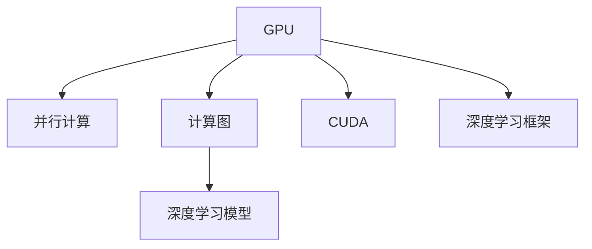

                 

# GPU与并行执行：新计算范式的核心

> 关键词：GPU, 并行计算, 计算图, 深度学习, CUDA, 模型并行

## 1. 背景介绍

### 1.1 问题由来
随着人工智能(AI)技术在各行业的应用不断深入，深度学习成为其中的关键驱动力。深度学习模型的计算需求日益庞大，单靠CPU已难以满足，GPU作为高性能计算工具应运而生。GPU（Graphics Processing Unit，图形处理单元）通过并行执行大量线程，大幅提升了深度学习训练和推理的速度。

GPU的并行计算能力得益于其大量流处理器(Stream Processors)和高速显存。流处理器可以同时处理多个线程，而高速显存则保证了数据的高效读写。这些特性使得GPU在图像处理、数值计算、深度学习等领域具备显著优势。

深度学习模型往往包含大量参数，每个参数的计算又需要经过多轮的前向传播和反向传播。CPU在单个线程上处理数据的能力有限，无法高效并行处理大规模数据。相比之下，GPU在单核上具备多线程执行能力，且显存较大，能够同时处理大量数据。因此，GPU成为深度学习计算的主力。

### 1.2 问题核心关键点
GPU加速深度学习的核心在于其并行执行特性，这使得GPU能够高效地并行处理计算图中的节点。计算图是由模型节点和数据边组成的，描述了深度学习模型中前向传播和反向传播的计算流程。通过GPU并行计算，可以显著加速模型训练和推理过程。

GPU加速深度学习的关键步骤包括：
1. **模型迁移**：将深度学习模型迁移到GPU上。
2. **计算图构建**：使用CUDA等GPU编程框架构建计算图。
3. **数据迁移**：将数据从CPU迁移到GPU。
4. **并行执行**：在GPU上并行执行计算图中的节点。

## 2. 核心概念与联系

### 2.1 核心概念概述

为更好地理解GPU加速深度学习的原理，本节将介绍几个关键概念：

- GPU（图形处理单元）：高性能的并行计算核心，具备大量流处理器和高速显存。
- 并行计算：同时执行多个线程，以提高计算效率。
- 计算图：描述深度学习模型中前向传播和反向传播计算流程的图形结构。
- CUDA（Compute Unified Device Architecture）：NVIDIA推出的GPU编程框架，提供了高效的计算图构建和并行执行能力。
- TensorFlow、PyTorch等深度学习框架：提供了高级API，简化GPU并行计算的实现。

这些概念之间的逻辑关系可以通过以下Mermaid流程图来展示：



这个流程图展示了大语言模型的核心概念及其之间的关系：

1. GPU通过并行计算提升深度学习模型的训练和推理速度。
2. 计算图描述了深度学习模型的计算流程，并行计算在其上高效执行。
3. CUDA和深度学习框架提供了计算图构建和并行执行的便捷手段。

## 3. 核心算法原理 & 具体操作步骤
### 3.1 算法原理概述

GPU加速深度学习的核心原理在于其并行计算能力，具体体现在以下几个方面：

- **数据并行**：将数据分为多个块，每个块分配给一个GPU核心处理，每个核心独立处理数据块。
- **模型并行**：将模型分为多个部分，每个部分在各自的GPU核心上并行计算，每个核心独立处理模型部分。
- **混合并行**：结合数据并行和模型并行，通过将数据块分配给多个模型部分处理，实现更高效的并行执行。

通过GPU的并行计算，深度学习模型可以在短时间内完成大规模训练和推理任务。

### 3.2 算法步骤详解

基于GPU的深度学习加速流程一般包括以下几个关键步骤：

**Step 1: 模型迁移**
- 将深度学习模型从CPU迁移到GPU。这可以通过将模型参数、计算图等迁移到GPU内存来实现。

**Step 2: 构建计算图**
- 使用CUDA等GPU编程框架构建计算图，描述模型的前向传播和反向传播过程。

**Step 3: 数据迁移**
- 将训练和推理数据从CPU迁移到GPU，以便GPU能够高效处理。

**Step 4: 并行执行**
- 在GPU上并行执行计算图中的节点，实现数据的并行处理和模型的并行计算。

**Step 5: 数据迁移与模型更新**
- 将训练好的模型参数从GPU迁移到CPU，用于进一步微调或模型部署。

具体实现步骤如下：

1. **模型迁移**：
   - 在GPU上初始化模型，将模型参数从CPU迁移到GPU。
   - 使用CUDA等框架，将模型的前向传播和反向传播过程迁移到GPU上。

2. **计算图构建**：
   - 使用TensorFlow、PyTorch等框架，构建计算图，描述模型的计算流程。
   - 使用CUDA工具，将计算图节点迁移到GPU上，并配置计算图并行度。

3. **数据迁移**：
   - 将训练和推理数据从CPU迁移到GPU，使用CUDA函数实现数据的高速读写。
   - 使用CUDA的内存管理功能，分配GPU显存，确保数据存储在显存中。

4. **并行执行**：
   - 在GPU上并行执行计算图中的节点，使用CUDA的流和线程配置，控制并行度。
   - 在GPU上同时处理多个线程，提高计算效率。

5. **数据迁移与模型更新**：
   - 将训练好的模型参数从GPU迁移到CPU，使用CUDA的迁移函数实现数据和参数的高效迁移。
   - 使用CPU对模型进行进一步微调或保存，以供后续部署和推理。

### 3.3 算法优缺点

GPU加速深度学习的优点在于其高效的并行计算能力，具体体现在以下几个方面：
1. 计算速度提升：GPU可以并行处理大量线程，大幅提升深度学习模型的训练和推理速度。
2. 数据并行性增强：GPU可以同时处理多个数据块，提高数据并行度。
3. 模型并行性增强：GPU可以同时处理多个模型部分，提高模型并行度。

然而，GPU加速深度学习也存在一些局限性：
1. 硬件成本高：GPU硬件和计算资源成本较高，不适合对计算资源有限的中小团队。
2. 编程复杂：GPU编程需要掌握CUDA等专业技能，门槛较高。
3. 能效问题：GPU的功耗较高，能效比相对较低，不适合需要低功耗的环境。
4. 软件兼容性：不同深度学习框架和GPU硬件之间的兼容性需要额外配置和优化。

尽管存在这些局限性，GPU加速深度学习仍是当前计算密集型任务的最佳选择，广泛应用于图像处理、自然语言处理、科学计算等领域。

### 3.4 算法应用领域

GPU加速深度学习的典型应用场景包括：

- **计算机视觉**：图像分类、目标检测、人脸识别等任务。GPU的高并行计算能力，使得图像处理任务可以迅速完成。
- **自然语言处理**：语言模型训练、情感分析、机器翻译等任务。GPU加速下，自然语言处理模型的训练速度大幅提升。
- **科学计算**：模拟仿真、分子动力学、天气预测等任务。GPU的高计算能力，使科学计算任务更加高效。
- **游戏引擎**：实时渲染、物理模拟、人工智能等任务。GPU的高并行性能，使得游戏引擎能够处理大规模场景和复杂物理计算。

除了上述这些常见应用外，GPU加速深度学习还在生物信息学、天文学、金融分析等众多领域发挥着重要作用。

## 4. 数学模型和公式 & 详细讲解 & 举例说明
### 4.1 数学模型构建

深度学习模型的计算图通常由节点和边组成。节点表示模型中的计算操作，如加法、乘法、卷积等；边表示数据流向，即节点的输入和输出。计算图描述了深度学习模型中前向传播和反向传播的计算流程。

在GPU上加速深度学习，需要将计算图迁移到GPU上，并行执行计算图中的节点。计算图的迁移和并行执行可以借助CUDA等GPU编程框架实现。

### 4.2 公式推导过程

深度学习模型的前向传播和反向传播过程可以表示为计算图。假设模型包含$n$个节点，每个节点的计算可以表示为：

$$ y_i = f(x_i, \theta_i) $$

其中 $x_i$ 为输入数据，$\theta_i$ 为模型参数，$f$ 为计算函数。

在计算图中，前向传播的计算过程可以表示为：

$$ y_0 \rightarrow y_1 \rightarrow \dots \rightarrow y_n $$

其中 $y_0$ 为输入数据，$y_n$ 为模型的最终输出。

反向传播的计算过程可以表示为：

$$ \frac{\partial \mathcal{L}}{\partial \theta_i} = \frac{\partial \mathcal{L}}{\partial y_n} \times \frac{\partial y_n}{\partial y_{n-1}} \times \dots \times \frac{\partial y_2}{\partial y_1} \times \frac{\partial y_1}{\partial \theta_i} $$

其中 $\mathcal{L}$ 为损失函数，$\frac{\partial \mathcal{L}}{\partial \theta_i}$ 表示损失函数对参数 $\theta_i$ 的偏导数。

使用CUDA等GPU编程框架，可以将计算图中的节点迁移到GPU上，并行执行计算。假设计算图中包含 $m$ 个节点，每个节点包含 $k$ 个线程，则每个节点的并行度为 $m \times k$。在并行执行过程中，每个节点会同时处理多个线程的计算。

### 4.3 案例分析与讲解

以图像分类任务为例，分析GPU加速的计算图构建和并行执行过程。

假设模型包含卷积层、池化层、全连接层等节点，其计算过程可以表示为：

$$ y_0 \rightarrow y_1 \rightarrow y_2 \rightarrow \dots \rightarrow y_n $$

其中 $y_0$ 为输入图像，$y_n$ 为模型的最终输出。

在计算图中，每个节点包含了多个计算操作，如卷积、池化、激活函数等。每个节点的计算过程可以表示为：

$$ y_{i+1} = g(y_i, \theta_i) $$

其中 $g$ 表示计算函数，$\theta_i$ 表示模型参数。

使用CUDA等GPU编程框架，可以将计算图中的节点迁移到GPU上，并行执行计算。假设计算图中包含 $m$ 个节点，每个节点包含 $k$ 个线程，则每个节点的并行度为 $m \times k$。

以卷积层为例，卷积操作的计算过程可以表示为：

$$ y_{i+1} = g(y_i, \theta_i) = h(w \times x_i + b) $$

其中 $w$ 表示卷积核，$x_i$ 表示输入数据，$b$ 表示偏置项，$h$ 表示激活函数。

使用CUDA的并行编程功能，可以将卷积操作的计算过程迁移到GPU上并行执行。假设卷积核大小为 $h \times w \times d$，输入数据大小为 $b \times h \times w \times c$，则每个卷积操作的计算过程可以表示为：

$$ y_{i+1} = \frac{1}{H \times W} \sum_{h=0}^{H-1} \sum_{w=0}^{W-1} \sum_{d=0}^{D-1} \sum_{c=0}^{C-1} (w_{h,w,d} \times x_{i,h,w,c} + b_{d}) $$

其中 $H \times W$ 表示卷积核的大小，$D$ 表示输入数据的深度。

在GPU上并行执行卷积操作时，可以将卷积核分配给多个GPU核心处理，每个核心独立计算卷积核的一个部分。同时，可以将输入数据分配给多个GPU核心处理，每个核心独立计算输入数据的一个部分。通过这种方式，可以同时处理多个卷积核和输入数据，提高计算效率。

## 5. 项目实践：代码实例和详细解释说明
### 5.1 开发环境搭建

在进行GPU加速深度学习实践前，我们需要准备好开发环境。以下是使用Python进行CUDA开发的环境配置流程：

1. 安装Anaconda：从官网下载并安装Anaconda，用于创建独立的Python环境。

2. 创建并激活虚拟环境：
```bash
conda create -n cuda-env python=3.8 
conda activate cuda-env
```

3. 安装CUDA：根据NVIDIA官网提供的信息，下载并安装CUDA工具包。例如：
```bash
conda install pytorch torchvision torchaudio cudatoolkit=11.1 -c pytorch -c conda-forge
```

4. 安装CUDA库和头文件：
```bash
conda install libcudart libcudnn libcufft libcusolver libcusparse
```

5. 安装CUDA函数库：
```bash
conda install libnccl=cuda=11.1=cudnn=8.1.0
```

完成上述步骤后，即可在`cuda-env`环境中开始GPU加速深度学习实践。

### 5.2 源代码详细实现

下面我们以图像分类任务为例，给出使用CUDA加速PyTorch模型的PyTorch代码实现。

首先，定义卷积神经网络模型：

```python
import torch.nn as nn
import torch
import torch.cuda as cuda

class CNN(nn.Module):
    def __init__(self):
        super(CNN, self).__init__()
        self.conv1 = nn.Conv2d(3, 32, 3)
        self.pool = nn.MaxPool2d(2, 2)
        self.conv2 = nn.Conv2d(32, 64, 3)
        self.fc = nn.Linear(64*16*16, 10)
    
    def forward(self, x):
        x = self.pool(F.relu(self.conv1(x)))
        x = self.pool(F.relu(self.conv2(x)))
        x = x.view(x.size(0), -1)
        x = self.fc(x)
        return x
```

然后，定义GPU加速的训练和推理函数：

```python
def train_epoch(model, optimizer, data_loader, device):
    model.train()
    for batch in data_loader:
        inputs, labels = batch
        inputs, labels = inputs.to(device), labels.to(device)
        optimizer.zero_grad()
        outputs = model(inputs)
        loss = nn.functional.cross_entropy(outputs, labels)
        loss.backward()
        optimizer.step()
        if batch_idx % 100 == 0:
            print('Train Epoch: {} [{}/{} ({:.0f}%)]\tLoss: {:.6f}'.format(
                epoch, batch_idx * len(data), len(data_loader.dataset),
                100. * batch_idx / len(data_loader), loss.item()))

def evaluate(model, data_loader, device):
    model.eval()
    with torch.no_grad():
        total = 0
        correct = 0
        for batch in data_loader:
            inputs, labels = batch
            inputs, labels = inputs.to(device), labels.to(device)
            outputs = model(inputs)
            _, predicted = torch.max(outputs.data, 1)
            total += labels.size(0)
            correct += (predicted == labels).sum().item()
        print('Accuracy of the network on the 10000 test images: {} %'.format(100 * correct / total))
```

接着，启动训练流程并在测试集上评估：

```python
device = torch.device('cuda' if torch.cuda.is_available() else 'cpu')
model = CNN().to(device)

# 使用GPU训练
train_loader = ...
train_epoch(model, optimizer, train_loader, device)

# 使用GPU评估
test_loader = ...
evaluate(model, test_loader, device)
```

以上就是使用CUDA加速PyTorch模型进行图像分类任务训练和评估的完整代码实现。可以看到，使用CUDA可以显著提升深度学习模型的训练和推理速度。

### 5.3 代码解读与分析

让我们再详细解读一下关键代码的实现细节：

**CNN类**：
- `__init__`方法：初始化卷积层、池化层、全连接层等模型组件。
- `forward`方法：实现前向传播过程，通过卷积、池化、激活函数等操作，计算模型输出。

**train_epoch函数**：
- 在训练时，将模型和数据迁移至GPU，进行前向传播和反向传播，计算损失并更新模型参数。
- 每100个batch输出一次训练进度，以监控训练状态。

**evaluate函数**：
- 在评估时，将模型和数据迁移至GPU，进行前向传播计算输出，并与真实标签进行对比，统计正确率。
- 输出评估结果，包括正确率等性能指标。

**训练流程**：
- 定义训练集和测试集的GPU数据加载器。
- 在GPU上使用CUDA加速，调用训练函数进行训练。
- 在GPU上使用CUDA加速，调用评估函数进行评估。

可以看到，CUDA的并行计算能力使得深度学习模型的训练和推理过程更加高效，可以显著提升模型的计算速度。

当然，工业级的系统实现还需考虑更多因素，如模型的保存和部署、超参数的自动搜索、更灵活的模型设计等。但核心的GPU加速原理和代码实现与上述类似。

## 6. 实际应用场景
### 6.1 智能推理系统

GPU加速深度学习在智能推理系统中得到了广泛应用。传统推理系统往往依赖高配置的服务器，处理能力有限，难以满足高并发、低延迟的要求。基于GPU加速的深度学习推理系统，可以在短时内处理大量请求，具备实时推理能力。

在技术实现上，可以将深度学习模型部署在GPU上，通过API接口接受输入数据，并行执行模型推理，返回输出结果。对于实时要求更高的场景，还可以引入DNNL（深度神经网络库）等硬件加速库，进一步提升推理速度。

### 6.2 自动驾驶

自动驾驶系统依赖于深度学习模型的感知和决策。GPU加速可以显著提升模型的训练和推理速度，使自动驾驶系统能够实时处理复杂环境数据，进行精准定位、路径规划、障碍物避让等操作。

在自动驾驶应用中，GPU加速的深度学习模型可以用于视觉感知、行为预测、路径规划等任务。通过在GPU上并行执行计算图，自动驾驶系统能够快速处理多摄像头数据、激光雷达数据等，实现对复杂环境的实时感知和决策。

### 6.3 大数据分析

大数据分析涉及海量数据的存储、处理和分析，深度学习模型在其中发挥着重要作用。GPU加速可以显著提升深度学习模型的计算效率，使大数据分析系统能够处理更复杂的数据模型，进行更深入的数据挖掘和分析。

在实际应用中，GPU加速的深度学习模型可以用于时间序列分析、异常检测、聚类分析等任务。通过在GPU上并行执行计算图，大数据分析系统能够实时处理海量数据，发现隐藏在数据中的规律和趋势，提供有价值的商业洞察。

### 6.4 未来应用展望

随着GPU加速技术的不断发展，未来深度学习模型的计算效率将进一步提升。以下是几个可能的未来发展趋势：

1. **模型并行和数据并行的融合**：未来的深度学习模型将采用更多的模型并行和数据并行技术，进一步提升并行计算的效率。

2. **GPU和FPGA的协同计算**：GPU和FPGA（场可编程门阵列）的协同计算将进一步提升深度学习模型的计算速度和效率。FPGA可以在特定任务上提供更高的并行度和能效比，与GPU协同计算，实现更高效的计算。

3. **多核并行和分布式并行**：未来的深度学习模型将采用多核并行和分布式并行技术，进一步提升计算效率。多核并行可以在单台设备上进行更高并行度的计算，而分布式并行可以在多台设备上协同计算，实现更大规模的深度学习应用。

4. **智能调度与动态优化**：未来的深度学习系统将采用智能调度与动态优化技术，进一步提升计算资源的利用率。智能调度可以根据任务特点和资源状态，动态分配计算资源，优化计算效率。

5. **实时计算与边缘计算**：未来的深度学习系统将采用实时计算与边缘计算技术，进一步提升计算效率和响应速度。实时计算可以在数据产生后立即进行计算，边缘计算可以将计算任务分布在多个设备上进行，降低计算延迟。

6. **软件优化与硬件加速**：未来的深度学习系统将采用软件优化与硬件加速技术，进一步提升计算效率和性能。软件优化可以提升深度学习框架的性能，硬件加速可以提供更高的并行度和计算速度。

## 7. 工具和资源推荐
### 7.1 学习资源推荐

为了帮助开发者系统掌握GPU加速深度学习的理论基础和实践技巧，这里推荐一些优质的学习资源：

1. 《深度学习实战》（Deep Learning with PyTorch）：由美国顶尖大学的一线教授撰写，全面介绍了深度学习基础和实践技巧，包括GPU加速在内的诸多主题。

2. 《CUDA C++编程指南》（CUDA C Programming Guide）：NVIDIA官方文档，详细介绍了CUDA编程语言和开发工具，适合深入了解GPU加速深度学习。

3. 《TensorFlow深度学习入门》（TensorFlow in Practice）：Google官方文档，介绍了TensorFlow的基本使用和GPU加速技巧，适合初学者快速上手。

4. 《PyTorch深度学习实战》（Deep Learning with PyTorch）：由Google深度学习工程师撰写，介绍了PyTorch的基本使用和GPU加速技巧，适合初学者快速上手。

5. 《NVIDIA CUDA C Programming》（NVIDIA CUDA C Programming）：NVIDIA官方文档，详细介绍了CUDA编程语言和开发工具，适合深入了解GPU加速深度学习。

通过对这些资源的学习实践，相信你一定能够快速掌握GPU加速深度学习的精髓，并用于解决实际的深度学习问题。
###  7.2 开发工具推荐

高效的开发离不开优秀的工具支持。以下是几款用于GPU加速深度学习开发的常用工具：

1. PyTorch：基于Python的开源深度学习框架，灵活动态的计算图，适合快速迭代研究。支持多GPU并行计算，提供了GPU加速的自动优化。

2. TensorFlow：由Google主导开发的开源深度学习框架，生产部署方便，适合大规模工程应用。支持多GPU并行计算，提供了GPU加速的自动优化。

3. MXNet：由Apache基金会推出的深度学习框架，支持多GPU并行计算，提供了GPU加速的自动优化。

4. NVIDIA CUDA：NVIDIA推出的GPU编程框架，提供了高效的计算图构建和并行执行能力。

5. PyOpenCL：提供了跨平台的高性能计算能力，支持多GPU并行计算。

6. PyTorch Lightning：基于PyTorch的深度学习框架，提供了自动化的分布式训练和GPU加速功能，适合快速原型开发。

合理利用这些工具，可以显著提升深度学习模型的开发效率，加快创新迭代的步伐。

### 7.3 相关论文推荐

GPU加速深度学习的技术发展源于学界的持续研究。以下是几篇奠基性的相关论文，推荐阅读：

1. 《CUDA C++ Programming Guide》：NVIDIA官方文档，详细介绍了CUDA编程语言和开发工具，适合深入了解GPU加速深度学习。

2. 《Training Deep Neural Networks with GPU Accelerators》：Google论文，详细介绍了GPU加速深度学习的方法和效果，适合了解GPU加速的原理和实践。

3. 《Training and Testing Deep Learning Models with NVIDIA CUDA》：NVIDIA论文，介绍了GPU加速深度学习的工具和技巧，适合深入了解GPU加速的实现细节。

4. 《Faster R-CNN: Towards Real-Time Object Detection with Region Proposal Networks》：微软论文，介绍了深度学习模型在GPU加速下的实时推理能力，适合了解GPU加速的应用效果。

5. 《Deep Learning with NVIDIA GPUs》：NVIDIA官方文档，介绍了GPU加速深度学习的方法和效果，适合了解GPU加速的原理和实践。

这些论文代表了大语言模型微调技术的发展脉络。通过学习这些前沿成果，可以帮助研究者把握学科前进方向，激发更多的创新灵感。

## 8. 总结：未来发展趋势与挑战
### 8.1 总结

本文对GPU加速深度学习的原理和实践进行了全面系统的介绍。首先阐述了深度学习模型在计算密集型任务中的局限性，以及GPU加速带来的高效并行计算能力。其次，从原理到实践，详细讲解了GPU加速深度学习的数学模型和算法步骤，给出了GPU加速深度学习的完整代码实例。同时，本文还探讨了GPU加速深度学习在多个领域的实际应用场景，展示了GPU加速的强大潜力。最后，本文提供了一些优质的学习资源、开发工具和相关论文，帮助开发者深入掌握GPU加速深度学习的技术。

通过本文的系统梳理，可以看到，GPU加速深度学习为深度学习任务带来了显著的性能提升，使计算密集型任务可以迅速完成。未来，随着GPU硬件和算法的不断发展，深度学习模型的计算效率将进一步提升，推动人工智能技术的进一步普及和应用。

### 8.2 未来发展趋势

展望未来，GPU加速深度学习的技术发展将呈现以下几个趋势：

1. **硬件性能提升**：未来的GPU将具备更高的计算能力和更低的功耗，使深度学习模型的计算效率进一步提升。

2. **软件优化和工具支持**：未来的深度学习框架将提供更高效的GPU加速功能，如自动混合精度计算、自动并行优化等，进一步提升计算效率。

3. **混合计算模式**：未来的深度学习系统将采用混合计算模式，结合GPU、FPGA等硬件，实现更高效的计算。

4. **实时计算和边缘计算**：未来的深度学习系统将采用实时计算和边缘计算技术，进一步提升计算效率和响应速度。

5. **软件与硬件协同设计**：未来的深度学习系统将采用软件与硬件协同设计的方法，进一步提升计算效率和性能。

6. **边缘计算与云计算的融合**：未来的深度学习系统将采用边缘计算与云计算的融合模式，实现更大规模的计算和存储。

### 8.3 面临的挑战

尽管GPU加速深度学习取得了显著的成就，但在未来发展过程中，仍面临以下几个挑战：

1. **硬件成本高**：GPU硬件和计算资源成本较高，不适合对计算资源有限的中小团队。

2. **编程复杂**：GPU编程需要掌握CUDA等专业技能，门槛较高。

3. **能效问题**：GPU的功耗较高，能效比相对较低，不适合需要低功耗的环境。

4. **软件兼容性**：不同深度学习框架和GPU硬件之间的兼容性需要额外配置和优化。

5. **数据存储和传输**：海量数据的高速读写和存储仍然是一个挑战，需要更高效的数据管理和传输机制。

6. **模型可解释性**：深度学习模型通常被视为"黑盒"，难以解释其内部工作机制和决策逻辑。

尽管存在这些挑战，GPU加速深度学习仍然是当前计算密集型任务的最佳选择，广泛应用于图像处理、自然语言处理、科学计算等领域。

### 8.4 研究展望

面对GPU加速深度学习所面临的挑战，未来的研究需要在以下几个方面寻求新的突破：

1. **探索新的计算硬件**：除了传统的GPU外，探索新的计算硬件，如ASIC、FPGA等，以实现更高效的深度学习计算。

2. **开发新的优化算法**：开发更高效的优化算法，如自动混合精度计算、自动并行优化等，进一步提升计算效率。

3. **实现软件与硬件协同设计**：实现软件与硬件协同设计，进一步提升计算效率和性能。

4. **提高能效比**：提高GPU的能效比，降低计算资源成本，适应低功耗环境。

5. **提高模型可解释性**：开发更可解释的深度学习模型，使其内部工作机制和决策逻辑更加透明。

这些研究方向的探索，必将引领深度学习技术迈向更高的台阶，为构建高效、稳定、可解释、可控的深度学习系统铺平道路。

## 9. 附录：常见问题与解答

**Q1：GPU加速深度学习是否适用于所有深度学习任务？**

A: GPU加速深度学习在大多数深度学习任务上都能取得不错的效果，特别是对于计算密集型的任务。但对于一些需要低延迟、低功耗的实时应用，如移动设备、物联网等，仍需要进一步优化。

**Q2：GPU加速深度学习面临的资源瓶颈有哪些？**

A: GPU加速深度学习面临的主要资源瓶颈包括：
1. 硬件成本高，GPU硬件和计算资源成本较高，不适合对计算资源有限的中小团队。
2. 编程复杂，GPU编程需要掌握CUDA等专业技能，门槛较高。
3. 能效问题，GPU的功耗较高，能效比相对较低，不适合需要低功耗的环境。
4. 软件兼容性，不同深度学习框架和GPU硬件之间的兼容性需要额外配置和优化。
5. 数据存储和传输，海量数据的高速读写和存储仍然是一个挑战，需要更高效的数据管理和传输机制。
6. 模型可解释性，深度学习模型通常被视为"黑盒"，难以解释其内部工作机制和决策逻辑。

**Q3：GPU加速深度学习如何提高计算效率？**

A: GPU加速深度学习通过并行计算，将深度学习模型中的计算节点迁移到GPU上并行执行，大幅提升计算效率。具体实现方式包括：
1. 数据并行，将数据分为多个块，每个块分配给一个GPU核心处理，每个核心独立处理数据块。
2. 模型并行，将模型分为多个部分，每个部分在各自的GPU核心上并行计算，每个核心独立处理模型部分。
3. 混合并行，结合数据并行和模型并行，通过将数据块分配给多个模型部分处理，实现更高效的并行执行。

**Q4：GPU加速深度学习如何降低能耗？**

A: GPU加速深度学习虽然计算速度快，但也存在高功耗的问题。以下是一些降低能耗的方法：
1. 自动混合精度计算，使用半精度浮点数（FP16）进行计算，降低能耗。
2. 动态并行计算，根据计算任务特点，动态调整并行度，避免不必要的计算。
3. 模型裁剪，去除不必要的层和参数，减小模型尺寸，降低计算复杂度。
4. 硬件加速，使用FPGA、ASIC等硬件，提供更高的并行度和能效比。

这些方法可以在一定程度上降低GPU加速深度学习的能耗，提高计算效率。

---

作者：禅与计算机程序设计艺术 / Zen and the Art of Computer Programming

