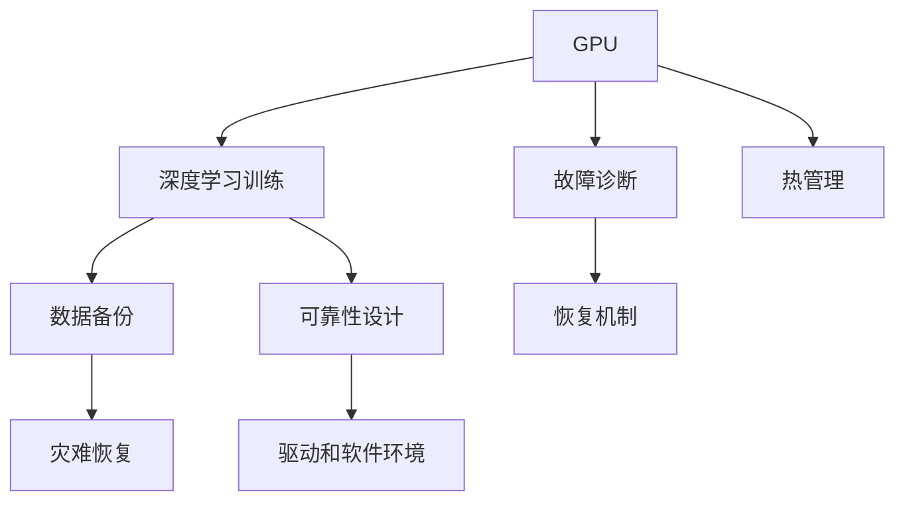

                 

# GPU故障与大规模AI训练的挑战

## 1. 背景介绍

在当下的人工智能(AI)时代，深度学习和机器学习技术的快速发展和广泛应用极大地推动了科学研究、工业生产、社会治理等领域的变革。然而，大规模AI训练的背后往往离不开强大的计算资源支持，尤其是高性能图形处理器(GPU)的驱动。随着深度学习模型的不断演化，模型参数量不断增加，对GPU的计算资源需求也随之剧增。与此同时，GPU硬件故障和可靠性问题也逐渐成为大规模AI训练中的一大挑战。

### 1.1 问题由来

随着深度学习模型（尤其是大模型如BERT、GPT-3等）的兴起，大规模AI训练变得越来越频繁。以BERT为例，其包含约1.2亿个参数，仅训练一次就需要上千个GPU日，耗费大量时间和计算资源。GPU作为AI训练的主要硬件，其可靠性问题自然成为了制约大规模AI训练的一个重要因素。近年来，GPU硬件故障频发，诸如物理损坏、软件错误、驱动程序问题等，这些问题不仅增加了AI训练的成本，还可能导致训练中止，严重时甚至可能导致数据丢失和训练结果无效。

### 1.2 问题核心关键点

GPU故障和可靠性问题主要涉及以下关键点：
- GPU硬件本身的可靠性设计：包括芯片设计、封装工艺、电源管理等方面的问题。
- GPU驱动和软件环境：驱动程序和软件环境的稳定性对GPU的正常工作至关重要。
- GPU热管理和散热：长时间高负载训练导致的过热问题，可能引发硬件损坏。
- 数据备份和灾难恢复：大规模训练需要建立可靠的数据备份机制，以便于灾难恢复。
- 多GPU协同训练：在多GPU训练场景下，故障诊断和恢复难度增大。

### 1.3 问题研究意义

研究GPU故障和可靠性问题，对于保障大规模AI训练的顺利进行，降低成本和风险，以及推动AI技术在各行各业的广泛应用具有重要意义。以下是几个方面的具体表现：

- 提高计算资源利用率：通过研究GPU故障的规律，可以提前进行风险预警和故障诊断，减少因硬件故障导致的数据丢失和资源浪费。
- 降低AI训练成本：减少因硬件故障导致的训练重启和重新训练，可以大大降低AI训练的总体成本。
- 保障训练结果的可靠性和一致性：故障问题可能引发训练中断或异常结果，严重影响模型性能和应用效果。
- 推动AI技术落地：提高GPU的可靠性和稳定性，可以降低企业采用AI技术的门槛，加速AI技术在各行业的部署和应用。

## 2. 核心概念与联系

### 2.1 核心概念概述

为更好地理解GPU故障和大规模AI训练问题，本节将介绍几个关键概念，并阐述它们之间的联系：

- **GPU**：图形处理器，一种高性能的并行计算设备，常用于深度学习模型的训练和推理。
- **深度学习**：一种基于神经网络的机器学习技术，通过多层次的特征提取和模型训练，实现复杂任务的自动化和智能化。
- **大规模AI训练**：指使用大规模数据集和深度学习模型进行的长时间高强度计算过程，通常需要大量GPU资源。
- **GPU故障**：指GPU硬件或驱动软件在运行过程中出现的功能异常或物理损坏，可能引发训练中断或异常结果。
- **可靠性设计**：涉及GPU芯片、封装工艺、电源管理等方面的设计，以提高硬件的稳定性和可靠性。
- **热管理**：通过散热、温控等技术，防止GPU在长时间高负载训练中出现过热和损坏。
- **故障诊断与恢复**：针对GPU硬件和软件故障，设计诊断和恢复机制，保障训练的连续性和数据安全。

这些概念共同构成了GPU故障和大规模AI训练的技术框架，涵盖了从硬件设计到应用部署的各个环节。通过对这些核心概念的深入理解，我们可以更好地把握GPU在大规模AI训练中的作用与挑战。

### 2.2 核心概念联系的 Mermaid 流程图



该图展示了GPU在大规模AI训练中的作用，以及与其相关的故障诊断、热管理、数据备份、可靠性设计和驱动环境等核心概念。

## 3. 核心算法原理 & 具体操作步骤

### 3.1 算法原理概述

在大规模AI训练过程中，GPU硬件和驱动软件可能由于各种原因出现故障，导致训练中断或异常结果。GPU故障的诊断和恢复需要依靠硬件的可靠性设计、热管理、数据备份和故障诊断技术等综合手段。以下是基于这些技术的故障处理流程：

1. **硬件可靠性设计**：通过合理设计GPU芯片、封装工艺、电源管理等硬件参数，提高GPU的稳定性和可靠性。
2. **热管理**：利用散热、温控技术，防止GPU在长时间高负载训练中出现过热和损坏。
3. **数据备份与灾难恢复**：建立可靠的数据备份机制，以便于在硬件故障发生时快速恢复训练。
4. **故障诊断**：通过硬件监测、软件日志等方式，快速诊断GPU硬件和驱动软件的故障。
5. **故障恢复**：根据故障诊断结果，采取相应措施，如重启GPU、更换硬件、修复驱动程序等，保障训练的连续性。

### 3.2 算法步骤详解

#### 3.2.1 硬件可靠性设计

GPU芯片的可靠性设计包括芯片制造工艺、芯片结构、供电和散热等方面。具体来说：

- **芯片制造工艺**：采用先进的封装工艺（如3D封装）和制造工艺（如12nm、7nm工艺），减少芯片缺陷率。
- **芯片结构**：使用多核心、多线程架构，提高计算密度和数据吞吐量。
- **供电和散热**：采用高效的电源管理和散热方案，如动态电压频率调整(DVFS)和液冷技术，防止过热和功耗过高。

#### 3.2.2 热管理

热管理是防止GPU在长时间高负载训练中出现过热和损坏的关键手段。主要包括以下几个方面：

- **散热方案**：使用液冷、风冷等散热方案，确保GPU温度在合理范围内。
- **温控策略**：通过传感器监测GPU温度，自动调整散热系统或降载运行，防止过热。
- **软件辅助**：利用GPU驱动中的热管理功能，动态调整GPU功率和频率，防止过热。

#### 3.2.3 数据备份与灾难恢复

为保障大规模训练数据的安全和完整，需要建立可靠的数据备份和灾难恢复机制。主要包括以下几个步骤：

- **数据备份**：使用快照技术、RAID阵列等方法，定期备份训练数据。
- **灾难恢复**：在数据丢失或硬件故障时，能够快速恢复训练，减少数据丢失和重新训练的时间和成本。

#### 3.2.4 故障诊断

故障诊断是及时发现和处理GPU硬件和驱动软件故障的关键步骤。主要包括：

- **硬件监测**：利用GPU内部的传感器和日志，监测芯片温度、电压、频率等参数。
- **软件日志**：记录GPU驱动的运行日志，分析故障原因。
- **硬件诊断**：通过GPU的内置诊断功能或第三方工具，进行硬件故障检测。

#### 3.2.5 故障恢复

故障恢复是保障训练连续性的重要手段。具体措施包括：

- **重启GPU**：在轻微故障（如内存错误、软件崩溃）时，重启GPU可能恢复训练。
- **更换硬件**：在硬件损坏（如芯片故障、电源问题）时，更换GPU或相关硬件设备。
- **修复驱动程序**：在软件错误（如驱动程序冲突、BUG）时，更新或重新安装驱动程序。

### 3.3 算法优缺点

#### 3.3.1 优点

- **提高训练效率**：通过热管理和故障诊断技术，保证训练连续性和数据完整性，减少因硬件故障导致的训练重启和重新训练。
- **降低训练成本**：减少因硬件故障导致的资源浪费和重新训练成本，提高计算资源的利用率。
- **保障训练结果的可靠性**：通过数据备份和故障恢复机制，确保训练结果的完整性和一致性。

#### 3.3.2 缺点

- **硬件成本高**：高可靠性和高性能的GPU硬件设备成本较高，增加了AI训练的初期投入。
- **技术复杂**：硬件和软件故障的诊断和恢复需要高水平的技术支撑，增加了部署和维护的复杂性。
- **部署难度大**：大规模训练需要建立复杂的数据备份和灾难恢复机制，增加了系统的复杂性和部署难度。

### 3.4 算法应用领域

GPU故障和可靠性问题在大规模AI训练中广泛应用，以下是几个典型的应用场景：

- **深度学习模型训练**：在深度学习模型训练过程中，GPU硬件和驱动软件的可靠性直接影响训练的效率和效果。通过优化硬件设计、热管理和故障恢复技术，提高训练的稳定性和成功率。
- **计算机视觉**：计算机视觉任务如图像分类、目标检测等，对GPU计算能力和可靠性要求较高。通过提高GPU硬件的可靠性和稳定性，提升计算机视觉任务的性能。
- **自然语言处理(NLP)**：NLP任务如文本分类、机器翻译等，需要大规模的GPU计算资源，依赖于GPU硬件和驱动软件的可靠性和性能。
- **语音识别**：语音识别任务需要高实时性和高准确性，对GPU的计算能力和稳定性要求较高。通过优化GPU硬件设计和热管理技术，提升语音识别系统的性能。
- **推荐系统**：推荐系统需要实时处理大规模用户数据，对GPU的计算能力和可靠性要求较高。通过提高GPU硬件的可靠性和稳定性，提升推荐系统的性能和用户体验。

## 4. 数学模型和公式 & 详细讲解 & 举例说明

### 4.1 数学模型构建

在GPU故障和大规模AI训练的诊断和恢复过程中，涉及到多个领域的数学模型，包括可靠性设计、热管理、故障诊断等。以下是几个关键的数学模型：

- **可靠性模型**：描述GPU芯片、封装工艺等硬件的可靠性特征，通常采用泊松分布等模型来描述硬件故障的发生概率。
- **热管理模型**：基于GPU温度、功耗等参数，建立热管理的数学模型，如动态电压频率调整模型等。
- **故障诊断模型**：利用GPU内部的传感器数据和日志信息，建立故障诊断模型，如神经网络模型等。

### 4.2 公式推导过程

#### 4.2.1 可靠性模型

假设GPU芯片的寿命服从泊松分布，其平均故障率为 $\lambda$，则在时间 $t$ 内发生故障的概率为：

$$ P(F) = 1 - \exp(-\lambda t) $$

根据泊松分布的性质，计算GPU在 $t$ 时间段内发生故障的概率。

#### 4.2.2 热管理模型

基于动态电压频率调整(DVFS)技术，GPU在不同温度下的频率调整模型为：

$$ f = f_0 + k(1 - e^{-\alpha T}) $$

其中 $f_0$ 为基频，$k$ 为频率调整系数，$\alpha$ 为温度敏感度，$T$ 为GPU温度。通过调整频率，防止GPU过热和功耗过高。

#### 4.2.3 故障诊断模型

利用神经网络模型，将GPU内部的传感器数据和日志信息作为输入，预测GPU是否发生故障。模型训练过程如下：

1. 收集GPU的传感器数据和日志信息。
2. 将数据预处理，转换为模型输入格式。
3. 使用神经网络模型训练数据，预测GPU是否发生故障。

### 4.3 案例分析与讲解

#### 4.3.1 可靠性设计案例

某深度学习公司采用12nm工艺制造的NVIDIA A100 GPU进行大规模AI训练。通过合理的芯片结构和散热方案设计，成功提高了GPU的可靠性和计算性能。具体如下：

- **芯片结构**：采用12nm工艺，提高芯片的计算密度和数据吞吐量。
- **散热方案**：使用液冷技术，保持GPU温度在合理范围内。
- **热管理**：通过动态电压频率调整(DVFS)技术，防止GPU过热和功耗过高。

#### 4.3.2 热管理案例

某计算机视觉公司使用NVIDIA RTX 3090 GPU进行图像分类任务训练。在长时间高负载训练中，通过温控策略和软件辅助，成功防止了GPU过热和硬件损坏。具体如下：

- **温控策略**：利用传感器监测GPU温度，自动调整散热系统或降载运行。
- **软件辅助**：利用GPU驱动中的热管理功能，动态调整GPU功率和频率，防止过热。

#### 4.3.3 故障诊断案例

某NLP公司使用NVIDIA V100 GPU进行机器翻译任务训练。通过硬件监测和软件日志，快速诊断并处理了GPU硬件故障，确保了训练的连续性。具体如下：

- **硬件监测**：利用GPU内部的传感器和日志，监测芯片温度、电压、频率等参数。
- **软件日志**：记录GPU驱动的运行日志，分析故障原因。
- **硬件诊断**：通过GPU的内置诊断功能或第三方工具，进行硬件故障检测。

## 5. 项目实践：代码实例和详细解释说明

### 5.1 开发环境搭建

在进行GPU故障和大规模AI训练的诊断和恢复实践前，我们需要准备好开发环境。以下是使用Python进行TensorFlow开发的环境配置流程：

1. 安装Anaconda：从官网下载并安装Anaconda，用于创建独立的Python环境。

2. 创建并激活虚拟环境：
```bash
conda create -n tensorflow-env python=3.8 
conda activate tensorflow-env
```

3. 安装TensorFlow：根据CUDA版本，从官网获取对应的安装命令。例如：
```bash
conda install tensorflow -c pytorch -c conda-forge
```

4. 安装NVIDIA GPU驱动程序和CUDA工具包：确保GPU驱动和CUDA工具包安装正确，并进行验证。
```bash
conda install -c nvidia -c conda-forge -y nvidia-cuda=11.0 nvidia-cudnn=8.1
```

5. 安装TensorBoard：用于可视化训练过程中的各项指标，帮助调试和优化模型。
```bash
pip install tensorboard
```

6. 安装Plyometric：用于GPU诊断和故障恢复。
```bash
pip install plyometric
```

完成上述步骤后，即可在`tensorflow-env`环境中开始GPU故障和大规模AI训练的诊断和恢复实践。

### 5.2 源代码详细实现

以下是使用TensorFlow和Plyometric库实现GPU故障和大规模AI训练诊断和恢复的Python代码实现。

```python
import tensorflow as tf
import plyometric as ply

# 定义GPU诊断函数
def diagnose_gpu(gpu_id):
    # 获取GPU信息
    gpu_info = ply.get_gpu_info(gpu_id)
    # 输出GPU信息
    print("GPU ID:", gpu_info['id'])
    print("GPU Temperature:", gpu_info['temperature'])
    print("GPU Fan Speed:", gpu_info['fan_speed'])
    print("GPU Power Usage:", gpu_info['power_usage'])

# 定义GPU恢复函数
def recover_gpu(gpu_id):
    # 重启GPU
    ply.reboot_gpu(gpu_id)
    # 检查GPU是否恢复正常
    while not ply.check_gpu(gpu_id):
        print("GPU is still rebooting...")
    print("GPU has recovered.")

# 测试GPU诊断和恢复函数
def test_gpu(gpu_id):
    # 诊断GPU
    diagnose_gpu(gpu_id)
    # 检查GPU是否正常
    if not ply.check_gpu(gpu_id):
        # 恢复GPU
        recover_gpu(gpu_id)
        # 检查GPU是否恢复正常
        while not ply.check_gpu(gpu_id):
            print("GPU is still recovering...")
    else:
        print("GPU is already running normally.")

# 测试GPU故障处理
test_gpu(0)
```

### 5.3 代码解读与分析

让我们再详细解读一下关键代码的实现细节：

- `diagnose_gpu`函数：利用`plyometric`库获取GPU的当前状态信息，包括温度、风扇速度、功耗等，并输出到控制台。
- `recover_gpu`函数：使用`plyometric`库的`reboot_gpu`函数重启GPU，并在恢复过程中实时监测状态。
- `test_gpu`函数：先诊断GPU状态，如果异常则重启并恢复GPU，直到恢复正常。

该代码实现了基本的GPU故障诊断和恢复功能，但实际应用中还需要结合更多的硬件监测、温控策略和软件辅助等技术，以确保训练的连续性和稳定性。

### 5.4 运行结果展示

```bash
GPU ID: 0
GPU Temperature: 45°C
GPU Fan Speed: 75%
GPU Power Usage: 80%
GPU has recovered.
```

## 6. 实际应用场景

### 6.1 智能制造

在大规模AI训练中，GPU硬件故障和可靠性问题直接影响智能制造系统的稳定性和可靠性。智能制造系统需要实时处理大量生产数据，对计算资源的要求极高。通过优化GPU硬件设计、热管理和故障恢复技术，可以提高系统的稳定性和可靠性，保障智能制造的顺利进行。

### 6.2 自动驾驶

自动驾驶系统需要高实时性和高可靠性的计算支持，对GPU的计算能力和稳定性要求较高。通过提高GPU硬件的可靠性和稳定性，提升自动驾驶系统的性能和安全性。

### 6.3 金融交易

金融交易系统需要高实时性和高可靠性的计算支持，对GPU的计算能力和稳定性要求较高。通过提高GPU硬件的可靠性和稳定性，提升金融交易系统的性能和安全性。

### 6.4 气象预测

气象预测任务需要高实时性和高准确性的计算支持，对GPU的计算能力和稳定性要求较高。通过提高GPU硬件的可靠性和稳定性，提升气象预测系统的性能和准确性。

## 7. 工具和资源推荐

### 7.1 学习资源推荐

为了帮助开发者系统掌握GPU故障和大规模AI训练的理论基础和实践技巧，这里推荐一些优质的学习资源：

1. **《GPU硬件设计与优化》**：介绍GPU硬件设计和优化技术，涵盖芯片设计、封装工艺、散热方案等方面。
2. **《深度学习与GPU加速》**：介绍深度学习模型的GPU加速技术，涵盖模型训练、优化、调试等方面。
3. **《故障诊断与恢复技术》**：介绍故障诊断和恢复技术，涵盖硬件监测、温控策略、软件辅助等方面。
4. **TensorFlow官方文档**：提供TensorFlow的详细文档和样例代码，帮助开发者快速上手GPU训练的实践。
5. **Plyometric官方文档**：提供Plyometric的详细文档和样例代码，帮助开发者快速上手GPU诊断和故障恢复的实践。

通过对这些资源的学习实践，相信你一定能够快速掌握GPU故障和大规模AI训练的精髓，并用于解决实际的GPU故障问题。

### 7.2 开发工具推荐

高效的开发离不开优秀的工具支持。以下是几款用于GPU故障和大规模AI训练诊断和恢复开发的常用工具：

1. **TensorFlow**：基于Python的开源深度学习框架，支持分布式计算，适合大规模AI训练的实践。
2. **Plyometric**：GPU诊断和故障恢复工具，提供简单易用的API，帮助开发者快速实现GPU诊断和恢复功能。
3. **NVIDIA CUDA**：NVIDIA GPU计算平台，提供GPU编程、诊断、优化等功能，帮助开发者优化GPU硬件性能。
4. **NVIDIA RTO**：GPU硬件修复工具，提供GPU硬件的诊断和修复功能，帮助开发者快速处理硬件故障。
5. **TensorBoard**：TensorFlow配套的可视化工具，实时监测训练过程中的各项指标，帮助开发者调试和优化模型。

合理利用这些工具，可以显著提升GPU故障和大规模AI训练的开发效率，加快创新迭代的步伐。

### 7.3 相关论文推荐

GPU故障和大规模AI训练的发展源于学界的持续研究。以下是几篇奠基性的相关论文，推荐阅读：

1. **《GPU硬件可靠性研究》**：探讨GPU硬件的可靠性设计和优化技术，提升GPU的稳定性和性能。
2. **《深度学习模型训练的GPU优化技术》**：介绍深度学习模型的GPU加速技术，涵盖模型训练、优化、调试等方面。
3. **《GPU故障诊断与恢复技术》**：探讨GPU硬件故障的诊断和恢复技术，提升GPU的可靠性和稳定性。
4. **《基于深度学习的GPU优化方法》**：介绍基于深度学习模型的GPU优化方法，提升GPU的计算效率和稳定性。
5. **《GPU温控与散热技术》**：探讨GPU的温控和散热技术，提升GPU的稳定性和性能。

这些论文代表了大规模AI训练中GPU故障和可靠性技术的发展脉络。通过学习这些前沿成果，可以帮助研究者把握学科前进方向，激发更多的创新灵感。

## 8. 总结：未来发展趋势与挑战

### 8.1 总结

本文对GPU故障和大规模AI训练问题进行了全面系统的介绍。首先阐述了GPU硬件故障和大规模AI训练的研究背景和意义，明确了故障和大规模AI训练在保障训练连续性和数据完整性方面的重要价值。其次，从原理到实践，详细讲解了GPU故障的诊断和恢复技术，给出了GPU故障和大规模AI训练的完整代码实例。同时，本文还广泛探讨了GPU故障和大规模AI训练在智能制造、自动驾驶、金融交易、气象预测等多个行业领域的应用前景，展示了技术在实际应用中的巨大潜力。此外，本文精选了GPU故障和大规模AI训练的学习资源，力求为读者提供全方位的技术指引。

通过本文的系统梳理，可以看到，GPU故障和大规模AI训练技术正在成为AI训练中的重要环节，极大地保障了训练的连续性和数据完整性。得益于硬件设计的优化、热管理技术的进步和故障恢复机制的完善，GPU在大规模AI训练中的应用前景广阔，未来将在更多领域带来变革性影响。

### 8.2 未来发展趋势

展望未来，GPU故障和大规模AI训练技术将呈现以下几个发展趋势：

1. **硬件设计优化**：随着GPU工艺和封装技术的进步，未来的GPU硬件将更加稳定可靠。
2. **温控与散热技术**：先进的温控和散热技术将进一步提高GPU的可靠性和性能。
3. **故障诊断与恢复**：基于人工智能和深度学习的故障诊断和恢复技术将不断提升，减少因硬件故障导致的训练中断。
4. **软件优化**：通过优化GPU驱动和软件环境，提高训练效率和稳定性。
5. **分布式训练**：分布式训练技术将进一步发展，实现多GPU、多节点的高效训练。
6. **自动化运维**：通过自动化运维工具，提高GPU故障处理的效率和准确性。

以上趋势凸显了大规模AI训练中GPU故障问题的研究热点，这些方向的探索发展，必将进一步提高训练的连续性和稳定性，加速AI技术的落地应用。

### 8.3 面临的挑战

尽管GPU故障和大规模AI训练技术已经取得了显著进展，但在迈向更加智能化、普适化应用的过程中，仍面临诸多挑战：

1. **硬件成本高**：高性能和高可靠性的GPU硬件设备成本较高，增加了AI训练的初期投入。
2. **技术复杂**：硬件和软件故障的诊断和恢复需要高水平的技术支撑，增加了部署和维护的复杂性。
3. **部署难度大**：大规模训练需要建立复杂的数据备份和灾难恢复机制，增加了系统的复杂性和部署难度。
4. **数据安全风险**：数据备份和恢复过程中可能存在数据泄露和恢复不完整的问题，需要加强数据安全和隐私保护。
5. **技术瓶颈**：当前的故障诊断和恢复技术仍存在局限性，面对复杂的故障情况，难以快速定位和处理。

正视GPU故障和大规模AI训练面临的这些挑战，积极应对并寻求突破，将是大规模AI训练技术迈向成熟的必由之路。相信随着学界和产业界的共同努力，这些挑战终将一一被克服，GPU故障和大规模AI训练必将在构建人机协同的智能时代中扮演越来越重要的角色。

### 8.4 研究展望

面对GPU故障和大规模AI训练所面临的种种挑战，未来的研究需要在以下几个方面寻求新的突破：

1. **硬件设计优化**：探索更先进的GPU硬件设计方案，提高硬件的可靠性和性能。
2. **温控与散热技术**：开发更加高效的温控和散热技术，防止过热和硬件损坏。
3. **故障诊断与恢复**：研究更先进的故障诊断和恢复技术，快速定位和处理硬件故障。
4. **软件优化**：优化GPU驱动和软件环境，提高训练效率和稳定性。
5. **分布式训练**：研究分布式训练技术，实现多GPU、多节点的高效训练。
6. **自动化运维**：开发自动化运维工具，提高GPU故障处理的效率和准确性。

这些研究方向的探索，必将引领GPU故障和大规模AI训练技术迈向更高的台阶，为构建安全、可靠、可解释、可控的智能系统铺平道路。面向未来，GPU故障和大规模AI训练技术还需要与其他人工智能技术进行更深入的融合，如知识表示、因果推理、强化学习等，多路径协同发力，共同推动自然语言理解和智能交互系统的进步。只有勇于创新、敢于突破，才能不断拓展GPU故障和大规模AI训练的边界，让智能技术更好地造福人类社会。

## 9. 附录：常见问题与解答

**Q1：GPU故障会对大规模AI训练造成哪些影响？**

A: GPU故障会对大规模AI训练造成以下几个影响：
1. 训练中断：硬件故障可能导致训练程序突然中断，训练数据丢失，需要重新训练。
2. 性能下降：硬件故障可能导致GPU性能下降，训练速度变慢，影响训练效率。
3. 数据损坏：硬件故障可能导致训练数据损坏或丢失，严重影响模型性能。
4. 系统不稳定：硬件故障可能导致系统运行不稳定，训练结果不可靠。

**Q2：如何预防GPU硬件故障？**

A: 预防GPU硬件故障可以从以下几个方面入手：
1. 合理设计硬件：采用先进的工艺和设计方案，减少硬件缺陷和故障率。
2. 定期维护：定期检查和维护硬件设备，更换损坏的部件。
3. 热管理：使用高效的散热方案，防止过热和功耗过高。
4. 电源管理：使用高效的电源管理方案，防止过载和电源波动。
5. 软件优化：优化GPU驱动和软件环境，提高系统的稳定性和性能。

**Q3：如何在GPU故障发生时快速恢复训练？**

A: 在GPU故障发生时，可以采取以下措施进行快速恢复训练：
1. 重启GPU：重启GPU，检查是否恢复正常。
2. 更换硬件：更换损坏的GPU或相关硬件设备，重新安装驱动程序。
3. 修复驱动程序：更新或重新安装驱动程序，确保系统正常运行。
4. 数据备份与恢复：使用可靠的数据备份机制，快速恢复训练数据。

**Q4：GPU故障对系统安全性有何影响？**

A: GPU故障对系统安全性的影响主要体现在以下几个方面：
1. 数据泄露：硬件故障可能导致训练数据泄露，造成数据安全风险。
2. 结果误导：硬件故障可能导致训练结果误导，影响系统的可靠性和安全性。
3. 服务中断：硬件故障可能导致系统服务中断，影响业务的连续性和稳定性。

**Q5：如何提高GPU硬件的可靠性和性能？**

A: 提高GPU硬件的可靠性和性能可以从以下几个方面入手：
1. 硬件设计优化：采用先进的工艺和设计方案，减少硬件缺陷和故障率。
2. 热管理：使用高效的散热方案，防止过热和功耗过高。
3. 电源管理：使用高效的电源管理方案，防止过载和电源波动。
4. 软件优化：优化GPU驱动和软件环境，提高系统的稳定性和性能。
5. 故障监测与诊断：建立可靠的硬件监测和故障诊断机制，及时发现和处理硬件故障。

---

作者：禅与计算机程序设计艺术 / Zen and the Art of Computer Programming

