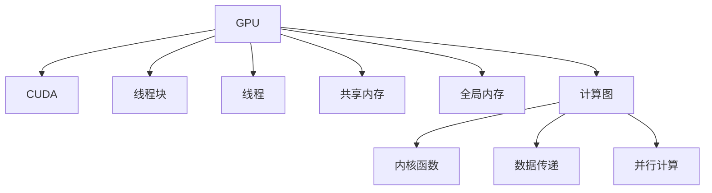

                 

## 1. 背景介绍

在现代高性能计算系统中，GPU（图形处理器）因其并行处理能力和能效比，已成为处理密集计算任务的关键硬件。尤其是对于深度学习、图形渲染等对并行计算需求极高的应用，GPU成为了不可或缺的重要组成部分。CUDA（Compute Unified Device Architecture）是NVIDIA专为GPU开发的高性能并行计算平台，支持C/C++等语言，并提供了丰富的库和开发工具，使得GPU编程变得更加简单和高效。

### 1.1 问题由来

随着深度学习的普及，模型的参数量和计算量急剧增加，传统的CPU已难以满足高效计算的需求。GPU的并行计算能力使其成为训练深度学习模型的新选择。然而，GPU编程的复杂性和编程模型与CPU的显著不同，使得许多开发者对使用GPU编程望而却步。本文旨在通过介绍CUDA编程的基础知识和实际应用，帮助开发者快速掌握GPU编程技术，并应用于深度学习和其他高性能计算任务中。

### 1.2 问题核心关键点

CUDA编程涉及多个关键点：

- 并行计算模型：CUDA基于GPU硬件特性设计了独特的并行计算模型，包括线程块、线程、共享内存、全局内存等概念。
- 内存管理：如何在有限的空间内高效管理数据，避免内存碎片和内存分配问题，是CUDA编程的一大挑战。
- 高性能优化：通过合理的线程调度、内存布局、并行算法等技术，实现高效的并行计算，避免瓶颈问题。
- 开发工具和库：CUDA提供了丰富的开发工具和库，如nvcc编译器、Cub库、CUSPARSE库等，极大降低了开发难度。

## 2. 核心概念与联系

### 2.1 核心概念概述

为了更好地理解CUDA编程，本节将介绍几个关键概念：

- **GPU**：图形处理器，现代高性能计算系统的重要组成部分，具有强大的并行处理能力。
- **CUDA**：NVIDIA为GPU开发的高性能并行计算平台，支持C/C++语言，提供了丰富的库和开发工具。
- **线程块(Block)**：CUDA中最基本的并行计算单位，由多个线程组成。
- **线程(Thread)**：线程块中的最小执行单元，负责具体计算任务。
- **共享内存(Shared Memory)**：线程块内线程共享的临时存储空间，用于线程间的数据交换。
- **全局内存(Global Memory)**：线程块之间共享的长期存储空间，用于存储持久化数据。
- **计算图(Calculations Graph)**：用于描述GPU计算流程的抽象结构，包括内核函数(Kernel Function)、数据传递、并行计算等。

这些核心概念之间的逻辑关系可以通过以下Mermaid流程图来展示：



这个流程图展示了GPU、CUDA、线程块、线程、共享内存、全局内存和计算图之间的关系：

- GPU作为硬件平台，是CUDA编程的基础。
- CUDA提供了抽象层，使得GPU编程更加易用。
- 线程块和线程是CUDA并行计算的基本单元。
- 共享内存和全局内存分别用于线程间和线程块间的数据存储。
- 计算图描述了GPU的计算流程，包括内核函数、数据传递和并行计算等。

这些概念共同构成了CUDA编程的基础，理解它们是掌握CUDA编程的关键。

## 3. 核心算法原理 & 具体操作步骤

### 3.1 算法原理概述

CUDA编程的核心在于理解并行计算模型和数据管理。CUDA的并行计算模型基于线程块和线程，线程块内线程通过共享内存和全局内存进行数据交换和通信，以实现并行计算。CUDA编程的目标是最大化线程利用率，避免内存瓶颈，实现高效的并行计算。

### 3.2 算法步骤详解

CUDA编程的基本步骤如下：

**Step 1: 准备开发环境**
- 安装NVIDIA CUDA Toolkit：从官网下载最新版本的CUDA Toolkit，并按照安装指南完成安装。
- 安装CUDA compilation tools：将编译器nvcc添加到系统环境变量PATH中。

**Step 2: 编写CUDA程序**
- 定义计算内核函数：CUDA程序的核心在于定义计算内核函数，即并行计算的逻辑。
- 定义数据访问方式：通过设备函数(Device Function)和设备内存(Device Memory)进行数据传递。
- 编写主函数：在主函数中进行数据准备和计算内核调用的控制。

**Step 3: 编译和优化**
- 使用nvcc编译器编译CUDA程序：`nvcc -o my_program my_program.cu`。
- 使用CUDA profiling工具进行性能分析：如CUDA Graphs、NVTX、CUDA Visual Profiler等。
- 根据分析结果进行优化：调整线程块大小、共享内存使用、并行算法等，提升计算效率。

**Step 4: 部署和运行**
- 将优化后的CUDA程序部署到GPU上：通过GPU内存分配和数据传输，实现并行计算。
- 监控程序运行状态：使用CUDA events和CUDA Graphs进行实时监控和调试。

### 3.3 算法优缺点

CUDA编程具有以下优点：
- 并行计算能力：GPU的并行处理能力使其能够高效地处理大规模计算任务。
- 高性能优化：CUDA提供了丰富的库和工具，如CUSPARSE、Cub库，加速了高性能算法实现。
- 跨平台性：CUDA支持多种操作系统，包括Linux、Windows等。

然而，CUDA编程也存在一些缺点：
- 学习曲线陡峭：CUDA编程模型与CPU编程有很大差异，需要一定的学习成本。
- 资源限制：GPU资源有限，需要合理分配线程块大小和共享内存使用，避免内存瓶颈。
- 开发工具限制：CUDA编译器和工具依赖于NVIDIA硬件，跨平台性有限。

尽管存在这些限制，CUDA编程在深度学习、图形渲染等高性能计算任务中仍然占据重要地位，其优势难以被其他编程模型替代。

### 3.4 算法应用领域

CUDA编程广泛应用于深度学习、图形渲染、科学计算等领域：

- **深度学习**：利用GPU的并行处理能力，加速神经网络模型训练和推理。
- **图形渲染**：通过CUDA进行图形处理和渲染，提升图形渲染性能。
- **科学计算**：CUDA支持高效的科学计算库，如cuBLAS、cuFFT等，应用于科学计算和仿真模拟。
- **数据分析**：利用CUDA的高性能数据处理能力，进行大数据分析和实时处理。
- **人工智能**：CUDA在AI领域的应用广泛，包括语音识别、图像处理、自然语言处理等。

## 4. 数学模型和公式 & 详细讲解 & 举例说明

### 4.1 数学模型构建

CUDA编程涉及多个数学模型，包括矩阵乘法、卷积运算、线性代数等。以下以矩阵乘法为例，介绍CUDA编程的数学模型构建。

**输入**：两个矩阵A和B，大小分别为m×n和n×p。

**输出**：矩阵C，大小为m×p。

**目标**：计算矩阵C=C×A×B。

### 4.2 公式推导过程

在CUDA编程中，矩阵乘法可以通过设备函数进行实现。设矩阵A和B在GPU内存中的存储位置分别为A_mem和B_mem，计算结果C存储在C_mem中。

**Step 1: 数据准备**

将矩阵A和B加载到GPU内存中：
```c
void initMatrix(double** A_mem, double** B_mem, double** C_mem, int m, int n, int p) {
    // 分配GPU内存
    // 将矩阵A和B从CPU内存复制到GPU内存
    // 将矩阵C从GPU内存分配
    // 将矩阵A和B的大小和计算结果C的大小存储到GPU内存中
}
```

**Step 2: 矩阵乘法**

在设备函数中进行矩阵乘法的计算：
```c
__global__ void matrixMultiplicationKernel(double** A_mem, double** B_mem, double** C_mem, int m, int n, int p) {
    int tid = blockIdx.x * blockDim.x + threadIdx.x;
    int row = blockIdx.y * blockDim.y + threadIdx.y;
    int col = tid;
    if (tid < m && row < p) {
        double sum = 0;
        for (int k = 0; k < n; k++) {
            sum += A_mem[tid][k] * B_mem[k][row];
        }
        C_mem[tid][row] = sum;
    }
}
```

**Step 3: 主函数**

在主函数中启动计算内核：
```c
int main() {
    // 准备数据
    double** A_mem = (double**)malloc(sizeof(double*) * m);
    double** B_mem = (double**)malloc(sizeof(double*) * n);
    double** C_mem = (double**)malloc(sizeof(double*) * m);
    // 初始化矩阵
    // 启动计算内核
    matrixMultiplicationKernel<<<bDim, tDim>>>(A_mem, B_mem, C_mem, m, n, p);
    // 释放内存
    return 0;
}
```

### 4.3 案例分析与讲解

以下以图像处理为例，展示CUDA编程的应用。

**问题描述**：图像灰度化处理，即将彩色图像转换为灰度图像。

**算法**：遍历图像中的每个像素，计算其RGB三个通道的平均值，作为灰度值。

**CUDA程序**：
```c
__global__ void grayscaleKernel(unsigned char* in_mem, unsigned char* out_mem, int width, int height) {
    int tid = blockIdx.x * blockDim.x + threadIdx.x;
    if (tid < width * height) {
        unsigned char r = in_mem[tid];
        unsigned char g = in_mem[tid + width];
        unsigned char b = in_mem[tid + width * 2];
        unsigned char gray = (r + g + b) / 3;
        out_mem[tid] = gray;
    }
}

int main() {
    // 分配内存
    unsigned char* in_mem = (unsigned char*)malloc(sizeof(unsigned char) * width * height * 3);
    unsigned char* out_mem = (unsigned char*)malloc(sizeof(unsigned char) * width * height);
    // 初始化输入图像
    // 启动计算内核
    grayscaleKernel<<<bDim, tDim>>>(in_mem, out_mem, width, height);
    // 释放内存
    return 0;
}
```

**运行结果**：在CUDA设备的GPU上运行程序，得到灰度化的图像。

## 5. 项目实践：代码实例和详细解释说明

### 5.1 开发环境搭建

在开始CUDA编程实践前，需要先准备好开发环境。以下是使用NVIDIA CUDA Toolkit搭建CUDA开发环境的流程：

1. 安装NVIDIA CUDA Toolkit：从官网下载最新版本的CUDA Toolkit，并按照安装指南完成安装。
2. 安装CUDA compilation tools：将编译器nvcc添加到系统环境变量PATH中。
3. 安装CUDA Examples：从NVIDIA官网下载CUDA Examples，解压后复制到CUDA Toolkit的安装目录中。

完成上述步骤后，即可在CUDA Toolkit的安装目录下进行CUDA编程实践。

### 5.2 源代码详细实现

以下是一个简单的CUDA程序，用于计算矩阵乘法的示例：

```c
#include <stdio.h>
#include <cuda_runtime.h>
#include <cublas_v2.h>

void matrixMultiplicationKernel(double** A_mem, double** B_mem, double** C_mem, int m, int n, int p) {
    int tid = blockIdx.x * blockDim.x + threadIdx.x;
    int row = blockIdx.y * blockDim.y + threadIdx.y;
    int col = tid;
    if (tid < m && row < p) {
        double sum = 0;
        for (int k = 0; k < n; k++) {
            sum += A_mem[tid][k] * B_mem[k][row];
        }
        C_mem[tid][row] = sum;
    }
}

int main() {
    // 准备数据
    double** A_mem = (double**)malloc(sizeof(double*) * m);
    double** B_mem = (double**)malloc(sizeof(double*) * n);
    double** C_mem = (double**)malloc(sizeof(double*) * m);
    // 初始化矩阵
    // 启动计算内核
    matrixMultiplicationKernel<<<bDim, tDim>>>(A_mem, B_mem, C_mem, m, n, p);
    // 释放内存
    return 0;
}
```

### 5.3 代码解读与分析

**关键代码解读**：

1. **矩阵乘法计算**：
    - 定义计算内核函数`matrixMultiplicationKernel`，接收矩阵A和B在GPU内存中的位置，计算结果C的位置，矩阵的大小。
    - 通过线程号`tid`和线程块号`blockIdx`计算当前线程在矩阵中的位置。
    - 遍历矩阵A和B，计算当前线程在矩阵C中的值。
    - 主函数`main`：
        - 分配矩阵A、B和C的GPU内存。
        - 初始化矩阵A、B和C。
        - 启动计算内核`matrixMultiplicationKernel`。
        - 释放内存。

**运行结果展示**：

- 在CUDA设备上运行程序，得到矩阵C的计算结果。
- 通过CUDA Graphs工具监控程序运行状态，查看计算时间、线程利用率等关键指标。

## 6. 实际应用场景

### 6.1 图形渲染

CUDA在图形渲染领域得到了广泛应用，NVIDIA的CUDA图形API（CUDA Compute）提供了丰富的图形渲染函数库，如CUDA's Sobel filter、CUDA's Bilateral filter等，极大提升了图形渲染效率。

### 6.2 科学计算

CUDA的高性能并行计算能力，使得许多科学计算任务能够高效地运行。如cuBLAS、cuFFT等高性能计算库，广泛应用于线性代数、傅里叶变换等计算任务中。

### 6.3 数据分析

CUDA支持高效的科学计算库，如cuDNN、cuSOLVER等，能够快速处理大规模数据分析任务，如深度学习模型的训练和推理、大规模数据集的卷积、求解大规模线性方程组等。

## 7. 工具和资源推荐

### 7.1 学习资源推荐

为了帮助开发者系统掌握CUDA编程的理论基础和实践技巧，这里推荐一些优质的学习资源：

1. NVIDIA CUDA官方文档：NVIDIA提供的官方文档，涵盖CUDA编程的各个方面，包括编程模型、库函数、性能调优等。
2. CUDA by Example系列书籍：通过实例展示CUDA编程的应用，帮助读者理解和掌握CUDA编程。
3. Udacity《CUDA并行编程》课程：Udacity提供的在线课程，系统介绍CUDA编程和优化技巧。
4. Coursera《GPU Computing》课程：Coursera提供的课程，介绍GPU编程的基础和高级技巧。

通过对这些资源的学习实践，相信你一定能够快速掌握CUDA编程的技巧，并应用于实际的深度学习和其他高性能计算任务中。

### 7.2 开发工具推荐

高效的开发离不开优秀的工具支持。以下是几款用于CUDA编程开发的常用工具：

1. Visual Studio：Microsoft提供的开发环境，支持CUDA编程，提供丰富的调试和分析工具。
2. Eclipse：开源的开发环境，支持CUDA编程，提供自动完成和语法高亮等功能。
3. JetBrains CLion：支持CUDA编程的IDE，提供高效的代码补全和自动重构功能。
4. NVIDIA CUDA Graphs：用于监控和调试CUDA程序的工具，帮助开发者分析程序性能。
5. NVIDIA cuDNN：NVIDIA提供的深度神经网络库，支持卷积运算等计算密集型任务，极大提升深度学习模型的计算速度。

合理利用这些工具，可以显著提升CUDA编程的开发效率，加快创新迭代的步伐。

### 7.3 相关论文推荐

CUDA编程涉及多个领域的研究，以下是几篇奠基性的相关论文，推荐阅读：

1. NVidia CUDA Programming Guide：NVIDIA提供的官方指南，系统介绍CUDA编程的基础和高级技巧。
2. Accelerating Computational Science with NVIDIA CUDA：NVIDIA发表的论文，介绍了CUDA在科学计算中的应用。
3. Optimizing GPU Performance with CUDA Graphs：NVIDIA发表的论文，介绍了如何使用CUDA Graphs进行性能优化。
4. Parallel Programming with CUDA：NVIDIA发表的书籍，系统介绍CUDA编程的各个方面。

这些论文代表了CUDA编程技术的发展脉络，通过学习这些前沿成果，可以帮助研究者把握学科前进方向，激发更多的创新灵感。

## 8. 总结：未来发展趋势与挑战

### 8.1 研究成果总结

本文对CUDA编程的基础知识和实际应用进行了全面系统的介绍。首先阐述了CUDA编程的背景和重要性，明确了CUDA编程在深度学习和其他高性能计算任务中的关键作用。其次，从原理到实践，详细讲解了CUDA编程的各个方面，包括并行计算模型、数据管理、高性能优化等，给出了CUDA编程的完整代码实例。同时，本文还广泛探讨了CUDA编程在图像处理、科学计算等领域的实际应用，展示了CUDA编程的强大能力。

通过本文的系统梳理，可以看到，CUDA编程为深度学习和其他高性能计算任务提供了强大的并行计算能力，是实现高效计算的重要手段。CUDA编程技术的应用，为GPU加速的计算密集型任务带来了新的可能，推动了高性能计算领域的发展。

### 8.2 未来发展趋势

展望未来，CUDA编程技术将呈现以下几个发展趋势：

1. 多核扩展：随着GPU硬件的不断发展，多核扩展能力将进一步提升，使得CUDA编程能够处理更大规模的计算任务。
2. 软件栈优化：CUDA软件栈的不断优化，如cuDNN、cuBLAS等库的更新，将使得CUDA编程更加高效。
3. 异构计算：CUDA编程将进一步支持CPU-GPU、GPU-GPU、GPU-加速器等异构计算，提升计算效率。
4. AI-Acceleration：CUDA编程将在AI领域发挥更加重要的作用，支持深度学习模型的训练和推理，推动AI技术的发展。
5. 跨平台支持：CUDA编程将进一步支持跨平台开发，支持ARM、Risc-V等架构的GPU。

以上趋势凸显了CUDA编程技术的广阔前景，这些方向的探索发展，将进一步提升CUDA编程的性能和应用范围。

### 8.3 面临的挑战

尽管CUDA编程技术已经取得了瞩目成就，但在迈向更加智能化、普适化应用的过程中，它仍面临着诸多挑战：

1. 学习成本高：CUDA编程模型与CPU编程有很大差异，需要一定的学习成本。
2. 资源限制：GPU资源有限，需要合理分配线程块大小和共享内存使用，避免内存瓶颈。
3. 开发工具限制：CUDA编译器和工具依赖于NVIDIA硬件，跨平台性有限。
4. 数据传输效率：GPU内存与CPU内存之间的数据传输效率问题，需要优化。
5. 并行编程难度：CUDA编程中的并行编程难度较大，需要仔细设计线程块大小、线程数等参数。

尽管存在这些挑战，CUDA编程在深度学习、图形渲染等高性能计算任务中仍然占据重要地位，其优势难以被其他编程模型替代。未来，CUDA编程需要更多的研究创新，突破这些挑战，才能实现更大规模的应用。

### 8.4 研究展望

未来的CUDA编程研究需要在以下几个方面寻求新的突破：

1. 并行计算模型优化：开发更加高效的并行计算模型，提升线程利用率，避免内存瓶颈。
2. 异构计算支持：支持更多的异构计算架构，如CPU-GPU、GPU-GPU、GPU-加速器等。
3. 跨平台支持：开发跨平台的CUDA编程工具和库，支持更多的硬件平台。
4. 数据传输优化：提升GPU内存与CPU内存之间的数据传输效率，避免瓶颈问题。
5. 开发工具改进：开发更加易于使用的CUDA编程工具和库，降低开发难度。

这些研究方向的探索，将引领CUDA编程技术迈向更高的台阶，为高性能计算领域带来新的突破。面向未来，CUDA编程需要与其他编程模型和技术进行更深入的融合，共同推动高性能计算的发展。

## 9. 附录：常见问题与解答

**Q1: CUDA编程和CPU编程有哪些不同？**

A: CUDA编程和CPU编程的主要区别在于并行计算模型和数据管理方式。CUDA编程利用GPU的并行计算能力，通过线程块和线程实现并行计算，而CPU编程则依赖多线程和任务调度实现并行计算。CUDA编程的内存管理也不同于CPU编程，需要考虑GPU的内存特性，避免内存瓶颈。

**Q2: 如何优化CUDA程序？**

A: 优化CUDA程序可以从以下几个方面入手：
1. 并行计算模型优化：合理设计线程块大小和线程数，提升线程利用率。
2. 内存管理优化：避免内存碎片，合理分配共享内存和全局内存，提升内存使用效率。
3. 算法优化：选择高效的算法实现，避免计算瓶颈。
4. 数据传输优化：优化GPU内存与CPU内存之间的数据传输，避免瓶颈问题。
5. 并行算法优化：使用CUDA提供的优化工具，如CUDA Graphs、CUDA Visual Profiler等，分析并优化程序性能。

**Q3: CUDA编程有哪些应用场景？**

A: CUDA编程广泛应用于以下领域：
1. 深度学习：利用GPU的并行计算能力，加速神经网络模型训练和推理。
2. 图形渲染：通过CUDA进行图形处理和渲染，提升图形渲染性能。
3. 科学计算：CUDA支持高效的科学计算库，如cuBLAS、cuFFT等，应用于科学计算和仿真模拟。
4. 数据分析：利用CUDA的高性能数据处理能力，进行大数据分析和实时处理。
5. 人工智能：CUDA在AI领域的应用广泛，包括语音识别、图像处理、自然语言处理等。

通过学习CUDA编程，可以更好地掌握GPU加速的计算密集型任务，提升系统性能和计算效率。

---

作者：禅与计算机程序设计艺术 / Zen and the Art of Computer Programming

