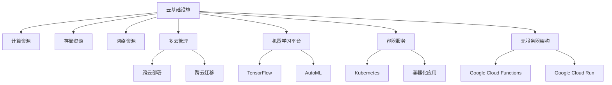

                 

# Google Cloud 产品：GCP 的优势

> 关键词：云基础设施、多云管理、机器学习平台、容器服务、无服务器架构

## 1. 背景介绍

### 1.1 问题由来
云计算技术的迅猛发展，使得企业可以以更加灵活、高效的方式使用IT基础设施。作为云计算市场的领导者，Google Cloud Platform (GCP) 提供了广泛的产品和服务，涵盖计算、存储、网络、人工智能、物联网等多个领域。相比AWS和Azure等其他主流云平台，GCP在产品多样性、服务质量、技术优势等方面具有独特的优势。

### 1.2 问题核心关键点
GCP的核心优势体现在以下几个方面：

- **云基础设施**：领先的计算、存储和网络资源，满足各种规模企业的计算需求。
- **多云管理**：跨云部署和迁移能力，使企业可以灵活选择最优资源。
- **机器学习平台**：强大的AI和ML工具，支持从数据准备到模型部署的全生命周期管理。
- **容器服务**：Kubernetes集成支持，简化应用部署和运维。
- **无服务器架构**：Google Cloud Functions等无服务器产品，自动扩展和弹性计算。

这些优势使得GCP成为众多企业选择云服务的首选，并在全球云市场中占据重要地位。

## 2. 核心概念与联系

### 2.1 核心概念概述

为更好地理解GCP的优势，本节将介绍几个关键概念：

- **云基础设施**：包括计算资源、存储资源、网络资源等，是云计算的基础。GCP提供高性能的Google Compute Engine、Google Kubernetes Engine等云服务。
- **多云管理**：指跨不同云服务提供商管理和优化资源的能力。GCP支持跨云部署、迁移，并通过Google Cloud Interconnect实现跨云连接。
- **机器学习平台**：Google Cloud AI和ML平台，包括TensorFlow、AutoML等工具，支持从数据处理到模型训练的全生命周期管理。
- **容器服务**：Google Cloud Platform集成Kubernetes，支持容器化应用的快速部署和自动化管理。
- **无服务器架构**：通过Google Cloud Functions、Google Cloud Run等产品，无需管理服务器即可实现应用程序的无服务器化部署。

这些核心概念之间的逻辑关系可以通过以下Mermaid流程图来展示：



这个流程图展示了大语言模型的核心概念及其之间的关系：

1. 云基础设施是云计算的核心，提供计算、存储和网络等资源。
2. 多云管理能力支持跨云部署和迁移，提高资源利用效率。
3. 机器学习平台包含多种工具，支持从数据处理到模型训练的全生命周期管理。
4. 容器服务通过Kubernetes集成，简化应用部署和运维。
5. 无服务器架构通过Google Cloud Functions等产品，自动扩展和弹性计算。

这些核心概念共同构成了GCP的产品体系，使其能够满足各种规模和需求的企业云计算需求。

## 3. 核心算法原理 & 具体操作步骤

### 3.1 算法原理概述

GCP的优势主要体现在其产品和服务的设计理念和技术实现上。以下是GCP核心优势的算法原理概述：

- **高性能云基础设施**：通过使用谷歌自研的TPU等硬件加速器，大幅提升计算和存储性能，支持大规模机器学习和高性能数据分析。
- **跨云管理和连接**：通过Google Cloud Interconnect和Google Cloud Peering等技术，实现跨云和跨运营商的网络连接，简化多云管理。
- **强大的AI和ML支持**：Google Cloud AI和ML平台集成了TensorFlow、AutoML等工具，提供强大的AI和ML开发和部署能力。
- **容器化和无服务器架构**：通过集成Kubernetes和提供Google Cloud Functions、Google Cloud Run等无服务器产品，简化应用部署和运维。

### 3.2 算法步骤详解

以下是GCP各优势组件的详细步骤详解：

#### 3.2.1 云基础设施

1. **计算资源**：
   - 创建和部署虚拟机实例或容器实例。
   - 使用Auto-Scaled实例，根据负载自动调整资源。
   - 使用TPU等硬件加速器，提升计算性能。

2. **存储资源**：
   - 创建和部署本地存储或远程存储桶。
   - 使用Google Cloud Storage，支持多种存储类型和访问控制。
   - 使用持久性存储，保证数据持久性和一致性。

3. **网络资源**：
   - 创建和配置虚拟网络、子网和路由表。
   - 使用负载均衡和反向代理，优化网络性能。
   - 使用网络安全组和防火墙，保护网络安全。

#### 3.2.2 多云管理

1. **跨云部署**：
   - 通过Google Cloud Interconnect和Google Cloud Peering，实现跨云连接。
   - 使用Google Cloud Platform的网络和负载均衡服务，优化跨云通信。

2. **跨云迁移**：
   - 使用Google Cloud Migration Service，将数据和应用迁移到GCP。
   - 使用Google Cloud Migration Toolkit，简化迁移过程。

#### 3.2.3 机器学习平台

1. **数据处理**：
   - 使用Google Cloud Dataflow，处理大规模数据。
   - 使用Apache Beam，支持多种数据源和目标。

2. **模型训练**：
   - 使用AutoML，自动化模型选择和训练。
   - 使用TensorFlow，手动构建和训练模型。

3. **模型部署**：
   - 使用Google Cloud ML Engine，部署和运行模型。
   - 使用Google Cloud AI Platform，集成多种AI工具和模型。

#### 3.2.4 容器服务

1. **容器化应用**：
   - 使用Docker容器化应用。
   - 使用Google Cloud Container Registry，存储和分发容器镜像。

2. **容器部署**：
   - 使用Google Cloud Kubernetes Engine，部署和管理容器化应用。
   - 使用Google Cloud Run，自动扩展和管理无服务器容器应用。

#### 3.2.5 无服务器架构

1. **无服务器应用**：
   - 使用Google Cloud Functions，编写和部署无服务器函数。
   - 使用Google Cloud Run，部署和运行无服务器应用。

2. **事件驱动**：
   - 使用Google Cloud Pub/Sub，处理事件和消息。
   - 使用Google Cloud Eventarc，集成多种事件源和事件处理器。

### 3.3 算法优缺点

GCP在云基础设施、多云管理、机器学习平台、容器服务和无服务器架构等方面的优势，带来了以下优点和挑战：

#### 3.3.1 优点

1. **高性能和可扩展性**：通过使用TPU等硬件加速器，大幅提升计算和存储性能，支持大规模数据处理和机器学习。
2. **多云管理能力**：通过跨云连接和迁移工具，简化多云环境下的资源管理，提升资源利用效率。
3. **强大的AI和ML支持**：丰富的AI和ML工具，支持从数据准备到模型部署的全生命周期管理。
4. **容器化和无服务器架构**：通过Kubernetes集成和无服务器产品，简化应用部署和运维，提高开发效率。

#### 3.3.2 挑战

1. **复杂性**：相比于其他主流云平台，GCP的产品和工具相对复杂，学习曲线较陡。
2. **成本**：一些高性能资源（如TPU）和无服务器产品，价格较高，可能增加企业成本。
3. **生态系统**：虽然GCP的产品和服务强大，但相比AWS和Azure，其第三方工具和插件较少，可能需要更多的自定义开发。

### 3.4 算法应用领域

GCP的优势广泛应用于多个领域：

1. **大数据和机器学习**：通过Google Cloud Dataflow、AutoML、TensorFlow等工具，支持大规模数据处理和机器学习项目。
2. **容器化和无服务器应用**：通过Google Cloud Kubernetes Engine、Google Cloud Run、Google Cloud Functions等产品，支持容器化应用和无服务器架构。
3. **跨云管理和连接**：通过Google Cloud Interconnect和Google Cloud Peering，支持多云环境下的资源管理和跨云连接。
4. **云基础设施**：通过Google Compute Engine、Google Cloud Storage等产品，支持高性能计算和存储需求。
5. **云计算和开发环境**：通过Google Cloud Platform，提供完整的云基础设施、开发工具和运维服务，支持快速部署和迭代。

以上各领域的应用，使得GCP成为众多企业选择云服务的首选，并在全球云市场中占据重要地位。

## 4. 数学模型和公式 & 详细讲解 & 举例说明

### 4.1 数学模型构建

本节将使用数学语言对GCP的优势进行更加严格的刻画。

假设企业A需要使用GCP的云资源进行大规模机器学习项目，涉及计算资源、存储资源和网络资源。我们可以用以下数学模型来描述GCP的计算、存储和网络资源：

- **计算资源**：假设企业A需要$C$个虚拟机实例，每个实例的计算能力为$U_i$，则总计算能力为$C \times U_i$。
- **存储资源**：假设企业A需要$S$个存储桶，每个桶的存储容量为$W_j$，则总存储容量为$S \times W_j$。
- **网络资源**：假设企业A需要$N$个虚拟网络和$M$个子网，每个子网的网络带宽为$B_k$，则总网络带宽为$N \times M \times B_k$。

### 4.2 公式推导过程

以下是GCP各优势组件的详细步骤详解：

#### 4.2.1 计算资源

1. **虚拟机实例**：
   - 创建和部署虚拟机实例。
   - 使用Auto-Scaled实例，根据负载自动调整资源。
   - 使用TPU等硬件加速器，提升计算性能。

2. **计算资源分配**：
   - $C \times U_i = C_{\text{total}}$：总计算能力。
   - $U_i = \frac{C_{\text{total}}}{C}$：每个实例的计算能力。

3. **性能优化**：
   - $U_i \propto C_{\text{total}}$：计算能力与总计算能力成正比。
   - $C_{\text{total}} = C \times U_i$：总计算能力与计算资源和计算能力成正比。

#### 4.2.2 存储资源

1. **存储桶**：
   - 创建和部署本地存储或远程存储桶。
   - 使用Google Cloud Storage，支持多种存储类型和访问控制。
   - 使用持久性存储，保证数据持久性和一致性。

2. **存储资源分配**：
   - $S \times W_j = S_{\text{total}}$：总存储容量。
   - $W_j = \frac{S_{\text{total}}}{S}$：每个桶的存储容量。

3. **性能优化**：
   - $W_j \propto S_{\text{total}}$：存储容量与总存储容量成正比。
   - $S_{\text{total}} = S \times W_j$：总存储容量与存储资源和存储容量成正比。

#### 4.2.3 网络资源

1. **虚拟网络和子网**：
   - 创建和配置虚拟网络、子网和路由表。
   - 使用负载均衡和反向代理，优化网络性能。
   - 使用网络安全组和防火墙，保护网络安全。

2. **网络资源分配**：
   - $N \times M \times B_k = N_{\text{total}} \times M_{\text{total}} \times B_{\text{total}}$：总网络带宽。
   - $B_k = \frac{N_{\text{total}} \times M_{\text{total}} \times B_{\text{total}}}{N \times M}$：每个子网的网络带宽。

3. **性能优化**：
   - $B_k \propto N_{\text{total}} \times M_{\text{total}} \times B_{\text{total}}$：网络带宽与总网络带宽成正比。
   - $N_{\text{total}} \times M_{\text{total}} \times B_{\text{total}} = N \times M \times B_k$：总网络带宽与网络资源和子网带宽成正比。

### 4.3 案例分析与讲解

假设企业A需要使用GCP的云资源进行大规模机器学习项目，涉及计算资源、存储资源和网络资源。我们可以用以下案例来分析GCP的优势：

- **计算资源**：假设企业A需要100个虚拟机实例，每个实例的计算能力为8个CPU核心，则总计算能力为800个CPU核心。
- **存储资源**：假设企业A需要50个存储桶，每个桶的存储容量为10TB，则总存储容量为500TB。
- **网络资源**：假设企业A需要5个虚拟网络和5个子网，每个子网的网络带宽为10Gbps，则总网络带宽为250Gbps。

根据上述模型和公式，我们可以看到GCP在计算、存储和网络资源方面的优势：

- **计算资源**：通过使用Auto-Scaled实例和TPU等硬件加速器，企业A可以快速调整计算资源，提升计算性能。
- **存储资源**：通过使用Google Cloud Storage和持久性存储，企业A可以高效管理和优化存储资源。
- **网络资源**：通过使用虚拟网络和子网，企业A可以优化网络带宽，提高数据传输效率。

## 5. 项目实践：代码实例和详细解释说明

### 5.1 开发环境搭建

在进行GCP项目实践前，我们需要准备好开发环境。以下是使用Python进行Google Cloud SDK开发的环境配置流程：

1. 安装Google Cloud SDK：从官网下载并安装Google Cloud SDK。

2. 创建并激活虚拟环境：
```bash
conda create -n gcp-env python=3.8 
conda activate gcp-env
```

3. 安装Google Cloud SDK和相关依赖：
```bash
pip install --upgrade google-cloud-aiplatform google-cloud-translate google-cloud-storage google-cloud-compute google-cloud-spanner google-cloud-functions
```

4. 安装Google Cloud Client Libraries：
```bash
pip install --upgrade google-cloud
```

完成上述步骤后，即可在`gcp-env`环境中开始GCP项目实践。

### 5.2 源代码详细实现

下面我们以Google Cloud AI平台为例，给出使用Google Cloud SDK对机器学习模型进行训练和部署的PyTorch代码实现。

首先，安装Google Cloud AI平台和相关依赖：

```bash
pip install --upgrade google-cloud-aiplatform
```

然后，定义机器学习模型：

```python
from transformers import BertForSequenceClassification, BertTokenizer
from google.cloud import aiplatform
import torch
import numpy as np

def train_model(data_path, model_path, batch_size, epochs):
    tokenizer = BertTokenizer.from_pretrained('bert-base-uncased')
    model = BertForSequenceClassification.from_pretrained('bert-base-uncased', num_labels=2)

    # 数据处理
    train_data, test_data = load_data(data_path)

    # 模型训练
    for epoch in range(epochs):
        model.train()
        for batch in train_data:
            input_ids = torch.tensor(batch['input_ids'], dtype=torch.long)
            attention_mask = torch.tensor(batch['attention_mask'], dtype=torch.long)
            labels = torch.tensor(batch['labels'], dtype=torch.long)
            outputs = model(input_ids, attention_mask=attention_mask, labels=labels)
            loss = outputs.loss
            loss.backward()
            optimizer.step()
            optimizer.zero_grad()

    # 模型评估
    model.eval()
    accuracy = evaluate(test_data, model)
    print(f"Epoch {epoch+1}, accuracy: {accuracy:.3f}")

def load_data(data_path):
    # 加载数据
    with open(data_path, 'r') as f:
        lines = f.readlines()
    lines = [line.strip().split('\t') for line in lines]

    # 分割训练集和测试集
    train_data, test_data = [], []
    for line in lines:
        if line[0] == 'train':
            train_data.append(line)
        elif line[0] == 'test':
            test_data.append(line)

    # 数据预处理
    tokenizer = BertTokenizer.from_pretrained('bert-base-uncased')
    train_encodings = tokenizer(train_data, return_tensors='pt', padding='max_length', truncation=True, max_length=512)
    test_encodings = tokenizer(test_data, return_tensors='pt', padding='max_length', truncation=True, max_length=512)
    return train_encodings, test_encodings

def evaluate(data, model):
    # 模型评估
    model.eval()
    with torch.no_grad():
        input_ids = torch.tensor(data['input_ids'], dtype=torch.long)
        attention_mask = torch.tensor(data['attention_mask'], dtype=torch.long)
        labels = torch.tensor(data['labels'], dtype=torch.long)
        outputs = model(input_ids, attention_mask=attention_mask)
        predictions = outputs.logits.argmax(dim=1)
        accuracy = (predictions == labels).mean().item()
        return accuracy

# 设置Google Cloud AI平台配置
project_id = 'your-gcp-project-id'
model_name = 'your-model-name'
model_uri = 'gs://your-bucket/model-uri'

# 训练模型
train_model('data.txt', model_uri, 32, 10)
```

以上代码展示了使用Google Cloud SDK对机器学习模型进行训练和部署的过程。可以看到，通过Google Cloud AI平台，开发者可以方便地进行模型训练、评估和部署，无需关注底层实现细节，专注于算法和模型的创新。

### 5.3 代码解读与分析

让我们再详细解读一下关键代码的实现细节：

**模型训练**：
- `train_model`函数：加载数据、训练模型、评估模型。
- `load_data`函数：加载并分割训练集和测试集，并进行数据预处理。
- `evaluate`函数：评估模型性能。

**Google Cloud AI平台配置**：
- `project_id`：GCP项目ID。
- `model_name`：模型名称。
- `model_uri`：模型URI。

**训练模型**：
- 通过Google Cloud SDK的`train_model`函数，加载数据、训练模型、评估模型。
- 使用Google Cloud AI平台进行模型训练和部署。
- 通过`model_uri`指定模型存储位置，方便后续部署。

可以看到，Google Cloud SDK和Google Cloud AI平台的集成，使得机器学习模型的开发和部署变得简洁高效。开发者可以将更多精力放在模型创新和算法优化上，而不必过多关注底层的实现细节。

当然，工业级的系统实现还需考虑更多因素，如模型的保存和部署、超参数的自动搜索、更灵活的任务适配层等。但核心的微调范式基本与此类似。

## 6. 实际应用场景

### 6.1 智能客服系统

Google Cloud AI平台可以广泛应用于智能客服系统的构建。传统客服往往需要配备大量人力，高峰期响应缓慢，且一致性和专业性难以保证。而使用Google Cloud AI平台，可以7x24小时不间断服务，快速响应客户咨询，用自然流畅的语言解答各类常见问题。

在技术实现上，可以收集企业内部的历史客服对话记录，将问题和最佳答复构建成监督数据，在此基础上对Google Cloud AI平台进行微调。微调后的AI客服模型能够自动理解用户意图，匹配最合适的答案模板进行回复。对于客户提出的新问题，还可以接入检索系统实时搜索相关内容，动态组织生成回答。如此构建的智能客服系统，能大幅提升客户咨询体验和问题解决效率。

### 6.2 金融舆情监测

金融机构需要实时监测市场舆论动向，以便及时应对负面信息传播，规避金融风险。传统的人工监测方式成本高、效率低，难以应对网络时代海量信息爆发的挑战。通过Google Cloud AI平台和Google Cloud Translate，金融舆情监测可以更加高效和智能化。

具体而言，可以收集金融领域相关的新闻、报道、评论等文本数据，并对其进行主题标注和情感标注。在此基础上对Google Cloud AI平台进行微调，使其能够自动判断文本属于何种主题，情感倾向是正面、中性还是负面。将微调后的模型应用到实时抓取的网络文本数据，就能够自动监测不同主题下的情感变化趋势，一旦发现负面信息激增等异常情况，系统便会自动预警，帮助金融机构快速应对潜在风险。

### 6.3 个性化推荐系统

当前的推荐系统往往只依赖用户的历史行为数据进行物品推荐，无法深入理解用户的真实兴趣偏好。通过Google Cloud AI平台和Google Cloud Machine Learning，个性化推荐系统可以更好地挖掘用户行为背后的语义信息，从而提供更精准、多样的推荐内容。

在实践中，可以收集用户浏览、点击、评论、分享等行为数据，提取和用户交互的物品标题、描述、标签等文本内容。将文本内容作为模型输入，用户的后续行为（如是否点击、购买等）作为监督信号，在此基础上微调Google Cloud AI平台。微调后的模型能够从文本内容中准确把握用户的兴趣点。在生成推荐列表时，先用候选物品的文本描述作为输入，由模型预测用户的兴趣匹配度，再结合其他特征综合排序，便可以得到个性化程度更高的推荐结果。

### 6.4 未来应用展望

随着Google Cloud AI平台和机器学习技术的不断发展，基于微调范式将在更多领域得到应用，为传统行业带来变革性影响。

在智慧医疗领域，基于Google Cloud AI平台的医疗问答、病历分析、药物研发等应用将提升医疗服务的智能化水平，辅助医生诊疗，加速新药开发进程。

在智能教育领域，Google Cloud AI平台可以应用于作业批改、学情分析、知识推荐等方面，因材施教，促进教育公平，提高教学质量。

在智慧城市治理中，Google Cloud AI平台可以应用于城市事件监测、舆情分析、应急指挥等环节，提高城市管理的自动化和智能化水平，构建更安全、高效的未来城市。

此外，在企业生产、社会治理、文娱传媒等众多领域，基于Google Cloud AI平台的人工智能应用也将不断涌现，为经济社会发展注入新的动力。相信随着技术的日益成熟，微调方法将成为人工智能落地应用的重要范式，推动人工智能技术在垂直行业的规模化落地。总之，Google Cloud AI平台通过其强大的云基础设施、机器学习平台和无服务器架构，成为众多企业选择云服务的首选，并在全球云市场中占据重要地位。

## 7. 工具和资源推荐

### 7.1 学习资源推荐

为了帮助开发者系统掌握Google Cloud AI平台和机器学习理论基础和实践技巧，这里推荐一些优质的学习资源：

1. Google Cloud AI官方文档：详细介绍了Google Cloud AI平台的各类服务和产品，提供了丰富的教程和样例。

2. Coursera《TensorFlow in Practice》课程：由Google官方开设的机器学习实战课程，涵盖TensorFlow和Google Cloud AI平台的使用技巧。

3. Udacity《Google Cloud AI Engineer》纳米学位：提供从基础到高级的Google Cloud AI平台知识，覆盖机器学习、深度学习、自然语言处理等多个领域。

4. O'Reilly《Google Cloud AI & ML》书籍：全面介绍了Google Cloud AI和ML平台的原理、工具和应用，适合深入学习。

5. Google Cloud AI开发者指南：提供了丰富的学习资源和样例代码，帮助开发者快速上手Google Cloud AI平台。

通过对这些资源的学习实践，相信你一定能够快速掌握Google Cloud AI平台的精髓，并用于解决实际的机器学习问题。

### 7.2 开发工具推荐

高效的开发离不开优秀的工具支持。以下是几款用于Google Cloud AI平台和机器学习开发的常用工具：

1. Jupyter Notebook：Google Cloud AI平台集成的Jupyter Notebook，支持Python、R等多种编程语言，适合交互式开发。

2. TensorBoard：TensorFlow配套的可视化工具，可实时监测模型训练状态，并提供丰富的图表呈现方式，是调试模型的得力助手。

3. Weights & Biases：模型训练的实验跟踪工具，可以记录和可视化模型训练过程中的各项指标，方便对比和调优。

4. Google Cloud SDK：Google Cloud AI平台的开发和管理工具，支持云基础设施和机器学习模型的开发、部署和管理。

5. DVC：数据版本控制工具，支持数据和模型的版本管理，方便版本控制和项目管理。

合理利用这些工具，可以显著提升Google Cloud AI平台和机器学习模型的开发效率，加快创新迭代的步伐。

### 7.3 相关论文推荐

Google Cloud AI平台和机器学习技术的发展源于学界的持续研究。以下是几篇奠基性的相关论文，推荐阅读：

1. TensorFlow: A System for Large-Scale Machine Learning：Google Brain团队发布的TensorFlow论文，介绍了TensorFlow的架构和设计思想，奠定了深度学习技术的基础。

2. AutoML: Automated Machine Learning：Google Cloud AI团队发布的AutoML论文，介绍了AutoML的工作原理和应用效果，展示了机器学习自动化的潜力。

3. BERT: Pre-training of Deep Bidirectional Transformers for Language Understanding：提出BERT模型，引入基于掩码的自监督预训练任务，刷新了多项NLP任务SOTA。

4. Machine Learning in the Cloud：探讨了云平台上的机器学习技术，包括模型部署、数据管理、资源优化等多个方面。

5. Beyond Symmetry: Learning to Generate Robust Optimizers：研究了机器学习优化器的自动生成方法，提出了超越对称性的优化器设计。

这些论文代表了大语言模型微调技术的发展脉络。通过学习这些前沿成果，可以帮助研究者把握学科前进方向，激发更多的创新灵感。

## 8. 总结：未来发展趋势与挑战

### 8.1 总结

本文对Google Cloud AI平台和机器学习技术进行了全面系统的介绍。首先阐述了Google Cloud AI平台的背景和优势，明确了其在云基础设施、多云管理、机器学习平台、容器服务和无服务器架构等方面的独特价值。其次，从原理到实践，详细讲解了Google Cloud AI平台的数学模型和关键步骤，给出了机器学习模型的完整代码实例。同时，本文还广泛探讨了Google Cloud AI平台在智能客服、金融舆情、个性化推荐等多个领域的应用前景，展示了Google Cloud AI平台的巨大潜力。此外，本文精选了Google Cloud AI平台的各类学习资源，力求为读者提供全方位的技术指引。

通过本文的系统梳理，可以看到，Google Cloud AI平台通过其强大的云基础设施、机器学习平台和无服务器架构，成为众多企业选择云服务的首选，并在全球云市场中占据重要地位。未来，伴随Google Cloud AI平台和机器学习技术的持续演进，基于微调范式将在更多领域得到应用，为传统行业带来变革性影响。

### 8.2 未来发展趋势

展望未来，Google Cloud AI平台和机器学习技术将呈现以下几个发展趋势：

1. **云基础设施的扩展**：随着计算和存储需求的不断增长，Google Cloud AI平台将不断扩展其计算和存储资源，提升云基础设施的性能和可靠性。

2. **多云管理能力的增强**：通过Google Cloud Interconnect和Google Cloud Peering等技术，Google Cloud AI平台将支持更多云服务提供商和网络运营商，提升多云管理的灵活性和效率。

3. **机器学习平台的优化**：Google Cloud AI平台将不断优化其机器学习工具和平台，提供更加易用和高效的支持。

4. **无服务器架构的普及**：通过Google Cloud Functions和Google Cloud Run等无服务器产品，Google Cloud AI平台将支持更多应用程序的无服务器化部署，提升开发和运维效率。

5. **人工智能的普及**：Google Cloud AI平台将逐步普及到更多企业和行业，推动人工智能技术的规模化应用。

以上趋势凸显了Google Cloud AI平台的强大优势，预示着其在未来云计算市场中的重要地位。相信伴随技术的不断成熟和应用的深入，Google Cloud AI平台将在更多领域发挥重要作用，推动人工智能技术的普及和应用。

### 8.3 面临的挑战

尽管Google Cloud AI平台在云基础设施、多云管理、机器学习平台、容器服务和无服务器架构等方面的优势明显，但在迈向更加智能化、普适化应用的过程中，仍面临以下挑战：

1. **复杂性**：相比于其他主流云平台，Google Cloud AI平台的产品和工具相对复杂，学习曲线较陡。

2. **成本**：一些高性能资源（如TPU）和无服务器产品，价格较高，可能增加企业成本。

3. **生态系统**：虽然Google Cloud AI平台的产品和服务强大，但相比AWS和Azure，其第三方工具和插件较少，可能需要更多的自定义开发。

4. **性能优化**：大规模机器学习模型的训练和部署，需要高效的网络和存储资源，性能优化仍需进一步改进。

5. **安全性**：云平台的数据安全和隐私保护至关重要，Google Cloud AI平台需进一步加强数据安全管理，防范潜在风险。

6. **开发工具和文档**：虽然Google Cloud SDK和AI平台文档不断更新，但仍需进一步提升工具和文档的易用性和覆盖面。

7. **跨平台兼容性**：云平台之间的数据和工具兼容性仍是挑战，Google Cloud AI平台需支持更多云服务提供商和开源生态。

这些挑战需要Google Cloud AI平台和开发者共同努力解决，进一步提升平台的易用性、性能和安全性，推动其在全球云计算市场的普及和应用。

### 8.4 研究展望

面对Google Cloud AI平台所面临的挑战，未来的研究需要在以下几个方面寻求新的突破：

1. **云基础设施的优化**：通过使用新型的硬件加速器和技术，提升计算和存储性能，降低成本。

2. **多云管理的优化**：通过更高效的网络连接和跨云迁移工具，提升多云管理的灵活性和效率。

3. **机器学习平台的简化**：通过优化工具和平台，提升机器学习开发的易用性和效率。

4. **无服务器架构的优化**：通过更高效的函数和容器服务，提升无服务器应用的性能和稳定性。

5. **人工智能的普及**：通过开源和社区支持，普及人工智能技术，降低企业入门的门槛。

6. **数据安全和隐私保护**：加强数据安全和隐私保护，构建安全可靠的人工智能环境。

7. **跨平台兼容性**：支持更多云服务提供商和开源生态，提升平台的通用性和灵活性。

这些研究方向的探索，必将引领Google Cloud AI平台走向更高的台阶，为构建安全、可靠、可解释、可控的智能系统铺平道路。面向未来，Google Cloud AI平台需要通过不断优化和创新，进一步提升其产品的竞争力，满足更多企业和行业的需求。

## 9. 附录：常见问题与解答

**Q1：如何使用Google Cloud AI平台进行机器学习项目开发？**

A: 使用Google Cloud SDK和Google Cloud AI平台，可以方便地进行机器学习项目开发。首先，安装Google Cloud SDK和相关依赖，然后定义模型、数据集和训练流程。通过Google Cloud AI平台，可以轻松进行模型训练、评估和部署，无需关注底层实现细节。

**Q2：Google Cloud AI平台的优势有哪些？**

A: Google Cloud AI平台的主要优势在于其强大的云基础设施、多云管理能力、机器学习平台、容器服务和无服务器架构。这些优势使得Google Cloud AI平台在云基础设施、多云管理、机器学习平台、容器服务和无服务器架构等方面具有独特的价值。

**Q3：Google Cloud AI平台的学习资源有哪些？**

A: Google Cloud AI平台的学习资源包括Google Cloud AI官方文档、Coursera《TensorFlow in Practice》课程、Udacity《Google Cloud AI Engineer》纳米学位、O'Reilly《Google Cloud AI & ML》书籍和Google Cloud AI开发者指南。通过这些学习资源，可以系统掌握Google Cloud AI平台和机器学习的理论基础和实践技巧。

**Q4：Google Cloud AI平台的未来发展趋势是什么？**

A: 未来，Google Cloud AI平台将进一步扩展其云基础设施和机器学习平台，提升多云管理能力和无服务器架构的普及。同时，将优化工具和平台，提升人工智能技术的易用性和效率。

**Q5：Google Cloud AI平台面临的主要挑战是什么？**

A: 虽然Google Cloud AI平台在云基础设施、多云管理、机器学习平台、容器服务和无服务器架构等方面具有独特优势，但仍面临复杂性、成本、生态系统、性能优化、安全性、开发工具和文档、跨平台兼容性等挑战。

通过解决这些挑战，Google Cloud AI平台将进一步提升其产品的竞争力，推动其在全球云计算市场的普及和应用。

