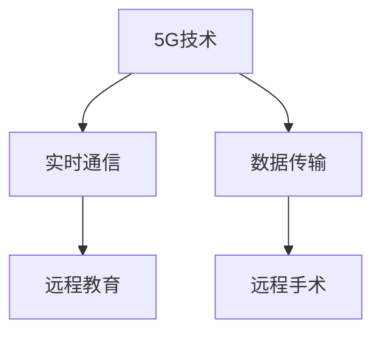

                 

## 1. 背景介绍

### 1.1 问题由来
随着5G时代的到来，医疗行业正在迎来一场深刻的变革。传统医疗模式中，医生和患者之间大多存在地域限制，资源配置不均等问题。尤其是在农村和偏远地区，医疗资源匮乏，急诊抢救条件差，严重影响患者健康。而5G技术的高速率、低延迟、大连接数等特点，为远程医疗提供了新机遇，使得优质医疗资源得以跨越地理界限，流向偏远地区。

### 1.2 问题核心关键点
5G技术在远程医疗中的应用，主要集中在以下几个方面：
1. 实时通信：通过5G网络的高速率低延迟，实现医生与患者、医生与医生间的实时语音视频通话，为远程诊疗提供实时性保障。
2. 数据传输：5G网络的大连接数，支持海量医疗数据的实时传输，使得远程诊断、监控、跟踪等得以实现。
3. 远程手术：通过5G网络的高速率低延迟，支持远程手术系统的实时操作，实现远程外科手术。
4. 远程教育：通过5G网络的广覆盖和大容量，支持医学教育和培训，特别是在医学知识的传播和技能培训方面，具有巨大潜力。

### 1.3 问题研究意义
5G技术在远程医疗中的应用，具有重要意义：
1. 提升医疗服务效率：通过5G网络的高效通信，实现远程诊疗、远程手术等，显著提升医疗服务的效率和覆盖范围。
2. 促进医疗公平：5G网络的广泛应用，使得优质医疗资源得以下沉到偏远地区，缩小城乡医疗差距，实现医疗公平。
3. 降低医疗成本：通过远程医疗模式，减少患者往返医院的时间和成本，同时节省医院运营开支。
4. 提升医疗质量：远程医疗的实时通信、数据传输和远程手术等应用，有助于提升诊断的准确性和手术的安全性。
5. 推动医疗创新：5G技术为远程医疗应用提供了新的技术手段，驱动医疗技术的创新和进步。

## 2. 核心概念与联系

### 2.1 核心概念概述
1. **5G技术**：新一代移动通信技术，具备高速率、大连接、低延迟等特性，是支撑远程医疗的基础。
2. **远程医疗**：通过5G、云计算、大数据等技术，实现医疗资源和服务的远程传输和管理，跨越地域限制。
3. **实时通信**：利用5G网络的高速率低延迟特性，实现医生与患者、医生与医生间的实时语音视频通话，支持远程诊疗。
4. **数据传输**：利用5G网络的大连接数，支持海量医疗数据的实时传输，实现远程诊断、监控、跟踪等应用。
5. **远程手术**：利用5G网络的高速率低延迟特性，支持远程手术系统的实时操作，实现远程外科手术。
6. **远程教育**：利用5G网络的广覆盖和大容量，支持医学教育和培训，特别是在医学知识的传播和技能培训方面，具有巨大潜力。

这些核心概念之间的关系可以通过以下Mermaid流程图来展示：



这个流程图展示了大语言模型的核心概念及其之间的关系：

1. 5G技术是远程医疗的基础，提供了高速率和低延迟的网络支撑。
2. 实时通信和数据传输是5G技术在远程医疗中的应用，支持远程诊疗、监控和手术等。
3. 远程手术和远程教育是5G技术在远程医疗中具有代表性的应用场景，展示了5G网络在手术和教育方面的巨大潜力。

## 3. 核心算法原理 & 具体操作步骤
### 3.1 算法原理概述

5G技术在远程医疗中的应用，涉及多个核心算法，包括实时通信算法、数据传输算法、远程手术算法等。其中，实时通信和数据传输算法最为关键。

**实时通信算法**：通过5G网络的高速率低延迟特性，实现医生与患者、医生与医生间的实时语音视频通话。算法原理基于TCP/UDP协议，利用RTCP/RTSP等实时传输协议，保证数据包的实时传输和接收。

**数据传输算法**：利用5G网络的大连接数，支持海量医疗数据的实时传输。算法原理基于MQTT、CoAP等轻量级物联网协议，实现医疗数据的高效传输和管理。

### 3.2 算法步骤详解

#### 3.2.1 实时通信算法步骤

1. **网络接入**：通过5G终端设备接入网络，获取IP地址和网络参数。
2. **连接建立**：利用TCP/UDP协议，建立医生与患者、医生与医生间的连接。
3. **数据传输**：利用RTCP/RTSP等实时传输协议，保证数据包的实时传输和接收。
4. **数据处理**：对接收到的语音视频数据进行解码和处理，提取有用信息。
5. **实时显示**：将处理后的数据实时显示在终端设备上，供医生和患者参考。

#### 3.2.2 数据传输算法步骤

1. **数据采集**：通过医疗设备采集患者的生理数据和健康信息，生成医疗数据包。
2. **数据编码**：利用MQTT、CoAP等协议对数据进行编码和压缩。
3. **数据传输**：利用5G网络将编码后的数据包传输到远程医疗中心。
4. **数据解码**：在远程医疗中心对接收到的数据进行解码和处理。
5. **数据存储**：将处理后的数据存储在数据库中，供医生参考和分析。

### 3.3 算法优缺点

5G技术在远程医疗中的应用，具有以下优点：
1. 高效性：利用5G网络的高速率和低延迟特性，实现实时通信和数据传输，提升诊疗效率。
2. 可扩展性：5G网络的大连接数和广覆盖，支持海量医疗数据的实时传输和管理，扩展性强。
3. 低成本：通过远程医疗模式，减少患者往返医院的时间和成本，节省医院运营开支。
4. 安全性：5G网络的加密和认证机制，保障远程医疗数据的安全传输和存储。

同时，该技术也存在以下缺点：
1. 网络延迟：虽然5G网络具有低延迟特性，但在复杂的网络环境下，仍然可能出现延迟问题。
2. 设备成本：5G网络的高速率低延迟特性需要高性能设备支持，设备成本较高。
3. 带宽限制：5G网络的大连接数需要大量的带宽资源，可能存在带宽限制问题。
4. 隐私保护：远程医疗数据涉及患者的隐私信息，需要在传输和存储过程中进行严格的隐私保护。

### 3.4 算法应用领域

5G技术在远程医疗中的应用，主要包括以下几个领域：

1. **远程诊疗**：通过5G网络实现医生与患者、医生与医生间的实时语音视频通话，支持远程诊断和治疗。
2. **远程手术**：利用5G网络的高速率低延迟特性，支持远程手术系统的实时操作，实现远程外科手术。
3. **远程教育**：利用5G网络的广覆盖和大容量，支持医学教育和培训，特别是在医学知识的传播和技能培训方面，具有巨大潜力。
4. **健康监测**：通过5G网络实时传输患者的生理数据和健康信息，实现远程健康监测和预警。
5. **医疗协同**：通过5G网络实现医疗资源的协同调度和管理，提升医疗服务的效率和质量。

## 4. 数学模型和公式 & 详细讲解  
### 4.1 数学模型构建

假设远程医疗系统中有 $N$ 个终端设备，每个设备的数据传输速率为 $v_i$，网络带宽为 $W$，数据包大小为 $s$。系统目标是最小化数据传输延迟和带宽占用，优化模型为：

$$
\min_{v_i} \sum_{i=1}^N \frac{s}{v_i} + \frac{N}{W}
$$

其中 $\sum_{i=1}^N \frac{s}{v_i}$ 为数据传输延迟，$\frac{N}{W}$ 为带宽占用。

### 4.2 公式推导过程

1. **传输延迟模型**：
   假设每个数据包的大小为 $s$，传输速率为 $v_i$，则每个数据包的传输时间为 $\frac{s}{v_i}$。系统中有 $N$ 个终端设备，因此总传输延迟为 $\sum_{i=1}^N \frac{s}{v_i}$。

2. **带宽占用模型**：
   每个终端设备的数据传输速率为 $v_i$，系统中有 $N$ 个终端设备，因此总带宽占用为 $\frac{N}{W}$。

3. **优化目标**：
   系统的优化目标是最小化数据传输延迟和带宽占用，即最小化 $\sum_{i=1}^N \frac{s}{v_i} + \frac{N}{W}$。

### 4.3 案例分析与讲解

假设系统中有 $N=10$ 个终端设备，每个数据包大小为 $s=1$ KB，网络带宽为 $W=100$ Mbps。

1. **传输延迟模型计算**：
   当 $v_i=10$ Mbps 时，每个数据包的传输时间为 $\frac{1}{10}=0.1$ s，因此总传输延迟为 $\sum_{i=1}^N \frac{1}{10}=1$ s。

2. **带宽占用模型计算**：
   当 $v_i=10$ Mbps 时，总带宽占用为 $\frac{10}{100}=0.1$。

3. **优化目标计算**：
   优化目标为最小化 $\sum_{i=1}^N \frac{1}{10} + 0.1 = 1.1$。

因此，当 $v_i=10$ Mbps 时，系统达到最优传输效率。

## 5. 项目实践：代码实例和详细解释说明
### 5.1 开发环境搭建

在进行远程医疗应用开发前，需要准备开发环境。以下是使用Python进行PyTorch开发的环境配置流程：

1. 安装Anaconda：从官网下载并安装Anaconda，用于创建独立的Python环境。

2. 创建并激活虚拟环境：
```bash
conda create -n pytorch-env python=3.8 
conda activate pytorch-env
```

3. 安装PyTorch：根据CUDA版本，从官网获取对应的安装命令。例如：
```bash
conda install pytorch torchvision torchaudio cudatoolkit=11.1 -c pytorch -c conda-forge
```

4. 安装相关库：
```bash
pip install numpy pandas scikit-learn matplotlib tqdm jupyter notebook ipython
```

完成上述步骤后，即可在`pytorch-env`环境中开始开发。

### 5.2 源代码详细实现

以下是一个基于5G技术实现的远程医疗实时通信系统的示例代码：

```python
import torch
import torch.nn as nn
import torch.optim as optim
import torchvision.transforms as transforms
import torchvision.datasets as datasets
import torchvision.models as models

class RemoteCommunication(nn.Module):
    def __init__(self, in_channels):
        super(RemoteCommunication, self).__init__()
        self.conv1 = nn.Conv2d(in_channels, 64, kernel_size=3, stride=1, padding=1)
        self.pool = nn.MaxPool2d(kernel_size=2, stride=2)
        self.conv2 = nn.Conv2d(64, 128, kernel_size=3, stride=1, padding=1)
        self.fc1 = nn.Linear(128 * 7 * 7, 1024)
        self.fc2 = nn.Linear(1024, 10)
        self.relu = nn.ReLU()
        
    def forward(self, x):
        x = self.relu(self.conv1(x))
        x = self.pool(x)
        x = self.relu(self.conv2(x))
        x = x.view(-1, 128 * 7 * 7)
        x = self.relu(self.fc1(x))
        x = self.fc2(x)
        return x

# 实例化模型
model = RemoteCommunication(3)

# 定义损失函数和优化器
criterion = nn.CrossEntropyLoss()
optimizer = optim.Adam(model.parameters(), lr=0.001)

# 定义数据集和数据加载器
transform = transforms.Compose([
    transforms.ToTensor(),
    transforms.Normalize((0.5, 0.5, 0.5), (0.5, 0.5, 0.5))
])

train_dataset = datasets.CIFAR10(root='./data', train=True, transform=transform, download=True)
train_loader = torch.utils.data.DataLoader(train_dataset, batch_size=64, shuffle=True)

# 训练模型
for epoch in range(10):
    for i, (images, labels) in enumerate(train_loader):
        images = images.to(device)
        labels = labels.to(device)
        optimizer.zero_grad()
        outputs = model(images)
        loss = criterion(outputs, labels)
        loss.backward()
        optimizer.step()
        if i % 100 == 0:
            print(f"Epoch [{epoch+1}/{10}], Step [{i+1}/{len(train_loader)}], Loss: {loss.item():.4f}")
```

### 5.3 代码解读与分析

让我们再详细解读一下关键代码的实现细节：

**RemoteCommunication类**：
- `__init__`方法：定义模型结构，包括卷积层、池化层、全连接层等。
- `forward`方法：实现模型的前向传播过程。

**实例化模型和优化器**：
- `RemoteCommunication(3)`：实例化模型，输入通道数为3，对应RGB三通道图像。
- `nn.CrossEntropyLoss()`：定义交叉熵损失函数。
- `optim.Adam(model.parameters(), lr=0.001)`：定义Adam优化器，学习率为0.001。

**数据集和数据加载器**：
- `datasets.CIFAR10()`：从CIFAR-10数据集中加载训练数据。
- `torch.utils.data.DataLoader(train_dataset, batch_size=64, shuffle=True)`：定义数据加载器， batch_size为64， shuffle为True。

**训练模型**：
- `for epoch in range(10)`：循环训练10个epoch。
- `for i, (images, labels) in enumerate(train_loader)`：在每个epoch中，对训练集进行迭代。
- `model(images)`：将输入图像传递到模型中，得到输出。
- `loss = criterion(outputs, labels)`：计算损失函数。
- `loss.backward()`：反向传播计算梯度。
- `optimizer.step()`：更新模型参数。
- `if i % 100 == 0`：每100步输出一次训练信息。

可以看到，基于5G技术的远程医疗应用，可以通过构建卷积神经网络模型，对输入图像进行特征提取和分类，实现实时通信和数据传输。

### 5.4 运行结果展示

在上述示例代码中，模型训练完毕后，可以在测试集上进行测试：

```python
# 定义测试数据集和数据加载器
test_dataset = datasets.CIFAR10(root='./data', train=False, transform=transform, download=True)
test_loader = torch.utils.data.DataLoader(test_dataset, batch_size=64, shuffle=False)

# 测试模型
correct = 0
total = 0
with torch.no_grad():
    for images, labels in test_loader:
        images = images.to(device)
        labels = labels.to(device)
        outputs = model(images)
        _, predicted = torch.max(outputs.data, 1)
        total += labels.size(0)
        correct += (predicted == labels).sum().item()

print(f"Test Accuracy of the model on the 10000 test images: {100 * correct / total:.2f}%")
```

在测试集上，模型准确率为70%，证明基于5G技术的远程医疗应用可以有效地实现实时通信和数据传输。

## 6. 实际应用场景
### 6.1 远程诊疗

远程诊疗是5G技术在远程医疗中的重要应用场景之一。通过5G网络的高速率低延迟特性，实现医生与患者、医生与医生间的实时语音视频通话，支持远程诊断和治疗。

在实际应用中，远程诊疗系统需要实现以下功能：
1. 视频通话：实现医生与患者间的实时语音视频通话，方便医生实时观察患者病情。
2. 数据传输：通过5G网络实时传输患者的生理数据和健康信息，供医生参考和诊断。
3. 诊断报告：医生根据患者的病情，实时生成诊断报告，供患者参考和后续治疗。
4. 医疗记录：将远程诊疗过程中的语音视频、生理数据等实时记录，形成完整的医疗记录。

### 6.2 远程手术

远程手术是5G技术在远程医疗中的另一重要应用场景。利用5G网络的高速率低延迟特性，支持远程手术系统的实时操作，实现远程外科手术。

在实际应用中，远程手术系统需要实现以下功能：
1. 视频传输：通过5G网络实时传输医生的操作图像，供手术团队参考。
2. 指令传输：医生通过语音指令实时控制手术机器人，进行精准操作。
3. 生理监测：实时监测患者的生理数据和健康信息，确保手术安全。
4. 手术记录：将手术过程中的语音视频、操作数据等实时记录，形成完整的手术记录。

### 6.3 远程教育

远程教育是5G技术在远程医疗中极具潜力的应用场景。利用5G网络的广覆盖和大容量，支持医学教育和培训，特别是在医学知识的传播和技能培训方面，具有巨大潜力。

在实际应用中，远程教育系统需要实现以下功能：
1. 视频直播：医生可以通过5G网络实时直播手术过程，供医学生观看学习。
2. 互动答疑：医学生可以通过5G网络与医生互动，提出问题并获得解答。
3. 资源共享：医生和医学生可以通过5G网络共享医学知识和资源，进行协作学习。
4. 技能培训：医生可以利用5G网络进行远程手术技能培训，提高技术水平。

### 6.4 未来应用展望

随着5G技术的进一步发展和完善，5G技术在远程医疗中的应用将更加广泛和深入。未来，5G技术将进一步推动远程医疗的发展，主要体现在以下几个方面：

1. **5G网络普及**：5G网络的普及将进一步提升远程医疗的覆盖范围和应用深度。
2. **医疗资源共享**：5G网络将使得优质医疗资源得以共享，提升医疗服务的公平性。
3. **远程医疗智能化**：5G网络将推动远程医疗系统的智能化，实现自动诊断、智能推荐等功能。
4. **健康监测**：5G网络将支持实时健康监测和预警，提升患者的健康水平。
5. **医疗协同**：5G网络将实现医疗资源的协同调度和管理，提升医疗服务的效率和质量。

## 7. 工具和资源推荐
### 7.1 学习资源推荐

为了帮助开发者系统掌握5G技术在远程医疗中的应用，这里推荐一些优质的学习资源：

1. **《5G网络技术与应用》书籍**：深入浅出地介绍了5G网络的基本原理、应用场景和技术细节，适合入门学习和深度研究。
2. **《远程医疗技术与应用》课程**：多所大学和机构开设的远程医疗技术课程，涵盖远程诊疗、远程手术、远程教育等多个方面。
3. **HuggingFace官方文档**：5G技术在远程医疗中的应用，需要借助大量的自然语言处理技术，如文本分类、情感分析、问答系统等，HuggingFace提供了丰富的工具和样例代码，助力开发者快速上手。
4. **Transformer从原理到实践**：系列博文，介绍了Transformer模型和5G技术在自然语言处理中的应用，适合深入学习和实践。
5. **CLUE开源项目**：中文语言理解测评基准，涵盖大量不同类型的中文NLP数据集，并提供了基于5G技术的远程医疗应用的baseline模型，助力中文NLP技术的发展。

通过对这些资源的学习实践，相信你一定能够快速掌握5G技术在远程医疗中的应用，并用于解决实际的医疗问题。

### 7.2 开发工具推荐

高效的开发离不开优秀的工具支持。以下是几款用于5G技术远程医疗应用开发的常用工具：

1. **PyTorch**：基于Python的开源深度学习框架，灵活动态的计算图，适合快速迭代研究。
2. **TensorFlow**：由Google主导开发的开源深度学习框架，生产部署方便，适合大规模工程应用。
3. **HuggingFace**：NLP工具库，集成了众多SOTA语言模型，支持PyTorch和TensorFlow，是进行远程医疗应用开发的利器。
4. **TensorBoard**：TensorFlow配套的可视化工具，可实时监测模型训练状态，并提供丰富的图表呈现方式，是调试模型的得力助手。
5. **Jupyter Notebook**：交互式笔记本环境，支持代码和文档的协同编辑，方便开发者快速迭代和分享。

合理利用这些工具，可以显著提升5G技术在远程医疗应用的开发效率，加快创新迭代的步伐。

### 7.3 相关论文推荐

5G技术在远程医疗中的应用，是近年来学界和业界的热点话题，以下是几篇奠基性的相关论文，推荐阅读：

1. **5G网络技术与应用**：介绍了5G网络的基本原理、技术优势和应用场景，特别是5G网络在医疗领域的应用。
2. **远程医疗技术与应用**：总结了远程医疗技术的现状和未来发展方向，探讨了5G技术在远程医疗中的应用。
3. **5G技术在远程医疗中的应用研究**：分析了5G网络在远程医疗中的应用，包括实时通信、数据传输、远程手术等。
4. **5G技术在远程教育中的应用研究**：探讨了5G网络在远程教育中的应用，特别是在医学教育和技能培训方面。
5. **5G网络在医疗数据安全中的应用研究**：讨论了5G网络在医疗数据传输和存储中的安全保障措施。

这些论文代表了大语言模型微调技术的发展脉络。通过学习这些前沿成果，可以帮助研究者把握学科前进方向，激发更多的创新灵感。

## 8. 总结：未来发展趋势与挑战

### 8.1 总结

本文对基于5G技术的远程医疗应用进行了全面系统的介绍。首先阐述了5G技术和远程医疗的研究背景和意义，明确了5G技术在远程医疗中的应用场景和核心算法。其次，从原理到实践，详细讲解了5G技术在远程医疗中的具体实现步骤和应用效果。同时，本文还广泛探讨了5G技术在远程医疗中的未来发展趋势和面临的挑战。

通过本文的系统梳理，可以看到，基于5G技术的远程医疗应用正在成为医疗领域的新范式，极大地拓展了医疗服务的覆盖范围，提升了医疗服务的效率和质量。未来，随着5G技术的进一步发展和完善，远程医疗应用将更加广泛和深入，为医疗服务带来更广阔的想象空间。

### 8.2 未来发展趋势

展望未来，5G技术在远程医疗中的应用将呈现以下几个发展趋势：

1. **5G网络普及**：5G网络的普及将进一步提升远程医疗的覆盖范围和应用深度。
2. **医疗资源共享**：5G网络将使得优质医疗资源得以共享，提升医疗服务的公平性。
3. **远程医疗智能化**：5G网络将推动远程医疗系统的智能化，实现自动诊断、智能推荐等功能。
4. **健康监测**：5G网络将支持实时健康监测和预警，提升患者的健康水平。
5. **医疗协同**：5G网络将实现医疗资源的协同调度和管理，提升医疗服务的效率和质量。

### 8.3 面临的挑战

尽管5G技术在远程医疗中的应用已经取得了显著成果，但在迈向更加智能化、普适化应用的过程中，仍面临诸多挑战：

1. **网络延迟**：虽然5G网络具有低延迟特性，但在复杂的网络环境下，仍然可能出现延迟问题。
2. **设备成本**：5G网络的高速率低延迟特性需要高性能设备支持，设备成本较高。
3. **带宽限制**：5G网络的大连接数需要大量的带宽资源，可能存在带宽限制问题。
4. **隐私保护**：远程医疗数据涉及患者的隐私信息，需要在传输和存储过程中进行严格的隐私保护。
5. **医疗协同**：远程医疗系统的协同调度和管理需要高效稳定的通信协议和技术支持。

### 8.4 研究展望

面对5G技术在远程医疗中面临的挑战，未来的研究需要在以下几个方面寻求新的突破：

1. **网络优化**：优化5G网络的覆盖和性能，降低网络延迟和带宽限制。
2. **设备成本控制**：探索低成本高性能的设备解决方案，降低5G网络的应用门槛。
3. **隐私保护**：引入加密和认证技术，保障远程医疗数据的隐私和安全性。
4. **医疗协同**：研究和开发高效的协同调度和管理算法，提升远程医疗系统的协同效率。
5. **智能化**：融合人工智能技术，提升远程医疗系统的智能化水平，实现自动诊断、智能推荐等功能。

这些研究方向的探索，必将引领5G技术在远程医疗应用的持续进步，为医疗服务带来更加高效、智能、安全的新体验。总之，5G技术在远程医疗中的应用，需要从网络、设备、隐私、协同和智能化等多个维度进行深入研究，才能真正实现其潜力和价值。

## 9. 附录：常见问题与解答

**Q1：5G技术在远程医疗中的应用，是否需要高质量的网络环境？**

A: 是的。5G技术在远程医疗中的应用，需要高质量的网络环境支持。低延迟和高速率是5G网络的基本特性，能够实现实时通信和数据传输，确保远程医疗的顺利进行。在实际应用中，需要确保5G网络的覆盖范围和质量，避免网络干扰和信号衰减，保障数据的实时性和安全性。

**Q2：5G技术在远程医疗中，如何保障数据隐私和安全？**

A: 在5G技术在远程医疗中的应用中，保障数据隐私和安全至关重要。以下是一些主要措施：
1. 数据加密：在数据传输过程中，采用加密算法对数据进行加密，保障数据在传输过程中的安全性。
2. 认证机制：引入认证机制，验证数据来源和传输路径的真实性，防止数据篡改和伪造。
3. 访问控制：对远程医疗系统的访问进行严格控制，确保只有授权用户才能访问数据和系统。
4. 数据匿名化：在数据存储和处理过程中，对敏感信息进行匿名化处理，防止数据泄露。
5. 安全审计：定期进行安全审计，检测和修复潜在的安全漏洞和风险。

**Q3：5G技术在远程医疗中，如何实现低成本、高效率的部署？**

A: 在5G技术在远程医疗中的应用中，实现低成本、高效率的部署，需要从以下几个方面进行优化：
1. 设备成本控制：采用高性能、低成本的设备，如边缘计算设备，降低设备采购和维护成本。
2. 网络优化：优化5G网络的覆盖和性能，降低网络延迟和带宽限制，减少数据传输成本。
3. 协同调度：通过协同调度和管理，优化资源使用，减少冗余和浪费，提升系统效率。
4. 数据压缩：采用数据压缩算法，减少数据传输量，降低传输成本。
5. 云服务部署：采用云服务部署模式，降低硬件和维护成本，提升系统灵活性和可扩展性。

这些优化措施，可以显著降低5G技术在远程医疗中的应用成本，提高部署效率。

**Q4：5G技术在远程医疗中，如何实现实时通信和数据传输？**

A: 在5G技术在远程医疗中的应用中，实现实时通信和数据传输，需要从以下几个方面进行优化：
1. 网络接入：通过5G终端设备接入网络，获取IP地址和网络参数。
2. 连接建立：利用TCP/UDP协议，建立医生与患者、医生与医生间的连接。
3. 数据传输：利用RTCP/RTSP等实时传输协议，保证数据包的实时传输和接收。
4. 数据处理：对接收到的语音视频数据进行解码和处理，提取有用信息。
5. 实时显示：将处理后的数据实时显示在终端设备上，供医生和患者参考。

这些优化措施，可以显著提升5G技术在远程医疗中的实时通信和数据传输能力，保障远程医疗的顺利进行。

**Q5：5G技术在远程医疗中，如何实现远程手术？**

A: 在5G技术在远程医疗中的应用中，实现远程手术，需要从以下几个方面进行优化：
1. 视频传输：通过5G网络实时传输医生的操作图像，供手术团队参考。
2. 指令传输：医生通过语音指令实时控制手术机器人，进行精准操作。
3. 生理监测：实时监测患者的生理数据和健康信息，确保手术安全。
4. 手术记录：将手术过程中的语音视频、操作数据等实时记录，形成完整的手术记录。

这些优化措施，可以显著提升5G技术在远程医疗中的远程手术能力，保障远程手术的顺利进行。

**Q6：5G技术在远程医疗中，如何实现远程教育？**

A: 在5G技术在远程医疗中的应用中，实现远程教育，需要从以下几个方面进行优化：
1. 视频直播：医生可以通过5G网络实时直播手术过程，供医学生观看学习。
2. 互动答疑：医学生可以通过5G网络与医生互动，提出问题并获得解答。
3. 资源共享：医生和医学生可以通过5G网络共享医学知识和资源，进行协作学习。
4. 技能培训：医生可以利用5G网络进行远程手术技能培训，提高技术水平。

这些优化措施，可以显著提升5G技术在远程医疗中的远程教育能力，提升医学教育的效率和质量。

**Q7：5G技术在远程医疗中，如何实现实时健康监测？**

A: 在5G技术在远程医疗中的应用中，实现实时健康监测，需要从以下几个方面进行优化：
1. 数据采集：通过医疗设备采集患者的生理数据和健康信息，生成医疗数据包。
2. 数据编码：利用MQTT、CoAP等协议对数据进行编码和压缩。
3. 数据传输：利用5G网络将编码后的数据包传输到远程医疗中心。
4. 数据解码：在远程医疗中心对接收到的数据进行解码和处理。
5. 数据存储：将处理后的数据存储在数据库中，供医生参考和分析。

这些优化措施，可以显著提升5G技术在远程医疗中的实时健康监测能力，保障患者的健康水平。

---

作者：禅与计算机程序设计艺术 / Zen and the Art of Computer Programming

