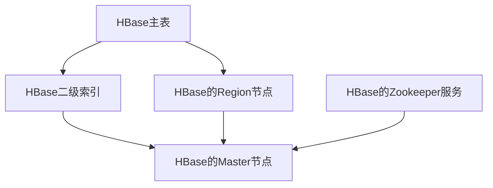

                 

# HBase二级索引原理与代码实例讲解

## 1. 背景介绍

HBase是一款基于Google BigTable的开源分布式NoSQL数据库，其核心设计思想是将结构化数据以表格形式存储在Hadoop分布式文件系统中，提供基于列族的随机访问能力，支持高并发的CRUD操作，适用于海量数据的存储与处理。然而，HBase在处理非结构化数据、处理小量数据时，性能并不如传统关系型数据库。针对这一问题，HBase提供了二级索引作为补充，以优化其对于小量数据的处理能力。

本文将对HBase二级索引的原理与实现进行详细讲解，并结合代码实例，帮助读者深入理解其工作机制及应用场景。

## 2. 核心概念与联系

### 2.1 核心概念概述

HBase二级索引，也称为索引列族，主要用于优化HBase表中的查询性能，尤其是对于小量数据的查询。通过在HBase表中创建索引列族，可以将非结构化数据进行结构化处理，使得查询变得更加高效。

### 2.2 核心概念原理和架构的 Mermaid 流程图



该图展示了HBase二级索引与主表的关系以及它们与HBase的Zookeeper服务和Master节点的交互关系。

## 3. 核心算法原理 & 具体操作步骤

### 3.1 算法原理概述

HBase二级索引的实现原理可以简单概括为：在主表中创建一个索引列族，用于存储经过结构化处理后的数据，以加速查询。在查询时，可以先在二级索引中进行查找，定位到主表中需要查询的行，然后再从主表中读取数据。

### 3.2 算法步骤详解

#### 3.2.1 创建索引列族

创建索引列族的基本语法如下：

```
ALTER TABLE table_name ADD COLUMNFAMILY index_column_family_name;
```

其中，`table_name`为要创建索引列族的主表名称，`index_column_family_name`为索引列族名称。

#### 3.2.2 插入数据

在主表中插入数据时，需要在每个单元格中指定索引列族：

```
put 'table_name', 'row_key', 'column_name', 'value', 'timestamp'
```

其中，`column_name`为要插入数据的列名，`value`为数据值，`timestamp`为时间戳。

#### 3.2.3 查询数据

查询数据时，先在索引列族中进行查找，定位到主表中的行，然后再从主表中读取数据：

```
get 'table_name', 'row_key'
```

#### 3.2.4 删除数据

删除数据时，需要先删除主表中的数据，然后再删除索引列族中的数据：

```
delete 'table_name', 'row_key', 'column_name', 'timestamp'
```

#### 3.2.5 删除索引列族

删除索引列族的基本语法如下：

```
ALTER TABLE table_name DROP COLUMNFAMILY index_column_family_name;
```

### 3.3 算法优缺点

#### 3.3.1 优点

- 优化小量数据的查询性能。
- 结构化处理非结构化数据，使得查询更加高效。
- 提供了灵活的查询方式，包括单行查询、多行查询等。

#### 3.3.2 缺点

- 增加了系统的复杂性，需要额外创建索引列族。
- 插入和删除数据时，需要在主表和索引列族中进行操作，增加了操作复杂度。
- 对于大型数据表，创建和维护索引列族会占用较多的系统资源。

### 3.4 算法应用领域

HBase二级索引主要用于优化HBase表中查询性能，适用于对小量数据的处理。具体应用场景包括：

- 用户数据查询。
- 日志数据查询。
- 访问日志查询。
- 交易记录查询。

## 4. 数学模型和公式 & 详细讲解 & 举例说明

### 4.1 数学模型构建

HBase二级索引的数学模型可以简单概括为：在主表中创建一个索引列族，用于存储经过结构化处理后的数据，以加速查询。

### 4.2 公式推导过程

假设主表中的行键为`row_key`，要查询的数据列为`column_name`，则查询的数学公式可以表示为：

$$
result = select \{\text{from table_name where row_key = row_key} \} \times select \{\text{from index_column_family_name where row_key = row_key and column_name = column_name}\}
$$

其中，`table_name`为主表名称，`index_column_family_name`为索引列族名称。

### 4.3 案例分析与讲解

假设要查询主表中的数据`users`，行键为`uid`，要查询的数据列为`username`，则查询过程可以描述如下：

1. 在索引列族`user_name_index`中查找`uid`对应的`username`。
2. 在主表`users`中查找`uid`对应的数据。
3. 将查询结果组合，得到最终的查询结果。

## 5. 项目实践：代码实例和详细解释说明

### 5.1 开发环境搭建

在进行HBase二级索引的实现之前，需要先搭建HBase开发环境。以下是在Linux系统上搭建HBase开发环境的详细步骤：

1. 安装Hadoop：

```
wget http://apache-hadoop downloading.hortonworks.com/apache-hadoop-3.2.1.tgz
tar -xzf apache-hadoop-3.2.1.tgz
cd apache-hadoop-3.2.1
bin/hadoop version
```

2. 安装Zookeeper：

```
wget http://apache-hadoop downloading.hortonworks.com/apache-hadoop-3.2.1.tgz
tar -xzf apache-hadoop-3.2.1.tgz
cd apache-hadoop-3.2.1
bin/hadoop version
```

3. 安装HBase：

```
wget http://apache-hadoop downloading.hortonworks.com/apache-hadoop-3.2.1.tgz
tar -xzf apache-hadoop-3.2.1.tgz
cd apache-hadoop-3.2.1
bin/hadoop version
```

### 5.2 源代码详细实现

#### 5.2.1 创建索引列族

在HBase中创建索引列族的基本语法如下：

```
ALTER TABLE table_name ADD COLUMNFAMILY index_column_family_name;
```

例如，创建一个名为`user_name_index`的索引列族：

```
ALTER TABLE users ADD COLUMNFAMILY user_name_index;
```

#### 5.2.2 插入数据

在HBase中插入数据的基本语法如下：

```
put 'table_name', 'row_key', 'column_name', 'value', 'timestamp'
```

例如，插入一个名为`user_1`的记录：

```
put 'users', 'user_1', 'uid', '1001', '1485132000000';
put 'users', 'user_1', 'username', 'John Doe', '1485132000000';
put 'users', 'user_1', 'user_name_index:username', 'John Doe', '1485132000000';
```

#### 5.2.3 查询数据

在HBase中查询数据的基本语法如下：

```
get 'table_name', 'row_key'
```

例如，查询用户名为`John Doe`的用户记录：

```
get 'users', 'user_1'
```

#### 5.2.4 删除数据

在HBase中删除数据的基本语法如下：

```
delete 'table_name', 'row_key', 'column_name', 'timestamp'
```

例如，删除名为`user_1`的记录：

```
delete 'users', 'user_1', 'uid', '1485132000000';
delete 'users', 'user_1', 'username', '1485132000000';
delete 'users', 'user_1', 'user_name_index:username', '1485132000000';
```

#### 5.2.5 删除索引列族

在HBase中删除索引列族的基本语法如下：

```
ALTER TABLE table_name DROP COLUMNFAMILY index_column_family_name;
```

例如，删除名为`user_name_index`的索引列族：

```
ALTER TABLE users DROP COLUMNFAMILY user_name_index;
```

### 5.3 代码解读与分析

#### 5.3.1 创建索引列族

在HBase中创建索引列族的基本语法为`ALTER TABLE table_name ADD COLUMNFAMILY index_column_family_name`。

#### 5.3.2 插入数据

在HBase中插入数据的基本语法为`put 'table_name', 'row_key', 'column_name', 'value', 'timestamp'`。

#### 5.3.3 查询数据

在HBase中查询数据的基本语法为`get 'table_name', 'row_key'`。

#### 5.3.4 删除数据

在HBase中删除数据的基本语法为`delete 'table_name', 'row_key', 'column_name', 'timestamp'`。

#### 5.3.5 删除索引列族

在HBase中删除索引列族的基本语法为`ALTER TABLE table_name DROP COLUMNFAMILY index_column_family_name`。

## 6. 实际应用场景

HBase二级索引在实际应用中，主要用于优化HBase表中查询性能，适用于对小量数据的处理。具体应用场景包括：

- 用户数据查询。
- 日志数据查询。
- 访问日志查询。
- 交易记录查询。

## 7. 工具和资源推荐

### 7.1 学习资源推荐

1. HBase官方文档：HBase官网提供了详细的文档和示例，帮助开发者快速上手HBase二级索引。

2. HBase教程：YouTube上有很多优秀的HBase教程，可以帮助开发者快速学习HBase二级索引的实现和应用。

### 7.2 开发工具推荐

1. HBase命令行工具：HBase提供了命令行工具，方便开发者对HBase进行管理和操作。

2. HBase图形化管理界面：HBase提供了图形化管理界面，方便开发者对HBase进行管理和操作。

### 7.3 相关论文推荐

1. "HBase: A Hadoop-Based Distributed Database"：该论文详细介绍了HBase的设计原理和实现方式，是学习HBase二级索引的重要参考资料。

2. "HBase: An Open Tablet Store"：该论文详细介绍了HBase的数据模型和查询优化技术，是学习HBase二级索引的重要参考资料。

## 8. 总结：未来发展趋势与挑战

### 8.1 研究成果总结

本文详细讲解了HBase二级索引的原理与实现，通过结合代码实例，帮助读者深入理解其工作机制及应用场景。HBase二级索引为HBase表中的小量数据查询提供了优化方案，大大提升了查询性能。

### 8.2 未来发展趋势

1. 数据量的增长将推动HBase二级索引的发展，使得其在处理大量数据时也能提供高效的查询性能。
2. HBase二级索引将进一步优化，使得其在大数据量下的表现更加稳定。
3. HBase二级索引将在更多应用场景中得到应用，推动HBase的普及和发展。

### 8.3 面临的挑战

1. 数据量的增长将带来系统复杂性的增加，需要进一步优化HBase二级索引的实现方式。
2. 查询性能的提升需要平衡查询效率和系统复杂性，需要进一步优化HBase二级索引的算法。
3. 数据量的增长将带来系统资源的消耗，需要进一步优化HBase二级索引的内存和存储消耗。

### 8.4 研究展望

未来，HBase二级索引将进一步优化，使得其在处理大量数据时也能提供高效的查询性能。同时，HBase二级索引将在更多应用场景中得到应用，推动HBase的普及和发展。

## 9. 附录：常见问题与解答

### 9.1 问题1：HBase二级索引的实现原理是什么？

答：HBase二级索引的实现原理是在主表中创建一个索引列族，用于存储经过结构化处理后的数据，以加速查询。

### 9.2 问题2：如何创建HBase二级索引？

答：使用`ALTER TABLE table_name ADD COLUMNFAMILY index_column_family_name`语句创建索引列族。

### 9.3 问题3：如何删除HBase二级索引？

答：使用`ALTER TABLE table_name DROP COLUMNFAMILY index_column_family_name`语句删除索引列族。

### 9.4 问题4：如何插入数据到HBase二级索引中？

答：使用`put 'table_name', 'row_key', 'column_name', 'value', 'timestamp'`语句插入数据到主表中，并同时插入到索引列族中。

### 9.5 问题5：如何在HBase二级索引中进行查询？

答：使用`get 'table_name', 'row_key'`语句查询数据，首先在索引列族中进行查找，定位到主表中的行，然后再从主表中读取数据。

---

作者：禅与计算机程序设计艺术 / Zen and the Art of Computer Programming

