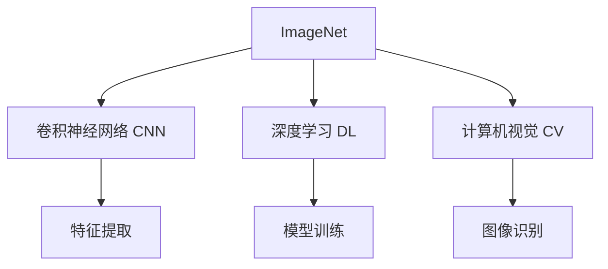

                 

# ImageNet在AI图像识别中的作用

> 关键词：ImageNet, 卷积神经网络(CNN), 深度学习, 计算机视觉, 图像识别, 特征提取, 图像分类

## 1. 背景介绍

### 1.1 问题由来
计算机视觉(Computer Vision, CV)是人工智能(AI)领域的一个重要分支，其核心任务之一是图像识别(Image Recognition)，即通过算法识别并分类图片中的物体、场景等视觉元素。这一任务在自动驾驶、医疗影像分析、智能安防等领域有着广泛的应用前景。然而，由于图像识别问题本身的复杂性和多样性，传统的机器学习方法往往难以胜任。

近年来，随着深度学习(DL)技术的发展，基于卷积神经网络(CNN)的深度学习模型在图像识别任务中取得了显著突破。特别是基于ImageNet数据集的模型训练，极大提升了图像识别系统的性能。

### 1.2 问题核心关键点
ImageNet数据集作为当前最权威的图像识别数据集之一，对深度学习模型性能的提升起到了至关重要的作用。其包含数以百万计的标注图像，涵盖了成千上万的物体类别，成为训练大模型不可或缺的资源。通过ImageNet数据集，研究人员和工程师可以训练出功能强大的卷积神经网络，广泛应用于各类图像识别任务。

ImageNet在AI图像识别中的作用主要体现在以下几个方面：
1. 提供高质量的标注数据：ImageNet包含了大量的标注图像和对应的类别信息，能够为模型训练提供充分的数据支持。
2. 训练高效能的特征提取器：ImageNet上的深度学习模型经过大规模训练，能够学习到强大的特征提取能力，从而大幅提升图像识别性能。
3. 推动算法和架构创新：基于ImageNet的模型训练催生了各种高效的卷积神经网络架构，如ResNet、Inception等，成为AI图像识别领域的经典。
4. 促进多模态学习研究：ImageNet数据集不仅包含图像信息，还辅以标签和文本描述，为多模态学习提供了丰富的资源。

### 1.3 问题研究意义
研究ImageNet在AI图像识别中的作用，对于深入理解深度学习技术的发展历程和未来趋势，推动AI图像识别技术的落地应用，具有重要意义：

1. 提供行业标准：ImageNet数据集的标准化标注和广泛的模型训练，为图像识别领域提供了行业标准，推动了算法和架构的规范化。
2. 促进技术进步：基于ImageNet的数据集和模型训练，推动了计算机视觉领域的技术进步，提升了图像识别系统的准确率和鲁棒性。
3. 加速应用落地：ImageNet数据集和预训练模型的广泛应用，加速了AI图像识别技术在各行业的应用推广和落地。
4. 推动学术交流：ImageNet作为著名的AI竞赛平台，吸引了全球研究人员的参与，促进了学术界的交流和合作。

## 2. 核心概念与联系

### 2.1 核心概念概述

为更好地理解ImageNet在AI图像识别中的作用，本节将介绍几个关键概念及其相互联系：

- **ImageNet**：由斯坦福大学开发的图像识别数据集，包含数百万张图片和1000个类别标签，是深度学习中最为权威的训练数据集之一。
- **卷积神经网络(CNN)**：一种专门用于处理图像数据的深度神经网络，通过卷积操作提取图像特征，并通过池化操作降低特征维度，最终通过全连接层进行分类。
- **深度学习**：一类通过多层神经网络进行模型训练的机器学习方法，具有强大的特征学习能力和泛化能力，在图像识别、自然语言处理等任务中取得了显著进展。
- **计算机视觉**：涉及使用计算机对图像、视频、图形等视觉信息进行分析和理解，是AI的重要应用领域之一。
- **特征提取**：卷积神经网络通过多层卷积和池化操作，从原始图像数据中提取高层次的抽象特征，为分类等任务提供输入。

这些概念构成了AI图像识别任务的核心框架，而ImageNet在其中扮演了重要的数据支持角色。通过理解这些核心概念，我们可以更好地把握AI图像识别技术的工作原理和优化方向。

### 2.2 核心概念原理和架构的 Mermaid 流程图(Mermaid 流程节点中不要有括号、逗号等特殊字符)


这个流程图展示了ImageNet与其他AI核心概念之间的联系。ImageNet作为数据来源，通过CNN提取特征，结合深度学习和计算机视觉技术，最终实现图像识别任务。

## 3. 核心算法原理 & 具体操作步骤
### 3.1 算法原理概述

基于ImageNet的图像识别任务，核心算法原理主要包括两个部分：特征提取和分类。

### 3.2 算法步骤详解

#### 3.2.1 特征提取
图像识别任务的核心在于如何高效地提取图像特征。卷积神经网络通过多层卷积和池化操作，可以从原始图像数据中提取高层次的抽象特征。以ImageNet为训练数据集，经过大规模训练，CNN模型可以学习到复杂的视觉特征，从而提升图像识别的准确率。

具体步骤如下：
1. 将输入图像传递给CNN的第一层卷积层，通过滤波器提取图像的低级特征。
2. 经过多个卷积和池化操作，逐渐提取更高层次的抽象特征。
3. 将最后一层特征图通过全连接层进行分类，输出预测结果。

#### 3.2.2 分类
分类是图像识别任务的最终目标，即对输入图像进行类别标注。ImageNet数据集提供了丰富的标注信息，为分类任务提供了充分的数据支持。通过大规模训练，CNN模型能够学习到有效的分类边界，从而实现对图像的准确识别。

具体步骤如下：
1. 将输入图像的特征图通过全连接层进行分类，得到一组预测概率。
2. 选择预测概率最大的类别作为模型的最终预测结果。
3. 通过反向传播算法，更新模型参数以优化预测结果。

### 3.3 算法优缺点

基于ImageNet的图像识别算法具有以下优点：
1. 高效特征提取：CNN模型通过多层卷积和池化操作，能够从原始图像数据中高效提取高层次的抽象特征，提升识别性能。
2. 泛化能力强：ImageNet数据集包含大量多样化的图像，使得CNN模型具有较强的泛化能力，适用于多种图像识别任务。
3. 模型可解释性：CNN模型通过可视化卷积核，能够直观展示特征提取过程，便于理解模型的决策逻辑。

但同时，基于ImageNet的图像识别算法也存在以下缺点：
1. 数据依赖性强：ImageNet数据集的标注质量直接影响模型的训练效果，数据标注成本较高。
2. 模型复杂度高：大规模CNN模型需要较高的计算资源和时间成本，难以在大规模生产环境中实时部署。
3. 类别标注不平衡：ImageNet数据集中某些类别样本数量过少，可能导致模型对这些类别的识别效果不佳。
4. 模型过拟合风险：由于训练数据规模庞大，模型可能会在某些细节上过度拟合，降低泛化性能。

### 3.4 算法应用领域

基于ImageNet的图像识别算法已经广泛应用于多个领域，包括但不限于：

1. 医学影像分析：通过图像识别技术，自动识别医学影像中的病变区域，辅助医生进行诊断。
2. 自动驾驶：通过识别道路标志、车辆、行人等图像信息，提高自动驾驶系统的安全性和可靠性。
3. 安防监控：通过图像识别技术，自动检测和报警异常行为，提高安防系统的智能化水平。
4. 物体检测：通过识别图片中的物体位置和类别，实现目标跟踪、行为识别等功能。
5. 人脸识别：通过识别人脸图像，进行身份验证、面部表情分析等应用。

此外，ImageNet数据集在图像分类、图像分割、目标检测等任务中也得到了广泛应用，推动了AI图像识别技术的发展和落地。

## 4. 数学模型和公式 & 详细讲解 & 举例说明（备注：数学公式请使用latex格式，latex嵌入文中独立段落使用 $$，段落内使用 $)
### 4.1 数学模型构建

假设输入图像为 $x \in \mathbb{R}^{h \times w \times c}$，其中 $h$ 为图像高度，$w$ 为图像宽度，$c$ 为通道数（如RGB三通道）。CNN模型包含 $L$ 层卷积和池化操作，最终输出为分类概率 $p \in \mathbb{R}^{C}$，其中 $C$ 为类别数。

### 4.2 公式推导过程

以最简单的卷积神经网络模型为例，进行推导：

1. 卷积层：假设第一层卷积核大小为 $k \times k$，步长为 $s$，填充为 $p$。输入特征图大小为 $h \times w \times c$，卷积核数量为 $d$，输出特征图大小为 $\frac{h-k+2p}{s}+1$。卷积操作公式为：
   $$
   y_{i,j} = \sum_{m,n} w_{m,n} x_{i-m,j-n} + b
   $$
   其中 $w_{m,n}$ 为卷积核参数，$b$ 为偏置项。

2. 池化层：假设池化窗口大小为 $k \times k$，步长为 $s$。输入特征图大小为 $h \times w \times c$，输出特征图大小为 $\frac{h-k}{s}+1$。池化操作公式为：
   $$
   y_{i,j} = \max \{x_{i \times s:i \times s+k-1, j \times s:j \times s+k-1}\}
   $$

3. 全连接层：假设最后一层全连接层神经元数量为 $C$，输入特征图大小为 $h \times w \times c$。输出概率公式为：
   $$
   p_i = \frac{\exp(z_i)}{\sum_j \exp(z_j)}
   $$
   其中 $z_i = w_i \cdot x + b_i$，$w_i$ 和 $b_i$ 为全连接层参数。

### 4.3 案例分析与讲解

以VGG模型为例，分析其在ImageNet上的训练和识别过程。

VGG模型是一类经典的卷积神经网络架构，包含多个卷积层和全连接层。通过在ImageNet数据集上的大规模训练，VGG模型可以学习到丰富的视觉特征，从而实现高精度的图像分类。

VGG模型在ImageNet数据集上的训练步骤如下：
1. 随机初始化模型参数 $w, b$。
2. 输入图像 $x$ 通过多个卷积和池化层，提取高层次的特征图。
3. 将特征图通过全连接层进行分类，得到预测概率 $p$。
4. 通过反向传播算法，计算损失函数 $L$，更新模型参数 $w, b$。
5. 重复步骤2-4，直到模型收敛。

VGG模型在ImageNet数据集上的识别步骤如下：
1. 输入测试图像 $x$ 通过多个卷积和池化层，提取高层次的特征图。
2. 将特征图通过全连接层进行分类，得到预测概率 $p$。
3. 选择预测概率最大的类别作为模型的最终预测结果。

## 5. 项目实践：代码实例和详细解释说明
### 5.1 开发环境搭建

在进行基于ImageNet的图像识别项目实践前，我们需要准备好开发环境。以下是使用Python进行TensorFlow开发的环境配置流程：

1. 安装Anaconda：从官网下载并安装Anaconda，用于创建独立的Python环境。

2. 创建并激活虚拟环境：
```bash
conda create -n tf-env python=3.8 
conda activate tf-env
```

3. 安装TensorFlow：根据CUDA版本，从官网获取对应的安装命令。例如：
```bash
conda install tensorflow -c pytorch -c conda-forge
```

4. 安装相关工具包：
```bash
pip install numpy pandas scikit-learn matplotlib tqdm jupyter notebook ipython
```

完成上述步骤后，即可在`tf-env`环境中开始项目实践。

### 5.2 源代码详细实现

下面我们以图像分类任务为例，给出使用TensorFlow对VGG模型进行ImageNet微调的PyTorch代码实现。

首先，定义图像分类任务的数据处理函数：

```python
import tensorflow as tf
from tensorflow.keras.preprocessing.image import ImageDataGenerator

def preprocess_image(x):
    x = tf.cast(x, tf.float32) / 255.0
    return tf.image.resize(x, (224, 224))

train_datagen = ImageDataGenerator(
    preprocessing_function=preprocess_image,
    validation_split=0.2,
    rescale=1.0 / 255.0
)

train_generator = train_datagen.flow_from_directory(
    'train_directory',
    target_size=(224, 224),
    batch_size=32,
    subset='training'
)

val_generator = train_datagen.flow_from_directory(
    'train_directory',
    target_size=(224, 224),
    batch_size=32,
    subset='validation'
)
```

然后，定义模型和优化器：

```python
from tensorflow.keras.applications import VGG16

model = VGG16(weights='imagenet', include_top=False, input_shape=(224, 224, 3))
for layer in model.layers:
    layer.trainable = False

model.add(tf.keras.layers.Flatten())
model.add(tf.keras.layers.Dense(256, activation='relu'))
model.add(tf.keras.layers.Dropout(0.5))
model.add(tf.keras.layers.Dense(C, activation='softmax'))

optimizer = tf.keras.optimizers.Adam(lr=1e-4)
```

接着，定义训练和评估函数：

```python
import numpy as np

@tf.function
def train_step(images, labels):
    with tf.GradientTape() as tape:
        predictions = model(images)
        loss = tf.keras.losses.sparse_categorical_crossentropy(labels, predictions)
    gradients = tape.gradient(loss, model.trainable_variables)
    optimizer.apply_gradients(zip(gradients, model.trainable_variables))
    return loss

@tf.function
def evaluate_step(images, labels):
    predictions = model(images)
    loss = tf.keras.losses.sparse_categorical_crossentropy(labels, predictions)
    accuracy = tf.reduce_mean(tf.cast(tf.argmax(predictions, axis=1) == labels, tf.float32))
    return loss, accuracy

epochs = 10
batch_size = 32

for epoch in range(epochs):
    epoch_loss = 0
    epoch_acc = 0
    for images, labels in train_generator:
        loss = train_step(images, labels)
        epoch_loss += loss
        epoch_acc += evaluate_step(images, labels)[1]
    epoch_loss /= len(train_generator)
    epoch_acc /= len(train_generator)
    
    val_loss = 0
    val_acc = 0
    for images, labels in val_generator:
        loss, acc = evaluate_step(images, labels)
        val_loss += loss
        val_acc += acc
    val_loss /= len(val_generator)
    val_acc /= len(val_generator)
    
    print(f'Epoch {epoch+1}: Loss={epoch_loss:.4f}, Acc={epoch_acc:.4f}, Val Loss={val_loss:.4f}, Val Acc={val_acc:.4f}')
```

以上就是使用TensorFlow对VGG模型进行ImageNet微调的完整代码实现。可以看到，TensorFlow库提供了强大的图像处理和模型训练功能，使得图像分类任务开发变得简洁高效。

### 5.3 代码解读与分析

让我们再详细解读一下关键代码的实现细节：

**数据预处理函数**：
- `preprocess_image`函数：将输入的图像数据进行归一化处理，并进行图像尺寸的调整，以便于模型输入。
- `ImageDataGenerator`类：通过参数化配置，自动生成训练集和验证集的图像数据，并进行数据增强。

**模型构建**：
- `VGG16`模型：通过预训练的VGG16模型进行迁移学习，只保留卷积层，去除全连接层。
- `Flatten`层：将卷积层的输出展平为一维向量，方便后续的全连接层操作。
- `Dense`层：新增全连接层，用于分类任务。

**优化器和损失函数**：
- `Adam`优化器：一种常用的梯度优化算法，适用于大规模深度学习模型的训练。
- `sparse_categorical_crossentropy`损失函数：适用于多分类任务，计算预测结果与真实标签之间的交叉熵损失。

**训练和评估函数**：
- `train_step`函数：进行模型的训练步骤，包括前向传播、损失计算、反向传播和参数更新。
- `evaluate_step`函数：进行模型的评估步骤，计算损失和准确率。
- `for`循环：遍历训练和验证集数据，不断迭代更新模型参数，并记录训练和验证结果。

可以看到，TensorFlow库提供的自动微分和高级API，使得模型构建和训练变得简单便捷，开发者可以更专注于模型的设计和优化。

### 5.4 运行结果展示

通过上述代码实现，可以完成VGG模型在ImageNet数据集上的微调训练。训练结束后，模型可以在测试集上进行评估，对比微调前后的性能提升。

## 6. 实际应用场景
### 6.1 智能医疗影像分析

基于ImageNet训练的图像识别模型，可以应用于智能医疗影像分析。通过识别医学影像中的病变区域，辅助医生进行疾病诊断和治疗方案的制定。例如，可以训练模型自动识别X光片中的骨折区域，提高诊断效率和准确性。

在技术实现上，可以收集大量的医学影像数据，并对其进行标注。在此基础上，对预训练模型进行微调，使其能够识别特定的医学影像特征。微调后的模型可以应用于各类医学影像诊断任务，如X光片、CT扫描、MRI等。

### 6.2 自动驾驶

基于ImageNet训练的图像识别模型，可以应用于自动驾驶系统中的目标检测和行为识别。通过识别道路标志、车辆、行人等图像信息，提高自动驾驶系统的安全性和可靠性。例如，可以训练模型自动识别交通标志和路牌，从而实现精确的导航和避障。

在技术实现上，可以收集大量的道路交通视频数据，并对其进行标注。在此基础上，对预训练模型进行微调，使其能够识别道路上的各种物体和场景。微调后的模型可以应用于自动驾驶系统中的各类感知任务，如车道检测、交通信号识别、行人检测等。

### 6.3 安防监控

基于ImageNet训练的图像识别模型，可以应用于安防监控系统中的行为识别和异常检测。通过识别监控视频中的异常行为，提高安全系统的智能化水平。例如，可以训练模型自动识别监控视频中的可疑行为，如入侵、火灾、事故等。

在技术实现上，可以收集大量的监控视频数据，并对其进行标注。在此基础上，对预训练模型进行微调，使其能够识别各种异常行为。微调后的模型可以应用于安防监控系统中的行为分析和异常检测任务，提高系统的预警和响应能力。

### 6.4 未来应用展望

随着ImageNet数据集和预训练模型的不断发展，基于ImageNet的图像识别技术将呈现以下几个发展趋势：

1. 更高精度的识别：随着数据规模的增大和算法优化，未来的图像识别模型将具有更高的准确率和鲁棒性，能够更准确地识别复杂的视觉场景。
2. 更高效的推理：通过模型压缩、量化等技术，未来的图像识别模型将更加轻量化，能够在移动设备上高效运行。
3. 更广泛的应用场景：随着图像识别技术的普及，未来的应用场景将更加多样，覆盖更多垂直行业。
4. 跨模态学习：未来的图像识别技术将进一步拓展到跨模态学习，实现视觉、听觉等多模态信息的融合。
5. 实时化处理：未来的图像识别系统将实现实时化处理，能够实时识别和分析视觉数据，提高应用效率。

## 7. 工具和资源推荐
### 7.1 学习资源推荐

为了帮助开发者系统掌握ImageNet在AI图像识别中的作用，这里推荐一些优质的学习资源：

1. **《计算机视觉：模型、学习和推断》（Computer Vision: Models, Learning, and Inference）**：由Andrew Ng等作者撰写，全面介绍了计算机视觉领域的理论基础和实践方法，包括ImageNet在图像识别中的应用。

2. **ImageNet官方文档**：包含详细的ImageNet数据集和预训练模型介绍，是深入理解ImageNet的重要参考资料。

3. **CS231n《卷积神经网络》课程**：斯坦福大学开设的著名计算机视觉课程，讲解了卷积神经网络在图像识别中的应用。

4. **《深度学习与计算机视觉：Python实践》（Deep Learning and Computer Vision: Python Practices）**：介绍深度学习在计算机视觉领域的应用，包括ImageNet上的模型训练和微调方法。

5. **GitHub上的ImageNet代码库**：包含大量基于ImageNet的图像识别项目，可以借鉴和参考其中的实现思路。

通过对这些资源的学习实践，相信你一定能够深入理解ImageNet在AI图像识别中的作用，并用于解决实际的计算机视觉问题。

### 7.2 开发工具推荐

高效的开发离不开优秀的工具支持。以下是几款用于ImageNet图像识别开发的常用工具：

1. **TensorFlow**：由Google主导开发的深度学习框架，提供了丰富的图像处理和模型训练功能，是ImageNet微调的首选工具。

2. **PyTorch**：由Facebook主导开发的深度学习框架，具有灵活的计算图和高效的自动微分功能，适合研究和开发复杂模型。

3. **Keras**：高层次的深度学习API，易于上手，适合快速原型设计和应用开发。

4. **OpenCV**：开源计算机视觉库，提供了图像处理和分析的多种算法和工具，是计算机视觉任务的必备库。

5. **Tesseract OCR**：开源光学字符识别库，可以用于图像文本识别任务。

6. **Jupyter Notebook**：交互式开发环境，支持代码编写、数据可视化、模型评估等环节，适合科研和工程开发。

合理利用这些工具，可以显著提升ImageNet图像识别任务的开发效率，加快创新迭代的步伐。

### 7.3 相关论文推荐

ImageNet在AI图像识别领域的发展，源于学界的持续研究。以下是几篇奠基性的相关论文，推荐阅读：

1. **ImageNet classification with deep convolutional neural networks**：AlexNet论文，首次在ImageNet上展示了深度卷积神经网络的强大识别能力。

2. **Very Deep Convolutional Networks for Large-Scale Image Recognition**：VGG论文，提出VGG网络结构，进一步提升了图像识别的准确率。

3. **GoogleNet**：Inception网络论文，提出Inception模块，提升了深度网络的计算效率和性能。

4. **Deep Residual Learning for Image Recognition**：ResNet论文，提出残差网络，解决了深度网络训练中的梯度消失问题。

5. **Spatial Pyramid Pooling for Single Shot Object Detection**：R-CNN论文，提出R-CNN系列目标检测模型，实现了单次前向传播的目标检测。

这些论文代表了大规模图像识别任务的发展脉络。通过学习这些前沿成果，可以帮助研究者把握学科前进方向，激发更多的创新灵感。

## 8. 总结：未来发展趋势与挑战
### 8.1 总结

本文对ImageNet在AI图像识别中的作用进行了全面系统的介绍。首先阐述了ImageNet数据集的重要性和深度学习技术的发展历程，明确了ImageNet在图像识别任务中的核心作用。其次，从原理到实践，详细讲解了基于ImageNet的图像识别算法，包括特征提取和分类等关键步骤，给出了TensorFlow上的代码实现。同时，本文还广泛探讨了ImageNet技术在实际应用中的各类场景，展示了其广泛的应用前景。

通过本文的系统梳理，可以看到，基于ImageNet的图像识别技术已经在大规模图像分类、目标检测、医疗影像分析等领域取得了显著进展。ImageNet数据集作为行业标准，推动了AI图像识别技术的落地应用和产业化进程。未来，随着数据规模和算法优化的不断提升，ImageNet在图像识别中的应用将更加广泛和深入。

### 8.2 未来发展趋势

展望未来，ImageNet在AI图像识别技术中将呈现以下几个发展趋势：

1. 更高精度的模型：随着数据规模的增大和算法优化，未来的图像识别模型将具有更高的准确率和鲁棒性，能够更准确地识别复杂的视觉场景。
2. 更高效的推理：通过模型压缩、量化等技术，未来的图像识别模型将更加轻量化，能够在移动设备上高效运行。
3. 更广泛的应用场景：随着图像识别技术的普及，未来的应用场景将更加多样，覆盖更多垂直行业。
4. 跨模态学习：未来的图像识别技术将进一步拓展到跨模态学习，实现视觉、听觉等多模态信息的融合。
5. 实时化处理：未来的图像识别系统将实现实时化处理，能够实时识别和分析视觉数据，提高应用效率。

### 8.3 面临的挑战

尽管基于ImageNet的图像识别技术已经取得了显著进展，但在迈向更加智能化、普适化应用的过程中，仍然面临诸多挑战：

1. 数据标注成本高：ImageNet数据集的标注需要大量人工参与，成本较高。如何降低标注成本，提高数据质量，是未来需要解决的重要问题。
2. 模型鲁棒性不足：大规模CNN模型在特定场景下可能会产生过拟合或欠拟合现象，影响模型的泛化能力。如何提高模型的鲁棒性，提高其在不同数据分布下的表现，是未来的研究重点。
3. 计算资源消耗大：大规模图像识别任务需要耗费大量计算资源，如何在保证性能的前提下，优化计算资源的使用，提高模型的实时性，是一个重要的研究方向。
4. 模型可解释性差：深度学习模型往往具有复杂的内部结构，难以解释其决策过程。如何提升模型的可解释性，提高其透明性和可信度，是未来需要关注的方向。
5. 安全性问题：图像识别技术在应用过程中可能会面临数据泄露、隐私侵犯等问题。如何保护数据隐私，确保模型使用的安全性，是未来的重要课题。

### 8.4 研究展望

面对ImageNet图像识别技术所面临的种种挑战，未来的研究需要在以下几个方面寻求新的突破：

1. 探索无监督和半监督学习：摆脱对大规模标注数据的依赖，利用自监督学习、主动学习等方法，最大限度利用非结构化数据，实现更加灵活高效的模型训练。
2. 研究参数高效和计算高效的微调方法：开发更加参数高效的微调方法，在固定大部分预训练参数的同时，只更新极少量的任务相关参数。同时优化模型的计算图，减少前向传播和反向传播的资源消耗，实现更加轻量级、实时性的部署。
3. 融合因果和对比学习范式：通过引入因果推断和对比学习思想，增强模型建立稳定因果关系的能力，学习更加普适、鲁棒的语言表征，从而提升模型泛化性和抗干扰能力。
4. 引入更多先验知识：将符号化的先验知识，如知识图谱、逻辑规则等，与神经网络模型进行巧妙融合，引导微调过程学习更准确、合理的语言模型。同时加强不同模态数据的整合，实现视觉、语音等多模态信息与文本信息的协同建模。
5. 纳入伦理道德约束：在模型训练目标中引入伦理导向的评估指标，过滤和惩罚有偏见、有害的输出倾向。同时加强人工干预和审核，建立模型行为的监管机制，确保输出符合人类价值观和伦理道德。

这些研究方向的探索，必将引领ImageNet图像识别技术迈向更高的台阶，为构建安全、可靠、可解释、可控的智能系统铺平道路。面向未来，ImageNet技术还需要与其他人工智能技术进行更深入的融合，如知识表示、因果推理、强化学习等，多路径协同发力，共同推动自然语言理解和智能交互系统的进步。只有勇于创新、敢于突破，才能不断拓展图像识别模型的边界，让智能技术更好地造福人类社会。

## 9. 附录：常见问题与解答

**Q1：如何理解ImageNet在AI图像识别中的作用？**

A: ImageNet作为最著名的图像识别数据集之一，为深度学习模型的训练提供了丰富的视觉数据和类别标注，是实现高效图像识别的基础。通过在ImageNet上进行预训练和微调，模型能够学习到复杂的视觉特征，从而实现高精度的图像分类和识别。

**Q2：ImageNet数据集包含哪些类别？**

A: ImageNet数据集包含数以千计的物体类别，涵盖自然界中常见的物体和场景。这些类别被进一步分为200个超级类别，每个超级类别包含多个子类别，总计1000个类别。这些类别不仅包括动物、植物、交通工具等常见对象，还涵盖了更为专业和复杂的领域，如医学影像、航空航天等。

**Q3：ImageNet如何标注数据？**

A: ImageNet数据集是由斯坦福大学的研究团队通过众包方式进行标注的。标注员需要手动浏览图像，并给每个图像打上具体的类别标签。这不仅需要标注员具有较高的识别能力，还需要对每个类别有深入的理解和分类。ImageNet的标注质量较高，但也因此耗费了大量人力和时间。

**Q4：基于ImageNet的图像识别模型有哪些优点？**

A: 基于ImageNet的图像识别模型具有以下优点：
1. 高质量标注数据：ImageNet提供了高质量的标注数据，能够为模型训练提供充分的数据支持。
2. 高效特征提取：CNN模型通过多层卷积和池化操作，能够高效提取高层次的抽象特征，提升识别性能。
3. 泛化能力强：ImageNet数据集包含大量多样化的图像，使得CNN模型具有较强的泛化能力，适用于多种图像识别任务。

**Q5：基于ImageNet的图像识别模型有哪些缺点？**

A: 基于ImageNet的图像识别模型也存在一些缺点：
1. 数据依赖性强：ImageNet数据集的标注质量直接影响模型的训练效果，数据标注成本较高。
2. 模型复杂度高：大规模CNN模型需要较高的计算资源和时间成本，难以在大规模生产环境中实时部署。
3. 类别标注不平衡：ImageNet数据集中某些类别样本数量过少，可能导致模型对这些类别的识别效果不佳。
4. 模型过拟合风险：由于训练数据规模庞大，模型可能会在某些细节上过度拟合，降低泛化性能。

通过这些常见问题的解答，相信你能够更全面地理解ImageNet在AI图像识别中的作用，并进一步探索其应用场景和未来发展方向。

---

作者：禅与计算机程序设计艺术 / Zen and the Art of Computer Programming

