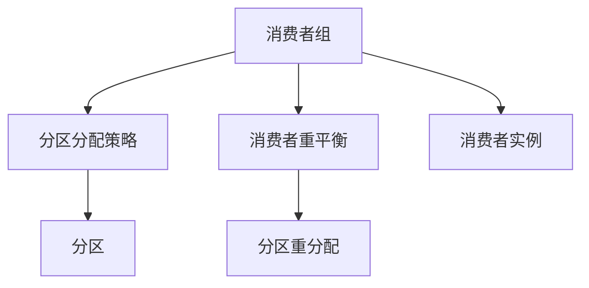

                 

# Kafka Consumer原理与代码实例讲解

> 关键词：Kafka Consumer, Kafka消费者组, 分区分配策略, Consumer重平衡, Kafka消费者API

## 1. 背景介绍

### 1.1 问题由来
在分布式系统中，消息队列作为一种数据传输机制，提供了快速、可靠的数据交换方式。Apache Kafka 是一个流行的开源消息队列平台，用于构建高吞吐量、可扩展性的数据流处理系统。Kafka 支持生产者（Producers）和消费者（Consumers），通过设计优化的分区策略和消费者组（Consumer Groups），有效管理大量数据流。

### 1.2 问题核心关键点
Kafka Consumer的核心在于其高效的数据处理能力。消费者组（Consumer Groups）的概念是Kafka中重要的设计，它允许多个消费者实例协作消费同一主题的数据。这些消费者实例通常按分区分配，每个分区由一个组内的消费者实例负责，这样可以确保消费的可靠性和数据的不丢失性。

在Kafka中，消费者组的分区分配策略非常关键，决定了消费者的负载均衡和数据流的顺畅。消费者组成员的加入或退出会触发分区重平衡（Partition Rebalancing），确保分区的平衡分配。

本文将深入探讨Kafka Consumer的原理，包括消费者组的概念、分区分配策略、消费者重平衡的过程等。同时，会通过代码实例进一步阐述Kafka Consumer的API使用，帮助读者理解如何在实际应用中进行数据消费。

### 1.3 问题研究意义
Kafka Consumer是构建大规模数据流处理系统的关键组成部分。深入理解Kafka Consumer的原理和最佳实践，可以帮助开发者设计出高效、稳定、可扩展的数据流处理应用程序。

## 2. 核心概念与联系

### 2.1 核心概念概述

Kafka Consumer的核心概念主要包括：

- **消费者组**：消费者组（Consumer Group）是Kafka中一个概念，指的是消费者实例的集合。这些消费者实例协作消费同一主题的数据，每个分区会被组内的一个消费者实例独占，以避免数据重复消费或丢失。
- **分区**：Kafka主题（Topic）被分为多个分区（Partitions）。数据写入Kafka时，首先写入特定的分区。分区设计是为了处理大数据量，提高数据吞吐量。
- **分区分配策略**：当消费者组中有多个消费者实例时，Kafka会通过分区分配策略分配这些分区给消费者实例。
- **消费者重平衡**：消费者组中的消费者实例加入或退出时，会触发消费者重平衡（Consumer Rebalance），确保分区的平衡分配和消费进度的一致性。

这些概念之间的逻辑关系可以通过以下Mermaid流程图来展示：



这个流程图展示了消费者组的核心概念及其之间的关系：

1. 消费者组是消费者实例的集合，用于协作消费同一主题的数据。
2. 消费者组通过分区分配策略分配数据到分区。
3. 当消费者实例加入或退出消费者组时，会触发消费者重平衡，重分配分区，确保消费进度的一致性。

## 3. 核心算法原理 & 具体操作步骤
### 3.1 算法原理概述

Kafka Consumer的核心原理在于消费者组的协作消费和分区分配策略的有效管理。消费者组中的每个消费者实例都负责消费一个分区的数据，通过这种方式可以实现数据的可靠消费和避免重复消费。

具体来说，消费者实例会订阅主题的特定分区，通过订阅的分区数据，可以实现幂等消费，即数据在消费者实例消费之前必须至少被写入一个分区，这样即使消费者实例失败，数据也不会丢失。

### 3.2 算法步骤详解

Kafka Consumer的操作步骤主要包括以下几个步骤：

1. **初始化消费者**：首先，需要初始化一个Kafka Consumer实例，并配置好消费者组的名称、订阅的主题和分区偏好。
2. **订阅分区**：通过订阅特定的主题分区，消费者可以开始消费数据。消费者会被分配一组分区，负责消费这些分区的数据。
3. **数据消费**：消费者通过Kafka提供的API消费分区中的数据。消费者会逐条消费消息，并可以指定偏好，比如偏好哪些分区的数据。
4. **消费者重平衡**：当消费者加入或退出消费者组时，Kafka会触发消费者重平衡。重平衡过程中，Kafka会重新分配分区到消费者实例中，以保证分区的平衡分配和消费进度的一致性。
5. **处理异常**：消费者可能会遇到各种异常，比如网络问题、消费者实例失败等。消费者需要有良好的容错机制来处理这些异常，并确保数据的可靠性。

### 3.3 算法优缺点

Kafka Consumer的算法优点主要包括：

1. **高吞吐量**：Kafka Consumer支持高吞吐量的数据消费，适用于大数据处理场景。
2. **可扩展性**：通过消费者组的概念和分区分配策略，可以实现消费者组的动态扩展和缩容。
3. **可靠性**：Kafka Consumer通过分区分配策略和消费者重平衡，确保数据的可靠消费和避免重复消费。
4. **灵活性**：消费者可以根据需要灵活配置偏好，如偏好哪些分区的数据。

然而，Kafka Consumer也存在一些缺点：

1. **复杂性**：Kafka Consumer的高级特性和消费者组的管理可能会增加系统的复杂性。
2. **性能开销**：消费者重平衡可能会导致性能开销，特别是在消费者组中有大量消费者实例时。

### 3.4 算法应用领域

Kafka Consumer的应用领域非常广泛，包括但不限于：

1. **数据流处理**：Kafka Consumer适用于大规模的数据流处理，例如Apache Kafka Streams、Apache Flink等。
2. **日志收集**：Kafka Consumer可以用于收集和处理日志数据，例如通过Kafka Connect的Logstash等插件。
3. **事件驱动架构**：Kafka Consumer适用于构建事件驱动架构，例如通过Apache Kafka Connect的Kafka Connect等组件。
4. **数据集成**：Kafka Consumer可以用于数据集成，例如通过Kafka Connect的Hadoop、Cassandra等集成插件。

通过这些应用场景，可以看到Kafka Consumer在构建高吞吐量、可扩展性、可靠性的数据流处理系统中扮演着重要的角色。

## 4. 数学模型和公式 & 详细讲解 & 举例说明

Kafka Consumer的数学模型主要围绕消费者组和分区分配策略展开。以下是数学模型的构建和公式的推导过程：

### 4.1 数学模型构建

假设消费者组G包含m个消费者实例，主题T包含n个分区。Kafka通过分区分配策略分配这些分区到消费者实例中。分区分配策略可以是范围分配、轮询分配等。

### 4.2 公式推导过程

以下是Kafka Consumer的分区分配策略的数学描述：

设g_i是第i个消费者实例，t_j是第j个分区。消费者实例g_i负责消费的分区集合可以表示为：

S(g_i) = {t_j | t_j 分配给 g_i}

Kafka的分区分配策略可以通过以下公式描述：

S(g_i) = f(g_i, t_1, t_2, ..., t_n)

其中f是分区分配策略的函数，g_i是消费者实例的属性，t_1, t_2, ..., t_n是分区的属性。

### 4.3 案例分析与讲解

举例来说，假设我们有一个消费者组G，包含两个消费者实例g_1和g_2，主题T包含四个分区t_1, t_2, t_3, t_4。我们可以使用轮询分配策略来分配这些分区。

首先，我们需要确定消费者实例的顺序，然后根据顺序分配分区。例如：

g_1 -> t_1, t_3
g_2 -> t_2, t_4

这样，消费者实例g_1负责消费t_1和t_3的数据，消费者实例g_2负责消费t_2和t_4的数据。

## 5. 项目实践：代码实例和详细解释说明
### 5.1 开发环境搭建

首先，我们需要搭建一个开发环境来运行Kafka Consumer代码。以下是搭建环境的步骤：

1. 安装Kafka：可以从Apache Kafka的官网下载最新版本的Kafka。
2. 启动Kafka：启动Kafka服务，创建一个主题并生产一些数据。
3. 安装Kafka Consumer库：安装Kafka Consumer的Java库，以便在Java程序中使用。

### 5.2 源代码详细实现

以下是Kafka Consumer的Java代码实现：

```java
import org.apache.kafka.clients.consumer.ConsumerConfig;
import org.apache.kafka.clients.consumer.ConsumerRecord;
import org.apache.kafka.clients.consumer.ConsumerRecords;
import org.apache.kafka.clients.consumer.KafkaConsumer;
import org.apache.kafka.common.serialization.StringDeserializer;

import java.util.Collections;
import java.util.Properties;

public class KafkaConsumerExample {
    public static void main(String[] args) {
        // 创建消费者配置
        Properties properties = new Properties();
        properties.put(ConsumerConfig.BOOTSTRAP_SERVERS_CONFIG, "localhost:9092");
        properties.put(ConsumerConfig.KEY_DESERIALIZER_CLASS_CONFIG, StringDeserializer.class.getName());
        properties.put(ConsumerConfig.VALUE_DESERIALIZER_CLASS_CONFIG, StringDeserializer.class.getName());
        properties.put(ConsumerConfig.GROUP_ID_CONFIG, "test-group");
        properties.put(ConsumerConfig.AUTO_OFFSET_RESET_CONFIG, "earliest");

        // 创建消费者
        KafkaConsumer<String, String> consumer = new KafkaConsumer<>(properties);

        // 订阅主题
        consumer.subscribe(Collections.singleton("test-topic"));

        // 消费数据
        while (true) {
            ConsumerRecords<String, String> records = consumer.poll(100);
            for (ConsumerRecord<String, String> record : records) {
                System.out.println("Received message: " + record.value());
            }
            consumer.commitSync();
        }
    }
}
```

### 5.3 代码解读与分析

以上代码实现了一个简单的Kafka Consumer程序，它订阅了一个主题并消费了数据。以下是代码的解读和分析：

1. 首先，我们创建了一个Kafka Consumer的配置，其中包括了Bootstrap servers、key和value的反序列化器、组ID和偏移重置策略。
2. 然后，我们创建了一个Kafka Consumer实例，并订阅了一个主题。
3. 在循环中，我们使用poll方法来获取消费者的数据，并打印出每条记录的值。最后，我们使用commitSync方法来提交消费者的偏移量。

## 6. 实际应用场景

### 6.1 Kafka Consumer在日志收集中的应用

Kafka Consumer可以用于日志收集，例如，一个应用程序的日志可以被生产者发送到Kafka，然后Kafka Consumer可以从Kafka中读取这些日志，并将它们写入到日志存储系统中，如Elasticsearch或Splunk。

### 6.2 Kafka Consumer在事件驱动架构中的应用

Kafka Consumer也可以用于事件驱动架构，例如，一个事件源可以生产事件并发送到Kafka，然后Kafka Consumer可以从Kafka中读取这些事件并对它们进行处理。

### 6.3 Kafka Consumer在数据集成中的应用

Kafka Consumer可以用于数据集成，例如，Kafka Consumer可以从多个来源（如数据库、文件系统等）读取数据并将它们发送到Kafka，然后其他的消费者可以从Kafka中读取这些数据并进行进一步的处理。

### 6.4 未来应用展望

随着Kafka的不断发展和优化，Kafka Consumer的应用场景也会继续扩展。例如，Kafka Consumer可以用于处理实时数据流，如IoT数据、社交媒体数据等。Kafka Consumer也可以用于构建更复杂的数据管道，如数据湖、数据湖仓库等。

## 7. 工具和资源推荐

### 7.1 学习资源推荐

- 《Kafka: The Definitive Guide》：这本书是关于Kafka的权威指南，提供了大量关于Kafka的详细信息，包括Kafka Consumer的使用。
- 《Kafka Developer Handbook》：这本手册提供了关于Kafka开发的详细信息，包括Kafka Consumer的开发。

### 7.2 开发工具推荐

- Kafka提供了一个名为Confluent的工具套件，该工具套件包括了Kafka的相关工具，如Kafka CLI、Kafka Connect等。
- Kafka提供了一个名为Kafka Streams的库，该库可以用于构建流处理应用程序。

### 7.3 相关论文推荐

- 《Kafka: A Distributed Messaging System for Log Processing》：这篇论文介绍了Kafka的设计和实现，包括Kafka Consumer的设计和实现。
- 《Kafka Streams: A Library for Real-Time Stream Processing》：这篇论文介绍了Kafka Streams的设计和实现。

## 8. 总结：未来发展趋势与挑战

Kafka Consumer作为Kafka生态系统的重要组成部分，其未来发展趋势将是与其他Kafka组件（如Kafka Streams、Kafka Connect等）结合，进一步推动Kafka在实时数据流处理领域的应用。

### 8.1 研究成果总结

Kafka Consumer在过去几年中得到了广泛的应用和研究，其核心原理和技术已得到验证。通过上述的实例和解析，可以看到Kafka Consumer提供了一种高效的方式来消费大规模的数据流。

### 8.2 未来发展趋势

Kafka Consumer的未来发展趋势将包括：

- **更好的扩展性**：随着Kafka的不断发展，Kafka Consumer将支持更高的扩展性，允许消费者更好地处理大规模的数据流。
- **更好的可用性**：Kafka Consumer的设计将继续优化以提高其可用性，确保消费者能够持续消费数据。
- **更好的性能**：Kafka Consumer的性能将继续得到优化，以更快地消费数据并处理实时流。

### 8.3 面临的挑战

Kafka Consumer面临的挑战主要包括：

- **数据一致性**：在分布式系统中，确保数据的一致性是挑战。Kafka Consumer需要确保在消费者组中所有消费者实例都消费了相同的数据。
- **消费者重平衡**：消费者重平衡是Kafka Consumer的一个重要特性，但它也可能导致性能开销。Kafka需要继续优化消费者重平衡的过程。
- **网络延迟**：Kafka Consumer在消费数据时可能会遇到网络延迟。Kafka需要继续优化网络延迟对消费者的影响。

### 8.4 研究展望

随着技术的发展，Kafka Consumer的研究将继续深入。以下是未来可能的研究方向：

- **更好的数据流处理**：Kafka Consumer将继续用于处理实时数据流，但它需要更好地处理复杂的数据流。
- **更好的数据集成**：Kafka Consumer需要更好地与其他数据系统集成，以处理来自多个来源的数据。
- **更好的安全性**：Kafka Consumer需要提供更好的安全性特性，以保护数据的隐私和安全。

以上是Kafka Consumer的未来发展趋势和挑战的总结。随着Kafka的不断发展，Kafka Consumer将继续成为构建高吞吐量、可扩展性和可靠性的数据流处理系统的关键组件。

