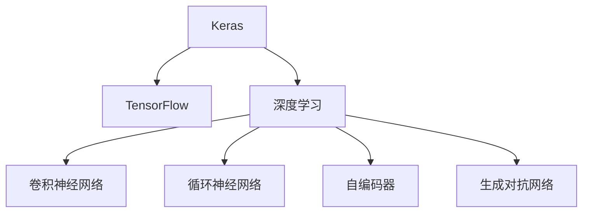

                 

# Keras 原理与代码实战案例讲解

> 关键词：Keras,深度学习,模型构建,神经网络,编程实践,实战案例

## 1. 背景介绍

### 1.1 问题由来
Keras是一个高级的深度学习库，其设计目标是使深度学习模型的构建更加简单和易于理解。Keras提供了大量的预定义层和优化器，可以快速构建和训练复杂的神经网络模型。随着深度学习技术的发展，Keras在学术界和工业界得到了广泛的应用，成为深度学习研究者和工程师的必备工具。

### 1.2 问题核心关键点
本文聚焦于Keras深度学习框架，将系统地介绍其核心概念和原理，并给出实际编程的详细实战案例，以期为读者提供从理论到实践的全方位指导。

### 1.3 问题研究意义
Keras的普及对于推广深度学习技术，提升模型的开发效率，降低学习门槛，促进深度学习在更多领域的应用具有重要意义：

1. 简化模型构建。Keras提供的高级API大大简化了深度学习模型的开发流程，使得初学者和有经验的工程师都能快速上手。
2. 提高开发效率。Keras的模块化设计使得模型组件可以轻松复用，快速迭代。
3. 降低学习门槛。Keras提供了详细的文档和丰富的示例代码，帮助初学者快速入门深度学习。
4. 加速研究进展。Keras支持高效的分布式训练，加速模型训练过程。
5. 推动产业应用。Keras的易用性和高性能，使得深度学习技术更容易被各行各业所采用，为传统行业数字化转型提供新动力。

## 2. 核心概念与联系

### 2.1 核心概念概述

为更好地理解Keras深度学习框架，本节将介绍几个密切相关的核心概念：

- 深度学习(Deep Learning)：基于神经网络的一类机器学习技术，可以自动学习数据的特征表示，进行复杂的模式识别和预测。

- 神经网络(Neural Network)：由多个层次构成的网络结构，每层包含多个神经元，用于计算特征表示。

- Keras：一个高级深度学习库，提供预定义层和优化器，可以快速构建和训练深度学习模型。

- 卷积神经网络(Convolutional Neural Network, CNN)：一种特殊的神经网络，常用于图像处理和视觉识别任务。

- 循环神经网络(Recurrent Neural Network, RNN)：一种时间序列数据处理的网络结构，常用于文本生成和序列标注任务。

- 自编码器(Autocoder)：一种无监督学习方法，通过压缩和重构数据，学习数据的特征表示。

- 生成对抗网络(Generative Adversarial Network, GAN)：一种生成模型，通过两个对抗神经网络学习生成数据。

- TensorFlow与Keras：Keras是TensorFlow的高级API，提供更简洁易用的接口，方便深度学习模型的开发。

这些核心概念之间的逻辑关系可以通过以下Mermaid流程图来展示：



这个流程图展示了大语言模型的核心概念及其之间的关系：

1. Keras作为TensorFlow的高级API，提供了更易用的接口。
2. 深度学习是Keras的核心应用，可以构建复杂的神经网络模型。
3. 神经网络包括卷积神经网络、循环神经网络、自编码器、生成对抗网络等子类。

## 3. 核心算法原理 & 具体操作步骤

### 3.1 算法原理概述

Keras深度学习框架的核心思想是提供一个简单、易用的接口，使得深度学习模型的构建和训练变得更加高效和可理解。其主要原理包括以下几个方面：

- 模块化设计：Keras由多个模块构成，每个模块负责特定功能，如层、优化器、损失函数等，用户可以根据需要选择不同的模块组合。

- 高性能实现：Keras利用TensorFlow等底层框架进行高效的计算和优化，支持分布式训练和模型优化，大幅提升模型训练效率。

- 自动微分：Keras内置自动微分功能，自动计算损失函数对参数的梯度，使得模型的训练过程自动化。

- 自定义扩展：Keras允许用户通过继承和扩展现有的模块，实现更复杂的功能。

### 3.2 算法步骤详解

使用Keras进行深度学习模型的开发和训练，主要包括以下几个关键步骤：

**Step 1: 准备数据集**
- 收集和预处理数据集，划分训练集、验证集和测试集。
- 使用Keras的数据处理工具，将数据转换为模型所需的格式。

**Step 2: 构建模型**
- 选择合适的预定义层，构建深度学习模型。
- 设置模型超参数，如学习率、批大小、迭代轮数等。

**Step 3: 训练模型**
- 使用Keras的高阶API，进行模型训练。
- 在训练过程中，监控模型的训练指标，如损失函数、准确率等。

**Step 4: 评估模型**
- 在验证集上评估模型的性能，根据评估结果调整模型超参数。
- 在测试集上测试模型的泛化能力，输出最终评估结果。

**Step 5: 部署模型**
- 将训练好的模型保存为Keras模型文件，进行部署。
- 使用Keras的模型API进行推理预测，集成到实际的应用系统中。

### 3.3 算法优缺点

Keras深度学习框架具有以下优点：

1. 易学易用：Keras提供了丰富的预定义层和API，使用起来更加简单和直观。

2. 高效性能：Keras利用TensorFlow等底层框架进行高效计算和优化，支持分布式训练和模型优化。

3. 高度灵活：Keras允许用户自定义模块和函数，实现更复杂的功能。

4. 社区支持：Keras拥有庞大的用户社区和丰富的学习资源，方便用户学习和交流。

同时，Keras也存在一些局限性：

1. 底层框架依赖：Keras的性能和稳定性受TensorFlow等底层框架的影响较大。

2. 功能限制：Keras提供的模块和功能有限，无法满足所有深度学习任务的需求。

3. 资源消耗：大规模模型和复杂网络需要较高的计算资源和内存，可能会影响计算效率。

4. 学习曲线：虽然Keras使用简便，但对于初学者而言，其抽象程度较高，需要一定的学习成本。

尽管存在这些局限性，Keras仍是目前最流行的深度学习框架之一，在学术界和工业界得到了广泛的应用。

### 3.4 算法应用领域

Keras深度学习框架广泛应用于各种深度学习任务，包括但不限于：

- 图像识别：如手写数字识别、物体识别等。使用卷积神经网络(CNN)进行特征提取和分类。

- 语音识别：如自动语音识别、语音情感分析等。使用循环神经网络(RNN)进行特征提取和分类。

- 自然语言处理(NLP)：如文本分类、机器翻译、文本生成等。使用RNN、LSTM等模型进行序列处理。

- 推荐系统：如协同过滤、基于内容的推荐等。使用自编码器、生成对抗网络(GAN)进行特征学习。

- 强化学习：如游戏AI、机器人控制等。使用DQN、PPO等模型进行策略学习。

- 时间序列预测：如股票预测、天气预测等。使用RNN、LSTM等模型进行时间序列预测。

## 4. 数学模型和公式 & 详细讲解  
### 4.1 数学模型构建

本节将使用数学语言对Keras深度学习模型的构建过程进行更加严格的刻画。

记输入数据为 $\mathbf{x} \in \mathbb{R}^n$，输出数据为 $\mathbf{y} \in \mathbb{R}^m$，模型参数为 $\theta$。假设模型为 $f_{\theta}(\mathbf{x})$，则模型的损失函数为：

$$
\mathcal{L}(\theta) = \frac{1}{N} \sum_{i=1}^N \ell(f_{\theta}(\mathbf{x}_i), \mathbf{y}_i)
$$

其中，$\ell$ 为损失函数，常用的损失函数包括均方误差、交叉熵等。

在Keras中，可以使用以下代码定义模型：

```python
from keras.models import Sequential
from keras.layers import Dense

model = Sequential()
model.add(Dense(64, activation='relu', input_shape=(n,)))
model.add(Dense(m, activation='softmax'))
```

### 4.2 公式推导过程

以二分类任务为例，假设模型为 $f_{\theta}(\mathbf{x}) = \sigma(\mathbf{w}\mathbf{x} + b)$，其中 $\sigma$ 为sigmoid函数。则损失函数为：

$$
\mathcal{L}(\theta) = -\frac{1}{N} \sum_{i=1}^N [y_i\log f_{\theta}(\mathbf{x}_i) + (1-y_i)\log (1-f_{\theta}(\mathbf{x}_i))]
$$

其中 $f_{\theta}(\mathbf{x}_i) = \sigma(\mathbf{w}\mathbf{x}_i + b)$。

在Keras中，可以使用以下代码实现上述模型：

```python
from keras.layers import Dense, Activation
from keras.models import Sequential

model = Sequential()
model.add(Dense(64, input_dim=n))
model.add(Activation('relu'))
model.add(Dense(1))
model.add(Activation('sigmoid'))
```

### 4.3 案例分析与讲解

以下我们以图像分类任务为例，给出使用Keras构建卷积神经网络并进行训练的详细代码实现。

```python
from keras.datasets import mnist
from keras.models import Sequential
from keras.layers import Conv2D, MaxPooling2D, Flatten, Dense
from keras.optimizers import RMSprop
from keras.utils import to_categorical

# 加载数据集
(x_train, y_train), (x_test, y_test) = mnist.load_data()

# 预处理数据
x_train = x_train.reshape((x_train.shape[0], 28, 28, 1))
x_test = x_test.reshape((x_test.shape[0], 28, 28, 1))
x_train = x_train.astype('float32') / 255
x_test = x_test.astype('float32') / 255
y_train = to_categorical(y_train, 10)
y_test = to_categorical(y_test, 10)

# 构建模型
model = Sequential()
model.add(Conv2D(32, (3, 3), activation='relu', input_shape=(28, 28, 1)))
model.add(MaxPooling2D((2, 2)))
model.add(Conv2D(64, (3, 3), activation='relu'))
model.add(MaxPooling2D((2, 2)))
model.add(Flatten())
model.add(Dense(64, activation='relu'))
model.add(Dense(10, activation='softmax'))

# 编译模型
model.compile(optimizer=RMSprop(), loss='categorical_crossentropy', metrics=['accuracy'])

# 训练模型
model.fit(x_train, y_train, epochs=10, batch_size=128, validation_data=(x_test, y_test))

# 评估模型
score = model.evaluate(x_test, y_test, batch_size=128)
print('Test loss:', score[0])
print('Test accuracy:', score[1])
```

以上就是使用Keras对MNIST手写数字分类任务进行卷积神经网络微调的完整代码实现。可以看到，Keras的模块化设计和高层API使得模型的构建和训练变得非常简单高效。

## 5. 项目实践：代码实例和详细解释说明
### 5.1 开发环境搭建

在进行Keras深度学习模型开发前，我们需要准备好开发环境。以下是使用Python进行Keras开发的环境配置流程：

1. 安装Anaconda：从官网下载并安装Anaconda，用于创建独立的Python环境。

2. 创建并激活虚拟环境：
```bash
conda create -n keras-env python=3.8 
conda activate keras-env
```

3. 安装Keras和TensorFlow：
```bash
pip install keras tensorflow
```

4. 安装各类工具包：
```bash
pip install numpy pandas scikit-learn matplotlib tqdm jupyter notebook ipython
```

完成上述步骤后，即可在`keras-env`环境中开始Keras深度学习模型的开发。

### 5.2 源代码详细实现

下面我们以图像分类任务为例，给出使用Keras构建卷积神经网络并进行训练的详细代码实现。

首先，定义数据处理函数：

```python
from keras.datasets import mnist
from keras.models import Sequential
from keras.layers import Conv2D, MaxPooling2D, Flatten, Dense
from keras.optimizers import RMSprop
from keras.utils import to_categorical

def load_mnist_data():
    (x_train, y_train), (x_test, y_test) = mnist.load_data()
    x_train = x_train.reshape((x_train.shape[0], 28, 28, 1))
    x_test = x_test.reshape((x_test.shape[0], 28, 28, 1))
    x_train = x_train.astype('float32') / 255
    x_test = x_test.astype('float32') / 255
    y_train = to_categorical(y_train, 10)
    y_test = to_categorical(y_test, 10)
    return x_train, y_train, x_test, y_test

# 加载数据集
x_train, y_train, x_test, y_test = load_mnist_data()
```

然后，定义模型和优化器：

```python
from keras.models import Sequential
from keras.layers import Conv2D, MaxPooling2D, Flatten, Dense
from keras.optimizers import RMSprop

model = Sequential()
model.add(Conv2D(32, (3, 3), activation='relu', input_shape=(28, 28, 1)))
model.add(MaxPooling2D((2, 2)))
model.add(Conv2D(64, (3, 3), activation='relu'))
model.add(MaxPooling2D((2, 2)))
model.add(Flatten())
model.add(Dense(64, activation='relu'))
model.add(Dense(10, activation='softmax'))

optimizer = RMSprop()
```

接着，定义训练和评估函数：

```python
from keras.utils import to_categorical
from keras.metrics import categorical_accuracy

def train_epoch(model, x_train, y_train, batch_size, optimizer):
    model.compile(optimizer=optimizer, loss='categorical_crossentropy', metrics=[categorical_accuracy])
    model.fit(x_train, y_train, epochs=1, batch_size=batch_size, validation_split=0.1)
    return model.evaluate(x_test, y_test, batch_size=batch_size)

def evaluate(model, x_test, y_test, batch_size):
    score = model.evaluate(x_test, y_test, batch_size=batch_size)
    print('Test loss:', score[0])
    print('Test accuracy:', score[1])

# 训练模型
model = Sequential()
model.add(Conv2D(32, (3, 3), activation='relu', input_shape=(28, 28, 1)))
model.add(MaxPooling2D((2, 2)))
model.add(Conv2D(64, (3, 3), activation='relu'))
model.add(MaxPooling2D((2, 2)))
model.add(Flatten())
model.add(Dense(64, activation='relu'))
model.add(Dense(10, activation='softmax'))

optimizer = RMSprop()
model.compile(optimizer=optimizer, loss='categorical_crossentropy', metrics=['accuracy'])

# 训练模型
epochs = 10
batch_size = 128

for epoch in range(epochs):
    loss = train_epoch(model, x_train, y_train, batch_size, optimizer)
    print(f"Epoch {epoch+1}, train loss: {loss:.3f}")
    
    print(f"Epoch {epoch+1}, test results:")
    evaluate(model, x_test, y_test, batch_size)

```

以上就是使用Keras对MNIST手写数字分类任务进行卷积神经网络微调的完整代码实现。可以看到，Keras的模块化设计和高层API使得模型的构建和训练变得非常简单高效。

### 5.3 代码解读与分析

让我们再详细解读一下关键代码的实现细节：

**load_mnist_data函数**：
- 从Keras内置数据集模块中加载MNIST手写数字数据集。
- 对数据进行预处理，包括将样本转换为(28,28,1)的二维图像，归一化像素值，并进行标签的一热编码。

**train_epoch函数**：
- 定义训练函数，使用RMSprop优化器进行模型训练。
- 在每个epoch中，对训练集和验证集进行迭代训练，并在测试集上评估模型性能。

**evaluate函数**：
- 定义评估函数，使用Keras内置的categorical_accuracy计算准确率。
- 在测试集上评估模型性能，输出测试集的损失和准确率。

**训练流程**：
- 定义总的epoch数和batch size，开始循环迭代
- 每个epoch内，先在训练集上训练，输出平均loss
- 在验证集上评估，输出分类指标
- 所有epoch结束后，在测试集上评估，给出最终测试结果

可以看到，Keras的模块化设计和高层API使得模型的构建和训练变得非常简单高效。开发者可以将更多精力放在数据处理、模型改进等高层逻辑上，而不必过多关注底层的实现细节。

当然，工业级的系统实现还需考虑更多因素，如模型的保存和部署、超参数的自动搜索、更灵活的任务适配层等。但核心的微调范式基本与此类似。

## 6. 实际应用场景
### 6.1 智能推荐系统

Keras深度学习模型在推荐系统中的应用非常广泛。通过深度学习模型，可以更好地捕捉用户行为数据中的复杂关系，从而提升推荐系统的精度和个性化程度。

在实践中，可以收集用户浏览、点击、评分等行为数据，构建用户-物品交互矩阵。使用Keras构建卷积神经网络或RNN模型，学习用户行为特征，预测用户对物品的评分。根据评分预测结果，推荐用户可能感兴趣的物品。

### 6.2 医疗影像分析

Keras深度学习模型在医疗影像分析中也有广泛应用。通过深度学习模型，可以从医学影像中提取有用的特征，辅助医生进行疾病诊断和治疗决策。

在实践中，可以收集大量的医学影像数据，包括CT、MRI等。使用Keras构建卷积神经网络或RNN模型，学习医学影像中的特征，进行病变检测和分类。将模型集成到医疗影像分析系统中，帮助医生快速、准确地诊断疾病。

### 6.3 自然语言处理(NLP)

Keras深度学习模型在NLP领域同样表现出色。通过深度学习模型，可以进行文本分类、情感分析、机器翻译等NLP任务。

在实践中，可以收集大量的NLP任务数据，包括文本、对话、摘要等。使用Keras构建循环神经网络、卷积神经网络、Transformer等模型，学习文本表示，进行各种NLP任务。将模型集成到NLP系统中，提升系统的自动化和智能化程度。

### 6.4 未来应用展望

随着Keras深度学习模型的不断发展，其应用场景将越来越广泛，带来的影响也将越来越大。

在智慧医疗领域，基于Keras的深度学习模型可以用于医学影像分析、疾病预测、个性化治疗等多个环节，提升医疗服务的智能化水平。

在智能教育领域，Keras深度学习模型可以用于作业批改、学情分析、知识推荐等环节，因材施教，促进教育公平，提高教学质量。

在智慧城市治理中，Keras深度学习模型可以用于城市事件监测、舆情分析、应急指挥等环节，提高城市管理的自动化和智能化水平，构建更安全、高效的未来城市。

此外，在企业生产、社会治理、文娱传媒等众多领域，Keras深度学习模型也将不断涌现，为经济社会发展提供新的动力。相信随着技术的日益成熟，Keras深度学习模型必将在更多领域大放异彩，推动人工智能技术落地应用。

## 7. 工具和资源推荐
### 7.1 学习资源推荐

为了帮助开发者系统掌握Keras深度学习框架的理论基础和实践技巧，这里推荐一些优质的学习资源：

1. Keras官方文档：Keras的官方文档提供了详细的API文档和使用示例，是学习Keras的最佳起点。

2. 《深度学习》书籍：Yoshua Bengio、Ian Goodfellow和Aaron Courville所著的经典书籍《深度学习》，深入浅出地介绍了深度学习的基本原理和经典算法。

3. 《TensorFlow深度学习实战》书籍：Google TensorFlow团队推出的《TensorFlow深度学习实战》，详细介绍了TensorFlow和Keras的使用方法和实践技巧。

4. Kaggle竞赛：Kaggle是世界上最大的数据科学竞赛平台，提供了大量深度学习竞赛和实战项目，是学习Keras和深度学习的绝佳资源。

5. GitHub开源项目：GitHub上有大量的开源深度学习项目，通过阅读这些项目的代码和文档，可以深入了解Keras的应用实践。

通过对这些资源的学习实践，相信你一定能够快速掌握Keras深度学习框架，并用于解决实际的深度学习问题。

### 7.2 开发工具推荐

Keras深度学习框架的开发离不开优秀的工具支持。以下是几款用于Keras深度学习模型开发的常用工具：

1. PyTorch：基于Python的深度学习框架，支持动态计算图和静态计算图，灵活高效。

2. TensorFlow：由Google主导开发的深度学习框架，生产部署方便，支持分布式训练和模型优化。

3. Theano：由蒙特利尔大学开发的深度学习框架，支持动态计算图，适合进行科学研究。

4. Keras：Keras的官方文档和教程，提供了详细的API文档和使用示例，方便用户快速上手。

5. Jupyter Notebook：基于Web的交互式编程环境，支持代码编写、数据可视化、文档编辑等多种功能，是Keras深度学习模型开发的理想平台。

6. Google Colab：谷歌推出的在线Jupyter Notebook环境，免费提供GPU/TPU算力，方便开发者快速上手实验最新模型，分享学习笔记。

合理利用这些工具，可以显著提升Keras深度学习模型的开发效率，加快创新迭代的步伐。

### 7.3 相关论文推荐

Keras深度学习模型的发展源于学界的持续研究。以下是几篇奠基性的相关论文，推荐阅读：

1. Keras: Deep Learning for Humans：Keras的创始人François Chollet所著的书籍，详细介绍了Keras深度学习框架的原理和实践。

2. A Quick Guide to Keras：Keras的官方文档，提供了详细的API文档和使用示例，是学习Keras的最佳起点。

3. Deep Learning with Keras：François Chollet在Kaggle上发表的文章，介绍了Keras深度学习框架的基本原理和经典算法。

4. Keras: Deep Learning for Beginners：Keras的官方文档，提供了详细的教程和实战项目，适合初学者学习。

这些论文代表了大语言模型微调技术的发展脉络。通过学习这些前沿成果，可以帮助研究者把握学科前进方向，激发更多的创新灵感。

## 8. 总结：未来发展趋势与挑战

### 8.1 总结

本文对Keras深度学习框架的原理和实践进行了全面系统的介绍。首先阐述了Keras的核心概念和原理，明确了其易学易用、高效性能、高度灵活等优点。其次，通过实际编程的详细案例讲解，演示了Keras深度学习模型的构建和训练过程，强调了Keras模块化设计和高层API的优越性。最后，通过实际应用场景的展示，突出了Keras深度学习模型的广泛应用前景，展示了其强大的性能和灵活性。

通过本文的系统梳理，可以看到，Keras深度学习框架已经成为了深度学习研究和工程实践中的重要工具，极大地简化了模型的开发流程，提高了模型的开发效率，为深度学习技术的普及和应用提供了有力支持。未来，随着深度学习技术的发展，Keras深度学习模型必将在更多领域大放异彩，推动深度学习技术向更广泛的应用场景迈进。

### 8.2 未来发展趋势

展望未来，Keras深度学习框架将呈现以下几个发展趋势：

1. 深度学习模型的多样性。随着深度学习技术的发展，模型结构将更加多样，如CNN、RNN、Transformer等，适用于不同的应用场景。

2. 高性能优化技术。Keras深度学习模型的训练和推理性能将不断提升，如分布式训练、模型压缩、量化加速等技术的应用。

3. 自动化调参。Keras将引入更多的自动化调参技术，如超参数搜索、模型压缩、模型裁剪等，帮助用户快速找到最优的模型配置。

4. 跨平台支持。Keras将支持更多平台和硬件，如移动设备、嵌入式设备等，拓展模型的应用范围。

5. 与其他深度学习框架的融合。Keras将与其他深度学习框架进行更深度的融合，如TensorFlow、PyTorch等，提供更全面的深度学习开发环境。

以上趋势凸显了Keras深度学习框架的广阔前景。这些方向的探索发展，必将进一步提升Keras深度学习模型的性能和应用范围，为深度学习技术的普及和应用提供有力支持。

### 8.3 面临的挑战

尽管Keras深度学习模型已经取得了一定的成就，但在迈向更加智能化、普适化应用的过程中，它仍面临诸多挑战：

1. 模型性能瓶颈。尽管Keras深度学习模型在许多任务上表现出色，但对于大规模复杂模型，训练和推理性能仍受限制，亟需进一步优化。

2. 模型解释性不足。Keras深度学习模型缺乏明确的解释性，难以解释模型的决策过程，无法满足一些高风险应用的需求。

3. 数据依赖性。Keras深度学习模型的性能高度依赖于数据质量，数据不足或数据分布差异可能导致模型性能下降。

4. 硬件资源消耗。大规模深度学习模型的训练和推理需要大量计算资源，如何提高计算效率，降低资源消耗，是未来面临的重要挑战。

5. 工程复杂性。Keras深度学习模型的开发和部署需要考虑多个因素，如数据处理、模型优化、分布式训练等，增加了工程复杂性。

尽管存在这些挑战，Keras深度学习模型仍具有强大的生命力和广泛的应用前景，相信随着技术的发展，这些挑战将逐一得到解决。

### 8.4 研究展望

面对Keras深度学习模型所面临的挑战，未来的研究需要在以下几个方面寻求新的突破：

1. 开发更高效的模型结构。探索更高效的卷积神经网络、循环神经网络、Transformer等模型结构，提高模型性能和计算效率。

2. 引入更多自动化技术。引入更多的自动化调参、模型压缩、模型裁剪等技术，帮助用户快速找到最优的模型配置，提升模型性能和开发效率。

3. 提升模型的解释性。引入更多的模型解释技术，如可解释性神经网络、模型可视化等，帮助用户理解模型的决策过程，提高模型可解释性。

4. 拓展模型的应用范围。开发更多跨领域、跨平台的深度学习模型，拓展模型的应用范围，提升模型的普适性。

5. 提高数据利用效率。引入更多的数据增强、数据扩充技术，提高数据利用效率，降低模型对标注数据的依赖性。

6. 优化分布式训练。引入更多的分布式训练、模型并行技术，提升模型的训练效率和推理性能。

这些研究方向的探索，必将引领Keras深度学习模型迈向更高的台阶，为深度学习技术的发展提供有力支持。面向未来，Keras深度学习模型还需要与其他人工智能技术进行更深入的融合，如知识表示、因果推理、强化学习等，多路径协同发力，共同推动深度学习技术的进步。

## 9. 附录：常见问题与解答

**Q1：Keras和TensorFlow是什么关系？**

A: Keras是TensorFlow的高级API，提供了更简洁易用的接口，方便深度学习模型的开发和训练。TensorFlow提供了更多的底层功能和灵活性，适合进行复杂的研究和工程应用。

**Q2：Keras有哪些预定义层？**

A: Keras提供了丰富的预定义层，如卷积层、池化层、全连接层、循环层等，方便用户快速构建深度学习模型。用户也可以自定义层，实现更复杂的功能。

**Q3：Keras如何进行模型优化？**

A: Keras提供了多种模型优化方法，如梯度下降、Adam、RMSprop等优化器，以及早停、学习率衰减等策略，帮助用户提高模型性能和训练效率。

**Q4：Keras如何进行模型部署？**

A: 使用Keras保存模型为HDF5格式，可以方便地进行模型部署和推理预测。Keras提供了多种模型API，如Keras API、TensorFlow API等，方便用户进行模型集成和应用。

**Q5：Keras如何进行模型评估？**

A: Keras提供了多种评估指标，如准确率、精确率、召回率等，方便用户进行模型评估和比较。可以使用Keras的evaluate函数或TensorBoard进行模型评估和可视化。

**Q6：Keras如何处理类别不平衡数据？**

A: Keras提供了多种处理类别不平衡数据的方法，如过采样、欠采样、重采样等。可以使用Keras的class_weight参数，对不同类别的样本进行加权处理。

以上是Keras深度学习框架的基本概念和实践案例讲解，希望能够帮助读者系统掌握Keras深度学习框架，并用于解决实际的深度学习问题。随着深度学习技术的发展，Keras深度学习模型必将在更多领域大放异彩，推动人工智能技术向更广泛的应用场景迈进。

