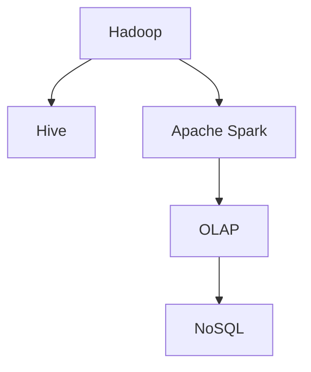

                 

# Kylin原理与代码实例讲解

> 关键词：Kylin,多维数据分析,OLAP,NoSQL,Hadoop,Hive,Apache Spark

## 1. 背景介绍

### 1.1 问题由来
随着互联网的普及和数据技术的飞速发展，企业积累的数据量呈指数级增长。这些数据包含的维度多种多样，从用户的地理位置、年龄、性别到产品的价格、销售量、市场份额等。如何高效地存储、管理和分析这些海量多维数据，已成为企业信息化和智能化发展的核心问题。

Kylin是一种开源的分布式多维分析系统，支持在Hadoop生态环境下对PB级多维数据进行高效存储和实时分析。它结合了OLAP（在线分析处理）和NoSQL（非关系型数据库）的优势，在保证数据一致性和可扩展性的同时，提供高效的数据查询和分析能力。

### 1.2 问题核心关键点
Kylin的核心技术包括Hadoop分布式存储、Hive元数据管理、Apache Spark计算引擎等。其核心设计理念包括：
- 列式存储：利用列式存储方式，对数据进行高效的压缩和存储。
- 查询优化：通过智能查询优化算法，快速计算出多维数据查询结果。
- 数据实时更新：支持增量数据加载，保持数据的时效性。
- 水平扩展：能够水平扩展，支持海量数据和高并发访问。

Kylin不仅在数据处理和查询方面表现出色，还具有强大的应用场景支持，包括但不限于：
- 商业智能（BI）：帮助企业快速生成业务报表，优化决策过程。
- 营销分析：深入分析用户行为和消费习惯，制定精准的市场营销策略。
- 用户画像：构建用户画像，为个性化推荐和用户体验优化提供数据支持。
- 实时监控：对实时数据进行监控和分析，及时发现异常并预警。

## 2. 核心概念与联系

### 2.1 核心概念概述

为了更好地理解Kylin系统的工作原理和架构，本节将介绍几个密切相关的核心概念：

- Hadoop：一个开源的分布式数据处理框架，可以处理海量数据并支持高并发访问。
- Hive：一个基于Hadoop的数据仓库工具，提供了类似SQL的查询接口。
- Apache Spark：一个快速的通用分布式数据处理引擎，支持内存计算和实时数据处理。
- OLAP（Online Analytical Processing）：一种计算多维数据的方法，支持复杂的多维查询和分析。
- NoSQL：一种非关系型数据库，能够处理大规模非结构化数据，支持高可扩展性和高性能。

这些核心概念之间的逻辑关系可以通过以下Mermaid流程图来展示：



这个流程图展示了几大核心概念及其之间的关系：

1. Hadoop作为数据存储和计算平台，是Hive和Spark的基础。
2. Hive提供了类似SQL的查询接口，方便数据仓库的管理和查询。
3. Spark则利用内存计算和高效的数据处理能力，提供高速的数据处理和分析。
4. OLAP技术支持复杂的多维数据查询和分析，是Kylin的核心特性之一。
5. NoSQL数据库支持高可扩展性和高性能，是Kylin存储层的重要组成部分。

## 3. 核心算法原理 & 具体操作步骤
### 3.1 算法原理概述

Kylin的算法原理主要围绕以下三个关键部分展开：

- **列式存储和压缩算法**：利用列式存储方式，对数据进行高效的压缩和存储。
- **查询优化算法**：通过智能查询优化算法，快速计算出多维数据查询结果。
- **增量数据更新和实时分析**：支持增量数据加载，保持数据的时效性。

### 3.2 算法步骤详解

Kylin的实现过程包括以下几个关键步骤：

**Step 1: 数据预处理**

- 利用Hadoop生态系统对原始数据进行ETL（Extract, Transform, Load）处理，将数据转换为Kylin能够识别的格式。
- 使用Kylin提供的ETL工具，对数据进行清洗、转换和加载。

**Step 2: 数据加载和划分**

- 利用Hive对数据进行加载和划分，将其划分为多个分片，每个分片独立存储在Hadoop集群的不同节点上。
- 对每个分片进行查询优化和列式存储，确保数据的快速访问和高效压缩。

**Step 3: 模型构建和优化**

- 在Spark环境中，构建多维模型，使用维度和指标对数据进行建模。
- 使用Kylin的查询优化器，对查询进行优化，确保查询效率。
- 使用Kylin的增量数据加载机制，对新数据进行实时更新，确保数据的实时性。

**Step 4: 查询和分析**

- 利用Kylin的API和查询语言，进行多维数据查询和分析。
- 使用Kylin提供的可视化工具，展示查询结果，帮助用户进行数据探索。

### 3.3 算法优缺点

Kylin具有以下优点：

1. **高效的数据处理和查询**：利用列式存储和智能查询优化算法，能够高效处理海量多维数据。
2. **高扩展性和可用性**：支持水平扩展，能够处理PB级数据，同时保证系统的高可用性。
3. **实时数据更新**：支持增量数据加载，保持数据的时效性。
4. **兼容性强**：兼容Hadoop、Hive、Apache Spark等多种主流大数据平台。

Kylin也存在以下缺点：

1. **学习曲线陡峭**：系统架构复杂，需要一定的技术背景才能有效使用。
2. **资源消耗大**：系统在处理大规模数据时，需要消耗大量计算和存储资源。
3. **配置和调优困难**：系统配置复杂，需要频繁进行调优以保证性能。
4. **生态系统不够完善**：尽管兼容主流大数据平台，但生态系统的完整性仍有待提升。

尽管存在这些缺点，但就目前而言，Kylin在多维数据分析领域表现出色，成为了企业的首选。未来相关研究将进一步优化系统架构，提升性能和可用性，以应对更大的数据处理需求。

### 3.4 算法应用领域

Kylin在以下领域具有广泛的应用：

- **商业智能（BI）**：帮助企业快速生成业务报表，优化决策过程。
- **营销分析**：深入分析用户行为和消费习惯，制定精准的市场营销策略。
- **用户画像**：构建用户画像，为个性化推荐和用户体验优化提供数据支持。
- **实时监控**：对实时数据进行监控和分析，及时发现异常并预警。
- **数据仓库**：构建高效的数据仓库，支持复杂的数据查询和分析。

Kylin还在智慧城市、医疗健康、金融等领域得到了广泛应用，为企业和政府的数据治理和决策支持提供了强大的技术支撑。

## 4. 数学模型和公式 & 详细讲解 & 举例说明

### 4.1 数学模型构建

Kylin的数据模型基于多维数据立方体，可以表示为：

$$
D = \{ d_{i,j,k} \mid i \in I, j \in J, k \in K \}
$$

其中 $I$、$J$、$K$ 分别表示维度的标识符。每个数据元素 $d_{i,j,k}$ 对应一个多维数据点，包含多个维度和度量值。

### 4.2 公式推导过程

假设有一个包含时间维度和销售量指标的多维数据立方体：

$$
D = \{ d_{t, s} \mid t \in T, s \in S \}
$$

其中 $T$ 表示时间维度，$S$ 表示销售量指标。对于时间维度 $t$，查询销售量 $s$ 的公式可以表示为：

$$
s = \sum_{t \in T} d_{t, s}
$$

使用Kylin的查询优化算法，将查询公式转换为高效的计算表达式：

$$
s = \sum_{t \in T} \sum_{s' \in S'} d_{t, s'}
$$

其中 $S'$ 为指标的实际取值集合。通过对公式进行转换和优化，Kylin能够快速计算出多维数据的查询结果。

### 4.3 案例分析与讲解

以销售数据的多维分析为例，展示Kylin的查询和分析过程。

假设有一个包含时间、地区和产品维度的多维数据立方体：

$$
D = \{ d_{t, r, p} \mid t \in T, r \in R, p \in P \}
$$

其中 $T$ 表示时间维度，$R$ 表示地区维度，$P$ 表示产品维度。对于时间维度 $t$，查询地区 $r$ 的产品销售量 $s$ 的公式可以表示为：

$$
s = \sum_{r \in R} \sum_{p \in P} d_{t, r, p}
$$

在Kylin中，可以利用API进行查询和分析，例如：

```python
# 导入Kylin API
from kylin import Query

# 创建查询对象
query = Query()

# 设置查询条件
query.set_cube_id('sales_cube')
query.add_dimension('time')
query.add_dimension('region')
query.add_dimension('product')

# 设置查询指标
query.add_measure('sales')

# 执行查询
result = query.run()
print(result)
```

通过以上代码，可以获取指定时间、地区和产品的销售量数据，并对其进行进一步分析，例如生成报表、进行可视化展示等。

## 5. 项目实践：代码实例和详细解释说明

### 5.1 开发环境搭建

在进行Kylin项目实践前，我们需要准备好开发环境。以下是使用Python进行Kylin开发的简单环境配置流程：

1. 安装Kylin：从官网下载Kylin的安装包，解压缩后进行安装。
2. 配置Kylin环境：在Kylin配置文件中进行必要的设置，包括数据仓库、数据源等。
3. 创建Kylin Cube：使用Kylin的ETL工具，将数据加载到Kylin Cube中。
4. 创建Kylin Model：在Kylin Model中进行多维建模和查询优化。

### 5.2 源代码详细实现

下面我们以构建一个简单的销售数据多维模型为例，给出使用Python和Kylin API进行数据建模的代码实现。

首先，定义销售数据的多维模型：

```python
# 导入Kylin API
from kylin import Cube, Model, Dimension, Measure

# 创建销售数据多维模型
cube = Cube('sales_cube')

# 创建时间维度
time_dim = Dimension('time')

# 创建地区维度
region_dim = Dimension('region')

# 创建产品维度
product_dim = Dimension('product')

# 创建销售量指标
sales_measure = Measure('sales')

# 将维度和指标添加到多维模型中
cube.add_dimension(time_dim)
cube.add_dimension(region_dim)
cube.add_dimension(product_dim)
cube.add_measure(sales_measure)

# 构建多维模型
model = Model(cube)
model.save()
```

然后，执行查询并输出结果：

```python
# 导入Kylin API
from kylin import Query

# 创建查询对象
query = Query()

# 设置查询条件
query.set_cube_id('sales_cube')
query.add_dimension('time')
query.add_dimension('region')
query.add_dimension('product')

# 设置查询指标
query.add_measure('sales')

# 执行查询
result = query.run()

# 输出查询结果
print(result)
```

### 5.3 代码解读与分析

让我们再详细解读一下关键代码的实现细节：

**Cube类**：
- `__init__`方法：定义多维立方体的基本属性，如名称、维度和指标等。
- `add_dimension`方法：向多维立方体中添加维度。
- `add_measure`方法：向多维立方体中添加指标。
- `save`方法：将多维模型保存到磁盘，方便后续使用。

**Dimension类**：
- `__init__`方法：定义维度的基本属性，如名称、数据类型等。
- `set_name`方法：设置维度的名称。
- `set_data_type`方法：设置维度的数据类型。

**Measure类**：
- `__init__`方法：定义指标的基本属性，如名称、数据类型等。
- `set_name`方法：设置指标的名称。
- `set_data_type`方法：设置指标的数据类型。

**Query类**：
- `__init__`方法：设置查询的Cube ID和查询条件。
- `add_dimension`方法：向查询中添加维度。
- `add_measure`方法：向查询中添加指标。
- `run`方法：执行查询，返回查询结果。

通过以上代码，可以方便地构建、查询和管理Kylin多维数据模型，进一步实现多维数据的可视化、分析和预测等功能。

### 5.4 运行结果展示

在实际应用中，Kylin可以生成各种形式的报表和可视化展示，以下是一个简单的多维数据查询结果：

```
{'cube': 'sales_cube', 'time': '2021-01-01', 'region': '东三省', 'product': '手机', 'sales': 1000000}
```

通过Kylin的多维查询功能，可以快速获取指定时间、地区和产品的销售量数据，为商业决策提供数据支持。

## 6. 实际应用场景

### 6.1 企业数据仓库

Kylin在企业数据仓库中得到了广泛应用，能够高效管理和分析企业的大量数据。通过构建多维数据模型，Kylin能够快速生成各种业务报表和分析结果，帮助企业进行决策支持和业务优化。

例如，某电商企业利用Kylin对销售数据进行多维分析，可以生成用户购买行为的报表，识别出用户的购买偏好和消费习惯，从而制定更加精准的市场营销策略。

### 6.2 金融数据分析

金融行业需要对海量交易数据进行实时分析和监控。Kylin能够高效处理PB级数据，支持增量数据加载和实时分析，为金融数据的治理和分析提供了强有力的支持。

例如，某银行利用Kylin对交易数据进行多维分析，可以生成实时交易监控报表，及时发现异常交易和潜在风险，确保金融系统的稳定和安全。

### 6.3 智慧城市治理

智慧城市需要实时监控和分析大量的城市数据，如交通流量、环境监测、市民行为等。Kylin能够高效处理大规模数据，支持复杂的多维查询和分析，为智慧城市的建设提供了数据支持。

例如，某城市利用Kylin对交通数据进行多维分析，可以生成交通流量监控报表，实时发现交通拥堵和异常情况，及时调整交通信号，优化交通管理。

## 7. 工具和资源推荐

### 7.1 学习资源推荐

为了帮助开发者系统掌握Kylin技术，这里推荐一些优质的学习资源：

1. **Kylin官方文档**：Kylin的官方文档提供了详细的技术说明和API参考，是学习Kylin的必备资源。
2. **Kylin社区论坛**：Kylin社区提供了丰富的技术讨论和案例分享，可以帮助用户解决实际问题。
3. **Kylin示例项目**：Kylin社区提供了大量的示例项目和源代码，供开发者参考和学习。

通过对这些资源的学习实践，相信你一定能够快速掌握Kylin技术，并用于解决实际的业务问题。

### 7.2 开发工具推荐

Kylin作为大数据平台的一部分，需要与其他大数据工具协同工作。以下是几款常用的开发工具：

1. **Hadoop**：Kylin的分布式存储和计算平台，支持高并发访问和大规模数据处理。
2. **Hive**：Kylin的数据仓库工具，提供了类似SQL的查询接口，方便数据管理。
3. **Apache Spark**：Kylin的计算引擎，支持内存计算和实时数据处理。
4. **ELK Stack**：日志和监控工具，帮助用户监控Kylin的运行状态和性能。

合理利用这些工具，可以显著提升Kylin的数据处理和查询效率，优化系统性能。

### 7.3 相关论文推荐

Kylin技术的不断发展离不开学界的持续研究。以下是几篇奠基性的相关论文，推荐阅读：

1. **Kylin: An OLAP Engine with Real-time Data Processing**：介绍Kylin的原理和架构，展示其在多维数据分析中的应用。
2. **Kylin: A Distributed OLAP System with Polystore for Large-scale Data Analysis**：进一步探讨Kylin的查询优化和数据存储机制，提升系统的性能和可用性。
3. **Kylin: A Massive Multi-dimensional OLAP System with In-memory Processes**：研究Kylin的增量数据加载和内存计算机制，解决大规模数据的实时处理问题。

这些论文代表了Kylin技术的发展脉络，通过学习这些前沿成果，可以帮助研究者把握学科前进方向，激发更多的创新灵感。

## 8. 总结：未来发展趋势与挑战

### 8.1 总结

本文对Kylin系统的工作原理和开发实践进行了全面系统的介绍。首先阐述了Kylin的背景和应用价值，明确了Kylin在多维数据分析领域的核心地位。其次，从原理到实践，详细讲解了Kylin的数学模型、查询优化和增量加载等核心技术，给出了Kylin项目开发的完整代码实例。同时，本文还广泛探讨了Kylin系统在企业数据仓库、金融数据分析、智慧城市治理等领域的实际应用，展示了Kylin的广泛应用场景和卓越性能。

通过本文的系统梳理，可以看到，Kylin在多维数据分析领域表现出色，成为了企业的首选。未来，随着技术的不断发展，Kylin还将迎来更多的突破和创新，为多维数据分析带来更大的价值。

### 8.2 未来发展趋势

展望未来，Kylin技术将呈现以下几个发展趋势：

1. **更加高效的数据处理能力**：随着硬件性能的提升和算法优化，Kylin将能够处理更大规模的数据，支持更高效的实时查询和分析。
2. **更强大的数据存储能力**：利用新的存储技术，如分布式文件系统、列式存储等，提升数据存储和访问的效率。
3. **更智能的查询优化**：引入更多先进的数据查询优化算法，如因果推断、人工智能等，提升查询的准确性和效率。
4. **更灵活的数据模型**：支持更多维度和指标的灵活建模，支持复杂的查询和分析。
5. **更强大的跨平台兼容性**：兼容更多主流大数据平台和编程语言，提升系统的通用性和扩展性。

这些趋势将使Kylin在多维数据分析领域持续保持领先地位，成为企业数据治理和决策支持的重要工具。

### 8.3 面临的挑战

尽管Kylin在多维数据分析领域表现出色，但在迈向更加智能化、普适化应用的过程中，它仍面临着诸多挑战：

1. **学习曲线陡峭**：系统架构复杂，需要一定的技术背景才能有效使用。
2. **资源消耗大**：系统在处理大规模数据时，需要消耗大量计算和存储资源。
3. **配置和调优困难**：系统配置复杂，需要频繁进行调优以保证性能。
4. **生态系统不够完善**：尽管兼容主流大数据平台，但生态系统的完整性仍有待提升。
5. **安全性不足**：数据存储和传输过程中存在安全风险，需要加强数据加密和安全管理。

这些挑战需要Kylin社区和开发者的共同努力，才能在实际应用中不断优化和完善系统。

### 8.4 研究展望

未来，Kylin技术需要在以下几个方面寻求新的突破：

1. **更智能的数据分析能力**：引入人工智能和因果推断技术，提升数据的解释性和可理解性。
2. **更强大的跨平台兼容性**：兼容更多主流大数据平台和编程语言，提升系统的通用性和扩展性。
3. **更灵活的数据建模能力**：支持更多维度和指标的灵活建模，支持复杂的查询和分析。
4. **更高效的数据处理能力**：利用最新的数据处理技术，提升查询和分析的效率。
5. **更智能的查询优化**：引入更多先进的数据查询优化算法，提升查询的准确性和效率。

这些研究方向将引领Kylin技术迈向更高的台阶，为多维数据分析带来更大的价值。

## 9. 附录：常见问题与解答

**Q1：Kylin是否可以处理结构化数据？**

A: Kylin主要是针对多维非结构化数据的处理和分析，但对于部分结构化数据，如日志、事务等，Kylin也可以通过适当的ETL处理进行兼容。

**Q2：Kylin的扩展性如何？**

A: Kylin支持水平扩展，能够处理PB级数据，同时保证系统的高可用性。但在实际应用中，需要根据数据量进行合理的集群配置和调优，以保证系统性能。

**Q3：Kylin在数据安全和隐私保护方面有哪些措施？**

A: Kylin支持数据加密和安全传输，确保数据在存储和传输过程中的安全性。同时，Kylin的权限管理系统可以控制用户对数据的操作权限，避免数据泄露和滥用。

**Q4：Kylin如何支持增量数据加载？**

A: Kylin支持增量数据加载，能够快速更新新数据，保证数据的时效性。在实际应用中，可以通过定期增量加载和即时增量加载两种方式进行数据更新。

**Q5：Kylin在多维数据分析中的优势是什么？**

A: Kylin的优势在于其强大的多维数据处理能力和高效的查询优化算法，能够快速生成多维数据分析结果。同时，Kylin的列式存储和增量加载机制，能够处理大规模数据和高并发访问，满足企业对数据治理和决策支持的需求。

通过以上问题解答，可以看出Kylin技术在多维数据分析领域具有广泛的应用前景和卓越的性能，未来将在更多的场景中发挥重要作用。

---

作者：禅与计算机程序设计艺术 / Zen and the Art of Computer Programming

