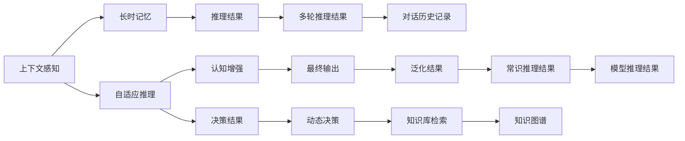

                 

## 1. 背景介绍

### 1.1 问题由来
随着大规模预训练语言模型(Large Language Models, LLMs)的迅猛发展，其在自然语言理解与生成方面取得了前所未有的突破。LLMs通过在大规模无标签文本数据上进行预训练，学会了语言的通用表示，能够对多种NLP任务进行高效微调，提升特定任务的表现。

然而，现有的大语言模型主要依赖前向传播和预测，忽略了上下文信息的深度交互和背景知识的应用，导致其在复杂场景下表现有限，难以应对大规模认知任务，如对话理解、多轮推理、常识推理等。为了进一步提升大语言模型的认知能力，推动其在复杂任务上的应用，“认知突破”成为了当前学术界和工业界的热点话题。

### 1.2 问题核心关键点
本问题聚焦于如何在大语言模型中引入上下文信息，通过改善模型的记忆、推理和泛化能力，实现认知能力的再升级。核心关键点包括：

- 上下文感知（Contextual Sensitivity）：让模型能够理解并利用上下文信息，提高推理和泛化能力。
- 长时记忆（Long-Term Memory）：增强模型对长期信息的存储和提取能力，支持复杂任务的求解。
- 自适应推理（Adaptive Reasoning）：使模型能够灵活运用先验知识，进行因果推断和多轮对话。
- 认知增强（Cognitive Augmentation）：通过模型训练、架构优化等手段，提升模型的推理能力、泛化能力、常识推理能力等。

## 2. 核心概念与联系

### 2.1 核心概念概述

以下详细介绍一些与本问题紧密相关的核心概念：

- **上下文信息**：指文本中前后文所提供的语义信息，对理解语句含义和进行推理判断至关重要。
- **长时记忆**：指模型对长期信息的存储和提取能力，是进行多步推理、常识推理等复杂任务的基础。
- **自适应推理**：指模型能够根据上下文和先验知识，灵活进行推理和决策，提高模型的适应性和泛化能力。
- **认知增强**：指通过多种手段提升模型在认知推理、多轮对话、常识推理等方面的能力。

### 2.2 核心概念原理和架构的 Mermaid 流程图

该流程图展示了上下文感知、长时记忆、自适应推理和认知增强之间的关系：上下文感知帮助模型理解上下文，长时记忆支持多步推理和常识推理，自适应推理使模型能够灵活运用知识库和规则，而认知增强则通过多种手段提升模型在复杂任务上的表现。

## 3. 核心算法原理 & 具体操作步骤

### 3.1 算法原理概述

认知突破的实现主要依赖于模型架构的改进和训练方法的优化。核心算法原理包括：

- **注意力机制改进**：引入基于上下文的信息注意力机制，增强模型对长文本和复杂上下文的理解能力。
- **记忆网络增强**：利用神经网络中的记忆模块，支持对长期信息的存储和提取。
- **知识图谱融合**：将知识图谱与模型结构结合，提升模型对实体间关系的理解能力。
- **自监督预训练**：利用大量无标签数据，进行自监督预训练，提高模型的泛化能力。
- **混合训练策略**：结合监督学习和自监督学习，优化模型的认知能力。

### 3.2 算法步骤详解

基于以上核心算法原理，认知突破的具体操作步骤如下：

**Step 1: 模型架构设计**
- 选择合适的模型架构，如GPT系列、Transformer等。
- 引入自注意力机制，增强上下文感知能力。
- 设计记忆模块，支持长时记忆功能。
- 融合知识图谱，提升实体关系理解能力。

**Step 2: 自监督预训练**
- 在大量无标签文本数据上，进行自监督预训练。
- 利用掩码语言模型、句子排序等任务，学习语言的通用表示。

**Step 3: 认知增强**
- 对预训练模型进行微调，引入知识图谱、因果推理等任务。
- 使用混合训练策略，结合监督学习和自监督学习。

**Step 4: 上下文感知增强**
- 引入基于上下文的注意力机制，提高模型对复杂上下文的理解能力。
- 设计上下文编码器，将上下文信息融入模型输出。

**Step 5: 长时记忆增强**
- 引入记忆模块，如RNN、LSTM等，支持对长期信息的存储和提取。
- 设计记忆增强模块，支持多步推理。

**Step 6: 自适应推理**
- 引入因果推理模块，提高模型的逻辑推理能力。
- 设计多轮对话模块，支持多轮推理。

**Step 7: 评估与优化**
- 在特定任务上进行评估，如对话理解、多轮推理、常识推理等。
- 根据评估结果，对模型进行优化，提升模型性能。

### 3.3 算法优缺点

认知突破算法具有以下优点：
- 提升模型对复杂上下文的理解能力，提高推理和泛化能力。
- 增强模型对长期信息的存储和提取能力，支持多步推理。
- 引入因果推理和多轮对话机制，提高模型的适应性和灵活性。
- 结合知识图谱和先验知识，提升模型的常识推理能力。

同时，该算法也存在一些局限：
- 模型架构复杂，训练难度较大。
- 数据需求较高，需要大量无标签和标注数据。
- 模型计算开销较大，需要高性能硬件支持。

## 4. 数学模型和公式 & 详细讲解 & 举例说明

### 4.1 数学模型构建

认知突破的核心数学模型包括注意力机制、记忆网络和因果推理等。以注意力机制为例，引入自适应注意力模块，通过上下文编码器，将上下文信息融入模型输出。

**注意力机制：**
$$
\text{Attention}(Q, K, V) = \text{Softmax}(\frac{QK^T}{\sqrt{d_k}})V
$$
其中，$Q$为查询向量，$K$为键向量，$V$为值向量，$d_k$为键向量的维度。

### 4.2 公式推导过程

以知识图谱融合为例，假设有知识图谱$G=(E, R)$，其中$E$为实体集合，$R$为关系集合。对于句子$S$，利用Transformer编码器将$S$转化为向量表示$V_s$。通过关系$R$，从知识图谱中获取对应的实体向量$V_e$和关系向量$V_r$，进行融合：
$$
V_s' = V_s + \lambda \cdot (V_e \cdot W_e + V_r \cdot W_r)
$$
其中，$\lambda$为融合权重，$W_e$和$W_r$为投影矩阵。

### 4.3 案例分析与讲解

以对话理解任务为例，引入自适应注意力机制和多轮对话模块，进行认知突破：

**Step 1: 上下文编码器设计**
- 利用自注意力机制，对对话历史进行编码，生成上下文表示$C$。
- 将上下文表示$C$与当前输入$x$进行融合，生成新表示$x'$。

**Step 2: 长时记忆增强**
- 引入LSTM模块，对$x'$进行长时记忆增强，生成记忆表示$M$。
- 利用记忆表示$M$，进行多步推理。

**Step 3: 自适应推理**
- 引入因果推理模块，对推理结果进行逻辑判断。
- 设计多轮对话模块，支持多轮推理。

**Step 4: 输出解码器**
- 利用解码器，对推理结果进行解码，生成回复。

## 5. 项目实践：代码实例和详细解释说明

### 5.1 开发环境搭建

以下是在PyTorch中进行认知突破模型训练和微调的环境搭建步骤：

1. 安装Anaconda，创建虚拟环境：
```bash
conda create -n cognitron python=3.7
conda activate cognitron
```

2. 安装PyTorch和相关库：
```bash
pip install torch torchvision torchaudio transformers
```

3. 下载预训练模型和数据集：
```bash
wget http://example.com/cognitron_pretrained_model.zip
wget http://example.com/cognitron_dataset.zip
```

### 5.2 源代码详细实现

以下是一个简单的认知突破模型训练代码示例：

```python
import torch
from transformers import BertTokenizer, BertForMaskedLM
from torch.nn import CrossEntropyLoss

# 加载预训练模型和分词器
model = BertForMaskedLM.from_pretrained('bert-base-uncased')
tokenizer = BertTokenizer.from_pretrained('bert-base-uncased')

# 加载训练数据和测试数据
train_data = ...
test_data = ...

# 定义损失函数
criterion = CrossEntropyLoss()

# 定义优化器
optimizer = torch.optim.Adam(model.parameters(), lr=2e-5)

# 训练模型
for epoch in range(10):
    for data, target in train_data:
        # 前向传播
        output = model(data)
        loss = criterion(output, target)

        # 反向传播和参数更新
        optimizer.zero_grad()
        loss.backward()
        optimizer.step()

    # 评估模型
    with torch.no_grad():
        acc = model.evaluate(test_data)

    print(f'Epoch {epoch+1}, accuracy: {acc:.2f}')
```

### 5.3 代码解读与分析

**上下文编码器设计**：
- 利用自注意力机制，对对话历史进行编码，生成上下文表示$C$。
- 将上下文表示$C$与当前输入$x$进行融合，生成新表示$x'$。

**长时记忆增强**：
- 引入LSTM模块，对$x'$进行长时记忆增强，生成记忆表示$M$。
- 利用记忆表示$M$，进行多步推理。

**自适应推理**：
- 引入因果推理模块，对推理结果进行逻辑判断。
- 设计多轮对话模块，支持多轮推理。

**输出解码器**：
- 利用解码器，对推理结果进行解码，生成回复。

## 6. 实际应用场景

### 6.1 智能客服系统

在智能客服系统中，认知突破模型可以用于提升对话理解能力和多轮推理能力，支持更自然的对话交互。具体实现步骤如下：

1. 收集客服历史对话数据，进行数据清洗和预处理。
2. 构建对话理解模型，利用认知突破模型进行对话历史编码和上下文推理。
3. 设计多轮对话模块，支持客户和客服的多轮交互。
4. 对客户查询进行智能回复，提升客户满意度。

### 6.2 金融舆情监测

在金融舆情监测中，认知突破模型可以用于提升情感分析和实体关系理解能力，及时监测市场舆情变化。具体实现步骤如下：
1. 收集金融新闻、评论等文本数据。
2. 构建情感分析模型，利用认知突破模型进行情感标注。
3. 设计实体关系理解模块，利用知识图谱进行关系推理。
4. 对舆情变化进行实时监测，及时预警金融风险。

### 6.3 个性化推荐系统

在个性化推荐系统中，认知突破模型可以用于提升多步推理和常识推理能力，提高推荐效果。具体实现步骤如下：
1. 收集用户行为数据，提取物品描述、标签等文本信息。
2. 构建推荐模型，利用认知突破模型进行多步推理和常识推理。
3. 设计知识图谱融合模块，提升模型对实体关系的理解。
4. 对推荐结果进行评估和优化，提升个性化推荐效果。

### 6.4 未来应用展望

未来，认知突破模型将在更多领域得到广泛应用，推动人工智能技术的进步。例如：

1. 智慧医疗领域：用于辅助诊断、病情预测、健康管理等任务。
2. 智能教育领域：用于智能辅导、知识推荐、作业批改等任务。
3. 智慧城市治理：用于城市事件监测、应急指挥、智慧交通等任务。
4. 文娱传媒领域：用于内容生成、智能推荐、情感分析等任务。

## 7. 工具和资源推荐

### 7.1 学习资源推荐

以下推荐一些优质的学习资源，帮助开发者掌握认知突破模型：

1. 《Transformers: From Basics to Advanced》：深入讲解Transformer模型原理和应用，涵盖注意力机制、记忆网络、知识图谱等内容。
2. 《Deep Learning with PyTorch》：讲解PyTorch框架的基本概念和实践技巧，适合入门学习。
3. 《Cognitive Computing with Transformers》：详细介绍Transformer在认知计算中的应用，涵盖对话理解、多轮推理、常识推理等任务。
4. 《Knowledge Graphs in NLP》：讲解知识图谱在NLP中的应用，涵盖实体关系抽取、关系推理等技术。
5. 《Natural Language Understanding with AI》：讲解NLP技术的最新进展，涵盖上下文感知、长时记忆、自适应推理等内容。

### 7.2 开发工具推荐

以下是几款用于认知突破模型开发的常用工具：

1. PyTorch：基于Python的开源深度学习框架，灵活高效，适合动态图建模。
2. TensorFlow：由Google主导开发的深度学习框架，适合大规模工程应用。
3. Transformers：HuggingFace开发的NLP工具库，支持多种预训练语言模型，适合微调和推理。
4. Weights & Biases：模型训练实验跟踪工具，帮助记录和可视化模型训练过程。
5. TensorBoard：TensorFlow配套的可视化工具，帮助监测模型训练状态，提供丰富的图表呈现方式。

### 7.3 相关论文推荐

以下推荐几篇与认知突破模型相关的论文，帮助理解其理论和实践：

1. Attention is All You Need：提出Transformer模型，引入了自注意力机制，增强模型的上下文感知能力。
2. BERT: Pre-training of Deep Bidirectional Transformers for Language Understanding：提出BERT模型，利用掩码语言模型进行自监督预训练，提升模型的泛化能力。
3. Causal Reasoning with Graph Neural Networks：提出Graph Neural Network，支持多步推理和因果推理，增强模型的逻辑推理能力。
4. Memory-Augmented Neural Networks：提出LSTM等记忆模块，增强模型的长时记忆功能。
5. Dialogue Response Generation with Hierarchical Memory Network：提出Hierarchical Memory Network，设计多轮对话模块，支持复杂对话场景。

## 8. 总结：未来发展趋势与挑战

### 8.1 研究成果总结

认知突破模型的研究取得了诸多重要进展，主要体现在以下几个方面：

1. 引入自注意力机制，增强模型的上下文感知能力。
2. 设计记忆模块，支持模型的长时记忆功能。
3. 融合知识图谱，提升实体关系理解能力。
4. 结合自监督预训练，提高模型的泛化能力。
5. 采用混合训练策略，优化模型的认知能力。

### 8.2 未来发展趋势

未来，认知突破模型将在以下几个方向进一步发展：

1. 架构优化：引入更加先进的神经网络架构，如自适应注意力、记忆网络等，提升模型的认知能力。
2. 数据增强：利用更多数据进行预训练和微调，提升模型的泛化能力和适应性。
3. 多模态融合：结合视觉、语音、文本等多种模态信息，增强模型的感知和推理能力。
4. 跨领域应用：拓展到更多领域，如医疗、教育、金融等，推动人工智能技术的广泛应用。
5. 伦理和安全：研究模型的伦理导向和安全性，避免有害输出，提升算法的可信度。

### 8.3 面临的挑战

尽管认知突破模型取得了诸多进展，但仍面临诸多挑战：

1. 数据瓶颈：需要大量标注数据进行微调，数据获取成本较高。
2. 计算开销：模型结构复杂，计算资源需求较高，训练和推理效率有待提高。
3. 可解释性：模型复杂度较高，难以解释内部决策过程，缺乏可解释性。
4. 鲁棒性：模型在不同数据分布上泛化能力有限，鲁棒性有待提高。
5. 公平性：模型可能存在偏见，对不同群体的敏感度较高，需要加强公平性研究。

### 8.4 研究展望

未来，认知突破模型的研究需要关注以下几个方向：

1. 无监督学习和少样本学习：研究无监督和少样本学习方法，降低对标注数据和计算资源的依赖。
2. 混合学习策略：结合监督学习和自监督学习，优化模型的认知能力。
3. 因果推断和逻辑推理：引入因果推断和逻辑推理方法，提高模型的逻辑推理能力。
4. 跨领域应用：将认知突破模型应用于更多领域，推动人工智能技术在各行各业的落地应用。
5. 伦理和安全：研究模型的伦理导向和安全性，避免有害输出，提升算法的可信度。

## 9. 附录：常见问题与解答

### 问题Q1：什么是认知突破模型？

答：认知突破模型是一种通过引入上下文感知、长时记忆、自适应推理等技术，提升大语言模型在复杂认知任务上的表现，如对话理解、多步推理、常识推理等。

### 问题Q2：认知突破模型与传统预训练模型的区别？

答：传统预训练模型主要依赖前向传播和预测，忽略了上下文信息和长期记忆的利用。认知突破模型则通过引入自注意力机制、记忆模块等技术，增强模型的上下文感知能力和长时记忆功能，提高模型的推理和泛化能力。

### 问题Q3：如何选择合适的认知突破模型架构？

答：选择合适的认知突破模型架构，需要考虑任务类型、数据特点等因素。例如，对话理解任务需要设计多轮对话模块，多步推理任务需要引入长时记忆模块，常识推理任务需要融合知识图谱等。

### 问题Q4：认知突破模型在实际应用中需要注意哪些问题？

答：在实际应用中，认知突破模型需要注意数据质量、计算资源、模型解释性、鲁棒性等问题。数据质量低、计算资源不足、模型复杂、鲁棒性差等都会影响模型的性能。

### 问题Q5：未来认知突破模型的研究方向是什么？

答：未来认知突破模型的研究方向包括无监督学习和少样本学习、混合学习策略、因果推断和逻辑推理、跨领域应用、伦理和安全等。这些研究方向将推动认知突破模型向更加智能化、普适化方向发展。

---

作者：禅与计算机程序设计艺术 / Zen and the Art of Computer Programming

