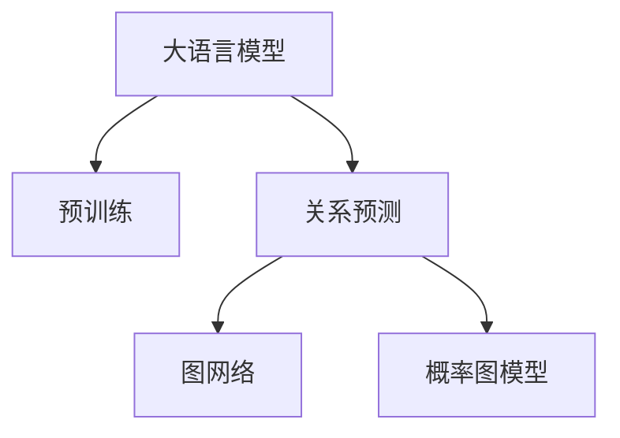

                 

# LLM在关系预测领域的研究新思路

> 关键词：大语言模型,关系预测,预训练模型,自回归模型,自编码模型,图网络,概率图模型

## 1. 背景介绍

在人工智能的迅猛发展中，自然语言处理(NLP)和关系预测领域逐渐融合，引发了新的研究热点。大语言模型(LLM)凭借其强大的语言理解和生成能力，在关系预测中展现了广阔的应用前景。本文将系统探讨LLM在关系预测领域的应用，包括核心算法原理、操作步骤、数学模型构建、代码实例及未来展望等，以期为该领域的进一步研究提供有价值的参考。

## 2. 核心概念与联系

### 2.1 核心概念概述

为了深入理解LLM在关系预测中的应用，我们首先介绍几个关键概念：

- 大语言模型(LLM)：指以自回归或自编码模型为代表的大规模预训练语言模型。如GPT-3、BERT等，通过在大规模无标签文本语料上进行预训练，学习通用的语言表示。

- 预训练模型：在无标签文本数据上预训练的语言模型，如BERT、GPT等，通过自监督学习任务如掩码语言模型、二元对比任务等，学习语言的通用表示。

- 关系预测：指从文本中提取实体间的语义关系，如事件关系、因果关系、情感关系等。

- 图网络：用于表示实体间关系的图结构，其中节点表示实体，边表示实体间的关系。

- 概率图模型：用于表达实体关系概率的图形结构，如贝叶斯网络、Markov网络等。

这些概念通过以下Mermaid流程图展示其联系：



## 3. 核心算法原理 & 具体操作步骤
### 3.1 算法原理概述

LLM在关系预测领域的应用，通常基于自回归或自编码模型的预训练模型，通过下游关系预测任务的微调，学习实体间的关系表示。其核心思想是通过预训练模型在语料中的自监督学习，获取关于语言和语义的知识，进而应用于具体的实体关系预测任务。

### 3.2 算法步骤详解

关系预测任务通常可以分为以下步骤：

**Step 1: 准备数据集和预训练模型**
- 收集和标注大量文本数据，用于训练预训练模型。
- 选择合适的预训练模型，如BERT、GPT等，作为关系预测任务的初始化参数。

**Step 2: 设计下游关系预测任务**
- 确定预测任务类型，如事件因果关系、情感关系、时间关系等。
- 定义任务的数据集，通常包括实体、关系、事件时间等元素。
- 设计关系预测的模型结构，如卷积神经网络(CNN)、循环神经网络(RNN)、Transformer等。

**Step 3: 添加关系预测头**
- 在预训练模型的顶层添加关系预测头，如全连接层、注意力机制等。
- 定义关系预测的损失函数，如交叉熵损失、F1分数等。

**Step 4: 微调模型**
- 使用标注数据集进行模型微调，调整关系预测头参数，以优化预测效果。
- 设定合适的优化算法和超参数，如学习率、批次大小等。
- 定期在验证集上评估模型性能，避免过拟合。

**Step 5: 评估和测试**
- 在测试集上评估模型性能，如精确率、召回率、F1分数等。
- 根据评估结果调整模型，进一步优化。

### 3.3 算法优缺点

**优点：**
- 预训练模型可以广泛获取语言知识，适用于多种关系预测任务。
- 通过微调，能够根据具体任务调整模型参数，提升模型性能。
- 可以利用大规模无标签文本数据进行预训练，不需要大量标注数据。

**缺点：**
- 预训练模型可能学习到与任务无关的知识，导致过拟合或泛化性能下降。
- 关系预测任务中，实体间关系复杂，模型需要考虑多种可能的关系模式。
- 预训练模型参数量庞大，微调过程中需要大量计算资源。

### 3.4 算法应用领域

LLM在关系预测领域的应用范围广泛，包括但不限于：

- 事件因果关系预测：分析事件发生的原因和结果，如事件因果链分析。
- 情感关系分析：理解文本中表达的情感关系，如人物情感、事件情感等。
- 时间关系预测：预测事件发生的时间序列，如股票市场预测。
- 事件关系识别：识别文本中提到的事件间的关联性，如合作事件、竞争事件等。

此外，LLM还可以与其他AI技术结合，如图网络、概率图模型等，进一步提升关系预测的准确性和解释性。

## 4. 数学模型和公式 & 详细讲解
### 4.1 数学模型构建

假设预训练模型为 $M_{\theta}$，其中 $\theta$ 为预训练得到的模型参数。关系预测任务中，通常需要预测文本中的实体间关系，记为 $R$。

关系预测的数学模型可以表示为：

$$
M_{\theta}(x) = R
$$

其中 $x$ 为输入的文本，$R$ 为模型预测的关系。

### 4.2 公式推导过程

以事件因果关系预测为例，我们推导如下：

- **输入处理**：将文本输入到预训练模型中，得到每个实体的嵌入表示 $e_i$，其中 $i$ 表示实体编号。
- **关系表示**：通过神经网络将实体的嵌入表示 $e_i$ 和 $e_j$ 映射为关系表示 $r_{ij}$。
- **损失函数**：采用交叉熵损失函数，定义预测关系 $r_{ij}$ 与实际关系 $R_{ij}$ 的损失。

具体公式如下：

$$
L = -\sum_{i,j} R_{ij} \log r_{ij} + (1 - R_{ij}) \log (1 - r_{ij})
$$

其中 $R_{ij}$ 为实际的关系标签，$r_{ij}$ 为模型预测的关系概率。

### 4.3 案例分析与讲解

假设有一个包含“张三给李四送花”的文本，我们需要预测其中“送花”这一行为是否是“张三”对“李四”的因果关系。

1. **输入处理**：将文本输入到预训练模型中，得到每个实体“张三”和“李四”的嵌入表示 $e_{张三}$ 和 $e_{李四}$。
2. **关系表示**：通过关系预测头，将 $e_{张三}$ 和 $e_{李四}$ 映射为关系表示 $r_{送花}$。
3. **损失函数**：如果实际关系为“送花”，则损失为 $-\log r_{送花}$；如果实际关系为“没送花”，则损失为 $-\log (1 - r_{送花})$。

通过反向传播算法，模型不断调整参数 $\theta$，最小化上述损失函数，从而预测“送花”这一行为的因果关系。

## 5. 项目实践：代码实例和详细解释说明
### 5.1 开发环境搭建

项目实践前，我们需要安装以下依赖：

1. Python 3.7+ 和 Jupyter Notebook
2. TensorFlow 2.x 或 PyTorch
3. Transformers 库

使用以下命令安装：

```bash
pip install tensorflow==2.x pytorch transformers
```

### 5.2 源代码详细实现

以下是一个使用TensorFlow和Transformer进行事件因果关系预测的示例代码：

```python
import tensorflow as tf
from transformers import BertTokenizer, TFBertModel, TFBertForSequenceClassification
from tensorflow.keras.layers import Dense, Flatten
from tensorflow.keras.models import Model

# 加载BERT模型和分词器
tokenizer = BertTokenizer.from_pretrained('bert-base-cased')
model = TFBertModel.from_pretrained('bert-base-cased')

# 构建关系预测模型
input_ids = tf.keras.layers.Input(shape=(512,), dtype=tf.int32)
sequence_output = model(input_ids)[0]
sequence_output = Flatten()(sequence_output)
relation_output = Dense(2, activation='softmax')(sequence_output)
relation_prediction = Dense(1, activation='sigmoid')(relation_output)

# 定义关系预测头
relation_head = Model(inputs=input_ids, outputs=relation_prediction)

# 加载关系预测数据集
data_path = 'relation_data.txt'
with open(data_path, 'r') as f:
    data = f.read().split('\n')

# 划分训练集和测试集
train_data = data[:100]
test_data = data[100:]

# 定义标签转换函数
def to_labels(data):
    labels = [1 if '送花' in line else 0 for line in data]
    return labels

# 训练模型
relation_head.compile(optimizer=tf.keras.optimizers.Adam(), loss='binary_crossentropy', metrics=['accuracy'])
relation_head.fit(x=train_data, y=to_labels(train_data), epochs=10, batch_size=32, validation_data=(test_data, to_labels(test_data)))

# 评估模型
loss, accuracy = relation_head.evaluate(test_data, to_labels(test_data))
print('Loss:', loss, 'Accuracy:', accuracy)
```

### 5.3 代码解读与分析

**输入处理**：将文本输入到预训练模型中，得到实体的嵌入表示。

**关系表示**：通过神经网络将实体的嵌入表示映射为关系表示。

**损失函数**：采用二元交叉熵损失函数，预测关系是否成立。

**模型构建**：使用Flatten层将序列输出展平，再通过全连接层和sigmoid激活函数得到关系预测。

**数据加载与处理**：从文本文件中读取数据，并转换为模型需要的输入格式。

**模型训练**：通过Adam优化器训练模型，并在训练集和测试集上进行评估。

## 6. 实际应用场景
### 6.1 金融市场预测

金融市场预测是关系预测的重要应用之一。通过分析新闻、社交媒体、财务报告等文本数据，预测市场走势、股票价格、风险等级等。

大语言模型通过预训练学习大量的金融词汇和术语，利用关系预测技术，可以识别出市场事件的因果关系，预测事件对市场的影响，帮助投资者做出更明智的决策。

### 6.2 医疗诊断分析

在医疗领域，大语言模型可以帮助医生进行疾病诊断和病情预测。通过分析患者记录、临床报告、科学研究等文本数据，预测疾病发生概率、病情演变趋势等。

关系预测技术可以识别文本中提及的疾病症状、治疗效果等关键信息，分析疾病间的因果关系，为医生提供病情预测和诊疗建议。

### 6.3 社会事件分析

社会事件分析包括事件识别、事件因果关系分析等。通过分析新闻报道、社交媒体等文本数据，预测事件的发生和发展，评估事件对社会的影响。

大语言模型可以利用关系预测技术，识别事件的发生和发展，分析事件间的因果关系，为政府、企业等提供决策支持。

### 6.4 未来应用展望

未来，大语言模型在关系预测领域将有更广泛的应用。

- **智能决策支持**：在金融、医疗、社会等领域，通过关系预测技术，提供智能化的决策支持，提升决策效率和效果。
- **事件预测与监控**：利用关系预测技术，预测未来事件的发生，进行事件监控和风险预警，保障公共安全和稳定。
- **个性化推荐**：通过分析用户行为和偏好，预测用户对商品、内容、服务的需求，提供个性化推荐，提升用户体验。

## 7. 工具和资源推荐
### 7.1 学习资源推荐

1. TensorFlow官方文档：TensorFlow是深度学习领域的领先框架，提供了丰富的API和教程，适合学习大语言模型和关系预测。

2. PyTorch官方文档：PyTorch是另一个流行的深度学习框架，支持动态计算图，适合开发和研究大语言模型和关系预测。

3. Transformers库官方文档：Transformers库提供了多种预训练语言模型，支持在关系预测任务中的应用。

4. Kaggle竞赛平台：Kaggle提供了大量的机器学习竞赛，涵盖关系预测等多个领域，适合实战练习。

5. GitHub开源项目：GitHub上有大量开源项目和代码库，适合学习和研究大语言模型和关系预测。

### 7.2 开发工具推荐

1. TensorBoard：TensorBoard是TensorFlow的可视化工具，可以帮助监控模型训练过程，提供详尽的图表和指标分析。

2. PyCharm：PyCharm是Python开发的IDE，支持多种深度学习框架，提供了代码自动补全、调试等功能。

3. Jupyter Notebook：Jupyter Notebook是Python开发常用的交互式环境，适合编写和测试代码。

4. Apache Spark：Apache Spark是大数据处理引擎，支持分布式计算，适合处理大规模数据。

### 7.3 相关论文推荐

1. Attention is All You Need：提出了Transformer模型，为深度学习领域带来了革命性变化。

2. BERT: Pre-training of Deep Bidirectional Transformers for Language Understanding：提出了BERT模型，利用自监督预训练任务，学习语言的通用表示。

3. A Survey on Big Data Analytics in Big Language Models：综述了大数据分析在大型语言模型中的应用，包括关系预测等多个领域。

4. Event causation analysis using deep learning models：分析了利用深度学习模型进行事件因果关系预测的方法。

5. An overview of social event prediction：综述了利用深度学习进行社会事件预测的方法和应用。

## 8. 总结：未来发展趋势与挑战
### 8.1 研究成果总结

本文探讨了基于大语言模型的关系预测技术，通过预训练-微调范式，提升了模型对关系预测任务的性能。具体包括以下内容：

1. 分析了核心算法原理和操作步骤。
2. 推导了关系预测的数学模型和公式。
3. 提供了关系预测的代码实例和详细解释。
4. 讨论了实际应用场景和未来展望。
5. 推荐了学习资源、开发工具和相关论文。

### 8.2 未来发展趋势

未来，大语言模型在关系预测领域将有以下发展趋势：

1. **模型规模和参数量的进一步增大**：随着算力和数据量的增加，大语言模型的规模和参数量将进一步增大，能够更好地学习语言的通用表示，提升关系预测的准确性。

2. **多模态数据的融合**：除了文本数据，关系预测还可以结合图像、语音、视频等多模态数据，提升模型的解释性和鲁棒性。

3. **持续学习和自适应能力**：大语言模型需要在不断更新的数据上持续学习，以适应数据分布的变化，提升模型的泛化能力。

4. **混合任务和多目标预测**：关系预测任务可以与其他任务（如情感分析、事件识别）结合，进行混合任务和多目标预测，提升模型的应用价值。

5. **跨领域和跨行业的应用**：关系预测技术可以应用于金融、医疗、社会等多个领域，提升不同行业的智能化水平。

### 8.3 面临的挑战

尽管大语言模型在关系预测领域取得了一定的成果，但仍面临以下挑战：

1. **数据标注成本高**：关系预测任务通常需要大量标注数据，标注成本较高。如何利用半监督学习和无监督学习，减少标注数据的依赖，是未来的研究方向。

2. **模型复杂度大**：大语言模型参数量庞大，需要大量的计算资源。如何优化模型结构和参数，提升模型的推理速度和效率，是关键问题。

3. **关系的多样性和复杂性**：实体间关系复杂多样，如何设计有效的模型结构和损失函数，提取和表示关系，是技术难点。

4. **模型的可解释性和透明性**：大语言模型在关系预测中往往“黑盒”运行，缺乏可解释性。如何增强模型的可解释性和透明性，是重要研究方向。

5. **道德和伦理问题**：大语言模型可能输出有害信息和偏见，需要考虑道德和伦理问题，建立道德导向的模型评估和监管机制。

### 8.4 研究展望

未来的研究可以从以下几个方向进行：

1. **自监督学习和半监督学习**：利用未标注数据和少量标注数据进行预训练和微调，降低标注数据的依赖，提升模型的泛化能力。

2. **多模态数据融合**：结合图像、语音、视频等多模态数据，提升关系预测的准确性和解释性。

3. **混合任务和多目标预测**：结合情感分析、事件识别等任务，进行混合任务和多目标预测，提升模型的应用价值。

4. **跨领域和跨行业应用**：将关系预测技术应用于金融、医疗、社会等多个领域，提升不同行业的智能化水平。

5. **持续学习和自适应能力**：提升模型在不断更新的数据上的持续学习能力，适应数据分布的变化。

## 9. 附录：常见问题与解答

**Q1: 什么是大语言模型?**

A: 大语言模型是以自回归或自编码模型为代表的大规模预训练语言模型，通过在大规模无标签文本语料上进行预训练，学习通用的语言表示。

**Q2: 大语言模型在关系预测中的作用是什么?**

A: 大语言模型通过预训练学习大量的语言知识，利用关系预测技术，识别文本中实体间的关系，预测事件的因果关系，提供智能化的决策支持。

**Q3: 如何构建关系预测的数学模型?**

A: 关系预测的数学模型可以通过将实体的嵌入表示通过神经网络映射为关系表示，并定义交叉熵损失函数进行训练。

**Q4: 大语言模型在关系预测中面临哪些挑战?**

A: 大语言模型在关系预测中面临标注数据成本高、模型复杂度大、关系多样化复杂、模型可解释性差、道德和伦理问题等挑战。

**Q5: 大语言模型在关系预测中有哪些应用?**

A: 大语言模型在关系预测中的应用包括事件因果关系预测、情感关系分析、时间关系预测、事件关系识别等，广泛应用于金融市场预测、医疗诊断分析、社会事件分析等领域。

