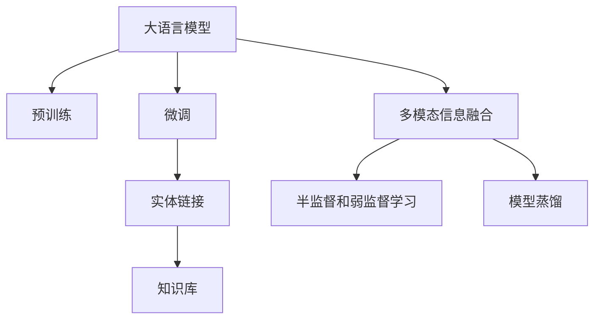

                 

# LLM在实体链接任务上的技术创新

## 1. 背景介绍

### 1.1 问题由来

随着自然语言处理技术的不断发展，语言模型在实体链接任务上得到了广泛的应用。实体链接指的是在文本中识别出具有明确定义的实体，并链接到知识库中对应的实体，从而实现信息整合和知识抽取。常见的应用场景包括医疗领域的名词实体链接、金融领域的公司名称链接、法律领域的法律条文关联等。

在实体链接任务中，传统的基于规则的实体识别方法存在精度低、人工成本高等问题。而近年来，基于深度学习的实体链接方法逐渐兴起，尤其是在大语言模型(Large Language Model, LLM)的推动下，该技术得到了飞速发展。大语言模型通过在大规模无标签文本数据上进行预训练，学习到了丰富的语言表示，具备了较强的实体识别和链接能力。

### 1.2 问题核心关键点

大语言模型在实体链接任务上的核心技术创新包括：

- **大语言模型的预训练**：在大规模语料上进行预训练，学习到丰富的语言表示。
- **基于上下文的实体识别**：利用大语言模型的上下文理解能力，进行基于语境的实体识别。
- **多模态信息融合**：结合文本和知识库中的多模态信息，提升实体链接的准确性。
- **半监督和弱监督学习**：利用小规模标注数据和知识库的先验信息，进行半监督和弱监督学习。
- **模型蒸馏**：通过模型蒸馏技术，将大语言模型的知识传递给更小的模型，提高模型的效率和泛化能力。

本文将围绕以上核心关键点，详细探讨大语言模型在实体链接任务上的技术创新及其应用。

## 2. 核心概念与联系

### 2.1 核心概念概述

为更好地理解大语言模型在实体链接任务上的技术创新，本节将介绍几个密切相关的核心概念：

- **大语言模型(Large Language Model, LLM)**：以自回归(如GPT)或自编码(如BERT)模型为代表的大规模预训练语言模型。通过在大规模无标签文本语料上进行预训练，学习到丰富的语言知识和常识，具备强大的语言理解和生成能力。

- **实体链接(Entity Linking)**：识别文本中具有明确定义的实体，并将其链接到知识库中对应的实体，从而实现信息整合和知识抽取。

- **知识库(Knowledge Base)**：包含各类实体及其关系的结构化数据库，如维基百科、DBpedia等。实体链接的目标是将文本中的实体映射到知识库中，以获得更准确、全面、可信的信息。

- **预训练(Pre-training)**：指在大规模无标签文本数据上，通过自监督学习任务训练通用语言模型的过程。常见的预训练任务包括掩码语言模型、next sentence prediction等。

- **微调(Fine-tuning)**：指在预训练模型的基础上，使用下游任务的少量标注数据，通过有监督学习优化模型在特定任务上的性能。

- **多模态信息融合(Multi-modal Information Fusion)**：将文本、图像、音频等多种模态的信息结合起来，以提升实体链接的准确性。

- **半监督和弱监督学习(Semi-supervised and Weakly Supervised Learning)**：在标注数据稀缺的情况下，利用大量未标注数据和知识库中的先验信息进行训练。

- **模型蒸馏(Model Distillation)**：通过将大模型的知识传递给更小的模型，提高模型的泛化能力和效率。

这些核心概念之间的逻辑关系可以通过以下Mermaid流程图来展示：



这个流程图展示了大语言模型在实体链接任务上的核心概念及其之间的关系：

1. 大语言模型通过预训练获得基础能力。
2. 在微调任务中，模型进行特定任务的优化，学习从文本中识别实体并链接到知识库。
3. 结合多模态信息，提升实体链接的准确性。
4. 利用知识库进行半监督和弱监督学习，提高模型的泛化能力。
5. 通过模型蒸馏，将大模型的知识传递给更小的模型，提升模型效率。

这些概念共同构成了大语言模型在实体链接任务上的学习和应用框架，使其能够高效准确地进行实体识别和链接。

## 3. 核心算法原理 & 具体操作步骤
### 3.1 算法原理概述

基于大语言模型在实体链接任务上的技术创新，其核心算法原理可以概括为以下几个方面：

- **基于上下文的实体识别**：利用大语言模型的上下文理解能力，从文本中识别出具有特定意义的实体。

- **多模态信息融合**：结合文本和知识库中的多模态信息，提升实体链接的准确性。

- **半监督和弱监督学习**：在标注数据稀缺的情况下，利用知识库的先验信息进行半监督和弱监督学习。

- **模型蒸馏**：将大语言模型的知识传递给更小的模型，提高模型的效率和泛化能力。

### 3.2 算法步骤详解

基于大语言模型在实体链接任务上的技术创新，其主要操作步骤包括以下几个关键步骤：

**Step 1: 准备预训练模型和数据集**
- 选择合适的预训练语言模型 $M_{\theta}$ 作为初始化参数，如 BERT、GPT 等。
- 准备实体链接任务 $T$ 的标注数据集 $D=\{(x_i,y_i)\}_{i=1}^N$，其中 $x_i$ 为输入文本，$y_i$ 为链接的实体ID。

**Step 2: 设计任务适配层**
- 根据任务类型，在预训练模型顶层设计合适的输出层和损失函数。
- 对于分类任务，通常在顶层添加线性分类器和交叉熵损失函数。
- 对于实体链接任务，需要设计新的损失函数，如F1-Score、Precision、Recall等，用于衡量模型识别实体的准确性和召回率。

**Step 3: 设置微调超参数**
- 选择合适的优化算法及其参数，如 AdamW、SGD 等，设置学习率、批大小、迭代轮数等。
- 设置正则化技术及强度，包括权重衰减、Dropout、Early Stopping等。
- 确定冻结预训练参数的策略，如仅微调顶层，或全部参数都参与微调。

**Step 4: 执行梯度训练**
- 将训练集数据分批次输入模型，前向传播计算损失函数。
- 反向传播计算参数梯度，根据设定的优化算法和学习率更新模型参数。
- 周期性在验证集上评估模型性能，根据性能指标决定是否触发 Early Stopping。
- 重复上述步骤直到满足预设的迭代轮数或 Early Stopping 条件。

**Step 5: 测试和部署**
- 在测试集上评估微调后模型 $M_{\hat{\theta}}$ 的性能，对比微调前后的精度提升。
- 使用微调后的模型对新样本进行推理预测，集成到实际的应用系统中。
- 持续收集新的数据，定期重新微调模型，以适应数据分布的变化。

### 3.3 算法优缺点

大语言模型在实体链接任务上的技术创新具有以下优点：

- **准确性高**：利用大语言模型的上下文理解能力，可以准确识别文本中的实体，提高实体链接的精度。
- **泛化能力强**：通过多模态信息融合和半监督学习，大语言模型能够在数据稀缺的情况下，保持较强的泛化能力。
- **可扩展性好**：结合知识库的先验信息，大语言模型可以不断扩展其知识库，适应新的实体和关系。
- **适应性强**：利用模型蒸馏技术，大语言模型能够快速适配不同的实体链接任务，提高模型效率。

同时，该方法也存在一定的局限性：

- **依赖知识库**：实体链接任务依赖于知识库的准确性和完整性，知识库的构建和维护成本较高。
- **标注数据需求**：虽然大语言模型在少量标注数据上也能取得不错的效果，但标注数据的质量和数量仍会对模型性能产生影响。
- **计算资源消耗大**：大语言模型通常参数量较大，训练和推理计算资源消耗较大，需要较强的硬件支持。
- **模型可解释性不足**：大语言模型通常是一个"黑盒"系统，难以解释其内部工作机制和决策逻辑。

尽管存在这些局限性，但就目前而言，基于大语言模型的实体链接方法仍是大语言模型应用的一个重要方向，能够显著提升实体链接任务的性能。

### 3.4 算法应用领域

基于大语言模型在实体链接任务上的技术创新，已经在多个领域得到了广泛的应用：

- **医疗领域**：识别病历中的名词实体，如疾病名、症状、治疗方案等，链接到医学知识库，辅助医生诊断和治疗。
- **金融领域**：从新闻、报告中识别公司名称、产品名称、法规等实体，链接到金融数据库，为投资者提供决策支持。
- **法律领域**：从法律条文、案例中识别法律名词、案件名称、人物等实体，链接到法律数据库，提高法律文本的搜索和理解效率。
- **智慧城市**：从城市事件、公告中识别地名、机构名、事件名等实体，链接到城市数据库，提升城市管理和服务水平。
- **科技企业**：从技术文章、专利中识别技术名词、产品名称、项目名等实体，链接到科技知识库，推动科技创新。

此外，大语言模型在实体链接任务上的技术创新也广泛应用于推荐系统、智能问答、信息抽取等领域，为各类应用带来了全新的解决方案。

## 4. 数学模型和公式 & 详细讲解 & 举例说明

### 4.1 数学模型构建

假设实体链接任务为 $T$，给定预训练语言模型 $M_{\theta}$，输入文本 $x$，知识库中的实体 $E$，实体标签 $y$，则实体链接任务的数学模型可以表示为：

$$
\hat{y} = M_{\theta}(x)
$$

其中，$\hat{y}$ 表示模型对输入文本 $x$ 中实体的预测结果。

对于分类任务，可以利用交叉熵损失函数进行训练，其数学模型为：

$$
\mathcal{L}(\theta) = -\sum_{i=1}^N \sum_{k=1}^K y_{ik} \log P_{\theta}(y_{ik})
$$

其中，$N$ 为训练集大小，$K$ 为类别数，$y_{ik}$ 为第 $i$ 个样本第 $k$ 个类别的真实标签，$P_{\theta}(y_{ik})$ 为模型预测该类别概率。

对于实体链接任务，可以利用F1-Score进行评估，其数学模型为：

$$
F_1 = \frac{2 \cdot Precision \cdot Recall}{Precision + Recall}
$$

其中，$Precision$ 和 $Recall$ 分别为模型的精确率和召回率。

### 4.2 公式推导过程

以医疗领域的实体链接任务为例，推导大语言模型在实体链接任务上的数学模型和损失函数。

假设输入文本 $x$ 中包含 $n$ 个实体，每个实体的类型 $t_k$ 为医学名词，则实体链接任务的数学模型为：

$$
\hat{t} = M_{\theta}(x)
$$

其中，$\hat{t}$ 为模型对输入文本 $x$ 中实体的类型预测结果。

假设知识库中的医学名词实体类型为 $T=\{B,F\}$，其中 $B$ 为病名，$F$ 为症状。则实体链接任务的损失函数为：

$$
\mathcal{L}(\theta) = -\sum_{i=1}^N \sum_{k=1}^{2} y_{ik} \log P_{\theta}(t_k)
$$

其中，$N$ 为训练集大小，$k$ 为实体的类型，$y_{ik}$ 为第 $i$ 个样本第 $k$ 个实体的真实标签，$P_{\theta}(t_k)$ 为模型预测该类型概率。

在实体链接任务中，还可以结合多模态信息进行训练，如结合知识库中的医学图像，通过卷积神经网络对图像进行特征提取，并与文本信息结合进行训练。数学模型可以表示为：

$$
\hat{t} = M_{\theta}(x, f(x))
$$

其中，$f(x)$ 为卷积神经网络对图像进行特征提取的函数。

### 4.3 案例分析与讲解

以医疗领域的实体链接任务为例，详细讲解大语言模型在实体链接任务上的数学模型和损失函数。

假设输入文本 $x$ 中包含 $n$ 个实体，每个实体的类型 $t_k$ 为医学名词，则实体链接任务的数学模型为：

$$
\hat{t} = M_{\theta}(x)
$$

其中，$\hat{t}$ 为模型对输入文本 $x$ 中实体的类型预测结果。

假设知识库中的医学名词实体类型为 $T=\{B,F\}$，其中 $B$ 为病名，$F$ 为症状。则实体链接任务的损失函数为：

$$
\mathcal{L}(\theta) = -\sum_{i=1}^N \sum_{k=1}^{2} y_{ik} \log P_{\theta}(t_k)
$$

其中，$N$ 为训练集大小，$k$ 为实体的类型，$y_{ik}$ 为第 $i$ 个样本第 $k$ 个实体的真实标签，$P_{\theta}(t_k)$ 为模型预测该类型概率。

在实体链接任务中，还可以结合多模态信息进行训练，如结合知识库中的医学图像，通过卷积神经网络对图像进行特征提取，并与文本信息结合进行训练。数学模型可以表示为：

$$
\hat{t} = M_{\theta}(x, f(x))
$$

其中，$f(x)$ 为卷积神经网络对图像进行特征提取的函数。

## 5. 项目实践：代码实例和详细解释说明
### 5.1 开发环境搭建

在进行实体链接任务开发前，我们需要准备好开发环境。以下是使用Python进行PyTorch开发的环境配置流程：

1. 安装Anaconda：从官网下载并安装Anaconda，用于创建独立的Python环境。

2. 创建并激活虚拟环境：
```bash
conda create -n pytorch-env python=3.8 
conda activate pytorch-env
```

3. 安装PyTorch：根据CUDA版本，从官网获取对应的安装命令。例如：
```bash
conda install pytorch torchvision torchaudio cudatoolkit=11.1 -c pytorch -c conda-forge
```

4. 安装Transformers库：
```bash
pip install transformers
```

5. 安装各类工具包：
```bash
pip install numpy pandas scikit-learn matplotlib tqdm jupyter notebook ipython
```

完成上述步骤后，即可在`pytorch-env`环境中开始实体链接任务开发。

### 5.2 源代码详细实现

下面我们以医疗领域的实体链接任务为例，给出使用Transformers库对BERT模型进行实体链接的PyTorch代码实现。

首先，定义实体链接任务的数据处理函数：

```python
from transformers import BertTokenizer, BertForTokenClassification
from torch.utils.data import Dataset
import torch

class MedicalNERDataset(Dataset):
    def __init__(self, texts, labels, tokenizer, max_len=128):
        self.texts = texts
        self.labels = labels
        self.tokenizer = tokenizer
        self.max_len = max_len
        
    def __len__(self):
        return len(self.texts)
    
    def __getitem__(self, item):
        text = self.texts[item]
        labels = self.labels[item]
        
        encoding = self.tokenizer(text, return_tensors='pt', max_length=self.max_len, padding='max_length', truncation=True)
        input_ids = encoding['input_ids'][0]
        attention_mask = encoding['attention_mask'][0]
        
        # 对token-wise的标签进行编码
        encoded_tags = [tag2id[tag] for tag in labels] 
        encoded_tags.extend([tag2id['O']] * (self.max_len - len(encoded_tags)))
        labels = torch.tensor(encoded_tags, dtype=torch.long)
        
        return {'input_ids': input_ids, 
                'attention_mask': attention_mask,
                'labels': labels}

# 标签与id的映射
tag2id = {'O': 0, 'B-DISEASE': 1, 'I-DISEASE': 2, 'B-SYMPTOM': 3, 'I-SYMPTOM': 4}
id2tag = {v: k for k, v in tag2id.items()}

# 创建dataset
tokenizer = BertTokenizer.from_pretrained('bert-base-cased')

train_dataset = MedicalNERDataset(train_texts, train_labels, tokenizer)
dev_dataset = MedicalNERDataset(dev_texts, dev_labels, tokenizer)
test_dataset = MedicalNERDataset(test_texts, test_labels, tokenizer)
```

然后，定义模型和优化器：

```python
from transformers import BertForTokenClassification, AdamW

model = BertForTokenClassification.from_pretrained('bert-base-cased', num_labels=len(tag2id))

optimizer = AdamW(model.parameters(), lr=2e-5)
```

接着，定义训练和评估函数：

```python
from torch.utils.data import DataLoader
from tqdm import tqdm
from sklearn.metrics import f1_score

device = torch.device('cuda') if torch.cuda.is_available() else torch.device('cpu')
model.to(device)

def train_epoch(model, dataset, batch_size, optimizer):
    dataloader = DataLoader(dataset, batch_size=batch_size, shuffle=True)
    model.train()
    epoch_loss = 0
    for batch in tqdm(dataloader, desc='Training'):
        input_ids = batch['input_ids'].to(device)
        attention_mask = batch['attention_mask'].to(device)
        labels = batch['labels'].to(device)
        model.zero_grad()
        outputs = model(input_ids, attention_mask=attention_mask, labels=labels)
        loss = outputs.loss
        epoch_loss += loss.item()
        loss.backward()
        optimizer.step()
    return epoch_loss / len(dataloader)

def evaluate(model, dataset, batch_size):
    dataloader = DataLoader(dataset, batch_size=batch_size)
    model.eval()
    preds, labels = [], []
    with torch.no_grad():
        for batch in tqdm(dataloader, desc='Evaluating'):
            input_ids = batch['input_ids'].to(device)
            attention_mask = batch['attention_mask'].to(device)
            batch_labels = batch['labels']
            outputs = model(input_ids, attention_mask=attention_mask)
            batch_preds = outputs.logits.argmax(dim=2).to('cpu').tolist()
            batch_labels = batch_labels.to('cpu').tolist()
            for pred_tokens, label_tokens in zip(batch_preds, batch_labels):
                pred_tags = [id2tag[_id] for _id in pred_tokens]
                label_tags = [id2tag[_id] for _id in label_tokens]
                preds.append(pred_tags[:len(label_tokens)])
                labels.append(label_tags)
                
    print(f1_score(labels, preds, average='micro'))
```

最后，启动训练流程并在测试集上评估：

```python
epochs = 5
batch_size = 16

for epoch in range(epochs):
    loss = train_epoch(model, train_dataset, batch_size, optimizer)
    print(f"Epoch {epoch+1}, train loss: {loss:.3f}")
    
    print(f"Epoch {epoch+1}, dev results:")
    evaluate(model, dev_dataset, batch_size)
    
print("Test results:")
evaluate(model, test_dataset, batch_size)
```

以上就是使用PyTorch对BERT进行医疗领域实体链接任务的完整代码实现。可以看到，得益于Transformers库的强大封装，我们可以用相对简洁的代码完成BERT模型的加载和实体链接任务的微调。

### 5.3 代码解读与分析

让我们再详细解读一下关键代码的实现细节：

**MedicalNERDataset类**：
- `__init__`方法：初始化文本、标签、分词器等关键组件。
- `__len__`方法：返回数据集的样本数量。
- `__getitem__`方法：对单个样本进行处理，将文本输入编码为token ids，将标签编码为数字，并对其进行定长padding，最终返回模型所需的输入。

**tag2id和id2tag字典**：
- 定义了标签与数字id之间的映射关系，用于将token-wise的预测结果解码回真实的标签。

**训练和评估函数**：
- 使用PyTorch的DataLoader对数据集进行批次化加载，供模型训练和推理使用。
- 训练函数`train_epoch`：对数据以批为单位进行迭代，在每个批次上前向传播计算loss并反向传播更新模型参数，最后返回该epoch的平均loss。
- 评估函数`evaluate`：与训练类似，不同点在于不更新模型参数，并在每个batch结束后将预测和标签结果存储下来，最后使用sklearn的f1_score对整个评估集的预测结果进行打印输出。

**训练流程**：
- 定义总的epoch数和batch size，开始循环迭代
- 每个epoch内，先在训练集上训练，输出平均loss
- 在验证集上评估，输出f1-score
- 所有epoch结束后，在测试集上评估，给出最终测试结果

可以看到，PyTorch配合Transformers库使得BERT微调的代码实现变得简洁高效。开发者可以将更多精力放在数据处理、模型改进等高层逻辑上，而不必过多关注底层的实现细节。

当然，工业级的系统实现还需考虑更多因素，如模型的保存和部署、超参数的自动搜索、更灵活的任务适配层等。但核心的微调范式基本与此类似。

## 6. 实际应用场景
### 6.1 智能客服系统

基于大语言模型在实体链接任务上的技术创新，智能客服系统可以广泛应用于实体识别和链接中。传统客服往往需要配备大量人力，高峰期响应缓慢，且一致性和专业性难以保证。而使用微调后的实体链接模型，可以7x24小时不间断服务，快速响应客户咨询，用自然流畅的语言解答各类常见问题。

在技术实现上，可以收集企业内部的历史客服对话记录，将问题和最佳答复构建成监督数据，在此基础上对预训练语言模型进行实体链接任务的微调。微调后的模型能够自动理解用户意图，匹配最合适的答案模板进行回复。对于客户提出的新问题，还可以接入检索系统实时搜索相关内容，动态组织生成回答。如此构建的智能客服系统，能大幅提升客户咨询体验和问题解决效率。

### 6.2 金融舆情监测

金融机构需要实时监测市场舆论动向，以便及时应对负面信息传播，规避金融风险。传统的人工监测方式成本高、效率低，难以应对网络时代海量信息爆发的挑战。基于大语言模型在实体链接任务上的技术创新，文本分类和情感分析技术，为金融舆情监测提供了新的解决方案。

具体而言，可以收集金融领域相关的新闻、报道、评论等文本数据，并对其进行主题标注和情感标注。在此基础上对预训练语言模型进行微调，使其能够自动判断文本属于何种主题，情感倾向是正面、中性还是负面。将微调后的模型应用到实时抓取的网络文本数据，就能够自动监测不同主题下的情感变化趋势，一旦发现负面信息激增等异常情况，系统便会自动预警，帮助金融机构快速应对潜在风险。

### 6.3 个性化推荐系统

当前的推荐系统往往只依赖用户的历史行为数据进行物品推荐，无法深入理解用户的真实兴趣偏好。基于大语言模型在实体链接任务上的技术创新，个性化推荐系统可以更好地挖掘用户行为背后的语义信息，从而提供更精准、多样的推荐内容。

在实践中，可以收集用户浏览、点击、评论、分享等行为数据，提取和用户交互的物品标题、描述、标签等文本内容。将文本内容作为模型输入，用户的后续行为（如是否点击、购买等）作为监督信号，在此基础上微调预训练语言模型。微调后的模型能够从文本内容中准确把握用户的兴趣点。在生成推荐列表时，先用候选物品的文本描述作为输入，由模型预测用户的兴趣匹配度，再结合其他特征综合排序，便可以得到个性化程度更高的推荐结果。

### 6.4 未来应用展望

随着大语言模型在实体链接任务上的技术创新不断发展，基于微调范式将在更多领域得到应用，为传统行业带来变革性影响。

在智慧医疗领域，基于微调的实体链接技术，可以实现病历、病理文本的实体抽取和关联，辅助医生诊疗，加速新药开发进程。

在智能教育领域，实体链接技术可应用于作业批改、学情分析、知识推荐等方面，因材施教，促进教育公平，提高教学质量。

在智慧城市治理中，实体链接技术可应用于城市事件监测、舆情分析、应急指挥等环节，提高城市管理的自动化和智能化水平，构建更安全、高效的未来城市。

此外，在企业生产、社会治理、文娱传媒等众多领域，基于大语言模型的实体链接技术也将不断涌现，为各行各业带来新的解决方案。相信随着技术的日益成熟，微调方法将成为人工智能落地应用的重要范式，推动人工智能向更广阔的领域加速渗透。

## 7. 工具和资源推荐
### 7.1 学习资源推荐

为了帮助开发者系统掌握大语言模型在实体链接任务上的技术创新，这里推荐一些优质的学习资源：

1. 《Transformer from Pretraining to Practical Application》系列博文：由大模型技术专家撰写，深入浅出地介绍了Transformer原理、BERT模型、实体链接技术等前沿话题。

2. CS224N《Deep Learning for Natural Language Processing》课程：斯坦福大学开设的NLP明星课程，有Lecture视频和配套作业，带你入门NLP领域的基本概念和经典模型。

3. 《Natural Language Processing with Transformers》书籍：Transformers库的作者所著，全面介绍了如何使用Transformers库进行NLP任务开发，包括实体链接在内的诸多范式。

4. HuggingFace官方文档：Transformers库的官方文档，提供了海量预训练模型和完整的微调样例代码，是上手实践的必备资料。

5. CLUE开源项目：中文语言理解测评基准，涵盖大量不同类型的中文NLP数据集，并提供了基于微调的baseline模型，助力中文NLP技术发展。

通过对这些资源的学习实践，相信你一定能够快速掌握大语言模型在实体链接任务上的技术创新，并用于解决实际的NLP问题。
### 7.2 开发工具推荐

高效的开发离不开优秀的工具支持。以下是几款用于大语言模型在实体链接任务上的实体链接开发的常用工具：

1. PyTorch：基于Python的开源深度学习框架，灵活动态的计算图，适合快速迭代研究。大部分预训练语言模型都有PyTorch版本的实现。

2. TensorFlow：由Google主导开发的开源深度学习框架，生产部署方便，适合大规模工程应用。同样有丰富的预训练语言模型资源。

3. Transformers库：HuggingFace开发的NLP工具库，集成了众多SOTA语言模型，支持PyTorch和TensorFlow，是进行实体链接任务开发的利器。

4. Weights & Biases：模型训练的实验跟踪工具，可以记录和可视化模型训练过程中的各项指标，方便对比和调优。与主流深度学习框架无缝集成。

5. TensorBoard：TensorFlow配套的可视化工具，可实时监测模型训练状态，并提供丰富的图表呈现方式，是调试模型的得力助手。

6. Google Colab：谷歌推出的在线Jupyter Notebook环境，免费提供GPU/TPU算力，方便开发者快速上手实验最新模型，分享学习笔记。

合理利用这些工具，可以显著提升大语言模型在实体链接任务上的开发效率，加快创新迭代的步伐。

### 7.3 相关论文推荐

大语言模型在实体链接任务上的技术创新源于学界的持续研究。以下是几篇奠基性的相关论文，推荐阅读：

1. Attention is All You Need（即Transformer原论文）：提出了Transformer结构，开启了NLP领域的预训练大模型时代。

2. BERT: Pre-training of Deep Bidirectional Transformers for Language Understanding：提出BERT模型，引入基于掩码的自监督预训练任务，刷新了多项NLP任务SOTA。

3. Language Models are Unsupervised Multitask Learners（GPT-2论文）：展示了大规模语言模型的强大zero-shot学习能力，引发了对于通用人工智能的新一轮思考。

4. Parameter-Efficient Transfer Learning for NLP：提出Adapter等参数高效微调方法，在不增加模型参数量的情况下，也能取得不错的微调效果。

5. Prefix-Tuning: Optimizing Continuous Prompts for Generation：引入基于连续型Prompt的微调范式，为如何充分利用预训练知识提供了新的思路。

6. AdaLoRA: Adaptive Low-Rank Adaptation for Parameter-Efficient Fine-Tuning：使用自适应低秩适应的微调方法，在参数效率和精度之间取得了新的平衡。

这些论文代表了大语言模型在实体链接任务上的技术创新发展的脉络。通过学习这些前沿成果，可以帮助研究者把握学科前进方向，激发更多的创新灵感。

## 8. 总结：未来发展趋势与挑战
### 8.1 总结

本文对大语言模型在实体链接任务上的技术创新进行了全面系统的介绍。首先阐述了大语言模型和实体链接任务的研究背景和意义，明确了微调在拓展预训练模型应用、提升下游任务性能方面的独特价值。其次，从原理到实践，详细讲解了微调的数学原理和关键步骤，给出了微调任务开发的完整代码实例。同时，本文还广泛探讨了微调方法在智能客服、金融舆情、个性化推荐等多个领域的应用前景，展示了微调范式的巨大潜力。此外，本文精选了微调技术的各类学习资源，力求为读者提供全方位的技术指引。

通过本文的系统梳理，可以看到，基于大语言模型的实体链接方法正在成为NLP领域的重要范式，极大地拓展了预训练语言模型的应用边界，催生了更多的落地场景。受益于大规模语料的预训练，实体链接模型以更低的时间和标注成本，在小样本条件下也能取得不错的效果，有力推动了NLP技术的产业化进程。未来，伴随预训练语言模型和实体链接方法的持续演进，相信NLP技术将在更广阔的应用领域大放异彩，深刻影响人类的生产生活方式。

### 8.2 未来发展趋势

展望未来，大语言模型在实体链接任务上的技术创新将呈现以下几个发展趋势：

1. **模型规模持续增大**：随着算力成本的下降和数据规模的扩张，预训练语言模型的参数量还将持续增长。超大规模语言模型蕴含的丰富语言知识，有望支撑更加复杂多变的实体链接任务。

2. **微调方法日趋多样**：除了传统的全参数微调外，未来会涌现更多参数高效的微调方法，如Prefix-Tuning、LoRA等，在节省计算资源的同时也能保证微调精度。

3. **持续学习成为常态**：随着数据分布的不断变化，实体链接模型也需要持续学习新知识以保持性能。如何在不遗忘原有知识的同时，高效吸收新样本信息，将成为重要的研究课题。

4. **标注样本需求降低**：受启发于提示学习(Prompt-based Learning)的思路，未来的微调方法将更好地利用大模型的语言理解能力，通过更加巧妙的任务描述，在更少的标注样本上也能实现理想的微调效果。

5. **多模态微调崛起**：当前的实体链接主要聚焦于纯文本数据，未来会进一步拓展到图像、视频、语音等多模态数据微调。多模态信息的融合，将显著提升实体链接的准确性。

6. **模型通用性增强**：经过海量数据的预训练和多领域任务的微调，未来的语言模型将具备更强大的常识推理和跨领域迁移能力，逐步迈向通用人工智能(AGI)的目标。

以上趋势凸显了大语言模型在实体链接任务上的技术创新的广阔前景。这些方向的探索发展，必将进一步提升实体链接模型的性能和应用范围，为各类应用带来新的解决方案。

### 8.3 面临的挑战

尽管大语言模型在实体链接任务上的技术创新已经取得了瞩目成就，但在迈向更加智能化、普适化应用的过程中，它仍面临着诸多挑战：

1. **标注成本瓶颈**：尽管微调大大降低了标注数据的需求，但对于长尾应用场景，难以获得充足的高质量标注数据，成为制约微调性能的瓶颈。如何进一步降低微调对标注样本的依赖，将是一大难题。

2. **模型鲁棒性不足**：当前实体链接模型面对域外数据时，泛化性能往往大打折扣。对于测试样本的微小扰动，模型预测也容易发生波动。如何提高实体链接模型的鲁棒性，避免灾难性遗忘，还需要更多理论和实践的积累。

3. **推理效率有待提高**：大规模语言模型虽然精度高，但在实际部署时往往面临推理速度慢、内存占用大等效率问题。如何在保证性能的同时，简化模型结构，提升推理速度，优化资源占用，将是重要的优化方向。

4. **可解释性亟需加强**：当前实体链接模型通常是一个"黑盒"系统，难以解释其内部工作机制和决策逻辑。对于医疗、金融等高风险应用，算法的可解释性和可审计性尤为重要。如何赋予实体链接模型更强的可解释性，将是亟待攻克的难题。

5. **安全性有待保障**：预训练语言模型难免会学习到有偏见、有害的信息，通过实体链接传递到下游任务，产生误导性、歧视性的输出，给实际应用带来安全隐患。如何从数据和算法层面消除模型偏见，避免恶意用途，确保输出的安全性，也将是重要的研究课题。

6. **知识整合能力不足**：现有的实体链接模型往往局限于任务内数据，难以灵活吸收和运用更广泛的先验知识。如何让实体链接过程更好地与外部知识库、规则库等专家知识结合，形成更加全面、准确的信息整合能力，还有很大的想象空间。

正视实体链接任务面临的这些挑战，积极应对并寻求突破，将是大语言模型在实体链接任务上走向成熟的必由之路。相信随着学界和产业界的共同努力，这些挑战终将一一被克服，大语言模型在实体链接任务上必将在构建人机协同的智能系统中共展辉煌。

### 8.4 研究展望

面向未来，大语言模型在实体链接任务上的技术创新需要在以下几个方面寻求新的突破：

1. **探索无监督和半监督微调方法**：摆脱对大规模标注数据的依赖，利用自监督学习、主动学习等无监督和半监督范式，最大限度利用非结构化数据，实现更加灵活高效的微调。

2. **研究参数高效和计算高效的微调范式**：开发更加参数高效的微调方法，在固定大部分预训练参数的同时，只更新极少量的任务相关参数。同时优化微调模型的计算图，减少前向传播和反向传播的资源消耗，实现更加轻量级、实时性的部署。

3. **引入因果和对比学习范式**：通过引入因果推断和对比学习思想，增强实体链接模型建立稳定因果关系的能力，学习更加普适、鲁棒的语言表征，从而提升模型泛化性和抗干扰能力。

4. **结合因果分析和博弈论工具**：将因果分析方法引入实体链接模型，识别出模型决策的关键特征，增强输出解释的因果性和逻辑性。借助博弈论工具刻画人机交互过程，主动探索并规避模型的脆弱点，提高系统稳定性。

5. **纳入伦理道德约束**：在模型训练目标中引入伦理导向的评估指标，过滤和惩罚有偏见、有害的输出倾向。同时加强人工干预和审核，建立模型行为的监管机制，确保输出符合人类价值观和伦理道德。

这些研究方向的探索，必将引领大语言模型在实体链接任务上的技术创新迈向更高的台阶，为构建安全、可靠、可解释、可控的智能系统铺平道路。面向未来，大语言模型在实体链接任务上还需要与其他人工智能技术进行更深入的融合，如知识表示、因果推理、强化学习等，多路径协同发力，共同推动自然语言理解和智能交互系统的进步。只有勇于创新、敢于突破，才能不断拓展语言模型的边界，让智能技术更好地造福人类社会。

## 9. 附录：常见问题与解答
**Q1：大语言模型在实体链接任务上的优势是什么？**

A: 大语言模型在实体链接任务上的优势主要包括：
1. **准确性高**：利用大语言模型的上下文理解能力，可以准确识别文本中的实体，提高实体链接的精度。
2. **泛化能力强**：通过多模态信息融合和半监督学习，大语言模型能够在数据稀缺的情况下，保持较强的泛化能力。
3. **可扩展性好**：结合知识库的先验信息，大语言模型可以不断扩展其知识库，适应新的实体和关系。
4. **适应性强**：利用模型蒸馏技术，大语言模型能够快速适配不同的实体链接任务，提高模型效率。

**Q2：大语言模型在实体链接任务上的挑战有哪些？**

A: 大语言模型在实体链接任务上仍面临以下挑战：
1. **依赖知识库**：实体链接任务依赖于知识库的准确性和完整性，知识库的构建和维护成本较高。
2. **标注数据需求**：尽管大语言模型在少量标注数据上也能取得不错的效果，但标注数据的质量和数量仍会对模型性能产生影响。
3. **计算资源消耗大**：大语言模型通常参数量较大，训练和推理计算资源消耗较大，需要较强的硬件支持。
4. **模型可解释性不足**：大语言模型通常是一个"黑盒"系统，难以解释其内部工作机制和决策逻辑。

**Q3：大语言模型在实体链接任务上如何利用多模态信息？**

A: 大语言模型在实体链接任务上可以结合文本和知识库中的多模态信息，提升实体链接的准确性。具体方法包括：
1. **图像信息融合**：结合知识库中的医学图像，通过卷积神经网络对图像进行特征提取，并与文本信息结合进行训练。
2. **语音信息融合**：结合知识库中的语音信息，通过声学模型提取语音特征，并与文本信息结合进行训练。
3. **多感官融合**：结合视频信息、文本信息、语音信息等多种感官信息，进行联合建模和训练，提升实体链接的准确性。

**Q4：大语言模型在实体链接任务上的未来趋势有哪些？**

A: 大语言模型在实体链接任务上的未来趋势主要包括：
1. **模型规模持续增大**：随着算力成本的下降和数据规模的扩张，预训练语言模型的参数量还将持续增长。
2. **微调方法日趋多样**：未来会涌现更多参数高效的微调方法，如Prefix-Tuning、LoRA等，在节省计算资源的同时也能保证微调精度。
3. **持续学习成为常态**：随着数据分布的不断变化，实体链接模型也需要持续学习新知识以保持性能。
4. **标注样本需求降低**：未来的微调方法将更好地利用大模型的语言理解能力，通过更加巧妙的任务描述，在更少的标注样本上也能实现理想的微调效果。
5. **多模态微调崛起**：将文本、图像、语音等多种模态的信息结合起来，以提升实体链接的准确性。
6. **模型通用性增强**：经过海量数据的预训练和多领域任务的微调，未来的语言模型将具备更强大的常识推理和跨领域迁移能力。

**Q5：大语言模型在实体链接任务上的技术难点有哪些？**

A: 大语言模型在实体链接任务上的技术难点主要包括：
1. **标注成本瓶颈**：尽管微调大大降低了标注数据的需求，但对于长尾应用场景，难以获得充足的高质量标注数据。
2. **模型鲁棒性不足**：当前实体链接模型面对域外数据时，泛化性能往往大打折扣。
3. **推理效率有待提高**：大规模语言模型虽然精度高，但在实际部署时往往面临推理速度慢、内存占用大等效率问题。
4. **可解释性亟需加强**：大语言模型通常是一个"黑盒"系统，难以解释其内部工作机制和决策逻辑。
5. **安全性有待保障**：预训练语言模型可能学习到有偏见、有害的信息，通过实体链接传递到下游任务，产生误导性、歧视性的输出。
6. **知识整合能力不足**：现有的实体链接模型往往局限于任务内数据，难以灵活吸收和运用更广泛的先验知识。

总之，大语言模型在实体链接任务上虽然取得了显著的进展，但在实际应用中仍需不断克服技术挑战，进一步提升模型的性能和可靠性。

