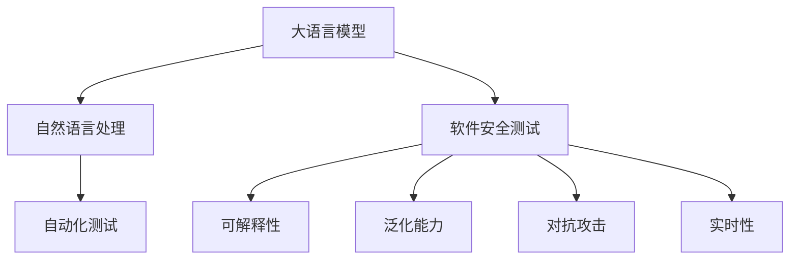

                 

# LLM对传统软件安全测试的挑战与改进

> 关键词：大语言模型,自然语言处理,软件安全,测试,自动化,可解释性,跨领域

## 1. 背景介绍

### 1.1 问题由来
在过去的几十年里，软件安全测试一直是保障软件产品质量的重要手段。传统的软件安全测试方法包括静态测试、动态测试和混合测试，涵盖了漏洞扫描、代码审计、渗透测试等多种形式。这些方法虽然有效地发现和修复了大量的软件漏洞，但依然面临着成本高、效率低、覆盖面有限等诸多挑战。

随着人工智能技术的不断发展，尤其是大语言模型(Large Language Model, LLM)的出现，为软件安全测试带来了新的可能性。基于自然语言处理(Natural Language Processing, NLP)的大语言模型，能够通过理解和生成自然语言，实现更加高效、全面的安全测试。然而，大语言模型在应用于软件安全测试时，也面临着诸多新的挑战和问题。本文将系统地探讨大语言模型在软件安全测试中的应用，以及其面临的挑战和改进方法。

### 1.2 问题核心关键点
大语言模型在软件安全测试中的应用，主要涉及以下几个核心关键点：

- **可解释性**：大语言模型在做出预测和决策时，通常缺乏可解释性，导致测试结果难以被理解和验证。
- **泛化能力**：大语言模型在特定领域或数据集上训练后，可能难以泛化到其他领域或数据集，影响测试效果。
- **数据需求**：大语言模型的训练和微调需要大量高质量的标注数据，这对软件安全测试而言是一大挑战。
- **对抗攻击**：在对抗样本中，大语言模型可能产生误判，影响测试结果的准确性。
- **实时性**：大语言模型的推理过程通常较为耗时，难以满足实时性的要求。

这些关键点共同构成了大语言模型在软件安全测试中的应用框架，对其效果和可靠性产生了深远影响。

### 1.3 问题研究意义
研究大语言模型在软件安全测试中的应用，对于提升测试效率、覆盖面以及安全性具有重要意义：

1. **提高测试效率**：大语言模型能够自动化地生成测试用例和测试报告，大幅降低人工工作量，提高测试效率。
2. **增强测试覆盖面**：大语言模型能够自动地生成和分析测试用例，涵盖更多测试场景，提高测试覆盖面。
3. **提升测试安全性**：通过分析语言模型在各种场景下的表现，识别潜在的安全漏洞和风险，提高软件安全性。
4. **推动技术创新**：研究大语言模型在软件安全测试中的应用，可以推动新的测试技术和方法的开发。

## 2. 核心概念与联系

### 2.1 核心概念概述

为更好地理解大语言模型在软件安全测试中的应用，本节将介绍几个密切相关的核心概念：

- **大语言模型(LLM)**：以自回归(如GPT)或自编码(如BERT)模型为代表的大规模预训练语言模型。通过在大规模无标签文本语料上进行预训练，学习通用的语言表示，具备强大的语言理解和生成能力。

- **自然语言处理(NLP)**：涉及计算机处理和理解人类语言的技术，包括语言模型、分词、句法分析、语义分析等多个方向。

- **软件安全测试**：评估和验证软件系统安全性的一种手段，涵盖漏洞扫描、代码审计、渗透测试等多种形式。

- **自动化测试**：通过自动化工具和脚本，代替人工进行软件测试的过程。

- **可解释性(Explainability)**：指模型输出的可解释性，即解释模型做出特定预测或决策的依据和过程。

- **泛化能力(Generalization)**：指模型在不同数据集和场景上的表现能力，即模型的泛化性能。

- **对抗攻击(Adversarial Attacks)**：指针对模型的攻击行为，通过特定输入或噪声干扰模型输出，达到特定目的。

- **实时性(Real-time)**：指模型推理过程的响应速度，即模型能够在规定时间内输出结果。

这些核心概念之间的逻辑关系可以通过以下Mermaid流程图来展示：



这个流程图展示了大语言模型、自然语言处理、软件安全测试等概念之间的联系：

1. 大语言模型通过自然语言处理技术，提升软件安全测试的自动化和智能化水平。
2. 自动化测试通过大语言模型的自动化生成，提高测试效率和覆盖面。
3. 可解释性、泛化能力、对抗攻击和实时性是影响大语言模型在软件安全测试中应用效果的重要因素。

## 3. 核心算法原理 & 具体操作步骤
### 3.1 算法原理概述

基于大语言模型的软件安全测试，主要利用大语言模型在理解和生成自然语言方面的能力，通过自然语言描述测试场景，自动化生成测试用例和报告，从而提高测试效率和覆盖面。

具体而言，测试场景通常由软件系统的功能描述、可能的安全漏洞和攻击场景等组成。大语言模型通过阅读这些自然语言描述，生成相应的测试用例和测试报告，供测试人员或自动化的测试工具进行验证。

### 3.2 算法步骤详解

基于大语言模型的软件安全测试一般包括以下几个关键步骤：

**Step 1: 准备测试场景描述**
- 收集软件系统的详细功能和漏洞描述，以及可能的攻击场景。
- 将这些描述转换为自然语言文本，供大语言模型理解。

**Step 2: 选择和训练大语言模型**
- 根据任务需求选择合适的预训练语言模型，如BERT、GPT等。
- 使用标注数据对模型进行微调，提升其在特定领域的泛化能力。

**Step 3: 生成测试用例和报告**
- 将测试场景描述输入大语言模型，生成测试用例和报告。
- 测试用例包括输入参数、预期输出、预期的安全漏洞或攻击场景等。
- 测试报告包括用例生成过程、测试结果、分析结论等。

**Step 4: 执行测试用例**
- 将生成的测试用例输入软件系统进行执行，收集输出结果。
- 分析测试结果，判断是否满足预期的安全要求。

**Step 5: 迭代优化**
- 根据测试结果，对测试场景描述和大语言模型进行迭代优化。
- 使用反馈数据对模型进行重新微调，提升其性能和泛化能力。

### 3.3 算法优缺点

基于大语言模型的软件安全测试方法具有以下优点：

1. **自动化程度高**：大语言模型能够自动生成测试用例和报告，减少人工工作量，提高测试效率。
2. **覆盖面广**：通过自然语言描述，大语言模型能够生成多种测试用例，覆盖更多测试场景，提高测试覆盖面。
3. **可解释性好**：测试场景和测试用例都是自然语言描述，易于理解和验证。

同时，该方法也存在一定的局限性：

1. **泛化能力有限**：大语言模型在特定领域或数据集上训练后，可能难以泛化到其他领域或数据集，影响测试效果。
2. **数据需求高**：大语言模型的训练和微调需要大量高质量的标注数据，这对软件安全测试而言是一大挑战。
3. **对抗攻击脆弱**：在对抗样本中，大语言模型可能产生误判，影响测试结果的准确性。
4. **实时性差**：大语言模型的推理过程通常较为耗时，难以满足实时性的要求。

尽管存在这些局限性，但就目前而言，基于大语言模型的软件安全测试方法仍是大规模自动化测试的重要手段。未来相关研究的重点在于如何进一步降低对标注数据的依赖，提高模型的泛化能力和鲁棒性，同时兼顾可解释性和实时性等因素。

### 3.4 算法应用领域

基于大语言模型的软件安全测试方法，已经在漏洞扫描、代码审计、渗透测试等多个领域得到了广泛应用。例如：

- **漏洞扫描**：使用大语言模型生成自动化扫描脚本，识别软件系统中存在的安全漏洞。
- **代码审计**：将代码片段输入大语言模型，自动生成代码审计报告，识别潜在的安全问题。
- **渗透测试**：通过自然语言描述攻击场景，自动生成渗透测试用例，模拟攻击行为。

除了上述这些经典应用外，大语言模型在软件安全测试中的应用还在不断拓展，如安全漏洞分析、安全需求编写、安全文档生成等，为软件安全保障提供了新的技术手段。

## 4. 数学模型和公式 & 详细讲解  
### 4.1 数学模型构建

本节将使用数学语言对基于大语言模型的软件安全测试过程进行更加严格的刻画。

假设测试场景描述为 $S$，预训练语言模型为 $M_{\theta}$，其中 $\theta$ 为模型参数。目标是通过大语言模型生成测试用例 $U$ 和测试报告 $R$，对软件系统进行安全测试。

大语言模型 $M_{\theta}$ 在测试场景描述 $S$ 上的输出为 $U$，即：

$$
U = M_{\theta}(S)
$$

其中 $U$ 包含多个测试用例，每个用例由输入参数 $x$ 和预期输出 $y$ 组成。

测试报告 $R$ 包含对测试用例的分析结果，形式化地表示为：

$$
R = \text{Analyze}(U, M_{\theta})
$$

其中 $\text{Analyze}$ 为测试分析函数，用于对测试用例进行验证和分析。

### 4.2 公式推导过程

以下我们以漏洞扫描为例，推导基于大语言模型的测试用例生成过程。

假设测试场景描述为 $S = \{D_1, D_2, \ldots, D_n\}$，其中 $D_i$ 表示第 $i$ 个测试用例的描述，形式化地表示为：

$$
D_i = \{X_i, Y_i\}
$$

其中 $X_i$ 表示输入参数，$Y_i$ 表示预期输出。

测试用例 $U$ 的形式化表示为：

$$
U = \{(U_{i,j}, U_{i,k})\}_{i,j,k}
$$

其中 $U_{i,j}$ 表示第 $i$ 个测试用例的第 $j$ 个输入参数，$U_{i,k}$ 表示第 $i$ 个测试用例的第 $k$ 个预期输出。

测试报告 $R$ 的形式化表示为：

$$
R = \{R_{i,j}\}_{i,j}
$$

其中 $R_{i,j}$ 表示第 $i$ 个测试用例的第 $j$ 个分析结果，形式化地表示为：

$$
R_{i,j} = \text{Analyze}(U_{i,j}, M_{\theta})
$$

测试报告的生成过程如下：

1. 将测试用例 $U$ 输入大语言模型 $M_{\theta}$，生成分析结果 $R$。
2. 对分析结果 $R$ 进行验证，判断是否满足预期的安全要求。
3. 根据测试结果，生成最终的测试报告 $R$。

通过上述过程，大语言模型实现了对软件系统的自动化安全测试，提高了测试效率和覆盖面。

### 4.3 案例分析与讲解

下面以代码审计为例，具体分析大语言模型在实际应用中的表现。

假设代码片段为 $C = \{C_1, C_2, \ldots, C_m\}$，其中 $C_i$ 表示第 $i$ 个代码行或代码片段。

测试场景描述为 $S = \{S_1, S_2, \ldots, S_n\}$，其中 $S_i$ 表示第 $i$ 个测试用例的描述，形式化地表示为：

$$
S_i = \{C_j, C_k\}
$$

其中 $C_j$ 表示输入参数，$C_k$ 表示预期输出。

测试用例 $U$ 的形式化表示为：

$$
U = \{(U_{i,j}, U_{i,k})\}_{i,j,k}
$$

其中 $U_{i,j}$ 表示第 $i$ 个测试用例的第 $j$ 个输入参数，$U_{i,k}$ 表示第 $i$ 个测试用例的第 $k$ 个预期输出。

测试报告 $R$ 的形式化表示为：

$$
R = \{R_{i,j}\}_{i,j}
$$

其中 $R_{i,j}$ 表示第 $i$ 个测试用例的第 $j$ 个分析结果，形式化地表示为：

$$
R_{i,j} = \text{Analyze}(U_{i,j}, M_{\theta})
$$

测试报告的生成过程如下：

1. 将代码片段 $C$ 和测试场景描述 $S$ 输入大语言模型 $M_{\theta}$，生成测试用例 $U$。
2. 对测试用例 $U$ 进行执行，收集输出结果。
3. 对测试结果进行分析，生成测试报告 $R$。

在实际应用中，大语言模型通过自然语言描述，自动生成测试用例和报告，显著提高了代码审计的自动化程度和测试效率。

## 5. 项目实践：代码实例和详细解释说明
### 5.1 开发环境搭建

在进行大语言模型测试实践前，我们需要准备好开发环境。以下是使用Python进行代码审计的开发环境配置流程：

1. 安装Anaconda：从官网下载并安装Anaconda，用于创建独立的Python环境。

2. 创建并激活虚拟环境：
```bash
conda create -n python-env python=3.8 
conda activate python-env
```

3. 安装Python相关库：
```bash
pip install pandas numpy torch transformers
```

4. 安装大语言模型库：
```bash
pip install huggingface_hub
```

5. 安装代码审计工具：
```bash
pip install astroid black flake8
```

完成上述步骤后，即可在`python-env`环境中开始代码审计实践。

### 5.2 源代码详细实现

下面我们以代码审计为例，给出使用Transformers库进行代码审计的PyTorch代码实现。

首先，定义代码审计的测试场景描述和测试用例：

```python
import ast
from transformers import BertTokenizer, BertForSequenceClassification

class CodeAudit:
    def __init__(self, tokenizer, model):
        self.tokenizer = tokenizer
        self.model = model
        
    def audit(self, code):
        # 将代码转换为抽象语法树
        tree = ast.parse(code)
        # 将抽象语法树转换为字符串
        code_str = astunparse.unparse(tree, use_loads=True)
        # 对代码进行自然语言描述
        description = f"Code: {code_str}"
        # 将描述和代码输入大语言模型
        input_ids = self.tokenizer(description, return_tensors='pt', max_length=512, padding='max_length', truncation=True)
        output = self.model(input_ids)
        # 对输出进行分析
        if output.logits.argmax() == 0:
            return "No Vulnerability"
        else:
            return "Vulnerability Found"
```

然后，定义测试场景和测试用例：

```python
# 定义测试场景
scenarios = [
    {
        "description": "Use SQL injection",
        "code": "user_input = input('Enter your name: ')
        sql = f'SELECT * FROM users WHERE username = {user_input}'
        exec(sql)"
    },
    {
        "description": "Use buffer overflow",
        "code": "buffer = b''
        for i in range(100000):
            buffer += b'A'"
    },
    {
        "description": "Use insecure deserialization",
        "code": "data = pickle.loads(user_input)"
    }
]

# 加载模型和分词器
tokenizer = BertTokenizer.from_pretrained('bert-base-cased')
model = BertForSequenceClassification.from_pretrained('bert-base-cased', num_labels=2)

# 创建测试实例
auditor = CodeAudit(tokenizer, model)

# 对测试场景进行审计
for scenario in scenarios:
    result = auditor.audit(scenario['code'])
    print(f"{scenario['description']} -> {result}")
```

以上代码实现了基于大语言模型的代码审计功能。在实际应用中，需要根据具体的审计需求，设计不同的测试场景和测试用例。

### 5.3 代码解读与分析

让我们再详细解读一下关键代码的实现细节：

**CodeAudit类**：
- `__init__`方法：初始化分词器和大语言模型。
- `audit`方法：将代码和描述输入模型，生成审计结果。

**test_cases列表**：
- 定义了多个测试场景，每个场景包含描述和代码片段。

**BertForSequenceClassification模型**：
- 用于处理自然语言描述和代码片段的分类任务，判断代码是否存在安全漏洞。

通过上述代码实现，大语言模型实现了对代码的自动化审计功能，能够快速发现代码中的安全漏洞，提高代码审计的效率和准确性。

当然，工业级的系统实现还需考虑更多因素，如模型的保存和部署、超参数的自动搜索、更灵活的任务适配层等。但核心的测试范式基本与此类似。

## 6. 实际应用场景
### 6.1 智能安全监控

基于大语言模型的安全测试技术，可以广泛应用于智能安全监控系统中。传统安全监控系统主要依赖人工分析和手动规则，存在响应时间长、误报率高、覆盖面有限等问题。通过大语言模型，可以构建自动化、智能化、实时化的安全监控系统，提高安全事件的检测和响应效率。

具体而言，可以收集网络流量、系统日志等实时数据，使用大语言模型生成威胁情报、安全分析报告和预警信息，供安全管理人员参考。大语言模型能够在短时间内自动分析大量数据，识别潜在的安全威胁，实时生成预警信息，帮助安全管理人员及时采取行动，保障系统安全。

### 6.2 安全漏洞挖掘

在软件开发生命周期的早期阶段，使用大语言模型进行安全漏洞挖掘，可以显著提高开发效率和代码质量。通过大语言模型生成自动化测试用例和报告，能够快速发现代码中的潜在安全漏洞，帮助开发人员及时修正问题，降低软件开发成本和风险。

例如，在编码阶段，开发人员可以将代码片段和测试场景描述输入大语言模型，自动生成测试用例和报告，帮助其快速发现代码中的潜在安全漏洞。在测试阶段，测试人员可以将代码片段和测试场景描述输入大语言模型，自动生成测试用例和报告，提高测试覆盖面和效率。

### 6.3 漏洞修复建议

在漏洞发现后，使用大语言模型生成修复建议，可以帮助开发人员快速定位和修复漏洞，提高代码质量。通过大语言模型分析漏洞的上下文和影响，自动生成修复建议，供开发人员参考。

例如，当大语言模型识别出代码中的漏洞后，可以生成修复建议和代码示例，帮助开发人员快速修正问题。在漏洞修复过程中，大语言模型还可以生成测试用例，验证修复效果，确保漏洞彻底解决。

### 6.4 未来应用展望

随着大语言模型和测试技术的不断发展，基于大语言模型的软件安全测试将在更多领域得到应用，为软件安全保障带来新的技术手段。

在网络安全领域，基于大语言模型的威胁情报生成和自动分析，将提高网络安全事件检测和响应的效率和准确性。

在应用安全领域，基于大语言模型的漏洞挖掘和修复建议生成，将提高应用开发的自动化和智能化水平。

在云安全和微服务安全领域，基于大语言模型的安全监控和威胁情报生成，将提高云服务和微服务的安全性。

未来，基于大语言模型的软件安全测试技术将与其他安全技术进行更深入的融合，如威胁情报分析、漏洞管理、安全运维等，形成更加全面的安全保障体系。相信随着技术的不断进步，大语言模型在软件安全测试中的应用将变得更加广泛和深入。

## 7. 工具和资源推荐
### 7.1 学习资源推荐

为了帮助开发者系统掌握大语言模型在软件安全测试中的应用，这里推荐一些优质的学习资源：

1. 《自然语言处理基础》系列博文：由大语言模型技术专家撰写，涵盖自然语言处理的基本概念和核心技术，帮助理解大语言模型在测试中的应用。

2. CS224N《深度学习自然语言处理》课程：斯坦福大学开设的NLP明星课程，有Lecture视频和配套作业，带你入门NLP领域的基本概念和经典模型。

3. 《软件安全测试技术与实践》书籍：系统介绍软件安全测试的基本概念和常见技术，帮助理解大语言模型在测试中的应用。

4. Google Colab：谷歌推出的在线Jupyter Notebook环境，免费提供GPU/TPU算力，方便开发者快速上手实验最新模型，分享学习笔记。

通过对这些资源的学习实践，相信你一定能够快速掌握大语言模型在软件安全测试中的应用，并用于解决实际的测试问题。

### 7.2 开发工具推荐

高效的开发离不开优秀的工具支持。以下是几款用于大语言模型测试开发的常用工具：

1. PyTorch：基于Python的开源深度学习框架，灵活动态的计算图，适合快速迭代研究。

2. TensorFlow：由Google主导开发的开源深度学习框架，生产部署方便，适合大规模工程应用。

3. Transformers库：HuggingFace开发的NLP工具库，集成了众多SOTA语言模型，支持PyTorch和TensorFlow，是进行测试任务开发的利器。

4. Weights & Biases：模型训练的实验跟踪工具，可以记录和可视化模型训练过程中的各项指标，方便对比和调优。

5. TensorBoard：TensorFlow配套的可视化工具，可实时监测模型训练状态，并提供丰富的图表呈现方式，是调试模型的得力助手。

6. GitHub：全球最大的代码托管平台，可以方便地分享代码和协作开发。

合理利用这些工具，可以显著提升大语言模型测试任务的开发效率，加快创新迭代的步伐。

### 7.3 相关论文推荐

大语言模型在软件安全测试中的应用源于学界的持续研究。以下是几篇奠基性的相关论文，推荐阅读：

1. Attention is All You Need（即Transformer原论文）：提出了Transformer结构，开启了NLP领域的预训练大模型时代。

2. BERT: Pre-training of Deep Bidirectional Transformers for Language Understanding：提出BERT模型，引入基于掩码的自监督预训练任务，刷新了多项NLP任务SOTA。

3. Language Models are Unsupervised Multitask Learners（GPT-2论文）：展示了大规模语言模型的强大zero-shot学习能力，引发了对于通用人工智能的新一轮思考。

4. Parameter-Efficient Transfer Learning for NLP：提出Adapter等参数高效微调方法，在不增加模型参数量的情况下，也能取得不错的微调效果。

5. Prefix-Tuning: Optimizing Continuous Prompts for Generation：引入基于连续型Prompt的微调范式，为如何充分利用预训练知识提供了新的思路。

6. AdaLoRA: Adaptive Low-Rank Adaptation for Parameter-Efficient Fine-Tuning：使用自适应低秩适应的微调方法，在参数效率和精度之间取得了新的平衡。

这些论文代表了大语言模型在测试中的应用方向。通过学习这些前沿成果，可以帮助研究者把握学科前进方向，激发更多的创新灵感。

## 8. 总结：未来发展趋势与挑战

### 8.1 总结

本文对基于大语言模型的软件安全测试方法进行了全面系统的介绍。首先阐述了大语言模型在软件安全测试中的应用，明确了测试在保障软件产品质量中的重要地位。其次，从原理到实践，详细讲解了基于大语言模型的测试过程，给出了测试任务开发的完整代码实例。同时，本文还广泛探讨了测试方法在智能安全监控、漏洞挖掘、漏洞修复等实际应用场景中的应用，展示了测试技术的广泛前景。此外，本文精选了测试技术的各类学习资源，力求为读者提供全方位的技术指引。

通过本文的系统梳理，可以看到，基于大语言模型的测试方法正在成为软件安全保障的重要手段，极大地提高了测试效率和覆盖面，推动了软件安全技术的持续创新。未来，随着预训练语言模型和测试方法的不断进步，测试技术必将在更广阔的领域得到应用，为软件安全保障带来新的突破。

### 8.2 未来发展趋势

展望未来，大语言模型在软件安全测试中的应用将呈现以下几个发展趋势：

1. **自动化程度提升**：大语言模型将进一步提升测试任务的自动化程度，实现完全自动化的测试流程。
2. **测试覆盖面扩大**：通过自然语言描述，大语言模型能够生成更多、更全面的测试用例，扩大测试覆盖面。
3. **可解释性增强**：大语言模型在生成测试用例和报告时，将更加注重可解释性，增强测试结果的可验证性和可理解性。
4. **实时性优化**：通过优化推理过程，大语言模型将能够实现更高的测试效率，满足实时测试的需求。
5. **跨领域应用拓展**：大语言模型将与其他安全技术进行更深入的融合，应用于更多领域的安全测试任务，如网络安全、应用安全、云安全等。

以上趋势凸显了大语言模型在软件安全测试中的巨大潜力。这些方向的探索发展，必将进一步提升测试任务的自动化和智能化水平，为软件安全保障带来新的技术手段。

### 8.3 面临的挑战

尽管大语言模型在软件安全测试中取得了诸多进展，但在迈向更加智能化、普适化应用的过程中，它仍面临着诸多挑战：

1. **泛化能力不足**：大语言模型在特定领域或数据集上训练后，可能难以泛化到其他领域或数据集，影响测试效果。
2. **对抗攻击脆弱**：在对抗样本中，大语言模型可能产生误判，影响测试结果的准确性。
3. **数据需求高**：大语言模型的训练和微调需要大量高质量的标注数据，这对软件安全测试而言是一大挑战。
4. **实时性差**：大语言模型的推理过程通常较为耗时，难以满足实时性的要求。
5. **可解释性差**：大语言模型在生成测试用例和报告时，可能缺乏可解释性，难以验证测试结果。

这些挑战需要进一步研究和改进，才能实现大语言模型在软件安全测试中的广泛应用。

### 8.4 研究展望

面对大语言模型在软件安全测试中面临的挑战，未来的研究需要在以下几个方面寻求新的突破：

1. **增强泛化能力**：开发更加通用的测试用例生成方法和模型，提升模型在多种场景下的泛化能力。
2. **提高鲁棒性**：研究对抗样本和对抗训练方法，提高模型的鲁棒性和抗干扰能力。
3. **降低数据需求**：开发基于少样本学习和自监督学习的测试用例生成方法，降低对标注数据的需求。
4. **优化实时性**：优化模型推理过程，提升模型的推理效率，满足实时测试的需求。
5. **增强可解释性**：开发可解释的测试模型和生成方法，增强测试结果的可解释性和可验证性。

这些研究方向的探索，必将引领大语言模型在测试中的应用迈向新的高度，为软件安全保障提供更可靠、更高效的测试手段。面向未来，大语言模型在软件安全测试中的应用还需与其他安全技术进行更深入的融合，如威胁情报分析、漏洞管理、安全运维等，形成更加全面的安全保障体系。只有勇于创新、敢于突破，才能不断拓展语言模型的边界，让智能技术更好地造福人类社会。

## 9. 附录：常见问题与解答

**Q1：大语言模型在测试中为何需要大量的标注数据？**

A: 大语言模型在测试任务中，需要大量的标注数据来训练和微调。这是因为模型需要学习测试用例和报告的生成规律，才能在实际应用中生成准确的测试结果。虽然一些微调方法如自监督学习、少样本学习等能够降低数据需求，但在测试任务中，仍然需要大量的标注数据进行训练和验证。

**Q2：大语言模型在测试中为何需要高精度的微调？**

A: 大语言模型在测试中需要高精度的微调，因为测试任务的准确性直接影响软件的安全性。如果测试结果存在误差，可能会导致开发人员未能及时发现和修复安全漏洞，影响软件质量。通过高精度的微调，可以使模型生成更准确、更可靠的测试用例和报告，提高测试任务的准确性。

**Q3：如何增强大语言模型在测试中的泛化能力？**

A: 增强大语言模型在测试中的泛化能力，可以采用以下方法：
1. 收集更多的测试数据，扩大训练集。
2. 引入多领域数据，丰富模型的知识库。
3. 使用迁移学习，将模型在特定领域的知识迁移到其他领域。
4. 使用对抗训练，提高模型的鲁棒性。
5. 使用自监督学习，增强模型的泛化能力。

通过以上方法，可以使大语言模型在多个场景和领域中保持较高的泛化能力。

**Q4：如何提高大语言模型在测试中的实时性？**

A: 提高大语言模型在测试中的实时性，可以采用以下方法：
1. 优化模型的推理过程，减少计算量。
2. 使用硬件加速，如GPU/TPU等。
3. 使用模型剪枝和量化技术，减小模型尺寸和内存占用。
4. 优化数据读取和处理，减少数据传输时间。

通过以上方法，可以显著提高大语言模型在测试中的实时性，满足实际应用中的实时需求。

**Q5：大语言模型在测试中为何需要可解释性？**

A: 大语言模型在测试中需要可解释性，因为测试结果的可解释性有助于开发人员理解和验证测试结果，及时发现和修正安全漏洞。通过可解释的测试模型和报告，开发人员可以清楚地了解测试过程和测试结果，避免误判和误报，提高软件质量。

**Q6：大语言模型在测试中为何需要对抗训练？**

A: 大语言模型在测试中需要对抗训练，因为对抗训练可以提高模型的鲁棒性，增强模型对对抗样本的抵御能力。测试任务中，攻击者可能通过对抗样本来干扰模型输出，对抗训练可以增强模型在对抗样本下的鲁棒性和准确性，提高测试结果的可靠性。

通过本文的系统梳理，可以看到，大语言模型在软件安全测试中的应用正在逐步成熟，成为推动测试技术创新和发展的重要力量。未来，随着技术的不断进步，大语言模型在测试中的应用将更加广泛和深入，为软件安全保障带来新的突破。

