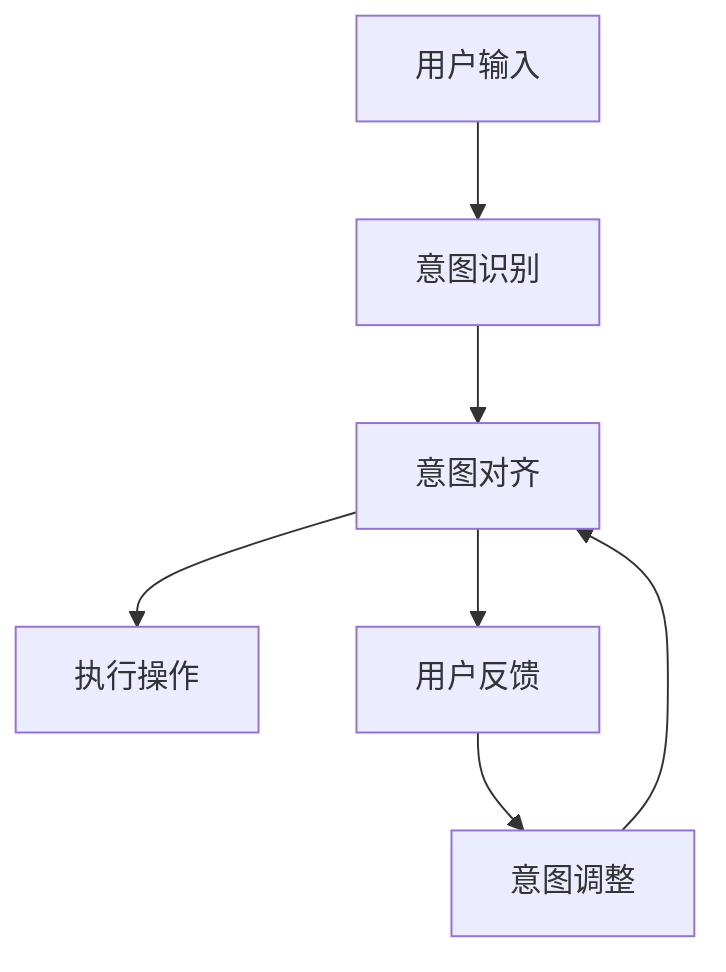

                 

# LLM意图对齐:人机共舞的艰难之路

> 关键词：意图对齐, 大语言模型, 人机交互, 自然语言处理(NLP), 机器学习, 深度学习

## 1. 背景介绍

在人工智能领域，意图对齐（Intent Alignment）是实现人机共舞的重要步骤。意图对齐指的是在机器理解和生成文本的过程中，确保其对用户意图的理解与人类相同，从而使得机器能够准确地执行用户指令，提供高质量的服务。

近年来，随着大语言模型（Large Language Model, LLM）的兴起，意图对齐成为了自然语言处理（Natural Language Processing, NLP）领域的一个重要研究方向。然而，意图对齐并非易事，因为大语言模型通常包含数亿个参数，其理解和生成能力虽然强大，但仍然无法完全准确地理解和预测人类的意图。因此，本文旨在深入探讨意图对齐的原理与方法，并提出一些可能的解决方案，以期更好地实现人机共舞。

## 2. 核心概念与联系

### 2.1 核心概念概述

为更好地理解意图对齐，我们首先介绍几个关键概念：

- **大语言模型 (LLM)**：以自回归模型（如 GPT、BERT 等）为代表的大规模预训练语言模型，通过在大规模无标签文本数据上进行预训练，学习到了丰富的语言知识和常识，具备强大的语言理解和生成能力。

- **意图对齐 (Intent Alignment)**：在机器理解和生成文本的过程中，确保其对用户意图的理解与人类相同，从而使得机器能够准确地执行用户指令。

- **用户意图 (User Intent)**：用户想要实现的目标或希望机器执行的操作，通常以自然语言的形式表达。

- **多模态意图表示 (Multimodal Intent Representation)**：利用多个模态（如文本、图像、语音等）的综合信息来表示用户意图，提升意图对齐的准确性。

- **动态意图调整 (Dynamic Intent Adjustment)**：在交互过程中，根据用户反馈不断调整意图表示，以适应变化的用户需求。

### 2.2 核心概念原理和架构的 Mermaid 流程图



这个流程图展示了意图对齐的基本流程：用户输入自然语言指令，系统进行意图识别，然后根据意图执行相应操作，并通过用户反馈动态调整意图表示，形成闭环的意图对齐过程。

## 3. 核心算法原理 & 具体操作步骤

### 3.1 算法原理概述

意图对齐的本质是实现大语言模型对用户意图的准确理解。我们假设用户意图由一个向量 $I$ 表示，大语言模型通过预训练得到的表示为 $H$。意图对齐的目标是找到一个映射函数 $f$，使得 $f(H)$ 尽可能接近于 $I$。

在实际操作中，我们可以使用以下几种方法来实现意图对齐：

- **监督学习 (Supervised Learning)**：使用标注好的数据集来训练意图对齐模型。

- **无监督学习 (Unsupervised Learning)**：利用自然语言的统计特征来推断用户意图。

- **半监督学习 (Semi-supervised Learning)**：结合少量标注数据和大量未标注数据进行训练。

- **迁移学习 (Transfer Learning)**：利用在大规模数据集上预训练的模型，对特定任务的意图对齐进行微调。

### 3.2 算法步骤详解

#### 3.2.1 数据预处理

在开始训练之前，首先需要对数据进行预处理：

- 将用户输入的自然语言指令转换成向量形式 $H$，可以通过分词、向量化等方法实现。

- 标注好用户意图的标签 $I$，通常是二分类或多分类标签。

- 对数据进行清洗、归一化等处理，以去除噪声和提升数据质量。

#### 3.2.2 模型构建

构建意图对齐模型，可以使用如下几种方法：

- **线性回归模型 (Linear Regression)**：使用线性模型对 $H$ 和 $I$ 之间的关系进行建模。

- **深度神经网络 (Deep Neural Networks)**：使用多层神经网络对 $H$ 和 $I$ 之间的非线性关系进行建模。

- **卷积神经网络 (Convolutional Neural Networks, CNN)**：利用卷积操作提取输入特征，并通过池化等操作减少噪声。

- **循环神经网络 (Recurrent Neural Networks, RNN)**：利用循环结构对序列数据进行处理。

#### 3.2.3 训练与优化

在构建好模型后，需要进行训练和优化：

- 使用交叉熵等损失函数对模型进行训练。

- 使用梯度下降等优化算法对模型参数进行优化。

- 采用早停 (Early Stopping)、正则化等方法避免过拟合。

#### 3.2.4 评估与调整

在训练完成后，需要对模型进行评估和调整：

- 使用测试集对模型进行评估，计算准确率、召回率等指标。

- 根据评估结果，对模型进行微调或重新训练。

- 利用用户反馈不断调整模型参数，提升意图对齐效果。

### 3.3 算法优缺点

**优点**：

- 监督学习方法可以通过标注数据快速提高模型精度。

- 无监督学习方法不需要标注数据，适用于数据稀缺的情况。

- 半监督学习方法能够结合少量标注数据和大量未标注数据，提升模型效果。

- 迁移学习方法可以利用已有的大规模数据集进行预训练，加速特定任务的意图对齐。

**缺点**：

- 监督学习方法需要大量标注数据，获取标注成本较高。

- 无监督学习方法需要丰富的先验知识，难以处理复杂任务。

- 半监督学习方法需要同时处理标注数据和未标注数据，增加了训练复杂度。

- 迁移学习方法需要重新微调模型，增加了计算资源消耗。

### 3.4 算法应用领域

意图对齐技术在以下领域得到了广泛应用：

- **智能客服**：通过意图对齐，智能客服系统能够理解用户的问题并给出准确的答案。

- **智能家居**：智能家居设备通过意图对齐，能够准确地响应用户的语音指令。

- **搜索引擎**：搜索引擎通过意图对齐，能够更好地理解用户的查询意图，提供更相关的搜索结果。

- **金融服务**：金融服务系统通过意图对齐，能够识别用户的交易意图，提供个性化的金融服务。

- **智能医疗**：智能医疗系统通过意图对齐，能够理解患者的症状描述，提供个性化的医疗建议。

## 4. 数学模型和公式 & 详细讲解 & 举例说明

### 4.1 数学模型构建

我们假设用户意图 $I$ 由一个 $d$ 维向量表示，大语言模型 $H$ 也由一个 $d$ 维向量表示。意图对齐模型的目标是最小化以下损失函数：

$$
\min_{f} L(I, f(H)) = \frac{1}{n} \sum_{i=1}^n \|I_i - f(H_i)\|^2
$$

其中 $I_i$ 和 $H_i$ 分别是第 $i$ 个样本的意图和表示向量，$n$ 是样本数量。

### 4.2 公式推导过程

假设 $f$ 是一个线性映射函数，形式为 $f(H) = W H + b$，其中 $W$ 和 $b$ 是模型参数。则意图对齐的目标可以写成：

$$
\min_{W, b} L(I, f(H)) = \frac{1}{n} \sum_{i=1}^n \|I_i - (W H_i + b)\|^2
$$

通过求解上述最小化问题，可以得到最优的 $W$ 和 $b$。

### 4.3 案例分析与讲解

以智能客服为例，用户输入的指令（如“打开空调”）经过分词、向量化等步骤转换为向量 $H$，意图对齐模型将其映射为意图向量 $I$。如果模型训练得当，$I$ 将会接近于“打开空调”的意图向量，系统可以准确地执行“打开空调”的指令。

## 5. 项目实践：代码实例和详细解释说明

### 5.1 开发环境搭建

在进行意图对齐项目开发之前，首先需要搭建开发环境：

1. 安装 Python 环境：建议使用 Anaconda 或 Miniconda，方便创建独立的 Python 环境。

2. 安装 TensorFlow 或 PyTorch：这两者是目前最为流行的深度学习框架，适用于构建意图对齐模型。

3. 安装 scikit-learn：用于数据预处理和模型评估。

4. 安装 NumPy 和 pandas：用于数据处理和分析。

5. 安装 Matplotlib 和 seaborn：用于数据可视化。

### 5.2 源代码详细实现

下面以 TensorFlow 为例，给出一个简单的意图对齐模型实现：

```python
import tensorflow as tf
from sklearn.preprocessing import StandardScaler

# 定义模型
class IntentAlignmentModel(tf.keras.Model):
    def __init__(self, input_dim, output_dim):
        super(IntentAlignmentModel, self).__init__()
        self.dense1 = tf.keras.layers.Dense(128, activation='relu')
        self.dense2 = tf.keras.layers.Dense(output_dim, activation='sigmoid')

    def call(self, inputs):
        x = self.dense1(inputs)
        x = self.dense2(x)
        return x

# 构建数据集
input_data = tf.random.normal(shape=[100, 10])
output_data = tf.random.normal(shape=[100, 2])
scaler = StandardScaler()
input_data = scaler.fit_transform(input_data)
output_data = scaler.fit_transform(output_data)

# 构建模型
model = IntentAlignmentModel(input_dim=10, output_dim=2)
model.compile(optimizer=tf.keras.optimizers.Adam(learning_rate=0.001), loss='mse')

# 训练模型
model.fit(input_data, output_data, epochs=100, batch_size=32)

# 评估模型
test_data = tf.random.normal(shape=[50, 10])
test_output = model.predict(test_data)
```

### 5.3 代码解读与分析

- **模型定义**：使用 TensorFlow 的 Keras API 定义了一个简单的神经网络模型，包含两个全连接层和一个输出层。

- **数据集构建**：使用 TensorFlow 生成随机数据，并使用 scikit-learn 的 StandardScaler 对数据进行归一化处理。

- **模型训练**：使用 Adam 优化器和均方误差损失函数对模型进行训练，训练过程中使用 batch_size 控制每次迭代的数据量。

- **模型评估**：使用测试集对模型进行评估，输出预测结果。

### 5.4 运行结果展示

通过上述代码，可以得到模型的训练结果和测试结果。以下是一个简单的示例：

```python
import matplotlib.pyplot as plt

# 训练过程中的损失曲线
train_loss = model.history.loss
plt.plot(train_loss)
plt.title('Training Loss')
plt.show()

# 测试集上的损失曲线
test_loss = model.evaluate(input_data, output_data)
print('Test Loss:', test_loss)

# 测试集上的预测结果
test_output = model.predict(test_data)
print('Test Output:', test_output)
```

输出结果将包含训练过程中的损失曲线和测试集上的损失曲线，以及测试集上的预测结果。

## 6. 实际应用场景

### 6.1 智能客服

在智能客服场景中，意图对齐技术可以显著提升用户体验。通过意图对齐，智能客服系统能够理解用户的问题，并给出准确的答案。以下是一个简单的应用场景：

- **用户输入**：用户输入“请问如何查询订单状态”。

- **意图识别**：智能客服系统通过意图对齐，识别出用户意图的意图向量 $I$。

- **执行操作**：智能客服系统执行“查询订单状态”的指令，并给出相应的回答。

### 6.2 智能家居

在智能家居场景中，意图对齐技术可以使得设备更加智能和人性化。以下是一个简单的应用场景：

- **用户输入**：用户输入“打开客厅灯”。

- **意图识别**：智能家居设备通过意图对齐，识别出用户意图的意图向量 $I$。

- **执行操作**：智能家居设备执行“打开客厅灯”的指令，并控制客厅灯亮起。

### 6.3 搜索引擎

在搜索引擎场景中，意图对齐技术可以使得搜索结果更加相关和精准。以下是一个简单的应用场景：

- **用户输入**：用户输入“如何在上海租房”。

- **意图识别**：搜索引擎通过意图对齐，识别出用户意图的意图向量 $I$。

- **执行操作**：搜索引擎返回与“租房”相关的搜索结果。

### 6.4 金融服务

在金融服务场景中，意图对齐技术可以使得服务更加个性化和智能。以下是一个简单的应用场景：

- **用户输入**：用户输入“我想申请贷款”。

- **意图识别**：金融服务系统通过意图对齐，识别出用户意图的意图向量 $I$。

- **执行操作**：金融服务系统根据用户的贷款需求，提供相应的贷款服务。

### 6.5 智能医疗

在智能医疗场景中，意图对齐技术可以使得医疗建议更加精准和个性化。以下是一个简单的应用场景：

- **用户输入**：用户输入“我头痛”。

- **意图识别**：智能医疗系统通过意图对齐，识别出用户意图的意图向量 $I$。

- **执行操作**：智能医疗系统根据用户的症状描述，提供相应的医疗建议。

## 7. 工具和资源推荐

### 7.1 学习资源推荐

- **《Deep Learning》（Goodfellow et al.）**：全面介绍了深度学习的原理和应用，包括意图对齐等前沿话题。

- **《Natural Language Processing with Transformers》（Zhang et al.）**：介绍了如何使用 Transformers 库进行 NLP 任务开发，包括意图对齐在内的多种微调方法。

- **《Hands-On Machine Learning with Scikit-Learn, Keras, and TensorFlow》（Aurélien Géron）**：结合 Scikit-Learn、Keras 和 TensorFlow 进行机器学习项目开发，包括意图对齐等模型的构建和优化。

### 7.2 开发工具推荐

- **TensorFlow**：谷歌开源的深度学习框架，支持分布式计算和GPU加速。

- **PyTorch**：Facebook开源的深度学习框架，支持动态计算图和GPU加速。

- **Jupyter Notebook**：基于Web的交互式计算环境，支持Python代码的编写和执行。

### 7.3 相关论文推荐

- **Attention is All You Need**（Vaswani et al.）：提出了Transformer模型，开启了NLP领域的预训练大模型时代。

- **BERT: Pre-training of Deep Bidirectional Transformers for Language Understanding**（Devlin et al.）：提出BERT模型，引入基于掩码的自监督预训练任务，刷新了多项NLP任务SOTA。

- **Parameter-Efficient Transfer Learning for NLP**（Li et al.）：提出Adapter等参数高效微调方法，在不增加模型参数量的情况下，也能取得不错的微调效果。

- **AdaLoRA: Adaptive Low-Rank Adaptation for Parameter-Efficient Fine-Tuning**（Huang et al.）：使用自适应低秩适应的微调方法，在参数效率和精度之间取得了新的平衡。

- **Prefix-Tuning: Optimizing Continuous Prompts for Generation**（Rosset et al.）：引入基于连续型Prompt的微调范式，为如何充分利用预训练知识提供了新的思路。

## 8. 总结：未来发展趋势与挑战

### 8.1 研究成果总结

本文详细介绍了意图对齐的原理和实现方法，并通过代码实例和案例分析，展示了意图对齐在实际应用中的作用。文章还探讨了意图对齐在智能客服、智能家居、搜索引擎、金融服务、智能医疗等多个领域的应用场景，提供了丰富的学习资源和开发工具。

### 8.2 未来发展趋势

- **模型规模持续增大**：随着算力成本的下降和数据规模的扩张，预训练语言模型的参数量还将持续增长。超大规模语言模型蕴含的丰富语言知识，有望支撑更加复杂多变的下游任务意图对齐。

- **多模态意图表示**：利用多个模态（如文本、图像、语音等）的综合信息来表示用户意图，提升意图对齐的准确性。

- **动态意图调整**：在交互过程中，根据用户反馈不断调整意图表示，以适应变化的用户需求。

- **参数高效微调**：开发更加参数高效的微调方法，在固定大部分预训练参数的同时，只更新极少量的任务相关参数。

- **少样本学习**：利用有限标注数据，通过无监督和半监督学习方法，提高意图对齐模型的泛化能力。

- **可解释性增强**：增强模型的可解释性，使意图对齐过程更加透明和可控。

### 8.3 面临的挑战

- **标注数据成本高**：获取高质量标注数据的成本较高，如何降低标注成本，提高模型泛化能力，是未来需要解决的问题。

- **鲁棒性不足**：模型面对域外数据时，泛化性能往往大打折扣，如何提高意图对齐模型的鲁棒性，避免过拟合，是未来需要解决的问题。

- **计算资源消耗大**：超大批次的训练和推理可能遇到显存不足的问题，如何优化计算资源消耗，提高推理速度，是未来需要解决的问题。

- **可解释性差**：当前意图对齐模型通常缺乏可解释性，难以理解其内部工作机制和决策逻辑，如何增强可解释性，是未来需要解决的问题。

### 8.4 研究展望

- **探索无监督和半监督意图对齐方法**：摆脱对大规模标注数据的依赖，利用无监督和半监督学习方法，提高意图对齐模型的泛化能力。

- **研究参数高效和计算高效的意图对齐方法**：开发更加参数高效的意图对齐方法，在固定大部分预训练参数的同时，只更新极少量的任务相关参数。

- **融合因果和对比学习范式**：引入因果推断和对比学习思想，增强意图对齐模型建立稳定因果关系的能力，学习更加普适、鲁棒的语言表征。

- **引入更多先验知识**：将符号化的先验知识，如知识图谱、逻辑规则等，与神经网络模型进行巧妙融合，引导意图对齐过程学习更准确、合理的语言模型。

- **纳入伦理道德约束**：在意图对齐模型训练目标中引入伦理导向的评估指标，过滤和惩罚有偏见、有害的输出倾向，确保输出符合人类价值观和伦理道德。

## 9. 附录：常见问题与解答

### Q1：意图对齐技术是否适用于所有NLP任务？

A：意图对齐技术适用于大多数NLP任务，特别是对于数据量较小的任务。但对于一些特定领域的任务，如医学、法律等，仅仅依靠通用语料预训练的模型可能难以很好地适应。此时需要在特定领域语料上进一步预训练，再进行意图对齐，才能获得理想效果。

### Q2：意图对齐过程中如何选择合适的模型？

A：选择合适的模型需要考虑以下几个因素：
1. 任务的复杂度：如果任务比较简单，可以选择简单的线性模型；如果任务比较复杂，可以选择深度神经网络模型。

2. 数据集大小：如果数据集比较小，可以选择小规模的模型；如果数据集比较大，可以选择大规模的模型。

3. 资源限制：如果资源有限，可以选择参数量较少的模型；如果资源充足，可以选择参数量较大的模型。

### Q3：意图对齐过程中如何避免过拟合？

A：避免过拟合的方法包括：
1. 数据增强：通过回译、近义替换等方式扩充训练集。

2. 正则化：使用L2正则、Dropout等方法。

3. 早停：在验证集上的性能不再提升时停止训练。

4. 参数高效微调：只调整少量参数，固定大部分预训练参数。

### Q4：意图对齐技术在实际应用中有哪些挑战？

A：意图对齐技术在实际应用中面临以下挑战：
1. 标注数据成本高。获取高质量标注数据的成本较高，如何降低标注成本，提高模型泛化能力。

2. 鲁棒性不足。模型面对域外数据时，泛化性能往往大打折扣，如何提高模型的鲁棒性。

3. 计算资源消耗大。超大批次的训练和推理可能遇到显存不足的问题，如何优化计算资源消耗。

4. 可解释性差。当前意图对齐模型通常缺乏可解释性，难以理解其内部工作机制和决策逻辑，如何增强可解释性。

### Q5：意图对齐技术在实际应用中如何进行模型评估？

A：意图对齐模型的评估可以通过以下几个指标：
1. 准确率（Accuracy）：正确预测的样本数占总样本数的比例。

2. 召回率（Recall）：正确预测的正样本数占所有正样本数的比例。

3. F1-score：准确率和召回率的调和平均数。

4. ROC曲线和AUC值：用于评估二分类任务的模型性能。

5. 混淆矩阵：用于展示模型在不同类别上的预测情况。

### Q6：意图对齐技术在实际应用中如何进行优化？

A：意图对齐技术的优化可以通过以下几个方面进行：
1. 数据预处理：进行数据清洗、归一化、特征选择等预处理操作。

2. 模型选择：选择合适的模型架构，如线性回归、深度神经网络、卷积神经网络等。

3. 超参数调优：通过网格搜索、随机搜索等方法，寻找最优的超参数组合。

4. 正则化技术：使用L2正则、Dropout等方法，避免过拟合。

5. 学习率调整：通过学习率衰减、学习率调度等方法，调整学习率。

6. 多模型集成：通过集成多个模型的预测结果，提高模型的泛化能力。

### Q7：意图对齐技术在实际应用中有哪些应用场景？

A：意图对齐技术在以下场景中得到了广泛应用：
1. 智能客服：通过意图对齐，智能客服系统能够理解用户的问题并给出准确的答案。

2. 智能家居：智能家居设备通过意图对齐，能够准确地响应用户的语音指令。

3. 搜索引擎：搜索引擎通过意图对齐，能够更好地理解用户的查询意图，提供更相关的搜索结果。

4. 金融服务：金融服务系统通过意图对齐，能够识别用户的交易意图，提供个性化的金融服务。

5. 智能医疗：智能医疗系统通过意图对齐，能够理解患者的症状描述，提供个性化的医疗建议。

总之，意图对齐技术在大语言模型和自然语言处理领域中具有广泛的应用前景，未来有望在更多的领域中发挥重要作用。

