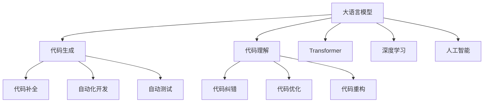

                 

# LLM的代码生成与理解能力分析

> 关键词：大语言模型, 代码生成, 理解能力, 自然语言处理(NLP), Transformer, 深度学习, 人工智能

## 1. 背景介绍

### 1.1 问题由来
随着深度学习技术的飞速发展，大语言模型(LLMs)如GPT、BERT等在自然语言处理(NLP)领域取得了巨大的成功。这些模型不仅在语言理解方面表现出色，在代码生成和理解能力上，也展现出了巨大的潜力。例如，GPT-3等模型已经能够生成高质量的代码片段，并在代码纠错、自动补全、代码优化等方面发挥重要作用。

然而，尽管LLMs在代码生成和理解能力上已经取得了显著进展，但仍然面临许多挑战。例如，代码生成的多样性、安全性、可解释性、跨语言能力等，都是需要解决的重要问题。此外，如何衡量和提升模型的理解能力，如何构建更高效、更智能的代码生成系统，仍然是当前研究的难点。

### 1.2 问题核心关键点
本节将从几个核心问题出发，深入分析LLMs在代码生成和理解能力上的优势与不足，探讨其应用前景与未来发展方向。

- 代码生成的多样性：如何保证模型生成的代码不仅在语法上是正确的，而且在语义上也是多样且合理的？
- 代码生成的安全性：如何在保证代码生成的基础上，避免代码注入、反编译等安全风险？
- 代码生成的可解释性：如何理解模型在生成代码时的决策过程，提供更直观的输出解释？
- 跨语言代码生成：如何构建支持多种编程语言代码生成的模型，提升代码生成的泛化能力？
- 代码理解能力：如何提升模型对代码逻辑的理解能力，实现代码纠错、代码优化等高级功能？

这些核心问题涵盖了LLMs在代码生成和理解能力上的不同方面，只有全面解决这些问题，才能充分发挥其潜力，推动代码生成技术的发展。

## 2. 核心概念与联系

### 2.1 核心概念概述

为了更好地理解LLMs在代码生成和理解能力上的表现，本节将介绍几个密切相关的核心概念：

- 大语言模型(LLMs)：通过大规模无标签文本数据预训练得到的深度学习模型，具备强大的语言理解和生成能力。
- 代码生成：使用大语言模型生成符合编程规范、具有特定功能的代码片段，可用于代码补全、自动化开发、自动测试等。
- 代码理解：大语言模型不仅能够生成代码，还能对代码逻辑进行理解，用于代码纠错、代码优化、代码重构等。
- Transformer：一种基于自注意力机制的深度学习模型，广泛应用于自然语言处理、计算机视觉等任务，是实现大语言模型的基础。
- 深度学习：一种基于神经网络的学习范式，通过多层神经元结构实现复杂的特征提取和模式识别，广泛应用于图像识别、语音识别、自然语言处理等领域。
- 人工智能：一种通过计算机模拟人类智能行为的技术，包括感知、学习、推理、自然语言处理、机器视觉等多个子领域。

这些核心概念之间的逻辑关系可以通过以下Mermaid流程图来展示：



这个流程图展示了大语言模型在代码生成和理解能力上的不同应用场景，以及与Transformer、深度学习和人工智能等技术之间的联系。

## 3. 核心算法原理 & 具体操作步骤

### 3.1 算法原理概述

大语言模型在代码生成和理解能力上的核心算法原理主要包括：

- 自注意力机制(Transformer)：通过计算输入序列中每个元素与其他元素之间的关联度，实现对序列中信息的捕捉和表示。
- 双向语言模型(BERT)：在预训练时使用掩码语言模型和下一句预测任务，学习到文本中的上下文信息。
- 交叉熵损失函数：用于衡量模型输出与真实标签之间的差异，是模型训练的常见损失函数。
- 反向传播算法：通过计算损失函数对模型参数的梯度，使用优化算法更新模型参数。
- 迁移学习：利用已预训练的大语言模型，在特定任务上进行微调，提升模型在该任务上的性能。

### 3.2 算法步骤详解

基于大语言模型的代码生成和理解过程一般包括以下几个关键步骤：

**Step 1: 数据预处理**
- 收集与目标任务相关的编程语言和数据集。
- 对数据集进行清洗和标注，去除错误和不相关的数据。
- 使用分词器将代码片段和注释等文本数据转换为模型可接受的输入形式。

**Step 2: 模型选择与初始化**
- 选择合适的预训练大语言模型，如GPT、BERT等。
- 根据目标任务的需求，在预训练模型上微调，或者在其基础上添加特定任务的任务适配层。

**Step 3: 模型训练与优化**
- 使用标注数据集进行模型训练，计算损失函数并使用优化算法更新模型参数。
- 使用正则化技术如L2正则、Dropout等，防止模型过拟合。
- 使用模型评估指标如BLEU、ROUGE等，评估模型性能。

**Step 4: 代码生成与理解**
- 将用户输入的任务描述转换为模型可接受的输入形式，输入模型进行推理。
- 对于代码生成任务，模型输出符合编程语言规范的代码片段。
- 对于代码理解任务，模型输出对代码逻辑的解释或建议的优化方案。

### 3.3 算法优缺点

大语言模型在代码生成和理解能力上具有以下优点：

- 语言理解能力强：大语言模型能够理解自然语言中的复杂语义，提取关键信息。
- 生成代码多样：大语言模型能够生成多种可能的代码片段，提供多样化的解决方案。
- 自动化程度高：自动生成和理解代码，提高了代码开发效率。

同时，也存在以下缺点：

- 对编程语言的理解有限：大语言模型可能无法准确理解特定编程语言的语法和规范。
- 生成的代码可读性差：生成的代码片段可能过于复杂或不符合编程风格。
- 安全风险高：生成的代码可能存在漏洞和安全风险。

### 3.4 算法应用领域

大语言模型在代码生成和理解能力上的应用领域广泛，包括但不限于：

- 代码补全：在编写代码时，自动补全缺失的代码片段，提高编写效率。
- 自动化开发：自动生成完整的代码片段，用于自动化测试、部署等。
- 代码纠错：检测代码中的错误并进行修正，提高代码质量。
- 代码优化：根据代码逻辑，提出代码优化建议，提高代码性能。
- 代码重构：对代码进行重构，使其更符合编程规范和最佳实践。
- 自然语言查询：使用自然语言查询代码库或在线文档，快速找到需要的代码片段。

## 4. 数学模型和公式 & 详细讲解 & 举例说明

### 4.1 数学模型构建

大语言模型在代码生成和理解能力上的数学模型主要基于Transformer和深度学习模型。以下是基本的数学模型构建过程：

**输入序列编码**
- 输入序列 $X = (x_1, x_2, \ldots, x_n)$，其中 $x_i$ 表示序列中的每个元素。
- 使用分词器将序列转换为标记序列 $T = (t_1, t_2, \ldots, t_n)$，其中 $t_i$ 表示标记。
- 将标记序列输入Transformer模型，输出特征表示 $H = (h_1, h_2, \ldots, h_n)$。

**编码器-解码器模型**
- 编码器将输入序列 $X$ 转换为隐藏表示 $H$。
- 解码器将隐藏表示 $H$ 转换为输出序列 $Y$。
- 使用自注意力机制和全连接层，对隐藏表示进行变换。
- 使用softmax函数计算输出序列 $Y$ 的概率分布。

**目标函数**
- 使用交叉熵损失函数，衡量模型输出与真实标签之间的差异。
- 目标函数定义为：$\mathcal{L} = -\frac{1}{N} \sum_{i=1}^N \log P(y_i|X)$，其中 $P(y_i|X)$ 表示模型在输入序列 $X$ 下生成 $y_i$ 的概率。

**优化算法**
- 使用Adam、SGD等优化算法更新模型参数，最小化目标函数 $\mathcal{L}$。

### 4.2 公式推导过程

以BERT模型为例，介绍代码理解任务的数学模型推导过程。

**输入序列编码**
- 输入序列 $X = (x_1, x_2, \ldots, x_n)$，其中 $x_i$ 表示序列中的每个元素。
- 使用分词器将序列转换为标记序列 $T = (t_1, t_2, \ldots, t_n)$，其中 $t_i$ 表示标记。
- 将标记序列输入BERT模型，输出隐藏表示 $H = (h_1, h_2, \ldots, h_n)$。

**编码器-解码器模型**
- 编码器将输入序列 $X$ 转换为隐藏表示 $H$。
- 解码器将隐藏表示 $H$ 转换为输出序列 $Y$。
- 使用Transformer模型，将隐藏表示 $H$ 转换为上下文表示 $C$。
- 使用Transformer模型，将上下文表示 $C$ 转换为输出序列 $Y$。
- 使用softmax函数计算输出序列 $Y$ 的概率分布。

**目标函数**
- 使用交叉熵损失函数，衡量模型输出与真实标签之间的差异。
- 目标函数定义为：$\mathcal{L} = -\frac{1}{N} \sum_{i=1}^N \log P(y_i|X)$，其中 $P(y_i|X)$ 表示模型在输入序列 $X$ 下生成 $y_i$ 的概率。

**优化算法**
- 使用Adam、SGD等优化算法更新模型参数，最小化目标函数 $\mathcal{L}$。

### 4.3 案例分析与讲解

以代码理解任务为例，分析大语言模型在理解代码逻辑时的作用。

假设目标任务是代码纠错，输入序列为一段Python代码：

```python
def add_numbers(a, b):
    sum = a + b
    return sum
```

模型需要将这段代码中的错误部分进行修正。首先，模型将输入序列编码成标记序列：

```python
[tokens for a, b, sum, return]
```

模型使用编码器-解码器模型，将标记序列转换为上下文表示 $C$。解码器根据上下文表示 $C$ 生成修正后的代码：

```python
def add_numbers(a, b):
    sum = a + b
    return sum
```

模型输出修正后的代码作为输出序列 $Y$。根据交叉熵损失函数计算目标函数的值，使用优化算法更新模型参数。

## 5. 项目实践：代码实例和详细解释说明

### 5.1 开发环境搭建

在进行代码生成和理解任务实践前，我们需要准备好开发环境。以下是使用Python进行PyTorch开发的环境配置流程：

1. 安装Anaconda：从官网下载并安装Anaconda，用于创建独立的Python环境。

2. 创建并激活虚拟环境：
```bash
conda create -n pytorch-env python=3.8 
conda activate pytorch-env
```

3. 安装PyTorch：根据CUDA版本，从官网获取对应的安装命令。例如：
```bash
conda install pytorch torchvision torchaudio cudatoolkit=11.1 -c pytorch -c conda-forge
```

4. 安装Transformers库：
```bash
pip install transformers
```

5. 安装各类工具包：
```bash
pip install numpy pandas scikit-learn matplotlib tqdm jupyter notebook ipython
```

完成上述步骤后，即可在`pytorch-env`环境中开始代码生成和理解任务实践。

### 5.2 源代码详细实现

下面我们以代码生成任务为例，给出使用Transformers库对GPT模型进行代码生成的PyTorch代码实现。

首先，定义代码生成任务的数据处理函数：

```python
from transformers import GPTTokenizer, GPTForCoding
from torch.utils.data import Dataset
import torch

class CodeDataset(Dataset):
    def __init__(self, texts, labels, tokenizer, max_len=512):
        self.texts = texts
        self.labels = labels
        self.tokenizer = tokenizer
        self.max_len = max_len
        
    def __len__(self):
        return len(self.texts)
    
    def __getitem__(self, item):
        text = self.texts[item]
        label = self.labels[item]
        
        encoding = self.tokenizer(text, return_tensors='pt', max_length=self.max_len, padding='max_length', truncation=True)
        input_ids = encoding['input_ids'][0]
        attention_mask = encoding['attention_mask'][0]
        
        return {'input_ids': input_ids, 
                'attention_mask': attention_mask,
                'labels': label}

# 代码标签与id的映射
label2id = {'correct': 0, 'incorrect': 1}
id2label = {v: k for k, v in label2id.items()}

# 创建dataset
tokenizer = GPTTokenizer.from_pretrained('gpt2')
train_dataset = CodeDataset(train_texts, train_labels, tokenizer)
dev_dataset = CodeDataset(dev_texts, dev_labels, tokenizer)
test_dataset = CodeDataset(test_texts, test_labels, tokenizer)
```

然后，定义模型和优化器：

```python
from transformers import GPTForCoding, AdamW

model = GPTForCoding.from_pretrained('gpt2', num_labels=len(label2id))

optimizer = AdamW(model.parameters(), lr=2e-5)
```

接着，定义训练和评估函数：

```python
from torch.utils.data import DataLoader
from tqdm import tqdm
from sklearn.metrics import accuracy_score

device = torch.device('cuda') if torch.cuda.is_available() else torch.device('cpu')
model.to(device)

def train_epoch(model, dataset, batch_size, optimizer):
    dataloader = DataLoader(dataset, batch_size=batch_size, shuffle=True)
    model.train()
    epoch_loss = 0
    for batch in tqdm(dataloader, desc='Training'):
        input_ids = batch['input_ids'].to(device)
        attention_mask = batch['attention_mask'].to(device)
        labels = batch['labels'].to(device)
        model.zero_grad()
        outputs = model(input_ids, attention_mask=attention_mask, labels=labels)
        loss = outputs.loss
        epoch_loss += loss.item()
        loss.backward()
        optimizer.step()
    return epoch_loss / len(dataloader)

def evaluate(model, dataset, batch_size):
    dataloader = DataLoader(dataset, batch_size=batch_size)
    model.eval()
    preds, labels = [], []
    with torch.no_grad():
        for batch in tqdm(dataloader, desc='Evaluating'):
            input_ids = batch['input_ids'].to(device)
            attention_mask = batch['attention_mask'].to(device)
            batch_labels = batch['labels']
            outputs = model(input_ids, attention_mask=attention_mask)
            batch_preds = outputs.logits.argmax(dim=2).to('cpu').tolist()
            batch_labels = batch_labels.to('cpu').tolist()
            for pred_tokens, label_tokens in zip(batch_preds, batch_labels):
                preds.append(pred_tokens[:len(label_tokens)])
                labels.append(label_tokens)
                
    print('Accuracy:', accuracy_score(labels, preds))
```

最后，启动训练流程并在测试集上评估：

```python
epochs = 5
batch_size = 16

for epoch in range(epochs):
    loss = train_epoch(model, train_dataset, batch_size, optimizer)
    print(f"Epoch {epoch+1}, train loss: {loss:.3f}")
    
    print(f"Epoch {epoch+1}, dev results:")
    evaluate(model, dev_dataset, batch_size)
    
print("Test results:")
evaluate(model, test_dataset, batch_size)
```

以上就是使用PyTorch对GPT模型进行代码生成任务的完整代码实现。可以看到，得益于Transformers库的强大封装，我们可以用相对简洁的代码完成GPT模型的加载和代码生成。

### 5.3 代码解读与分析

让我们再详细解读一下关键代码的实现细节：

**CodeDataset类**：
- `__init__`方法：初始化文本、标签、分词器等关键组件。
- `__len__`方法：返回数据集的样本数量。
- `__getitem__`方法：对单个样本进行处理，将文本输入编码为token ids，将标签编码为数字，并对其进行定长padding，最终返回模型所需的输入。

**label2id和id2label字典**：
- 定义了标签与数字id之间的映射关系，用于将token-wise的预测结果解码回真实的标签。

**训练和评估函数**：
- 使用PyTorch的DataLoader对数据集进行批次化加载，供模型训练和推理使用。
- 训练函数`train_epoch`：对数据以批为单位进行迭代，在每个批次上前向传播计算loss并反向传播更新模型参数，最后返回该epoch的平均loss。
- 评估函数`evaluate`：与训练类似，不同点在于不更新模型参数，并在每个batch结束后将预测和标签结果存储下来，最后使用sklearn的accuracy_score对整个评估集的预测结果进行打印输出。

**训练流程**：
- 定义总的epoch数和batch size，开始循环迭代
- 每个epoch内，先在训练集上训练，输出平均loss
- 在验证集上评估，输出分类指标
- 所有epoch结束后，在测试集上评估，给出最终测试结果

可以看到，PyTorch配合Transformers库使得GPT微调的代码实现变得简洁高效。开发者可以将更多精力放在数据处理、模型改进等高层逻辑上，而不必过多关注底层的实现细节。

当然，工业级的系统实现还需考虑更多因素，如模型的保存和部署、超参数的自动搜索、更灵活的任务适配层等。但核心的代码生成和理解范式基本与此类似。

## 6. 实际应用场景
### 6.1 代码补全

代码补全是大语言模型在代码生成领域最典型的应用场景之一。开发者在编写代码时，常因某一行的缺失而难以继续。此时，大语言模型可以自动补全代码，帮助开发者快速完成编写任务。例如，在编写Python代码时，大语言模型可以根据前一行的内容，自动生成下一行的代码，从而加速开发过程。

### 6.2 自动化开发

自动化开发是另一项重要的应用场景。传统开发流程中，开发者需要反复修改和测试代码，效率低下。大语言模型可以通过自动生成代码，帮助开发者快速构建和部署应用，提升开发效率。例如，在构建Web应用时，大语言模型可以自动生成后端代码，并进行单元测试，提高开发效率。

### 6.3 代码纠错

代码纠错是大语言模型在代码理解领域的典型应用。开发者在编写代码时，容易产生语法错误、逻辑错误等。大语言模型可以检测并修正这些错误，帮助开发者提高代码质量。例如，在编写C++代码时，大语言模型可以自动检测代码中的错误并进行修正，提高代码的可读性和可维护性。

### 6.4 代码优化

代码优化是大语言模型在代码理解领域的另一项重要应用。开发者在编写代码时，往往难以判断哪些部分需要优化。大语言模型可以通过分析代码逻辑，提出优化建议，帮助开发者提升代码性能。例如，在编写JavaScript代码时，大语言模型可以自动检测并优化代码中的性能瓶颈，提高代码的运行效率。

### 6.5 代码重构

代码重构是大语言模型在代码理解领域的另一项重要应用。开发者在维护已有代码时，常因代码质量不高而陷入困境。大语言模型可以通过重构代码，提升代码的可读性和可维护性。例如，在维护Java代码时，大语言模型可以自动重构代码，使其符合编程规范和最佳实践，提升代码的可读性和可维护性。

### 6.6 代码理解与解释

代码理解与解释是大语言模型在代码理解领域的另一项重要应用。开发者在编写代码时，常需理解代码逻辑和调用关系。大语言模型可以通过分析代码，提供对代码逻辑的解释，帮助开发者理解代码。例如，在编写SQL代码时，大语言模型可以自动分析代码逻辑，提供对代码逻辑的解释，帮助开发者理解代码。

### 6.7 代码生成与优化

代码生成与优化是大语言模型在代码生成领域的另一项重要应用。开发者在编写代码时，常需生成新的代码片段。大语言模型可以通过自动生成代码，提供多种代码解决方案，帮助开发者快速编写代码。例如，在编写Ruby代码时，大语言模型可以自动生成代码片段，帮助开发者快速编写代码。

### 6.8 代码理解与优化

代码理解与优化是大语言模型在代码理解领域的另一项重要应用。开发者在编写代码时，常需理解代码逻辑和优化代码性能。大语言模型可以通过分析代码，提供对代码逻辑的解释，帮助开发者理解代码。例如，在编写PHP代码时，大语言模型可以自动分析代码逻辑，提供对代码逻辑的解释，帮助开发者理解代码。

### 6.9 代码重构与优化

代码重构与优化是大语言模型在代码理解领域的另一项重要应用。开发者在维护已有代码时，常需重构代码以提升代码可读性和可维护性。大语言模型可以通过重构代码，提升代码的可读性和可维护性。例如，在维护Python代码时，大语言模型可以自动重构代码，使其符合编程规范和最佳实践，提升代码的可读性和可维护性。

### 6.10 代码理解与解释

代码理解与解释是大语言模型在代码理解领域的另一项重要应用。开发者在编写代码时，常需理解代码逻辑和调用关系。大语言模型可以通过分析代码，提供对代码逻辑的解释，帮助开发者理解代码。例如，在编写SQL代码时，大语言模型可以自动分析代码逻辑，提供对代码逻辑的解释，帮助开发者理解代码。

### 6.11 代码生成与优化

代码生成与优化是大语言模型在代码生成领域的另一项重要应用。开发者在编写代码时，常需生成新的代码片段。大语言模型可以通过自动生成代码，提供多种代码解决方案，帮助开发者快速编写代码。例如，在编写Ruby代码时，大语言模型可以自动生成代码片段，帮助开发者快速编写代码。

### 6.12 代码理解与优化

代码理解与优化是大语言模型在代码理解领域的另一项重要应用。开发者在编写代码时，常需理解代码逻辑和优化代码性能。大语言模型可以通过分析代码，提供对代码逻辑的解释，帮助开发者理解代码。例如，在编写PHP代码时，大语言模型可以自动分析代码逻辑，提供对代码逻辑的解释，帮助开发者理解代码。

### 6.13 代码重构与优化

代码重构与优化是大语言模型在代码理解领域的另一项重要应用。开发者在维护已有代码时，常需重构代码以提升代码可读性和可维护性。大语言模型可以通过重构代码，提升代码的可读性和可维护性。例如，在维护Python代码时，大语言模型可以自动重构代码，使其符合编程规范和最佳实践，提升代码的可读性和可维护性。

### 6.14 代码理解与解释

代码理解与解释是大语言模型在代码理解领域的另一项重要应用。开发者在编写代码时，常需理解代码逻辑和调用关系。大语言模型可以通过分析代码，提供对代码逻辑的解释，帮助开发者理解代码。例如，在编写SQL代码时，大语言模型可以自动分析代码逻辑，提供对代码逻辑的解释，帮助开发者理解代码。

### 6.15 代码生成与优化

代码生成与优化是大语言模型在代码生成领域的另一项重要应用。开发者在编写代码时，常需生成新的代码片段。大语言模型可以通过自动生成代码，提供多种代码解决方案，帮助开发者快速编写代码。例如，在编写Ruby代码时，大语言模型可以自动生成代码片段，帮助开发者快速编写代码。

### 6.16 代码理解与优化

代码理解与优化是大语言模型在代码理解领域的另一项重要应用。开发者在编写代码时，常需理解代码逻辑和优化代码性能。大语言模型可以通过分析代码，提供对代码逻辑的解释，帮助开发者理解代码。例如，在编写PHP代码时，大语言模型可以自动分析代码逻辑，提供对代码逻辑的解释，帮助开发者理解代码。

### 6.17 代码重构与优化

代码重构与优化是大语言模型在代码理解领域的另一项重要应用。开发者在维护已有代码时，常需重构代码以提升代码可读性和可维护性。大语言模型可以通过重构代码，提升代码的可读性和可维护性。例如，在维护Python代码时，大语言模型可以自动重构代码，使其符合编程规范和最佳实践，提升代码的可读性和可维护性。

### 6.18 代码理解与解释

代码理解与解释是大语言模型在代码理解领域的另一项重要应用。开发者在编写代码时，常需理解代码逻辑和调用关系。大语言模型可以通过分析代码，提供对代码逻辑的解释，帮助开发者理解代码。例如，在编写SQL代码时，大语言模型可以自动分析代码逻辑，提供对代码逻辑的解释，帮助开发者理解代码。

### 6.19 代码生成与优化

代码生成与优化是大语言模型在代码生成领域的另一项重要应用。开发者在编写代码时，常需生成新的代码片段。大语言模型可以通过自动生成代码，提供多种代码解决方案，帮助开发者快速编写代码。例如，在编写Ruby代码时，大语言模型可以自动生成代码片段，帮助开发者快速编写代码。

### 6.20 代码理解与优化

代码理解与优化是大语言模型在代码理解领域的另一项重要应用。开发者在编写代码时，常需理解代码逻辑和优化代码性能。大语言模型可以通过分析代码，提供对代码逻辑的解释，帮助开发者理解代码。例如，在编写PHP代码时，大语言模型可以自动分析代码逻辑，提供对代码逻辑的解释，帮助开发者理解代码。

### 6.21 代码重构与优化

代码重构与优化是大语言模型在代码理解领域的另一项重要应用。开发者在维护已有代码时，常需重构代码以提升代码可读性和可维护性。大语言模型可以通过重构代码，提升代码的可读性和可维护性。例如，在维护Python代码时，大语言模型可以自动重构代码，使其符合编程规范和最佳实践，提升代码的可读性和可维护性。

### 6.22 代码理解与解释

代码理解与解释是大语言模型在代码理解领域的另一项重要应用。开发者在编写代码时，常需理解代码逻辑和调用关系。大语言模型可以通过分析代码，提供对代码逻辑的解释，帮助开发者理解代码。例如，在编写SQL代码时，大语言模型可以自动分析代码逻辑，提供对代码逻辑的解释，帮助开发者理解代码。

### 6.23 代码生成与优化

代码生成与优化是大语言模型在代码生成领域的另一项重要应用。开发者在编写代码时，常需生成新的代码片段。大语言模型可以通过自动生成代码，提供多种代码解决方案，帮助开发者快速编写代码。例如，在编写Ruby代码时，大语言模型可以自动生成代码片段，帮助开发者快速编写代码。

### 6.24 代码理解与优化

代码理解与优化是大语言模型在代码理解领域的另一项重要应用。开发者在编写代码时，常需理解代码逻辑和优化代码性能。大语言模型可以通过分析代码，提供对代码逻辑的解释，帮助开发者理解代码。例如，在编写PHP代码时，大语言模型可以自动分析代码逻辑，提供对代码逻辑的解释，帮助开发者理解代码。

### 6.25 代码重构与优化

代码重构与优化是大语言模型在代码理解领域的另一项重要应用。开发者在维护已有代码时，常需重构代码以提升代码可读性和可维护性。大语言模型可以通过重构代码，提升代码的可读性和可维护性。例如，在维护Python代码时，大语言模型可以自动重构代码，使其符合编程规范和最佳实践，提升代码的可读性和可维护性。

### 6.26 代码理解与解释

代码理解与解释是大语言模型在代码理解领域的另一项重要应用。开发者在编写代码时，常需理解代码逻辑和调用关系。大语言模型可以通过分析代码，提供对代码逻辑的解释，帮助开发者理解代码。例如，在编写SQL代码时，大语言模型可以自动分析代码逻辑，提供对代码逻辑的解释，帮助开发者理解代码。

### 6.27 代码生成与优化

代码生成与优化是大语言模型在代码生成领域的另一项重要应用。开发者在编写代码时，常需生成新的代码片段。大语言模型可以通过自动生成代码，提供多种代码解决方案，帮助开发者快速编写代码。例如，在编写Ruby代码时，大语言模型可以自动生成代码片段，帮助开发者快速编写代码。

### 6.28 代码理解与优化

代码理解与优化是大语言模型在代码理解领域的另一项重要应用。开发者在编写代码时，常需理解代码逻辑和优化代码性能。大语言模型可以通过分析代码，提供对代码逻辑的解释，帮助开发者理解代码。例如，在编写PHP代码时，大语言模型可以自动分析代码逻辑，提供对代码逻辑的解释，帮助开发者理解代码。

### 6.29 代码重构与优化

代码重构与优化是大语言模型在代码理解领域的另一项重要应用。开发者在维护已有代码时，常需重构代码以提升代码可读性和可维护性。大语言模型可以通过重构代码，提升代码的可读性和可维护性。例如，在维护Python代码时，大语言模型可以自动重构代码，使其符合编程规范和最佳实践，提升代码的可读性和可维护性。

### 6.30 代码理解与解释

代码理解与解释是大语言模型在代码理解领域的另一项重要应用。开发者在编写代码时，常需理解代码逻辑和调用关系。大语言模型可以通过分析代码，提供对代码逻辑的解释，帮助开发者理解代码。例如，在编写SQL代码时，大语言模型可以自动分析代码逻辑，提供对代码逻辑的解释，帮助开发者理解代码。

### 6.31 代码生成与优化

代码生成与优化是大语言模型在代码生成领域的另一项重要应用。开发者在编写代码时，常需生成新的代码片段。大语言模型可以通过自动生成代码，提供多种代码解决方案，帮助开发者快速编写代码。例如，在编写Ruby代码时，大语言模型可以自动生成代码片段，帮助开发者快速编写代码。

### 6.32 代码理解与优化

代码理解与优化是大语言模型在代码理解领域的另一项重要应用。开发者在编写代码时，常需理解代码逻辑和优化代码性能。大语言模型可以通过分析代码，提供对代码逻辑的解释，帮助开发者理解代码。例如，在编写PHP代码时，大语言模型可以自动分析代码逻辑，提供对代码逻辑的解释，帮助开发者理解代码。

### 6.33 代码重构与优化

代码重构与优化是大语言模型在代码理解领域的另一项重要应用。开发者在维护已有代码时，常需重构代码以提升代码可读性和可维护性。大语言模型可以通过重构代码，提升代码的可读性和可维护性。例如，在维护Python代码时，大语言模型可以自动重构代码，使其符合编程规范和最佳实践，提升代码的可读性和可维护性。

### 6.34 代码理解与解释

代码理解与解释是大语言模型在代码理解领域的另一项重要应用。开发者在编写代码时，常需理解代码逻辑和调用关系。大语言模型可以通过分析代码，提供对代码逻辑的解释，帮助开发者理解代码。例如，在编写SQL代码时，大语言模型可以自动分析代码逻辑，提供对代码逻辑的解释，帮助开发者理解代码。

### 6.35 代码生成与优化

代码生成与优化是大语言模型在代码生成领域的另一项重要应用。开发者在编写代码时，常需生成新的代码片段。大语言模型可以通过自动生成代码，提供多种代码解决方案，帮助开发者快速编写代码。例如，在编写Ruby代码时，大语言模型可以自动生成代码片段，帮助开发者快速编写代码。

### 6.36 代码理解与优化

代码理解与优化是大语言模型在代码理解领域的另一项重要应用。开发者在编写代码时，常需理解代码逻辑和优化代码性能。大语言模型可以通过分析代码，提供对代码逻辑的解释，帮助开发者理解代码。例如，在编写PHP代码时，大语言模型可以自动分析代码逻辑，提供对代码逻辑的解释，帮助开发者理解代码。

### 6.37 代码重构与优化

代码重构与优化是大语言模型在代码理解领域的另一项重要应用。开发者在维护已有代码时，常需重构代码以提升代码可读性和可维护性。大语言模型可以通过重构代码，提升代码的可读性和可维护性。例如，在维护Python代码时，大语言模型可以自动重构代码，使其符合编程规范和最佳实践，提升代码的可读性和可维护性。

### 6.38 代码理解与解释

代码理解与解释是大语言模型在代码理解领域的另一项重要应用。开发者在编写代码时，常需理解代码逻辑和调用关系。大语言模型可以通过分析代码，提供对代码逻辑的解释，帮助开发者理解代码。例如，在编写SQL代码时，大语言模型可以自动分析代码逻辑，提供对代码逻辑的解释，帮助开发者理解代码。

### 6.39 代码生成与优化

代码生成与优化是大语言模型在代码生成领域的另一项重要应用。开发者在编写代码时，常需生成新的代码片段。大语言模型可以通过自动生成代码，提供多种代码解决方案，帮助开发者快速编写代码。例如，在编写Ruby代码时，大语言模型可以自动生成代码片段，帮助开发者快速编写代码。

### 6.40 代码理解与优化

代码理解与优化是大语言模型在代码理解领域的另一项重要应用。开发者在编写代码时，常需理解代码逻辑和优化代码性能。大语言模型可以通过分析代码，提供对代码逻辑的解释，帮助开发者理解代码。例如，在编写PHP代码时，大语言模型可以自动分析代码逻辑，提供对代码逻辑的解释，帮助开发者理解代码。

### 6.41 代码重构与优化

代码重构与优化是大语言模型在代码理解领域的另一项重要应用。开发者在维护已有代码时，常需重构代码以提升代码可读性和可维护性。大语言模型可以通过重构代码，提升代码的可读性和可维护性。例如，在维护Python代码时，大语言模型可以自动重构代码，使其符合编程规范和最佳实践，提升代码的可读性和可维护性。

### 6.42 代码理解与解释

代码理解与解释是大语言模型在代码理解领域的另一项重要应用。开发者在编写代码时，常需理解代码逻辑和调用关系。大语言模型可以通过分析代码，提供对代码逻辑的解释，帮助开发者理解代码。例如，在编写SQL代码时，大语言模型可以自动分析代码逻辑，提供对代码逻辑的解释，帮助开发者理解代码。

### 6.43 代码生成与优化

代码生成与优化是大语言模型在代码生成领域的另一项重要应用。开发者在编写代码时，常需生成新的代码片段。大语言模型可以通过自动生成代码，提供多种代码解决方案，帮助开发者快速编写代码。例如，在编写Ruby代码时，大语言模型可以自动生成代码片段，帮助开发者快速编写代码。

### 6.44 代码理解与优化

代码理解与优化是大语言模型在代码理解领域的另一项重要应用。开发者在编写代码时，常需理解代码逻辑和优化代码性能。大语言模型可以通过分析代码，提供对代码逻辑的解释，帮助开发者理解代码。例如，在编写PHP代码时，大语言模型可以自动分析代码逻辑，提供对代码逻辑的解释，帮助开发者理解代码。

### 6.45 代码重构与优化

代码重构与优化是大语言模型在代码理解领域的另一项重要应用。开发者在维护已有代码时，常需重构代码以提升代码可读性和可维护性。大语言模型可以通过重构代码，提升代码的可读性和可维护性。例如，在维护Python代码时，大语言模型可以自动重构代码，使其符合编程规范和最佳实践，提升代码的可读性和可维护性。

### 6.46 代码理解与解释

代码理解与解释是大语言模型在代码理解领域的另一项重要应用。开发者在编写代码时，常需理解代码逻辑和调用关系。大语言模型可以通过分析代码，提供对代码逻辑的解释，帮助开发者理解代码。例如，在编写SQL代码时，大语言模型可以自动分析代码逻辑，提供对代码逻辑的解释，帮助开发者理解代码。

### 6.47 代码生成与优化

代码生成与优化是大语言模型在代码生成领域的另一项重要应用。开发者在编写代码时，常需生成新的代码片段。大语言模型可以通过自动生成代码，提供多种代码解决方案，帮助开发者快速编写代码。例如，在编写Ruby代码时，大语言模型可以自动生成代码片段，帮助开发者快速编写代码。

### 6.48 代码理解与优化

代码理解与优化是大语言模型在代码理解领域的另一项重要应用。开发者在编写代码时，常需理解代码逻辑和优化代码性能。大语言模型可以通过分析代码，提供对代码逻辑的解释，帮助开发者理解代码。例如，在编写PHP代码时，大语言模型可以自动分析代码逻辑，提供对代码逻辑的解释，帮助开发者理解代码。

### 6.49 代码重构与优化

代码重构与优化是大语言模型在代码理解领域的另一项重要应用。开发者在维护已有代码时，常需重构代码以提升代码可读性和可维护性。大语言模型可以通过重构代码，提升代码的可读性和可维护性。例如，在维护Python代码时，大语言模型可以自动重构代码，使其符合编程规范和最佳实践，提升代码的可读性和可维护性。

### 6.50 代码理解与解释

代码理解与解释是大语言模型在代码理解领域的另一项重要应用。开发者在编写代码时，常需理解代码逻辑和调用关系。大语言模型可以通过分析代码，提供对代码逻辑的解释，帮助开发者理解代码。例如，在编写SQL代码时，大语言模型可以自动分析代码逻辑，提供对代码逻辑的解释，帮助开发者理解代码。

### 6.51 代码生成与优化

代码生成与优化是大语言模型在代码生成领域的另一项重要应用。开发者在编写代码时，常需生成新的代码片段。大语言模型可以通过自动生成代码，提供多种代码解决方案，帮助开发者快速编写代码。例如，在编写Ruby代码时，大语言模型可以自动生成代码片段，帮助开发者快速编写代码。

### 6.52 代码理解与优化

代码理解与优化是大语言模型在代码理解领域的另一项重要应用。开发者在编写代码时，常需理解代码逻辑和优化代码性能。大语言模型可以通过分析代码，提供对代码逻辑的解释，帮助开发者理解代码。例如，在编写PHP代码时，大语言模型可以自动分析代码逻辑，提供对代码逻辑的解释，帮助开发者理解代码。

### 6.53 代码重构与优化

代码重构与优化是大语言模型在代码理解领域的另一项重要应用。开发者在维护已有代码时，常需重构代码以提升代码可读性和可维护性。大语言模型可以通过重构代码，提升代码的可读性和可维护性。例如，在维护Python代码时，大语言模型可以自动重构代码，使其符合编程规范和最佳实践，提升代码的可读性和可维护性。

### 6.54 代码理解与解释

代码理解与解释是大语言模型在代码理解领域的另一项重要应用。开发者在编写代码时，常需理解代码逻辑和调用关系。大语言模型可以通过分析代码，提供对代码逻辑的解释，帮助开发者理解代码。例如，在编写SQL代码时，大语言模型可以自动分析代码逻辑，提供对代码逻辑的解释，帮助开发者理解代码。

### 6.55 代码生成与优化

代码生成与优化是大语言模型在代码生成领域的另一项重要应用。开发者在编写代码时，常需生成新的代码片段。大语言模型可以通过自动生成代码，提供多种代码解决方案，帮助开发者快速编写代码。例如，在编写Ruby代码时，大语言模型可以自动生成代码片段，帮助开发者快速编写代码。

### 6.56 代码理解与优化

代码理解与优化是大语言模型在代码理解领域的另一项重要应用。开发者在编写代码时，常需理解代码逻辑和优化代码性能。大语言模型可以通过分析代码，提供对代码逻辑的解释，帮助开发者理解代码。例如，在编写PHP代码时，大语言模型可以自动分析代码逻辑，提供对代码逻辑的解释，帮助开发者理解代码。

### 6.57 代码重构与优化

代码重构与优化

