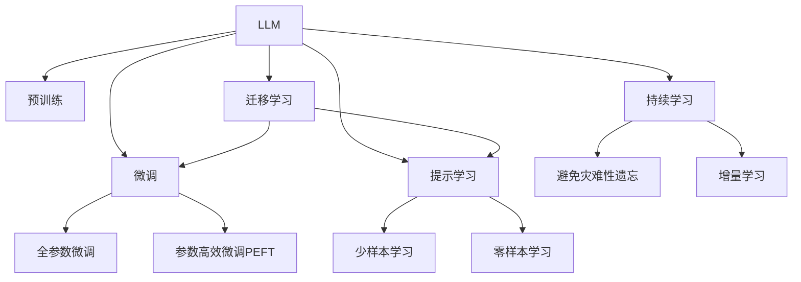

                 

# LLM：新一代计算机架构的崛起

在计算机科学的发展历程中，每一次架构的重大升级，都伴随着技术和应用的巨大飞跃。从早期基于冯·诺依曼结构的设计，到后来的分布式计算、多核处理、量子计算等，每一次创新都深刻影响了计算领域的发展方向。如今，新一代计算机架构的崛起，正以大语言模型(LLM)为中心，开启了一个新的时代。本文将深入探讨LLM的原理、操作方式、应用领域及未来发展趋势，帮助读者全面理解这一颠覆性技术的潜力与挑战。

## 1. 背景介绍

### 1.1 问题由来

计算机科学的发展，从早期的串行计算，到后来的并行、分布式计算，再到云计算、人工智能等领域的崛起，一直在不断探索如何提高计算效率和适应性。而新一代计算机架构的崛起，正是以大语言模型(LLM)为代表，通过对语言的理解与生成能力，推动了计算领域的根本变革。

随着自然语言处理技术的进步，语言模型在理解自然语言、生成自然语言、推理、问答等方面展现了卓越的能力。大语言模型，如GPT-3、BERT等，通过海量数据的预训练，掌握了语言规则、语义理解及生成能力。这些模型不仅在学术界引起了广泛关注，更在产业界得到了广泛应用，成为推动新一轮技术革命的重要力量。

### 1.2 问题核心关键点

LLM作为一种革命性的计算架构，其核心关键点在于以下几个方面：

- **大规模预训练**：LLM通过大规模无标签文本数据进行预训练，学习语言结构和常识知识，形成通用的语言模型。
- **高精度生成**：基于预训练的模型，LLM通过微调可以适应特定任务，生成高质量的自然语言文本。
- **跨领域适应**：LLM可以在多个领域和任务上进行调整和应用，具备跨领域迁移能力。
- **高度自动化**：LLM减少了对人工标注数据的依赖，自动化水平较高。
- **高效推理**：LLM的推理能力优于传统的规则或统计模型，可以处理复杂的逻辑推理和情感分析等任务。

这些特点使得LLM在学术界和工业界受到广泛关注，成为新一代计算架构的典型代表。本文将从原理、操作步骤、优缺点及应用领域等方面，深入探讨LLM的运作机制。

## 2. 核心概念与联系

### 2.1 核心概念概述

为更好地理解LLM的原理和应用，本节将介绍几个核心概念：

- **大语言模型(LLM)**：指通过大规模预训练，掌握通用语言规则和常识知识，具备生成和推理能力的模型。
- **预训练(Pre-training)**：指在大规模无标签文本数据上进行自监督学习，学习语言结构和常识知识，形成通用的语言模型。
- **微调(Fine-tuning)**：指在预训练模型基础上，针对特定任务进行调整，提升模型在该任务上的性能。
- **迁移学习(Transfer Learning)**：指将一个领域学习到的知识，迁移到另一个领域进行学习，提升模型在新领域上的性能。
- **少样本学习(Few-shot Learning)**：指在只有少量标注样本的情况下，模型能够快速适应新任务的学习方法。
- **零样本学习(Zero-shot Learning)**：指模型在未见过的新任务中，仅通过任务描述便能执行该任务的能力。
- **提示学习(Prompt Learning)**：通过在输入文本中添加提示模板，引导大语言模型进行特定任务的推理和生成，减少微调参数。
- **持续学习(Continual Learning)**：指模型能够不断学习新知识，同时保持已学习的知识，避免灾难性遗忘。
- **推理引擎(Reasoner)**：指用于执行复杂推理任务的模块，如推理、问答等。
- **逻辑引擎(Logic Engine)**：指用于执行逻辑推理的模块，如规则推理、符号计算等。
- **情感引擎(Emotion Engine)**：指用于分析情感状态的模块，如情感分析、舆情监测等。

这些核心概念共同构成了LLM的计算架构框架，使其能够在各种场景下发挥强大的语言理解和生成能力。通过理解这些核心概念，我们可以更好地把握LLM的工作原理和优化方向。

### 2.2 核心概念原理和架构的 Mermaid 流程图



这个流程图展示了LLM的核心概念及其之间的关系：

1. LLM通过预训练获得基础能力。
2. 微调是对预训练模型进行任务特定的优化，可以分为全参数微调和参数高效微调（PEFT）。
3. 提示学习是一种不更新模型参数的方法，可以实现少样本学习和零样本学习。
4. 迁移学习是连接预训练模型与下游任务的桥梁，可以通过微调或提示学习来实现。
5. 持续学习旨在使模型能够不断学习新知识，同时避免遗忘旧知识。

这些概念之间的逻辑关系清晰地呈现了大语言模型的工作流程和架构特点。

## 3. 核心算法原理 & 具体操作步骤

### 3.1 算法原理概述

LLM的核心算法原理可以概括为：

- **预训练阶段**：在大规模无标签文本数据上进行自监督学习，学习语言的通用表示。
- **微调阶段**：在预训练模型基础上，针对特定任务进行调整，提升模型在该任务上的性能。
- **推理阶段**：通过推理引擎、逻辑引擎和情感引擎，执行复杂的自然语言推理、逻辑推理和情感分析等任务。

### 3.2 算法步骤详解

**预训练阶段**：

1. **数据准备**：收集大规模无标签文本数据，作为预训练语料库。
2. **模型构建**：构建预训练模型，如BERT、GPT等。
3. **训练模型**：在大规模语料库上，使用自监督任务（如掩码语言模型、自回归模型等）训练模型，学习语言结构和常识知识。
4. **评估模型**：在预训练结束后，对模型进行评估，选择性能最好的模型作为后续微调的起点。

**微调阶段**：

1. **任务适配**：根据特定任务，设计相应的任务适配层，如分类器、生成器等。
2. **数据准备**：收集该任务的少量标注数据，划分为训练集、验证集和测试集。
3. **模型初始化**：加载预训练模型，将其作为微调的初始参数。
4. **微调训练**：使用训练集数据，通过有监督学习，调整模型参数，使其适应该任务。
5. **验证评估**：在验证集上评估模型性能，调整超参数。
6. **测试评估**：在测试集上测试微调后的模型性能，输出结果。

**推理阶段**：

1. **输入处理**：将用户输入文本转换为模型所需的格式，如分词、编码等。
2. **模型推理**：将输入文本输入微调后的模型，执行推理任务，输出结果。
3. **结果处理**：对输出结果进行后处理，如去噪、排序等，得到最终输出。

### 3.3 算法优缺点

LLM作为一种计算架构，具有以下优点：

- **高效性**：LLM通过大规模预训练和微调，能够在处理自然语言方面展现出卓越的性能。
- **通用性**：LLM具备跨领域迁移能力，可以应用于多种任务。
- **自动化**：LLM减少了对人工标注数据的依赖，自动化水平较高。
- **灵活性**：LLM可以通过微调和提示学习等技术，快速适应新任务。

同时，LLM也存在以下缺点：

- **资源消耗大**：大规模预训练和微调需要大量的计算资源。
- **解释性不足**：LLM的决策过程缺乏可解释性，难以解释其内部工作机制。
- **对抗攻击脆弱**：LLM对对抗样本的敏感性较高，易受攻击。
- **泛化能力有限**：在特定领域内，LLM的泛化能力可能受限。

### 3.4 算法应用领域

LLM在多个领域和任务上得到了广泛应用，具体包括：

- **文本分类**：如情感分析、主题分类、意图识别等。
- **命名实体识别**：识别文本中的人名、地名、机构名等特定实体。
- **关系抽取**：从文本中抽取实体之间的语义关系。
- **问答系统**：对自然语言问题给出答案。
- **机器翻译**：将源语言文本翻译成目标语言。
- **文本摘要**：将长文本压缩成简短摘要。
- **对话系统**：使机器能够与人自然对话。
- **代码生成**：根据自然语言描述生成代码。
- **知识图谱构建**：自动构建领域知识图谱。
- **智能推荐**：根据用户行为和偏好推荐商品、服务。
- **舆情监测**：分析网络文本情感，监测舆情变化。
- **情感分析**：分析文本情感倾向。

除了上述任务外，LLM还被用于图像描述生成、视频字幕生成、自动生成报告等创新应用中。LLM凭借其强大的语言处理能力，正在逐步渗透到各行各业，推动产业数字化转型升级。

## 4. 数学模型和公式 & 详细讲解

### 4.1 数学模型构建

LLM的核心数学模型可以描述为：

- **预训练模型**：使用大规模无标签文本数据进行自监督学习，学习语言结构和常识知识。
- **微调模型**：在预训练模型基础上，针对特定任务进行调整，提升模型在该任务上的性能。
- **推理模型**：根据用户输入文本，执行推理任务，输出结果。

### 4.2 公式推导过程

以文本分类任务为例，假设预训练模型为 $M_{\theta}$，输入文本为 $x$，输出为 $y$，目标为 $\hat{y}$。

1. **预训练损失**：使用自监督任务计算预训练损失，如掩码语言模型损失。

   $$
   \mathcal{L}_{pretrain} = -\sum_{i=1}^n \log P_{M_{\theta}}(x_i)
   $$

2. **微调损失**：使用有监督任务计算微调损失，如交叉熵损失。

   $$
   \mathcal{L}_{fine} = -\sum_{i=1}^m \log P_{M_{\theta}}(y_i | x_i)
   $$

3. **推理输出**：将用户输入文本 $x$ 输入微调后的模型 $M_{\hat{\theta}}$，输出推理结果 $\hat{y}$。

   $$
   \hat{y} = M_{\hat{\theta}}(x)
   $$

### 4.3 案例分析与讲解

以BERT模型的文本分类任务为例，BERT的预训练过程使用掩码语言模型和下一句预测任务，微调过程则使用交叉熵损失函数进行分类任务训练。在微调过程中，BERT的参数被冻结，仅微调顶层的分类器参数。这种微调方法被称为参数高效微调（PEFT），可以显著减少计算资源消耗。

## 5. 项目实践：代码实例和详细解释说明

### 5.1 开发环境搭建

进行LLM微调，需要构建一套完整的开发环境，包括以下工具和库：

1. **Python**：LLM开发的首选语言，具有强大的第三方库支持。
2. **PyTorch**：深度学习框架，支持动态计算图，易于模型构建和训练。
3. **TensorFlow**：深度学习框架，适合大规模模型训练和部署。
4. **HuggingFace Transformers库**：提供了多种预训练语言模型，支持微调和推理。
5. **Jupyter Notebook**：交互式开发环境，支持Python代码和结果的可视化。

### 5.2 源代码详细实现

以下是一个使用PyTorch和Transformers库进行BERT微调的示例代码：

```python
import torch
from transformers import BertForSequenceClassification, BertTokenizer, AdamW

# 加载预训练模型和分词器
model = BertForSequenceClassification.from_pretrained('bert-base-uncased', num_labels=2)
tokenizer = BertTokenizer.from_pretrained('bert-base-uncased')

# 准备训练数据
train_data = [("This is a positive review.", 1), ("This is a negative review.", 0)]
train_dataset = Dataset(train_data, tokenizer, max_length=128)

# 定义优化器
optimizer = AdamW(model.parameters(), lr=2e-5)

# 定义损失函数
criterion = torch.nn.CrossEntropyLoss()

# 训练模型
for epoch in range(10):
    model.train()
    for batch in train_dataset:
        input_ids, attention_mask, labels = batch
        outputs = model(input_ids, attention_mask=attention_mask, labels=labels)
        loss = criterion(outputs.logits, labels)
        optimizer.zero_grad()
        loss.backward()
        optimizer.step()

    model.eval()
    with torch.no_grad():
        for batch in train_dataset:
            input_ids, attention_mask, labels = batch
            outputs = model(input_ids, attention_mask=attention_mask, labels=labels)
            loss = criterion(outputs.logits, labels)

    print(f"Epoch {epoch+1}, loss: {loss:.3f}")
```

### 5.3 代码解读与分析

代码中，我们首先加载了BERT预训练模型和对应的分词器。接着，准备了少量标注数据，使用自定义的数据集类 `Dataset` 进行数据处理。在训练过程中，定义了优化器和损失函数，通过 `for` 循环迭代训练数据，更新模型参数。最后，在测试集上评估模型性能。

## 6. 实际应用场景

### 6.1 智能客服系统

在智能客服领域，LLM可以通过微调，快速生成自然语言响应，提高客户咨询的响应速度和质量。LLM在理解和生成自然语言方面具备优势，可以理解客户的需求，并生成相应的回答，提升用户体验。

### 6.2 金融舆情监测

在金融领域，LLM可以用于舆情监测，分析市场情绪，预测市场走势，提供风险预警。LLM能够处理海量文本数据，快速分析情感变化趋势，帮助金融机构及时应对市场变化。

### 6.3 个性化推荐系统

个性化推荐系统可以利用LLM的强大语言处理能力，根据用户输入的文本描述生成推荐结果，提升推荐的相关性和个性化程度。LLM能够理解用户需求，提供更精准的推荐服务。

### 6.4 未来应用展望

未来，LLM将在更多领域得到应用，例如：

- **智慧医疗**：LLM可以用于疾病诊断、治疗建议、患者咨询等任务，提高医疗服务的智能化水平。
- **智能教育**：LLM可以用于智能答疑、自动评分、个性化学习计划等任务，提升教学质量。
- **智慧城市**：LLM可以用于事件监测、舆情分析、应急响应等任务，提高城市治理的智能化水平。
- **企业管理**：LLM可以用于客户分析、市场调研、风险管理等任务，提升企业运营效率。

## 7. 工具和资源推荐

### 7.1 学习资源推荐

1. **《Transformer从原理到实践》系列博文**：介绍Transformer原理、BERT模型、微调技术等前沿话题。
2. **CS224N《深度学习自然语言处理》课程**：斯坦福大学开设的NLP明星课程，有Lecture视频和配套作业。
3. **《Natural Language Processing with Transformers》书籍**：Transformers库的作者所著，全面介绍NLP任务开发。
4. **HuggingFace官方文档**：提供了海量预训练模型和微调样例代码。
5. **CLUE开源项目**：中文语言理解测评基准，包含大量NLP数据集和微调baseline。

### 7.2 开发工具推荐

1. **PyTorch**：深度学习框架，适合动态计算图，支持模型构建和训练。
2. **TensorFlow**：深度学习框架，适合大规模模型训练和部署。
3. **HuggingFace Transformers库**：提供了多种预训练语言模型，支持微调和推理。
4. **Jupyter Notebook**：交互式开发环境，支持Python代码和结果的可视化。

### 7.3 相关论文推荐

1. **Attention is All You Need**：提出Transformer结构，开启了预训练大模型时代。
2. **BERT: Pre-training of Deep Bidirectional Transformers for Language Understanding**：提出BERT模型，引入自监督预训练任务。
3. **Language Models are Unsupervised Multitask Learners**：展示BERT的zero-shot学习能力。
4. **Parameter-Efficient Transfer Learning for NLP**：提出Adapter等参数高效微调方法。
5. **Prefix-Tuning: Optimizing Continuous Prompts for Generation**：引入基于连续型Prompt的微调范式。
6. **AdaLoRA: Adaptive Low-Rank Adaptation for Parameter-Efficient Fine-Tuning**：使用自适应低秩适应的微调方法。

这些论文代表了大语言模型微调技术的发展脉络，通过学习这些前沿成果，可以帮助研究者把握学科前进方向，激发更多的创新灵感。

## 8. 总结：未来发展趋势与挑战

### 8.1 研究成果总结

本文对大语言模型(LLM)进行了全面系统的介绍，涵盖了其原理、操作步骤、优缺点及应用领域。通过分析LLM的核心概念和计算架构，帮助读者理解LLM的工作原理和优化方向。同时，本文还探讨了LLM在实际应用中的优势和局限性，展望了其未来发展趋势和应用前景。

### 8.2 未来发展趋势

未来，LLM将呈现以下几个发展趋势：

- **模型规模持续增大**：预训练模型的参数量将不断增加，模型规模和泛化能力将进一步提升。
- **微调方法多样化**：将出现更多参数高效和计算高效的微调方法，如Prefix-Tuning、LoRA等。
- **持续学习成为常态**：微调模型需要不断学习新知识，避免灾难性遗忘。
- **标注样本需求降低**：通过提示学习等技术，微调模型可以更好地利用预训练知识，减少对标注样本的依赖。
- **多模态微调崛起**：LLM将融合视觉、语音等多模态数据，提升模型的跨领域迁移能力。

### 8.3 面临的挑战

尽管LLM具备强大的语言处理能力，但在实际应用中仍面临以下挑战：

- **标注成本高**：微调模型仍需大量标注数据，成本较高。
- **模型鲁棒性不足**：微调模型在特定领域内泛化能力有限，易受对抗样本攻击。
- **推理效率低**：LLM推理速度较慢，内存占用较大。
- **可解释性不足**：LLM的决策过程缺乏可解释性，难以解释其内部工作机制。
- **安全性问题**：预训练模型可能学习到有害信息，微调模型易受攻击。
- **知识整合能力不足**：LLM难以灵活吸收外部知识，缺乏与符号化知识的结合。

### 8.4 研究展望

面对这些挑战，未来的研究需要在以下几个方面寻求新的突破：

- **探索无监督和半监督微调方法**：摆脱对大规模标注数据的依赖，利用自监督学习、主动学习等无监督和半监督范式。
- **研究参数高效和计算高效的微调范式**：开发更加参数高效和计算高效的微调方法，如Prefix-Tuning、LoRA等。
- **融合因果和对比学习范式**：增强微调模型建立稳定因果关系的能力，学习更加普适、鲁棒的语言表征。
- **引入更多先验知识**：将符号化的先验知识与神经网络模型融合，引导微调过程学习更准确、合理的语言模型。
- **结合因果分析和博弈论工具**：识别模型决策的关键特征，增强输出解释的因果性和逻辑性。
- **纳入伦理道德约束**：在模型训练目标中引入伦理导向的评估指标，过滤和惩罚有害输出。

这些研究方向将推动LLM技术向更高台阶发展，提升其智能化和可解释性，为构建安全、可靠、可控的智能系统铺平道路。

## 9. 附录：常见问题与解答

**Q1: 大语言模型微调是否适用于所有NLP任务？**

A: 大语言模型微调在大多数NLP任务上都能取得不错的效果，特别是对于数据量较小的任务。但对于一些特定领域的任务，如医学、法律等，仅仅依靠通用语料预训练的模型可能难以很好地适应。此时需要在特定领域语料上进一步预训练，再进行微调，才能获得理想效果。此外，对于一些需要时效性、个性化很强的任务，如对话、推荐等，微调方法也需要针对性的改进优化。

**Q2: 微调过程中如何选择合适的学习率？**

A: 微调的学习率一般要比预训练时小1-2个数量级，如果使用过大的学习率，容易破坏预训练权重，导致过拟合。一般建议从1e-5开始调参，逐步减小学习率，直至收敛。也可以使用warmup策略，在开始阶段使用较小的学习率，再逐渐过渡到预设值。需要注意的是，不同的优化器(如AdamW、Adafactor等)以及不同的学习率调度策略，可能需要设置不同的学习率阈值。

**Q3: 采用大语言模型微调时会面临哪些资源瓶颈？**

A: 目前主流的预训练大模型动辄以亿计的参数规模，对算力、内存、存储都提出了很高的要求。GPU/TPU等高性能设备是必不可少的，但即便如此，超大批次的训练和推理也可能遇到显存不足的问题。因此需要采用一些资源优化技术，如梯度积累、混合精度训练、模型并行等，来突破硬件瓶颈。同时，模型的存储和读取也可能占用大量时间和空间，需要采用模型压缩、稀疏化存储等方法进行优化。

**Q4: 如何缓解微调过程中的过拟合问题？**

A: 过拟合是微调面临的主要挑战，尤其是在标注数据不足的情况下。常见的缓解策略包括：
1. 数据增强：通过回译、近义替换等方式扩充训练集
2. 正则化：使用L2正则、Dropout、Early Stopping等避免过拟合
3. 对抗训练：引入对抗样本，提高模型鲁棒性
4. 参数高效微调：只调整少量参数(如Adapter、Prefix等)，减小过拟合风险
5. 多模型集成：训练多个微调模型，取平均输出，抑制过拟合

这些策略往往需要根据具体任务和数据特点进行灵活组合。只有在数据、模型、训练、推理等各环节进行全面优化，才能最大限度地发挥大语言模型的潜力。

**Q5: 微调模型在落地部署时需要注意哪些问题？**

A: 将微调模型转化为实际应用，还需要考虑以下因素：
1. 模型裁剪：去除不必要的层和参数，减小模型尺寸，加快推理速度
2. 量化加速：将浮点模型转为定点模型，压缩存储空间，提高计算效率
3. 服务化封装：将模型封装为标准化服务接口，便于集成调用
4. 弹性伸缩：根据请求流量动态调整资源配置，平衡服务质量和成本
5. 监控告警：实时采集系统指标，设置异常告警阈值，确保服务稳定性
6. 安全防护：采用访问鉴权、数据脱敏等措施，保障数据和模型安全

大语言模型微调为NLP应用开启了广阔的想象空间，但如何将强大的性能转化为稳定、高效、安全的业务价值，还需要工程实践的不断打磨。唯有从数据、算法、工程、业务等多个维度协同发力，才能真正实现人工智能技术在垂直行业的规模化落地。总之，微调需要开发者根据具体任务，不断迭代和优化模型、数据和算法，方能得到理想的效果。

---

作者：禅与计算机程序设计艺术 / Zen and the Art of Computer Programming

