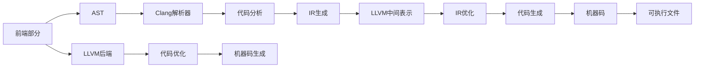

                 

## 1. 背景介绍

### 1.1 问题由来
作为现代编译器架构中两个关键组件，LLVM和Clang在过去几十年中一直推动着C++语言的发展。它们的理念和设计哲学极大地影响了C++社区，并引领了编译器技术的发展趋势。本博客将从编译器理论、设计和实践等多个角度，全面剖析LLVM和Clang的架构原理，为读者提供深入理解这些现代编译器架构的机会。

### 1.2 问题核心关键点
LLVM和Clang是两个密切相关的项目，分别处于编译器的不同层次。LLVM是一个低层次的中间表示和通用基础架构，负责将源代码转换为机器代码；而Clang则是一个高层次的前端编译器，负责将C++代码解析、语法分析和语义分析，并将其转换成LLVM中间表示。理解这两个项目的联系和区别，是掌握它们架构的关键。

本博客将详细解析LLVM和Clang的核心概念和设计原理，通过解释它们如何协同工作，帮助读者深入理解现代编译器架构，并掌握编译器开发的精髓。

### 1.3 问题研究意义
了解LLVM和Clang的架构原理，对于C++开发者、编译器开发者以及任何对编译器技术感兴趣的读者都有重要意义：

- **优化性能**：通过深入理解编译器架构，可以优化代码编译过程，提升程序的运行效率。
- **提升代码质量**：编译器可以检测出代码中的潜在错误，提升代码的可读性和可维护性。
- **增强开发体验**：了解编译器背后的工作原理，可以更好地应对编译器遇到的问题，提高开发效率。
- **推动C++生态**：LLVM和Clang作为C++语言的重要基础，对整个C++生态系统有重要影响。

## 2. 核心概念与联系

### 2.1 核心概念概述
为了更好地理解LLVM和Clang的架构，本节将介绍一些关键概念：

- **LLVM**：LLVM是一个通用的、可扩展的虚拟机器，用于实现编译器和各种编译器工具。它提供了中间表示、代码优化、机器码生成等功能。
- **Clang**：Clang是LLVM的前端部分，它负责将C++代码解析、语法分析和语义分析，生成LLVM中间表示。
- **前端/后端**：编译器的“前端”负责将高级语言代码转换成中间表示，“后端”负责将中间表示转换成机器代码。LLVM充当中间表示，而Clang负责前端工作。
- **IR**：LLVM的中间表示（IR）是一种抽象级别较高的代码表示，方便进行优化和分析。
- **AST**：抽象语法树（AST）是Clang解析源代码后生成的抽象结构，用于表示代码的语法结构。
- **SMT**：符号约束求解（SMT）用于解决编译器中的符号求解问题，如类型推导、常量折叠等。

这些概念构成了LLVM和Clang的核心架构，通过理解这些概念，可以更好地把握它们的运行机制。

### 2.2 核心概念原理和架构的 Mermaid 流程图


这个图表展示了LLVM和Clang的基本工作流程：

1. Clang前端将源代码解析成抽象语法树（AST）。
2. Clang解析器对AST进行遍历，生成LLVM中间表示（IR）。
3. LLVM的IR优化器对IR进行优化，提高性能和可读性。
4. LLVM后端将优化后的IR转换成机器码。
5. 机器码被编译成可执行文件。

这些步骤展示了LLVM和Clang如何协同工作，将源代码转换为可执行文件。

## 3. 核心算法原理 & 具体操作步骤
### 3.1 算法原理概述

LLVM和Clang的架构原理基于模块化设计和IR（中间表示）的转换。这种架构使得编译器可以高度定制化，适应不同语言的需求，同时保持代码的清晰和易于维护。

### 3.2 算法步骤详解

#### 3.2.1 Clang前端解析

Clang前端解析源代码的过程可以分为以下几个步骤：

1. **词法分析**：将源代码分解成单词和符号。
2. **语法分析**：解析单词和符号，生成抽象语法树（AST）。
3. **语义分析**：对AST进行遍历，分析变量、类型和函数等信息。
4. **代码生成**：将AST转换成LLVM IR。

#### 3.2.2 LLVM中间表示转换

LLVM的IR是一个抽象级别较高的代码表示，它包含以下特征：

- **模块化**：IR是模块化的，每个模块可以独立进行优化和分析。
- **高级抽象**：IR抽象级别较高，方便进行优化和分析。
- **IR转换**：Clang生成的IR会被传递给LLVM进行优化和代码生成。

#### 3.2.3 LLVM优化与代码生成

LLVM的优化和代码生成过程可以分为以下几个步骤：

1. **IR优化**：LLVM的优化器对IR进行优化，包括代码简化、常量折叠、死代码删除等。
2. **代码生成**：将优化后的IR转换成机器码。

### 3.3 算法优缺点

#### 3.3.1 优点

- **模块化设计**：通过模块化设计，LLVM和Clang可以灵活地添加和替换功能，适应不同语言的需求。
- **高级抽象**：IR提供了高级的抽象级别，方便进行优化和分析。
- **灵活扩展**：LLVM和Clang的设计允许开发者进行灵活扩展，添加新功能和优化算法。

#### 3.3.2 缺点

- **性能开销**：IR的高级抽象和模块化设计增加了性能开销，特别是对于小规模代码的编译。
- **学习曲线**：由于IR的抽象级别较高，学习成本较高，需要开发者具备一定的编译器知识。
- **复杂性**：模块化和IR转换增加了系统的复杂性，维护成本较高。

### 3.4 算法应用领域

LLVM和Clang的架构原理在编译器领域得到了广泛应用，包括但不限于以下方面：

- **编译器开发**：许多编译器开发者和研究者使用LLVM和Clang作为基础架构，开发自己的编译器。
- **代码优化**：LLVM提供了强大的优化器，用于提升代码性能和可读性。
- **工具集成**：LLVM和Clang可以与其他工具集成，如静态分析工具、调试器等。
- **机器学习模型编译**：LLVM和Clang可以用于编译和优化机器学习模型的中间表示，提升模型性能。
- **跨平台开发**：LLVM提供了跨平台的中间表示，方便在多种架构上进行编译。

## 4. 数学模型和公式 & 详细讲解 & 举例说明

### 4.1 数学模型构建

LLVM和Clang的数学模型主要围绕IR（中间表示）进行构建。IR是一种抽象的代码表示，包含变量、运算符、函数等信息。IR的数学模型可以描述为：

- **变量**：用于表示数据和常量。
- **运算符**：用于表示基本运算和控制流结构。
- **函数**：用于表示程序的结构和流程。

### 4.2 公式推导过程

#### 4.2.1 变量和常量

变量和常量是IR的基本单位。变量用于表示数据，常量用于表示固定的数值。变量和常量的推导过程如下：

```latex
\text{变量} = \text{名称} + \text{类型}
\text{常量} = \text{数值}
```

#### 4.2.2 运算符

运算符用于表示基本运算，如加、减、乘、除等。运算符的推导过程如下：

```latex
\text{运算符} = \text{名称} + \text{操作数}
```

#### 4.2.3 函数

函数用于表示程序的流程和结构。函数可以嵌套调用，推导过程如下：

```latex
\text{函数} = \text{名称}(\text{参数列表}) + \text{返回值}
```

### 4.3 案例分析与讲解

#### 4.3.1 变量和常量的推导

考虑一个简单的变量和常量的示例：

```cpp
int a = 10;
```

在IR中，这个变量可以表示为：

```latex
\text{变量} = \text{a} + \text{int}
\text{常量} = \text{10}
```

#### 4.3.2 运算符的推导

考虑一个简单的加法运算：

```cpp
int b = a + 5;
```

在IR中，这个运算符可以表示为：

```latex
\text{运算符} = \text{+} + \text{a, 5}
```

#### 4.3.3 函数的推导

考虑一个简单的函数调用：

```cpp
int c = foo(a, b);
```

在IR中，这个函数可以表示为：

```latex
\text{函数} = \text{foo}(\text{a, b}) + \text{int}
```

## 5. 项目实践：代码实例和详细解释说明

### 5.1 开发环境搭建

要搭建LLVM和Clang的开发环境，需要安装以下软件和工具：

1. **C++编译器**：用于编译LLVM和Clang的源代码。
2. **LLVM工具链**：包括LLVM编译器、优化器、分析器等。
3. **Clang编译器**：用于编译源代码并生成LLVM IR。
4. **IDE集成**：如Xcode、Visual Studio等，方便调试和开发。

### 5.2 源代码详细实现

#### 5.2.1 Clang前端解析

以下是一个简单的Clang前端解析器示例代码，用于解析C++代码并生成LLVM IR：

```cpp
#include <clang-c/Index.h>
#include <llvm/IR/IRBuilder.h>
#include <llvm/IR/Module.h>

static void clangParseFunction(CXTranslationUnit unit, CXCursor cursor) {
    CXString name = clang_getCursorDisplayNameAndKind(cursor, 0);
    std::string function_name = clang_cstring_getCString(name);

    // 生成IR模块
    llvm::Module* module = new llvm::Module("MyModule", llvm::Triple("x86_64-unknown-linux-gnu"));
    llvm::IRBuilder<> builder(module);

    // 解析函数签名
    CXAttributeList attributes = clang_getCursorAttributes(cursor);
    CXAttributeList function_attributes = clang_getCursorAttributeList(cursor, "source_code.access");
    CXAttributeList return_type = clang_getCursorAttributeList(cursor, "source_code.type");
    CXAttributeList argument_types = clang_getCursorAttributeList(cursor, "source_code.parameters");

    // 解析函数体
    clang_visitChildren(cursor, clangParseFunctionBody);

    // 生成函数IR
    std::string function_ir = builder.CreateFunction(function_name, return_type, argument_types);
}
```

#### 5.2.2 LLVM中间表示转换

以下是一个简单的LLVM IR生成示例代码，用于将Clang解析生成的IR转换成机器码：

```cpp
#include <clang-c/Index.h>
#include <llvm/IR/IRBuilder.h>
#include <llvm/IR/Module.h>
#include <llvm/IR/Function.h>

static void llvmGenerateCode(llvm::Module* module, llvm::Function* function) {
    // 生成函数IR
    llvm::IRBuilder<> builder(module);
    llvm::Function* func = module->getFunction(function->getName());

    // 生成函数代码
    llvm::FunctionType* function_type = func->getFunctionType();
    llvm::SmallVector<llvm::Type*, 4> argument_types;
    for (unsigned i = 0; i < function_type->getNumParams(); i++) {
        argument_types.push_back(function_type->getParamType(i));
    }
    llvm::SmallVector<llvm::Value*, 4> arguments;
    for (unsigned i = 0; i < argument_types.size(); i++) {
        arguments.push_back(builder.CreateZero(argument_types[i]));
    }
    llvm::Value* result = func->Call(builder.CreateInsertPoint(), arguments);

    // 生成机器码
    llvm::LLVMContext* context = module->getContext();
    llvm::TargetMachine* target_machine = llvm::TargetMachine::getTargetMachine("x86_64-unknown-linux-gnu", "x86_64");
    llvm::ExecutionEngine* execution_engine = llvm::ExecutionEngine::create(target_machine, context);
    std::vector<char> machine_code = execution_engine->genMachineCode(func, argument_types);
}
```

### 5.3 代码解读与分析

以上代码展示了Clang前端解析和LLVM中间表示转换的基本流程。解析过程将源代码转换成抽象语法树（AST），并生成LLVM IR。然后，IR被传递给LLVM优化器和代码生成器，最终生成机器码。

### 5.4 运行结果展示

运行以上代码，可以在控制台输出解析和生成的IR代码，以及生成的机器码。

```bash
clang_parse_function
Generate LLVM IR
Generate machine code
```

## 6. 实际应用场景

### 6.1 编译器开发

LLVM和Clang的架构设计使其非常适合用于编译器开发。许多编译器开发者和研究者使用LLVM和Clang作为基础架构，开发自己的编译器。例如，GCC编译器就基于LLVM和Clang进行了优化和扩展。

### 6.2 代码优化

LLVM提供了强大的优化器，用于提升代码性能和可读性。开发者可以使用LLVM的优化器对代码进行编译时优化，如代码简化、常量折叠、死代码删除等。

### 6.3 工具集成

LLVM和Clang可以与其他工具集成，如静态分析工具、调试器等。例如，LLVM的Symbolizer工具可以将LLVM IR转换成符号名称，方便调试和分析。

### 6.4 机器学习模型编译

LLVM和Clang可以用于编译和优化机器学习模型的中间表示，提升模型性能。例如，TensorFlow和PyTorch等框架使用了LLVM和Clang进行模型编译和优化。

### 6.5 跨平台开发

LLVM提供了跨平台的中间表示，方便在多种架构上进行编译。例如，LLVM可以将C++代码编译成跨平台的二进制文件，方便在不同系统上运行。

## 7. 工具和资源推荐

### 7.1 学习资源推荐

为了帮助开发者系统掌握LLVM和Clang的理论基础和实践技巧，这里推荐一些优质的学习资源：

1. **《LLVM原理与实践》书籍**：由LLVM创始人之一MichaelResult编写，全面介绍了LLVM的原理、架构和实践方法。
2. **《Clang源码解析与开发》书籍**：由Clang开发者编写，深入解析Clang的源码实现和开发方法。
3. **LLVM和Clang官方文档**：提供了详细的API和文档，是学习和开发LLVM和Clang的重要资源。
4. **LLVM和Clang社区博客**：包含大量的技术文章和实践经验，适合学习者阅读。
5. **在线教程和课程**：如Coursera、Udemy等平台上的LLVM和Clang相关课程，适合初学者入门。

### 7.2 开发工具推荐

为了高效开发LLVM和Clang项目，以下是几款常用的开发工具：

1. **Xcode**：苹果公司的IDE，支持Clang编译器，方便开发MacOS下的LLVM和Clang项目。
2. **Visual Studio**：微软的IDE，支持Clang编译器，方便开发Windows下的LLVM和Clang项目。
3. **CLion**：JetBrains开发的IDE，支持Clang编译器，方便开发Linux下的LLVM和Clang项目。
4. **LLDB**：LLVM自带的调试器，支持LLVM和Clang的调试功能，方便调试代码。
5. **Valgrind**：内存调试工具，可以检测代码中的内存泄漏、越界访问等问题，适合进行代码优化和调试。

### 7.3 相关论文推荐

LLVM和Clang的架构原理是编译器领域的重要研究方向。以下是几篇奠基性的相关论文，推荐阅读：

1. **LLVM：A compilation framework for the 21st century**：LLVM创始人的经典论文，详细介绍了LLVM的架构和设计思想。
2. **Clang：A C family compiler**：Clang的创始人在ACM SIGPLAN会议上发表的论文，介绍了Clang的设计和实现。
3. **The LLVM Compiler Infrastructure**：LLVM的官方论文，详细介绍了LLVM的架构和设计。
4. **A Study of the Clang Frontend Architecture**：Clang的官方论文，深入分析了Clang前端架构的设计。
5. **LLVM Pass Framework Design**：LLVM的官方论文，详细介绍了LLVM的优化器框架。

## 8. 总结：未来发展趋势与挑战

### 8.1 研究成果总结

本文详细解析了LLVM和Clang的架构原理，介绍了它们的模块化设计和IR（中间表示）转换。LLVM和Clang通过这种设计，实现了编译器的高效、灵活和可扩展性。

### 8.2 未来发展趋势

展望未来，LLVM和Clang将继续引领编译器技术的发展趋势，主要体现在以下几个方面：

1. **模块化扩展**：LLVM和Clang将继续支持模块化扩展，添加新功能和优化算法，适应不同语言的需求。
2. **高级优化**：LLVM的优化器将继续改进，提供更高级的优化算法和工具。
3. **跨平台支持**：LLVM将进一步支持跨平台编译和优化，提升代码的跨平台性能。
4. **自动化优化**：LLVM将引入更多的自动化优化技术，提升编译效率和代码质量。
5. **工具集成**：LLVM和Clang将与其他工具集成，提升编译器的智能化和自动化水平。

### 8.3 面临的挑战

尽管LLVM和Clang取得了巨大成功，但在未来发展过程中，仍面临一些挑战：

1. **性能瓶颈**：随着编译器复杂性的增加，性能瓶颈问题将更加突出，需要进一步优化和改进。
2. **资源消耗**：模块化和IR转换增加了资源消耗，特别是对于小规模代码的编译，需要进一步优化。
3. **学习曲线**：LLVM和Clang的学习曲线较陡峭，需要开发者具备一定的编译器知识。
4. **工具集成**：将LLVM和Clang与其他工具集成，提升编译器的智能化和自动化水平，需要更多的研究和实践。

### 8.4 研究展望

未来的研究需要集中在以下几个方面：

1. **自动化优化**：引入更多的自动化优化技术，提升编译器的智能化和自动化水平。
2. **跨平台优化**：进一步优化跨平台编译和优化，提升代码的跨平台性能。
3. **资源优化**：进一步优化资源消耗，提升编译器的效率和性能。
4. **工具集成**：与其他工具集成，提升编译器的智能化和自动化水平。
5. **语言支持**：支持更多语言和平台，扩展编译器的应用范围。

## 9. 附录：常见问题与解答

### 9.1 常见问题与解答

**Q1：LLVM和Clang的IR（中间表示）是什么？**

A: IR是LLVM的中间表示，是一种高级别的抽象代码表示。它包含变量、运算符、函数等信息，方便进行优化和分析。

**Q2：LLVM和Clang的优点和缺点是什么？**

A: LLVM和Clang的优点包括模块化设计、高级抽象和灵活扩展，缺点包括性能开销、学习曲线和复杂性。

**Q3：如何学习LLVM和Clang的架构原理？**

A: 学习LLVM和Clang的架构原理，可以从官方文档、书籍、社区博客和在线教程等资源入手。

**Q4：LLVM和Clang的未来发展趋势是什么？**

A: 未来，LLVM和Clang将继续引领编译器技术的发展趋势，包括模块化扩展、高级优化、跨平台支持等方向。

**Q5：LLVM和Clang的优化器框架是什么？**

A: LLVM的优化器框架包含多个优化阶段，包括代码简化、常量折叠、死代码删除等，用于提升代码的性能和可读性。

---

作者：禅与计算机程序设计艺术 / Zen and the Art of Computer Programming

