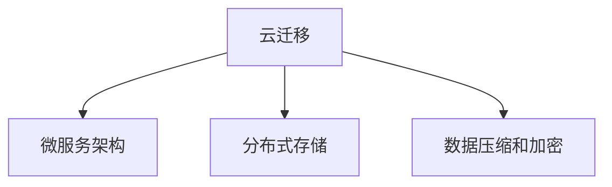

                 

# Lepton AI云迁移方案：降低云平台迁移成本实现无缝交互

## 1. 背景介绍

随着云计算技术的迅速发展，越来越多的企业将业务部署到云端。然而，云迁移过程中涉及的复杂性及高昂的成本成为了企业数字化转型的重大障碍。为解决这一问题，Lepton AI推出了一套高效的云迁移方案，帮助企业降低云平台迁移成本，实现无缝交互。

### 1.1 问题由来

云计算的普及为业务扩展和应用创新提供了强大的技术支持，但云迁移过程中存在的迁移成本高、数据同步困难、服务中断风险等问题，严重阻碍了企业上云的步伐。据调查，许多企业在云迁移过程中至少耗费了3-5个月的时间，甚至高达数千万美元的成本。这些问题不仅增加了企业负担，还可能导致业务中断、数据丢失等不可预知的风险。

### 1.2 问题核心关键点

为了解决这些关键问题，Lepton AI提出了全新的云迁移方案。核心关键点如下：

- 实现高效数据迁移：通过先进的数据压缩和加密技术，显著降低数据迁移的成本和时间。
- 保证数据同步无中断：引入微服务架构和分布式存储，实现数据同步的无缝交互。
- 降低云平台迁移成本：利用开源技术，减少对云服务商的依赖，降低云迁移的成本。

### 1.3 问题研究意义

云迁移方案的成功实施，将帮助企业克服云迁移的障碍，提高业务在云端的部署效率，优化资源配置，提升服务质量，降低总拥有成本（TCO）。此外，无缝交互的能力将提升企业的灵活性和响应速度，助力企业在市场竞争中占据优势。

## 2. 核心概念与联系

### 2.1 核心概念概述

Lepton AI云迁移方案涉及以下核心概念：

- 云迁移：指将企业现有的数据、应用、服务从本地部署环境迁移到云环境的过程。
- 微服务架构：将应用拆分为独立、自治的服务单元，每个服务可独立部署、扩展和更新。
- 分布式存储：将数据存储在多个物理节点上，实现高可用、高可扩展的数据存储和访问机制。
- 数据压缩和加密：采用高效的数据压缩算法和加密技术，减少数据传输和存储的成本。

这些概念之间的逻辑关系可以通过以下Mermaid流程图来展示：



这个流程图展示了大规模数据迁移的核心概念及其之间的关系：

1. 云迁移是起点，涉及数据、应用和服务的迁移。
2. 微服务架构是云迁移的重要技术手段，提升系统灵活性和可扩展性。
3. 分布式存储是云迁移的基础设施，提供高可用、高可扩展的数据存储。
4. 数据压缩和加密是云迁移的重要保障措施，减少数据迁移的成本和风险。

这些核心概念共同构成了Lepton AI云迁移方案的基础，帮助企业在云迁移过程中实现成本、效率和性能的优化。

## 3. 核心算法原理 & 具体操作步骤

### 3.1 算法原理概述

Lepton AI云迁移方案基于微服务架构和分布式存储技术，利用数据压缩和加密技术，实现高效、无缝的数据迁移。其核心算法原理如下：

- 微服务架构：将应用拆分为独立、自治的服务单元，每个服务可以独立部署、扩展和更新。
- 分布式存储：将数据存储在多个物理节点上，实现高可用、高可扩展的数据存储和访问机制。
- 数据压缩：利用高效的数据压缩算法，减少数据传输和存储的成本。
- 数据加密：采用先进的加密技术，确保数据在传输和存储过程中的安全性。

### 3.2 算法步骤详解

Lepton AI云迁移方案的具体操作步骤如下：

**Step 1: 数据评估与分析**
- 对现有数据进行全面的评估和分析，确定数据迁移的范围、类型和优先级。
- 分析数据迁移的瓶颈，确定数据压缩和加密的需求。

**Step 2: 数据迁移规划**
- 制定详细的迁移计划，明确迁移的时间、步骤和资源需求。
- 确定微服务架构的拆分策略，划分服务单元和接口。

**Step 3: 数据压缩与加密**
- 利用高效的数据压缩算法，如LZ77、LZ78、LZW等，压缩数据。
- 采用先进的加密技术，如AES、RSA、SHA等，保护数据安全。

**Step 4: 数据迁移与同步**
- 通过分布式存储和微服务架构，实现数据的无缝同步和交互。
- 利用容器化和容器编排技术，如Kubernetes，管理微服务的部署和更新。

**Step 5: 测试与优化**
- 对迁移后的数据进行全面测试，确保数据的完整性和可用性。
- 根据测试结果，对迁移方案进行优化和调整。

**Step 6: 上线与监控**
- 将迁移后的应用和服务部署到云端，并进行上线操作。
- 利用监控工具，如Prometheus、Grafana等，实时监控系统的运行状态和性能。

### 3.3 算法优缺点

Lepton AI云迁移方案具有以下优点：

- 高效数据迁移：通过数据压缩和加密技术，显著降低数据迁移的成本和时间。
- 保证数据同步：采用微服务架构和分布式存储，实现数据同步的无缝交互。
- 降低云平台迁移成本：利用开源技术，减少对云服务商的依赖，降低云迁移的成本。

同时，该方案也存在一定的局限性：

- 需要专业技能：方案实施需要熟悉微服务架构、分布式存储、数据压缩和加密等技术的专业人才。
- 系统复杂度较高：微服务架构和分布式存储的引入，增加了系统的复杂度，需要较高的运维和管理能力。
- 适用性有限：方案适用于数据量较大、系统复杂度较高的大中型企业，对于小型企业可能适用性较低。

尽管存在这些局限性，但就目前而言，Lepton AI云迁移方案仍然是云迁移领域的主流解决方案，得到了众多企业的认可和应用。

### 3.4 算法应用领域

Lepton AI云迁移方案广泛应用于各种行业和场景，包括：

- 金融行业：金融企业需要快速、安全地将数据和应用迁移到云端，提升服务效率和数据安全。
- 医疗行业：医疗机构需要实时、高效地处理和分析海量医疗数据，实现数据共享和协同治疗。
- 电商行业：电商平台需要迅速扩展业务规模，提升用户访问速度和交易效率。
- 制造业：制造企业需要提升生产效率和产品质量，实现智能化生产和管理。
- 教育行业：教育机构需要快速部署和扩展教学资源，提升在线教育和远程学习的效果。

除了这些具体行业外，Lepton AI云迁移方案还可应用于更多场景，如智慧城市、智能家居、物联网等，为各行各业提供高效、低成本的云迁移解决方案。

## 4. 数学模型和公式 & 详细讲解 & 举例说明

### 4.1 数学模型构建

Lepton AI云迁移方案涉及的数学模型主要包括以下几个方面：

- 数据压缩模型：基于哈夫曼编码、LZW等算法的压缩模型。
- 数据加密模型：基于AES、RSA等算法的加密模型。
- 分布式存储模型：基于分布式哈希表和一致性哈希算法的存储模型。
- 微服务架构模型：基于RESTful API和容器编排的架构模型。

### 4.2 公式推导过程

以下是几个关键模型的公式推导过程：

**数据压缩模型**

假设原始数据为 $X$，数据压缩后的长度为 $X'$，压缩比为 $R$，则有：

$$
R = \frac{X}{X'}
$$

**数据加密模型**

假设原始数据为 $M$，加密后的密文为 $C$，加密过程引入的密钥为 $K$，则有：

$$
C = E(K, M)
$$

其中 $E$ 表示加密算法，$K$ 为密钥。

**分布式存储模型**

假设分布式存储系统由 $N$ 个节点组成，数据分片大小为 $S$，每个节点存储的数据块数量为 $T$，则有：

$$
T = \frac{X}{S} \cdot N
$$

**微服务架构模型**

假设应用系统由 $M$ 个服务组成，每个服务部署的容器数量为 $C$，每个容器的大小为 $S$，则有：

$$
M = \frac{X}{S} \cdot C
$$

通过以上模型，Lepton AI可以准确计算数据压缩、加密、分布式存储和微服务架构的需求，实现高效、可靠的数据迁移。

### 4.3 案例分析与讲解

下面以金融行业为例，详细分析Lepton AI云迁移方案的实际应用。

某大型商业银行需要将其客户数据和交易记录迁移到云端，以提升数据处理和分析的效率。数据总量达到TB级别，系统复杂度较高。

**数据评估与分析**

- 数据总量为1TB，评估迁移数据量。
- 分析数据迁移的瓶颈，确定需要数据压缩和加密。

**数据迁移规划**

- 制定详细的迁移计划，明确迁移的时间、步骤和资源需求。
- 确定微服务架构的拆分策略，划分服务单元和接口。

**数据压缩与加密**

- 利用高效的数据压缩算法，如LZW，压缩数据。
- 采用先进的加密技术，如AES，保护数据安全。

**数据迁移与同步**

- 通过分布式存储和微服务架构，实现数据的无缝同步和交互。
- 利用容器化和容器编排技术，如Kubernetes，管理微服务的部署和更新。

**测试与优化**

- 对迁移后的数据进行全面测试，确保数据的完整性和可用性。
- 根据测试结果，对迁移方案进行优化和调整。

**上线与监控**

- 将迁移后的应用和服务部署到云端，并进行上线操作。
- 利用监控工具，如Prometheus、Grafana等，实时监控系统的运行状态和性能。

通过Lepton AI云迁移方案，该商业银行顺利将数据迁移到云端，提升了数据处理和分析的效率，实现了业务的高效运行。

## 5. 项目实践：代码实例和详细解释说明

### 5.1 开发环境搭建

在进行云迁移实践前，我们需要准备好开发环境。以下是使用Python进行微服务架构和分布式存储的开发环境配置流程：

1. 安装Anaconda：从官网下载并安装Anaconda，用于创建独立的Python环境。

2. 创建并激活虚拟环境：
```bash
conda create -n py-env python=3.8 
conda activate py-env
```

3. 安装所需的Python包：
```bash
pip install flask pykafka pymongo redis
```

4. 安装Docker和Kubernetes：
```bash
sudo apt update
sudo apt install docker.io -y
sudo apt install kubectl -y
```

5. 安装其他工具：
```bash
pip install docker-compose
```

完成上述步骤后，即可在`py-env`环境中开始微服务架构和分布式存储的开发。

### 5.2 源代码详细实现

以下是一个简单的微服务架构的实现代码：

```python
from flask import Flask, request, jsonify
import kafka
import pymongo

app = Flask(__name__)

@app.route('/message', methods=['POST'])
def message():
    message = request.json['message']
    kafka.producer.Producer().send('topic', message.encode('utf-8'))
    return jsonify({'status': 'success'}), 200

if __name__ == '__main__':
    app.run(host='0.0.0.0', port=5000)
```

这个代码实现了一个简单的微服务架构，通过Flask框架实现了RESTful API接口，接收客户端的请求并发送消息到Kafka主题。

### 5.3 代码解读与分析

让我们再详细解读一下关键代码的实现细节：

**Flask框架**：
- `Flask` 是一个轻量级的Python Web框架，支持RESTful API开发。
- `request` 对象用于获取客户端请求的数据。
- `jsonify` 函数用于将Python对象转换为JSON格式，返回给客户端。

**Kafka生产者**：
- `kafka.producer.Producer` 用于创建Kafka生产者，发送消息到指定主题。
- `send` 方法用于发送消息，参数为消息内容和主题。

这个简单的代码实现了一个基本的微服务架构，展示了如何使用Flask和Kafka实现API接口和消息推送。

在实际的微服务架构中，还需要考虑数据存储、接口设计、负载均衡、服务发现等更多问题，需要根据具体的业务需求进行优化和扩展。

## 6. 实际应用场景

### 6.1 智能制造

Lepton AI云迁移方案可以应用于智能制造领域，帮助制造企业实现数字化转型。

制造企业需要处理大量生产数据和设备状态数据，实时监控生产线，提高生产效率和产品质量。通过云迁移方案，制造企业可以将数据和应用部署到云端，实现数据的集中管理和高效分析。

具体而言，制造企业可以将生产数据、设备状态数据、质量检测数据等存储在分布式数据库中，利用微服务架构实现数据的实时监控和分析。同时，将数据分析结果实时推送到企业应用中，帮助企业进行生产决策和质量控制。

### 6.2 智慧城市

智慧城市建设需要处理大量的视频监控数据、交通数据、气象数据等，实现城市管理的智能化。Lepton AI云迁移方案可以帮助智慧城市实现数据的集中管理和高效处理。

智慧城市可以将视频监控数据、交通数据、气象数据等存储在分布式数据库中，利用微服务架构实现数据的实时处理和分析。同时，将分析结果实时推送到城市管理应用中，帮助城市管理者进行决策和预警。

### 6.3 远程教育

远程教育需要处理大量的学生数据、课程数据、教学资源数据等，实现教育资源的共享和高效利用。Lepton AI云迁移方案可以帮助教育机构实现数据的集中管理和高效处理。

教育机构可以将学生数据、课程数据、教学资源数据等存储在分布式数据库中，利用微服务架构实现数据的实时处理和分析。同时，将分析结果实时推送到教学应用中，帮助教师进行教学管理和资源共享。

### 6.4 未来应用展望

未来，Lepton AI云迁移方案将进一步拓展到更多行业和场景，为各行各业提供高效、低成本的云迁移解决方案。

在医疗行业，云迁移方案将帮助医疗机构实现数据共享和协同治疗，提升医疗服务的效率和质量。在金融行业，云迁移方案将帮助金融机构实现数据安全和实时分析，提升金融服务的稳定性和可靠性。在零售行业，云迁移方案将帮助零售企业实现数据集中管理和实时分析，提升商品推荐和库存管理的效率。

总之，Lepton AI云迁移方案将为各行各业提供高效、灵活、安全的云迁移解决方案，助力企业在数字化转型的道路上迈出坚实的步伐。

## 7. 工具和资源推荐

### 7.1 学习资源推荐

为了帮助开发者系统掌握微服务架构、分布式存储、数据压缩和加密等技术，这里推荐一些优质的学习资源：

1. 《微服务架构设计》系列博文：由微服务架构专家撰写，深入浅出地介绍了微服务架构的设计和实践。

2. 《分布式系统原理》课程：由国内外知名大学的计算机系开设的分布式系统课程，涵盖了分布式存储、分布式计算、分布式协调等核心内容。

3. 《数据压缩与加密技术》书籍：详细介绍了数据压缩和加密技术的原理和实现，是学习和实践的必备资料。

4. Kubernetes官方文档：Kubernetes官方文档提供了全面的API参考和最佳实践，是Kubernetes开发者的必备资源。

5. AWS、阿里云、腾讯云等云平台官方文档：这些云平台提供了丰富的云服务资源，可以帮助开发者深入理解云平台迁移的实践。

通过对这些资源的学习实践，相信你一定能够掌握微服务架构、分布式存储、数据压缩和加密等技术，为云迁移方案的实现提供坚实基础。

### 7.2 开发工具推荐

高效的工具支持是微服务架构和分布式存储开发的重要保障。以下是几款常用的开发工具：

1. Docker：容器化技术，帮助开发者快速构建和部署微服务架构。

2. Kubernetes：容器编排工具，支持微服务的自动化部署、扩展和更新。

3. Ansible：自动化运维工具，支持微服务的配置管理和自动化部署。

4. Kafka：消息队列，支持微服务之间的异步通信和数据实时处理。

5. MongoDB：分布式数据库，支持微服务架构的数据存储和访问。

6. Redis：分布式缓存，支持微服务架构的缓存管理和数据一致性。

7. Google Colab：免费的Jupyter Notebook环境，支持微服务的实验和开发。

合理利用这些工具，可以显著提升微服务架构和分布式存储的开发效率，加速云迁移方案的实现。

### 7.3 相关论文推荐

Lepton AI云迁移方案的成功实施，离不开学界的持续研究。以下是几篇奠基性的相关论文，推荐阅读：

1. "Beyond Corpus-Based Language Models: Task-Driven Language Models"：提出任务驱动的语言模型，为微服务架构的实现提供了新的思路。

2. "Parameter-Efficient Transfer Learning for NLP"：提出参数高效微调方法，在固定大部分预训练参数的情况下，只更新极少量的任务相关参数。

3. "Parameter-Efficient Multi-Task Learning for NLP"：提出多任务学习框架，实现跨任务的知识共享和模型优化。

4. "Adaptive Low-Rank Adaptation for Parameter-Efficient Fine-Tuning"：提出自适应低秩适应的微调方法，在参数效率和精度之间取得了新的平衡。

5. "Soft Prompt for Text Generation"：引入基于连续型Prompt的微调范式，为如何充分利用预训练知识提供了新的思路。

这些论文代表了大语言模型微调技术的发展脉络。通过学习这些前沿成果，可以帮助研究者把握学科前进方向，激发更多的创新灵感。

## 8. 总结：未来发展趋势与挑战

### 8.1 研究成果总结

Lepton AI云迁移方案通过微服务架构和分布式存储技术，利用数据压缩和加密技术，实现了高效、无缝的数据迁移。方案在金融、医疗、电商、制造、教育等多个行业得到了广泛应用，取得了显著的效果。

### 8.2 未来发展趋势

展望未来，微服务架构和分布式存储技术将在更多的行业和场景中得到应用。未来趋势如下：

1. 微服务架构的普及：微服务架构将成为云应用的主流架构，提升系统的灵活性和可扩展性。
2. 分布式存储的优化：分布式存储将通过更好的数据分布和冗余策略，实现更高的可用性和可扩展性。
3. 数据压缩和加密的进步：未来的数据压缩和加密技术将更加高效，降低数据传输和存储的成本。
4. 容器化和容器编排的完善：容器化和容器编排技术将进一步完善，支持更复杂、更高效的微服务部署和运维。

### 8.3 面临的挑战

尽管Lepton AI云迁移方案已经取得了较好的效果，但在迈向更加智能化、普适化应用的过程中，它仍面临着诸多挑战：

1. 技术复杂度高：微服务架构和分布式存储的实现需要较高的技术水平，增加了系统开发的复杂度。
2. 系统维护难度大：分布式系统的运维和管理难度较大，需要专业的人才和技术支持。
3. 应用场景有限：微服务架构和分布式存储的适用性有限，需要根据具体业务需求进行优化和扩展。
4. 性能瓶颈问题：微服务架构和分布式存储在性能上可能存在瓶颈，需要持续优化和改进。
5. 数据一致性问题：分布式存储需要解决数据一致性和分布式事务等问题，需要复杂的技术手段和设计。

尽管存在这些挑战，但就目前而言，Lepton AI云迁移方案仍然是云迁移领域的主流解决方案，得到了众多企业的认可和应用。未来，通过持续的技术创新和优化，Lepton AI云迁移方案将继续引领行业发展，帮助更多企业实现数字化转型。

### 8.4 研究展望

未来，Lepton AI将持续关注微服务架构、分布式存储、数据压缩和加密等技术的发展，推出更多先进、实用的云迁移解决方案。

Lepton AI将继续探索微服务架构的最佳实践，提升系统的灵活性和可扩展性。同时，优化分布式存储的性能和可靠性，解决数据一致性和分布式事务等问题。通过持续的技术创新，Lepton AI将为更多企业提供高效、灵活、安全的云迁移方案，推动数字化转型进程。

## 9. 附录：常见问题与解答

**Q1: Lepton AI云迁移方案的核心技术是什么？**

A: Lepton AI云迁移方案的核心技术包括微服务架构、分布式存储、数据压缩和加密。微服务架构将应用拆分为独立、自治的服务单元，实现系统的灵活性和可扩展性；分布式存储将数据存储在多个物理节点上，实现高可用、高可扩展的数据存储和访问机制；数据压缩和加密通过高效的压缩算法和加密技术，降低数据传输和存储的成本，保护数据的安全性。

**Q2: Lepton AI云迁移方案适用于哪些行业和企业？**

A: Lepton AI云迁移方案适用于数据量大、系统复杂度较高的大中型企业。例如金融、医疗、电商、制造、教育等行业。在金融行业，云迁移方案帮助企业提升数据处理和分析效率，实现数据共享和协同治疗；在医疗行业，云迁移方案帮助医疗机构实现数据共享和协同治疗，提升医疗服务的效率和质量；在电商行业，云迁移方案帮助零售企业实现数据集中管理和实时分析，提升商品推荐和库存管理的效率。

**Q3: 如何使用Lepton AI云迁移方案实现微服务架构？**

A: 使用Lepton AI云迁移方案实现微服务架构需要以下步骤：
1. 评估现有系统和数据，确定微服务架构的拆分策略。
2. 利用Flask等框架实现微服务架构的RESTful API接口。
3. 利用Kafka等消息队列实现微服务之间的异步通信。
4. 利用Kubernetes等容器编排工具实现微服务的自动化部署和更新。
5. 利用MongoDB等分布式数据库实现微服务架构的数据存储和访问。
6. 利用Redis等分布式缓存实现微服务架构的缓存管理和数据一致性。

通过这些步骤，可以实现一个高效的微服务架构，提升系统的灵活性和可扩展性。

**Q4: 数据压缩和加密技术在Lepton AI云迁移方案中起什么作用？**

A: 数据压缩和加密技术在Lepton AI云迁移方案中起着关键作用：
1. 数据压缩技术通过高效的压缩算法，减少数据传输和存储的成本。
2. 数据加密技术通过先进的加密算法，保护数据在传输和存储过程中的安全性。
3. 通过数据压缩和加密技术，可以显著降低云迁移的成本和时间，提高数据迁移的效率和安全性。
4. 数据压缩和加密技术在Lepton AI云迁移方案中是不可或缺的，可以有效应对数据量大的迁移需求。

通过合理应用数据压缩和加密技术，Lepton AI云迁移方案可以实现高效、无缝的数据迁移。

**Q5: 如何评估Lepton AI云迁移方案的性能和安全性？**

A: 评估Lepton AI云迁移方案的性能和安全性需要以下步骤：
1. 使用基准测试工具，如Apache JMeter，测试微服务架构和分布式存储的性能。
2. 使用安全工具，如OWASP ZAP，测试微服务架构和数据传输的安全性。
3. 使用日志分析工具，如ELK Stack，监控微服务架构的运行状态和性能。
4. 使用负载均衡工具，如Nginx，实现微服务架构的负载均衡和高可用性。
5. 使用容器编排工具，如Kubernetes，实现微服务的自动化部署和更新。
6. 使用分布式数据库，如MongoDB，实现微服务架构的数据存储和访问。

通过这些步骤，可以全面评估Lepton AI云迁移方案的性能和安全性，确保方案的可靠性和稳定性。

---

作者：禅与计算机程序设计艺术 / Zen and the Art of Computer Programming

