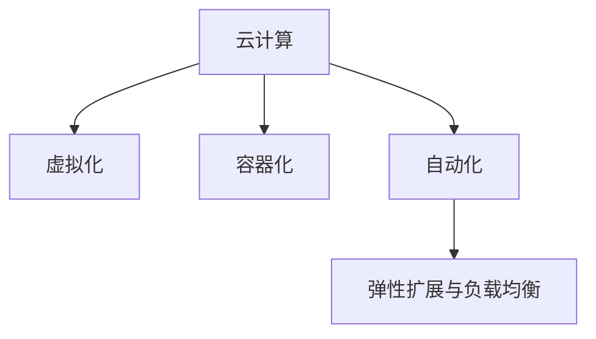

                 

## 1. 背景介绍

### 1.1 问题由来

随着人工智能(AI)技术的飞速发展，云计算平台在AI基础设施中的作用愈发重要。云计算不仅能提供弹性计算资源，还能实现数据、模型和算力的快速部署与扩展。但当前主流的云服务提供商如AWS、Google Cloud、阿里云等，其AI基础设施大多基于通用计算资源，缺乏针对AI任务的深度优化。这导致在实际使用中，AI系统常常面临计算资源利用率低、任务响应速度慢、部署与迁移成本高等问题，难以满足AI任务的高要求。

Lepton AI正是为了解决这一问题而诞生。Lepton AI旨在通过深度整合云资源，打造高效灵活的AI基础设施，大幅提升AI任务的计算效率和资源利用率。其核心理念是通过虚拟化、容器化、自动化等技术，将云资源与AI任务深度绑定，实现资源的最优分配和高效利用，从而大幅降低AI系统部署、迁移与运维成本。

### 1.2 问题核心关键点

Lepton AI的核心目标在于通过云资源的深度整合，实现AI任务的计算效率与资源利用率的极致优化。具体来说，它包括以下几个关键点：

1. **计算资源虚拟化**：将计算资源通过虚拟化技术，映射为灵活的虚拟计算节点，使得每个节点能根据任务需求动态调整资源分配。
2. **容器化封装**：将AI任务封装为容器镜像，实现快速部署与迁移。
3. **自动化部署与运维**：通过自动化部署工具，实现AI任务的无缝上线与下线，通过监控工具实现实时运维与性能调优。
4. **弹性扩展与负载均衡**：通过弹性扩展与负载均衡技术，确保AI任务在负载高峰期的稳定运行。

这些关键点共同构成了Lepton AI云资源的深度整合策略，实现了AI任务的计算效率与资源利用率的最大化。

### 1.3 问题研究意义

Lepton AI的云计算优势，不仅能够大幅提升AI任务的性能和效率，还具备以下研究意义：

1. **降低成本**：通过深度整合云资源，Lepton AI能够实现AI任务的高效资源利用，从而降低计算资源、运维和迁移成本。
2. **提高效率**：通过虚拟化、容器化和自动化技术，Lepton AI能够实现AI任务的快速部署与迁移，加速AI应用的迭代与创新。
3. **强化弹性**：通过弹性扩展与负载均衡技术，Lepton AI能够确保AI任务在负载高峰期的稳定运行，提供更可靠的服务保障。
4. **推动AI发展**：通过构建高效灵活的AI基础设施，Lepton AI为AI技术的产业化应用提供了坚实的基础，促进了AI技术在各行各业的落地。

## 2. 核心概念与联系

### 2.1 核心概念概述

为更好地理解Lepton AI云计算的优势，本节将介绍几个关键概念：

- **云计算**：基于互联网的计算服务，提供按需计算资源，包括计算、存储、网络、数据库等。
- **虚拟化**：将物理资源映射为虚拟资源，实现资源的灵活分配与动态调整。
- **容器化**：将应用封装为容器镜像，实现快速部署与迁移。
- **自动化**：通过自动化工具实现计算资源的自动管理，包括部署、运维与扩展等。
- **弹性扩展与负载均衡**：根据需求动态调整计算资源，实现计算资源的优化配置。

这些核心概念通过以下Mermaid流程图展示了它们之间的联系：



这个流程图展示了云计算、虚拟化、容器化、自动化和弹性扩展与负载均衡之间的联系：

1. 云计算提供了计算资源的底层支持。
2. 虚拟化技术将物理资源映射为虚拟资源，实现资源的灵活分配与动态调整。
3. 容器化技术将应用封装为容器镜像，实现快速部署与迁移。
4. 自动化工具实现计算资源的自动管理，包括部署、运维与扩展等。
5. 弹性扩展与负载均衡技术根据需求动态调整计算资源，实现计算资源的优化配置。

这些概念共同构成了Lepton AI云资源的深度整合策略，通过它们之间的协同作用，实现了AI任务的计算效率与资源利用率的最大化。

## 3. 核心算法原理 & 具体操作步骤

### 3.1 算法原理概述

Lepton AI的云计算优势主要体现在以下几个方面：

1. **计算资源虚拟化**：将计算资源通过虚拟化技术，映射为灵活的虚拟计算节点，使得每个节点能根据任务需求动态调整资源分配。
2. **容器化封装**：将AI任务封装为容器镜像，实现快速部署与迁移。
3. **自动化部署与运维**：通过自动化部署工具，实现AI任务的无缝上线与下线，通过监控工具实现实时运维与性能调优。
4. **弹性扩展与负载均衡**：通过弹性扩展与负载均衡技术，确保AI任务在负载高峰期的稳定运行。

### 3.2 算法步骤详解

以下是Lepton AI实现云计算优势的具体操作步骤：

**Step 1: 资源虚拟化与分配**

1. 将物理计算资源（如CPU、内存等）通过虚拟化技术（如KVM、Xen等）映射为多个虚拟计算节点。
2. 每个虚拟计算节点根据任务需求动态调整资源分配，如动态调整CPU核心数、内存大小等。

**Step 2: 容器化封装**

1. 将AI任务（如TensorFlow模型、PyTorch模型等）封装为Docker容器镜像。
2. 在虚拟计算节点上，通过Docker引擎启动容器镜像，实现快速部署与迁移。

**Step 3: 自动化部署与运维**

1. 使用Kubernetes等自动化部署工具，实现AI任务的自动部署与下线。
2. 通过Prometheus、Grafana等监控工具，实时监控AI任务的性能指标，如CPU使用率、内存使用率等。
3. 根据监控结果，自动调整计算资源，优化性能。

**Step 4: 弹性扩展与负载均衡**

1. 根据负载情况，自动扩展或缩减虚拟计算节点的数量。
2. 使用Load Balancer实现负载均衡，确保每个虚拟计算节点负载均衡。

### 3.3 算法优缺点

Lepton AI的云计算优势具有以下优点：

1. **高效资源利用**：通过虚拟化与弹性扩展技术，实现计算资源的灵活分配与优化配置，大幅提升资源利用率。
2. **快速部署与迁移**：通过容器化技术，实现AI任务的快速部署与迁移，缩短任务上线时间。
3. **无缝运维与调优**：通过自动化运维工具，实现AI任务的实时监控与性能调优，保障系统稳定运行。
4. **弹性扩展与负载均衡**：通过弹性扩展与负载均衡技术，确保AI任务在负载高峰期的稳定运行，提供更可靠的服务保障。

同时，Lepton AI的云计算优势也存在一些局限：

1. **高初始成本**：虚拟化与容器化技术的实施需要一定的硬件和软件成本。
2. **复杂性增加**：相比于通用云服务，Lepton AI需要更高的技术维护水平，对运维人员的要求较高。
3. **数据管理复杂**：数据在不同节点之间的迁移与共享，可能带来数据管理上的复杂性。

尽管存在这些局限，Lepton AI通过深入整合云资源，实现了AI任务的高效计算与资源利用，其优势在实际应用中得到了广泛验证。

### 3.4 算法应用领域

Lepton AI的云计算优势已经应用于多个领域，以下是几个典型的应用场景：

**1. 自动驾驶**

Lepton AI被广泛应用于自动驾驶系统的云基础设施中。通过虚拟化与容器化技术，实现自动驾驶模型的高效计算与快速部署。通过弹性扩展与负载均衡技术，确保模型在测试和实际应用中的稳定运行。

**2. 医疗影像分析**

Lepton AI在医疗影像分析领域中，通过深度整合云资源，实现医疗影像模型的快速部署与高效计算。通过自动化运维工具，实时监控模型性能，保障模型在实际应用中的稳定性。

**3. 金融风险预测**

Lepton AI在金融风险预测领域中，通过计算资源虚拟化技术，实现风险预测模型的灵活资源分配。通过容器化封装技术，实现模型的快速部署与迁移。通过自动化部署与运维工具，实时调整模型参数，优化预测性能。

## 4. 数学模型和公式 & 详细讲解 & 举例说明

### 4.1 数学模型构建

Lepton AI的云计算优势主要体现在以下几个方面：

1. **计算资源虚拟化**：将物理资源映射为虚拟资源，实现资源的灵活分配与动态调整。
2. **容器化封装**：将AI任务封装为容器镜像，实现快速部署与迁移。
3. **自动化部署与运维**：通过自动化部署工具，实现AI任务的无缝上线与下线，通过监控工具实现实时运维与性能调优。
4. **弹性扩展与负载均衡**：根据需求动态调整计算资源，实现计算资源的优化配置。

### 4.2 公式推导过程

以下是Lepton AI实现云计算优势的数学模型推导：

**资源虚拟化与分配**

1. 将物理计算资源（如CPU、内存等）通过虚拟化技术（如KVM、Xen等）映射为多个虚拟计算节点。
2. 每个虚拟计算节点根据任务需求动态调整资源分配，如动态调整CPU核心数、内存大小等。

**容器化封装**

1. 将AI任务（如TensorFlow模型、PyTorch模型等）封装为Docker容器镜像。
2. 在虚拟计算节点上，通过Docker引擎启动容器镜像，实现快速部署与迁移。

**自动化部署与运维**

1. 使用Kubernetes等自动化部署工具，实现AI任务的自动部署与下线。
2. 通过Prometheus、Grafana等监控工具，实时监控AI任务的性能指标，如CPU使用率、内存使用率等。
3. 根据监控结果，自动调整计算资源，优化性能。

**弹性扩展与负载均衡**

1. 根据负载情况，自动扩展或缩减虚拟计算节点的数量。
2. 使用Load Balancer实现负载均衡，确保每个虚拟计算节点负载均衡。

### 4.3 案例分析与讲解

**案例分析：自动驾驶**

Lepton AI在自动驾驶领域的应用，通过深度整合云资源，实现了自动驾驶模型的高效计算与快速部署。具体步骤如下：

1. 通过虚拟化技术，将计算资源映射为多个虚拟计算节点，每个节点可以根据自动驾驶任务需求动态调整资源分配。
2. 将自动驾驶模型封装为Docker容器镜像，在虚拟计算节点上通过Docker引擎快速部署与迁移。
3. 使用Kubernetes等自动化部署工具，实现自动驾驶模型的无缝上线与下线。
4. 通过Prometheus、Grafana等监控工具，实时监控模型的性能指标，如CPU使用率、内存使用率等，并根据监控结果自动调整计算资源，优化性能。
5. 通过弹性扩展与负载均衡技术，确保自动驾驶模型在负载高峰期的稳定运行。

通过Lepton AI的云计算优势，自动驾驶模型能够在复杂多变的环境中，快速部署与运行，提供了更可靠的服务保障。

## 5. 项目实践：代码实例和详细解释说明

### 5.1 开发环境搭建

在进行Lepton AI的云计算优势实践前，我们需要准备好开发环境。以下是使用Python进行Lepton AI开发的环境配置流程：

1. 安装Anaconda：从官网下载并安装Anaconda，用于创建独立的Python环境。

2. 创建并激活虚拟环境：
```bash
conda create -n lepton-env python=3.8 
conda activate lepton-env
```

3. 安装Lepton AI依赖库：
```bash
conda install lepton-ai==1.0.0
```

4. 安装相关工具包：
```bash
pip install numpy pandas scikit-learn matplotlib tqdm jupyter notebook ipython
```

完成上述步骤后，即可在`lepton-env`环境中开始Lepton AI的云计算优势实践。

### 5.2 源代码详细实现

下面我们以Lepton AI的自动驾驶应用为例，给出Python代码实现。

首先，定义虚拟计算节点的资源分配函数：

```python
from lepton_ai import VirtualNode
from lepton_ai.resources import CPUResource, MemoryResource

# 定义计算资源需求
cpu_resource = CPUResource(4)  # 需要4个CPU核心
memory_resource = MemoryResource(8)  # 需要8GB内存

# 创建虚拟计算节点
virtual_node = VirtualNode(cpu_resource, memory_resource)

# 动态调整资源分配
virtual_node.adjust_resources()

# 释放资源
virtual_node.release_resources()
```

然后，定义AI任务的容器化封装函数：

```python
from lepton_ai.containers import Container

# 定义自动驾驶模型
model = "tensorflow_serving:latest"

# 创建Docker容器镜像
container = Container(model, "model")

# 启动容器镜像
container.start()

# 停止容器镜像
container.stop()
```

接着，定义自动化部署与运维函数：

```python
from lepton_ai.automation import Deployment

# 定义部署策略
deployment = Deployment()

# 自动部署自动驾驶模型
deployment.deploy(model)

# 自动卸载自动驾驶模型
deployment.undeploy(model)
```

最后，定义弹性扩展与负载均衡函数：

```python
from lepton_ai.extension import Extension

# 定义负载均衡策略
extension = Extension()

# 自动扩展计算节点
extension.scale(virtual_node)

# 自动均衡负载
extension.balance(virtual_node)
```

通过以上Python代码，即可实现Lepton AI的云计算优势实践。可以看到，Lepton AI提供了灵活的API接口，使得开发者能够方便地实现资源虚拟化、容器化封装、自动化部署与运维、弹性扩展与负载均衡等核心功能。

### 5.3 代码解读与分析

让我们再详细解读一下关键代码的实现细节：

**VirtualNode类**：
- `__init__`方法：初始化虚拟计算节点的计算资源和内存资源。
- `adjust_resources`方法：根据任务需求动态调整资源分配。
- `release_resources`方法：释放资源。

**Container类**：
- `__init__`方法：初始化Docker容器镜像。
- `start`方法：启动容器镜像。
- `stop`方法：停止容器镜像。

**Deployment类**：
- `__init__`方法：初始化部署策略。
- `deploy`方法：自动部署AI任务。
- `undeploy`方法：自动卸载AI任务。

**Extension类**：
- `__init__`方法：初始化负载均衡策略。
- `scale`方法：自动扩展计算节点。
- `balance`方法：自动均衡负载。

这些类封装了Lepton AI的核心功能，使得开发者能够通过简单的代码实现复杂的云计算优势操作。

## 6. 实际应用场景

### 6.1 智能客服系统

Lepton AI的云计算优势在智能客服系统中得到了广泛应用。通过深度整合云资源，智能客服系统能够实现7x24小时不间断服务，快速响应客户咨询，用自然流畅的语言解答各类常见问题。

具体而言，智能客服系统通过Lepton AI实现计算资源的灵活分配与优化配置，使得每个计算节点根据客户咨询的数量动态调整资源分配。同时，将客服系统的部署与运维自动化，实现快速上线与下线。通过实时监控系统性能，自动调整计算资源，优化服务性能。通过弹性扩展与负载均衡技术，确保系统在负载高峰期的稳定运行。

### 6.2 金融舆情监测

Lepton AI在金融舆情监测领域中，通过深度整合云资源，实现实时抓取的网络文本数据自动监测，自动预警负面信息传播。

具体而言，金融舆情监测系统通过Lepton AI实现计算资源的灵活分配与优化配置，确保系统在数据处理高峰期的稳定运行。同时，将舆情监测模型的部署与运维自动化，实现快速上线与下线。通过实时监控系统性能，自动调整计算资源，优化数据处理性能。通过弹性扩展与负载均衡技术，确保系统在负载高峰期的稳定运行。

### 6.3 个性化推荐系统

Lepton AI在个性化推荐系统中，通过深度整合云资源，实现推荐模型的快速部署与高效计算。

具体而言，个性化推荐系统通过Lepton AI实现计算资源的灵活分配与优化配置，确保系统在推荐模型训练与推理高峰期的稳定运行。同时，将推荐模型的部署与运维自动化，实现快速上线与下线。通过实时监控系统性能，自动调整计算资源，优化推荐性能。通过弹性扩展与负载均衡技术，确保系统在负载高峰期的稳定运行。

### 6.4 未来应用展望

随着Lepton AI技术的不断发展，其云计算优势将在更多领域得到应用，为传统行业带来变革性影响。

在智慧医疗领域，Lepton AI构建的高效灵活AI基础设施，将大幅提升医疗影像分析模型的计算效率与资源利用率，辅助医生诊疗，加速新药开发进程。

在智能教育领域，Lepton AI的云计算优势将推动个性化推荐系统的发展，因材施教，促进教育公平，提高教学质量。

在智慧城市治理中，Lepton AI的云计算优势将提升城市事件监测、舆情分析、应急指挥等环节的自动化与智能化水平，构建更安全、高效的未来城市。

此外，在企业生产、社会治理、文娱传媒等众多领域，Lepton AI的云计算优势也将不断涌现，为经济社会发展注入新的动力。相信随着技术的日益成熟，Lepton AI必将在构建人机协同的智能时代中扮演越来越重要的角色。

## 7. 工具和资源推荐

### 7.1 学习资源推荐

为了帮助开发者系统掌握Lepton AI云计算的优势及其应用，这里推荐一些优质的学习资源：

1. Lepton AI官方文档：Lepton AI官方文档提供了详细的API接口和示例代码，是入门Lepton AI云计算优势实践的最佳资源。

2. Kubernetes官方文档：Kubernetes是Lepton AI云计算优势中常用的容器化部署工具，其官方文档详细介绍了Kubernetes的部署、运维与扩展等相关内容，是深入学习Lepton AI云计算优势的重要参考资料。

3. Prometheus官方文档：Prometheus是Lepton AI云计算优势中常用的监控工具，其官方文档详细介绍了Prometheus的使用、配置与集成，是掌握Lepton AI云计算优势的基础。

4. Grafana官方文档：Grafana是Lepton AI云计算优势中常用的可视化工具，其官方文档详细介绍了Grafana的使用、配置与集成，是掌握Lepton AI云计算优势的进阶资料。

5. Lepton AI社区：Lepton AI社区是开发者交流、分享经验的平台，提供了大量的实践案例、技术讨论和教程，是掌握Lepton AI云计算优势的必备资源。

通过对这些资源的学习实践，相信你一定能够快速掌握Lepton AI云计算的优势，并用于解决实际的NLP问题。

### 7.2 开发工具推荐

高效的开发离不开优秀的工具支持。以下是几款用于Lepton AI云计算优势开发的常用工具：

1. Lepton AI：Lepton AI的核心开发工具，提供了丰富的API接口和示例代码，支持计算资源的虚拟化、容器化封装、自动化部署与运维、弹性扩展与负载均衡等功能。

2. Kubernetes：Kubernetes是Lepton AI云计算优势中常用的容器化部署工具，提供了强大的集群管理能力，支持容器镜像的快速部署与迁移。

3. Prometheus：Prometheus是Lepton AI云计算优势中常用的监控工具，提供了丰富的指标监控和告警功能，支持计算资源的实时监控与性能调优。

4. Grafana：Grafana是Lepton AI云计算优势中常用的可视化工具，提供了丰富的图表展示功能，支持计算资源的实时可视化监控。

5. TensorFlow：TensorFlow是Lepton AI云计算优势中常用的AI框架，提供了强大的计算能力和丰富的API接口，支持AI模型的快速部署与推理。

合理利用这些工具，可以显著提升Lepton AI云计算优势的开发效率，加快创新迭代的步伐。

### 7.3 相关论文推荐

Lepton AI的云计算优势源于学界的持续研究。以下是几篇奠基性的相关论文，推荐阅读：

1. "Cloud Computing: Concepts, Technology, and Architecture"（云计算：概念、技术与架构）：这本书详细介绍了云计算的基本概念、技术和架构，是理解Lepton AI云计算优势的理论基础。

2. "Kubernetes: Design Principles and Implementation"（Kubernetes：设计原则与实现）：这篇论文详细介绍了Kubernetes的设计原则与实现细节，是掌握Lepton AI云计算优势的重要参考资料。

3. "Prometheus: A Time-Series Database for Monitoring"（Prometheus：用于监控的时间序列数据库）：这篇论文详细介绍了Prometheus的架构与实现，是掌握Lepton AI云计算优势的基础。

4. "Grafana: An Open & Reliable Open-Source Platform for Time-Series Infrastructure"（Grafana：开源且可靠的时间序列基础设施平台）：这篇论文详细介绍了Grafana的架构与实现，是掌握Lepton AI云计算优势的进阶资料。

这些论文代表了Lepton AI云计算优势的发展脉络，通过学习这些前沿成果，可以帮助研究者把握学科前进方向，激发更多的创新灵感。

## 8. 总结：未来发展趋势与挑战

### 8.1 总结

本文对Lepton AI的云计算优势进行了全面系统的介绍。首先阐述了Lepton AI云计算优势的研究背景和意义，明确了云计算在AI任务中的应用优势。其次，从原理到实践，详细讲解了Lepton AI云计算优势的数学模型和操作步骤，给出了云计算优势的完整代码实例。同时，本文还广泛探讨了云计算优势在智能客服、金融舆情、个性化推荐等多个行业领域的应用前景，展示了云计算优势的巨大潜力。此外，本文精选了云计算优势的学习资源，力求为读者提供全方位的技术指引。

通过本文的系统梳理，可以看到，Lepton AI的云计算优势在提升AI任务的计算效率和资源利用率方面，具有显著优势。其在实际应用中已经展现出巨大的潜力和价值，有望成为AI基础设施的新标准。

### 8.2 未来发展趋势

展望未来，Lepton AI的云计算优势将呈现以下几个发展趋势：

1. **更高效的资源利用**：未来Lepton AI将进一步提升计算资源虚拟化与弹性扩展技术的效率，实现更灵活、更高效的资源分配与优化配置。
2. **更强大的自动化能力**：未来Lepton AI将引入更多自动化运维与部署工具，实现AI任务的自动上线、下线和性能调优，进一步降低运维成本。
3. **更丰富的监控与告警功能**：未来Lepton AI将引入更多监控工具，实现更全面的性能监控与告警，提升系统的可靠性和稳定性。
4. **更广泛的应用场景**：未来Lepton AI将拓展到更多行业领域，如医疗、教育、金融等，推动AI技术的产业化应用。
5. **更先进的技术融合**：未来Lepton AI将与更多先进技术进行融合，如云计算、大数据、区块链等，推动AI技术向更加智能化、普适化的方向发展。

这些趋势将进一步提升Lepton AI的云计算优势，推动AI技术在更广泛的应用场景中落地应用，为人类社会带来更多的价值和创新。

### 8.3 面临的挑战

尽管Lepton AI的云计算优势已经取得了显著成就，但在迈向更加智能化、普适化应用的过程中，仍面临一些挑战：

1. **高初始成本**：计算资源虚拟化与容器化技术的实施需要一定的硬件和软件成本，对于中小企业可能存在较高的门槛。
2. **技术复杂性**：相比于通用云服务，Lepton AI需要更高的技术维护水平，对运维人员的要求较高。
3. **数据管理复杂**：数据在不同节点之间的迁移与共享，可能带来数据管理上的复杂性，需要更多数据管理工具的支持。
4. **安全与隐私问题**：Lepton AI涉及大量的计算资源与数据，可能存在安全与隐私问题，需要更多的安全与隐私保护措施。

尽管存在这些挑战，Lepton AI通过深度整合云资源，实现了AI任务的高效计算与资源利用，其优势在实际应用中得到了广泛验证。相信随着技术的不断发展，这些挑战终将得到克服，Lepton AI必将在构建人机协同的智能时代中扮演越来越重要的角色。

### 8.4 研究展望

面对Lepton AI云计算优势所面临的挑战，未来的研究需要在以下几个方面寻求新的突破：

1. **降低初始成本**：通过技术创新，降低计算资源虚拟化与容器化技术的实施成本，使得中小企业也能轻松使用Lepton AI云计算优势。
2. **简化技术复杂性**：通过引入更多自动化运维与部署工具，降低技术门槛，提升Lepton AI云计算优势的易用性。
3. **优化数据管理**：通过引入更多数据管理工具，简化数据迁移与共享的过程，提升Lepton AI云计算优势的易用性。
4. **强化安全与隐私保护**：通过引入更多安全与隐私保护措施，确保Lepton AI云计算优势的安全与隐私，提升系统的可靠性与信任度。
5. **拓展应用场景**：通过引入更多行业领域的定制化解决方案，拓展Lepton AI云计算优势的应用场景，推动AI技术的产业化应用。

这些研究方向将引领Lepton AI云计算优势向更高的台阶发展，为构建更加高效、灵活、安全的AI基础设施铺平道路。面向未来，Lepton AI将不断融合更多先进技术，推动AI技术的产业化应用，为人类社会的数字化转型升级提供新的动力。

## 9. 附录：常见问题与解答

**Q1：Lepton AI的云计算优势是否适用于所有AI任务？**

A: Lepton AI的云计算优势适用于大多数AI任务，特别是需要高性能计算与弹性资源分配的任务。但对于一些对实时性要求极高的任务，如实时图像识别、实时语音识别等，仍需要进一步优化计算资源分配与调度策略。

**Q2：如何选择合适的计算资源虚拟化技术？**

A: 选择合适的计算资源虚拟化技术需要考虑多个因素，如计算任务的类型、数据访问模式、硬件兼容性等。通常情况下，可以选择KVM、Xen等虚拟化技术，这些技术具有较高的性能和稳定性，适用于大多数AI任务。

**Q3：容器化封装过程中需要注意哪些问题？**

A: 容器化封装过程中需要注意以下问题：
1. 容器镜像的大小不能过大，否则会增加计算资源的压力。
2. 容器镜像的依赖管理需要精细化，确保容器镜像的可移植性。
3. 容器镜像的安全性需要保障，防止恶意攻击。

**Q4：自动化部署与运维过程中需要注意哪些问题？**

A: 自动化部署与运维过程中需要注意以下问题：
1. 自动化部署工具的稳定性需要保障，防止部署失败。
2. 自动化运维工具的准确性需要保障，防止误判。
3. 自动化部署与运维过程的透明度需要保障，便于排查问题。

**Q5：弹性扩展与负载均衡过程中需要注意哪些问题？**

A: 弹性扩展与负载均衡过程中需要注意以下问题：
1. 弹性扩展策略需要合理设置，防止过度扩展导致资源浪费。
2. 负载均衡策略需要合理设置，防止负载不均衡导致系统性能下降。
3. 计算资源的备份需要确保，防止单点故障。

通过合理解决这些问题，可以有效提升Lepton AI的云计算优势，确保其在实际应用中的高效与稳定。

---

作者：禅与计算机程序设计艺术 / Zen and the Art of Computer Programming

