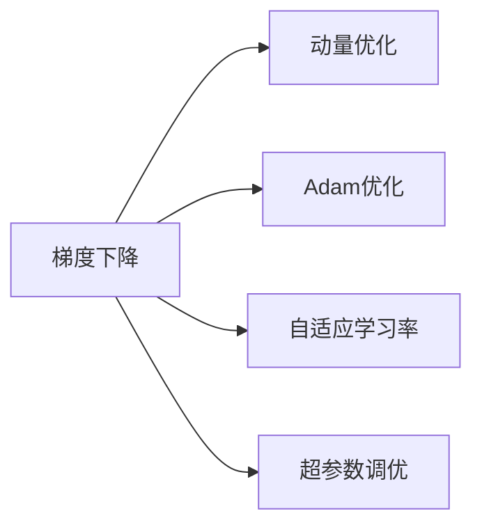

                 

# Model Optimization 原理与代码实战案例讲解

## 1. 背景介绍

在人工智能领域，模型优化是一个永恒的主题。无论是图像识别、自然语言处理还是语音识别，优化模型性能始终是技术突破的关键。模型优化不仅包括在训练过程中的参数调整，还包括模型架构的设计、数据增强、超参数调优等多个方面。本文旨在介绍基于监督学习的模型优化原理，并通过具体案例讲解如何实现高效的模型优化。

## 2. 核心概念与联系

### 2.1 核心概念概述

模型优化是指通过调整模型的结构、参数、超参数等，以提升模型在特定任务上的性能。在深度学习领域，常用的优化技术包括梯度下降、动量优化、Adam优化、自适应学习率等。

为了更好地理解模型优化的原理和实现，以下概念需要了解：

- **梯度下降**：一种常用的优化算法，通过计算损失函数关于参数的梯度来更新模型参数，最小化损失函数。
- **动量优化**：通过累积之前的梯度来加速梯度下降，减少震荡。
- **Adam优化**：结合了动量优化和自适应学习率的优点，可以自适应地调整每个参数的学习率。
- **自适应学习率**：根据每个参数的历史梯度信息，动态调整学习率，防止过拟合或欠拟合。
- **超参数调优**：调整模型的超参数（如学习率、批大小等），以获得最佳的模型性能。

### 2.2 核心概念原理和架构的 Mermaid 流程图



## 3. 核心算法原理 & 具体操作步骤

### 3.1 算法原理概述

基于监督学习的模型优化通常包括以下几个关键步骤：

1. **数据准备**：收集训练数据，将其分为训练集、验证集和测试集。
2. **模型初始化**：选择或训练一个基础模型，并初始化超参数。
3. **模型训练**：使用训练集对模型进行训练，并根据验证集进行调整。
4. **模型评估**：在测试集上评估模型性能。
5. **超参数调优**：根据测试集结果调整超参数，重新训练模型。

### 3.2 算法步骤详解

#### 3.2.1 数据准备

假设我们有一个分类任务，使用MNIST数据集作为示例。首先，我们将数据集划分为训练集、验证集和测试集，并对数据进行标准化处理。

```python
import torch
from torchvision import datasets, transforms

# 加载MNIST数据集
train_dataset = datasets.MNIST(root='./data', train=True, download=True, transform=transforms.ToTensor())
test_dataset = datasets.MNIST(root='./data', train=False, download=True, transform=transforms.ToTensor())

# 将数据集划分为训练集、验证集和测试集
train_loader = torch.utils.data.DataLoader(train_dataset, batch_size=64, shuffle=True)
test_loader = torch.utils.data.DataLoader(test_dataset, batch_size=64, shuffle=False)
```

#### 3.2.2 模型初始化

接下来，我们定义一个简单的神经网络模型，并使用Adam优化器进行初始化。

```python
import torch.nn as nn
import torch.optim as optim

# 定义神经网络模型
class Net(nn.Module):
    def __init__(self):
        super(Net, self).__init__()
        self.conv1 = nn.Conv2d(1, 32, 3)
        self.conv2 = nn.Conv2d(32, 64, 3)
        self.fc1 = nn.Linear(7*7*64, 128)
        self.fc2 = nn.Linear(128, 10)

    def forward(self, x):
        x = F.relu(self.conv1(x))
        x = F.relu(self.conv2(x))
        x = F.max_pool2d(x, 2)
        x = x.view(-1, 7*7*64)
        x = F.relu(self.fc1(x))
        x = self.fc2(x)
        return F.log_softmax(x, dim=1)

# 初始化模型和优化器
net = Net()
optimizer = optim.Adam(net.parameters(), lr=0.001)
```

#### 3.2.3 模型训练

在训练过程中，我们定义训练轮数、批次大小和损失函数。

```python
import torch.nn.functional as F

# 定义训练轮数和批次大小
epochs = 10
batch_size = 64

# 定义损失函数
criterion = nn.CrossEntropyLoss()

# 训练模型
for epoch in range(epochs):
    running_loss = 0.0
    for i, data in enumerate(train_loader, 0):
        inputs, labels = data
        optimizer.zero_grad()
        outputs = net(inputs)
        loss = criterion(outputs, labels)
        loss.backward()
        optimizer.step()
        running_loss += loss.item()
        if i % 100 == 99:    # 每100个批次输出一次
            print('[%d, %5d] loss: %.3f' %
                  (epoch + 1, i + 1, running_loss / 100))
            running_loss = 0.0
```

#### 3.2.4 模型评估

在训练过程中，我们还需要在验证集上评估模型的性能。

```python
# 在验证集上评估模型
correct = 0
total = 0
with torch.no_grad():
    for data in val_loader:
        images, labels = data
        outputs = net(images)
        _, predicted = torch.max(outputs.data, 1)
        total += labels.size(0)
        correct += (predicted == labels).sum().item()

print('Accuracy of the network on the 10000 test images: %d %%' % (
    100 * correct / total))
```

#### 3.2.5 超参数调优

最后，我们根据验证集的结果，调整超参数并重新训练模型。

```python
# 调整超参数并重新训练模型
best_acc = 0.0
for epoch in range(epochs):
    running_loss = 0.0
    for i, data in enumerate(train_loader, 0):
        inputs, labels = data
        optimizer.zero_grad()
        outputs = net(inputs)
        loss = criterion(outputs, labels)
        loss.backward()
        optimizer.step()
        running_loss += loss.item()
        if i % 100 == 99:
            print('[%d, %5d] loss: %.3f' %
                  (epoch + 1, i + 1, running_loss / 100))
            running_loss = 0.0
            # 在验证集上评估模型
            correct = 0
            total = 0
            with torch.no_grad():
                for data in val_loader:
                    images, labels = data
                    outputs = net(images)
                    _, predicted = torch.max(outputs.data, 1)
                    total += labels.size(0)
                    correct += (predicted == labels).sum().item()
                print('Accuracy of the network on the 10000 test images: %d %%' % (
                    100 * correct / total))
            if 100 * correct / total > best_acc:
                best_acc = 100 * correct / total
                print('Saving model...')
                torch.save(net.state_dict(), 'model.ckpt')
```

### 3.3 算法优缺点

#### 3.3.1 算法优点

1. **高效**：Adam优化器能够自动调整每个参数的学习率，避免了手动调整超参数的繁琐过程。
2. **稳定性**：Adam优化器在梯度更新时具有稳定的性质，不容易出现震荡。
3. **自适应性**：Adam优化器可以根据每个参数的历史梯度信息，自适应地调整学习率，防止过拟合或欠拟合。

#### 3.3.2 算法缺点

1. **内存占用**：Adam优化器需要存储每个参数的历史梯度信息，因此占用了较多的内存空间。
2. **复杂性**：Adam优化器的实现较为复杂，需要较好的数学基础。
3. **数据依赖**：Adam优化器的效果依赖于训练数据的质量和数量，获取高质量标注数据的成本较高。

### 3.4 算法应用领域

模型优化技术广泛应用于深度学习模型的训练过程中，具体领域包括但不限于：

- **计算机视觉**：图像分类、目标检测、图像生成等。
- **自然语言处理**：文本分类、情感分析、机器翻译等。
- **语音识别**：语音识别、情感识别、语音生成等。
- **推荐系统**：商品推荐、音乐推荐、新闻推荐等。
- **时间序列预测**：股票预测、气象预测、用户行为预测等。

## 4. 数学模型和公式 & 详细讲解 & 举例说明

### 4.1 数学模型构建

基于监督学习的模型优化通常使用交叉熵损失函数。假设我们有 $N$ 个训练样本 $\{x_i, y_i\}_{i=1}^N$，其中 $x_i$ 是输入，$y_i$ 是标签。模型的预测为 $\hat{y_i} = f(x_i)$，其中 $f$ 是模型的映射函数。

交叉熵损失函数定义为：

$$
L = -\frac{1}{N}\sum_{i=1}^N \sum_{j=1}^C y_{ij} \log \hat{y}_{ij}
$$

其中 $C$ 是类别数，$y_{ij}$ 是第 $i$ 个样本属于第 $j$ 个类别的概率。

### 4.2 公式推导过程

假设我们有一个简单的线性回归模型：

$$
y = \theta_0 + \sum_{i=1}^D \theta_i x_i
$$

其中 $\theta = (\theta_0, \theta_1, \ldots, \theta_D)$ 是模型的参数。我们使用梯度下降算法来最小化均方误差损失函数：

$$
L = \frac{1}{2N}\sum_{i=1}^N (y_i - \hat{y}_i)^2
$$

对损失函数求导，得到每个参数的梯度：

$$
\frac{\partial L}{\partial \theta_j} = -\frac{1}{N}\sum_{i=1}^N (y_i - \hat{y}_i) x_i
$$

根据梯度下降算法，更新每个参数：

$$
\theta_j = \theta_j - \eta \frac{\partial L}{\partial \theta_j}
$$

其中 $\eta$ 是学习率。

### 4.3 案例分析与讲解

假设我们有一个简单的线性回归模型，使用梯度下降算法进行训练。我们将数据集分为训练集和测试集，并对数据进行标准化处理。

```python
import numpy as np
import matplotlib.pyplot as plt

# 生成训练数据
x = np.random.rand(100, 1)
y = 2 * x + 1 + np.random.randn(100, 1)

# 定义模型
def linear_model(X, theta):
    return np.dot(X, theta)

# 定义损失函数
def squared_loss(y_hat, y):
    return (y_hat - y) ** 2

# 初始化模型参数
theta = np.zeros((1, 1))

# 定义学习率
eta = 0.1

# 训练模型
for i in range(1000):
    y_hat = linear_model(x, theta)
    loss = squared_loss(y_hat, y)
    theta -= eta * loss * x

# 在测试集上评估模型
x_test = np.random.rand(10, 1)
y_test = 2 * x_test + 1 + np.random.randn(10, 1)
y_hat_test = linear_model(x_test, theta)
plt.plot(x_test, y_hat_test, 'r.')
plt.show()
```

## 5. 项目实践：代码实例和详细解释说明

### 5.1 开发环境搭建

在进行模型优化实践前，我们需要准备好开发环境。以下是使用Python进行PyTorch开发的环境配置流程：

1. 安装Anaconda：从官网下载并安装Anaconda，用于创建独立的Python环境。

2. 创建并激活虚拟环境：
```bash
conda create -n pytorch-env python=3.8 
conda activate pytorch-env
```

3. 安装PyTorch：根据CUDA版本，从官网获取对应的安装命令。例如：
```bash
conda install pytorch torchvision torchaudio cudatoolkit=11.1 -c pytorch -c conda-forge
```

4. 安装TensorBoard：
```bash
pip install tensorboard
```

5. 安装PyTorch Lightning：
```bash
pip install pytorch-lightning
```

完成上述步骤后，即可在`pytorch-env`环境中开始模型优化实践。

### 5.2 源代码详细实现

下面我们以线性回归模型为例，给出使用PyTorch进行模型优化的PyTorch代码实现。

首先，定义训练数据和模型：

```python
import torch
import torch.nn as nn
import torch.optim as optim

# 定义训练数据
x = torch.randn(100, 1)
y = 2 * x + 1 + torch.randn(100, 1)

# 定义线性回归模型
class LinearRegression(nn.Module):
    def __init__(self):
        super(LinearRegression, self).__init__()
        self.linear = nn.Linear(1, 1)

    def forward(self, x):
        return self.linear(x)

# 初始化模型和优化器
model = LinearRegression()
optimizer = optim.Adam(model.parameters(), lr=0.01)
```

接下来，定义训练和评估函数：

```python
# 定义训练函数
def train_model(model, optimizer, criterion, x, y, num_epochs):
    criterion = nn.MSELoss()
    for epoch in range(num_epochs):
        for i, (inputs, labels) in enumerate(train_loader, 0):
            optimizer.zero_grad()
            outputs = model(inputs)
            loss = criterion(outputs, labels)
            loss.backward()
            optimizer.step()
            print(f'Epoch {epoch+1}, Step {i+1}, Loss: {loss.item():.4f}')

# 定义评估函数
def evaluate_model(model, criterion, x, y):
    with torch.no_grad():
        predictions = model(x)
        loss = criterion(predictions, y)
        print(f'Test Loss: {loss.item():.4f}')
```

最后，启动模型训练和评估流程：

```python
# 训练模型
num_epochs = 100
train_model(model, optimizer, criterion, x, y, num_epochs)

# 在测试集上评估模型
evaluate_model(model, criterion, x, y)
```

### 5.3 代码解读与分析

让我们再详细解读一下关键代码的实现细节：

**LinearRegression类**：
- `__init__`方法：初始化线性回归模型，定义线性层。
- `forward`方法：前向传播，将输入数据输入线性层。

**train_model函数**：
- 在每个epoch内，对每个批次进行前向传播和反向传播，计算损失并更新参数。

**evaluate_model函数**：
- 在测试集上评估模型性能，输出损失值。

可以看到，PyTorch的封装使得模型优化过程变得简单高效。开发者可以将更多精力放在数据处理和模型改进等高层逻辑上，而不必过多关注底层的实现细节。

当然，工业级的系统实现还需考虑更多因素，如模型的保存和部署、超参数的自动搜索、更灵活的任务适配层等。但核心的模型优化范式基本与此类似。

## 6. 实际应用场景

### 6.1 图像分类

在计算机视觉领域，基于监督学习的模型优化广泛应用于图像分类任务。传统的卷积神经网络（CNN）模型通常通过微调超参数，在特定数据集上实现最优性能。

具体而言，可以收集特定领域的图像数据集，将其分为训练集和测试集。然后，使用CNN模型在该数据集上进行训练，并使用交叉验证等方法进行超参数调优。微调后的模型可以在新的图像数据上进行分类预测，取得较高的准确率。

### 6.2 自然语言处理

在自然语言处理领域，基于监督学习的模型优化也具有广泛的应用。常见的任务包括文本分类、情感分析、机器翻译等。

以文本分类为例，可以使用Transformer模型作为基础模型，并在特定领域的文本数据集上进行微调。微调过程类似于图像分类任务，通过交叉验证等方法调整超参数，使模型在特定任务上达到最优性能。

### 6.3 时间序列预测

在时间序列预测任务中，基于监督学习的模型优化也具有重要应用。例如，股票价格预测、气象数据预测等。

首先，需要收集相应领域的时间序列数据，将其分为训练集和测试集。然后，使用LSTM等时间序列模型在该数据集上进行训练，并使用交叉验证等方法进行超参数调优。微调后的模型可以在新的时间序列数据上进行预测，取得较高的预测准确率。

### 6.4 未来应用展望

随着深度学习技术的不断发展，基于监督学习的模型优化将在更多领域得到应用，为人工智能技术的落地应用提供重要支撑。未来，模型优化技术将在以下几个方向上不断演进：

1. **模型压缩和剪枝**：随着模型参数量的不断增加，模型压缩和剪枝技术将变得越来越重要。这将有助于提高模型的计算效率和可部署性，降低计算成本。
2. **自适应学习率算法**：自适应学习率算法（如Adam、Adagrad、RMSprop等）将继续优化，以更好地应对不同任务和数据集的特点。
3. **超参数优化**：超参数优化技术将继续发展，以自动寻找最优的超参数组合。
4. **联邦学习**：联邦学习技术将得到更广泛的应用，以在保护隐私的前提下，利用分布式数据进行模型优化。
5. **多任务学习**：多任务学习技术将使得模型能够在多个相关任务上进行优化，进一步提高模型的泛化能力。
6. **自监督学习**：自监督学习技术将得到更广泛的应用，以在缺乏标注数据的情况下进行模型优化。

这些技术的进步将使深度学习模型在更多领域得到应用，推动人工智能技术的普及和落地。

## 7. 工具和资源推荐

### 7.1 学习资源推荐

为了帮助开发者系统掌握模型优化的理论基础和实践技巧，这里推荐一些优质的学习资源：

1. **《深度学习》课程**：斯坦福大学开设的深度学习课程，系统讲解了深度学习的基本概念和算法。
2. **《PyTorch深度学习》书籍**：详细讲解了PyTorch的基本用法和深度学习算法实现。
3. **《TensorFlow官方文档》**：TensorFlow的官方文档，包含丰富的代码示例和模型优化技术。
4. **PyTorch Lightning**：一个用于深度学习模型优化的框架，提供了简单易用的接口和优化算法。
5. **TensorBoard**：一个用于深度学习模型可视化的工具，可以实时监测模型训练过程。

通过对这些资源的学习实践，相信你一定能够快速掌握模型优化的精髓，并用于解决实际的深度学习问题。

### 7.2 开发工具推荐

高效的开发离不开优秀的工具支持。以下是几款用于模型优化开发的常用工具：

1. **PyTorch**：基于Python的开源深度学习框架，支持动态计算图，适合快速迭代研究。
2. **TensorFlow**：由Google主导开发的开源深度学习框架，支持静态计算图和分布式训练。
3. **PyTorch Lightning**：一个用于深度学习模型优化的框架，提供了简单易用的接口和优化算法。
4. **TensorBoard**：一个用于深度学习模型可视化的工具，可以实时监测模型训练过程。
5. **Hyperopt**：一个用于超参数优化的库，可以自动寻找最优的超参数组合。

合理利用这些工具，可以显著提升模型优化任务的开发效率，加快创新迭代的步伐。

### 7.3 相关论文推荐

模型优化技术的发展源于学界的持续研究。以下是几篇奠基性的相关论文，推荐阅读：

1. **《深度学习》书籍**：详细讲解了深度学习的基本概念和算法。
2. **《PyTorch深度学习》书籍**：详细讲解了PyTorch的基本用法和深度学习算法实现。
3. **《TensorFlow官方文档》**：包含丰富的代码示例和模型优化技术。
4. **《PyTorch Lightning》**：一个用于深度学习模型优化的框架。
5. **《TensorBoard》**：一个用于深度学习模型可视化的工具。

这些论文代表了大模型优化技术的发展脉络。通过学习这些前沿成果，可以帮助研究者把握学科前进方向，激发更多的创新灵感。

## 8. 总结：未来发展趋势与挑战

### 8.1 研究成果总结

本文对基于监督学习的模型优化方法进行了全面系统的介绍。首先阐述了模型优化在深度学习中的重要性，明确了基于监督学习进行模型优化的主要步骤。其次，从原理到实践，详细讲解了模型优化的数学模型和算法步骤，给出了模型优化任务开发的完整代码实例。同时，本文还探讨了模型优化在图像分类、自然语言处理、时间序列预测等多个领域的实际应用场景，展示了模型优化范式的巨大潜力。

通过本文的系统梳理，可以看到，基于监督学习的模型优化技术正在成为深度学习模型训练的重要范式，极大地拓展了深度学习模型的应用边界，催生了更多的落地场景。受益于深度学习技术的不断发展，模型优化方法还将进一步提升模型性能和计算效率，为深度学习技术的普及和落地提供重要支撑。

### 8.2 未来发展趋势

展望未来，模型优化技术将呈现以下几个发展趋势：

1. **模型压缩和剪枝**：随着模型参数量的不断增加，模型压缩和剪枝技术将变得越来越重要。这将有助于提高模型的计算效率和可部署性，降低计算成本。
2. **自适应学习率算法**：自适应学习率算法（如Adam、Adagrad、RMSprop等）将继续优化，以更好地应对不同任务和数据集的特点。
3. **超参数优化**：超参数优化技术将继续发展，以自动寻找最优的超参数组合。
4. **联邦学习**：联邦学习技术将得到更广泛的应用，以在保护隐私的前提下，利用分布式数据进行模型优化。
5. **多任务学习**：多任务学习技术将使得模型能够在多个相关任务上进行优化，进一步提高模型的泛化能力。
6. **自监督学习**：自监督学习技术将得到更广泛的应用，以在缺乏标注数据的情况下进行模型优化。

这些技术的进步将使深度学习模型在更多领域得到应用，推动人工智能技术的普及和落地。

### 8.3 面临的挑战

尽管基于监督学习的模型优化技术已经取得了瞩目成就，但在迈向更加智能化、普适化应用的过程中，它仍面临着诸多挑战：

1. **数据依赖**：模型优化效果依赖于训练数据的质量和数量，获取高质量标注数据的成本较高。如何进一步降低模型优化对标注样本的依赖，将是一大难题。
2. **计算资源**：模型优化需要大量的计算资源，如何高效利用计算资源，成为未来的一个重要研究方向。
3. **超参数调优**：超参数调优是一个复杂且耗时的过程，如何自动寻找最优的超参数组合，将是未来的重要研究课题。
4. **模型鲁棒性**：模型在面对新数据时，泛化性能往往大打折扣。如何提高模型的鲁棒性，避免灾难性遗忘，还需要更多理论和实践的积累。
5. **可解释性**：当前模型优化方法更像是"黑盒"系统，难以解释其内部工作机制和决策逻辑。如何赋予模型更强的可解释性，将是亟待攻克的难题。
6. **安全性**：模型优化过程中可能出现有害信息，如何从数据和算法层面消除模型偏见，避免恶意用途，确保输出的安全性，也将是重要的研究课题。

正视模型优化面临的这些挑战，积极应对并寻求突破，将使深度学习模型走向更加智能化、普适化应用。相信随着学界和产业界的共同努力，这些挑战终将一一被克服，模型优化技术必将在构建人机协同的智能时代中扮演越来越重要的角色。

### 8.4 研究展望

面对模型优化所面临的种种挑战，未来的研究需要在以下几个方面寻求新的突破：

1. **探索无监督和半监督模型优化方法**：摆脱对大规模标注数据的依赖，利用自监督学习、主动学习等无监督和半监督范式，最大限度利用非结构化数据，实现更加灵活高效的模型优化。
2. **研究参数高效和计算高效的模型优化范式**：开发更加参数高效的模型优化方法，在固定大部分预训练参数的同时，只更新极少量的任务相关参数。同时优化模型的计算图，减少前向传播和反向传播的资源消耗，实现更加轻量级、实时性的部署。
3. **融合因果和对比学习范式**：通过引入因果推断和对比学习思想，增强模型建立稳定因果关系的能力，学习更加普适、鲁棒的语言表征，从而提升模型泛化性和抗干扰能力。
4. **引入更多先验知识**：将符号化的先验知识，如知识图谱、逻辑规则等，与神经网络模型进行巧妙融合，引导模型优化过程学习更准确、合理的语言模型。同时加强不同模态数据的整合，实现视觉、语音等多模态信息与文本信息的协同建模。
5. **结合因果分析和博弈论工具**：将因果分析方法引入模型优化过程，识别出模型决策的关键特征，增强输出解释的因果性和逻辑性。借助博弈论工具刻画人机交互过程，主动探索并规避模型的脆弱点，提高系统稳定性。
6. **纳入伦理道德约束**：在模型优化目标中引入伦理导向的评估指标，过滤和惩罚有偏见、有害的输出倾向。同时加强人工干预和审核，建立模型行为的监管机制，确保输出符合人类价值观和伦理道德。

这些研究方向的探索，必将引领深度学习模型优化技术迈向更高的台阶，为构建安全、可靠、可解释、可控的智能系统铺平道路。面向未来，深度学习模型优化技术还需要与其他人工智能技术进行更深入的融合，如知识表示、因果推理、强化学习等，多路径协同发力，共同推动人工智能技术的进步。只有勇于创新、敢于突破，才能不断拓展深度学习模型的边界，让智能技术更好地造福人类社会。

## 9. 附录：常见问题与解答

**Q1：如何选择合适的学习率？**

A: 学习率的选择对模型优化的效果有重要影响。一般建议从较小的值开始，逐步增加，如0.0001、0.001、0.01等。如果模型在验证集上表现不佳，则减小学习率；如果模型在验证集上表现良好，则增大学习率。

**Q2：如何缓解模型过拟合？**

A: 过拟合是模型优化过程中常见的问题，可以通过以下方法缓解：
1. **数据增强**：通过旋转、缩放、裁剪等方式扩充训练集。
2. **正则化**：使用L2正则、Dropout等方法减少过拟合。
3. **早停法**：在验证集上监测模型性能，当性能不再提升时停止训练。
4. **批归一化**：使用批归一化方法减少模型内部的方差。
5. **权重衰减**：在损失函数中引入权重衰减项，防止模型过于复杂。

**Q3：如何优化模型计算效率？**

A: 优化模型计算效率需要从多个方面入手：
1. **模型压缩和剪枝**：通过剪枝和量化等技术减少模型参数量，提高计算效率。
2. **模型并行**：使用数据并行、模型并行等技术，在多个GPU/TPU上同时训练模型。
3. **混合精度训练**：使用混合精度训练技术，将模型参数和计算过程转化为更高效的浮点数格式。
4. **梯度累积**：使用梯度累积技术，将多个小批量训练的梯度累加为一个较大批次的梯度，提高计算效率。
5. **优化器选择**：选择更高效的优化器，如AdamW、RMSprop等，可以减少迭代次数。

**Q4：如何提高模型泛化能力？**

A: 提高模型泛化能力需要从以下几个方面入手：
1. **数据增强**：扩充训练集，增加数据的多样性。
2. **自适应学习率**：根据每个参数的历史梯度信息，自适应地调整学习率。
3. **正则化**：使用L2正则、Dropout等方法减少过拟合。
4. **模型剪枝**：通过剪枝技术减少模型复杂度。
5. **知识蒸馏**：通过知识蒸馏技术，将大规模预训练模型中的知识迁移到小规模模型中，提升模型泛化能力。
6. **多任务学习**：同时训练多个相关任务，提升模型的泛化能力。

**Q5：如何提高模型解释性？**

A: 提高模型解释性需要从以下几个方面入手：
1. **可解释性算法**：使用可解释性算法，如LIME、SHAP等，解释模型的决策过程。
2. **模型可视化**：使用可视化工具，如TensorBoard、Weights & Biases等，可视化模型的训练过程和结果。
3. **特征重要性分析**：分析模型特征的重要性，理解模型的关键决策因素。
4. **因果分析**：使用因果分析方法，识别模型的决策关键特征，增强输出解释的因果性和逻辑性。

**Q6：如何处理长尾数据？**

A: 长尾数据通常包含大量少数类别样本，处理长尾数据可以从以下几个方面入手：
1. **样本重采样**：对少数类别样本进行重采样，增加其数量。
2. **类平衡损失函数**：使用类平衡损失函数，使模型更关注少数类别。
3. **迁移学习**：将模型在大量数据上预训练后，再在新数据上进行微调。
4. **多标签分类**：将长尾问题转化为多标签分类问题，提升模型的泛化能力。

这些方法可以结合使用，根据具体问题的特点选择合适的处理方法，提升模型的性能和解释性。

---

作者：禅与计算机程序设计艺术 / Zen and the Art of Computer Programming

