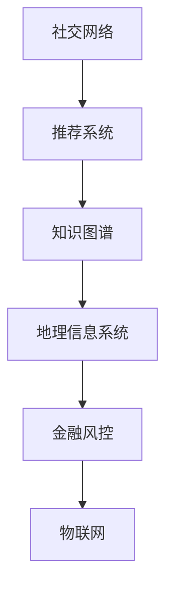

                 

# Neo4j图数据库原理与Cypher代码实例讲解

> 关键词：图数据库, Neo4j, Cypher, 图结构, 图查询语言, 图分析, 图算法

## 1. 背景介绍

### 1.1 问题由来

随着大数据时代的到来，数据的复杂性也日益增加，传统的SQL数据库已经难以满足多样化数据结构的需求。这其中，图数据作为复杂关系和网络信息的自然表示方式，在社交网络、知识图谱、推荐系统等领域得到了广泛的应用。因此，图数据库作为专门用于存储和查询图结构数据的数据库管理系统，受到了越来越多的关注和重视。

### 1.2 问题核心关键点

在图数据库中，Neo4j作为一款功能强大、社区活跃的开源图数据库管理系统，凭借其丰富的功能和易用的特性，成为了图数据库中的佼佼者。Cypher语言作为Neo4j的查询语言，能够方便地进行图数据的存储、查询、分析和计算。本文将重点介绍Neo4j图数据库的原理，并结合实际应用场景，详细讲解Cypher语言的代码实例。

### 1.3 问题研究意义

理解Neo4j图数据库和Cypher语言的原理，对于开发者来说具有重要意义：

1. 掌握图数据建模和查询的核心概念。图数据库与传统的关系型数据库不同，它更加注重数据之间的关联性。了解图数据建模的基本原理，有助于我们更好地设计和优化数据库结构。
2. 提高图数据分析和处理的效率。Cypher语言提供了丰富的图算法和函数，可以大幅提升图数据处理的效率和准确性。
3. 加速实际项目开发进程。Cypher语言的简洁和易用性，使得图数据的查询和分析变得简单直观，极大减少了开发时间和成本。

## 2. 核心概念与联系

### 2.1 核心概念概述

为了更好地理解Neo4j图数据库和Cypher语言的原理，本节将介绍几个核心概念：

- 图数据库(Graph Database)：一种专门用于存储和查询图结构数据的数据库管理系统，能够有效地管理节点、边和属性之间的关系。
- Neo4j：一款开源的图数据库管理系统，支持高并发、事务一致性、弹性扩展等特性，被广泛应用于社交网络、推荐系统、知识图谱等领域。
- Cypher：Neo4j的查询语言，用于对图数据进行存储、查询、分析和计算。Cypher语言基于JavaScript和SQL，具有简洁易用和表达力强的特点。
- 节点(Node)：图数据库中的基本数据单位，代表图中的一个实体。每个节点可以包含一组属性和关系。
- 边(Edge)：节点之间的连接关系，表示节点之间的关联。边也可以包含属性和关系。
- 属性(Property)：节点和边的特征信息，用于描述节点和边的具体属性值。

这些核心概念之间的逻辑关系可以通过以下Mermaid流程图来展示：

```mermaid
graph TB
    A[图数据库] --> B[Neo4j]
    B --> C[Cypher]
    C --> D[节点(Node)]
    C --> E[边(Edge)]
    C --> F[属性(Property)]
```

这个流程图展示了一个简化的图数据库系统及其核心组件之间的关系：

1. 图数据库通过Neo4j进行管理和查询。
2. Cypher语言用于对图数据进行操作和处理。
3. 节点和边是图数据的基本组成单元。
4. 属性用于描述节点和边的具体特征。

## 3. 核心算法原理 & 具体操作步骤

### 3.1 算法原理概述

Neo4j图数据库的核心算法原理主要围绕着图的存储、查询和分析展开。图数据存储在数据库中，通过节点和边表示实体和关系。查询时，用户可以使用Cypher语言对节点、边和属性进行复杂的关系查询和分析操作。

### 3.2 算法步骤详解

Neo4j图数据库的算法步骤主要包括以下几个关键环节：

**Step 1: 数据建模**

数据建模是图数据库设计的基础，主要涉及到节点、边和属性的定义和设计。设计良好的数据模型能够提高数据查询和处理的效率。

**Step 2: 数据存储**

Neo4j采用基于内存和磁盘的双层存储架构，能够高效地存储大规模图数据。节点和边以键值对的形式存储，属性则以键值对或数组形式存储。

**Step 3: 数据查询**

Cypher语言提供了丰富的查询语法，用于对节点、边和属性进行复杂的关系查询和分析操作。常用的查询操作包括节点查询、边查询、路径查询、聚合查询等。

**Step 4: 数据分析**

Neo4j支持多种数据分析操作，如聚合分析、统计分析、图算法等。这些分析操作能够帮助用户发现图数据中的隐藏模式和关系，从而进行更深入的分析和挖掘。

### 3.3 算法优缺点

Neo4j图数据库和Cypher语言具有以下优点：

1. 高效存储和查询图数据。Neo4j采用了创新的数据存储和查询算法，能够高效地存储和查询大规模图数据。
2. 灵活的数据建模。节点、边和属性的设计非常灵活，能够满足不同场景下的数据需求。
3. 强大的图算法支持。Neo4j内置了多种图算法，能够方便地进行图分析、图匹配、图聚类等操作。
4. 易用的Cypher语言。Cypher语言简单易用，具有良好的表达力和易读性，使得图数据的查询和分析变得简单直观。

同时，Neo4j图数据库和Cypher语言也存在以下局限性：

1. 学习曲线较陡。对于初学者而言，需要一定的学习成本才能掌握Neo4j和Cypher的基础知识。
2. 性能瓶颈。当数据量非常大时，Neo4j的性能可能会受到限制，需要进行优化和调整。
3. 数据复杂性。图数据本身具有较高的复杂性，设计和管理图数据需要一定的经验和技巧。

### 3.4 算法应用领域

Neo4j图数据库和Cypher语言已经在多个领域得到了广泛应用，如：

- 社交网络：用于存储和查询社交网络中的用户关系、好友关系、互动行为等。
- 推荐系统：用于存储和查询用户行为、物品特征、用户评分等，从而进行个性化推荐。
- 知识图谱：用于存储和查询知识图谱中的实体、关系、属性等，支持知识发现和知识推理。
- 地理信息系统：用于存储和查询地理数据中的点、线、面等空间关系，支持位置分析和路径规划。
- 金融风控：用于存储和查询金融交易、风险评估、反欺诈等数据，支持风险监控和分析。

这些核心概念之间的逻辑关系可以通过以下Mermaid流程图来展示：



## 4. 数学模型和公式 & 详细讲解 & 举例说明

### 4.1 数学模型构建

在Neo4j图数据库中，数据模型可以抽象为一个图结构，由节点、边和属性组成。节点和边可以组成任意数量的关系，属性则描述了节点和边的具体特征。

### 4.2 公式推导过程

Neo4j图数据库的核心算法原理主要基于图数据的基本概念和关系操作。以下是几个常见操作的公式推导：

**节点查询**

节点查询是指查询图数据库中符合特定条件的所有节点。假设有一个节点 $n$，查询条件为 $p$，则节点查询的公式可以表示为：

$$
\text{MATCH (n)} WHERE p
$$

**边查询**

边查询是指查询图数据库中符合特定条件的所有边。假设有一个边 $e$，查询条件为 $p$，则边查询的公式可以表示为：

$$
\text{MATCH (a)-[e]-(o) WHERE p}
$$

**路径查询**

路径查询是指查询图数据库中符合特定条件的所有路径。假设有一个起点 $a$，终点 $o$，查询条件为 $p$，则路径查询的公式可以表示为：

$$
\text{MATCH (a)-[:e*]-(o) WHERE p}
$$

**聚合查询**

聚合查询是指对图数据进行统计和分析操作，例如计算节点的度数、边的数量等。假设有一个节点 $n$，聚合函数为 $f$，则聚合查询的公式可以表示为：

$$
\text{MATCH (n)} RETURN f(n)
$$

### 4.3 案例分析与讲解

**示例1: 社交网络中的好友关系**

社交网络中，用户之间存在好友关系，可以抽象为一个图结构。假设有一个用户 $u$，查询其所有好友，则可以使用以下Cypher代码：

```cypher
MATCH (u:User)-[:FRIENDS]->(friend) RETURN friend
```

**示例2: 推荐系统中的物品推荐**

推荐系统中的用户行为和物品特征可以存储为图数据。假设有一个用户 $u$，查询其喜欢的物品，则可以使用以下Cypher代码：

```cypher
MATCH (user)-[:LIKES]->(item) RETURN item
```

**示例3: 知识图谱中的实体关系**

知识图谱中的实体和关系可以存储为图数据。假设有一个实体 $e$，查询其相关关系，则可以使用以下Cypher代码：

```cypher
MATCH (entity)-[:RELATION]->(other) RETURN relation
```

通过以上几个示例，可以看到Cypher语言在图数据建模和查询方面的简洁和易用性。

## 5. 项目实践：代码实例和详细解释说明

### 5.1 开发环境搭建

在进行Neo4j图数据库和Cypher语言实践前，需要先搭建好开发环境。以下是搭建开发环境的详细步骤：

1. 安装Neo4j数据库：从官网下载Neo4j社区版，并按照官方文档进行安装。
2. 配置开发环境：在本地搭建开发环境，安装Java SDK、Maven等依赖库。
3. 启动数据库服务：启动Neo4j数据库服务，并连接数据库。

### 5.2 源代码详细实现

以下是使用Neo4j图数据库和Cypher语言进行社交网络中的好友关系查询的代码实现。

**代码1: 创建社交网络图结构**

```cypher
CREATE (Alice:User {name:'Alice', age:25})-[:FRIENDS]->(Bob:User {name:'Bob', age:30})
CREATE (Alice)-[:FRIENDS]->(Carol:User {name:'Carol', age:27})
CREATE (Bob)-[:FRIENDS]->(David:User {name:'David', age:28})
```

**代码2: 查询Alice的好友关系**

```cypher
MATCH (Alice:User)-[:FRIENDS]->(friend:User) RETURN friend.name
```

**代码3: 查询Bob的所有好友**

```cypher
MATCH (Alice)-[:FRIENDS]->(Bob)-[:FRIENDS]->(friend) RETURN friend.name
```

### 5.3 代码解读与分析

上述代码中，使用Cypher语言创建了一个简单的社交网络图结构，并进行了好友关系的查询。以下是代码的具体解读和分析：

**代码1**

使用Cypher语言创建了4个用户节点和4条好友关系边，构建了一个简单的社交网络图结构。每个节点包含一个属性 `name` 和 `age`，边包含一个属性 `RELATION`，表示好友关系。

**代码2**

使用Cypher语言查询了Alice的好友关系，即查询Alice直接好友的用户节点。通过 `MATCH` 语句匹配 Alice 和好友之间的关系，`RETURN` 语句返回好友节点的名称。

**代码3**

使用Cypher语言查询了Bob的所有好友，即查询Bob通过好友关系关联到的所有用户节点。通过多级 `MATCH` 和 `RETURN` 语句，实现了对好友关系的复杂查询。

## 6. 实际应用场景

### 6.1 社交网络

社交网络是Neo4j图数据库和Cypher语言的重要应用场景之一。社交网络中的用户关系、好友关系、互动行为等都可以存储为图数据，并使用Cypher语言进行高效查询和分析。

**示例1: 好友关系推荐**

通过查询用户的好友关系，可以推荐用户认识的其他用户，从而扩大社交网络。示例代码如下：

```cypher
MATCH (Alice:User)-[:FRIENDS]->(friend:User), (Bob:User)-[:FRIENDS]->(friend) WHERE Alice.name<>Bob.name RETURN Bob.name
```

**示例2: 用户行为分析**

通过查询用户的行为数据，可以分析用户的兴趣偏好、社交活跃度等，从而提供个性化的推荐和建议。示例代码如下：

```cypher
MATCH (Alice)-[:INTERACTED]->(node) RETURN node.name, count(node)
```

### 6.2 推荐系统

推荐系统是Neo4j图数据库和Cypher语言的另一个重要应用场景。推荐系统中的用户行为和物品特征可以存储为图数据，并使用Cypher语言进行高效查询和分析。

**示例1: 物品推荐**

通过查询用户喜欢的物品，可以推荐用户可能感兴趣的其他物品。示例代码如下：

```cypher
MATCH (Alice)-[:LIKES]->(item:Item) RETURN item
```

**示例2: 用户行为分析**

通过查询用户的行为数据，可以分析用户的兴趣偏好、消费习惯等，从而提供个性化的推荐和建议。示例代码如下：

```cypher
MATCH (Alice)-[:BOUGHT]->(item:Item) RETURN item
```

### 6.3 知识图谱

知识图谱是Neo4j图数据库和Cypher语言的重要应用场景之一。知识图谱中的实体和关系可以存储为图数据，并使用Cypher语言进行高效查询和分析。

**示例1: 实体关系查询**

通过查询实体之间的关系，可以发现实体之间的隐藏模式和关系。示例代码如下：

```cypher
MATCH (Alice)-[:RELATION]->(other) RETURN relation
```

**示例2: 实体关系聚类**

通过查询实体之间的关系，可以发现实体之间的聚类关系，从而进行知识推理和发现。示例代码如下：

```cypher
MATCH (Alice)-[:RELATION]->(other) RETURN aggregate(relation)
```

## 7. 工具和资源推荐

### 7.1 学习资源推荐

为了帮助开发者系统掌握Neo4j图数据库和Cypher语言的知识，以下是一些优质的学习资源：

1. Neo4j官方文档：Neo4j社区提供了详细的官方文档，包含Neo4j图数据库和Cypher语言的使用指南和API接口。
2. Cypher语言教程：Cypher语言官方教程提供了丰富的Cypher语言示例和练习，适合初学者进行学习。
3. Neo4j实战：由实际开发者编写的实战教程，涵盖Neo4j图数据库和Cypher语言的实际应用场景和最佳实践。
4. 图数据库课程：各大在线教育平台提供了丰富的图数据库和Cypher语言课程，涵盖基础知识和高级应用。
5. 社区和论坛：Neo4j社区和Stack Overflow等技术论坛提供了大量的技术讨论和问题解答，可以帮助开发者解决问题。

### 7.2 开发工具推荐

以下是几款用于Neo4j图数据库和Cypher语言开发和调试的工具：

1. Neo4j浏览器：Neo4j社区提供的浏览器工具，可以方便地进行图数据库的查询和调试。
2. Cypher IDE：Cypher IDE提供了一个可视化界面，方便开发者进行Cypher代码的编写和调试。
3. Docker容器：使用Docker容器可以方便地搭建和部署Neo4j图数据库，进行快速开发和测试。
4. Neo4j可视化工具：如Gephi等可视化工具，可以帮助开发者更好地理解和展示图数据的关系。

### 7.3 相关论文推荐

Neo4j图数据库和Cypher语言的发展源于学界的持续研究。以下是几篇奠基性的相关论文，推荐阅读：

1. Graph Databases in the Real World: An Overview of the Neo4j Graph Database: 详细介绍了Neo4j图数据库的架构和核心算法，适合了解Neo4j的基本概念和原理。
2. Cypher Query Language: A Quick Reference: 详细介绍了Cypher语言的语法和用法，适合掌握Cypher语言的基本知识和操作技巧。
3. The Data Science of Social Networks: 介绍了社交网络图数据库的应用，适合了解图数据库在社交网络中的应用场景和实现方式。
4. Graph Algorithms: 详细介绍了图算法的原理和实现方法，适合了解图算法的理论基础和应用场景。

## 8. 总结：未来发展趋势与挑战

### 8.1 研究成果总结

Neo4j图数据库和Cypher语言在图数据存储和查询方面具有独特的优势，已经在社交网络、推荐系统、知识图谱等多个领域得到了广泛应用。Cypher语言的简洁易用和表达力强，使得图数据的查询和分析变得简单直观。

### 8.2 未来发展趋势

未来，Neo4j图数据库和Cypher语言将继续在图数据存储和查询方面发挥重要作用。以下是对未来发展趋势的展望：

1. 高并发和高可用性。Neo4j图数据库的性能和稳定性将继续提升，支持更高效和高可用的图数据存储和查询。
2. 数据一致性和事务支持。Neo4j图数据库将继续支持ACID事务和数据一致性，确保数据操作的正确性和可靠性。
3. 社区和生态系统的完善。Neo4j社区和生态系统将继续扩展，提供更多的工具、插件和扩展库，支持开发者进行更深入的图数据开发和应用。
4. 图数据的应用场景不断扩展。图数据库将在更多领域得到应用，如金融风控、医疗健康、物联网等，拓展图数据的应用边界。

### 8.3 面临的挑战

尽管Neo4j图数据库和Cypher语言已经取得了一定的进展，但在发展过程中仍面临以下挑战：

1. 学习曲线较陡。对于初学者而言，需要一定的学习成本才能掌握Neo4j和Cypher的基础知识。
2. 性能瓶颈。当数据量非常大时，Neo4j的性能可能会受到限制，需要进行优化和调整。
3. 数据复杂性。图数据本身具有较高的复杂性，设计和管理图数据需要一定的经验和技巧。

### 8.4 研究展望

针对上述挑战，未来的研究需要在以下几个方面寻求新的突破：

1. 简化学习曲线。通过优化文档和教程，降低Neo4j和Cypher的学习成本，吸引更多的开发者进行学习和使用。
2. 优化性能瓶颈。通过改进算法和架构，提升Neo4j的性能和扩展能力，支持大规模图数据的存储和查询。
3. 简化数据管理。通过简化数据建模和查询操作，降低开发者管理图数据的复杂性，提升开发效率。

## 9. 附录：常见问题与解答

**Q1: Neo4j图数据库和Cypher语言是什么？**

A: Neo4j图数据库是一种专门用于存储和查询图结构数据的数据库管理系统，而Cypher语言是Neo4j的查询语言，用于对图数据进行存储、查询、分析和计算。

**Q2: Neo4j图数据库和关系型数据库的区别是什么？**

A: 图数据库和关系型数据库在数据存储和查询方面有显著区别。关系型数据库主要存储二维表格数据，支持基于SQL的查询；而图数据库主要存储图结构数据，支持基于Cypher的查询。图数据库更加注重数据之间的关联性，适合存储和查询复杂的关系数据。

**Q3: Cypher语言的特点是什么？**

A: Cypher语言具有以下特点：
1. 简洁易用：Cypher语言的语法简洁明了，易于学习和使用。
2. 表达力强：Cypher语言支持复杂的关系查询和图算法操作，能够表达复杂的图数据查询需求。
3. 函数丰富：Cypher语言内置了丰富的函数和操作符，能够方便地进行图数据的统计和分析。

**Q4: Neo4j图数据库的性能瓶颈是什么？**

A: Neo4j图数据库的性能瓶颈主要包括以下几点：
1. 数据量过大：当数据量非常大时，Neo4j的性能可能会受到限制。
2. 硬件资源不足：Neo4j需要较高的内存和CPU资源，硬件配置不足可能会导致性能瓶颈。
3. 查询复杂性：复杂的查询操作可能会降低Neo4j的性能。

**Q5: 如何优化Neo4j图数据库的性能？**

A: 优化Neo4j图数据库的性能主要包括以下几点：
1. 使用索引：在节点和边上添加索引，提高查询效率。
2. 调整内存和CPU资源：根据数据量调整Neo4j的内存和CPU资源，确保其高效运行。
3. 优化查询语句：简化查询语句，避免复杂的查询操作，提高查询效率。

以上是关于Neo4j图数据库和Cypher语言原理与代码实例的详细介绍。通过本文的学习和实践，相信你对Neo4j图数据库和Cypher语言有了更深刻的理解，能够更加灵活地进行图数据的存储和查询操作。

---

作者：禅与计算机程序设计艺术 / Zen and the Art of Computer Programming

