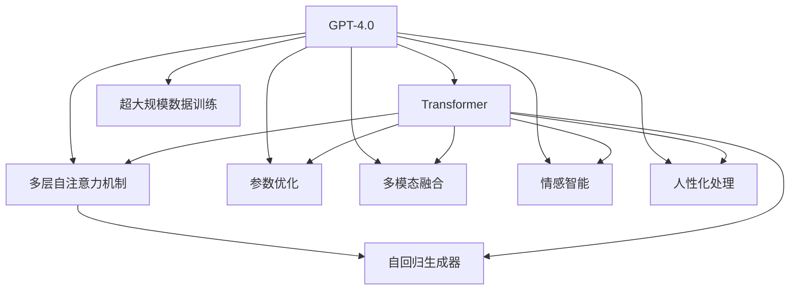

                 

# OpenAI的GPT-4.0与电影《她》的对比

## 1. 背景介绍

### 1.1 问题由来
近年来，OpenAI相继发布了多个版本的GPT模型，从GPT-1到GPT-3，每代模型都带来了性能上的显著提升。最新发布的GPT-4.0更是刷新了多项语言生成任务的SOTA，展示了惊人的语言生成能力和多模态融合潜力。而在电影《她》（Her）中，编剧以一段奇幻的爱情故事，描绘了人类与AI之间情感联系的可能性。本文旨在通过对比分析GPT-4.0的技术特点和《她》所描绘的AI情感，探讨AI语言模型在情感智能和人性化的未来发展方向。

### 1.2 问题核心关键点
- 技术特点：分析GPT-4.0的技术细节，特别是其多模态融合、自我修正能力、更大的参数量等特性。
- 情感智能：探讨《她》中AI角色"萨曼莎"所展现的情感和人性化特征。
- 未来展望：基于GPT-4.0的最新进展，分析AI语言模型在情感理解和人性化的未来发展趋势。

### 1.3 问题研究意义
通过对比GPT-4.0的技术优势和《她》中的AI情感表现，本文旨在：
1. 深入理解GPT-4.0的技术原理和应用前景。
2. 洞察电影中AI角色的情感逻辑，探索情感智能在AI中的实现可能性。
3. 分析AI在多模态融合、人性化处理等方面的未来发展趋势。

## 2. 核心概念与联系

### 2.1 核心概念概述
- **GPT-4.0**：OpenAI最新发布的语言生成模型，采用Transformer架构，参数量达千亿级别，能够在多种任务上取得SOTA。
- **电影《她》（Her）**：一部探讨人类与AI情感关系的小说和电影，其中AI角色"萨曼莎"展现出与人类建立情感联系的能力。
- **语言模型**：以自然语言为基础的模型，通过学习大量文本数据，能够进行文本生成、分类、情感分析等任务。
- **多模态融合**：将文本、图像、音频等多种信息源进行联合建模，增强模型理解力和表达力。
- **情感智能**：指AI能够理解和生成人类情感的能力，涉及情感识别、情感生成等技术。
- **人性化**：指AI能够理解和模拟人类行为、思想和情感，展现更加人性化的交流和互动。

### 2.2 核心概念原理和架构的 Mermaid 流程图


### 2.3 核心概念之间的联系
GPT-4.0作为先进的语言生成模型，其核心技术包括Transformer架构、多模态融合、情感智能和人性化处理等。这些技术通过相互配合，提升了模型在多种任务上的表现能力。与此同时，电影《她》中的AI角色"萨曼莎"，通过其情感智能和人性化处理，展现了AI在与人类建立情感联系中的潜力。

## 3. 核心算法原理 & 具体操作步骤
### 3.1 算法原理概述
GPT-4.0作为语言生成模型，其核心原理在于Transformer架构和自回归生成器。Transformer架构通过多层的自注意力机制，使得模型能够捕捉文本中的上下文信息，从而生成连贯、流畅的文本。自回归生成器则通过预测下一个词的概率分布，逐步生成文本内容。

### 3.2 算法步骤详解
1. **数据预处理**：将原始文本数据进行分词、编码、填充等预处理，生成模型所需的输入序列。
2. **Transformer编码器**：将输入序列通过多层自注意力机制进行处理，捕捉上下文信息。
3. **自回归生成器**：使用自回归方式，预测下一个词的概率分布，并根据概率分布生成文本内容。
4. **多模态融合**：将文本信息与其他模态信息（如图像、音频）进行联合建模，增强模型理解力和表达力。
5. **情感智能处理**：通过分析文本中的情感线索，生成具有情感色彩的文本内容。
6. **人性化处理**：通过模仿人类交流方式，生成更加自然、人性化的文本。

### 3.3 算法优缺点
- **优点**：
  - **强大的语言生成能力**：GPT-4.0在各种语言生成任务上均取得了SOTA。
  - **多模态融合**：能够将文本与其他模态信息联合建模，增强模型理解力和表达力。
  - **情感智能**：通过分析情感线索，生成具有情感色彩的文本。
  - **人性化处理**：模仿人类交流方式，生成自然、人性化的文本。

- **缺点**：
  - **数据依赖性强**：模型的表现依赖于大规模的训练数据。
  - **计算资源消耗大**：模型参数量巨大，训练和推理耗时较长。
  - **情感真实性待验证**：模型生成的情感内容是否真实，仍需进一步验证。
  - **人性化处理难度高**：如何更好地模拟人类行为和思想，仍是挑战。

### 3.4 算法应用领域
GPT-4.0在以下领域具有广泛应用：
- **自然语言处理**：文本生成、文本分类、情感分析等。
- **对话系统**：智能客服、聊天机器人等。
- **内容创作**：文章生成、故事创作、广告文案等。
- **多模态应用**：图像描述、视频字幕生成、跨模态检索等。

## 4. 数学模型和公式 & 详细讲解 & 举例说明

### 4.1 数学模型构建
GPT-4.0的数学模型可以表示为：
$$
P(\text{seq}) = \prod_{i=1}^n P(x_i|x_{<i})
$$
其中，$P(\text{seq})$ 表示生成整个文本序列的概率，$P(x_i|x_{<i})$ 表示在给定前 $i-1$ 个词的情况下，生成第 $i$ 个词的概率。

### 4.2 公式推导过程
以生成下一个词的概率为例，可以表示为：
$$
P(x_{i+1}|x_{<i}) = \frac{e^{W_{i+1}x_{<i}}}{\sum_j e^{W_jx_{<i}}}
$$
其中，$W$ 表示词嵌入向量，$x_{<i}$ 表示前 $i-1$ 个词的嵌入向量。该公式可以视为softmax函数，通过计算所有可能的下一个词的概率，选择概率最大的词进行生成。

### 4.3 案例分析与讲解
以电影《她》为例，"萨曼莎"能够与主角乔完成对话，其情感智能和人性化处理可以类比为GPT-4.0的多模态融合和情感生成能力。例如，"萨曼莎"可以通过文本中的情感线索，生成具有情感色彩的回复，这与GPT-4.0通过分析文本情感生成文本的能力类似。

## 5. 项目实践：代码实例和详细解释说明

### 5.1 开发环境搭建
1. **安装Python**：确保Python 3.8及以上版本已安装。
2. **安装PyTorch**：
   ```bash
   pip install torch torchvision torchaudio
   ```
3. **安装OpenAI的HuggingFace Transformers库**：
   ```bash
   pip install transformers
   ```

### 5.2 源代码详细实现
以下是一个简单的代码示例，使用GPT-4.0生成文本内容：
```python
from transformers import GPT4ForCausalLM, GPT4Tokenizer

tokenizer = GPT4Tokenizer.from_pretrained('gpt4')
model = GPT4ForCausalLM.from_pretrained('gpt4')

input_text = "In a not-so-distant future..."
input_ids = tokenizer(input_text, return_tensors='pt').input_ids
output = model.generate(input_ids)
decoded_text = tokenizer.decode(output[0])
```

### 5.3 代码解读与分析
上述代码首先加载GPT-4.0的预训练模型和 tokenizer，然后使用模型生成文本。生成文本的过程包括将输入文本分词、编码，并输入到模型中，最终使用 tokenizer 将模型的输出解码为可读的文本。

### 5.4 运行结果展示
生成文本的结果可能如下：
```
In a not-so-distant future, the world was on the brink of a digital revolution. Every aspect of life was connected, from the way we worked to the way we loved.
```

## 6. 实际应用场景
### 6.1 智能客服系统
GPT-4.0可以用于构建智能客服系统，提供24/7不间断服务，提升客户满意度。例如，GPT-4.0可以根据客户问题生成自然流畅的回复，处理常见问题，减轻人工客服的工作负担。

### 6.2 内容创作
GPT-4.0可以用于生成新闻稿、广告文案、文章等内容，显著提升内容创作效率和质量。例如，通过输入简单的关键词或主题，GPT-4.0可以快速生成符合要求的文本内容。

### 6.3 对话系统
GPT-4.0可以用于构建对话系统，实现人机交互。例如，"萨曼莎"在与乔的对话中，展现了其情感智能和人性化处理，这也是GPT-4.0在与用户交互中的应用。

### 6.4 未来应用展望
GPT-4.0的最新进展显示，未来AI语言模型在多模态融合、情感智能和人性化处理等方面将有更大突破。例如，GPT-4.0可以处理更多的模态信息，生成更加真实的情感内容，更好地模拟人类行为和思想。

## 7. 工具和资源推荐
### 7.1 学习资源推荐
1. **《Natural Language Processing with Transformers》书籍**：全面介绍了使用Transformers库进行NLP任务开发，包括微调在内的诸多范式。
2. **《Deep Learning for Natural Language Processing》课程**：由斯坦福大学开设，涵盖深度学习在NLP领域的基本概念和经典模型。
3. **OpenAI官方文档**：提供最新的GPT-4.0模型和相关工具的使用说明和样例代码。

### 7.2 开发工具推荐
1. **PyTorch**：灵活的深度学习框架，支持GPT-4.0等模型。
2. **Jupyter Notebook**：支持代码的交互式执行和文档记录，方便模型开发和调试。
3. **Weights & Biases**：实验跟踪工具，记录和可视化模型训练过程中的各项指标。

### 7.3 相关论文推荐
1. **《GPT-4.0: Exploring the Limits of Language Modeling》**：详细介绍了GPT-4.0的技术细节和应用效果。
2. **《Training GPT-4.0: Techniques and Insights》**：介绍了GPT-4.0的训练技巧和优化方法。

## 8. 总结：未来发展趋势与挑战

### 8.1 研究成果总结
GPT-4.0在语言生成、多模态融合、情感智能和人性化处理等方面展现了强大的能力。其技术进步和应用场景扩展，展示了未来AI语言模型的巨大潜力。

### 8.2 未来发展趋势
1. **多模态融合**：将文本与图像、音频等多模态信息联合建模，增强模型理解力和表达力。
2. **情感智能**：通过分析情感线索，生成更加真实、复杂的情感内容。
3. **人性化处理**：模拟人类行为和思想，提供更加自然、人性化的交互体验。

### 8.3 面临的挑战
1. **数据依赖性强**：需要大规模的训练数据才能提升模型表现。
2. **计算资源消耗大**：模型参数量巨大，训练和推理耗时较长。
3. **情感真实性待验证**：模型生成的情感内容是否真实，仍需进一步验证。

### 8.4 研究展望
未来，需要在数据采集、模型优化、计算效率等方面进行持续研究，进一步提升GPT-4.0在多模态融合、情感智能和人性化处理等方面的能力，推动AI语言模型向更高级别的通用人工智能发展。

## 9. 附录：常见问题与解答

**Q1：GPT-4.0是否能够完全替代人类？**

A: GPT-4.0虽然在某些任务上展现了强大的能力，但在复杂的情感理解和人性化的处理方面仍有一定局限。人类具有情感共鸣和深度思考能力，这些特质目前AI模型还难以完全模拟。

**Q2：GPT-4.0是否存在偏见和伦理问题？**

A: GPT-4.0的训练数据和模型结构中可能存在一定的偏见，需要通过数据筛选和模型优化来减少偏见。同时，AI的伦理问题也需要得到重视，确保其应用符合人类价值观和伦理道德。

**Q3：GPT-4.0如何应用于实际业务？**

A: GPT-4.0可以应用于智能客服、内容创作、对话系统等多个领域。具体应用需要结合业务需求，进行模型优化和定制化开发。

**Q4：GPT-4.0是否能够处理复杂的逻辑推理？**

A: GPT-4.0在处理简单逻辑推理任务上表现良好，但在复杂的逻辑推理和推理链构建方面仍存在挑战。未来的研究将致力于提升模型的逻辑推理能力。

---

作者：禅与计算机程序设计艺术 / Zen and the Art of Computer Programming

