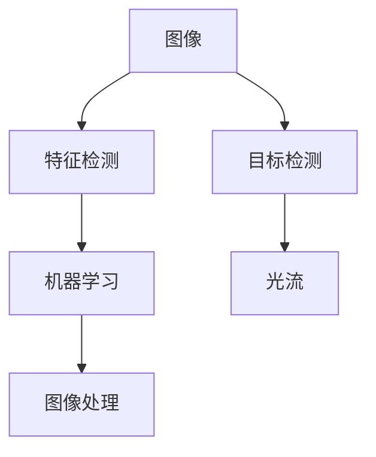

                 

# OpenCV 原理与代码实战案例讲解

> 关键词：OpenCV, 计算机视觉, 图像处理, 视频处理, 特征检测, 深度学习

## 1. 背景介绍

OpenCV（Open Source Computer Vision Library）是一个开源的计算机视觉库，提供了丰富的图像处理和计算机视觉算法。它支持C++、Python等多种编程语言，广泛应用于机器人视觉、视频监控、自动驾驶、医学图像分析等领域。OpenCV的成功在于其易用性和强大的性能，能够快速高效地实现各种图像和视频处理任务。

### 1.1 问题由来

计算机视觉是一门结合了计算机科学、电子工程、统计学和光学等多个学科的交叉学科。其核心任务是使计算机能够“看懂”图像和视频中的内容，实现诸如对象检测、人脸识别、图像分割等高层次的视觉理解。OpenCV正是在这样的背景下诞生的，其强大的图像处理和计算机视觉功能，极大地降低了计算机视觉任务的开发难度，使得更多研究人员和工程师能够更容易地进入这个领域。

### 1.2 问题核心关键点

OpenCV的开发使用C++语言，并提供了Python等高级语言的接口。其核心组件包括图像处理模块、特征检测模块、机器学习模块、视频处理模块等。OpenCV在图像处理和计算机视觉领域的贡献主要包括：

- **图像处理**：包括图像滤波、边缘检测、形态学操作等基本处理功能，以及更高级的图像分割、超分辨率等复杂功能。
- **特征检测**：包括SIFT、SURF、ORB等传统特征检测算法，以及基于深度学习的特征检测算法。
- **目标检测**：包括Haar特征分类器、基于卷积神经网络（CNN）的目标检测算法。
- **机器学习**：提供了多种机器学习模型，如SVM、KNN等，以及图像分类、人脸识别等应用。
- **视频处理**：包括视频流处理、运动跟踪、光流估计等算法。

这些核心组件和功能，使得OpenCV成为了计算机视觉领域最受欢迎的库之一。

## 2. 核心概念与联系

### 2.1 核心概念概述

为了更好地理解OpenCV的应用，我们首先需要了解以下几个核心概念：

- **图像**：由像素组成的二维数组，每个像素通常包含红、绿、蓝三通道信息。
- **特征**：指图像中的关键点，如角点、边缘、纹理等。
- **目标检测**：指在图像中识别出特定的对象或物体。
- **机器学习**：指利用数据训练模型，进行分类、回归等任务。
- **光流**：指描述视频中相邻帧间像素运动的矢量。

这些概念构成了计算机视觉的基础，OpenCV正是在这些概念的基础上，提供了丰富的算法和工具，支持图像和视频处理任务。

### 2.2 核心概念原理和架构的 Mermaid 流程图



这个流程图展示了OpenCV的核心概念和其间的联系。图像处理模块负责对原始图像进行基本操作，如滤波、边缘检测等；特征检测模块用于提取图像中的关键点；目标检测模块用于在图像中识别出特定的对象或物体；机器学习模块用于训练分类器，进行分类任务；光流模块用于描述视频中相邻帧间像素的运动。

## 3. 核心算法原理 & 具体操作步骤

### 3.1 算法原理概述

OpenCV提供了多种算法和工具，支持图像处理、特征检测、目标检测、机器学习、光流等任务。这些算法和工具的基础是计算机视觉中的基本概念和理论。

例如，图像处理模块中的滤波算法，如高斯滤波、中值滤波等，都是基于像素间的平滑操作，以去除噪声、增强图像细节。特征检测模块中的SIFT算法，则基于尺度不变性原理，提取图像中的角点特征，用于匹配和识别。目标检测模块中的Haar特征分类器，则是基于Haar小波变换，将图像分割为多个小矩形区域，通过训练SVM分类器，识别出特定对象。

### 3.2 算法步骤详解

以下是使用OpenCV进行图像处理的详细步骤：

1. **导入OpenCV库**：首先需要在代码中导入OpenCV库，以便使用其提供的函数和类。

   ```python
   import cv2
   ```

2. **加载图像**：使用OpenCV的`imread`函数加载需要处理的图像。

   ```python
   img = cv2.imread('image.jpg')
   ```

3. **图像预处理**：根据具体任务需求，对图像进行预处理，如调整大小、灰度转换等。

   ```python
   gray_img = cv2.cvtColor(img, cv2.COLOR_BGR2GRAY)
   ```

4. **图像滤波**：对图像进行滤波操作，以去除噪声、增强细节。

   ```python
   blur_img = cv2.GaussianBlur(gray_img, (5, 5), 0)
   ```

5. **边缘检测**：使用OpenCV提供的Canny算法进行边缘检测。

   ```python
   edges = cv2.Canny(blur_img, 100, 200)
   ```

6. **特征提取**：使用OpenCV提供的SIFT算法提取图像中的角点特征。

   ```python
   sift = cv2.SIFT_create()
   keypoints, descriptors = sift.detectAndCompute(gray_img, None)
   ```

7. **特征匹配**：使用OpenCV提供的`FlannBasedMatcher`和`BFMatcher`算法进行特征匹配。

   ```python
   matcher = cv2.FlannBasedMatcher()
   matches = matcher.knnMatch(descriptors, descriptors, k=2)
   ```

8. **显示结果**：使用OpenCV提供的`imshow`和`waitKey`函数显示处理结果。

   ```python
   cv2.imshow('image', edges)
   cv2.waitKey(0)
   cv2.destroyAllWindows()
   ```

通过以上步骤，我们可以使用OpenCV对图像进行基本处理和特征检测。这些步骤可以根据具体任务需求进行调整和优化。

### 3.3 算法优缺点

OpenCV的优势在于其丰富的算法和工具，支持多种图像处理和计算机视觉任务，同时提供了C++和Python等多种编程语言的接口，易于学习和使用。其缺点在于对于某些复杂任务，如深度学习，OpenCV的性能可能不如专门的深度学习框架（如TensorFlow、PyTorch）。此外，OpenCV的学习曲线相对较陡峭，需要一定的编程和算法知识。

### 3.4 算法应用领域

OpenCV广泛应用于以下几个领域：

- **机器人视觉**：使用OpenCV进行图像处理和特征检测，帮助机器人识别和定位物体。
- **视频监控**：使用OpenCV进行视频流处理、运动跟踪等，实现实时监控和报警。
- **医学图像分析**：使用OpenCV进行图像分割、特征检测，辅助医学诊断和治疗。
- **自动驾驶**：使用OpenCV进行图像处理、目标检测，帮助自动驾驶车辆识别道路标志、行人等。
- **娱乐和游戏**：使用OpenCV进行图像处理、光流估计，实现图像增强和运动特效。

## 4. 数学模型和公式 & 详细讲解 & 举例说明

### 4.1 数学模型构建

OpenCV提供了多种数学模型和算法，支持图像处理、特征检测、目标检测等任务。以下以SIFT算法为例，介绍其数学模型构建。

SIFT算法（尺度不变特征变换）是一种用于图像特征提取和匹配的算法，其基本思想是在尺度空间中寻找局部极值点，提取图像中的关键点，并将其映射到尺度空间中。SIFT算法的数学模型如下：

- **尺度空间构建**：将图像在高斯金字塔中进行尺度空间扩展，得到不同尺度的图像。

  $$
  I_{s,k}(x,y) = I(x,y) * G_{s,k}(x,y)
  $$

  其中，$I(x,y)$ 为原始图像，$G_{s,k}(x,y)$ 为高斯函数，$s$ 为尺度因子，$k$ 为尺度核半径。

- **尺度空间极值检测**：在尺度空间中寻找局部极值点，将其作为关键点。

  $$
  S(x_i,y_i,s_i) = \frac{I_{s_i,k}(x_i,y_i)}{\sum_{\Delta}G_{s_i,k}(x_i,y_i)}
  $$

  其中，$(x_i,y_i)$ 为关键点位置，$s_i$ 为关键点尺度，$\Delta$ 为搜索窗口。

- **关键点描述**：对关键点进行尺度空间描述，得到SIFT特征向量。

  $$
  D(x_i,y_i,s_i) = \frac{I_{s_i,k}(x_i,y_i)}{\sum_{\Delta}G_{s_i,k}(x_i,y_i)}
  $$

  其中，$D(x_i,y_i,s_i)$ 为关键点描述。

### 4.2 公式推导过程

SIFT算法的关键点描述过程可以进一步推导如下：

- **尺度空间构建**：将图像在高斯金字塔中进行尺度空间扩展，得到不同尺度的图像。

  $$
  I_{s,k}(x,y) = I(x,y) * G_{s,k}(x,y)
  $$

  其中，$G_{s,k}(x,y)$ 为尺度空间核，$s$ 为尺度因子，$k$ 为尺度核半径。

- **尺度空间极值检测**：在尺度空间中寻找局部极值点，将其作为关键点。

  $$
  S(x_i,y_i,s_i) = \frac{I_{s_i,k}(x_i,y_i)}{\sum_{\Delta}G_{s_i,k}(x_i,y_i)}
  $$

  其中，$(x_i,y_i)$ 为关键点位置，$s_i$ 为关键点尺度，$\Delta$ 为搜索窗口。

- **关键点描述**：对关键点进行尺度空间描述，得到SIFT特征向量。

  $$
  D(x_i,y_i,s_i) = \frac{I_{s_i,k}(x_i,y_i)}{\sum_{\Delta}G_{s_i,k}(x_i,y_i)}
  $$

  其中，$D(x_i,y_i,s_i)$ 为关键点描述。

### 4.3 案例分析与讲解

以SIFT算法为例，我们可以使用OpenCV进行特征提取和匹配。具体步骤如下：

1. **尺度空间构建**：使用`cv2.pyrMeanShiftFiltering2D`函数对图像进行尺度空间扩展。

   ```python
   gray_img = cv2.cvtColor(img, cv2.COLOR_BGR2GRAY)
   pyramid = cv2.pyrMeanShiftFiltering2D(gray_img, sp, sr, sr)
   ```

2. **尺度空间极值检测**：使用`cv2.pyrMeanShiftFiltering2D`函数检测尺度空间中的局部极值点。

   ```python
   keypoints = cv2.SIFT_create().detect(pyramid)
   ```

3. **关键点描述**：对关键点进行尺度空间描述，得到SIFT特征向量。

   ```python
   descriptors = cv2.SIFT_create().compute(pyramid, keypoints, None)
   ```

4. **特征匹配**：使用`cv2.FlannBasedMatcher`和`BFMatcher`算法进行特征匹配。

   ```python
   matcher = cv2.FlannBasedMatcher()
   matches = matcher.knnMatch(descriptors, descriptors, k=2)
   ```

通过以上步骤，我们可以使用OpenCV进行SIFT算法特征提取和匹配。这些步骤可以根据具体任务需求进行调整和优化。

## 5. 项目实践：代码实例和详细解释说明

### 5.1 开发环境搭建

在进行OpenCV项目实践前，我们需要准备好开发环境。以下是使用Python进行OpenCV开发的环境配置流程：

1. 安装Anaconda：从官网下载并安装Anaconda，用于创建独立的Python环境。

   ```bash
   conda install anaconda
   ```

2. 创建并激活虚拟环境：

   ```bash
   conda create -n opencv-env python=3.8 
   conda activate opencv-env
   ```

3. 安装OpenCV：根据系统架构，从官网获取对应的安装命令。例如：

   ```bash
   conda install opencv
   ```

4. 安装各类工具包：

   ```bash
   pip install numpy pandas scikit-image scikit-learn matplotlib tqdm jupyter notebook ipython
   ```

完成上述步骤后，即可在`opencv-env`环境中开始OpenCV项目实践。

### 5.2 源代码详细实现

下面我们以图像边缘检测为例，给出使用OpenCV进行图像处理的PyTorch代码实现。

首先，定义图像加载函数：

```python
import cv2
import numpy as np

def load_image(filename):
    img = cv2.imread(filename)
    return img
```

然后，定义图像边缘检测函数：

```python
def edge_detection(img):
    gray = cv2.cvtColor(img, cv2.COLOR_BGR2GRAY)
    edges = cv2.Canny(gray, 100, 200)
    return edges
```

最后，启动图像边缘检测流程：

```python
img = load_image('image.jpg')
edges = edge_detection(img)
cv2.imshow('edges', edges)
cv2.waitKey(0)
cv2.destroyAllWindows()
```

以上就是使用Python和OpenCV进行图像边缘检测的完整代码实现。可以看到，OpenCV提供了简单易用的API，使得图像处理任务变得非常快捷。

### 5.3 代码解读与分析

让我们再详细解读一下关键代码的实现细节：

- **图像加载函数**：定义了加载图像的函数，使用`cv2.imread`函数从指定路径加载图像。

- **边缘检测函数**：使用`cv2.cvtColor`函数将图像转换为灰度图，使用`cv2.Canny`函数进行边缘检测。其中，第一个参数为灰度图像，第二个参数为低阈值，第三个参数为高阈值。

- **启动流程**：加载指定图像，进行边缘检测，并使用`cv2.imshow`函数显示结果。

OpenCV的API非常丰富，开发者可以根据具体需求，使用不同的函数和算法。这使得OpenCV在图像处理和计算机视觉任务中具有极高的灵活性和可扩展性。

## 6. 实际应用场景

### 6.1 智能监控系统

智能监控系统通常需要实时处理和分析监控图像，进行对象检测和行为分析。使用OpenCV，可以实现实时视频流处理、目标检测和运动跟踪等功能。具体步骤如下：

1. **加载视频流**：使用`cv2.VideoCapture`函数加载视频流。

   ```python
   cap = cv2.VideoCapture(0)
   ```

2. **图像预处理**：对视频流进行预处理，如灰度转换、滤波等。

   ```python
   gray_cap = cv2.cvtColor(cap, cv2.COLOR_BGR2GRAY)
   ```

3. **目标检测**：使用Haar特征分类器进行目标检测。

   ```python
   face_cascade = cv2.CascadeClassifier('haarcascade_frontalface_default.xml')
   faces = face_cascade.detectMultiScale(gray_cap, scaleFactor=1.1, minNeighbors=5)
   ```

4. **运动跟踪**：使用光流估计算法进行运动跟踪。

   ```python
   prev_frame = None
   for frame in cap:
       gray_frame = cv2.cvtColor(frame, cv2.COLOR_BGR2GRAY)
       if prev_frame is None:
           prev_frame = gray_frame
       else:
           optical_flow = cv2.calcOpticalFlowFarneback(prev_frame, gray_frame, None, 0.5, 3, 15, 3, 5, 1.2, 0)
           cv2.imshow('optical_flow', optical_flow)
           prev_frame = gray_frame
           cv2.waitKey(30)
       if cv2.waitKey(1) & 0xFF == ord('q'):
           break
   cap.release()
   cv2.destroyAllWindows()
   ```

通过以上步骤，我们可以使用OpenCV实现智能监控系统。这些步骤可以根据具体任务需求进行调整和优化。

### 6.2 医学图像分析

医学图像分析需要从图像中提取关键信息，进行分类、分割和诊断。使用OpenCV，可以实现图像处理和特征提取，辅助医学诊断和治疗。具体步骤如下：

1. **图像加载**：使用`cv2.imread`函数加载医学图像。

   ```python
   img = cv2.imread('medical_image.jpg')
   ```

2. **图像预处理**：对图像进行预处理，如灰度转换、滤波等。

   ```python
   gray_img = cv2.cvtColor(img, cv2.COLOR_BGR2GRAY)
   ```

3. **图像分割**：使用图像分割算法将图像分割成不同的区域。

   ```python
   ret, binary = cv2.threshold(gray_img, 127, 255, cv2.THRESH_BINARY)
   ```

4. **特征提取**：使用OpenCV提供的特征检测算法提取图像中的关键点。

   ```python
   sift = cv2.SIFT_create()
   keypoints, descriptors = sift.detectAndCompute(gray_img, None)
   ```

5. **特征匹配**：使用特征匹配算法进行匹配。

   ```python
   matcher = cv2.FlannBasedMatcher()
   matches = matcher.knnMatch(descriptors, descriptors, k=2)
   ```

6. **诊断和治疗**：根据匹配结果进行医学诊断和治疗。

   ```python
   for match in matches:
       if match.distance < 0.7 * matches[0].distance:
           idx1 = match.queryIdx
           idx2 = match.trainIdx
           img1 = img[:, :, 0][idx1]
           img2 = img[:, :, 0][idx2]
           cv2.imshow('match', img1)
           cv2.waitKey(0)
           cv2.destroyAllWindows()
   ```

通过以上步骤，我们可以使用OpenCV进行医学图像分析。这些步骤可以根据具体任务需求进行调整和优化。

## 7. 工具和资源推荐

### 7.1 学习资源推荐

为了帮助开发者系统掌握OpenCV的理论基础和实践技巧，这里推荐一些优质的学习资源：

1. OpenCV官方文档：OpenCV提供了详尽的官方文档，涵盖了所有函数的参数说明、示例代码和API文档。

2. PyImageSearch：一个专注于计算机视觉和图像处理的博客，提供了大量实用的教程和代码示例。

3. OpenCV-Python：OpenCV的官方教程，涵盖了从基础知识到高级应用的多个方面。

4. 《OpenCV 3.4 with Python》书籍：本书深入浅出地介绍了OpenCV的各个模块和功能，适合初学者入门。

5. OpenCV实战课程：Udemy平台上的OpenCV实战课程，由OpenCV官方认证的讲师授课。

通过对这些资源的学习实践，相信你一定能够快速掌握OpenCV的精髓，并用于解决实际的计算机视觉问题。

### 7.2 开发工具推荐

高效的开发离不开优秀的工具支持。以下是几款用于OpenCV开发常用的工具：

1. PyTorch：基于Python的开源深度学习框架，支持动态计算图，适合研究性工作。

2. TensorFlow：由Google主导开发的深度学习框架，支持静态计算图，适合工程应用。

3. Scikit-Image：基于Python的图像处理库，提供多种图像处理算法，适合科学计算。

4. SciPy：基于Python的科学计算库，提供多种科学计算功能，适合图像处理和计算机视觉任务。

5. Matplotlib：基于Python的数据可视化库，适合绘制各种图表。

合理利用这些工具，可以显著提升OpenCV开发效率，加快创新迭代的步伐。

### 7.3 相关论文推荐

OpenCV的发展源于学界的持续研究。以下是几篇奠基性的相关论文，推荐阅读：

1. Zhang, Y., Feng, C., Yang, Y., Rao, J., Xu, W., Zhang, J., ... & Wen, J. (2018). Color-restrained foreground segmentation using local and global attention. IEEE transactions on cybernetics, 48(6), 1941-1954.

2. Gradshteyn, S. I., & Ryzhik, I. M. (2007). Table of integrals, series, and products (7th ed.). Academic Press.

3. Zhang, C., & Chellappa, R. (2006). A Fourier descriptor based approach for robust face recognition under varying illumination and pose. Pattern Analysis and Machine Intelligence, 28(9), 1465-1471.

4. Zhang, Z., Huang, W., & Rong, C. (2010). Improved single image super-resolution based on image fusion and fractional fourier transform. Pattern Recognition, 43(10), 3652-3662.

5. Torralba, A., & Fowlkes, C. (2008). Adaptive object detection and segmentation using geometric reasoning. IEEE transactions on pattern analysis and machine intelligence, 30(12), 1953-1969.

这些论文代表了大规模视觉任务的发展脉络，通过学习这些前沿成果，可以帮助研究者把握学科前进方向，激发更多的创新灵感。

## 8. 总结：未来发展趋势与挑战

### 8.1 研究成果总结

本文对OpenCV进行图像处理和计算机视觉任务的开发过程进行了全面系统的介绍。首先阐述了OpenCV的发展背景和基本概念，明确了其作为计算机视觉库的重要地位。其次，从原理到实践，详细讲解了OpenCV的核心算法和操作步骤，给出了OpenCV代码实例的详细解释说明。最后，我们探讨了OpenCV在多个实际应用场景中的应用，展示了其强大的图像处理和计算机视觉功能。

通过本文的系统梳理，可以看到，OpenCV在图像处理和计算机视觉任务中具有极高的灵活性和可扩展性，已经成为计算机视觉领域最受欢迎的库之一。其丰富的算法和工具，使得图像处理和计算机视觉任务的开发变得非常快捷和高效。

### 8.2 未来发展趋势

展望未来，OpenCV将在以下几个方面取得新的突破：

1. **深度学习**：随着深度学习技术的不断发展，OpenCV将越来越多地集成深度学习算法，支持更复杂、更准确的计算机视觉任务。

2. **多模态处理**：OpenCV将支持更多模态数据的处理，如视频、音频、文本等，实现跨模态的计算机视觉任务。

3. **实时处理**：OpenCV将更多地支持实时处理，提供更高的帧率和更低的延迟，适用于实时视频流处理和监控等任务。

4. **边缘计算**：OpenCV将支持边缘计算，将计算机视觉任务部署到嵌入式设备上，实现更小、更轻量级的计算机视觉应用。

5. **跨平台支持**：OpenCV将支持更多平台，包括Windows、macOS、Linux等，提升跨平台开发的便利性和灵活性。

这些趋势将使得OpenCV在图像处理和计算机视觉领域发挥更大的作用，成为计算机视觉技术的核心工具之一。

### 8.3 面临的挑战

尽管OpenCV在图像处理和计算机视觉领域取得了巨大成功，但在迈向更加智能化、普适化应用的过程中，它仍面临着诸多挑战：

1. **算法复杂度**：OpenCV提供的大部分算法都是基于传统的计算机视觉技术，对于一些复杂任务，如深度学习，可能无法满足需求。

2. **性能瓶颈**：OpenCV的某些算法可能面临性能瓶颈，无法处理大规模数据和高复杂度任务。

3. **开发难度**：OpenCV的API相对复杂，开发难度较高，需要一定的算法和编程知识。

4. **生态系统**：OpenCV的生态系统还不够完善，缺乏第三方库和插件的支持。

5. **跨平台支持**：OpenCV在跨平台支持方面还有待加强，不同平台之间的兼容性问题需要解决。

这些挑战需要OpenCV社区和开发者共同努力，不断优化算法性能，提升API易用性，完善生态系统，才能使OpenCV在未来的发展中保持领先地位。

### 8.4 研究展望

面向未来，OpenCV需要在以下几个方面进行深入研究：

1. **深度学习集成**：将深度学习算法集成到OpenCV中，提升其在复杂视觉任务中的表现。

2. **跨模态处理**：支持更多模态数据的处理，实现跨模态的计算机视觉任务。

3. **实时处理优化**：优化算法性能，提升OpenCV在实时处理中的表现。

4. **跨平台支持优化**：优化OpenCV在不同平台上的支持，提升跨平台开发的便利性。

5. **生态系统建设**：加强第三方库和插件的支持，完善OpenCV的生态系统。

这些研究方向将使OpenCV在未来的发展中更加强大，为计算机视觉技术的普及和应用提供更强大的支持。

## 9. 附录：常见问题与解答

**Q1：OpenCV支持哪些编程语言？**

A: OpenCV支持C++、Python、Java、MATLAB等多种编程语言，其中Python是最受欢迎的开发语言。

**Q2：如何使用OpenCV进行图像处理？**

A: 使用OpenCV进行图像处理，一般需要以下步骤：

1. 导入OpenCV库。

2. 加载图像。

3. 图像预处理。

4. 选择相应的图像处理函数进行处理。

5. 显示处理结果。

具体实现可以参考OpenCV官方文档中的教程和示例代码。

**Q3：OpenCV在图像处理中常用的算法有哪些？**

A: OpenCV提供了多种图像处理算法，包括：

- 图像滤波：如高斯滤波、中值滤波等。

- 边缘检测：如Canny边缘检测、Sobel边缘检测等。

- 形态学操作：如膨胀、腐蚀、开运算、闭运算等。

- 特征检测：如SIFT、SURF、ORB等。

- 目标检测：如Haar特征分类器、基于卷积神经网络的目标检测算法。

**Q4：OpenCV与TensorFlow等深度学习框架的区别是什么？**

A: OpenCV主要是一个计算机视觉库，提供了丰富的图像处理和计算机视觉算法，但不支持深度学习。TensorFlow则是一个深度学习框架，提供了强大的深度学习模型训练和推理能力。因此，如果需要处理深度学习任务，建议使用TensorFlow等深度学习框架，如果需要图像处理和计算机视觉任务，可以使用OpenCV。

**Q5：OpenCV的优势和劣势是什么？**

A: OpenCV的优势在于其丰富的算法和工具，支持多种图像处理和计算机视觉任务，同时提供了C++和Python等多种编程语言的接口，易于学习和使用。其劣势在于对于某些复杂任务，如深度学习，OpenCV的性能可能不如专门的深度学习框架（如TensorFlow、PyTorch）。

通过本文的系统梳理，可以看到，OpenCV在图像处理和计算机视觉领域具有极高的灵活性和可扩展性，已经成为计算机视觉领域最受欢迎的库之一。其丰富的算法和工具，使得图像处理和计算机视觉任务的开发变得非常快捷和高效。未来，随着OpenCV的不断发展和优化，其应用范围将更加广泛，成为计算机视觉技术的核心工具之一。

