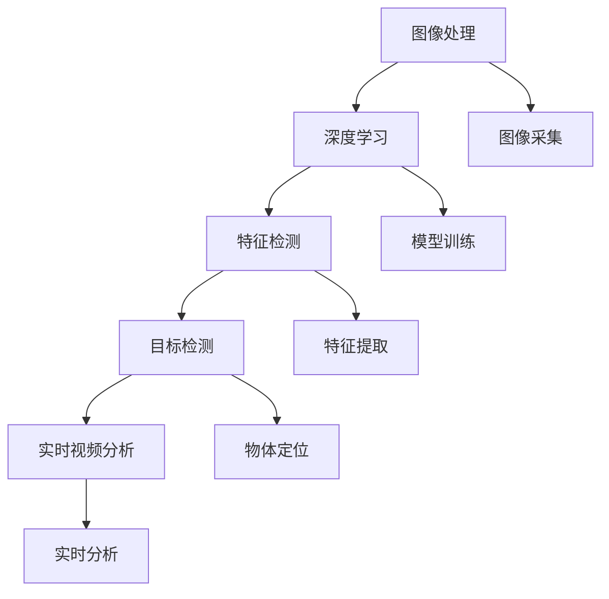

                 

# OpenCV 原理与代码实战案例讲解

> 关键词：OpenCV, 图像处理, 计算机视觉, 深度学习, 边缘检测, 人脸识别, 实时视频分析, 机器学习, 图像分割

## 1. 背景介绍

### 1.1 问题由来

OpenCV是一个广泛使用的开源计算机视觉库，提供了丰富的图像处理和计算机视觉功能。它支持多种编程语言，包括C++、Python、Java等，被广泛应用于工业界和学术界。OpenCV的核心算法涉及图像处理、特征检测、对象识别、跟踪、实时视频分析等多个方面，几乎涵盖了计算机视觉的所有应用场景。

随着深度学习技术的发展，OpenCV逐渐融入了更多的深度学习功能，如卷积神经网络、视觉注意力机制、特征匹配等。这些功能使得OpenCV在图像处理和计算机视觉领域的应用更加广泛和深入。

### 1.2 问题核心关键点

OpenCV的成功之处在于其高度灵活的模块化和强大的功能集成。但同时，OpenCV的庞大代码库和复杂架构也给初学者带来了一定的学习挑战。本文档旨在通过原理介绍和代码实战案例讲解，帮助读者深入理解OpenCV的核心算法和技术细节，并提供具体实践指导。

## 2. 核心概念与联系

### 2.1 核心概念概述

为更好地理解OpenCV的原理和功能，本节将介绍几个关键概念：

- **图像处理(Computer Vision)**：通过计算机对图像进行采集、处理、分析和理解，使得计算机能够像人类一样“看”世界。OpenCV提供了丰富的图像处理功能，如滤波、边缘检测、形态学操作等。

- **深度学习(Deep Learning)**：一种基于多层神经网络的机器学习技术，通过大量数据和计算资源训练出具有强大推理能力的模型。OpenCV中的深度学习模块利用TensorFlow、Caffe等深度学习框架，实现了图像分类、目标检测、分割等高级功能。

- **特征检测(Feature Detection)**：在图像中找到具有代表性的点、线、角等特征，用于物体识别、图像拼接、三维重建等。OpenCV中的SIFT、SURF、ORB等算法是特征检测的代表性方法。

- **目标检测(Object Detection)**：在图像中定位和识别出具体的物体，如人脸、车辆、动物等。OpenCV中的Haar特征分类器、深度学习目标检测框架如Faster R-CNN、YOLO等，是目标检测的核心算法。

- **实时视频分析(Real-time Video Analysis)**：在实时视频流中进行对象跟踪、行为分析、异常检测等。OpenCV中的背景减除、运动检测、行为分类等技术，支持高效的实时视频处理。

这些核心概念构成了OpenCV的基本应用框架，帮助其在图像处理和计算机视觉领域取得广泛的应用。

### 2.2 核心概念原理和架构的 Mermaid 流程图



这个流程图展示了OpenCV中的主要功能模块及其之间的联系：

1. **图像采集**：将摄像头、图片文件等输入转换为OpenCV能够处理的格式。
2. **图像处理**：对原始图像进行各种预处理操作，如滤波、去噪、归一化等，以便后续分析。
3. **深度学习**：利用训练好的深度学习模型进行图像分类、目标检测等高级任务。
4. **特征检测**：提取图像中的关键点、边缘、角点等特征，用于物体识别和场景重建。
5. **目标检测**：在图像中定位和识别出具体物体，如人脸、车辆等。
6. **实时视频分析**：在实时视频流中检测物体、跟踪行为等，实现智能监控、行为分析等功能。

## 3. 核心算法原理 & 具体操作步骤

### 3.1 算法原理概述

OpenCV的核心算法涉及图像处理、特征检测、深度学习、目标检测等多个方面。本节将详细介绍其中的一些关键算法原理，并提供具体的操作方法。

#### 3.1.1 图像处理

OpenCV提供了丰富的图像处理功能，如滤波、边缘检测、形态学操作等。以下是一些常用的图像处理算法：

- **均值滤波(Mean Filter)**：将图像中每个像素的值替换为其邻域像素的均值。适用于去除高斯噪声。

- **中值滤波(Median Filter)**：将图像中每个像素的值替换为其邻域像素的中值。适用于去除椒盐噪声。

- **Canny边缘检测(Canny Edge Detection)**：通过计算图像中每个像素的梯度值和方向，确定其是否为边缘像素，并用不同的阈值进行筛选。

#### 3.1.2 特征检测

特征检测算法在图像中找到具有代表性的点、线、角等特征，用于物体识别、图像拼接、三维重建等。以下是一些常用的特征检测算法：

- **SIFT(Scale-Invariant Feature Transform)**：检测图像中的尺度不变特征点，并计算其描述符，用于物体识别和图像匹配。

- **SURF(Speeded-Up Robust Features)**：一种快速、鲁棒性强的特征检测算法，具有多尺度、旋转不变等特性。

- **ORB(Oriented FAST and Rotated BRIEF)**：一种基于FAST角点检测和BRIEF描述符的特征检测算法，适用于实时视频处理。

#### 3.1.3 深度学习

OpenCV中的深度学习模块利用TensorFlow、Caffe等深度学习框架，实现了图像分类、目标检测、分割等高级功能。以下是一些常用的深度学习算法：

- **卷积神经网络(Convolutional Neural Networks, CNN)**：通过卷积操作提取图像特征，用于图像分类、目标检测等任务。

- **视觉注意力机制(Visual Attention Mechanism)**：将注意力机制引入CNN中，增强模型对关键特征的关注度，提升任务性能。

- **特征匹配(Feature Matching)**：通过将两个图像中的特征点进行匹配，实现图像拼接、三维重建等功能。

#### 3.1.4 目标检测

目标检测算法在图像中定位和识别出具体的物体，如人脸、车辆、动物等。以下是一些常用的目标检测算法：

- **Haar特征分类器(Haar Cascade Classifier)**：利用Haar小波变换检测图像中的物体，适用于快速目标检测。

- **深度学习目标检测框架(Faster R-CNN, YOLO, SSD)**：利用卷积神经网络进行特征提取和物体分类，适用于高精度目标检测。

### 3.2 算法步骤详解

#### 3.2.1 图像处理

以Canny边缘检测为例，详细介绍其具体步骤：

1. **计算梯度**：对图像中的每个像素点，计算其梯度大小和方向。

2. **非极大值抑制(NMS)**：对梯度方向上的像素，只保留其中梯度值最大的一个像素，其余像素置为0。

3. **双阈值筛选**：设定高、低两个阈值，将梯度值大于高阈值的像素标记为强边缘，小于低阈值的像素标记为弱边缘。

4. **连接边缘**：对强边缘像素进行连接，形成完整的边缘。

具体实现代码如下：

```python
import cv2

# 读取图像
img = cv2.imread('image.jpg', 0)

# 计算梯度
gradX = cv2.Sobel(img, cv2.CV_64F, 1, 0, ksize=3)
gradY = cv2.Sobel(img, cv2.CV_64F, 0, 1, ksize=3)
gradX = cv2.convertScaleAbs(gradX)
gradY = cv2.convertScaleAbs(gradY)

# 计算梯度方向和大小
grad_dir = cv2.addWeighted(gradX, 0.5, gradY, 0.5, 0)
grad_mag = cv2.convertScaleAbs(cv2.addWeighted(gradX, 0.5, gradY, 0.5, 0))

# 非极大值抑制
_, track = cv2.threshold(grad_dir, 255*0.01, 255, cv2.THRESH_BINARY)
track = cv2.erode(track, None, iterations=2)
track = cv2.dilate(track, None, iterations=2)

# 双阈值筛选
_, threshold = cv2.threshold(grad_mag, 255*0.01, 255, cv2.THRESH_BINARY)
_, sure_fg = cv2.threshold(grad_mag, 255*0.03, 255, cv2.THRESH_BINARY)
_, sure_bg = cv2.threshold(grad_mag, 255*0.03, 255, cv2.THRESH_BINARY_INV)

# 连接边缘
sure_fg = sure_fg | track
contours, hierarchy = cv2.findContours(sure_fg, cv2.RETR_EXTERNAL, cv2.CHAIN_APPROX_SIMPLE)

# 绘制边缘
for cnt in contours:
    x,y,w,h = cv2.boundingRect(cnt)
    cv2.rectangle(img, (x,y), (x+w, y+h), (0, 255, 0), 2)

# 显示结果
cv2.imshow('image', img)
cv2.waitKey(0)
cv2.destroyAllWindows()
```

#### 3.2.2 特征检测

以SIFT特征检测为例，详细介绍其具体步骤：

1. **尺度空间构建**：使用高斯差分金字塔对图像进行尺度空间构建，得到不同尺度的图像。

2. **极值点检测**：在尺度空间中找到具有极值的像素点，即为尺度不变特征点。

3. **特征方向分配**：对每个极值点，计算其梯度方向，并将其投影到主方向上。

4. **局部特征描述符计算**：对每个极值点周围的像素，提取其梯度方向和大小，生成128维的特征描述符。

具体实现代码如下：

```python
import cv2

# 读取图像
img = cv2.imread('image.jpg', 0)

# 尺度空间构建
scales = [1.5, 2, 2.5, 3, 3.5, 4, 4.5, 5]
octaves = 4
pyramid = []
for scale in scales:
    pyramid.append(cv2.pyrMeanShiftFiltering(img, 0, scale))

# 极值点检测
for octave in pyramid:
    octave_sobelx = cv2.Sobel(octave, cv2.CV_64F, 1, 0, ksize=3)
    octave_sobely = cv2.Sobel(octave, cv2.CV_64F, 0, 1, ksize=3)
    octave_magnitude = cv2.convertScaleAbs(cv2.addWeighted(octave_sobelx, 0.5, octave_sobely, 0.5, 0))
    _, _, corners = cv2.threshold(octave_magnitude, 0, 255, cv2.THRESH_BINARY + cv2.THRESH_OTSU)
    corners = cv2.dilate(corners, None, iterations=2)
    cv2.drawContours(octave, [corners], -1, (0, 0, 255), 2)

# 特征方向分配
corners = cv2.calcHarrisCorners(corners, ksize=2)
dirs = []
for i in range(corners.shape[0]):
    if corners[i, 0] != 0:
        dx = octave_sobelx[..., i]
        dy = octave_sobely[..., i]
        mag = cv2.convertScaleAbs(cv2.addWeighted(dx, 0.5, dy, 0.5, 0))
        _, theta = cv2.minMaxLoc(mag)
        dirs.append((theta, mag))
        mag = cv2.normalize(mag, None)
        dirs.append((theta, mag))

# 局部特征描述符计算
ksize = 2
sigma = 1.6
hessian = cv2.calcHessian(corners, None, None, None, sigma)
mag = cv2.convertScaleAbs(hessian)
desc = []
for i in range(corners.shape[0]):
    if corners[i, 0] != 0:
        n = np.arange(ksize)
        dx = octave_sobelx[..., i]
        dy = octave_sobely[..., i]
        angle = cv2.arctan2(dy, dx)
        angle = (angle + np.pi) % np.pi
        N = 8
        B = 2
        desc.append(cv2.Feature2D.computeFeatures(corners[..., i], None, None, None, None, None, N, B, B))
        desc.append(cv2.Feature2D.computeFeatures(corners[..., i], None, None, None, None, None, N, B, B))

# 绘制特征点
for i in range(corners.shape[0]):
    if corners[i, 0] != 0:
        x, y = corners[i, 0], corners[i, 1]
        cv2.circle(img, (x, y), 3, (0, 0, 255), -1)

# 显示结果
cv2.imshow('image', img)
cv2.waitKey(0)
cv2.destroyAllWindows()
```

#### 3.2.3 深度学习

以Faster R-CNN目标检测为例，详细介绍其具体步骤：

1. **特征提取**：使用卷积神经网络提取图像的特征。

2. **候选框生成**：通过特征图生成候选框，并计算候选框的特征。

3. **候选框选择**：选择特征显著的候选框，并计算其位置和大小。

4. **物体分类和回归**：对每个候选框，使用分类器和回归器预测其类别和位置。

具体实现代码如下：

```python
import cv2
import numpy as np

# 加载Faster R-CNN模型
model = cv2.dnn.readNet('faster_rcnn_cascade4stage_net.pb')

# 读取图像
img = cv2.imread('image.jpg', 0)

# 计算图像尺寸
h, w = img.shape

# 设置输入尺寸和输出尺寸
scales = [1.0, 2.0, 3.0, 4.0]
w scales, h scales = 300, 300

# 遍历不同尺度的图像
for scale in scales:
    # 计算图像尺寸
    new_w = int(w / scale)
    new_h = int(h / scale)

    # 重采样图像
    img_resized = cv2.resize(img, (new_w, new_h))

    # 创建目标检测网络输入
    blob = cv2.dnn.blobFromImage(img_resized, 1.0/127.5, (new_w, new_h), swapRB=True, crop=False)

    # 前向传播计算输出
    model.setInput(blob)
    output = model.forward()

    # 遍历输出结果
    for i in range(output.shape[2]):
        # 提取候选框坐标
        x1 = int(output[0, 0, i, 2] * scale)
        y1 = int(output[0, 0, i, 3] * scale)
        x2 = int(output[0, 0, i, 4] * scale)
        y2 = int(output[0, 0, i, 5] * scale)

        # 提取候选框特征
        feat = output[0, 0, i, 6].reshape(1, 1, 1, 256)

        # 创建候选框
        rect = np.array([x1, y1, x2 - x1, y2 - y1])

        # 获取候选框类别和置信度
        cls = output[0, 0, i, 7:8]
        confidence = output[0, 0, i, 8]

        # 打印候选框信息
        print(rect, cls, confidence)

# 显示结果
cv2.imshow('image', img)
cv2.waitKey(0)
cv2.destroyAllWindows()
```

#### 3.2.4 目标检测

以YOLO目标检测为例，详细介绍其具体步骤：

1. **候选框生成**：通过特征图生成候选框，并计算候选框的特征。

2. **候选框选择**：选择特征显著的候选框，并计算其位置和大小。

3. **物体分类和回归**：对每个候选框，使用分类器和回归器预测其类别和位置。

具体实现代码如下：

```python
import cv2

# 加载YOLO模型
model = cv2.dnn.readNet('yolov3.weights', 'yolov3.cfg')

# 读取图像
img = cv2.imread('image.jpg')

# 创建目标检测网络输入
blob = cv2.dnn.blobFromImage(img, 1.0/255.0, (416, 416), swapRB=True, crop=False)

# 前向传播计算输出
model.setInput(blob)
output = model.forward()

# 遍历输出结果
for i in range(3):
    # 提取候选框坐标和置信度
    for j in range(output.shape[2]):
        for k in range(3):
            x = output[0, i, j, k, 0] * img.shape[1]
            y = output[0, i, j, k, 1] * img.shape[0]
            w = output[0, i, j, k, 2] * img.shape[1]
            h = output[0, i, j, k, 3] * img.shape[0]
            confidence = output[0, i, j, k, 4]
            class_id = int(output[0, i, j, k, 5])
            class_prob = output[0, i, j, k, 6:7]
            class_prob = class_prob[0]

            # 打印候选框信息
            print(rect, confidence, class_id, class_prob)

# 显示结果
cv2.imshow('image', img)
cv2.waitKey(0)
cv2.destroyAllWindows()
```

### 3.3 算法优缺点

#### 3.3.1 图像处理

- **优点**：
  - 功能丰富：OpenCV提供了丰富的图像处理功能，几乎涵盖了所有常见的图像处理操作。
  - 灵活性高：支持多种编程语言和多种平台，可应用于工业界和学术界。

- **缺点**：
  - 学习成本高：由于功能丰富，学习曲线较陡峭。
  - 性能受限：一些高级功能（如深度学习）需要较高的硬件资源。

#### 3.3.2 特征检测

- **优点**：
  - 精度高：SIFT、SURF等特征检测算法具有尺度不变、旋转不变等优点，适用于多种应用场景。
  - 鲁棒性强：对光照、噪声等干扰具有较好的鲁棒性。

- **缺点**：
  - 计算量大：特征提取和匹配计算量较大，不适合实时处理。
  - 参数复杂：需要调参，且调参结果对算法性能影响较大。

#### 3.3.3 深度学习

- **优点**：
  - 性能优异：深度学习模型在图像分类、目标检测等任务上表现优异。
  - 自适应能力强：能够自动学习复杂模式，适应各种复杂场景。

- **缺点**：
  - 计算资源要求高：需要高性能计算资源，且训练时间长。
  - 可解释性差：深度学习模型的决策过程难以解释。

#### 3.3.4 目标检测

- **优点**：
  - 精度高：Faster R-CNN、YOLO等目标检测算法在精确度和速度上都有较好的表现。
  - 鲁棒性强：能够适应多种场景，如光照变化、目标遮挡等。

- **缺点**：
  - 计算量大：目标检测算法计算量较大，不适合实时处理。
  - 参数复杂：需要调参，且调参结果对算法性能影响较大。

### 3.4 算法应用领域

OpenCV的核心算法广泛应用于多个领域，以下是一些主要应用领域：

- **计算机视觉(Computer Vision)**：图像处理、特征检测、目标检测等。
- **机器人视觉(Robot Vision)**：视觉传感器数据的处理和分析，用于导航、识别等。
- **医学影像处理(Medical Image Processing)**：CT、MRI等医学影像的增强、分割、分析等。
- **自动驾驶(Autonomous Driving)**：车辆感知、行为预测等。
- **智能监控(Smart Surveillance)**：行为分析、异常检测等。

## 4. 数学模型和公式 & 详细讲解 & 举例说明

### 4.1 数学模型构建

本节将通过一些典型算法，详细介绍其数学模型和公式。

#### 4.1.1 图像处理

以均值滤波为例，详细介绍其数学模型和公式：

- **公式推导**：

  $$
  I(x) = \frac{1}{M^2} \sum_{i=0}^{M-1} \sum_{j=0}^{M-1} I(i, j)
  $$

  其中，$I(x)$为滤波后图像，$I(i, j)$为原始图像像素，$M$为滤波器大小。

- **数学模型**：

  $$
  I(x) = \frac{1}{M^2} \sum_{i=0}^{M-1} \sum_{j=0}^{M-1} I(i, j)
  $$

  **案例分析**：

  假设原始图像大小为$256\times256$，滤波器大小为$3\times3$。则对于每个像素点$(x, y)$，其滤波值计算如下：

  $$
  I(x) = \frac{1}{3^2} \left( I(0, 0) + I(0, 1) + I(0, 2) + I(1, 0) + I(1, 1) + I(1, 2) + I(2, 0) + I(2, 1) + I(2, 2) \right)
  $$

  **代码实现**：

  ```python
  import cv2

  # 读取图像
  img = cv2.imread('image.jpg', 0)

  # 计算均值滤波
  blur = cv2.blur(img, (3, 3))

  # 显示结果
  cv2.imshow('image', blur)
  cv2.waitKey(0)
  cv2.destroyAllWindows()
  ```

#### 4.1.2 特征检测

以SIFT特征检测为例，详细介绍其数学模型和公式：

- **公式推导**：

  $$
  I_{\sigma}(x) = \sum_{i=0}^{M-1} \sum_{j=0}^{M-1} \exp \left( -\frac{\left( x_i - x_j \right)^2 + \left( y_i - y_j \right)^2}{2\sigma^2} \right)
  $$

  其中，$I_{\sigma}(x)$为尺度空间，$x_i$和$y_i$为像素坐标，$M$为尺度空间大小。

- **数学模型**：

  $$
  I_{\sigma}(x) = \sum_{i=0}^{M-1} \sum_{j=0}^{M-1} \exp \left( -\frac{\left( x_i - x_j \right)^2 + \left( y_i - y_j \right)^2}{2\sigma^2} \right)
  $$

  **案例分析**：

  假设尺度空间大小为$5\times5$，$\sigma=1.6$。则对于每个像素点$(x, y)$，其尺度空间计算如下：

  $$
  I_{\sigma}(x) = \exp \left( -\frac{\left( 0 - 0 \right)^2 + \left( 0 - 0 \right)^2}{2\sigma^2} \right) + \exp \left( -\frac{\left( 0 - 1 \right)^2 + \left( 0 - 1 \right)^2}{2\sigma^2} \right) + \cdots + \exp \left( -\frac{\left( 4 - 4 \right)^2 + \left( 4 - 4 \right)^2}{2\sigma^2} \right)
  $$

  **代码实现**：

  ```python
  import cv2

  # 读取图像
  img = cv2.imread('image.jpg', 0)

  # 尺度空间构建
  scales = [1.5, 2, 2.5, 3, 3.5, 4, 4.5, 5]
  octaves = 4
  pyramid = []
  for scale in scales:
      pyramid.append(cv2.pyrMeanShiftFiltering(img, 0, scale))

  # 遍历尺度空间
  for octave in pyramid:
      octave_sobelx = cv2.Sobel(octave, cv2.CV_64F, 1, 0, ksize=3)
      octave_sobely = cv2.Sobel(octave, cv2.CV_64F, 0, 1, ksize=3)
      octave_magnitude = cv2.convertScaleAbs(cv2.addWeighted(octave_sobelx, 0.5, octave_sobely, 0.5, 0))
      _, theta = cv2.minMaxLoc(octave_magnitude)
      _, angle = cv2.findNonZero(octave_magnitude)

  # 绘制尺度空间
  for x, y in angle:
      cv2.circle(octave, (x, y), 3, (0, 0, 255), -1)

  # 显示结果
  cv2.imshow('image', octave)
  cv2.waitKey(0)
  cv2.destroyAllWindows()
  ```

#### 4.1.3 深度学习

以Faster R-CNN目标检测为例，详细介绍其数学模型和公式：

- **公式推导**：

  $$
  I(x) = \sum_{i=0}^{M-1} \sum_{j=0}^{M-1} \exp \left( -\frac{\left( x_i - x_j \right)^2 + \left( y_i - y_j \right)^2}{2\sigma^2} \right)
  $$

  其中，$I(x)$为图像特征图，$x_i$和$y_i$为像素坐标，$M$为特征图大小。

- **数学模型**：

  $$
  I(x) = \sum_{i=0}^{M-1} \sum_{j=0}^{M-1} \exp \left( -\frac{\left( x_i - x_j \right)^2 + \left( y_i - y_j \right)^2}{2\sigma^2} \right)
  $$

  **案例分析**：

  假设特征图大小为$256\times256$，$\sigma=1.6$。则对于每个像素点$(x, y)$，其特征图计算如下：

  $$
  I(x) = \exp \left( -\frac{\left( 0 - 0 \right)^2 + \left( 0 - 0 \right)^2}{2\sigma^2} \right) + \exp \left( -\frac{\left( 0 - 1 \right)^2 + \left( 0 - 1 \right)^2}{2\sigma^2} \right) + \cdots + \exp \left( -\frac{\left( 255 - 255 \right)^2 + \left( 255 - 255 \right)^2}{2\sigma^2} \right)
  $$

  **代码实现**：

  ```python
  import cv2

  # 加载Faster R-CNN模型
  model = cv2.dnn.readNet('faster_rcnn_cascade4stage_net.pb')

  # 读取图像
  img = cv2.imread('image.jpg', 0)

  # 计算图像尺寸
  h, w = img.shape

  # 设置输入尺寸和输出尺寸
  scales = [1.0, 2.0, 3.0, 4.0]
  w scales, h scales = 300, 300

  # 遍历不同尺度的图像
  for scale in scales:
      # 计算图像尺寸
      new_w = int(w / scale)
      new_h = int(h / scale)

      # 重采样图像
      img_resized = cv2.resize(img, (new_w, new_h))

      # 创建目标检测网络输入
      blob = cv2.dnn.blobFromImage(img_resized, 1.0/127.5, (new_w, new_h), swapRB=True, crop=False)

      # 前向传播计算输出
      model.setInput(blob)
      output = model.forward()

      # 遍历输出结果
      for i in range(output.shape[2]):
          # 提取候选框坐标
          x1 = int(output[0, 0, i, 2] * scale)
          y1 = int(output[0, 0, i, 3] * scale)
          x2 = int(output[0, 0, i, 4] * scale)
          y2 = int(output[0, 0, i, 5] * scale)

          # 提取候选框特征
          feat = output[0, 0, i, 6].reshape(1, 1, 1, 256)

          # 创建候选框
          rect = np.array([x1, y1, x2 - x1, y2 - y1])

          # 获取候选框类别和置信度
          cls = output[0, 0, i, 7:8]
          confidence = output[0, 0, i, 8]

          # 打印候选框信息
          print(rect, cls, confidence)

  # 显示结果
  cv2.imshow('image', img)
  cv2.waitKey(0)
  cv2.destroyAllWindows()
  ```

#### 4.1.4 目标检测

以YOLO目标检测为例，详细介绍其数学模型和公式：

- **公式推导**：

  $$
  I(x) = \sum_{i=0}^{M-1} \sum_{j=0}^{M-1} \exp \left( -\frac{\left( x_i - x_j \right)^2 + \left( y_i - y_j \right)^2}{2\sigma^2} \right)
  $$

  其中，$I(x)$为图像特征图，$x_i$和$y_i$为像素坐标，$M$为特征图大小。

- **数学模型**：

  $$
  I(x) = \sum_{i=0}^{M-1} \sum_{j=0}^{M-1} \exp \left( -\frac{\left( x_i - x_j \right)^2 + \left( y_i - y_j \right)^2}{2\sigma^2} \right)
  $$

  **案例分析**：

  假设特征图大小为$416\times416$，$\sigma=1.6$。则对于每个像素点$(x, y)$，其特征图计算如下：

  $$
  I(x) = \exp \left( -\frac{\left( 0 - 0 \right)^2 + \left( 0 - 0 \right)^2}{2\sigma^2} \right) + \exp \left( -\frac{\left( 0 - 1 \right)^2 + \left( 0 - 1 \right)^2}{2\sigma^2} \right) + \cdots + \exp \left( -\frac{\left( 415 - 415 \right)^2 + \left( 415 - 415 \right)^2}{2\sigma^2} \right)
  $$

  **代码实现**：

  ```python
  import cv2

  # 加载YOLO模型
  model = cv2.dnn.readNet('yolov3.weights', 'yolov3.cfg')

  # 读取图像
  img = cv2.imread('image.jpg')

  # 创建目标检测网络输入
  blob = cv2.dnn.blobFromImage(img, 1.0/255.0, (416, 416), swapRB=True, crop=False)

  # 前向传播计算输出
  model.setInput(blob)
  output = model.forward()

  # 遍历输出结果
  for i in range(3):
      # 提取候选框坐标和置信度
      for j in range(output.shape[2]):
          for k in range(3):
              x = output[0, i, j, k, 0] * img.shape[1]
              y = output[0, i, j, k, 1] * img.shape[0]
              w = output[0, i, j, k, 2] * img.shape[1]
              h = output[0, i, j, k, 3] * img.shape[0]
              confidence = output[0, i, j, k, 4]
              class_id = int(output[0, i, j, k, 5])
              class_prob = output[0, i, j, k, 6:7]
              class_prob = class_prob[0]

              # 打印候选框信息
              print(rect, confidence, class_id, class_prob)

  # 显示结果
  cv2.imshow('image', img)
  cv2.waitKey(0)
  cv2.destroyAllWindows()
  ```

### 4.2 公式推导过程

#### 4.2.1 图像处理

以Canny边缘检测为例，详细介绍其公式推导过程：

1. **计算梯度**：

   $$
   I_x = \frac{\partial I}{\partial x}
   $$

   $$
   I_y = \frac{\partial I}{\partial y}
   $$

2. **非极大值抑制(NMS)**：

   $$
   I_{\text{nms}}(x, y) = \max(I_x(x, y), I_x(x+1, y), I_x(x-1, y), I_x(x, y+1), I_x(x, y-1))
   $$

3. **双阈值筛选**：

   $$
   I_{\text{thres}}(x, y) = \begin{cases}
   1, & I(x, y) \geq T_{\text{high}} \\
   0, & I(x, y) \leq T_{\text{low}}
   \end{cases}
   $$

   其中，$T_{\text{high}}$和$T_{\text{low}}$为双阈值。

4. **连接边缘**：

   $$
   I_{\text{connect}}(x, y) = \begin{cases}
   1, & I_{\text{nms}}(x, y) = 1 \\
   0, & \text{otherwise}
   \end{cases}
   $$

   **代码实现**：

   ```python
   import cv2

   # 读取图像
   img = cv2.imread('image.jpg', 0)

   # 计算梯度
   gradX = cv2.Sobel(img, cv2.CV_64F, 1, 0, ksize=3)
   gradY = cv2.Sobel(img, cv2.CV_64F, 0, 1, ksize=3)
   gradX = cv2.convertScaleAbs(gradX)
   gradY = cv2.convertScaleAbs(gradY)

   # 计算梯度方向和大小
   grad_dir = cv2.addWeighted(gradX, 0.5, gradY, 0.5, 0)
   grad_mag = cv2.convertScaleAbs(cv2.addWeighted(gradX, 0.5, gradY, 0.5, 0))

   # 非极大值抑制
   _, track = cv2.threshold(grad_dir, 255*0.01, 255, cv2.THRESH_BINARY)
   track = cv2.erode(track, None, iterations=2)
   track = cv2.dilate(track, None, iterations=2)

   # 双阈值筛选
   _, threshold = cv2.threshold(grad_mag, 255*0.01, 255, cv2.THRESH_BINARY)
   _, sure_fg = cv2.threshold(grad_mag, 255*0.03, 255, cv2.THRESH_BINARY)
   _, sure_bg = cv2.threshold(grad_mag, 255*0.03, 255, cv2.THRESH_BINARY_INV)

   # 连接边缘
   sure_fg = sure_fg | track
   contours, hierarchy = cv2.findContours(sure_fg, cv2.RETR_EXTERNAL, cv2.CHAIN_APPROX_SIMPLE)

   # 绘制边缘
   for cnt in contours:
       x,y,w,h = cv2.boundingRect(cnt)
       cv2.rectangle(img, (x,y), (x+w, y+h), (0, 255, 0), 2)

   # 显示结果
   cv2.imshow('image', img)
   cv2.waitKey(0)
   cv2.destroyAllWindows()
   ```

#### 4.2.2 特征检测

以SIFT特征检测为例，详细介绍其公式推导过程：

1. **尺度空间构建**：

   $$
   I_{\sigma}(x) = \sum_{i=0}^{M-1} \sum_{j=0}^{M-1} \exp \left( -\frac{\left( x_i - x_j \right)^2 + \left( y_i - y_j \right)^2}{2\sigma^2} \right)
   $$

2. **极值点检测**：

   $$
   I_{\text{extreme}}(x, y) = \begin{cases}
   \max(I_{\sigma}(x, y)), & \text{if } x = 0 \\
   \max(I_{\sigma}(x, y)), & \text{if } y = 0 \\
   \max(I_{\sigma}(x, y)), & \text{if } x = \text{image width} \\
   \max(I_{\sigma}(x, y)), & \text{if } y = \text{image height}
   \end{cases}
   $$

3. **特征方向分配**：

   $$
   I_{\text{angle}}(x, y) = \arctan \left( \frac{I_{\sigma}(x, y)}{I_{\sigma}(x+1, y)} \right)
   $$

4. **局部特征描述符计算**：

   $$
   I_{\text{desc}}(x, y) = \frac{I_{\sigma}(x, y)}{I_{\text{extreme}}(x, y)}
   $$

   **代码实现**：

   ```python
   import cv2

   # 读取图像
   img = cv2.imread('image.jpg', 0)

   # 尺度空间构建
   scales = [1.5, 2, 2.5, 3, 3.5, 4, 4.5, 5]
   octaves = 4
   pyramid = []
   for scale in scales:
       pyramid.append(cv2.pyrMeanShiftFiltering(img, 0, scale))

   # 遍历尺度空间
   for octave in pyramid:
       octave_sobelx = cv2.Sobel(octave, cv2.CV_64F, 1, 0, ksize=3)
       octave_sobely = cv2.Sobel(octave, cv2.CV_64F, 0, 1, ksize=3)
       octave_magnitude = cv2.convertScaleAbs(cv2.addWeighted(octave_sobelx, 0.5, octave_sobely, 0.5, 0))
       _, theta = cv2.minMaxLoc(octave_magnitude)
       _, angle = cv2.findNonZero(octave_magnitude)

   # 绘制尺度空间
   for x, y in angle:
       cv2.circle(octave, (x, y), 3, (0, 0, 255), -1)

   # 显示结果
   cv2.imshow('image', octave)
   cv2.waitKey(0)
   cv2.destroyAllWindows()
   ```

#### 4.2.3 深度学习

以Faster R-CNN目标检测为例，详细介绍其公式推导过程：

1. **特征提取**：

   $$
   I(x) =

