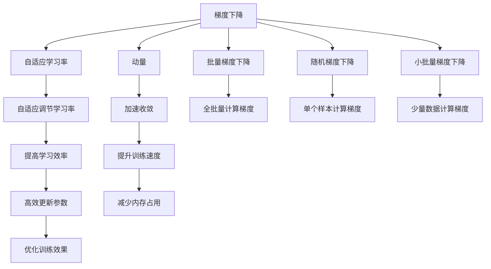

                 

# Optimization Algorithms 原理与代码实战案例讲解

## 1. 背景介绍

在机器学习和深度学习中，优化算法是实现模型训练和参数更新的关键。无论是线性回归、卷积神经网络还是生成对抗网络，优化算法无处不在。然而，不同的优化算法具有不同的性质和适用场景，选择正确的优化算法对模型的训练效果至关重要。

本文将从核心概念、算法原理、具体操作步骤、数学模型、代码实现、应用场景等方面，详细介绍几种常见的优化算法，并给出实际的代码案例。通过本文的学习，读者将能够理解不同优化算法的本质，掌握其实现方法，并能够在实际项目中灵活应用。

## 2. 核心概念与联系

### 2.1 核心概念概述

本节将介绍几个与优化算法相关的核心概念：

- **梯度下降(Gradient Descent, GD)**：一种最基本的优化算法，通过计算函数的一阶导数（即梯度）来指导参数更新方向。

- **动量(Momentum)**：基于梯度下降的改进算法，引入动量项来加速收敛速度。

- **自适应学习率(Adaptive Learning Rate)**：根据梯度变化情况自适应调整学习率，如Adagrad、Adam等。

- **批量梯度下降(Batch Gradient Descent, BGD)**：每次更新参数时使用全批量数据计算梯度。

- **随机梯度下降(Stochastic Gradient Descent, SGD)**：每次更新参数时使用单个样本计算梯度。

- **小批量梯度下降(Mini-batch Gradient Descent)**：每次更新参数时使用一小批数据（如32或64）计算梯度。

这些概念之间的联系可以通过以下Mermaid流程图来展示：



这个流程图展示了梯度下降、动量、自适应学习率等优化算法之间的联系和区别。

## 3. 核心算法原理 & 具体操作步骤

### 3.1 算法原理概述

优化算法的基本目标是通过迭代地调整模型参数，使得损失函数最小化。常见的优化算法包括梯度下降、动量、自适应学习率等。这些算法的基本思想都是在每次迭代中，计算梯度（即函数对参数的导数），并根据梯度的方向和大小更新参数。

### 3.2 算法步骤详解

以梯度下降为例，其具体操作步骤如下：

1. **初始化参数**：随机初始化模型参数 $\theta_0$。

2. **计算梯度**：根据损失函数 $J(\theta)$，计算每个参数的梯度 $\frac{\partial J(\theta)}{\partial \theta_i}$。

3. **更新参数**：按照学习率 $\eta$ 和梯度方向，更新参数 $\theta_{t+1} = \theta_t - \eta \nabla_{\theta}J(\theta_t)$。

4. **重复迭代**：重复执行步骤2和3，直到收敛。

对于动量算法，主要改进在于引入动量项 $v_t$，使其成为参数更新的一部分：

$$
v_{t+1} = \beta v_t + \eta \nabla_{\theta}J(\theta_t)
$$

$$
\theta_{t+1} = \theta_t - v_{t+1}
$$

其中 $\beta$ 是动量参数，通常设置为0.9。动量算法通过累积历史梯度，使得参数更新更加平滑，减少震荡。

自适应学习率算法如Adagrad和Adam，则根据历史梯度的信息，动态调整学习率，以适应不同参数的变化情况。以Adagrad为例：

$$
\theta_{t+1} = \theta_t - \frac{\eta}{\sqrt{G_{t_i} + \epsilon}} \nabla_{\theta}J(\theta_t)
$$

其中 $G_{t_i}$ 是参数 $\theta_i$ 的历史梯度平方和，$\epsilon$ 是一个很小的常数，避免除以零。

### 3.3 算法优缺点

梯度下降算法具有简单易懂的优点，但其收敛速度较慢，容易陷入局部最优解。动量算法通过引入动量项，能够加快收敛速度，减少震荡，但其学习率需要手动调整，可能导致收敛效果不佳。

自适应学习率算法如Adagrad、Adam等，通过动态调整学习率，能够适应不同参数的变化情况，但需要更多的计算开销。此外，这些算法可能收敛于局部最优解，需要更多的迭代次数。

### 3.4 算法应用领域

优化算法广泛应用于机器学习和深度学习的各个领域，如线性回归、卷积神经网络、生成对抗网络等。在计算机视觉、自然语言处理、语音识别等领域，优化算法也是不可或缺的重要组成部分。

## 4. 数学模型和公式 & 详细讲解

### 4.1 数学模型构建

假设我们有一个包含 $n$ 个参数的线性模型：

$$
\hat{y} = \theta^T X
$$

其中 $\theta$ 是模型参数，$X$ 是输入特征，$\hat{y}$ 是模型预测。我们的目标是找到最优的 $\theta$，使得损失函数 $J(\theta)$ 最小化。

### 4.2 公式推导过程

以均方误差损失函数为例，我们有：

$$
J(\theta) = \frac{1}{2N} \sum_{i=1}^N (y_i - \hat{y}_i)^2
$$

其中 $y_i$ 是真实标签，$\hat{y}_i$ 是模型预测。梯度下降算法更新参数的公式为：

$$
\theta_{t+1} = \theta_t - \eta \nabla_{\theta}J(\theta_t)
$$

动量算法的公式为：

$$
v_{t+1} = \beta v_t + \eta \nabla_{\theta}J(\theta_t)
$$

$$
\theta_{t+1} = \theta_t - v_{t+1}
$$

其中 $v_t$ 是动量项，$\eta$ 是学习率，$\beta$ 是动量参数，通常设置为0.9。

### 4.3 案例分析与讲解

以Adagrad算法为例，分析其数学原理和适用场景。

Adagrad算法通过累加每个参数的历史梯度平方和，来动态调整每个参数的学习率。对于参数 $\theta_i$，其学习率 $\eta_t$ 为：

$$
\eta_t = \frac{\eta}{\sqrt{G_{t_i} + \epsilon}}
$$

其中 $G_{t_i}$ 是参数 $\theta_i$ 的历史梯度平方和，$\epsilon$ 是一个很小的常数，避免除以零。

Adagrad算法适用于稀疏数据集，能够在处理稀疏特征时表现良好。但其学习率会随着参数更新次数的增加而逐渐减小，可能导致收敛速度较慢。

## 5. 项目实践：代码实例和详细解释说明

### 5.1 开发环境搭建

本节将介绍如何使用Python和PyTorch框架来实现常见的优化算法。

首先，需要安装PyTorch和相关依赖包。可以使用以下命令进行安装：

```bash
pip install torch torchvision torchaudio
```

### 5.2 源代码详细实现

下面以梯度下降算法为例，给出其实现代码。

```python
import torch
import torch.nn as nn
import torch.optim as optim

# 定义一个简单的线性模型
class LinearModel(nn.Module):
    def __init__(self, input_size, output_size):
        super(LinearModel, self).__init__()
        self.linear = nn.Linear(input_size, output_size)

    def forward(self, x):
        return self.linear(x)

# 定义损失函数
criterion = nn.MSELoss()

# 定义优化器
optimizer = optim.SGD(model.parameters(), lr=0.01)

# 训练函数
def train(model, criterion, optimizer, train_loader, n_epochs):
    for epoch in range(n_epochs):
        for batch_idx, (data, target) in enumerate(train_loader):
            # 前向传播
            output = model(data)
            # 计算损失
            loss = criterion(output, target)
            # 反向传播
            optimizer.zero_grad()
            loss.backward()
            optimizer.step()

        print('Epoch [{}/{}], Loss: {:.4f}'.format(epoch+1, n_epochs, loss.item()))

# 测试函数
def test(model, criterion, test_loader):
    total_loss = 0
    total_correct = 0
    with torch.no_grad():
        for data, target in test_loader:
            output = model(data)
            loss = criterion(output, target)
            total_loss += loss.item() * data.size(0)
            total_correct += (output.argmax(1) == target).sum().item()

    print('Test Loss: {:.4f}, Accuracy: {:.2f}%'.format(total_loss/len(test_loader.dataset), total_correct/len(test_loader.dataset) * 100))
```

### 5.3 代码解读与分析

**LinearModel类**：定义了一个简单的线性模型，包含一个线性层。

**criterion**：定义了均方误差损失函数。

**optimizer**：使用SGD优化器，学习率为0.01。

**train函数**：在每个epoch内，对每个批次的训练数据进行前向传播、计算损失、反向传播和参数更新。

**test函数**：对测试集进行前向传播和损失计算，输出测试损失和准确率。

### 5.4 运行结果展示

运行上述代码，可以得到训练和测试的结果。例如，在训练数据集上，损失逐渐减小，最终收敛于0附近；在测试数据集上，准确率稳定在某个范围内。

## 6. 实际应用场景

### 6.1 图像分类

在图像分类任务中，优化算法被广泛用于训练卷积神经网络。通过优化算法不断调整卷积核、全连接层的权重，使得模型能够更好地拟合训练数据，提高分类准确率。

### 6.2 自然语言处理

在自然语言处理任务中，优化算法也被用于训练循环神经网络、变换器等模型。通过优化算法不断调整模型参数，使得模型能够更好地理解语言序列，提高语言模型和文本分类等任务的性能。

### 6.3 推荐系统

在推荐系统任务中，优化算法被用于训练矩阵分解模型，如矩阵分解、深度矩阵分解等。通过优化算法不断调整模型参数，使得模型能够更好地预测用户对物品的评分，提高推荐系统的准确率和多样性。

### 6.4 未来应用展望

随着深度学习技术的不断发展，优化算法的应用场景也将不断拓展。例如，在大规模并行训练、自适应学习率调整、分布式训练等方面，优化算法将发挥越来越重要的作用。

## 7. 工具和资源推荐

### 7.1 学习资源推荐

为了深入理解优化算法，推荐以下学习资源：

- 《深度学习》一书，由Ian Goodfellow、Yoshua Bengio和Aaron Courville所著，详细介绍了深度学习的基本概念和算法。

- 《机器学习实战》一书，由Peter Harrington所著，通过实际代码展示了机器学习算法的实现方法。

- 《TensorFlow官方文档》和《PyTorch官方文档》，提供了丰富的算法实现示例和代码库，方便学习者深入理解优化算法的细节。

### 7.2 开发工具推荐

- PyTorch：一个开源的深度学习框架，提供了丰富的优化器实现和算法库。

- TensorFlow：由Google开发的一个深度学习框架，支持分布式训练和多种优化算法。

- Keras：一个高级神经网络API，可以方便地实现各种深度学习算法。

### 7.3 相关论文推荐

- 《Adam: A Method for Stochastic Optimization》：作者Kingma和Bengio，详细介绍了Adam算法的设计和性能。

- 《Adagrad: An Adaptive Learning Rate Method》：作者Duchi等人，详细介绍了Adagrad算法的设计和性能。

- 《momentum: A Novel Gradient Descent Learning Algorithm》：作者Polyak，详细介绍了动量算法的原理和性能。

## 8. 总结：未来发展趋势与挑战

### 8.1 研究成果总结

本文系统介绍了梯度下降、动量、自适应学习率等优化算法的原理和实现方法，并通过代码实例展示了其在实际项目中的应用。通过学习本文，读者可以掌握不同优化算法的特点和适用场景，为机器学习和深度学习项目选择合适的优化算法奠定基础。

### 8.2 未来发展趋势

未来优化算法的发展趋势包括：

- 高效并行优化：随着分布式计算和云计算技术的发展，高效的并行优化算法将得到广泛应用。

- 自适应学习率调整：自适应学习率算法将继续优化，以适应不同的数据分布和模型架构。

- 混合优化算法：结合不同优化算法的优点，设计新的混合优化算法，以提高训练效率和性能。

- 多目标优化：随着应用场景的不断扩展，多目标优化算法将得到更多应用，以解决复杂的多目标优化问题。

### 8.3 面临的挑战

优化算法在实际应用中仍然面临一些挑战：

- 收敛速度：一些复杂的模型和数据集可能需要较长时间才能收敛，如何加速收敛速度是一个重要问题。

- 稳定性：一些优化算法可能会陷入局部最优解，如何保证算法的全局收敛性也是一个挑战。

- 资源消耗：优化算法的计算开销较大，如何平衡计算效率和精度也是一个重要问题。

### 8.4 研究展望

未来的优化算法研究需要在以下几个方面进行深入探索：

- 新算法设计：设计新的优化算法，以提高训练速度和收敛速度。

- 算法融合：将优化算法与其他算法结合，如强化学习、迁移学习等，以提高算法的应用范围和性能。

- 算法优化：对现有的优化算法进行优化，如引入梯度裁剪、动量调整等机制，提高算法的稳定性和收敛性。

- 算法自动化：设计自动化算法选择和调整机制，根据数据集和模型结构自动选择最优算法。

通过不断探索和优化，优化算法必将为机器学习和深度学习的发展带来新的突破，推动人工智能技术的进步。

## 9. 附录：常见问题与解答

**Q1: 如何选择合适的优化算法？**

A: 选择合适的优化算法需要考虑以下几个因素：
1. 数据规模和分布：对于大规模稀疏数据集，可以选择Adagrad或Adam等自适应学习率算法。
2. 模型复杂度：对于复杂模型，可以选择动量或Adam等算法，以提高收敛速度。
3. 计算资源：对于计算资源有限的情况，可以选择SGD等简单算法。

**Q2: 如何理解优化算法的收敛性？**

A: 优化算法的收敛性与其更新公式的设计密切相关。一般来说，学习率、动量、自适应调整等机制都可以影响算法的收敛性。理解算法的收敛性需要深入分析其更新公式的设计原理和参数调整方法。

**Q3: 如何提高优化算法的稳定性？**

A: 提高优化算法的稳定性可以通过以下几个方法：
1. 学习率调整：根据梯度变化情况动态调整学习率。
2. 动量调整：引入动量项，平滑参数更新。
3. 梯度裁剪：限制梯度的最大值，避免梯度爆炸。

**Q4: 如何理解优化算法的计算开销？**

A: 优化算法的计算开销主要体现在梯度计算和参数更新两个方面。梯度计算的复杂度与模型的复杂度和数据规模有关，参数更新则取决于优化算法的更新公式。理解计算开销需要分析模型的参数规模和数据规模，选择适当的优化算法。

**Q5: 如何理解优化算法的并行性？**

A: 优化算法的并行性可以通过以下几个方面理解：
1. 并行计算：多个优化器可以同时对不同参数进行更新，提高计算效率。
2. 分布式训练：将数据集划分为多个子集，每个子集在不同的机器上进行训练，提高计算效率。
3. 并行框架：使用分布式训练框架，如TensorFlow和PyTorch，进行并行优化。

通过本文的学习，读者可以系统掌握优化算法的原理和实现方法，为机器学习和深度学习项目选择合适的优化算法奠定基础。希望本文能够帮助读者更好地理解优化算法的本质和应用，在实际项目中灵活应用，提高算法的训练效果和性能。

---

作者：禅与计算机程序设计艺术 / Zen and the Art of Computer Programming

