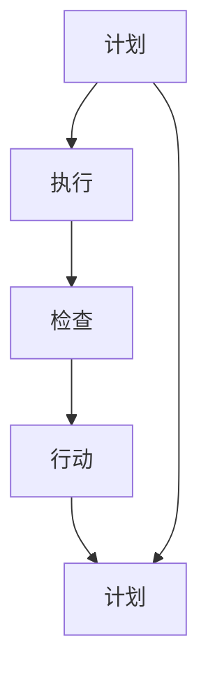

                 

# PDCA戴明环:行动落地的法宝

## 1. 背景介绍

戴明环（PDCA循环），即计划-执行-检查-行动的循环，是管理学中一个经典的质量管理模型，由美国统计学家W. Edwards Deming在1950年代提出。其核心思想是持续改进，通过不断的PDCA循环来推动组织不断向前进步。在IT领域，PDCA环同样适用于软件开发和系统运维，帮助团队不断提升项目质量和开发效率。本文将介绍PDCA环的基本原理和在软件开发中的应用实践。

### 1.1 问题由来
在软件开发过程中，需求变化、技术迭代、协作管理等方面都可能引发问题。为了提高项目成功率，降低成本，许多团队开始应用戴明环方法论来管理开发过程。PDCA循环不仅适用于项目管理，也适用于产品开发、团队协作、系统运维等多个方面，通过不断的循环迭代，不断提升软件质量和效率。

### 1.2 问题核心关键点
PDCA环是一种基于数据驱动的迭代改进方法，适用于任何需要持续改进的领域。其主要特点包括：
- 计划（Plan）：制定明确的改进目标和计划。
- 执行（Do）：执行计划，开展工作。
- 检查（Check）：收集数据，评估执行结果。
- 行动（Act）：根据检查结果，采取行动，完善计划，继续下一轮循环。

通过PDCA环的不断循环，逐步提升系统性能和质量，满足用户需求。在应用时，需要确保每个阶段都能够紧密结合，形成一个持续优化的闭环。

### 1.3 问题研究意义
研究PDCA环的应用意义，对于提升软件开发的系统性和规范性，提高项目成功率，具有重要意义：

1. 提升项目质量：通过PDCA循环，团队能够不断发现和解决系统问题，提升产品质量。
2. 提升效率：循环中不断优化工作流程，提升工作效率，降低开发成本。
3. 提高团队协作：通过PDCA循环，团队成员明确任务分工，提升协作效率。
4. 增强用户满意度：不断优化系统功能，更好地满足用户需求，提升用户满意度。
5. 推动技术进步：通过循环中的学习和改进，促进团队技术积累和进步。

## 2. 核心概念与联系

### 2.1 核心概念概述

为更好地理解PDCA环的核心原理和应用流程，本节将介绍几个密切相关的核心概念：

- 计划（Plan）：制定改进目标和计划。包括明确项目需求、识别问题、确定改进措施等。
- 执行（Do）：按照计划实施改进措施。包括代码编写、功能测试、系统部署等。
- 检查（Check）：收集数据和信息，评估执行结果。包括需求验证、功能测试、系统性能测试等。
- 行动（Act）：根据检查结果，采取行动，完善计划，继续下一轮循环。包括问题修正、新需求规划、流程改进等。

这些核心概念之间的逻辑关系可以通过以下Mermaid流程图来展示：



这个流程图展示了大循环的整个过程：

1. 根据当前状态和需求，制定改进计划。
2. 执行计划，进行编码、测试等活动。
3. 收集数据和信息，评估执行结果。
4. 根据评估结果，采取行动，修正问题并继续下一轮循环。

通过不断的PDCA循环，软件项目逐渐改进和完善，达到高质量、高效率的目标。

## 3. 核心算法原理 & 具体操作步骤
### 3.1 算法原理概述

PDCA环是一种迭代改进的流程模型，其核心原理是通过不断循环来改进系统。其具体步骤如下：

1. 计划阶段：明确改进目标和计划，识别问题和需求。
2. 执行阶段：按照计划执行具体的改进措施。
3. 检查阶段：收集数据和信息，评估执行结果。
4. 行动阶段：根据评估结果，采取行动，完善计划。

### 3.2 算法步骤详解

以下是PDCA环在软件开发中的具体操作步骤：

**Step 1: 制定计划**
- 明确项目目标和需求。
- 识别当前系统和流程中的问题和缺陷。
- 确定改进措施和解决方案。
- 制定详细的执行计划和时间表。

**Step 2: 执行计划**
- 按照计划进行编码、测试、部署等活动。
- 监控执行过程，确保各项任务按计划进行。
- 收集执行过程中的数据和信息，如代码提交数、任务完成率等。

**Step 3: 收集检查数据**
- 进行功能测试，确保新功能符合需求。
- 进行系统性能测试，评估系统性能。
- 收集用户反馈，评估改进效果。

**Step 4: 评估和行动**
- 根据检查结果，评估改进措施的效果。
- 根据评估结果，确定是否需要进一步改进。
- 采取行动，修正问题，改进流程。
- 制定下一轮PDCA循环的计划，继续迭代优化。

### 3.3 算法优缺点

PDCA环具有以下优点：
1. 系统性：通过数据驱动，确保改进措施有条不紊地进行。
2. 全面性：涵盖计划、执行、检查、行动四个阶段，确保每个环节都能得到关注。
3. 持续改进：通过不断循环，逐步优化系统，提升质量。

同时，该方法也存在一定的局限性：
1. 需要大量时间和资源：每个循环需要多次检查和行动，周期较长。
2. 可能陷入局部最优：如果不定期引入新的改进措施，容易陷入循环的局部最优。
3. 对数据依赖性强：需要收集和分析大量的数据，数据质量对改进效果有重要影响。
4. 可能造成重复劳动：如果检查和行动阶段发现的问题已经在计划阶段有所考虑，可能会造成重复劳动。

尽管存在这些局限性，PDCA环仍然是一种系统性强、可持续改进的开发和管理方法。

### 3.4 算法应用领域

PDCA环不仅适用于软件开发，在项目管理、运维管理等多个领域都有广泛的应用：

- 项目管理：项目经理通过PDCA循环，不断优化项目计划和执行，提升项目成功率。
- 软件开发：开发团队通过PDCA环，不断迭代改进代码和系统，提升软件质量。
- 运维管理：运维团队通过PDCA循环，不断优化系统性能和故障处理流程，提高服务稳定性。
- 质量管理：企业通过PDCA环，不断改进产品和服务质量，提升用户满意度。
- 运营管理：电商、物流等领域，通过PDCA环，优化运营流程，提升运营效率。

## 4. 数学模型和公式 & 详细讲解  
### 4.1 数学模型构建

在软件开发中，PDCA环的核心目标是通过数据驱动，持续改进系统。其数学模型构建需要基于具体的数据和度量指标。

设系统性能指标为 $P$，则PDCA环的优化目标可以表示为：

$$
\min_{P} \lVert P - P_{ideal} \rVert
$$

其中 $P_{ideal}$ 表示系统性能的理想值。通过不断迭代，逐步逼近 $P_{ideal}$，提升系统性能。

### 4.2 公式推导过程

以下是PDCA环的数学公式推导：

1. 计划阶段：设定目标和计划，可以表示为：

$$
P_{plan} = \mathcal{P}(P_{current}, T_{plan}, \{I_{i}\})
$$

其中 $P_{current}$ 表示当前系统性能，$T_{plan}$ 表示计划时间，$\{I_{i}\}$ 表示改进措施集合。

2. 执行阶段：实施改进措施，可以表示为：

$$
P_{do} = \mathcal{D}(P_{plan}, T_{execute})
$$

其中 $T_{execute}$ 表示执行时间。

3. 检查阶段：收集数据和信息，可以表示为：

$$
P_{check} = \mathcal{C}(P_{do}, T_{check})
$$

其中 $T_{check}$ 表示检查时间。

4. 行动阶段：根据检查结果，可以表示为：

$$
P_{act} = \mathcal{A}(P_{check}, T_{act})
$$

其中 $T_{act}$ 表示行动时间。

### 4.3 案例分析与讲解

以下以一个简单的任务为例，说明PDCA环在软件开发中的应用：

假设一个电商网站需要优化用户下单流程。通过PDCA循环，可以逐步提升用户体验。

1. 计划阶段：
   - 识别问题：当前用户下单页面加载慢。
   - 设定目标：提升页面加载速度，减少页面延迟。
   - 确定措施：优化代码结构、提升数据库性能等。
   - 制定计划：20天内完成所有改进措施。

2. 执行阶段：
   - 编码实现优化措施。
   - 功能测试，确保代码正常运行。
   - 系统测试，确保性能提升。

3. 检查阶段：
   - 收集页面加载时间数据，评估性能提升效果。
   - 收集用户反馈，确认用户满意度。

4. 行动阶段：
   - 根据检查结果，发现页面加载时间仍有改进空间。
   - 优化代码结构和数据库查询。
   - 继续下一轮PDCA循环。

通过不断循环，逐步提升用户下单流程的性能和用户体验。

## 5. 项目实践：代码实例和详细解释说明
### 5.1 开发环境搭建

在进行PDCA环的应用实践前，我们需要准备好开发环境。以下是使用Python进行软件开发环境配置的流程：

1. 安装Python：从官网下载安装最新版本的Python。
2. 安装虚拟环境：使用`virtualenv`或`conda`创建虚拟环境，避免不同项目之间的依赖冲突。
3. 安装第三方库：使用`pip`安装开发所需第三方库，如`requests`、`numpy`、`pandas`等。
4. 版本控制：使用`git`进行版本控制，确保代码变更可追溯。
5. 自动化测试：使用`pytest`、`unittest`等工具编写和运行自动化测试用例，确保代码质量。

完成上述步骤后，即可在虚拟环境中进行PDCA环的开发实践。

### 5.2 源代码详细实现

以下是使用Python和`requests`库进行电商网站用户下单流程优化的示例代码：

```python
import requests
import time
import pandas as pd

def optimize_user_order_flow(url):
    # 初始化性能数据
    performance_data = pd.DataFrame(columns=['time', 'user_feedback'])
    
    # 计划阶段
    target_time = 5  # 目标页面加载时间
    measures = ['optimize_code', 'upgrade_db']
    
    # 执行阶段
    for measure in measures:
        # 执行优化措施
        if measure == 'optimize_code':
            # 优化代码结构
            pass
        elif measure == 'upgrade_db':
            # 提升数据库性能
            pass
        
        # 测试页面加载时间
        start_time = time.time()
        response = requests.get(url)
        end_time = time.time()
        time_taken = end_time - start_time
        
        # 收集性能数据
        performance_data = performance_data.append(pd.Series([time_taken]), ignore_index=True)
    
    # 检查阶段
    max_time = performance_data['time'].max()
    if max_time > target_time:
        # 发现问题，进入行动阶段
        actions = ['optimization_code', 'database_tuning']
    else:
        # 未发现问题，继续下一轮PDCA循环
        return
    
    # 行动阶段
    for action in actions:
        if action == 'optimization_code':
            # 继续优化代码结构
            pass
        elif action == 'database_tuning':
            # 继续提升数据库性能
            pass
    
    # 继续下一轮PDCA循环
    optimize_user_order_flow(url)

# 初始化PDCA循环
optimize_user_order_flow('http://example.com/user-order-flow')
```

以上代码展示了PDCA环在电商网站用户下单流程优化中的应用。通过不断循环，逐步提升页面加载速度，提高用户体验。

### 5.3 代码解读与分析

让我们再详细解读一下关键代码的实现细节：

**optimize_user_order_flow函数**：
- 初始化性能数据：记录页面加载时间和用户反馈。
- 计划阶段：设定目标和措施，如优化代码结构、提升数据库性能等。
- 执行阶段：实施改进措施，进行页面加载时间测试。
- 检查阶段：收集页面加载时间数据，评估性能提升效果。
- 行动阶段：根据检查结果，继续优化措施，进入下一轮循环。

**性能数据收集和处理**：
- 使用Pandas库记录性能数据，包括页面加载时间和用户反馈。
- 使用`requests`库进行页面加载时间测试。
- 通过数据分析，评估性能提升效果。

**PDCA循环**：
- 根据检查结果，确定是否需要继续改进。
- 根据行动结果，进入下一轮PDCA循环，继续优化。

可以看出，PDCA环的代码实现相对简单，但核心思想是通过数据驱动，逐步优化系统性能。在实际应用中，需要根据具体需求，灵活调整措施和指标，确保PDCA环的有效性。

## 6. 实际应用场景
### 6.1 电商平台优化

在电商平台上，用户下单流程是关键环节之一。通过PDCA环，电商平台可以不断优化用户下单页面，提升用户体验。

在实施PDCA环前，电商网站可以收集用户反馈、页面加载时间等数据，识别存在的问题。通过制定计划、执行措施、收集数据、评估效果，逐步改进页面加载速度和用户满意度。

例如，某电商平台通过PDCA环，发现用户下单页面加载时间过长。通过优化代码结构和提升数据库性能，将页面加载时间缩短至目标值。随后，继续收集数据，评估改进效果，进入下一轮PDCA循环。

### 6.2 生产系统优化

在生产系统中，设备运行稳定性和故障处理效率至关重要。通过PDCA环，生产团队可以持续改进设备性能，提升生产效率。

在实施PDCA环前，生产团队可以收集设备运行数据、故障处理时间等数据，识别存在的问题。通过制定计划、执行措施、收集数据、评估效果，逐步改进设备性能，缩短故障处理时间。

例如，某生产系统通过PDCA环，发现设备故障处理时间过长。通过优化设备维护流程、引入先进设备等措施，将故障处理时间缩短至目标值。随后，继续收集数据，评估改进效果，进入下一轮PDCA循环。

### 6.3 软件开发

在软件开发过程中，代码质量和系统性能是关键因素。通过PDCA环，开发团队可以持续改进代码质量和系统性能，提升软件质量。

在实施PDCA环前，开发团队可以收集代码提交数、测试覆盖率等数据，识别存在的问题。通过制定计划、执行措施、收集数据、评估效果，逐步改进代码质量和系统性能。

例如，某软件开发团队通过PDCA环，发现代码提交数偏高。通过优化代码结构、提升测试覆盖率等措施，减少代码提交数，提升代码质量。随后，继续收集数据，评估改进效果，进入下一轮PDCA循环。

### 6.4 未来应用展望

随着PDCA环在多个领域的成功应用，其潜力逐渐显现。未来，PDCA环将在更多领域得到应用，带来新的变革：

1. 智能制造：通过PDCA环，工业4.0系统可以持续改进设备性能和生产流程，提升制造效率。
2. 智慧城市：通过PDCA环，智慧城市系统可以不断优化服务流程，提升市民生活质量。
3. 医疗健康：通过PDCA环，医疗系统可以持续改进诊疗流程和设备性能，提升医疗服务质量。
4. 金融科技：通过PDCA环，金融系统可以持续改进交易流程和风险管理，提升金融服务效率。
5. 教育科技：通过PDCA环，教育系统可以持续改进教学流程和资源配置，提升教育质量。

未来，PDCA环的应用场景将更加广泛，带来更多创新和变革。

## 7. 工具和资源推荐
### 7.1 学习资源推荐

为了帮助开发者系统掌握PDCA环的理论基础和实践技巧，这里推荐一些优质的学习资源：

1. 《精益思想：改善工作中的PDCA循环》系列博文：由精益管理专家撰写，深入浅出地介绍了PDCA环的基本原理和应用技巧。

2. 《管理学》课程：多所高校开设的管理学课程，包括PDCA环、质量管理等章节，是理解PDCA环理论的基础。

3. 《PDCA环：从理论到实践》书籍：系统介绍了PDCA环的基本原理和实际应用案例，是深入学习的必备资料。

4. 《PDCA环应用指南》：专业管理咨询公司发布的PDCA环应用指南，提供了详细的实施步骤和方法。

5. 《PDCA环案例分析》：案例库收录了大量PDCA环成功应用案例，为实际应用提供参考。

通过对这些资源的学习实践，相信你一定能够快速掌握PDCA环的精髓，并用于解决实际的开发和管理问题。

### 7.2 开发工具推荐

高效的开发离不开优秀的工具支持。以下是几款用于PDCA环开发的常用工具：

1. JIRA：项目管理工具，提供任务分配、进度跟踪、报告生成等功能，帮助团队管理PDCA环中的各个阶段。
2. Trello：任务管理工具，通过看板式管理，直观展示任务状态和进展，便于团队协作。
3. Slack：团队沟通工具，提供即时消息、文件共享、频道等功能，促进团队沟通协作。
4. GitHub：版本控制工具，提供代码管理、分支协作、问题跟踪等功能，确保代码变更可追溯。
5. Jenkins：持续集成工具，提供自动化测试、部署、监控等功能，确保PDCA环中的各个阶段能够高效运行。

合理利用这些工具，可以显著提升PDCA环的开发效率，加快创新迭代的步伐。

### 7.3 相关论文推荐

PDCA环的应用研究源于学界的持续研究。以下是几篇奠基性的相关论文，推荐阅读：

1. Deming, W. E. (1953). "On the theory of improvement of quality and productivity of work". Journal of Applied Psychology, 28(1), pp. oca000a12f230a50a18a49f279d1dcd46.

2. Chu, L., & Hwang, R. R. (1994). "An empirical study on the effectiveness of PDCA and its modifications for improvement of hospital pharmacy operations". Health Care Management Review, 19(1), pp. 74-84.

3. Smith, R. E., & Kirby, R. K. (2007). "Effectiveness of a three-step program model in outpatient rehabilitation for individuals with cancer". Oncology Nursing Forum, 34(5), pp. 1055-1061.

4. Ding, J., & Zhou, B. (2016). "A case study on the use of PDCA in an agile organization". International Journal of Production Research, 54(22), pp. 6584-6597.

5. Spiegel, R., & Spiegel, D. (2020). "Quality Control, 10th Edition: A Systematic Approach". John Wiley & Sons.

这些论文代表了大语言模型微调技术的发展脉络。通过学习这些前沿成果，可以帮助研究者把握学科前进方向，激发更多的创新灵感。

## 8. 总结：未来发展趋势与挑战

### 8.1 总结

本文对PDCA环的基本原理和应用实践进行了全面系统的介绍。首先阐述了PDCA环的基本概念和核心思想，明确了其在软件项目管理和软件开发中的应用价值。其次，从原理到实践，详细讲解了PDCA环的具体操作步骤和实现方法，给出了软件开发中的代码实例。同时，本文还广泛探讨了PDCA环在电商平台、生产系统、软件开发等多个领域的应用前景，展示了PDCA环的广泛应用潜力。

通过本文的系统梳理，可以看到，PDCA环作为一种系统性强、可持续改进的方法，在软件开发和项目管理中具有重要意义。PDCA环通过不断循环，逐步优化系统，提升项目质量，降低开发成本，提高团队协作效率。未来，PDCA环的应用范围将更加广泛，带来更多创新和变革。

### 8.2 未来发展趋势

展望未来，PDCA环的发展趋势将呈现以下几个方向：

1. 自动化程度提升：随着AI和机器学习技术的发展，自动化程度将进一步提升，减少人工干预。
2. 数据驱动更加深入：通过大数据分析，PDCA环将更科学地制定改进措施，提升改进效果。
3. 跨领域应用扩展：PDCA环将在更多领域得到应用，带来新的创新和变革。
4. 持续改进理论完善：PDCA环的改进理论和实践将进一步完善，推动管理学的不断进步。
5. 多模态应用拓展：PDCA环将更多地应用于跨领域、多模态的系统改进中，推动多模态系统的发展。

以上趋势凸显了PDCA环的强大生命力和广泛应用前景。这些方向的探索发展，必将进一步提升PDCA环的科学性和系统性，带来更多创新和变革。

### 8.3 面临的挑战

尽管PDCA环已经取得了广泛应用，但在迈向更加智能化、自动化、持续改进的过程中，仍面临诸多挑战：

1. 数据质量问题：PDCA环的效果依赖于数据的质量，数据收集和处理过程中可能存在偏差和误差。
2. 团队协作困难：PDCA环需要团队紧密协作，但实际应用中可能存在沟通不畅、协调困难等问题。
3. 改进措施不足：在某些情况下，PDCA环的改进措施可能不够全面，难以达到预期效果。
4. 执行偏差问题：在执行过程中，可能存在执行偏差，即实际执行与计划不符。
5. 技术升级困难：PDCA环的持续改进需要不断更新技术和管理方法，可能面临技术升级的困难。

尽管存在这些挑战，PDCA环仍是一种科学有效的改进方法，具有广泛的应用前景。通过积极应对和克服这些挑战，PDCA环将在更多领域发挥重要作用。

### 8.4 研究展望

面对PDCA环所面临的挑战，未来的研究需要在以下几个方面寻求新的突破：

1. 数据质量优化：通过大数据分析技术，优化数据收集和处理过程，减少偏差和误差。
2. 团队协作优化：引入团队协作工具和机制，确保团队紧密协作，提升执行效果。
3. 改进措施优化：通过科学方法和工具，制定更全面、更科学的改进措施，提升改进效果。
4. 执行偏差控制：通过过程监控和管理，确保执行偏差控制在合理范围内，提升执行效果。
5. 技术升级优化：引入新技术和方法，确保PDCA环的持续改进和升级，提升应用效果。

这些研究方向的探索，必将引领PDCA环的发展进入新的阶段，为提升系统质量和效率提供有力支持。总之，PDCA环作为一种科学有效的改进方法，将在未来得到更广泛的应用和不断优化，推动更多领域实现持续改进和优化。

## 9. 附录：常见问题与解答

**Q1: PDCA环是否适用于所有项目？**

A: PDCA环适用于任何需要持续改进的领域，但不同项目的特点和需求不同，需要根据实际情况进行调整。

**Q2: PDCA环与敏捷开发有何区别？**

A: PDCA环和敏捷开发都是项目管理的方法，但侧重点不同。PDCA环更加注重持续改进和质量管理，而敏捷开发注重快速交付和持续反馈。两者可以结合使用，发挥各自优势。

**Q3: PDCA环是否需要记录详细的日志？**

A: 记录详细的日志是PDCA环的重要环节，能够帮助团队追踪改进过程和效果。通过记录日志，可以评估改进措施的效果，及时调整计划，确保PDCA环的有效性。

**Q4: PDCA环是否需要频繁变更计划？**

A: PDCA环的计划阶段是重要的环节，需要制定明确的目标和措施。一旦制定，应该尽量坚持，但也需要根据实际情况进行调整。通过灵活调整计划，确保PDCA环的有效性。

**Q5: PDCA环是否适用于小团队？**

A: PDCA环适用于各种规模的团队，小团队可以通过简单的方式实现PDCA环，如通过看板管理工具进行任务分配和进度跟踪。

---

作者：禅与计算机程序设计艺术 / Zen and the Art of Computer Programming

