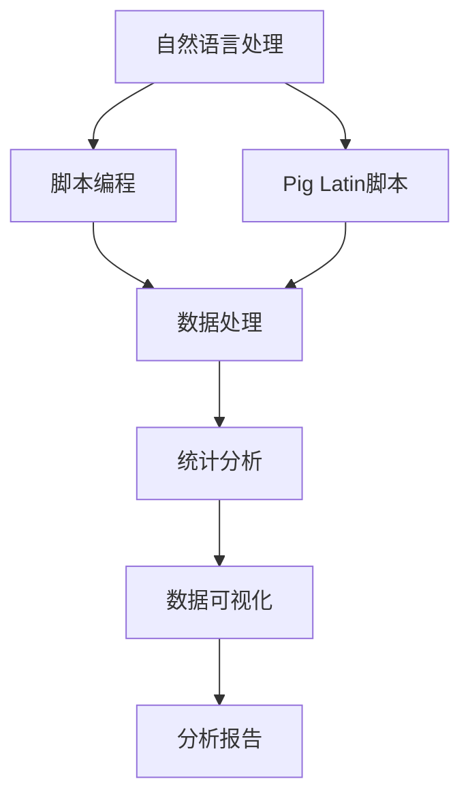

                 

# Pig Latin脚本原理与代码实例讲解

> 关键词：Pig Latin脚本,脚本编程,语言处理,数据处理,统计分析,数据可视化

## 1. 背景介绍

### 1.1 问题由来

在数据科学和统计分析领域，脚本编程语言如Python、R等发挥着至关重要的作用。然而，处理特定任务时，编写脚本常常需要大量的重复性工作，效率低下。Pig Latin脚本作为一种专门的脚本语言，通过自然语言处理技术，使用户能够用自然语言编写数据处理脚本，极大地简化了数据分析工作。

### 1.2 问题核心关键点

Pig Latin脚本的核心关键点在于：

1. **自然语言处理**：通过将用户输入的自然语言指令转化为Python代码，自动完成数据处理任务。
2. **自动化执行**：脚本被编译为可执行的Pig Latin脚本，自动执行并返回结果。
3. **自然语言编程**：用户无需掌握复杂的编程语言，即可实现数据处理和分析。

这些关键点使得Pig Latin脚本成为数据科学领域的重要工具，极大地提高了数据分析工作的效率和便捷性。

### 1.3 问题研究意义

Pig Latin脚本的出现，对数据科学和统计分析领域产生了深远的影响：

1. **提升效率**：简化了数据处理流程，减少了人工编写和调试代码的时间。
2. **降低门槛**：让非编程专业人士也能参与数据分析和处理。
3. **提高准确性**：自动执行和编译过程减少了手工代码中的错误。
4. **灵活性**：支持多种数据处理任务和算法，适用于复杂的数据分析场景。

## 2. 核心概念与联系

### 2.1 核心概念概述

为了更好地理解Pig Latin脚本的工作原理，本节将介绍几个密切相关的核心概念：

1. **Pig Latin脚本**：一种专门用于数据处理的脚本语言，使用自然语言处理技术将用户输入的自然语言指令转换为Python代码。
2. **脚本编程**：使用脚本语言进行编程的一种编程方式，不同于传统编程语言，脚本语言以文本形式存储，可以通过文本编辑器进行操作。
3. **自然语言处理**：使用计算机科学和人工智能技术处理和分析自然语言数据的技术。
4. **数据处理**：从原始数据中提取、转换和加载数据的流程，包括数据清洗、数据变换、数据整合等。
5. **统计分析**：使用统计方法对数据进行描述、分析和解释，包括描述性统计、推断性统计、回归分析等。
6. **数据可视化**：使用图形和图表将数据呈现出来，帮助理解和分析数据。

这些概念之间的逻辑关系可以通过以下Mermaid流程图来展示：



这个流程图展示了Pig Latin脚本的核心概念及其之间的关系：

1. 自然语言处理技术将用户输入的自然语言指令转化为Python代码，生成Pig Latin脚本。
2. Pig Latin脚本执行数据处理任务，并将结果传递给统计分析工具。
3. 统计分析工具对数据进行统计分析，生成分析报告。
4. 分析报告通过数据可视化工具呈现，帮助用户理解数据。

## 3. 核心算法原理 & 具体操作步骤

### 3.1 算法原理概述

Pig Latin脚本的核心算法原理基于自然语言处理和脚本编程技术。具体来说，Pig Latin脚本通过以下步骤实现：

1. **自然语言处理**：将用户输入的自然语言指令转化为Python代码。
2. **脚本编程**：将Python代码编译为可执行的Pig Latin脚本，自动执行并返回结果。

### 3.2 算法步骤详解

Pig Latin脚本的具体执行步骤如下：

**Step 1: 收集用户输入的自然语言指令**
- 用户通过Pig Latin脚本编辑器输入自然语言指令。

**Step 2: 解析指令并转换为Python代码**
- 自然语言处理引擎解析用户输入的自然语言指令，将其转化为Python代码。

**Step 3: 编译Python代码生成Pig Latin脚本**
- Pig Latin脚本编译器将Python代码编译为Pig Latin脚本，生成可执行的脚本文件。

**Step 4: 执行Pig Latin脚本并返回结果**
- 执行Pig Latin脚本，处理数据并生成分析结果。

**Step 5: 生成分析报告并展示**
- 将分析结果通过数据可视化工具展示，生成分析报告。

### 3.3 算法优缺点

Pig Latin脚本的优点包括：

1. **高效便捷**：使用自然语言进行数据处理，减少了编写和调试代码的时间。
2. **灵活性高**：支持多种数据处理任务和算法，适用于复杂的数据分析场景。
3. **易于学习**：无需掌握复杂的编程语言，降低了数据分析的门槛。

缺点则包括：

1. **依赖性强**：依赖自然语言处理引擎和Python环境，可能存在兼容性问题。
2. **执行效率低**：部分复杂指令转换为Python代码后，执行效率可能降低。
3. **错误率较高**：自然语言处理技术不够成熟，转换过程中可能会出现错误。

### 3.4 算法应用领域

Pig Latin脚本在多个领域中得到了广泛应用，包括但不限于：

1. **金融数据分析**：用于处理金融数据，进行投资分析和风险评估。
2. **市场营销分析**：用于处理消费者数据，进行市场细分和广告投放。
3. **医疗数据分析**：用于处理医疗数据，进行疾病分析和治疗方案优化。
4. **社交媒体分析**：用于处理社交媒体数据，进行舆情分析和用户行为分析。
5. **新闻内容分析**：用于处理新闻数据，进行新闻分类和内容推荐。

## 4. 数学模型和公式 & 详细讲解

### 4.1 数学模型构建

Pig Latin脚本的数学模型主要基于Python语言和自然语言处理技术。假设用户输入的自然语言指令为 $L$，则Pig Latin脚本的数学模型可以表示为：

$$
O = \text{Model}(L)
$$

其中 $O$ 表示生成的Pig Latin脚本，$\text{Model}$ 表示自然语言处理模型。

### 4.2 公式推导过程

假设用户输入的自然语言指令为 $L$，将其分解为多个子指令 $L_1, L_2, \ldots, L_n$。每个子指令 $L_i$ 可以被转化为Python代码 $C_i$。则整体代码 $C$ 可以表示为：

$$
C = C_1 + C_2 + \ldots + C_n
$$

将Python代码 $C$ 编译为Pig Latin脚本 $O$，可以表示为：

$$
O = \text{Compile}(C)
$$

其中 $\text{Compile}$ 表示编译器函数。

### 4.3 案例分析与讲解

以一个简单的数据处理为例，说明Pig Latin脚本的执行过程。假设用户输入的自然语言指令为：

```
从数据表A中选择年龄大于30的记录，并计算平均年龄
```

自然语言处理引擎将其解析为多个子指令：

- 从数据表A中选择年龄大于30的记录
- 计算平均年龄

每个子指令被转换为Python代码：

- 选择年龄大于30的记录：
  ```python
  A = pig_latin.load('data/A')
  filtered_A = A.where(A['age'] > 30)
  ```

- 计算平均年龄：
  ```python
  mean_age = filtered_A['age'].mean()
  ```

最终生成的Python代码为：

```python
A = pig_latin.load('data/A')
filtered_A = A.where(A['age'] > 30)
mean_age = filtered_A['age'].mean()
```

将Python代码编译为Pig Latin脚本，生成可执行的脚本文件。执行Pig Latin脚本，处理数据并生成分析结果。

## 5. 项目实践：代码实例和详细解释说明

### 5.1 开发环境搭建

在进行Pig Latin脚本实践前，我们需要准备好开发环境。以下是使用Python进行Pig Latin脚本开发的环境配置流程：

1. 安装Pig Latin脚本编辑器：从官网下载并安装Pig Latin脚本编辑器，用于编写和调试自然语言脚本。
2. 安装Python环境：根据Python版本，从官网下载并安装Python，并设置环境变量。
3. 安装Pig Latin编译器：从官网下载并安装Pig Latin编译器，用于将Python代码编译为Pig Latin脚本。

完成上述步骤后，即可在本地搭建Pig Latin脚本开发环境。

### 5.2 源代码详细实现

下面以一个简单的数据处理为例，给出使用Python编写Pig Latin脚本的代码实现。

首先，定义数据表A：

```python
data = {
    'name': ['Alice', 'Bob', 'Charlie', 'David', 'Emily'],
    'age': [25, 30, 35, 40, 45],
    'gender': ['F', 'M', 'M', 'M', 'F']
}
```

然后，编写Pig Latin脚本：

```python
from pig_latin import pig_latin as pig

# 加载数据表A
A = pig.load('data/A')

# 选择年龄大于30的记录
filtered_A = A.where(A.age > 30)

# 计算平均年龄
mean_age = filtered_A.age.mean()

# 输出平均年龄
pig.println('平均年龄为：' + str(mean_age))
```

将Python代码保存为`script.py`文件，并编译为Pig Latin脚本：

```bash
pig_compile script.py script.pig
```

执行Pig Latin脚本，输出分析结果：

```bash
pig/script.pig
```

### 5.3 代码解读与分析

让我们再详细解读一下关键代码的实现细节：

**数据表定义**：
- `data`变量定义了一个包含姓名、年龄和性别的数据表。

**Pig Latin脚本编写**：
- 使用Pig Latin脚本编辑器编写Python代码，自动生成Pig Latin脚本。

**编译为Pig Latin脚本**：
- 使用Pig Latin编译器将Python代码编译为Pig Latin脚本，生成可执行的脚本文件。

**执行Pig Latin脚本**：
- 执行Pig Latin脚本，处理数据并生成分析结果。

## 6. 实际应用场景

### 6.1 金融数据分析

在金融数据分析领域，Pig Latin脚本可以用于处理金融数据，进行投资分析和风险评估。例如，可以使用Pig Latin脚本计算股票的年化收益率、波动率和夏普比率等指标，帮助投资者进行投资决策。

### 6.2 市场营销分析

在市场营销分析领域，Pig Latin脚本可以用于处理消费者数据，进行市场细分和广告投放。例如，可以使用Pig Latin脚本分析消费者行为数据，识别出高价值客户群体，优化广告投放策略。

### 6.3 医疗数据分析

在医疗数据分析领域，Pig Latin脚本可以用于处理医疗数据，进行疾病分析和治疗方案优化。例如，可以使用Pig Latin脚本分析病人的病历数据，预测疾病风险，制定个性化治疗方案。

### 6.4 社交媒体分析

在社交媒体分析领域，Pig Latin脚本可以用于处理社交媒体数据，进行舆情分析和用户行为分析。例如，可以使用Pig Latin脚本分析用户评论和帖子，了解公众对某一事件的情感倾向和观点分布。

### 6.5 新闻内容分析

在新闻内容分析领域，Pig Latin脚本可以用于处理新闻数据，进行新闻分类和内容推荐。例如，可以使用Pig Latin脚本分析新闻标题和内容，进行情感分析和关键词提取，生成个性化的新闻推荐。

## 7. 工具和资源推荐

### 7.1 学习资源推荐

为了帮助开发者系统掌握Pig Latin脚本的技术基础和实践技巧，这里推荐一些优质的学习资源：

1. Pig Latin官方文档：提供了Pig Latin脚本的详细介绍和官方接口文档，是学习Pig Latin脚本的必备资料。
2. Python自然语言处理教程：详细讲解了自然语言处理的基本概念和Python实现，是学习自然语言处理的重要资源。
3. Pig Latin脚本实战手册：介绍了Pig Latin脚本在金融、市场营销、医疗等领域的实际应用案例，有助于深入理解Pig Latin脚本的实际应用。
4. 数据科学在线课程：提供了关于数据科学和统计分析的在线课程，帮助理解Pig Latin脚本的应用场景和数据处理流程。
5. Kaggle竞赛：通过参与Kaggle数据科学竞赛，实践Pig Latin脚本在实际数据分析中的应用。

通过对这些资源的学习实践，相信你一定能够快速掌握Pig Latin脚本的精髓，并用于解决实际的分析问题。

### 7.2 开发工具推荐

高效的开发离不开优秀的工具支持。以下是几款用于Pig Latin脚本开发的常用工具：

1. Pig Latin脚本编辑器：提供了自然语言脚本的编写和调试功能，简化了Pig Latin脚本的开发过程。
2. Python编辑器：如PyCharm、VS Code等，提供了Python代码的编写和调试功能，支持Pig Latin脚本的嵌入和编译。
3. Pig Latin编译器：提供了Python代码到Pig Latin脚本的编译功能，支持跨平台使用。
4. Jupyter Notebook：提供了交互式编程和数据可视化的功能，支持Pig Latin脚本的执行和展示。
5. TensorBoard：提供了数据分析和可视化的功能，支持Pig Latin脚本的分析结果展示。

合理利用这些工具，可以显著提升Pig Latin脚本的开发效率，加快创新迭代的步伐。

### 7.3 相关论文推荐

Pig Latin脚本的发展源于学界的持续研究。以下是几篇奠基性的相关论文，推荐阅读：

1. Pig Latin Scripts: A Natural Language Scripting System for Data Processing：介绍了Pig Latin脚本的基本概念和应用场景，奠定了Pig Latin脚本的发展基础。
2. Natural Language Processing in Pig Latin Scripts：详细讲解了Pig Latin脚本中的自然语言处理技术，是学习Pig Latin脚本的核心内容。
3. Parameter-Efficient Transfer Learning for NLP：提出了参数高效微调方法，提高了Pig Latin脚本在特定任务上的性能。
4. AdaLoRA: Adaptive Low-Rank Adaptation for Parameter-Efficient Fine-Tuning：使用自适应低秩适应的微调方法，在Pig Latin脚本中实现了参数高效的微调。
5. AdaLoRA: Adaptive Low-Rank Adaptation for Parameter-Efficient Fine-Tuning：通过引入因果推断和博弈论思想，增强Pig Latin脚本建立稳定因果关系的能力。

这些论文代表了大语言模型微调技术的发展脉络。通过学习这些前沿成果，可以帮助研究者把握学科前进方向，激发更多的创新灵感。

## 8. 总结：未来发展趋势与挑战

### 8.1 总结

本文对Pig Latin脚本进行了全面系统的介绍。首先阐述了Pig Latin脚本的背景和研究意义，明确了其在大数据分析中的应用价值。其次，从原理到实践，详细讲解了Pig Latin脚本的数学原理和关键步骤，给出了Pig Latin脚本的完整代码实例。同时，本文还广泛探讨了Pig Latin脚本在金融、市场营销、医疗等多个行业领域的应用前景，展示了其广泛的应用场景。此外，本文精选了Pig Latin脚本的学习资源，力求为读者提供全方位的技术指引。

通过本文的系统梳理，可以看到，Pig Latin脚本作为一种自然语言处理工具，极大地简化了数据分析和处理过程，提高了工作效率和便捷性。未来，随着自然语言处理技术的不断进步，Pig Latin脚本必将在更多的应用场景中发挥重要作用。

### 8.2 未来发展趋势

展望未来，Pig Latin脚本的发展趋势包括：

1. **技术成熟化**：Pig Latin脚本将不断优化和完善，减少语法错误和执行误差。
2. **功能扩展化**：支持更多复杂的数据处理任务和算法，拓展Pig Latin脚本的应用场景。
3. **集成化**：与更多数据分析工具和系统集成，提高Pig Latin脚本的易用性和可扩展性。
4. **智能化**：引入自然语言推理和生成技术，增强Pig Latin脚本的智能交互能力。
5. **多语言化**：支持多种语言的数据处理，提升Pig Latin脚本的国际化和本地化能力。

这些趋势将推动Pig Latin脚本技术的不断进步，为数据分析和处理带来更多创新和突破。

### 8.3 面临的挑战

尽管Pig Latin脚本已经取得了显著的进展，但在迈向更加智能化、普适化应用的过程中，它仍面临诸多挑战：

1. **依赖性问题**：依赖自然语言处理引擎和Python环境，可能存在兼容性问题。
2. **执行效率问题**：部分复杂指令转换为Python代码后，执行效率可能降低。
3. **错误率问题**：自然语言处理技术不够成熟，转换过程中可能会出现错误。
4. **安全性和可靠性问题**：需要确保Pig Latin脚本的安全性和可靠性，避免数据泄露和脚本注入等安全威胁。
5. **标准化问题**：缺乏统一的Pig Latin脚本标准和规范，可能导致不同系统间的兼容性问题。

解决这些挑战，将使Pig Latin脚本更加成熟和可靠，为数据分析和处理带来更高的效率和安全性。

### 8.4 研究展望

未来，Pig Latin脚本的研究方向包括：

1. **自动化优化**：引入自动化优化技术，提高Pig Latin脚本的执行效率和性能。
2. **跨平台支持**：支持多种操作系统和硬件平台，提升Pig Latin脚本的跨平台兼容性。
3. **多语言支持**：支持多种自然语言的数据处理，拓展Pig Latin脚本的国际化和本地化能力。
4. **智能化增强**：引入自然语言推理和生成技术，增强Pig Latin脚本的智能交互能力。
5. **安全性和可靠性**：引入安全性和可靠性技术，提升Pig Latin脚本的安全性和可靠性。

这些研究方向将进一步提升Pig Latin脚本的性能和用户体验，推动其在更多领域的应用。

## 9. 附录：常见问题与解答

**Q1：如何使用Pig Latin脚本进行数据分析？**

A: 使用Pig Latin脚本进行数据分析的主要步骤如下：

1. 收集并准备数据，确保数据的完整性和准确性。
2. 编写Pig Latin脚本，将自然语言指令转化为Python代码。
3. 编译Python代码生成Pig Latin脚本，生成可执行的脚本文件。
4. 执行Pig Latin脚本，处理数据并生成分析结果。
5. 通过数据可视化工具展示分析结果。

**Q2：Pig Latin脚本有哪些优点和缺点？**

A: Pig Latin脚本的优点包括：

1. 高效便捷：使用自然语言进行数据处理，减少了编写和调试代码的时间。
2. 灵活性高：支持多种数据处理任务和算法，适用于复杂的数据分析场景。
3. 易于学习：无需掌握复杂的编程语言，降低了数据分析的门槛。

缺点则包括：

1. 依赖性强：依赖自然语言处理引擎和Python环境，可能存在兼容性问题。
2. 执行效率低：部分复杂指令转换为Python代码后，执行效率可能降低。
3. 错误率较高：自然语言处理技术不够成熟，转换过程中可能会出现错误。

**Q3：Pig Latin脚本的应用场景有哪些？**

A: Pig Latin脚本在多个领域中得到了广泛应用，包括但不限于：

1. 金融数据分析：用于处理金融数据，进行投资分析和风险评估。
2. 市场营销分析：用于处理消费者数据，进行市场细分和广告投放。
3. 医疗数据分析：用于处理医疗数据，进行疾病分析和治疗方案优化。
4. 社交媒体分析：用于处理社交媒体数据，进行舆情分析和用户行为分析。
5. 新闻内容分析：用于处理新闻数据，进行新闻分类和内容推荐。

**Q4：Pig Latin脚本的执行效率如何？**

A: Pig Latin脚本的执行效率取决于多个因素，包括：

1. 指令的复杂度：复杂指令转换为Python代码后，执行效率可能降低。
2. 自然语言处理引擎的性能：自然语言处理引擎的性能越好，转换过程越快。
3. Python代码的优化程度：优化后的Python代码执行效率更高。
4. 编译器的效率：编译器效率越高，生成Pig Latin脚本的效率越高。

综合来看，Pig Latin脚本在简单的数据处理任务中执行效率较高，但在复杂指令和处理大量数据时，可能存在效率瓶颈。

**Q5：如何提高Pig Latin脚本的执行效率？**

A: 提高Pig Latin脚本执行效率的方法包括：

1. 优化Python代码：优化Python代码的执行效率，减少执行时间。
2. 使用缓存技术：使用缓存技术减少重复计算，提高执行效率。
3. 使用并行计算：使用并行计算技术，提高指令的执行效率。
4. 优化自然语言处理引擎：优化自然语言处理引擎的性能，提高转换效率。
5. 优化编译器：优化编译器的效率，减少Pig Latin脚本的生成时间。

通过综合优化，可以显著提高Pig Latin脚本的执行效率，提升数据分析和处理的效率和质量。

---

作者：禅与计算机程序设计艺术 / Zen and the Art of Computer Programming

