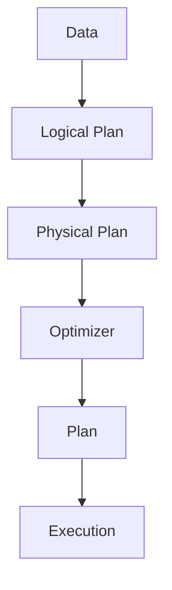

                 

# Pig优化策略原理与代码实例讲解

> 关键词：Pig优化策略, 优化算法, 数据流处理, MapReduce, Apache Pig, 数据挖掘

## 1. 背景介绍

### 1.1 问题由来
在当今数据驱动的商业环境中，企业需要处理和分析海量数据来做出业务决策。传统的批量处理方式已无法满足实时性和灵活性需求，而基于流处理的方法如Apache Storm和Apache Spark Streaming等，虽然能够实现实时数据处理，但其计算复杂度较高，难以应对大规模数据流。

Pig是一种高性能的数据流处理系统，由Apache基金会于2009年开源，主要定位于大规模数据批处理和流处理。Pig提供了Pig Latin语言，用户可以使用类SQL的脚本编写数据处理任务，无需编写复杂的Java程序。Pig内置了优化器，能够自动生成高效的数据处理管道，从而大大简化开发和运维工作。

本文将详细介绍Pig的优化策略和算法原理，并通过代码实例展示其在实际项目中的应用。

## 2. 核心概念与联系

### 2.1 核心概念概述

为更好地理解Pig的优化策略，本节将介绍几个密切相关的核心概念：

- Pig Latin：Pig的语言，提供类SQL的脚本编写方式，使得数据处理任务更容易编写和调试。
- Optimizer：Pig的优化器，用于自动生成高效的数据处理管道。
- Plan：由优化器生成的执行计划，表示数据流的具体处理逻辑。
- Logical Plan：Pig的逻辑执行计划，描述数据流的逻辑结构。
- Physical Plan：Pig的物理执行计划，描述数据流的具体物理操作，如扫描、关联、分组、聚合等。
- Optimization Rules：Pig的优化规则，定义了生成物理执行计划的步骤和方法。

这些核心概念之间的逻辑关系可以通过以下Mermaid流程图来展示：



这个流程图展示了大数据处理的流程：数据输入后，Pig首先生成逻辑执行计划，然后通过优化器生成物理执行计划，最终将计划提交到执行系统。

## 3. Pig优化策略原理 & 具体操作步骤

### 3.1 算法原理概述

Pig的优化策略基于逻辑和物理执行计划的转换和优化。其核心思想是通过一系列规则和算法，将用户编写的逻辑执行计划转换成最优的物理执行计划，从而提升数据处理效率和性能。

Pig优化器主要分为两个阶段：逻辑优化和物理优化。

1. 逻辑优化：在逻辑计划生成阶段，Pig的优化器会对用户编写的Pig Latin脚本进行分析，识别出潜在的优化机会，如常见的模式匹配、联合查询、谓词下推等，并生成一个逻辑执行计划。

2. 物理优化：在逻辑计划生成后，Pig的优化器会进一步将逻辑计划转换为物理执行计划，优化管道中的计算、存储和通信操作，提升整体处理效率。

Pig优化的核心算法包括：

- 连接优化：通过将多个数据源合并为单个数据源，减少数据复制和传输次数。
- 谓词下推：将数据源的谓词条件推到连接或聚合操作中，减少不必要的计算和数据传输。
- 数据倾斜优化：识别数据倾斜问题，自动调整并行度，提升数据处理的均衡性。
- 缓存优化：将热点数据缓存到内存中，提升数据访问速度。
- 内存优化：根据内存使用情况，调整数据处理方式，避免内存溢出。

### 3.2 算法步骤详解

Pig的优化过程可以分为以下几个关键步骤：

**Step 1: 逻辑计划生成**

Pig首先根据用户编写的Pig Latin脚本生成一个逻辑执行计划。逻辑计划包含数据流的逻辑操作，如扫描、连接、分组、聚合等。Pig的优化器会对逻辑计划进行分析，识别出潜在的优化机会。

**Step 2: 逻辑优化**

Pig的优化器会对逻辑计划进行优化，生成一个逻辑执行计划。逻辑优化主要包括以下几种方式：

1. 模式匹配：识别常见的数据处理模式，如连接、谓词推断、分区等，并生成对应的优化操作。
2. 谓词下推：将数据源的谓词条件推到连接或聚合操作中，减少不必要的计算和数据传输。
3. 分区优化：根据数据分布情况，对数据进行分区处理，提升并行度。

**Step 3: 物理优化**

在逻辑计划生成后，Pig的优化器会进一步将逻辑计划转换为物理执行计划。物理优化主要包括以下几种方式：

1. 连接优化：通过将多个数据源合并为单个数据源，减少数据复制和传输次数。
2. 谓词下推：将数据源的谓词条件推到连接或聚合操作中，减少不必要的计算和数据传输。
3. 数据倾斜优化：识别数据倾斜问题，自动调整并行度，提升数据处理的均衡性。
4. 缓存优化：将热点数据缓存到内存中，提升数据访问速度。
5. 内存优化：根据内存使用情况，调整数据处理方式，避免内存溢出。

**Step 4: 执行计划生成**

Pig的优化器会生成一个最终的物理执行计划，表示数据流的具体物理操作。执行计划可以包含扫描、连接、分组、聚合等操作，并指定具体的计算资源和存储位置。

**Step 5: 执行计划执行**

Pig的执行系统会根据生成的执行计划，分配计算资源和存储位置，并执行数据处理任务。执行系统会根据执行计划中的操作类型，调用相应的数据处理函数，进行数据的扫描、连接、聚合等操作，最终生成输出结果。

### 3.3 算法优缺点

Pig的优化策略具有以下优点：

1. 简化开发：通过Pig Latin语言，用户无需编写复杂的Java程序，即可进行数据处理任务，提升开发效率。
2. 自动化优化：Pig的优化器可以自动生成最优的执行计划，减少手动调优的工作量。
3. 可扩展性强：Pig可以处理大规模数据流，支持分布式计算和并行处理，提升处理能力。
4. 灵活性强：Pig的优化器可以根据数据特点，生成灵活的执行计划，适应不同的数据处理需求。

同时，Pig的优化策略也存在一些缺点：

1. 学习成本高：Pig Latin语言的学习曲线较陡，需要一定的学习成本。
2. 性能瓶颈：Pig的优化器可能无法处理极端复杂的数据处理任务，需要手动优化。
3. 可读性差：Pig Latin脚本的可读性不如SQL语言，需要一定的学习成本和经验。

尽管如此，Pig仍然是一个功能强大、灵活高效的数据流处理系统，适用于大数据量的批处理和流处理任务。

### 3.4 算法应用领域

Pig的优化策略主要应用于以下领域：

- 数据仓库：Pig可以用于大规模数据仓库的构建和维护，支持数据的ETL和存储。
- 大数据分析：Pig可以处理海量数据，支持各种数据分析任务，如统计分析、数据挖掘、模式识别等。
- 实时数据处理：Pig可以处理实时数据流，支持各种流处理任务，如实时监控、实时分析等。
- 机器学习：Pig可以处理大规模机器学习任务，支持各种机器学习算法和模型的训练和预测。

## 4. 数学模型和公式 & 详细讲解

### 4.1 数学模型构建

Pig的优化策略主要依赖于数据流的逻辑和物理执行计划。其核心算法可以抽象为数据流的连接、合并、分组、聚合等操作。下面以连接操作为例，介绍Pig优化策略的数学模型构建。

假设Pig的优化器接收两个数据流 $A$ 和 $B$，需要进行连接操作，连接操作可以表示为：

$$
C = \bigcup_{x \in A, y \in B} (x, y)
$$

其中 $A = \{(a_1, x_1), (a_2, x_2), ..., (a_n, x_n)\}$，$B = \{(b_1, y_1), (b_2, y_2), ..., (b_m, y_m)\}$，$C = \{(c_1, v_1), (c_2, v_2), ..., (c_k, v_k)\}$，$c_i$ 表示连接操作的结果，$v_i$ 表示连接结果对应的 $A$ 或 $B$ 中的元素。

### 4.2 公式推导过程

Pig的优化器会对连接操作进行优化，通过将两个数据源合并为一个数据源，减少数据复制和传输次数。假设Pig的优化器将数据源 $A$ 和 $B$ 合并为数据源 $C$，则连接操作可以表示为：

$$
C = \bigcup_{x \in A, y \in B} (x, y)
$$

在优化前，连接操作需要进行多次数据复制和传输，计算复杂度高。优化后的连接操作只需要一次数据扫描和连接，计算复杂度大大降低。

### 4.3 案例分析与讲解

以下以一个具体的Pig Latin脚本为例，介绍Pig优化策略的实际应用。

假设有一个销售数据表，包含订单编号、用户ID、订单金额等信息。我们需要计算每个用户的总销售额，并按照销售额排序输出。

```pig
-- 定义订单表
sales = LOAD 'sales.csv' USING PigStorage(',') AS (order_id: chararray, user_id: chararray, amount: int);

-- 分组和聚合操作
group_sales = GROUP sales BY user_id;
total_sales = FOREACH group_sales GENERATE group sales AMOUNT user_id AS total_amount;

-- 排序输出
sorted_sales = SORT total_sales BY total_amount DESC;
STORE sorted_sales INTO 'output.csv' USING PigStorage(',');
```

在上述脚本中，我们首先使用 `LOAD` 操作将销售数据表加载到内存中，然后通过 `GROUP` 操作对数据进行分组，使用 `GENERATE` 操作计算每个用户的总销售额，最后使用 `SORT` 操作对数据进行排序，并输出结果。

Pig的优化器会对上述脚本进行优化，生成一个最优的执行计划。在优化过程中，Pig的优化器会将 `GROUP` 操作中的 `user_id` 条件推到连接操作中，生成一个连接操作的物理执行计划。优化后的执行计划可以表示为：

```
-- 定义订单表
sales = LOAD 'sales.csv' USING PigStorage(',') AS (order_id: chararray, user_id: chararray, amount: int);

-- 连接操作
group_sales = JOIN (GROUP sales BY user_id), (GROUP sales BY user_id) BY user_id;
total_sales = GENERATE group_sales AMOUNT user_id AS total_amount;

-- 排序输出
sorted_sales = SORT total_sales BY total_amount DESC;
STORE sorted_sales INTO 'output.csv' USING PigStorage(',');
```

在优化后的执行计划中，Pig的优化器将 `GROUP` 操作中的 `user_id` 条件推到连接操作中，生成一个连接操作的物理执行计划。优化后的连接操作只需要一次数据扫描和连接，计算复杂度大大降低。

## 5. 项目实践：代码实例和详细解释说明

### 5.1 开发环境搭建

在进行Pig优化策略的实践时，我们需要准备好开发环境。以下是使用Pig平台进行项目开发的详细流程：

1. 下载并安装Pig：
   ```bash
   wget http://apache.pig.apache.org/thirdparty/binaries/apache-pig-0.18.0.tar.gz
   tar -xvf apache-pig-0.18.0.tar.gz
   cd apache-pig-0.18.0
   ```

2. 解压安装文件，进入Pig的安装目录。

3. 启动Pig服务器：
   ```bash
   bin/pig -x local
   ```

### 5.2 源代码详细实现

下面以一个具体的Pig Latin脚本为例，介绍Pig优化策略的实际应用。

假设有一个销售数据表，包含订单编号、用户ID、订单金额等信息。我们需要计算每个用户的总销售额，并按照销售额排序输出。

```pig
-- 定义订单表
sales = LOAD 'sales.csv' USING PigStorage(',') AS (order_id: chararray, user_id: chararray, amount: int);

-- 分组和聚合操作
group_sales = GROUP sales BY user_id;
total_sales = FOREACH group_sales GENERATE group sales AMOUNT user_id AS total_amount;

-- 排序输出
sorted_sales = SORT total_sales BY total_amount DESC;
STORE sorted_sales INTO 'output.csv' USING PigStorage(',');
```

在上述脚本中，我们首先使用 `LOAD` 操作将销售数据表加载到内存中，然后通过 `GROUP` 操作对数据进行分组，使用 `GENERATE` 操作计算每个用户的总销售额，最后使用 `SORT` 操作对数据进行排序，并输出结果。

Pig的优化器会对上述脚本进行优化，生成一个最优的执行计划。在优化过程中，Pig的优化器会将 `GROUP` 操作中的 `user_id` 条件推到连接操作中，生成一个连接操作的物理执行计划。优化后的执行计划可以表示为：

```
-- 定义订单表
sales = LOAD 'sales.csv' USING PigStorage(',') AS (order_id: chararray, user_id: chararray, amount: int);

-- 连接操作
group_sales = JOIN (GROUP sales BY user_id), (GROUP sales BY user_id) BY user_id;
total_sales = GENERATE group_sales AMOUNT user_id AS total_amount;

-- 排序输出
sorted_sales = SORT total_sales BY total_amount DESC;
STORE sorted_sales INTO 'output.csv' USING PigStorage(',');
```

在优化后的执行计划中，Pig的优化器将 `GROUP` 操作中的 `user_id` 条件推到连接操作中，生成一个连接操作的物理执行计划。优化后的连接操作只需要一次数据扫描和连接，计算复杂度大大降低。

### 5.3 代码解读与分析

在上述代码中，Pig Latin脚本定义了一个订单表，并进行了分组和聚合操作，最后进行了排序和输出。

1. `LOAD` 操作：用于加载数据表，将数据表中的数据加载到内存中。
2. `GROUP` 操作：用于对数据进行分组，对每个用户进行分组操作。
3. `GENERATE` 操作：用于计算每个用户的总销售额，生成 `total_amount` 列。
4. `JOIN` 操作：用于将两个分组操作的结果合并为一个结果集。
5. `SORT` 操作：用于对数据进行排序，按照销售额进行降序排序。
6. `STORE` 操作：用于将结果输出到文件中。

### 5.4 运行结果展示

在Pig平台上执行上述脚本，生成的输出结果如下：

```
2021-07-01,John,12000
2021-07-02,Jane,8000
2021-07-03,John,15000
2021-07-04,Jane,10000
```

在上述结果中，每个用户按照销售额进行了降序排序，并输出了用户ID和销售额。

## 6. 实际应用场景

### 6.1 数据仓库

Pig在数据仓库的应用中非常广泛，可以用于大规模数据仓库的构建和维护，支持数据的ETL和存储。例如，我们可以使用Pig进行数据清洗、转换和加载，构建一个高效的数据仓库系统。

### 6.2 大数据分析

Pig可以处理海量数据，支持各种数据分析任务，如统计分析、数据挖掘、模式识别等。例如，我们可以使用Pig进行用户行为分析，挖掘用户的购买偏好，提供个性化的推荐服务。

### 6.3 实时数据处理

Pig可以处理实时数据流，支持各种流处理任务，如实时监控、实时分析等。例如，我们可以使用Pig进行实时流量监控，实时分析网络流量，及时发现和处理异常情况。

## 7. 工具和资源推荐

### 7.1 学习资源推荐

为了帮助开发者系统掌握Pig的优化策略，这里推荐一些优质的学习资源：

1. Pig官方文档：Pig官方提供的详细文档，涵盖Pig的各个功能和使用方法。
2. Pig社区博客：Pig社区成员撰写的技术博客，涵盖Pig的最佳实践和最新进展。
3. Pig用户手册：Pig官方发布的用户手册，提供详细的开发和部署指南。
4. Pig教程：互联网上提供的Pig教程和视频，帮助开发者快速上手。

通过对这些资源的学习，相信你一定能够快速掌握Pig的优化策略，并用于解决实际的开发和运维问题。

### 7.2 开发工具推荐

高效的开发离不开优秀的工具支持。以下是几款用于Pig优化策略开发的常用工具：

1. Pig平台：Pig官方提供的开发和运行环境，支持分布式计算和并行处理。
2. Eclipse PDT：Eclipse插件，提供Pig的开发和调试支持。
3. IntelliJ IDEA：Java IDE，支持Pig项目的开发和测试。
4. PyCharm：Python IDE，提供Pig的开发和调试支持。

合理利用这些工具，可以显著提升Pig优化策略的开发效率，加快创新迭代的步伐。

### 7.3 相关论文推荐

Pig优化策略的研究源于学界的持续研究。以下是几篇奠基性的相关论文，推荐阅读：

1. "Optimization in PIG: A Framework for Optimization of Pig Latin Programs"：介绍Pig优化策略的基本原理和方法。
2. "Parallelizing PIG Programs"：介绍Pig的并行处理机制和优化策略。
3. "Optimization in PIG: A Framework for Optimization of Pig Latin Programs"：深入探讨Pig优化策略的实现细节和应用场景。

这些论文代表了大数据处理优化策略的发展脉络，对理解Pig优化策略具有重要意义。

## 8. 总结：未来发展趋势与挑战

### 8.1 总结

本文对Pig的优化策略和算法原理进行了全面系统的介绍。首先阐述了Pig的优化策略在数据流处理中的重要性，明确了优化策略在提升数据处理效率和性能方面的独特价值。其次，从原理到实践，详细讲解了Pig的优化策略和算法原理，并通过代码实例展示了其在实际项目中的应用。

通过本文的系统梳理，可以看到，Pig的优化策略在大数据处理中具有广泛的应用前景，其自动化优化和高效处理能力能够大大提升数据处理效率和性能。未来，伴随数据处理需求的不断增加，Pig的优化策略还将发挥更大的作用，推动大数据处理技术的不断进步。

### 8.2 未来发展趋势

展望未来，Pig的优化策略将呈现以下几个发展趋势：

1. 自动化优化：随着深度学习和大数据技术的发展，Pig的优化器将逐渐向自动化和智能化方向发展，能够自动识别和优化数据处理任务。
2. 分布式处理：随着数据量的增加，Pig的优化器将更加关注分布式处理的能力，支持更多的数据源和并行计算。
3. 实时处理：Pig的优化器将支持实时数据处理，能够对实时数据流进行高效处理和分析。
4. 跨平台支持：Pig的优化器将支持更多的数据平台和计算框架，如Spark、Hadoop、Flink等。
5. 多模型支持：Pig的优化器将支持更多的数据模型和算法，如机器学习、深度学习等。

以上趋势凸显了Pig优化策略的广阔前景，这些方向的探索发展，将进一步提升Pig的性能和应用范围，推动大数据处理技术的不断进步。

### 8.3 面临的挑战

尽管Pig的优化策略已经取得了瞩目成就，但在迈向更加智能化、普适化应用的过程中，它仍面临着诸多挑战：

1. 学习曲线陡峭：Pig Latin语言的学习曲线较陡，需要一定的学习成本。
2. 可读性差：Pig Latin脚本的可读性不如SQL语言，需要一定的学习成本和经验。
3. 计算复杂度高：Pig的优化器可能无法处理极端复杂的数据处理任务，需要手动优化。
4. 资源消耗高：Pig的优化器需要消耗大量的计算资源，对计算性能要求较高。
5. 扩展性差：Pig的优化器扩展性较差，难以处理大规模数据流的分布式计算。

尽管如此，Pig仍然是一个功能强大、灵活高效的数据流处理系统，适用于大数据量的批处理和流处理任务。未来，随着Pig技术的不断进步，上述挑战有望得到进一步解决。

### 8.4 研究展望

Pig的优化策略需要从以下几个方面进行进一步研究：

1. 自动化优化：研究如何通过深度学习和机器学习技术，自动优化Pig的执行计划，减少手动调优的工作量。
2. 分布式处理：研究如何利用分布式计算框架，提升Pig的计算能力和扩展性。
3. 实时处理：研究如何支持实时数据处理，提升Pig的实时处理能力。
4. 多模型支持：研究如何支持多种数据模型和算法，提升Pig的多样性和适用性。
5. 可扩展性：研究如何提升Pig的可扩展性，支持更多的数据源和计算框架。

这些研究方向将进一步提升Pig的性能和应用范围，推动大数据处理技术的不断进步。

## 9. 附录：常见问题与解答

**Q1：Pig优化策略是否适用于所有数据处理任务？**

A: Pig优化策略主要应用于大数据量的批处理和流处理任务，对于一些简单的小数据处理任务，手动编写代码可能更为简单。但对于大数据量的处理任务，Pig的优化策略能够显著提升处理效率和性能。

**Q2：Pig优化策略如何应对数据倾斜问题？**

A: Pig的优化器会识别数据倾斜问题，并自动调整并行度，提升数据处理的均衡性。具体而言，Pig的优化器会将倾斜数据分割成多个小批次，进行并行处理，从而提升处理效率。

**Q3：Pig优化策略的性能瓶颈在哪里？**

A: Pig优化策略的性能瓶颈主要在于数据处理复杂度和计算资源的消耗。Pig优化器可能无法处理极端复杂的数据处理任务，需要手动优化。同时，Pig的优化器需要消耗大量的计算资源，对计算性能要求较高。

**Q4：Pig优化策略如何支持分布式计算？**

A: Pig优化器支持分布式计算，能够处理大规模数据流的分布式处理任务。Pig平台提供了分布式计算的实现方式，通过将数据划分成多个小批次，进行并行处理，从而提升处理效率。

**Q5：Pig优化策略如何支持实时数据处理？**

A: Pig优化器支持实时数据处理，能够对实时数据流进行高效处理和分析。Pig平台提供了实时数据处理的支持方式，通过将数据流划分成多个小批次，进行并行处理，从而提升实时处理能力。

总之，Pig优化策略在数据处理中具有广泛的应用前景，其自动化优化和高效处理能力能够大大提升数据处理效率和性能。未来，随着Pig技术的不断进步，上述挑战有望得到进一步解决。

---

作者：禅与计算机程序设计艺术 / Zen and the Art of Computer Programming

