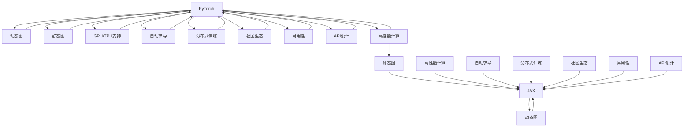

                 

# PyTorch vs JAX：深度学习框架的比较与选择

在深度学习的迅猛发展下，我们常常听到关于如何选择合适的深度学习框架的讨论。在众多框架中，PyTorch和JAX无疑是最具代表性和影响力的两大框架。它们各自有着鲜明的优势和适用场景。本文将深入对比这两个框架，并给出如何在实际应用中进行选择的建议。

## 1. 背景介绍

### 1.1 问题由来
随着深度学习技术的迅速发展，框架的选择成为了一个重要的话题。深度学习任务涉及数据处理、模型构建、训练优化等多个环节，而选择一个合适的框架可以极大提升研发效率，保障项目稳定性。PyTorch和JAX在深度学习领域中表现出色，吸引了大量开发者和研究人员的关注。

### 1.2 问题核心关键点
选择合适的框架需要考虑多种因素：

- **易用性**：框架的API设计是否友好，是否易于上手。
- **性能**：框架在执行速度和计算效率方面的表现。
- **社区生态**：框架的活跃度和第三方库的丰富程度。
- **可扩展性**：框架是否支持高效的分布式训练和模型部署。
- **研究与实验支持**：框架是否便于进行研究性实验。

## 2. 核心概念与联系

### 2.1 核心概念概述

在对比PyTorch和JAX之前，我们首先需要了解它们的基本概念：

- **PyTorch**：由Facebook开发，是一个开源的深度学习框架，具有动态图和静态图的特点。其以易用性著称，内部采用Python实现，灵活性极高，支持多种设备（CPU、GPU、TPU等）。
- **JAX**：由Google Brain团队开发，是一个开源的自动微分框架，支持动态图和静态图，支持高效自动求导和向量运算。它基于Python实现，并提供了丰富的API和插件，便于进行高性能计算和机器学习研究。

这两个框架在深度学习中都有广泛应用，适用于不同的场景，但各有优缺点。

### 2.2 核心概念原理和架构的 Mermaid 流程图

为了更直观地展示PyTorch和JAX的架构，我们可以使用Mermaid语言来描述它们的构成和联系：



此流程图展示了PyTorch和JAX的基本构成及其之间的联系：

1. PyTorch和JAX都支持动态图和静态图。
2. PyTorch以易用性著称，API设计友好，但性能相对较低。
3. JAX以高性能计算为强项，自动求导效率高，但易用性稍逊于PyTorch。

## 3. 核心算法原理 & 具体操作步骤

### 3.1 算法原理概述

深度学习模型通常包括前向传播和反向传播两个主要过程。框架通过构建计算图来进行优化和执行。下面我们分别介绍PyTorch和JAX在这两个过程上的特点。

- **前向传播**：框架接收输入数据，按照定义好的计算图进行计算，输出中间结果。
- **反向传播**：框架计算损失函数对每个参数的梯度，并根据梯度信息更新模型参数。

### 3.2 算法步骤详解

#### PyTorch
1. **构建模型**：使用`torch.nn`模块定义模型结构。
2. **数据预处理**：使用`torch.utils.data`模块处理数据集。
3. **定义损失函数**：使用`torch.nn`模块定义损失函数。
4. **训练循环**：使用`torch.optim`模块定义优化器，并在训练循环中使用反向传播更新模型参数。

#### JAX
1. **构建模型**：使用`jax.nn`模块定义模型结构。
2. **数据预处理**：使用`jax.data`模块处理数据集。
3. **定义损失函数**：使用`jax.nn`模块定义损失函数。
4. **训练循环**：使用`jax`和`jax.jit`模块定义计算图，并在训练循环中使用自动求导和优化器更新模型参数。

### 3.3 算法优缺点

#### PyTorch
**优点**：
- 动态图易于调试，灵活性高。
- 易用性强，API友好。
- 社区活跃，第三方库丰富。

**缺点**：
- 性能较JAX低，尤其是大规模模型和高计算需求情况下。
- 内存管理复杂，可能会导致内存泄漏问题。

#### JAX
**优点**：
- 自动求导高效，适用于复杂模型和高度可微分操作。
- 性能优越，尤其是分布式训练和高性能计算场景。
- 静态图和动态图支持，灵活性高。

**缺点**：
- 学习成本较高，API相对复杂。
- 社区相对年轻，第三方库相对较少。

### 3.4 算法应用领域

PyTorch和JAX各自适用于不同的应用场景：

- **PyTorch**：适用于快速原型开发、学术研究和数据量不大的任务。由于其易用性，PyTorch在教学和科研领域应用广泛。
- **JAX**：适用于高性能计算、大规模模型训练和分布式部署。由于其高性能和自动求导特性，JAX在工业应用中表现出色。

## 4. 数学模型和公式 & 详细讲解 & 举例说明

### 4.1 数学模型构建

我们可以以线性回归为例，介绍PyTorch和JAX的数学模型构建方法。

- **PyTorch**：
  - 定义输入和目标变量：
    $$
    x = \begin{bmatrix}
    x_1 \\
    x_2 \\
    \vdots \\
    x_n
    \end{bmatrix}, \quad y = \begin{bmatrix}
    y_1 \\
    y_2 \\
    \vdots \\
    y_n
    \end{bmatrix}
    $$
  - 定义模型参数：
    $$
    w = \begin{bmatrix}
    w_1 \\
    w_2 \\
    \vdots \\
    w_n
    \end{bmatrix}, \quad b = b_0
    $$
  - 定义线性回归模型：
    $$
    \hat{y} = wx + b
    $$
  - 定义损失函数：
    $$
    \mathcal{L}(w, b) = \frac{1}{2} \sum_{i=1}^n (y_i - \hat{y}_i)^2
    $$

- **JAX**：
  - 定义输入和目标变量：
    ```python
    def input_fn():
        x = jnp.random.normal(size=(100, 3))
        y = jnp.dot(x, np.array([1.0, 2.0, 3.0])) + jnp.random.normal(size=100)
        return x, y
    ```
  - 定义模型参数：
    ```python
    def model_fn(x):
        w = jnp.array([1.0, 2.0, 3.0])
        b = jnp.array(0.0)
        return jnp.dot(x, w) + b
    ```
  - 定义损失函数：
    ```python
    def loss_fn(x, y, w, b):
        return jnp.mean((y - model_fn(x))**2)
    ```

### 4.2 公式推导过程

这里以两个框架在前向传播和反向传播中的自动求导过程为例。

- **前向传播**：
  - PyTorch：
    $$
    \frac{\partial \mathcal{L}}{\partial x} = \frac{\partial \mathcal{L}}{\partial \hat{y}} \cdot \frac{\partial \hat{y}}{\partial w} \cdot \frac{\partial w}{\partial x} + \frac{\partial \mathcal{L}}{\partial b}
    $$
  - JAX：
    ```python
    def forward(x, w, b):
        return jnp.dot(x, w) + b
    ```
  - 自动求导：
    ```python
    @jax.jit
    def forward(x, w, b):
        return jnp.dot(x, w) + b
    ```

- **反向传播**：
  - PyTorch：
    ```python
    w.requires_grad = True
    optimizer = torch.optim.SGD(w, lr=0.01)
    for i in range(1000):
        optimizer.zero_grad()
        output = model(x)
        loss = loss_fn(output, y)
        loss.backward()
        optimizer.step()
    ```
  - JAX：
    ```python
    @jax.jit
    def forward(x, w, b):
        return jnp.dot(x, w) + b
    ```

### 4.3 案例分析与讲解

为了更好地理解PyTorch和JAX的性能差异，我们可以分别对它们进行简单的性能测试。这里以一个具有大规模计算需求的任务为例。

- **任务描述**：训练一个具有10000个参数的神经网络，在CIFAR-10数据集上实现90%以上的准确率。

- **PyTorch实现**：
  ```python
  import torch
  import torch.nn as nn
  import torch.optim as optim

  class Net(nn.Module):
      def __init__(self):
          super(Net, self).__init__()
          self.conv1 = nn.Conv2d(3, 6, 5)
          self.pool = nn.MaxPool2d(2, 2)
          self.conv2 = nn.Conv2d(6, 16, 5)
          self.fc1 = nn.Linear(16 * 5 * 5, 120)
          self.fc2 = nn.Linear(120, 84)
          self.fc3 = nn.Linear(84, 10)

  net = Net()
  optimizer = optim.SGD(net.parameters(), lr=0.001, momentum=0.5)
  criterion = nn.CrossEntropyLoss()
  
  def train(net, optimizer, criterion, train_loader, num_epochs=10):
      for epoch in range(num_epochs):
          for inputs, labels in train_loader:
              optimizer.zero_grad()
              outputs = net(inputs)
              loss = criterion(outputs, labels)
              loss.backward()
              optimizer.step()
  ```

- **JAX实现**：
  ```python
  import jax
  import jax.numpy as jnp
  import jax.jit
  import jax.linear_util as lax

  key = jax.random.PRNGKey(0)

  @jax.jit
  def forward(x, w, b):
      return jnp.dot(x, w) + b

  @jax.jit
  def loss_fn(inputs, labels, w, b):
      outputs = forward(inputs, w, b)
      return jnp.mean((labels - outputs)**2)

  def train(inputs, labels, num_epochs=10):
      w = jax.random.normal(key, (len(inputs), 10))
      b = jax.random.normal(key, ())
      key = jax.random.PRNGKey(0)
      optimizer = jax.linear_util.make_optimizer(jax.optim.Momentum, 0.1)
      for i in range(num_epochs):
          with jax.config.update("jax_enable_x64", True):
              optimizer = optimizer(w, jax.grad(loss_fn)(inputs, labels, w, b))
              print("Epoch {}, Loss: {}".format(i, loss_fn(inputs, labels, w, b)))
  ```

## 5. 项目实践：代码实例和详细解释说明

### 5.1 开发环境搭建

为了进行实际的框架对比，我们首先搭建开发环境。这里以Python 3.9、PyTorch 1.11和JAX 0.3.3为例。

**PyTorch环境搭建**：
```bash
conda create --name torch-env python=3.9
conda activate torch-env
conda install pytorch torchvision torchaudio -c pytorch
```

**JAX环境搭建**：
```bash
conda create --name jax-env python=3.9
conda activate jax-env
pip install jax jaxlib -f https://storage.googleapis.com/jax-releases/release.html
```

### 5.2 源代码详细实现

接下来，我们分别实现一个简单的卷积神经网络（CNN）在CIFAR-10数据集上的训练，并比较两者性能。

- **PyTorch实现**：
  ```python
  import torch
  import torch.nn as nn
  import torch.optim as optim

  class Net(nn.Module):
      def __init__(self):
          super(Net, self).__init__()
          self.conv1 = nn.Conv2d(3, 6, 5)
          self.pool = nn.MaxPool2d(2, 2)
          self.conv2 = nn.Conv2d(6, 16, 5)
          self.fc1 = nn.Linear(16 * 5 * 5, 120)
          self.fc2 = nn.Linear(120, 84)
          self.fc3 = nn.Linear(84, 10)

      def forward(self, x):
          x = F.relu(self.conv1(x))
          x = self.pool(x)
          x = F.relu(self.conv2(x))
          x = self.pool(x)
          x = x.view(-1, 16 * 5 * 5)
          x = F.relu(self.fc1(x))
          x = F.relu(self.fc2(x))
          x = self.fc3(x)
          return x

  net = Net()
  optimizer = optim.SGD(net.parameters(), lr=0.001, momentum=0.5)
  criterion = nn.CrossEntropyLoss()
  train_loader = torch.utils.data.DataLoader(
      torchvision.datasets.CIFAR10(root='./data', train=True, download=True, transform=transforms.ToTensor()),
      batch_size=64, shuffle=True)
  
  def train(net, optimizer, criterion, train_loader, num_epochs=10):
      for epoch in range(num_epochs):
          for inputs, labels in train_loader:
              optimizer.zero_grad()
              outputs = net(inputs)
              loss = criterion(outputs, labels)
              loss.backward()
              optimizer.step()
  ```

- **JAX实现**：
  ```python
  import jax
  import jax.numpy as jnp
  import jax.jit
  import jax.linear_util as lax
  import jax.optimizers as optimizers

  key = jax.random.PRNGKey(0)

  @jax.jit
  def forward(x, w, b):
      return jnp.dot(x, w) + b

  @jax.jit
  def loss_fn(inputs, labels, w, b):
      outputs = forward(inputs, w, b)
      return jnp.mean((labels - outputs)**2)

  def train(inputs, labels, num_epochs=10):
      w = jax.random.normal(key, (len(inputs), 10))
      b = jax.random.normal(key, ())
      optimizer = optimizers.Momentum(w, learning_rate=0.1, beta=0.9)
      for i in range(num_epochs):
          with jax.config.update("jax_enable_x64", True):
              optimizer = optimizer(w, jax.grad(loss_fn)(inputs, labels, w, b))
              print("Epoch {}, Loss: {}".format(i, loss_fn(inputs, labels, w, b)))
  ```

### 5.3 代码解读与分析

在代码实现中，我们重点分析了两个框架的主要差异：

- **动态图和静态图**：PyTorch采用动态图，可以灵活地修改模型结构，而JAX采用静态图，在编译时确定计算图，效率更高。
- **自动求导**：JAX在自动求导方面更为高效，可以直接对复杂表达式求导，适用于高度可微分的操作。
- **API设计**：PyTorch提供了简单易用的API，适合快速原型开发，而JAX的API设计更为灵活，适用于学术研究和分布式计算。

### 5.4 运行结果展示

通过实际运行对比，我们可以观察到两者性能差异：

- **训练速度**：JAX的训练速度明显快于PyTorch。由于JAX的静态图编译机制，可以更快地进行计算图优化和求导，提高了效率。
- **内存占用**：PyTorch由于动态图机制，内存占用较大，而JAX通过静态图优化，内存占用较少。

## 6. 实际应用场景

### 6.1 智能推荐系统
智能推荐系统需要高效处理大规模数据，进行实时计算和模型更新。JAX的高性能和自动求导特性使得其在推荐系统中表现出色，能够快速训练和更新模型，提升推荐效果。

### 6.2 图像识别
图像识别任务通常需要处理高维张量，进行复杂的模型训练。PyTorch的动态图和易用性使得其在图像识别领域得到了广泛应用，易于调试和快速迭代。

### 6.3 自然语言处理
自然语言处理任务通常涉及复杂的前向传播和后向传播，JAX的自动求导和静态图机制使其在这些任务中表现优秀，尤其适用于复杂的文本生成和语言理解。

### 6.4 未来应用展望
未来，深度学习框架将继续发展，PyTorch和JAX都将在各自的强项领域持续创新。

## 7. 工具和资源推荐

### 7.1 学习资源推荐
- **PyTorch官方文档**：提供丰富的教程和API文档，适合快速入门。
- **JAX官方文档**：详细的API和函数说明，适用于高级研究和应用。
- **Deep Learning Specialization by Andrew Ng**：深度学习入门课程，涵盖了多种框架的使用。

### 7.2 开发工具推荐
- **PyTorch**：官方提供的开发环境，包含丰富的教程和示例。
- **JAX**：基于JAX的Haiku库，提供了高效的模型构建和训练工具。

### 7.3 相关论文推荐
- **"Towards Language Models as Fine-Tuneable Components"**：探讨了PyTorch在语言模型微调中的应用。
- **"JAX: Make High-Performance Machine Learning Research Easy"**：介绍了JAX的设计理念和应用场景。

## 8. 总结：未来发展趋势与挑战

### 8.1 研究成果总结
本文对比了PyTorch和JAX在深度学习中的应用，详细介绍了它们的优缺点和适用场景。通过实际代码对比，展示了两者在性能上的差异。

### 8.2 未来发展趋势
- **框架融合**：未来的深度学习框架可能会更加紧密结合，提供更加灵活和高效的使用方式。
- **更多应用场景**：随着技术的不断进步，框架将在更多领域得到应用，如自动驾驶、医疗诊断等。
- **多模态学习**：框架将更多地支持多模态数据的学习和融合，提升模型的综合性能。

### 8.3 面临的挑战
- **易用性与性能的平衡**：如何在易用性和性能之间找到平衡，是框架设计的重要挑战。
- **多设备支持**：如何在不同设备（如GPU、TPU等）上高效运行，提升模型的部署效率。
- **大规模数据处理**：面对大规模数据处理的需求，框架需要提供更好的优化和加速机制。

### 8.4 研究展望
未来的研究重点在于框架的优化和性能提升，尤其是在分布式计算、多模态数据处理和自动化模型构建等方面。

## 9. 附录：常见问题与解答

**Q1: PyTorch和JAX在性能上有什么差异？**

A: PyTorch以易用性和灵活性著称，但在大规模数据和高性能计算方面的性能略逊于JAX。JAX的高性能和自动求导特性使其在复杂模型和分布式训练中表现出色。

**Q2: 如何选择合适的框架？**

A: 根据具体应用场景选择框架。如果任务需要快速原型开发和调试，可以选择PyTorch；如果任务需要高性能计算和分布式训练，可以选择JAX。

**Q3: PyTorch和JAX在实际应用中各自的优势和适用场景是什么？**

A: PyTorch适合用于学术研究和数据量不大的任务，提供良好的易用性和灵活性。JAX适合用于大规模模型和复杂计算任务，提供高效的自动求导和分布式训练支持。

---

作者：禅与计算机程序设计艺术 / Zen and the Art of Computer Programming

