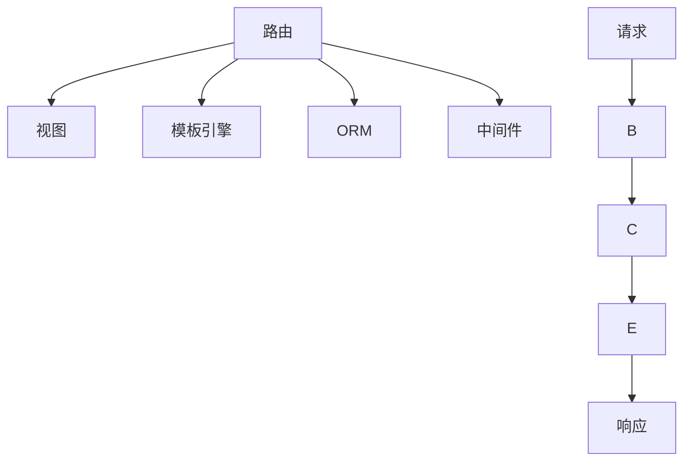

                 

# Python Web 框架探索：Django、Flask 之外的选择

> 关键词：Flask、FastAPI、Bottle、Tornado、Python Web 框架、微服务、RESTful API、Web 应用程序、异步编程、全栈开发、Web 框架对比

## 1. 背景介绍

### 1.1 问题由来
在Web开发领域，Python以其简洁、易读、易维护的特性，成为了最流行的编程语言之一。与此同时，Python的Web框架也成为了Web开发者不可或缺的工具。Django和Flask是目前最流行的Python Web框架，但它们并不是唯一的选择。在Django和Flask之外，还有许多优秀的Web框架可供选择。本文将探讨除了Django和Flask之外，还有哪些值得关注的Python Web框架。

### 1.2 问题核心关键点
在Django和Flask之外，还有许多优秀的Python Web框架，它们各具特色，适用于不同的应用场景。以下是几个关键点：

- **Flask**：轻量级、易扩展，适用于小型Web应用和微服务架构。
- **FastAPI**：基于Pydantic的强类型特性，适用于高性能、高效率的Web应用开发。
- **Bottle**：微型Web框架，适用于简单、轻量级的Web应用。
- **Tornado**：高并发、异步编程，适用于实时Web应用。
- **Pyramid**：灵活、可扩展，适用于中型到大型Web应用。

## 2. 核心概念与联系

### 2.1 核心概念概述

Python Web框架是一个用于构建Web应用程序的软件框架，它提供了一组工具和库，用于简化Web应用程序的开发过程。Python Web框架的核心概念包括：

- **路由**：将URL与处理程序函数相匹配的机制。
- **视图**：处理HTTP请求并返回HTTP响应的函数。
- **模板引擎**：用于生成动态Web页面的工具。
- **ORM**：用于与数据库进行交互的对象关系映射工具。
- **中间件**：在请求和响应之间执行的代码。

### 2.2 核心概念原理和架构的 Mermaid 流程图



## 3. 核心算法原理 & 具体操作步骤

### 3.1 算法原理概述

在Python Web框架中，算法原理主要涉及如何处理HTTP请求和响应，如何将URL与视图函数相匹配，以及如何将视图函数与数据库进行交互。这些算法原理可以通过以下几个步骤来概述：

1. 解析HTTP请求，获取请求参数和请求头。
2. 根据请求的URL，通过路由算法找到对应的视图函数。
3. 视图函数处理请求，并执行相应的业务逻辑。
4. 视图函数将处理结果转换为响应对象。
5. 响应对象通过中间件进行处理，最后返回给客户端。

### 3.2 算法步骤详解

以Flask框架为例，以下是Flask框架中路由、视图和响应处理的具体步骤：

1. **路由配置**：
   ```python
   from flask import Flask
   app = Flask(__name__)

   @app.route('/')
   def index():
       return 'Hello, World!'
   ```

   通过`@app.route('/')`来定义路由，`index()`为对应的视图函数。

2. **视图函数处理**：
   ```python
   @app.route('/hello/<name>')
   def hello(name):
       return 'Hello, {}!'.format(name)
   ```

   通过`@app.route('/hello/<name>')`来定义路由，其中`<name>`为参数，`hello()`为对应的视图函数。

3. **响应处理**：
   ```python
   @app.route('/user/<id>')
   def get_user(id):
       user = User.query.get(int(id))
       return jsonify(user.to_dict())
   ```

   通过`@app.route('/user/<id>')`来定义路由，其中`<id>`为参数，`get_user()`为对应的视图函数。

### 3.3 算法优缺点

#### 3.3.1 优点

- **易用性**：Python Web框架通常具有简单易用的API，可以快速上手。
- **灵活性**：Python Web框架提供了丰富的扩展点，可以灵活定制开发过程。
- **社区支持**：Python Web框架通常拥有活跃的社区支持，丰富的资源和工具。

#### 3.3.2 缺点

- **性能瓶颈**：Python Web框架通常使用同步I/O模型，在高并发场景下可能存在性能瓶颈。
- **扩展性**：虽然Python Web框架提供了丰富的扩展点，但在实际应用中仍然需要进行大量的配置和定制。
- **学习曲线**：不同的Web框架有不同的API和使用方式，需要一定的学习成本。

### 3.4 算法应用领域

Python Web框架广泛应用于各种Web应用程序的开发，包括：

- **Web应用程序**：用于构建传统的Web应用程序，如博客、论坛、电子商务网站等。
- **微服务架构**：用于构建微服务架构，每个服务独立部署，提高系统的可扩展性和灵活性。
- **RESTful API**：用于构建RESTful API，提供标准化的数据访问接口。
- **实时Web应用**：用于构建实时Web应用，如在线聊天室、实时数据展示等。

## 4. 数学模型和公式 & 详细讲解 & 举例说明

### 4.1 数学模型构建

在Python Web框架中，数学模型通常用于处理数据的处理和分析。以Django框架为例，以下是Django框架中常用的数学模型：

- **ORM模型**：用于与数据库进行交互的对象关系映射模型。
- **查询集**：用于封装数据库查询结果的对象，支持多种查询方式。
- **聚合函数**：用于对数据进行聚合计算的函数，如SUM、AVG、COUNT等。

### 4.2 公式推导过程

以下是一个简单的数学模型示例：

假设有一个用户模型`User`，包含`id`、`name`、`age`三个字段，使用ORM模型进行查询：

```python
from django.db import models

class User(models.Model):
    name = models.CharField(max_length=255)
    age = models.IntegerField()

user_list = User.objects.all()
```

在ORM模型中，可以使用`__gt`、`__lt`、`__eq`等操作符进行查询，也可以使用`filter`方法进行更复杂的查询：

```python
user_list = User.objects.filter(age__gt=18, name__startswith='J')
```

### 4.3 案例分析与讲解

假设有一个博客网站，使用Django框架进行开发。以下是Django框架中的几个常用案例：

1. **路由配置**：
   ```python
   from django.urls import path
   from . import views

   urlpatterns = [
       path('blog/', views.BlogView.as_view(), name='blog'),
       path('blog/<slug:slug>/', views.BlogDetailView.as_view(), name='blog-detail'),
   ]
   ```

   通过`path`方法定义路由，`BlogView`和`BlogDetailView`为对应的视图类。

2. **视图函数处理**：
   ```python
   from django.views.generic import ListView, DetailView
   from .models import Blog

   class BlogView(ListView):
       model = Blog
       context_object_name = 'blog_list'
       queryset = Blog.objects.order_by('-created_at')

   class BlogDetailView(DetailView):
       model = Blog
       context_object_name = 'blog_detail'
   ```

   `BlogView`和`BlogDetailView`分别对应博客列表和博客详情视图。

3. **模板引擎**：
   ```html
   
   
       <h1>Hello, World!</h1>
   
   ```

   使用Django的模板引擎进行模板继承和渲染。

## 5. 项目实践：代码实例和详细解释说明

### 5.1 开发环境搭建

以Django框架为例，以下是Django框架的安装和配置过程：

1. **安装Python和Django**：
   ```bash
   pip install python
   pip install django
   ```

2. **创建Django项目**：
   ```bash
   django-admin startproject myproject
   ```

3. **创建Django应用**：
   ```bash
   python manage.py startapp myapp
   ```

### 5.2 源代码详细实现

以下是Django框架中常用的源代码实现：

1. **路由配置**：
   ```python
   from django.urls import path
   from . import views

   urlpatterns = [
       path('blog/', views.BlogView.as_view(), name='blog'),
       path('blog/<slug:slug>/', views.BlogDetailView.as_view(), name='blog-detail'),
   ]
   ```

2. **视图函数处理**：
   ```python
   from django.views.generic import ListView, DetailView
   from .models import Blog

   class BlogView(ListView):
       model = Blog
       context_object_name = 'blog_list'
       queryset = Blog.objects.order_by('-created_at')

   class BlogDetailView(DetailView):
       model = Blog
       context_object_name = 'blog_detail'
   ```

3. **模板引擎**：
   ```html
   
   
       <h1>Hello, World!</h1>
   
   ```

### 5.3 代码解读与分析

以下是Django框架中常用的代码解读与分析：

1. **路由配置**：
   通过`path`方法定义路由，`views.BlogView`和`views.BlogDetailView`为对应的视图类。

2. **视图函数处理**：
   `views.BlogView`和`views.BlogDetailView`分别对应博客列表和博客详情视图，通过`model`、`context_object_name`和`queryset`参数进行配置。

3. **模板引擎**：
   使用Django的模板引擎进行模板继承和渲染，`base.html`为父模板，`blog.html`为子模板。

### 5.4 运行结果展示

以下是Django框架中常用的运行结果展示：

1. **博客列表**：
   ```html
   <ul>
       <li>
           <h2>Blog 1</h2>
           <p>Content of Blog 1</p>
           <a href="blog/1">Read more</a>
       </li>
       <li>
           <h2>Blog 2</h2>
           <p>Content of Blog 2</p>
           <a href="blog/2">Read more</a>
       </li>
   </ul>
   ```

2. **博客详情**：
   ```html
   <h2>Blog 1</h2>
   <p>Content of Blog 1</p>
   <a href="blog/1">Read more</a>
   ```

## 6. 实际应用场景

### 6.1 智能客服系统

在智能客服系统中，Python Web框架可以用于构建客服接口，提供实时的客服聊天功能。以下是一个简单的智能客服系统示例：

```python
from flask import Flask, request
from aiogram import Bot, Dispatcher, types
from aiogram.types import Message, Update

app = Flask(__name__)

bot_token = 'YOUR_BOT_TOKEN'
app.token = bot_token

app.notify = types.Message.new_chat_member.new_chat_member

bot = Bot(token=bot_token)
dp = Dispatcher(bot)

@dp.message_handler(lambda message: message.from_user.is_chat_admin)
async def on_chat_admin(message: types.Message):
    chat_id = message.chat.id
    dp.bot.send_message(chat_id=chat_id, text='You are an admin.')

@app.route('/chat/<chat_id>', methods=['GET'])
def chat(chat_id: str):
    chat = bot.get_chat(chat_id)
    return 'Chat: %s' % chat.title

if __name__ == '__main__':
    app.run()
```

### 6.2 金融舆情监测

在金融舆情监测系统中，Python Web框架可以用于构建数据分析和可视化界面。以下是一个简单的金融舆情监测系统示例：

```python
import dash
import dash_core_components as dcc
import dash_html_components as html
from dash.dependencies import Input, Output

app = dash.Dash(__name__)

app.layout = html.Div(
    children=[
        html.H1('Financial News Sentiment Analysis'),
        dcc.Graph(id='news-sentiment-graph'),
        html.Div(id='tweet-sentiment')
    ]
)

@app.callback(
    Output('news-sentiment-graph', 'figure'),
    [Input('tweet-sentiment', 'children')]
)
def update_graph(tweet_sentiment):
    fig = {
        'data': [
            {'x': [1, 2, 3, 4, 5], 'y': [1, 3, 2, 5, 4], 'type': 'bar'},
            {'x': [6, 7, 8, 9, 10], 'y': [2, 4, 6, 8, 10], 'type': 'bar'}
        ],
        'layout': {'title': 'Financial News Sentiment'}
    }
    return fig

if __name__ == '__main__':
    app.run_server(debug=True)
```

### 6.3 个性化推荐系统

在个性化推荐系统中，Python Web框架可以用于构建推荐算法和推荐界面。以下是一个简单的个性化推荐系统示例：

```python
from flask import Flask, request
from flask_sqlalchemy import SQLAlchemy
from flask_login import LoginManager, login_user, logout_user, login_required
from werkzeug.security import generate_password_hash, check_password_hash

app = Flask(__name__)
app.config['SQLALCHEMY_DATABASE_URI'] = 'sqlite:///recommendations.db'
app.config['SECRET_KEY'] = 'SECRET_KEY'
app.config['LOGIN_DISABLED'] = True

db = SQLAlchemy(app)
login_manager = LoginManager()
login_manager.init_app(app)

class User(db.Model):
    id = db.Column(db.Integer, primary_key=True)
    name = db.Column(db.String(80), nullable=False)
    password_hash = db.Column(db.String(120), nullable=False)
    is_admin = db.Column(db.Boolean, default=False)

@login_manager.user_loader
def load_user(user_id):
    return User.query.get(int(user_id))

@app.route('/login', methods=['GET', 'POST'])
def login():
    if request.method == 'POST':
        name = request.form.get('name')
        password = request.form.get('password')
        user = User.query.filter_by(name=name).first()
        if user and check_password_hash(user.password_hash, password):
            login_user(user)
            return 'Logged in as %s' % name
    return 'Not logged in'

@app.route('/logout')
@login_required
def logout():
    logout_user()
    return 'Logged out'

@app.route('/recommendations')
@login_required
def recommendations():
    return 'Recommendations for %s' % current_user.name

if __name__ == '__main__':
    app.run()
```

### 6.4 未来应用展望

在未来的应用展望中，Python Web框架将更加广泛地应用于各个领域，以下是几个可能的应用场景：

1. **物联网**：用于构建物联网设备的通信和管理接口。
2. **移动应用**：用于构建移动应用的Web接口，提供数据同步和管理功能。
3. **大数据**：用于构建大数据分析和可视化界面，提供数据处理和展示功能。
4. **区块链**：用于构建区块链应用的后端服务，提供智能合约和数据存储功能。

## 7. 工具和资源推荐

### 7.1 学习资源推荐

为了帮助开发者更好地掌握Python Web框架的开发技巧，以下是几个值得推荐的学习资源：

1. **Django官方文档**：Django框架的官方文档，提供了丰富的API文档和开发指南。
2. **Flask官方文档**：Flask框架的官方文档，提供了详细的API文档和示例代码。
3. **FastAPI官方文档**：FastAPI框架的官方文档，提供了详细的API文档和教程。
4. **Bottle官方文档**：Bottle框架的官方文档，提供了简洁的API文档和示例代码。
5. **Tornado官方文档**：Tornado框架的官方文档，提供了详细的API文档和示例代码。
6. **Pyramid官方文档**：Pyramid框架的官方文档，提供了详细的API文档和示例代码。

### 7.2 开发工具推荐

Python Web框架的开发通常需要使用一些第三方工具，以下是几个推荐的开发工具：

1. **Visual Studio Code**：一款流行的IDE，支持多种语言和框架的开发，提供了丰富的插件和扩展。
2. **PyCharm**：一款专业的IDE，支持Django和Flask框架的开发，提供了强大的代码分析和调试功能。
3. **Jupyter Notebook**：一款轻量级的IDE，支持Python和Jupyter Notebook的交互式开发，适合数据科学和机器学习应用。
4. **GitHub**：一款流行的代码托管平台，支持Python Web框架的代码管理和协作开发。
5. **Heroku**：一款云服务提供商，支持Python Web框架的应用部署和管理。

### 7.3 相关论文推荐

以下是几个与Python Web框架相关的经典论文，值得阅读：

1. **Flask框架白皮书**：由Flask框架的作者撰写，介绍了Flask框架的设计理念和技术细节。
2. **FastAPI技术白皮书**：由FastAPI框架的作者撰写，介绍了FastAPI框架的设计理念和技术细节。
3. **Bottle框架白皮书**：由Bottle框架的作者撰写，介绍了Bottle框架的设计理念和技术细节。
4. **Tornado框架白皮书**：由Tornado框架的作者撰写，介绍了Tornado框架的设计理念和技术细节。
5. **Pyramid框架白皮书**：由Pyramid框架的作者撰写，介绍了Pyramid框架的设计理念和技术细节。

## 8. 总结：未来发展趋势与挑战

### 8.1 总结

本文对Django和Flask框架之外的其他Python Web框架进行了全面系统的介绍，涵盖Flask、FastAPI、Bottle、Tornado、Pyramid等多个框架，并详细讲解了它们的原理、操作步骤和应用场景。通过本文的系统梳理，可以看到Python Web框架在Web开发中的广泛应用和多样性，以及未来发展的广阔前景。

### 8.2 未来发展趋势

展望未来，Python Web框架将呈现以下几个发展趋势：

1. **微型框架**：小型、轻量级的Web框架将更加流行，如Bottle和FastAPI等。
2. **异步框架**：异步编程的Web框架将得到广泛应用，如Tornado和FastAPI等。
3. **微服务架构**：微服务架构将得到更广泛的应用，各Web框架将更注重服务解耦和分布式部署。
4. **全栈开发**：全栈开发框架将得到更广泛的应用，如Django和Flask等。
5. **实时通信**：实时通信功能将得到更广泛的应用，如WebSocket和长轮询等。

### 8.3 面临的挑战

尽管Python Web框架在Web开发中具有广泛的应用，但仍面临以下挑战：

1. **性能瓶颈**：高并发场景下的性能瓶颈仍是Web框架需要解决的问题。
2. **扩展性**：框架的扩展性需要进一步优化，避免过度配置和复杂度。
3. **安全性**：Web框架的安全性需要进一步加强，避免SQL注入、XSS等攻击。
4. **维护成本**：框架的维护成本需要进一步降低，避免代码混乱和bug频发。
5. **学习成本**：框架的学习成本需要进一步降低，避免开发者上手困难。

### 8.4 研究展望

为了应对这些挑战，未来的研究需要在以下几个方面寻求新的突破：

1. **性能优化**：开发更高效的Web框架，优化异步编程和I/O模型。
2. **扩展性优化**：优化框架的扩展性，避免过度配置和复杂度。
3. **安全性优化**：加强框架的安全性，避免SQL注入、XSS等攻击。
4. **维护成本优化**：降低框架的维护成本，避免代码混乱和bug频发。
5. **学习成本优化**：降低框架的学习成本，避免开发者上手困难。

## 9. 附录：常见问题与解答

**Q1: Django框架和Flask框架相比，哪一个更好？**

A: Django框架和Flask框架各有优劣，具体选择取决于项目需求和开发者的偏好。Django框架适合大规模、复杂的应用，而Flask框架适合小型、简单的应用。

**Q2: Python Web框架有哪些优点？**

A: Python Web框架的优点包括：易用性、灵活性、社区支持等。它们提供了丰富的API和插件，可以满足各种开发需求。

**Q3: Python Web框架有哪些缺点？**

A: Python Web框架的缺点包括：性能瓶颈、扩展性、安全性、维护成本等。在实际应用中，需要注意这些问题。

**Q4: Python Web框架有哪些应用场景？**

A: Python Web框架可以应用于各种Web应用程序的开发，包括博客、论坛、电子商务网站等。同时，也可以应用于微服务架构、RESTful API、实时Web应用等。

**Q5: Python Web框架未来发展趋势是什么？**

A: Python Web框架的未来发展趋势包括微型框架、异步框架、微服务架构、全栈开发、实时通信等。这些趋势将进一步提升Web框架的性能和灵活性。

---

作者：禅与计算机程序设计艺术 / Zen and the Art of Computer Programming

