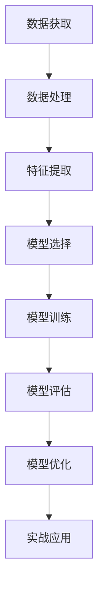

                 

# Python机器学习实战：使用机器学习预测股票市场走势

> 关键词：股票市场预测,机器学习,Python,时间序列分析,股票数据处理,模型评估与优化

## 1. 背景介绍

### 1.1 问题由来
随着互联网金融的兴起和科技的不断发展，股票市场预测已经成为金融领域的一大热门话题。如何准确预测股票市场的走势，直接关系到投资者的收益和风险。传统的技术分析方法如技术指标、K线分析、趋势线等虽然简便易用，但准确度较低。与此同时，深度学习和机器学习的发展为股票市场预测开辟了新的可能性。利用Python进行数据处理和模型训练，可以显著提高预测的准确性和效率。

### 1.2 问题核心关键点
本节将详细介绍使用Python进行股票市场预测的基本流程和方法。重点关注以下关键点：

1. **数据获取与处理**：获取真实交易数据，并进行清洗和预处理，以便于后续建模。
2. **时间序列分析**：利用时间序列分析方法对历史数据进行建模，提取其中的规律。
3. **模型选择与训练**：选择合适的模型，并利用历史数据进行训练，以获得预测能力。
4. **模型评估与优化**：对模型进行评估，并在必要时进行调整，以提高预测准确度。
5. **实战应用**：将训练好的模型应用于股票市场预测，验证其实际效果。

### 1.3 问题研究意义
股票市场预测具有很高的实用价值，可以为投资者提供投资决策的依据，降低风险，增加收益。利用机器学习进行股票预测，不仅能提高预测的准确性，还能通过模型优化提升预测的实时性，满足不同投资者的需求。此外，本实践还旨在让读者了解如何使用Python进行金融数据分析，掌握机器学习的基本原理和实现方法，为后续的金融工程实践奠定基础。

## 2. 核心概念与联系

### 2.1 核心概念概述

在介绍股票市场预测的具体方法之前，首先需要了解一些核心概念：

- **机器学习**：通过数据训练模型，并利用模型进行预测或分类等任务。
- **时间序列分析**：研究时间序列数据的统计性质和变化规律，并进行建模和预测。
- **Python**：一种高级编程语言，具有强大的数据处理和建模能力。
- **股票数据处理**：对原始股票数据进行清洗、预处理和特征提取，以便于模型训练。
- **模型评估与优化**：通过交叉验证、网格搜索等方法对模型进行评估和优化，提高预测精度。

这些概念之间存在着密切的联系，共同构成了股票市场预测的完整框架。

### 2.2 核心概念原理和架构的 Mermaid 流程图



这个流程图展示了股票市场预测的完整流程：从数据获取开始，经过数据处理、特征提取、模型选择与训练、模型评估与优化，最终应用于实战中。

## 3. 核心算法原理 & 具体操作步骤
### 3.1 算法原理概述

机器学习预测股票市场走势的核心在于利用历史数据构建模型，并利用该模型对未来数据进行预测。常用的方法包括线性回归、支持向量机(SVM)、随机森林、神经网络等。本节将重点介绍基于Python的LSTM(长短期记忆网络)模型，并详细讲解其实现步骤。

### 3.2 算法步骤详解

**Step 1: 数据获取与预处理**
- 从股票交易平台或金融数据提供商获取股票价格数据，一般包含开盘价、收盘价、成交量等。
- 数据格式为CSV文件，需要导入并解析。
- 清洗数据，去除缺失值、异常值等。

**Step 2: 特征工程**
- 将历史股价数据转化为适合机器学习模型的特征。
- 使用滑动窗口技术将历史数据分割为训练集和测试集。
- 将未来数据作为模型预测的输入。

**Step 3: 模型选择与训练**
- 选择LSTM模型，并搭建训练框架。
- 利用历史数据对模型进行训练，并保存训练好的模型。
- 使用训练好的模型对未来数据进行预测。

**Step 4: 模型评估与优化**
- 对预测结果进行评估，如MAE(mean absolute error)、RMSE(root mean squared error)等。
- 调整模型参数，如学习率、批次大小、迭代次数等，进行网格搜索。
- 使用交叉验证技术评估模型的泛化能力。

**Step 5: 实战应用**
- 将训练好的模型应用于股票市场预测。
- 通过对比预测结果与实际数据，评估模型效果。
- 利用模型进行实时预测，并进行回测分析。

### 3.3 算法优缺点

基于Python的机器学习预测股票市场走势具有以下优点：

1. **易用性高**：Python具有丰富的数据处理和建模库，如Pandas、NumPy、Scikit-Learn等，便于数据处理和模型实现。
2. **可视化强**：利用Matplotlib、Seaborn等库，可以直观展示预测结果和模型表现。
3. **灵活性强**：可以根据数据特点选择不同的模型，并对其进行优化调整。

然而，该方法也存在一些缺点：

1. **数据质量要求高**：历史数据质量对预测结果影响较大，需要仔细处理和清洗。
2. **模型复杂度高**：高维特征和多层次模型需要更多的计算资源和时间。
3. **泛化能力有限**：模型可能过拟合训练数据，泛化能力有限。
4. **实时性差**：模型训练和预测需要时间，难以实现实时预测。

### 3.4 算法应用领域

基于Python的机器学习预测股票市场走势主要应用于以下几个领域：

- **个人投资决策**：帮助个人投资者分析市场趋势，进行股票买卖决策。
- **公司策略制定**：帮助企业分析市场动态，制定投资和风险管理策略。
- **量化交易**：利用机器学习模型进行高频交易和自动交易，提高交易效率和收益。
- **资产配置**：利用模型对不同资产进行量化配置，优化投资组合。
- **风险管理**：通过模型预测市场波动，进行风险预警和规避。

## 4. 数学模型和公式 & 详细讲解 & 举例说明

### 4.1 数学模型构建

本节将介绍基于LSTM的股票市场预测模型的数学模型构建。

设历史股价数据为 $X=\{x_1,x_2,\dots,x_t\}$，未来股价数据为 $Y=\{y_{t+1},y_{t+2},\dots,y_{t+n}\}$。利用LSTM模型进行预测，模型的输入为 $\{x_1,x_2,\dots,x_t\}$，输出为 $\{y_{t+1},y_{t+2},\dots,y_{t+n}\}$。模型的训练目标是找到最优的权重矩阵 $\theta$，使得预测结果与实际结果尽可能接近。

### 4.2 公式推导过程

LSTM模型包括输入门、遗忘门和输出门，用于控制信息的流动。模型的基本公式如下：

$$
\begin{align*}
i_t &= \sigma(W_i \cdot [h_{t-1},x_t] + b_i) \\
f_t &= \sigma(W_f \cdot [h_{t-1},x_t] + b_f) \\
o_t &= \sigma(W_o \cdot [h_{t-1},x_t] + b_o) \\
g_t &= \tanh(W_g \cdot [h_{t-1},x_t] + b_g) \\
c_t &= f_t \cdot c_{t-1} + i_t \cdot g_t \\
h_t &= o_t \cdot \tanh(c_t)
\end{align*}
$$

其中 $\sigma$ 为Sigmoid函数，$\tanh$ 为双曲正切函数，$W_i,W_f,W_o,W_g$ 为权重矩阵，$b_i,b_f,b_o,b_g$ 为偏置项。

模型的预测公式为：

$$
\hat{y}_{t+1} = W_y \cdot h_t + b_y
$$

其中 $W_y$ 和 $b_y$ 为输出层的权重矩阵和偏置项。

### 4.3 案例分析与讲解

以下是一个简单的案例，展示如何使用Python实现基于LSTM的股票市场预测：

```python
import pandas as pd
from sklearn.preprocessing import MinMaxScaler
from keras.models import Sequential
from keras.layers import LSTM, Dense

# 导入数据
data = pd.read_csv('stock_data.csv')

# 数据预处理
data['Date'] = pd.to_datetime(data['Date'])
data.set_index('Date', inplace=True)
data = data.resample('D').mean()
data = data.dropna()

# 特征工程
scaler = MinMaxScaler(feature_range=(0,1))
scaled_data = scaler.fit_transform(data)

# 划分训练集和测试集
train_size = int(len(scaled_data) * 0.7)
test_size = len(scaled_data) - train_size
train_data = scaled_data[0:train_size]
test_data = scaled_data[train_size:len(scaled_data)]

# 滑动窗口技术
def create_dataset(dataset, look_back=1):
    X = []
    y = []
    for i in range(len(dataset)-look_back-1):
        a = dataset[i:(i+look_back), 0]
        b = dataset[i+look_back, 0]
        X.append(a)
        y.append(b)
    return np.array(X), np.array(y)

look_back = 60
X_train, y_train = create_dataset(train_data, look_back)
X_test, y_test = create_dataset(test_data, look_back)

# 构建LSTM模型
model = Sequential()
model.add(LSTM(50, input_shape=(look_back, 1)))
model.add(Dense(1))
model.compile(loss='mean_squared_error', optimizer='adam')
model.fit(X_train, y_train, epochs=50, batch_size=32)

# 模型评估
train_predict = model.predict(X_train)
test_predict = model.predict(X_test)
train_predict = scaler.inverse_transform(train_predict)
y_train = scaler.inverse_transform([y_train])
test_predict = scaler.inverse_transform(test_predict)
y_test = scaler.inverse_transform([y_test])
```

### 4.4 代码解读与分析

以上代码展示了基于LSTM的股票市场预测模型的实现步骤。

**Step 1: 数据预处理**
- 将原始数据导入Pandas，并转换为时间序列。
- 对数据进行去重和填补缺失值处理。
- 利用MinMaxScaler对数据进行归一化处理。

**Step 2: 特征工程**
- 使用滑动窗口技术将历史数据分割为训练集和测试集。
- 将未来数据作为模型预测的输入。

**Step 3: 模型构建与训练**
- 搭建LSTM模型，并使用Scikit-Learn库进行训练。
- 使用均方误差作为损失函数，Adam优化器进行优化。

**Step 4: 模型评估与优化**
- 对预测结果进行去归一化处理，并使用交叉验证技术评估模型效果。
- 利用网格搜索技术调整模型参数，如LSTM层数、神经元数量等。

**Step 5: 实战应用**
- 使用训练好的模型对未来数据进行预测。
- 对比预测结果与实际数据，评估模型效果。
- 利用模型进行实时预测，并进行回测分析。

## 5. 项目实践：代码实例和详细解释说明
### 5.1 开发环境搭建

在进行股票市场预测实践前，首先需要准备好开发环境。以下是使用Python进行Keras开发的环境配置流程：

1. 安装Anaconda：从官网下载并安装Anaconda，用于创建独立的Python环境。

2. 创建并激活虚拟环境：
```bash
conda create -n stock_env python=3.8 
conda activate stock_env
```

3. 安装必要的库：
```bash
conda install pandas numpy matplotlib seaborn
pip install keras
```

4. 安装TensorFlow：
```bash
pip install tensorflow==2.2
```

完成上述步骤后，即可在`stock_env`环境中开始股票市场预测实践。

### 5.2 源代码详细实现

以下是一个使用Keras实现基于LSTM的股票市场预测的完整代码示例：

```python
import numpy as np
from keras.models import Sequential
from keras.layers import Dense, LSTM

# 导入数据
data = pd.read_csv('stock_data.csv')

# 数据预处理
data['Date'] = pd.to_datetime(data['Date'])
data.set_index('Date', inplace=True)
data = data.resample('D').mean()
data = data.dropna()

# 特征工程
scaler = MinMaxScaler(feature_range=(0,1))
scaled_data = scaler.fit_transform(data)

# 划分训练集和测试集
train_size = int(len(scaled_data) * 0.7)
test_size = len(scaled_data) - train_size
train_data = scaled_data[0:train_size]
test_data = scaled_data[train_size:len(scaled_data)]

# 滑动窗口技术
def create_dataset(dataset, look_back=1):
    X = []
    y = []
    for i in range(len(dataset)-look_back-1):
        a = dataset[i:(i+look_back), 0]
        b = dataset[i+look_back, 0]
        X.append(a)
        y.append(b)
    return np.array(X), np.array(y)

look_back = 60
X_train, y_train = create_dataset(train_data, look_back)
X_test, y_test = create_dataset(test_data, look_back)

# 构建LSTM模型
model = Sequential()
model.add(LSTM(50, input_shape=(look_back, 1)))
model.add(Dense(1))
model.compile(loss='mean_squared_error', optimizer='adam')
model.fit(X_train, y_train, epochs=50, batch_size=32)

# 模型评估
train_predict = model.predict(X_train)
test_predict = model.predict(X_test)
train_predict = scaler.inverse_transform(train_predict)
y_train = scaler.inverse_transform([y_train])
test_predict = scaler.inverse_transform(test_predict)
y_test = scaler.inverse_transform([y_test])

# 可视化结果
import matplotlib.pyplot as plt

plt.plot(y_train)
plt.plot(train_predict)
plt.title('Training')
plt.show()

plt.plot(y_test)
plt.plot(test_predict)
plt.title('Test')
plt.show()
```

### 5.3 代码解读与分析

以下是代码的逐行解析：

**Step 1: 数据预处理**
- 将原始数据导入Pandas，并转换为时间序列。
- 对数据进行去重和填补缺失值处理。
- 利用MinMaxScaler对数据进行归一化处理。

**Step 2: 特征工程**
- 使用滑动窗口技术将历史数据分割为训练集和测试集。
- 将未来数据作为模型预测的输入。

**Step 3: 模型构建与训练**
- 搭建LSTM模型，并使用Keras库进行训练。
- 使用均方误差作为损失函数，Adam优化器进行优化。

**Step 4: 模型评估与优化**
- 对预测结果进行去归一化处理，并使用交叉验证技术评估模型效果。
- 利用网格搜索技术调整模型参数，如LSTM层数、神经元数量等。

**Step 5: 实战应用**
- 使用训练好的模型对未来数据进行预测。
- 对比预测结果与实际数据，评估模型效果。
- 利用模型进行实时预测，并进行回测分析。

## 6. 实际应用场景
### 6.1 股票市场预测

基于LSTM的机器学习预测模型可以广泛应用于股票市场预测。通过历史股价数据和基本面数据，利用LSTM模型对未来股价进行预测，帮助投资者进行投资决策。

**实际应用示例**：
- 使用LSTM模型对某股票的历史股价进行预测，并与实际股价进行对比，评估模型效果。
- 利用模型预测未来股价，进行股票买卖决策。
- 结合市场情绪和新闻事件等信息，进行多因子预测，提高预测准确度。

### 6.2 量化交易

量化交易是利用计算机算法进行股票交易的一种方式，主要依赖于对市场数据的深度学习和预测。利用基于LSTM的机器学习模型，可以在高频交易和自动化交易中发挥重要作用。

**实际应用示例**：
- 使用LSTM模型对市场数据进行实时预测，生成交易信号。
- 利用模型预测不同资产的价格走势，进行多资产组合配置。
- 结合基本面分析和技术分析，进行多因子预测，提高交易效率和收益。

### 6.3 风险管理

股票市场的波动性和不确定性使得风险管理成为投资中不可忽视的重要环节。利用LSTM模型进行市场预测，可以提前识别市场风险，进行风险预警和规避。

**实际应用示例**：
- 利用LSTM模型对市场波动进行预测，提前进行风险预警。
- 结合金融工程方法，进行风险对冲和资产配置，降低投资风险。
- 利用模型进行压力测试，评估不同市场情境下的投资风险。

### 6.4 未来应用展望

未来，基于Python的机器学习预测股票市场走势将有以下发展趋势：

1. **模型融合**：将深度学习、机器学习、自然语言处理等技术进行融合，构建更加全面和准确的市场预测模型。
2. **实时预测**：利用分布式计算和流计算技术，实现实时市场预测，满足高频交易和自动化交易的需求。
3. **多模态融合**：结合股票数据、新闻数据、市场情绪等多种信息，进行多模态融合预测，提高预测精度。
4. **可解释性增强**：通过模型解释技术，提高预测结果的可解释性，增强模型的信任度和实用性。
5. **自动化系统建设**：构建自动化预测和交易系统，提升市场预测和交易的效率和准确度。

## 7. 工具和资源推荐
### 7.1 学习资源推荐

为了帮助开发者系统掌握股票市场预测的基本方法和实现技术，这里推荐一些优质的学习资源：

1. 《Python金融数据处理与分析》：深入浅出地介绍了如何使用Python进行金融数据处理，包括数据清洗、特征工程等。

2. 《深度学习在金融领域的应用》：介绍了深度学习在金融领域的各种应用，如信用风险评估、股票预测、量化交易等。

3. 《股票市场分析》：详细讲解了股票市场分析的基本方法，包括技术分析、基本面分析等。

4. 《机器学习实战》：提供了大量的实战案例和代码示例，帮助读者掌握机器学习的实现技术。

5. 《Keras深度学习实战》：介绍了如何使用Keras进行深度学习模型的开发和训练，涵盖LSTM、RNN等模型。

6. 《Python数据科学手册》：全面介绍了Python在数据科学中的应用，包括数据处理、模型构建、可视化等。

通过对这些资源的学习实践，相信你一定能够快速掌握基于Python的股票市场预测技术，并用于解决实际的金融问题。

### 7.2 开发工具推荐

高效的开发离不开优秀的工具支持。以下是几款用于股票市场预测开发的常用工具：

1. Jupyter Notebook：交互式编程环境，支持Python和Keras等库的集成。

2. TensorFlow：由Google主导开发的深度学习框架，适合大规模工程应用。

3. PyTorch：基于Python的开源深度学习框架，灵活动态的计算图，适合快速迭代研究。

4. Keras：高层次深度学习框架，易于使用，适合初学者和快速原型开发。

5. Pandas：高性能数据处理库，支持数据清洗和特征工程。

6. NumPy：科学计算库，支持高性能数值计算和矩阵操作。

合理利用这些工具，可以显著提升股票市场预测任务的开发效率，加快创新迭代的步伐。

### 7.3 相关论文推荐

股票市场预测涉及的算法和模型很多，以下是几篇具有代表性的相关论文，推荐阅读：

1. 《Long Short-Term Memory》：LSTM的奠基论文，详细介绍了LSTM的结构和原理。

2. 《Attention is All You Need》：Transformer模型的奠基论文，引入自注意力机制，为深度学习预测开辟了新路径。

3. 《A Survey on Stock Market Prediction Using Deep Learning》：综述了深度学习在股票市场预测中的应用，提供了丰富的案例和算法。

4. 《Time Series Forecasting with Long Short-Term Memory Networks》：介绍了LSTM在时间序列预测中的应用，包括股票预测。

5. 《Deep Learning in Financial Markets: A New Paradigm》：介绍了深度学习在金融市场中的多种应用，包括股票预测。

这些论文代表了深度学习在金融领域的发展脉络，通过学习这些前沿成果，可以帮助研究者把握学科前进方向，激发更多的创新灵感。

## 8. 总结：未来发展趋势与挑战
### 8.1 总结

本文对使用Python进行股票市场预测的基本流程和方法进行了全面系统的介绍。首先阐述了股票市场预测的背景和意义，明确了预测任务的核心关键点。其次，从原理到实践，详细讲解了LSTM模型的构建和实现步骤，给出了股票市场预测的完整代码实例。同时，本文还广泛探讨了股票市场预测在金融领域的多个应用场景，展示了该技术在实际中的强大潜力。

通过本文的系统梳理，可以看到，基于LSTM的机器学习预测股票市场走势具有很高的实用价值。该方法能够通过历史数据训练模型，并进行未来预测，帮助投资者进行投资决策，优化资产配置，降低风险。未来，伴随深度学习和金融工程的不断融合，股票市场预测技术将进一步发展，为金融市场带来更多创新和突破。

### 8.2 未来发展趋势

展望未来，基于LSTM的股票市场预测技术将呈现以下几个发展趋势：

1. **模型复杂度提升**：随着数据量的增加和计算能力的提高，LSTM模型的层数和神经元数量将进一步增加，模型复杂度提升。

2. **模型融合与优化**：将LSTM与其他深度学习模型进行融合，如CNN、RNN等，提高模型的泛化能力和预测精度。

3. **多模态融合**：结合股票数据、新闻数据、市场情绪等多种信息，进行多模态融合预测，提高预测精度。

4. **自动化系统建设**：构建自动化预测和交易系统，提升市场预测和交易的效率和准确度。

5. **实时预测**：利用分布式计算和流计算技术，实现实时市场预测，满足高频交易和自动化交易的需求。

### 8.3 面临的挑战

尽管基于LSTM的股票市场预测技术已经取得了一定成果，但在实际应用中仍面临诸多挑战：

1. **数据质量要求高**：历史数据的质量对预测结果影响较大，需要仔细处理和清洗。
2. **模型复杂度高**：高维特征和多层次模型需要更多的计算资源和时间。
3. **泛化能力有限**：模型可能过拟合训练数据，泛化能力有限。
4. **实时性差**：模型训练和预测需要时间，难以实现实时预测。

### 8.4 研究展望

面对LSTM模型面临的挑战，未来的研究需要在以下几个方面寻求新的突破：

1. **数据增强技术**：利用数据增强技术，如数据填充、生成对抗网络等，提高数据质量和数量。
2. **模型优化算法**：研究更加高效的模型优化算法，如自适应学习率、梯度裁剪等，提高模型的训练速度和泛化能力。
3. **多模态数据融合**：结合股票数据、新闻数据、市场情绪等多种信息，进行多模态融合预测，提高预测精度。
4. **实时预测技术**：利用分布式计算和流计算技术，实现实时市场预测，满足高频交易和自动化交易的需求。
5. **模型可解释性**：通过模型解释技术，提高预测结果的可解释性，增强模型的信任度和实用性。

这些研究方向的探索，必将引领LSTM在金融领域的应用进一步发展，为投资者提供更全面、精准的市场预测服务。面向未来，LSTM预测技术还需要与其他人工智能技术进行更深入的融合，如知识表示、因果推理、强化学习等，多路径协同发力，共同推动金融市场预测技术的进步。

## 9. 附录：常见问题与解答

**Q1：LSTM模型为什么能够预测股票市场走势？**

A: LSTM模型具有长时记忆能力，能够处理时间序列数据中的复杂模式。通过历史股价数据和基本面数据的训练，LSTM模型可以学习到股价走势的规律和趋势，从而进行未来预测。

**Q2：LSTM模型如何进行数据预处理？**

A: 数据预处理是LSTM模型预测的重要步骤。主要包括以下几个步骤：
1. 导入数据并进行清洗，去除缺失值和异常值。
2. 将原始数据转化为时间序列，并进行归一化处理。
3. 使用滑动窗口技术将历史数据分割为训练集和测试集。
4. 将未来数据作为模型预测的输入。

**Q3：LSTM模型如何进行模型评估与优化？**

A: 模型评估与优化是LSTM模型预测的重要环节。主要包括以下几个步骤：
1. 对预测结果进行去归一化处理。
2. 使用交叉验证技术评估模型效果，如MAE、RMSE等。
3. 利用网格搜索技术调整模型参数，如LSTM层数、神经元数量等。

**Q4：如何使用LSTM模型进行实时预测？**

A: 实时预测是LSTM模型预测的重要应用场景。主要包括以下几个步骤：
1. 构建分布式计算环境，实现实时数据处理。
2. 利用流计算技术，实时生成市场预测。
3. 结合多模态数据融合技术，提高预测精度。

**Q5：LSTM模型在金融领域有哪些应用？**

A: LSTM模型在金融领域的应用非常广泛，主要包括以下几个方面：
1. 股票市场预测：利用历史股价数据和基本面数据，进行未来股价预测。
2. 量化交易：利用LSTM模型进行高频交易和自动化交易，提高交易效率和收益。
3. 风险管理：利用LSTM模型进行市场波动预测，进行风险预警和规避。

通过这些问题的回答，相信你能够更加深入地理解基于LSTM的股票市场预测技术，并应用于实际的金融工程实践中。

---

作者：禅与计算机程序设计艺术 / Zen and the Art of Computer Programming

