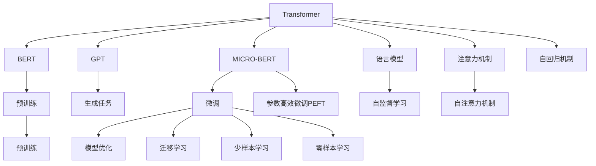

                 

# Python深度学习实践：使用Transformers处理NLP问题

> 关键词：Python, Transformers, 自然语言处理(NLP), 深度学习, 预训练模型, 微调, 强化学习, 模型压缩, 迁移学习

## 1. 背景介绍

### 1.1 问题由来
随着深度学习技术的快速发展，自然语言处理(Natural Language Processing, NLP)领域取得了显著进步。然而，传统基于规则或统计的方法已无法满足复杂多变的语言理解需求，深度学习方法逐渐成为NLP研究的主流。

深度学习在NLP中的应用涵盖了文本分类、命名实体识别、机器翻译、问答系统等多个方向。其中，预训练语言模型和微调方法以其高效性、通用性和鲁棒性，成为NLP领域的核心技术。

传统的基于统计的NLP方法往往需要手工设计特征，且依赖大量标注数据。而深度学习方法，尤其是Transformer架构下的预训练模型，通过在大量无标签语料上进行自监督学习，学习到丰富的语言表示，显著提升了NLP任务的性能。

### 1.2 问题核心关键点
预训练语言模型和微调方法的关键在于：
1. **预训练**：在大规模无标签文本语料上进行自监督学习，学习到通用的语言表示。
2. **微调**：在特定任务的小规模标注数据上进行有监督学习，通过微调优化模型在特定任务上的性能。
3. **迁移学习**：将预训练模型知识迁移到下游任务中，减少标注数据需求，提升模型泛化能力。
4. **参数高效微调**：在微调过程中只更新少量参数，提高模型训练效率。
5. **提示学习**：通过精心设计输入文本格式，在不更新模型参数的情况下实现零样本或少样本学习。

本文将重点介绍基于Python和Transformers库的NLP深度学习实践，涵盖预训练模型加载、微调方法、模型压缩和迁移学习等方面，力求为读者提供全面系统的指导。

## 2. 核心概念与联系

### 2.1 核心概念概述

为了更好地理解基于Transformers的NLP深度学习实践，本节将介绍几个关键概念：

- **Transformer**：一种基于自注意力机制的神经网络架构，广泛应用于序列数据的处理。
- **BERT模型**：一种预训练语言模型，通过双塔掩码语言模型和下一句预测任务进行预训练，学习到丰富的语言表示。
- **GPT模型**：一种基于自回归的预训练语言模型，适用于生成任务。
- **微调(Fine-Tuning)**：在预训练模型的基础上，使用特定任务的小规模标注数据进行有监督学习，优化模型在特定任务上的性能。
- **迁移学习(Transfer Learning)**：将预训练模型的知识迁移到新任务中，减少标注数据需求。
- **参数高效微调(Parameter-Efficient Fine-Tuning, PEFT)**：只更新少量参数，提高微调效率。
- **提示学习(Prompt Learning)**：通过设计输入文本格式，引导模型进行特定任务的推理。
- **少样本学习(Few-shot Learning)**：在少量标注样本的情况下，通过模型学习新任务。
- **零样本学习(Zero-shot Learning)**：在未见过的新任务上，通过模型理解任务指令进行推理。

这些概念之间的逻辑关系可以通过以下Mermaid流程图来展示：



这个流程图展示了Transformer及其变体在预训练、微调和迁移学习中的关键技术点：

1. Transformer架构通过自注意力机制实现序列数据的处理。
2. BERT模型和GPT模型分别通过双塔掩码语言模型和自回归机制进行预训练。
3. 微调方法通过有监督学习优化特定任务的模型性能。
4. 迁移学习通过预训练模型的知识迁移，减少标注数据需求。
5. 参数高效微调通过更新少量参数提升微调效率。
6. 提示学习通过输入文本格式设计，实现少样本和零样本学习。

这些概念共同构成了基于Transformer的NLP深度学习框架，使得模型能够高效、通用地处理各种NLP任务。

## 3. 核心算法原理 & 具体操作步骤

### 3.1 算法原理概述

基于Transformers的NLP深度学习实践，核心在于利用Transformer架构及其预训练模型，在特定任务上进行微调。这一过程可以分为以下几个步骤：

1. **数据预处理**：将原始文本数据转换为模型能够处理的格式，如分词、编码等。
2. **模型加载**：加载预训练的Transformer模型，如BERT、GPT等。
3. **微调训练**：在特定任务的小规模标注数据上，使用微调方法优化模型参数。
4. **模型评估**：在验证集或测试集上评估模型性能。
5. **模型部署**：将训练好的模型部署到实际应用中。

### 3.2 算法步骤详解

以下是基于Python和Transformers库的NLP深度学习实践的详细步骤：

**Step 1: 准备数据集**

首先需要准备数据集，一般包括训练集、验证集和测试集。以命名实体识别(Named Entity Recognition, NER)任务为例，数据集通常包含文本和对应的实体标签。例如：

```
输入文本：
"John works at Google. He lives in New York."

标注结果：
[
  {"offset": 0, "type": "B-PER"},
  {"offset": 1, "type": "I-PER"},
  {"offset": 5, "type": "B-LOC"},
  {"offset": 8, "type": "I-LOC"},
  {"offset": 10, "type": "O"},
  {"offset": 11, "type": "O"},
  {"offset": 13, "type": "O"}
]

其中，"B-PER"表示人名开头，"I-PER"表示人名中间，"B-LOC"表示地点开头，"I-LOC"表示地点中间，"O"表示非实体。

**Step 2: 加载预训练模型**

加载预训练的Transformer模型，并进行必要的微调配置。例如，使用HuggingFace的Transformers库加载BERT模型：

```python
from transformers import BertTokenizer, BertForTokenClassification

tokenizer = BertTokenizer.from_pretrained('bert-base-cased')
model = BertForTokenClassification.from_pretrained('bert-base-cased', num_labels=num_labels)
```

**Step 3: 数据预处理**

使用预训练模型的Tokenizer对输入文本进行分词和编码，得到模型所需的input_ids、attention_mask等特征。例如：

```python
inputs = tokenizer(input_text, return_tensors='pt', padding=True, truncation=True, max_length=max_length)
input_ids = inputs.input_ids
attention_mask = inputs.attention_mask
```

**Step 4: 微调训练**

定义优化器，如AdamW，并进行微调训练。例如：

```python
from transformers import AdamW

optimizer = AdamW(model.parameters(), lr=learning_rate)
for epoch in range(num_epochs):
    model.train()
    for batch in train_loader:
        input_ids = batch.input_ids.to(device)
        attention_mask = batch.attention_mask.to(device)
        labels = batch.labels.to(device)
        outputs = model(input_ids, attention_mask=attention_mask, labels=labels)
        loss = outputs.loss
        loss.backward()
        optimizer.step()
```

**Step 5: 模型评估**

在验证集或测试集上评估模型性能，如精确度、召回率、F1值等。例如：

```python
model.eval()
evaluation_metrics = []
for batch in eval_loader:
    input_ids = batch.input_ids.to(device)
    attention_mask = batch.attention_mask.to(device)
    labels = batch.labels.to(device)
    outputs = model(input_ids, attention_mask=attention_mask)
    logits = outputs.logits.argmax(dim=2)
    metrics.add_batch_preds(logits, labels)
metrics.calculate()
```

**Step 6: 模型部署**

将训练好的模型部署到实际应用中，进行推理预测。例如：

```python
model.to(device)
inputs = tokenizer(input_text, return_tensors='pt', padding=True, truncation=True, max_length=max_length)
input_ids = inputs.input_ids.to(device)
attention_mask = inputs.attention_mask.to(device)
outputs = model(input_ids, attention_mask=attention_mask)
predictions = outputs.logits.argmax(dim=2)
```

### 3.3 算法优缺点

基于Transformers的NLP深度学习实践具有以下优点：

1. **高效性**：利用预训练模型的知识迁移，减少标注数据需求，提高模型训练效率。
2. **通用性**：适用于多种NLP任务，如文本分类、命名实体识别、机器翻译等。
3. **鲁棒性**：预训练模型已经学习到丰富的语言表示，具有较好的泛化能力。
4. **可扩展性**：可以根据任务需求，灵活调整模型结构和参数，适应不同规模和类型的NLP任务。

同时，该方法也存在一些缺点：

1. **数据依赖**：微调效果依赖于标注数据的质量和数量，获取高质量标注数据成本较高。
2. **计算资源需求**：大规模预训练模型需要高性能计算资源，如GPU、TPU等。
3. **模型复杂性**：预训练模型参数量较大，模型复杂度较高，推理速度较慢。
4. **模型解释性**：黑盒模型难以解释其内部工作机制和决策逻辑，缺乏可解释性。

尽管存在这些局限性，但基于Transformers的NLP深度学习实践仍是当前NLP领域的主流方法，具有广泛的应用前景。

### 3.4 算法应用领域

基于Transformers的NLP深度学习实践在多个领域得到了广泛应用，例如：

- **文本分类**：如情感分析、主题分类等。通过微调使模型学习文本-标签映射。
- **命名实体识别**：识别文本中的人名、地名、机构名等特定实体。通过微调使模型掌握实体边界和类型。
- **机器翻译**：将源语言文本翻译成目标语言。通过微调使模型学习语言-语言映射。
- **问答系统**：对自然语言问题给出答案。将问题-答案对作为微调数据，训练模型学习匹配答案。
- **文本摘要**：将长文本压缩成简短摘要。将文章-摘要对作为微调数据，使模型学习抓取要点。
- **对话系统**：使机器能够与人自然对话。将多轮对话历史作为上下文，微调模型进行回复生成。

除了上述这些经典任务外，基于Transformers的NLP深度学习实践也被创新性地应用到更多场景中，如可控文本生成、常识推理、代码生成、数据增强等，为NLP技术带来了全新的突破。

## 4. 数学模型和公式 & 详细讲解  
### 4.1 数学模型构建

基于Transformers的NLP深度学习实践，核心在于利用Transformer架构及其预训练模型，在特定任务上进行微调。这一过程可以用以下数学模型来描述：

假设输入文本为 $x$，预训练模型为 $M_{\theta}$，其中 $\theta$ 为模型参数。令训练集为 $D=\{(x_i, y_i)\}_{i=1}^N$，其中 $x_i$ 为输入，$y_i$ 为标签。微调的目标是最小化经验风险：

$$
\min_{\theta} \frac{1}{N} \sum_{i=1}^N \ell(M_{\theta}(x_i), y_i)
$$

其中 $\ell$ 为损失函数，如交叉熵损失、均方误差损失等。

### 4.2 公式推导过程

以命名实体识别任务为例，假设模型输出为 $y_i \in \{0, 1\}$，其中 $0$ 表示非实体，$1$ 表示实体。交叉熵损失函数可以表示为：

$$
\ell(M_{\theta}(x_i), y_i) = -y_i\log M_{\theta}(x_i) - (1-y_i)\log(1-M_{\theta}(x_i))
$$

对所有样本的损失函数求和，得到经验风险：

$$
\mathcal{L}(\theta) = -\frac{1}{N} \sum_{i=1}^N [y_i\log M_{\theta}(x_i)+(1-y_i)\log(1-M_{\theta}(x_i))]
$$

在微调过程中，使用AdamW等优化器进行参数更新，更新公式为：

$$
\theta \leftarrow \theta - \eta \nabla_{\theta}\mathcal{L}(\theta) - \eta\lambda\theta
$$

其中 $\eta$ 为学习率，$\lambda$ 为正则化系数。

### 4.3 案例分析与讲解

以情感分析任务为例，假设模型输出为 $y_i \in \{1, 2, 3\}$，其中 $1$ 表示负面情感，$2$ 表示中性情感，$3$ 表示正面情感。交叉熵损失函数可以表示为：

$$
\ell(M_{\theta}(x_i), y_i) = -y_i\log M_{\theta}(x_i) - (1-y_i)\log(1-M_{\theta}(x_i))
$$

假设训练集大小为 $N=1000$，模型参数大小为 $d=768$，交叉熵损失函数为：

$$
\mathcal{L}(\theta) = -\frac{1}{N} \sum_{i=1}^N [y_i\log M_{\theta}(x_i)+(1-y_i)\log(1-M_{\theta}(x_i))]
$$

假设使用AdamW优化器，学习率为 $1e-5$，进行5个epoch的微调。在每个epoch结束后，计算模型在验证集上的精确度、召回率和F1值：

$$
Precision = \frac{TP}{TP+FP}, Recall = \frac{TP}{TP+FN}, F1 = 2 \times \frac{Precision \times Recall}{Precision + Recall}
$$

其中 $TP$ 表示预测为正例且实际为正例的数量，$FP$ 表示预测为正例且实际为负例的数量，$FN$ 表示预测为负例且实际为正例的数量。

## 5. 项目实践：代码实例和详细解释说明

### 5.1 开发环境搭建

在进行NLP深度学习实践前，我们需要准备好开发环境。以下是使用Python进行PyTorch开发的环境配置流程：

1. 安装Anaconda：从官网下载并安装Anaconda，用于创建独立的Python环境。

2. 创建并激活虚拟环境：
```bash
conda create -n pytorch-env python=3.8 
conda activate pytorch-env
```

3. 安装PyTorch：根据CUDA版本，从官网获取对应的安装命令。例如：
```bash
conda install pytorch torchvision torchaudio cudatoolkit=11.1 -c pytorch -c conda-forge
```

4. 安装TensorFlow：
```bash
conda install tensorflow -c tf
```

5. 安装各类工具包：
```bash
pip install numpy pandas scikit-learn matplotlib tqdm jupyter notebook ipython
```

完成上述步骤后，即可在`pytorch-env`环境中开始NLP深度学习实践。

### 5.2 源代码详细实现

下面我们以情感分析任务为例，给出使用Transformers库对BERT模型进行微调的PyTorch代码实现。

首先，定义情感分析任务的数据处理函数：

```python
from transformers import BertTokenizer
from torch.utils.data import Dataset, DataLoader
import torch

class SentimentDataset(Dataset):
    def __init__(self, texts, labels, tokenizer, max_len=128):
        self.texts = texts
        self.labels = labels
        self.tokenizer = tokenizer
        self.max_len = max_len
        
    def __len__(self):
        return len(self.texts)
    
    def __getitem__(self, item):
        text = self.texts[item]
        label = self.labels[item]
        
        encoding = self.tokenizer(text, return_tensors='pt', max_length=self.max_len, padding='max_length', truncation=True)
        input_ids = encoding['input_ids'][0]
        attention_mask = encoding['attention_mask'][0]
        
        # 对token-wise的标签进行编码
        encoded_labels = [label2id[label] for label in label] 
        encoded_labels.extend([label2id['O']] * (self.max_len - len(encoded_labels)))
        labels = torch.tensor(encoded_labels, dtype=torch.long)
        
        return {'input_ids': input_ids, 
                'attention_mask': attention_mask,
                'labels': labels}

# 标签与id的映射
label2id = {'negative': 0, 'neutral': 1, 'positive': 2}
id2label = {v: k for k, v in label2id.items()}

# 创建dataset
tokenizer = BertTokenizer.from_pretrained('bert-base-cased')

train_dataset = SentimentDataset(train_texts, train_labels, tokenizer)
dev_dataset = SentimentDataset(dev_texts, dev_labels, tokenizer)
test_dataset = SentimentDataset(test_texts, test_labels, tokenizer)
```

然后，定义模型和优化器：

```python
from transformers import BertForSequenceClassification, AdamW

model = BertForSequenceClassification.from_pretrained('bert-base-cased', num_labels=len(label2id))

optimizer = AdamW(model.parameters(), lr=2e-5)
```

接着，定义训练和评估函数：

```python
from tqdm import tqdm

device = torch.device('cuda') if torch.cuda.is_available() else torch.device('cpu')
model.to(device)

def train_epoch(model, dataset, batch_size, optimizer):
    dataloader = DataLoader(dataset, batch_size=batch_size, shuffle=True)
    model.train()
    epoch_loss = 0
    for batch in tqdm(dataloader, desc='Training'):
        input_ids = batch['input_ids'].to(device)
        attention_mask = batch['attention_mask'].to(device)
        labels = batch['labels'].to(device)
        model.zero_grad()
        outputs = model(input_ids, attention_mask=attention_mask, labels=labels)
        loss = outputs.loss
        epoch_loss += loss.item()
        loss.backward()
        optimizer.step()
    return epoch_loss / len(dataloader)

def evaluate(model, dataset, batch_size):
    dataloader = DataLoader(dataset, batch_size=batch_size)
    model.eval()
    preds, labels = [], []
    with torch.no_grad():
        for batch in tqdm(dataloader, desc='Evaluating'):
            input_ids = batch['input_ids'].to(device)
            attention_mask = batch['attention_mask'].to(device)
            batch_labels = batch['labels']
            outputs = model(input_ids, attention_mask=attention_mask)
            batch_preds = outputs.logits.argmax(dim=2).to('cpu').tolist()
            batch_labels = batch_labels.to('cpu').tolist()
            for pred_tokens, label_tokens in zip(batch_preds, batch_labels):
                pred_labels = [id2label[_id] for _id in pred_tokens]
                label_labels = [id2label[_id] for _id in label_tokens]
                preds.append(pred_labels[:len(label_labels)])
                labels.append(label_labels)
                
    print(classification_report(labels, preds))
```

最后，启动训练流程并在测试集上评估：

```python
epochs = 5
batch_size = 16

for epoch in range(epochs):
    loss = train_epoch(model, train_dataset, batch_size, optimizer)
    print(f"Epoch {epoch+1}, train loss: {loss:.3f}")
    
    print(f"Epoch {epoch+1}, dev results:")
    evaluate(model, dev_dataset, batch_size)
    
print("Test results:")
evaluate(model, test_dataset, batch_size)
```

以上就是使用PyTorch对BERT进行情感分析任务微调的完整代码实现。可以看到，得益于Transformers库的强大封装，我们可以用相对简洁的代码完成BERT模型的加载和微调。

### 5.3 代码解读与分析

让我们再详细解读一下关键代码的实现细节：

**SentimentDataset类**：
- `__init__`方法：初始化文本、标签、分词器等关键组件。
- `__len__`方法：返回数据集的样本数量。
- `__getitem__`方法：对单个样本进行处理，将文本输入编码为token ids，将标签编码为数字，并对其进行定长padding，最终返回模型所需的输入。

**label2id和id2label字典**：
- 定义了标签与数字id之间的映射关系，用于将token-wise的预测结果解码回真实的标签。

**训练和评估函数**：
- 使用PyTorch的DataLoader对数据集进行批次化加载，供模型训练和推理使用。
- 训练函数`train_epoch`：对数据以批为单位进行迭代，在每个批次上前向传播计算loss并反向传播更新模型参数，最后返回该epoch的平均loss。
- 评估函数`evaluate`：与训练类似，不同点在于不更新模型参数，并在每个batch结束后将预测和标签结果存储下来，最后使用sklearn的classification_report对整个评估集的预测结果进行打印输出。

**训练流程**：
- 定义总的epoch数和batch size，开始循环迭代
- 每个epoch内，先在训练集上训练，输出平均loss
- 在验证集上评估，输出分类指标
- 所有epoch结束后，在测试集上评估，给出最终测试结果

可以看到，PyTorch配合Transformers库使得BERT微调的代码实现变得简洁高效。开发者可以将更多精力放在数据处理、模型改进等高层逻辑上，而不必过多关注底层的实现细节。

当然，工业级的系统实现还需考虑更多因素，如模型的保存和部署、超参数的自动搜索、更灵活的任务适配层等。但核心的微调范式基本与此类似。

## 6. 实际应用场景

### 6.1 智能客服系统

基于NLP深度学习实践的智能客服系统，可以显著提升客户咨询体验。传统客服系统依赖于大量人工，响应时间长，且服务质量难以保证。而基于NLP深度学习的智能客服系统，可以通过微调使模型理解自然语言，自动生成回复，实现24/7服务，大大提升响应速度和效率。

例如，可以通过收集企业内部的历史客服对话记录，将问题和最佳答复构建成监督数据，在此基础上对预训练的Transformer模型进行微调。微调后的模型能够自动理解用户意图，匹配最合适的答复，并在新客户咨询时，自动生成个性化的回复。

### 6.2 金融舆情监测

金融领域需要实时监测市场舆情，以便及时应对负面信息传播，规避金融风险。传统的人工监测方式成本高、效率低，难以应对海量信息爆发的挑战。基于NLP深度学习实践的舆情监测系统，可以通过微调使模型自动分析新闻、评论等文本数据，判断情感倾向和主题，从而实时预警市场舆情变化。

例如，可以收集金融领域相关的新闻、评论、股票公告等文本数据，并对其进行情感分析和主题标注。在此基础上对预训练的Transformer模型进行微调，使其能够自动判断文本属于何种情感和主题。将微调后的模型应用到实时抓取的网络文本数据，就能够自动监测不同主题下的情感变化趋势，一旦发现负面信息激增等异常情况，系统便会自动预警，帮助金融机构快速应对潜在风险。

### 6.3 个性化推荐系统

当前的推荐系统往往只依赖用户的历史行为数据进行物品推荐，无法深入理解用户的真实兴趣偏好。基于NLP深度学习实践的个性化推荐系统，可以通过微调使模型学习用户对物品的情感评价，从而提供更精准、多样的推荐内容。

例如，可以收集用户浏览、点击、评论、分享等行为数据，提取和用户交互的物品标题、描述、标签等文本内容。将文本内容作为模型输入，用户的后续行为（如是否点击、购买等）作为监督信号，在此基础上微调预训练Transformer模型。微调后的模型能够从文本内容中准确把握用户的兴趣点。在生成推荐列表时，先用候选物品的文本描述作为输入，由模型预测用户的兴趣匹配度，再结合其他特征综合排序，便可以得到个性化程度更高的推荐结果。

### 6.4 未来应用展望

随着NLP深度学习实践的不断发展，基于Transformers的模型将在更多领域得到应用，为传统行业带来变革性影响。

在智慧医疗领域，基于NLP深度学习实践的医疗问答、病历分析、药物研发等应用将提升医疗服务的智能化水平，辅助医生诊疗，加速新药开发进程。

在智能教育领域，微调技术可应用于作业批改、学情分析、知识推荐等方面，因材施教，促进教育公平，提高教学质量。

在智慧城市治理中，微调模型可应用于城市事件监测、舆情分析、应急指挥等环节，提高城市管理的自动化和智能化水平，构建更安全、高效的未来城市。

此外，在企业生产、社会治理、文娱传媒等众多领域，基于Transformer的NLP深度学习实践也将不断涌现，为经济社会发展注入新的动力。相信随着技术的日益成熟，NLP深度学习实践必将成为人工智能落地应用的重要范式，推动人工智能技术在垂直行业的规模化落地。

## 7. 工具和资源推荐

### 7.1 学习资源推荐

为了帮助开发者系统掌握NLP深度学习实践的理论基础和实践技巧，这里推荐一些优质的学习资源：

1. **《Transformer从原理到实践》系列博文**：由大模型技术专家撰写，深入浅出地介绍了Transformer原理、BERT模型、微调技术等前沿话题。

2. **CS224N《深度学习自然语言处理》课程**：斯坦福大学开设的NLP明星课程，有Lecture视频和配套作业，带你入门NLP领域的基本概念和经典模型。

3. **《Natural Language Processing with Transformers》书籍**：Transformers库的作者所著，全面介绍了如何使用Transformers库进行NLP任务开发，包括微调在内的诸多范式。

4. **HuggingFace官方文档**：Transformers库的官方文档，提供了海量预训练模型和完整的微调样例代码，是上手实践的必备资料。

5. **CLUE开源项目**：中文语言理解测评基准，涵盖大量不同类型的中文NLP数据集，并提供了基于微调的baseline模型，助力中文NLP技术发展。

通过对这些资源的学习实践，相信你一定能够快速掌握NLP深度学习实践的精髓，并用于解决实际的NLP问题。

### 7.2 开发工具推荐

高效的开发离不开优秀的工具支持。以下是几款用于NLP深度学习实践的常用工具：

1. **PyTorch**：基于Python的开源深度学习框架，灵活动态的计算图，适合快速迭代研究。大部分预训练语言模型都有PyTorch版本的实现。

2. **TensorFlow**：由Google主导开发的开源深度学习框架，生产部署方便，适合大规模工程应用。同样有丰富的预训练语言模型资源。

3. **Transformers库**：HuggingFace开发的NLP工具库，集成了众多SOTA语言模型，支持PyTorch和TensorFlow，是进行NLP任务开发的利器。

4. **Weights & Biases**：模型训练的实验跟踪工具，可以记录和可视化模型训练过程中的各项指标，方便对比和调优。与主流深度学习框架无缝集成。

5. **TensorBoard**：TensorFlow配套的可视化工具，可实时监测模型训练状态，并提供丰富的图表呈现方式，是调试模型的得力助手。

6. **Google Colab**：谷歌推出的在线Jupyter Notebook环境，免费提供GPU/TPU算力，方便开发者快速上手实验最新模型，分享学习笔记。

合理利用这些工具，可以显著提升NLP深度学习实践的开发效率，加快创新迭代的步伐。

### 7.3 相关论文推荐

NLP深度学习实践的发展源于学界的持续研究。以下是几篇奠基性的相关论文，推荐阅读：

1. **Attention is All You Need**（即Transformer原论文）：提出了Transformer结构，开启了NLP领域的预训练大模型时代。

2. **BERT: Pre-training of Deep Bidirectional Transformers for Language Understanding**：提出BERT模型，引入基于掩码的自监督预训练任务，学习到丰富的语言表示。

3. **Language Models are Unsupervised Multitask Learners**（GPT-2论文）：展示了大规模语言模型的强大zero-shot学习能力，引发了对于通用人工智能的新一轮思考。

4. **Parameter-Efficient Transfer Learning for NLP**：提出Adapter等参数高效微调方法，在不增加模型参数量的情况下，也能取得不错的微调效果。

5. **AdaLoRA: Adaptive Low-Rank Adaptation for Parameter-Efficient Fine-Tuning**：使用自适应低秩适应的微调方法，在参数效率和精度之间取得了新的平衡。

6. **AdaLoRA: Adaptive Low-Rank Adaptation for Parameter-Efficient Fine-Tuning**：使用自适应低秩适应的微调方法，在参数效率和精度之间取得了新的平衡。

这些论文代表了大语言模型微调技术的发展脉络。通过学习这些前沿成果，可以帮助研究者把握学科前进方向，激发更多的创新灵感。

## 8. 总结：未来发展趋势与挑战

### 8.1 总结

本文对基于Transformers的NLP深度学习实践进行了全面系统的介绍。首先阐述了NLP深度学习实践的研究背景和意义，明确了微调在拓展预训练模型应用、提升模型性能方面的独特价值。其次，从原理到实践，详细讲解了NLP深度学习实践的数学原理和关键步骤，给出了微调任务开发的完整代码实例。同时，本文还广泛探讨了NLP深度学习实践在智能客服、金融舆情、个性化推荐等多个行业领域的应用前景，展示了其广泛的应用潜力。

通过本文的系统梳理，可以看到，基于Transformer的NLP深度学习实践已经成为NLP领域的主流方法，极大地拓展了预训练语言模型的应用边界，催生了更多的落地场景。得益于大规模语料的预训练，深度学习模型具有较好的泛化能力和鲁棒性，能够高效地适应多种NLP任务。未来，伴随预训练语言模型和微调方法的持续演进，基于NLP深度学习实践的NLP技术必将在更广阔的应用领域大放异彩。

### 8.2 未来发展趋势

展望未来，NLP深度学习实践将呈现以下几个发展趋势：

1. **模型规模持续增大**：随着算力成本的下降和数据规模的扩张，预训练语言模型的参数量还将持续增长。超大规模语言模型蕴含的丰富语言知识，有望支撑更加复杂多变的NLP任务。

2. **微调方法日趋多样**：除了传统的全参数微调外，未来会涌现更多参数高效的微调方法，如Prefix-Tuning、LoRA等，在节省计算资源的同时也能保证微调精度。

3. **持续学习成为常态**：随着数据分布的不断变化，NLP深度学习实践模型也需要持续学习新知识以保持性能。如何在不遗忘原有知识的同时，高效吸收新样本信息，将成为重要的研究课题。

4. **标注样本需求降低**：受启发于提示学习(Prompt-based Learning)的思路，未来的NLP深度学习实践将更好地利用大模型的语言理解能力，通过更加巧妙的任务描述，在更少的标注样本上也能实现理想的微调效果。

5. **多模态微调崛起**：当前的NLP深度学习实践主要聚焦于纯文本数据，未来会进一步拓展到图像、视频、语音等多模态数据微调。多模态信息的融合，将显著提升语言模型对现实世界的理解和建模能力。

6. **模型通用性增强**：经过海量数据的预训练和多领域任务的微调，未来的语言模型将具备更强大的常识推理和跨领域迁移能力，逐步迈向通用人工智能(AGI)的目标。

以上趋势凸显了NLP深度学习实践的广阔前景。这些方向的探索发展，必将进一步提升NLP系统的性能和应用范围，为人类认知智能的进化带来深远影响。

### 8.3 面临的挑战

尽管NLP深度学习实践已经取得了瞩目成就，但在迈向更加智能化、普适化应用的过程中，它仍面临着诸多挑战：

1. **标注成本瓶颈**：微调效果依赖于标注数据的质量和数量，获取高质量标注数据成本较高。如何进一步降低微调对标注样本的依赖，将是一大难题。

2. **模型鲁棒性不足**：当前NLP深度学习实践模型面对域外数据时，泛化性能往往大打折扣。对于测试样本的微小扰动，模型的预测也容易发生波动。如何提高NLP深度学习实践模型的鲁棒性，避免灾难性遗忘，还需要更多理论和实践的积累。

3. **推理效率有待提高**：大规模预训练模型虽然精度高，但在实际部署时往往面临推理速度慢、内存占用大等效率问题。如何在保证性能的同时，简化模型结构，提升推理速度，优化资源占用，将是重要的优化方向。

4. **可解释性亟需加强**：当前NLP深度学习实践模型更像是"黑盒"系统，难以解释其内部工作机制和决策逻辑，缺乏可解释性。对于医疗、金融等高风险应用，算法的可解释性和可审计性尤为重要。如何赋予NLP深度学习实践模型更强的可解释性，将是亟待攻克的难题。

5. **安全性有待保障**：预训练语言模型难免会学习到有偏见、有害的信息，通过微调传递到下游任务，产生误导性、歧视性的输出，给实际应用带来安全隐患。如何从数据和算法层面消除模型偏见，避免恶意用途，确保输出的安全性，也将是重要的研究课题。

6. **知识整合能力不足**：现有的NLP深度学习实践模型往往局限于任务内数据，难以灵活吸收和运用更广泛的先验知识。如何让NLP深度学习实践过程更好地与外部知识库、规则库等专家知识结合，形成更加全面、准确的信息整合能力，还有很大的想象空间。

正视NLP深度学习实践面临的这些挑战，积极应对并寻求突破，将是大语言模型微调走向成熟的必由之路。相信随着学界和产业界的共同努力，这些挑战终将一一被克服，NLP深度学习实践必将在构建安全、可靠、可解释、可控的智能系统铺平道路。

### 8.4 研究展望

面对NLP深度学习实践所面临的种种挑战，未来的研究需要在以下几个方面寻求新的突破：

1. **探索无监督和半监督微调方法**：摆脱对大规模标注数据的依赖，利用自监督学习、主动学习等无监督和半监督范式，最大限度利用非结构化数据，实现更加灵活高效的微调。

2. **研究参数高效和计算高效的微调范式**：开发更加参数高效的微调方法，在固定大部分预训练参数的同时，只更新极少量的任务相关参数。同时优化微调模型的计算图，减少前向传播和反向传播的资源消耗，实现更加轻量级、实时性的部署。

3. **融合因果和对比学习范式**：通过引入因果推断和对比学习思想，增强NLP深度学习实践模型建立稳定因果关系的能力，学习更加普适、鲁棒的语言表征，从而提升模型泛化性和抗干扰能力。

4. **引入更多先验知识**：将符号化的先验知识，如知识图谱、逻辑规则等，与神经网络模型进行巧妙融合，引导NLP深度学习实践过程学习更准确、合理的语言模型。同时加强不同模态数据的整合，实现视觉、语音等多模态信息与文本信息的协同建模。

5. **结合因果分析和博弈论工具**：将因果分析方法引入NLP深度学习实践模型，识别出模型决策的关键特征，增强输出解释的因果性和逻辑性。借助博弈论工具刻画人机交互过程，主动探索并规避模型的脆弱点，提高系统稳定性。

6. **纳入伦理道德约束**：在模型训练目标中引入伦理导向的评估指标，过滤和惩罚有偏见、有害的输出倾向。同时加强人工干预和审核，建立模型行为的监管机制，确保输出符合人类价值观和伦理道德。

这些研究方向的探索，必将引领NLP深度学习实践技术迈向更高的台阶，为构建安全、可靠、可解释、可控的智能系统铺平道路。面向未来，NLP深度学习实践还需要与其他人工智能技术进行更深入的融合，如知识表示、因果推理、强化学习等，多路径协同发力，共同推动自然语言理解和智能交互系统的进步。只有勇于创新、敢于突破，才能不断拓展语言模型的边界，让智能技术更好地造福人类社会。

## 9. 附录：常见问题与解答

**Q1：NLP深度学习实践是否适用于所有NLP任务？**

A: NLP深度学习实践在大多数NLP任务上都能取得不错的效果，特别是对于数据量较小的任务。但对于一些特定领域的任务，如医学、法律等，仅仅依靠通用语料预训练的模型可能难以很好地适应。此时需要在特定领域语料上进一步预训练，再进行微调，才能获得理想效果。此外，对于一些需要时效性、个性化很强的任务，如对话、推荐等，NLP深度学习实践方法也需要针对性的改进优化。

**Q2：如何选择合适的学习率？**

A: NLP深度学习实践的学习率一般要比预训练时小1-2个数量级，如果使用过大的学习率，容易破坏预训练权重，导致过拟合。一般建议从1e-5开始调参，逐步减小学习率，直至收敛。也可以使用warmup策略，在开始阶段使用较小的学习率，再逐渐过渡到预设值。需要注意的是，不同的优化器(如AdamW、Adafactor等)以及不同的学习率调度策略，可能需要设置不同的学习率阈值。

**Q3：在NLP深度学习实践过程中，如何缓解过拟合问题？**

A: 过拟合是NLP深度学习实践面临的主要挑战，尤其是在标注数据不足的情况下。常见的缓解策略包括：

1. 数据增强：通过回译、近义替换等方式扩充训练集。
2. 正则化：使用L2正则、Dropout、Early Stopping等避免过拟合。
3. 对抗训练：引入对抗样本，提高模型鲁棒性。
4. 参数高效微调(PEFT)：只调整少量参数(如Adapter、Prefix等)，减小过拟合风险。
5. 多模型集成：训练多个NLP深度学习实践模型，取平均输出，抑制过拟合。

这些策略往往需要根据具体任务和数据特点进行灵活组合。只有在数据、模型、训练、推理等各环节进行全面优化，才能最大限度地发挥NLP深度学习实践模型的威力。

**Q4：在NLP深度学习实践中，如何处理多轮对话历史？**

A: 在对话系统中，NLP深度学习实践模型需要处理多轮对话历史。可以使用Transformer编码器处理每轮对话的上下文信息，并结合自注意力机制，实现对多轮对话的联合建模。例如，可以使用T5等预训练模型，通过fine-tuning的方式，学习对话任务的特定表示。

**Q5：在NLP深度学习实践中，如何进行情感分析？**

A: 情感分析是NLP深度学习实践中的重要任务之一。可以使用BERT等预训练模型，通过fine-tuning的方式，学习情感分类任务。具体实现步骤如下：

1. 收集情感标注数据，如电影评论、社交媒体帖子等。
2. 对文本进行预处理，包括分词、编码等。
3. 加载预训练模型，如BERT。
4. 定义训练函数，对模型进行fine-tuning。
5. 在验证集上评估模型性能。

在实际应用中，可以根据具体需求，调整模型结构和参数，优化训练过程，进一步提升情感分析的准确性。

**Q6：在NLP深度学习实践中，如何进行命名实体识别？**

A: 命名实体识别是NLP深度学习实践中的重要任务之一。可以使用BERT等预训练模型，通过fine-tuning的方式，学习命名实体识别任务。具体实现步骤如下：

1. 收集命名实体标注数据，如新闻、网页、电子病历等。
2. 对文本进行预处理，包括分词、编码等。
3. 加载预训练模型，如BERT。
4. 定义训练函数，对模型进行fine-tuning。
5. 在验证集上评估模型性能。

在实际应用中，可以根据具体需求，调整模型结构和参数，优化训练过程，进一步提升命名实体识别的准确性。

**Q7：在NLP深度学习实践中，如何进行机器翻译？**

A: 机器翻译是NLP深度学习实践中的重要任务之一。可以使用Transformer等预训练模型，通过fine-tuning的方式，学习机器翻译任务。具体实现步骤如下：

1. 收集机器翻译数据对，如英语-法语、英语-中文等。
2.

