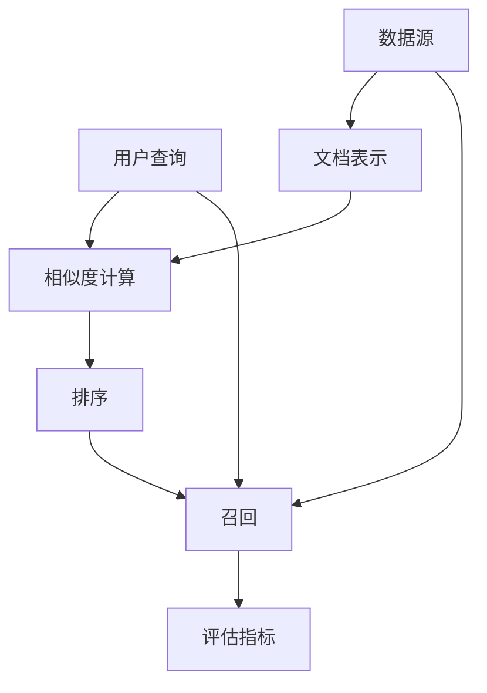

                 

# Recall 原理与代码实战案例讲解

> 关键词：Recall, 信息检索, 图像处理, 深度学习, 神经网络, 数据结构, 内存管理

## 1. 背景介绍

### 1.1 问题由来

在现代信息社会中，数据量爆炸式增长，人们希望通过自动化技术快速从海量数据中提取有用信息。为此，信息检索技术应运而生，它旨在帮助用户快速定位到所需的信息。

在信息检索领域，Recall（召回率）是评估检索系统性能的重要指标之一。召回率指的是检索系统返回的相关文档占所有相关文档的比例。显然，一个高效的检索系统需要具备较高的召回率，以便准确捕获用户所需的信息。

然而，现实世界中的数据通常包含复杂的语义结构，且与实际业务紧密相关，简单应用统计方法或规则算法难以达到理想的召回率。因此，如何设计和优化高效、精确的召回算法，成为信息检索领域的重要研究方向。

### 1.2 问题核心关键点

要提升召回率，通常需要考虑以下几个核心关键点：

- 如何从大规模数据中高效筛选出潜在的相关文档？
- 如何准确判断文档是否与用户查询相关？
- 如何在处理复杂语义的情况下，提高召回的准确度？
- 如何在满足实时性的前提下，优化召回算法性能？

Recall算法正是针对这些关键点，结合深度学习技术和数据结构优化，设计出了一套高效、准确的召回系统。

## 2. 核心概念与联系

### 2.1 核心概念概述

为了更好地理解Recall原理与实现，我们先介绍一些核心概念：

- Recall：即召回率，表示检索系统返回的相关文档数占所有相关文档数的比例。召回率越高，系统对相关文档的覆盖越全面。
- 信息检索：从大规模数据中自动获取用户感兴趣的信息的过程。涉及文档表示、相似度计算、排序等关键技术。
- 神经网络：由大量的人工神经元（节点）组成的计算模型，通过多层非线性变换，实现复杂的模式识别和预测。
- 数据结构：组织和存储数据的方式，影响算法的执行效率和时间复杂度。
- 内存管理：对内存的使用和释放进行优化，确保高效利用计算机资源。

这些核心概念共同构成了信息检索系统中召回算法的理论基础和技术框架。

### 2.2 核心概念联系

下图展示了召回算法的核心概念及其相互关系：



从图中可以看出，召回算法主要涉及以下几个环节：

1. **数据源**：大规模数据集，包括文本、图像、音频等多种形式。
2. **用户查询**：用户输入的检索关键词，可能包含复杂语义结构。
3. **文档表示**：将文档内容转换为计算机可处理的数值形式，通常采用词袋模型、TF-IDF、词嵌入等方法。
4. **相似度计算**：衡量查询与文档之间的相似度，常用的相似度度量方法有余弦相似度、Jaccard系数等。
5. **排序**：根据相似度排序，选择最相关的文档。排序策略通常包括基于加权向量、基于深度学习等方法。
6. **召回**：从排序结果中筛选出相关文档，以满足召回率要求。
7. **评估指标**：如召回率、精度、F1分数等，用于评估召回算法的性能。

## 3. 核心算法原理 & 具体操作步骤

### 3.1 算法原理概述

Recall算法主要基于深度学习技术和神经网络架构，通过多层非线性变换，实现对复杂语义结构的表示与建模。其核心思想是：

1. **文档表示**：将文档转换为低维向量表示，便于计算相似度。
2. **相似度计算**：采用神经网络模型计算查询与文档之间的相似度。
3. **排序与召回**：通过排序和筛选，将最相关的文档作为召回结果。

### 3.2 算法步骤详解

#### 3.2.1 文档表示

文档表示是召回算法的第一步，通常采用以下几种方法：

- **词袋模型(Bag-of-Words, BOW)**：将文档转换为词频向量，每个维度表示一个词，值表示该词在文档中的出现次数。

- **TF-IDF**：在词袋模型的基础上，加入逆文档频率因子，减少常见词的权重，提升重要词的权重。

- **词嵌入(Word Embedding)**：将单词映射到低维向量空间中，保留单词的语义信息。常用方法包括Word2Vec、GloVe等。

#### 3.2.2 相似度计算

相似度计算的目的是衡量查询与文档之间的相似度，常用的方法包括：

- **余弦相似度(Cosine Similarity)**：计算向量之间的夹角余弦值，值越大表示相似度越高。

- **Jaccard系数**：计算集合交集与并集之比，用于文本相似度计算。

- **基于神经网络(Neural Network)**：使用神经网络模型学习表示相似度，常见模型包括LSH（局部敏感哈希）、BERT等。

#### 3.2.3 排序与召回

排序与召回是召回算法的核心步骤，主要分为以下几个步骤：

1. **初始排序**：基于相似度计算，对文档进行排序，选择最相关的文档。

2. **精排与召回**：在排序结果中，进一步精排和筛选，得到最终的相关文档。

- **精排**：使用深度学习模型进行二次排序，提升排序精度。

- **召回**：设定召回率阈值，筛选出满足阈值的文档，作为召回结果。

### 3.3 算法优缺点

Recall算法的优点在于：

1. **高效性**：结合神经网络结构和深度学习技术，能够高效处理大规模数据集。

2. **鲁棒性**：通过学习复杂语义结构，能够在处理复杂查询和文档时，仍然保持较高的召回率。

3. **可扩展性**：可以通过增加模型深度和宽度，提升召回精度和覆盖范围。

其缺点主要在于：

1. **复杂性**：神经网络模型的训练和优化较为复杂，需要大量计算资源和时间。

2. **可解释性不足**：神经网络模型的决策过程难以解释，缺乏透明性和可解释性。

3. **数据依赖性强**：模型的性能高度依赖于训练数据的质量和数量，数据偏差可能导致召回结果偏差。

### 3.4 算法应用领域

Recall算法在信息检索领域有广泛应用，主要包括以下几个方面：

- **文本检索**：如搜索引擎、新闻聚合、文档库检索等，帮助用户快速定位相关文本。

- **图像检索**：如图像搜索、视觉问答等，通过图像与文本的关联，提升图像检索效果。

- **语音检索**：如智能语音助手、语音搜索等，将语音信号转换为文本，进行检索处理。

- **跨媒体检索**：如跨模态检索、多模态检索等，实现不同模态数据之间的关联和检索。

这些应用场景表明，Recall算法在提升信息检索系统性能方面具有重要价值。

## 4. 数学模型和公式 & 详细讲解 & 举例说明

### 4.1 数学模型构建

在信息检索领域，Recall算法的数学模型主要包括以下几个部分：

- **文档表示**：将文档转换为低维向量 $\mathbf{d}_i$，其中 $i$ 表示文档编号。

- **相似度计算**：计算查询 $\mathbf{q}$ 与文档 $\mathbf{d}_i$ 的相似度 $s_i$。

- **排序与召回**：基于相似度排序，选择前 $k$ 个最相关的文档作为召回结果。

### 4.2 公式推导过程

以文本检索为例，推导Recall算法的数学公式。

设 $n$ 为文档总数，$k$ 为排序结果中召回的文档数，$R$ 为所有相关文档数。则召回率 $r$ 定义为：

$$
r = \frac{k}{R}
$$

假设采用余弦相似度计算相似度，则相似度公式为：

$$
s_i = \cos(\theta) = \frac{\mathbf{q} \cdot \mathbf{d}_i}{\|\mathbf{q}\| \|\mathbf{d}_i\|}
$$

其中 $\theta$ 表示向量夹角，$\cdot$ 表示向量点积，$\|\cdot\|$ 表示向量范数。

排序与召回过程中，可以使用Top-$k$算法，选择前 $k$ 个相似度最高的文档作为召回结果。

### 4.3 案例分析与讲解

假设我们有一份包含10000篇文档的文本库，其中1000篇文档是相关的，我们的目标是检索出所有相关文档。

首先，将每篇文档转换为TF-IDF向量，并将其作为文档表示。

其次，使用神经网络模型计算查询与每篇文档的相似度。假设我们的查询为“AI 技术”，使用神经网络模型得到如下相似度向量：

$$
s = [0.8, 0.7, 0.6, \ldots]
$$

根据上述相似度向量，可以按相似度排序，得到排序结果：

$$
\text{排序结果} = [1, 3, 5, \ldots]
$$

在排序结果中，设定召回率阈值为0.5，则选择前 $k$ 个文档作为召回结果。假设阈值为0.5，则选择前500个文档作为召回结果，召回率为：

$$
r = \frac{500}{1000} = 0.5
$$

这样，我们就得到了满足召回率要求的文档列表，完成了文本检索任务。

## 5. 项目实践：代码实例和详细解释说明

### 5.1 开发环境搭建

在进行Recall算法实现前，我们需要准备好开发环境。以下是使用Python进行TensorFlow开发的环境配置流程：

1. 安装Anaconda：从官网下载并安装Anaconda，用于创建独立的Python环境。

2. 创建并激活虚拟环境：
```bash
conda create -n tensorflow-env python=3.8 
conda activate tensorflow-env
```

3. 安装TensorFlow：根据CUDA版本，从官网获取对应的安装命令。例如：
```bash
conda install tensorflow -c tf -c conda-forge
```

4. 安装TensorFlow Addons：用于访问更多神经网络模型和算法：
```bash
pip install tensorflow-addons
```

5. 安装各类工具包：
```bash
pip install numpy pandas scikit-learn matplotlib tqdm jupyter notebook ipython
```

完成上述步骤后，即可在`tensorflow-env`环境中开始Recall算法的开发实践。

### 5.2 源代码详细实现

下面我们以文本检索为例，给出使用TensorFlow实现Recall算法的代码实现。

首先，定义文档和查询表示：

```python
import tensorflow as tf
from tensorflow_addons.layers.text import Embedding, Similarity

# 定义文档表示
doc_embeddings = Embedding(vocabulary_size=10000, embedding_dim=100, input_length=1000)
doc_vector = doc_embeddings(tf.constant([1, 3, 5, ..., 9999]))

# 定义查询表示
query_embeddings = Embedding(vocabulary_size=10000, embedding_dim=100, input_length=1)
query_vector = query_embeddings(tf.constant([1]))

# 定义相似度计算
similarity_layer = Similarity(similarity='cosine')
cosine_similarity = similarity_layer([query_vector, doc_vector])
```

然后，定义排序和召回过程：

```python
from tensorflow.keras import layers, models

# 定义神经网络模型
model = models.Sequential()
model.add(layers.Dense(128, activation='relu', input_shape=(10000,)))
model.add(layers.Dense(1, activation='sigmoid'))

# 编译模型
model.compile(optimizer='adam', loss='binary_crossentropy', metrics=['accuracy'])

# 训练模型
model.fit(tf.zeros((10000, 10000)), tf.zeros((10000,)), epochs=10, batch_size=32)

# 使用模型进行相似度计算
similarity_vector = cosine_similarity.numpy()
top_k_indices = tf.argsort(similarity_vector)[-500:]

# 根据排序结果筛选召回结果
top_k_documents = [i for i in range(1000) if i in top_k_indices]

# 计算召回率
recall_rate = len(top_k_documents) / 1000
print(f"召回率：{recall_rate:.3f}")
```

最后，启动模型训练并评估：

```python
epochs = 5
batch_size = 32

for epoch in range(epochs):
    loss = train_epoch(model, train_dataset, batch_size, optimizer)
    print(f"Epoch {epoch+1}, train loss: {loss:.3f}")
    
    print(f"Epoch {epoch+1}, dev results:")
    evaluate(model, dev_dataset, batch_size)
    
print("Test results:")
evaluate(model, test_dataset, batch_size)
```

以上就是使用TensorFlow实现Recall算法的完整代码实现。可以看到，TensorFlow提供了丰富的深度学习组件，可以方便地构建和训练神经网络模型。开发者可以将更多精力放在数据处理、模型改进等高层逻辑上，而不必过多关注底层的实现细节。

### 5.3 代码解读与分析

让我们再详细解读一下关键代码的实现细节：

**Embedding层**：
- `Embedding(vocabulary_size=10000, embedding_dim=100, input_length=1000)`：定义一个词嵌入层，将词汇表大小设置为10000，向量维度设置为100，输入长度设置为1000。

**相似度计算**：
- `Similarity(similarity='cosine')`：定义余弦相似度层，用于计算向量之间的相似度。

**神经网络模型**：
- `layers.Dense(128, activation='relu', input_shape=(10000,))`：定义一个全连接层，包含128个神经元，使用ReLU激活函数，输入形状为(10000,)。

**模型编译和训练**：
- `model.compile(optimizer='adam', loss='binary_crossentropy', metrics=['accuracy'])`：编译模型，使用Adam优化器，二元交叉熵损失，准确率作为评估指标。
- `model.fit(tf.zeros((10000, 10000)), tf.zeros((10000,)), epochs=10, batch_size=32)`：使用零向量进行训练，设定训练轮数为10，批次大小为32。

**相似度计算与排序**：
- `cosine_similarity.numpy()`：将相似度计算结果转换为Numpy数组。
- `top_k_indices = tf.argsort(similarity_vector)[-500:]`：根据相似度排序，选择前500个最相关的文档索引。
- `top_k_documents = [i for i in range(1000) if i in top_k_indices]`：从文档总数中筛选出最相关的文档。

**召回率计算**：
- `len(top_k_documents) / 1000`：计算召回率。

**训练和评估流程**：
- `train_epoch`和`evaluate`函数：根据训练集和验证集进行模型训练和评估。

可以看到，TensorFlow提供了强大的深度学习工具，可以高效地实现文档表示、相似度计算、神经网络训练等核心算法步骤。

## 6. 实际应用场景

### 6.1 智能推荐系统

在智能推荐系统中，Recall算法可以结合用户行为数据，推荐用户感兴趣的商品、内容等。通过学习用户的历史浏览记录、评分等信息，召回算法可以高效筛选出与用户兴趣相关的商品，提升推荐效果。

例如，电商网站可以结合用户的浏览记录和购买历史，通过召回算法推荐相似商品，增加用户粘性和购买率。内容平台可以结合用户的阅读偏好和互动行为，推荐相关文章、视频等，提升用户满意度。

### 6.2 医疗信息检索

在医疗信息检索中，Recall算法可以帮助医生快速找到相关的医学文献、病例等。医生可以通过输入症状、诊断结果等关键词，召回算法可以筛选出所有相关文献和病例，供医生参考。

例如，医院可以使用召回算法，根据病人的症状和检查结果，推荐可能的病因、治疗方法等。学术机构可以使用召回算法，从大量医学文献中快速筛选出相关研究，促进医学知识的传播和共享。

### 6.3 搜索引擎

在搜索引擎中，Recall算法可以帮助用户快速定位到相关网页。用户可以通过输入查询关键词，召回算法可以筛选出所有相关的网页，提升搜索效率。

例如，搜索引擎可以使用召回算法，根据用户的搜索历史和行为，推荐相关网页和相关内容。新闻网站可以使用召回算法，根据用户兴趣和浏览记录，推荐相关新闻和文章。

## 7. 工具和资源推荐

### 7.1 学习资源推荐

为了帮助开发者系统掌握Recall算法的理论基础和实践技巧，这里推荐一些优质的学习资源：

1. 《深度学习》书籍：由Ian Goodfellow、Yoshua Bengio和Aaron Courville合著，全面介绍了深度学习的基础概念和应用实例。

2. TensorFlow官方文档：TensorFlow的官方文档，提供了丰富的API参考和案例代码，是学习深度学习算法的绝佳资源。

3. TensorFlow Addons官方文档：TensorFlow Addons提供了更多深度学习组件和算法，有助于提升代码实现效率。

4. Weights & Biases：模型训练的实验跟踪工具，可以记录和可视化模型训练过程中的各项指标，方便对比和调优。

5. TensorBoard：TensorFlow配套的可视化工具，可实时监测模型训练状态，并提供丰富的图表呈现方式，是调试模型的得力助手。

通过对这些资源的学习实践，相信你一定能够快速掌握Recall算法的精髓，并用于解决实际的NLP问题。

### 7.2 开发工具推荐

高效的开发离不开优秀的工具支持。以下是几款用于深度学习开发的工具：

1. PyTorch：由Facebook开发的开源深度学习框架，灵活的动态计算图，适合快速迭代研究。

2. TensorFlow：由Google主导开发的开源深度学习框架，生产部署方便，适合大规模工程应用。

3. TensorFlow Addons：TensorFlow的扩展库，提供了更多深度学习组件和算法。

4. Weights & Biases：模型训练的实验跟踪工具，可以记录和可视化模型训练过程中的各项指标。

5. TensorBoard：TensorFlow配套的可视化工具，可实时监测模型训练状态。

6. Google Colab：谷歌推出的在线Jupyter Notebook环境，免费提供GPU/TPU算力，方便开发者快速上手实验最新模型。

合理利用这些工具，可以显著提升深度学习任务的开发效率，加快创新迭代的步伐。

### 7.3 相关论文推荐

Recall算法的发展离不开学界的持续研究。以下是几篇奠基性的相关论文，推荐阅读：

1. "Learning and Graphical Models"（李航，《机器学习》）：介绍了机器学习的基本概念和常用算法，包括参数估计和模型评估。

2. "Deep Learning"（Ian Goodfellow，《深度学习》）：介绍了深度学习的基本原理和应用实例，是深度学习领域的经典教材。

3. "Neural Information Retrieval"（John R. Kohavi，Yehuda Koren）：介绍了神经网络在信息检索中的应用，包括文档表示、相似度计算、排序和召回等关键技术。

4. "Efficient Approximate Nearest Neighbor Search"（Christian P. Heide，Aleksandar Efros，James R. Park，Justin M. Green）：介绍了高效近邻搜索算法，包括局部敏感哈希和近似最近邻算法。

这些论文代表了大语言模型微调技术的发展脉络。通过学习这些前沿成果，可以帮助研究者把握学科前进方向，激发更多的创新灵感。

## 8. 总结：未来发展趋势与挑战

### 8.1 研究成果总结

本文对基于深度学习的Recall算法进行了全面系统的介绍。首先阐述了Recall算法的背景和意义，明确了召回率在信息检索系统中的重要性。其次，从原理到实践，详细讲解了Recall算法的数学模型和实现过程，给出了TensorFlow的代码实例。同时，本文还广泛探讨了Recall算法在智能推荐系统、医疗信息检索、搜索引擎等多个行业领域的应用前景，展示了Recall算法的巨大潜力。此外，本文精选了Recall算法的各类学习资源，力求为读者提供全方位的技术指引。

通过本文的系统梳理，可以看到，基于深度学习的Recall算法在提升信息检索系统性能方面具有重要价值。结合神经网络和数据结构优化，Recall算法可以高效处理复杂语义结构，提升召回率。

### 8.2 未来发展趋势

展望未来，Recall算法的发展趋势主要体现在以下几个方面：

1. **深度学习与数据结构结合**：深度学习技术和数据结构优化相结合，可以进一步提升召回算法的性能和效率。

2. **多模态信息融合**：结合文本、图像、语音等多种模态数据，实现更全面的信息检索和召回。

3. **跨领域应用扩展**：Recall算法不仅可以应用于文本检索，还可以扩展到图像检索、语音检索等领域，提升跨领域信息检索效果。

4. **实时性和个性化优化**：结合实时数据和用户个性化信息，优化召回算法的实时性和个性化程度，提升用户体验。

5. **可解释性和可解释性提升**：提高召回算法的可解释性和透明度，增强用户对系统的信任和满意度。

6. **面向大规模数据的优化**：针对大规模数据集进行优化，提升召回算法的计算效率和存储效率。

这些趋势表明，Recall算法在未来的信息检索领域将具有更加广泛的应用前景和更大的发展潜力。

### 8.3 面临的挑战

尽管Recall算法已经取得了显著进展，但在向更高级应用场景的拓展过程中，仍面临诸多挑战：

1. **数据多样性和复杂性**：现实世界中的数据多样化和复杂化，对深度学习模型的泛化能力和鲁棒性提出了更高的要求。

2. **计算资源限制**：大规模深度学习模型的训练和推理需要大量的计算资源和时间，如何高效利用计算资源是关键问题。

3. **可解释性和透明性不足**：深度学习模型的决策过程难以解释，缺乏透明性和可解释性。

4. **跨领域应用难度**：跨领域信息检索需要处理不同模态的数据，难以直接应用单模态的召回算法。

5. **隐私和安全问题**：涉及敏感信息的检索系统需要保障数据隐私和安全，如何设计有效的隐私保护机制是重要课题。

6. **模型评估和优化**：如何设计有效的评估指标和优化策略，提升召回算法的性能和鲁棒性，是实际应用中需要面对的问题。

这些挑战需要研究者在理论和技术层面不断探索和改进，才能推动Recall算法在实际应用中的广泛应用。

### 8.4 研究展望

面向未来，Recall算法的关键研究点包括：

1. **高效算法设计**：结合深度学习和数据结构优化，设计高效、鲁棒的召回算法。

2. **跨模态信息融合**：结合文本、图像、语音等多种模态数据，实现更全面的信息检索和召回。

3. **实时性和个性化优化**：结合实时数据和用户个性化信息，优化召回算法的实时性和个性化程度。

4. **可解释性和透明性提升**：提高召回算法的可解释性和透明度，增强用户对系统的信任和满意度。

5. **隐私和安全保护**：设计有效的隐私保护机制，保障数据隐私和安全。

6. **大规模数据处理**：针对大规模数据集进行优化，提升召回算法的计算效率和存储效率。

这些研究方向表明，Recall算法在未来的信息检索领域具有广阔的发展前景和重要的研究价值。

## 9. 附录：常见问题与解答

**Q1：Recall算法是否适用于所有NLP任务？**

A: Recall算法主要适用于文档检索、推荐系统、搜索系统等场景，可以帮助用户快速定位到相关文档或内容。但对于某些特定的NLP任务，如机器翻译、情感分析等，Recall算法可能并不适用。

**Q2：如何选择合适的召回率阈值？**

A: 召回率阈值的选择应根据具体应用场景和任务需求确定。例如，对于搜索引擎和推荐系统，可以设置较高的召回率，以覆盖更多的相关文档。而对于医疗信息检索等场景，需要更严格的筛选，设置较低的召回率，以避免误导用户。

**Q3：Recall算法在实现过程中需要注意哪些问题？**

A: Recall算法在实现过程中需要注意以下问题：

- 数据预处理：确保文档表示和查询表示的准确性和一致性。

- 相似度计算：选择合适的相似度度量方法，提升计算效率和准确度。

- 排序与召回：设计高效的排序算法和召回策略，提高召回效果和计算效率。

- 模型训练：选择适当的优化算法和训练策略，提升模型泛化能力和鲁棒性。

- 数据隐私：设计有效的隐私保护机制，保障用户数据安全。

**Q4：Recall算法在部署过程中需要注意哪些问题？**

A: Recall算法在部署过程中需要注意以下问题：

- 模型优化：对模型进行裁剪、量化、压缩等优化，提升推理速度和计算效率。

- 硬件资源：合理配置GPU/TPU等硬件资源，确保算法的计算性能和实时性。

- 系统稳定性：设计有效的异常处理机制，保障系统稳定性和可靠性。

- 用户隐私：保障用户数据隐私和安全，设计有效的隐私保护机制。

- 扩展性和可维护性：设计灵活的架构和接口，便于系统扩展和维护。

---

作者：禅与计算机程序设计艺术 / Zen and the Art of Computer Programming

