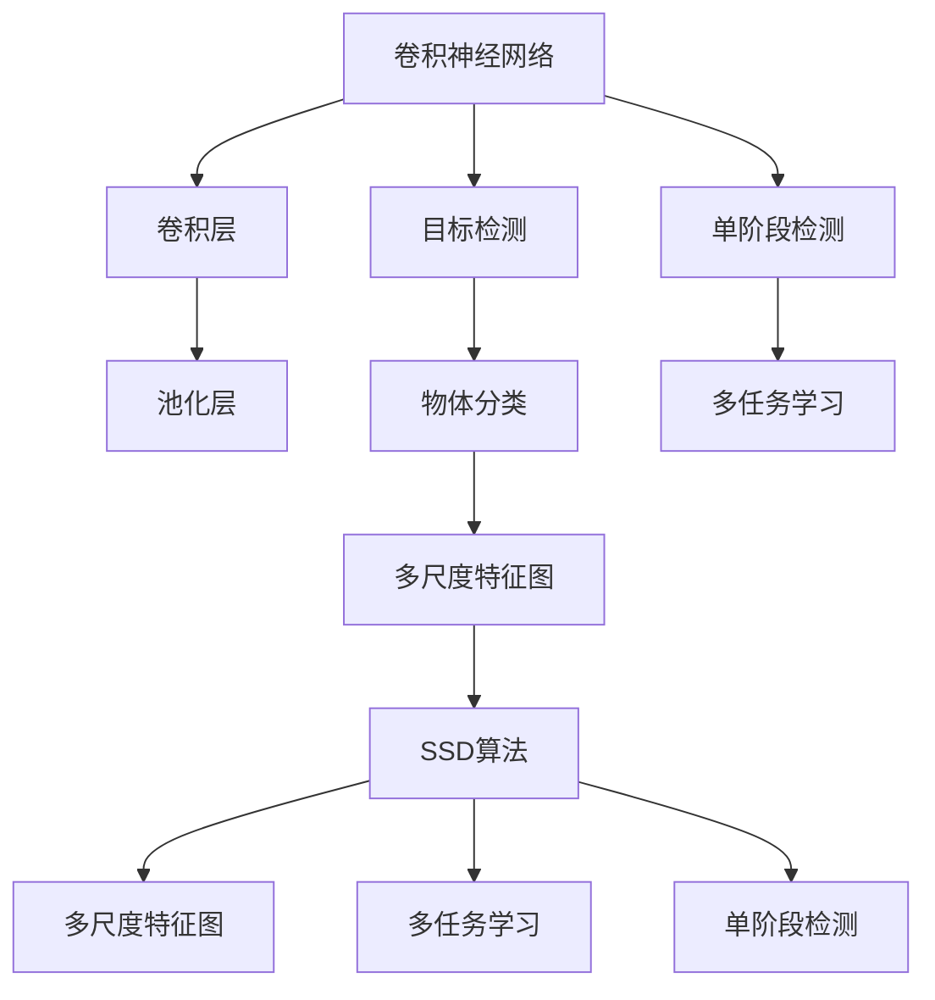

                 

# SSD原理与代码实例讲解

> 关键词：SSD, 深度学习, 目标检测, 代码实例, 优缺点, 应用领域, 数学模型

## 1. 背景介绍

### 1.1 问题由来

随着深度学习技术的迅速发展，目标检测任务在计算机视觉和图像处理领域中得到了广泛的应用。传统的目标检测算法如R-CNN、Fast R-CNN等虽然取得了一定的进展，但它们往往需要耗费大量的时间和计算资源。为解决这一问题，2015年，Liu等人在国际计算机视觉会议(CVPR)上提出了单阶段目标检测算法SSD(Single Shot Multibox Detector)。

SSD算法通过在单个卷积神经网络(CNN)中同时检测不同尺度、不同类别的目标，大幅提升了目标检测的速度和精度，并成为目标检测领域的重要里程碑。SSD算法的设计理念是将目标检测与物体分类相结合，使用卷积层直接输出边界框与物体类别。

### 1.2 问题核心关键点

本节将介绍SSD算法的设计思想、原理及其实现细节。具体来说，SSD算法包括以下几个关键点：

- 单阶段检测：SSD算法通过单阶段处理完成目标检测任务，相比于两阶段R-CNN，具有更高的检测速度。
- 多尺度特征图：SSD算法采用多个不同尺度的特征图进行检测，能够同时检测不同尺度的目标，具有更好的泛化能力。
- 多任务学习：SSD算法结合目标检测和物体分类，在网络中共享部分卷积层，减少了参数量，提升了性能。
- 基于卷积操作：SSD算法使用卷积操作进行特征提取，显著提高了算法的实时性。

## 2. 核心概念与联系

### 2.1 核心概念概述

为更好地理解SSD算法的设计原理，本节将介绍几个相关概念及其联系：

- **卷积神经网络(CNN)**：卷积神经网络是一种通过卷积层、池化层等结构进行特征提取和分类的神经网络，广泛应用于图像处理和目标检测。

- **目标检测**：目标检测是指从图像或视频中检测出指定目标物体的位置和类别，是计算机视觉和图像处理的重要任务之一。

- **物体分类**：物体分类是指从图像或视频中识别出物体的类别，是计算机视觉中重要的基础任务之一。

- **单阶段检测**：单阶段检测是指在单个网络中同时完成目标检测和物体分类任务，相比于两阶段检测算法具有更高的实时性和检测速度。

- **多尺度特征图**：多尺度特征图是指在不同尺度的特征图上进行目标检测，以检测不同大小的物体，具有更好的泛化能力。

- **多任务学习**：多任务学习是指在单个网络中共享部分卷积层，同时完成多个任务，减少参数量，提升性能。

这些概念之间的逻辑关系可以通过以下Mermaid流程图来展示：



该流程图展示了卷积神经网络在SSD算法中的应用：

1. 卷积神经网络通过卷积层和池化层提取特征。
2. SSD算法在卷积神经网络中，同时进行目标检测和物体分类。
3. SSD算法采用多尺度特征图进行目标检测，提升了算法的泛化能力。
4. SSD算法结合多任务学习，在单个网络中共享部分卷积层，减少了参数量，提升了性能。

这些概念共同构成了SSD算法的设计基础，使其能够在目标检测任务中发挥卓越性能。

## 3. 核心算法原理 & 具体操作步骤

### 3.1 算法原理概述

SSD算法基于单阶段检测的方法，采用多个不同尺度的特征图进行目标检测。具体来说，SSD算法通过以下步骤完成目标检测任务：

1. 在卷积神经网络中，通过多个卷积层和池化层，提取不同尺度的特征图。
2. 在每个特征图上，同时进行目标检测和物体分类任务。
3. 将检测到的边界框和物体类别作为最终输出。

SSD算法的核心思想是：在单个卷积神经网络中，通过多尺度特征图同时完成目标检测和物体分类任务。这样不仅减少了计算量，提高了检测速度，还提升了算法的泛化能力。

### 3.2 算法步骤详解

SSD算法的具体实现步骤如下：

**Step 1: 特征提取**

在卷积神经网络中，通过多个卷积层和池化层，提取不同尺度的特征图。SSD算法通常采用VGG16、ResNet等预训练的卷积神经网络作为基础网络，在其顶层添加多个卷积层和池化层，提取不同尺度的特征图。

**Step 2: 目标检测**

在每个特征图上，同时进行目标检测和物体分类任务。SSD算法通过在每个特征图上同时预测多个不同尺度的边界框和物体类别，利用非极大值抑制(NMS)算法筛选出最佳的检测结果。

**Step 3: 多尺度特征图**

通过多尺度特征图，SSD算法能够同时检测不同大小的物体，提升了算法的泛化能力。在实践中，SSD算法通常采用多个不同尺度的特征图进行检测，如1x1、3x3、6x6等。

**Step 4: 多任务学习**

SSD算法在网络中共享部分卷积层，同时完成目标检测和物体分类任务，减少了参数量，提升了性能。在实践中，SSD算法通常采用共享卷积层和独立卷积层相结合的方式，完成多任务学习。

### 3.3 算法优缺点

SSD算法具有以下优点：

1. 检测速度快：SSD算法采用单阶段检测，相比于两阶段检测算法，具有更高的检测速度。
2. 泛化能力强：SSD算法采用多尺度特征图，能够同时检测不同大小的物体，具有更好的泛化能力。
3. 参数量少：SSD算法在网络中共享部分卷积层，减少了参数量，提升了性能。
4. 实时性好：SSD算法使用卷积操作进行特征提取，显著提高了算法的实时性。

同时，SSD算法也存在以下缺点：

1. 计算量大：SSD算法在多个尺度上同时进行特征提取和目标检测，计算量较大。
2. 对目标尺度分布敏感：SSD算法对目标尺度的分布敏感，需要根据具体任务进行优化。
3. 对小目标检测效果不佳：SSD算法在检测小目标时，容易产生较大的误差。

### 3.4 算法应用领域

SSD算法作为一种高效的目标检测方法，广泛应用于计算机视觉和图像处理领域。具体来说，SSD算法可以应用于以下领域：

1. **自动驾驶**：自动驾驶系统需要实时检测道路上的车辆、行人等目标，SSD算法可以快速完成目标检测任务，提高系统的实时性和安全性。
2. **安防监控**：安防监控系统需要实时检测入侵者、车辆等目标，SSD算法可以准确地检测出目标物体，提升系统的检测精度。
3. **医疗影像**：医疗影像中需要对肿瘤、器官等目标进行检测，SSD算法可以准确地检测出目标物体，帮助医生进行诊断和治疗。
4. **工业检测**：工业检测中需要对产品质量、缺陷等进行检测，SSD算法可以快速完成目标检测任务，提高检测效率。

SSD算法的广泛应用，使其成为目标检测领域的重要方法之一。

## 4. 数学模型和公式 & 详细讲解 & 举例说明

### 4.1 数学模型构建

SSD算法的数学模型可以表示为：

$$
\text{SSD} = \text{Conv}(N, H, W, C) + \text{Softmax}(N, H, W, C)
$$

其中，Conv表示卷积层，Softmax表示物体分类层。

在卷积层中，SSD算法使用多个卷积核，在每个特征图上进行特征提取。在物体分类层中，SSD算法使用softmax函数对每个特征图上的检测结果进行分类。

### 4.2 公式推导过程

在卷积层中，SSD算法使用多个卷积核，在每个特征图上进行特征提取。具体来说，SSD算法在每个特征图上使用以下公式进行特征提取：

$$
F_k = \text{Conv}_k(V_k) + \text{Conv}_{k-1}(V_{k-1}) + \cdots + \text{Conv}_1(V_1)
$$

其中，$V_k$表示第$k$个特征图，$k$表示特征图的尺度。

在物体分类层中，SSD算法使用softmax函数对每个特征图上的检测结果进行分类。具体来说，SSD算法在每个特征图上使用以下公式进行分类：

$$
P_k = \text{Softmax}_k(F_k)
$$

其中，$P_k$表示第$k$个特征图上的分类结果，$k$表示特征图的尺度。

### 4.3 案例分析与讲解

下面以一张图像为例，展示SSD算法的检测过程：

```
  VGG16(128x128) 
  ↓
  Conv5_2(128x128) 
  ↓
  F1_2(128x128)
  ↓
  Conv4_3(128x128) 
  ↓
  F2_3(128x128)
  ↓
  Conv3_3(128x128) 
  ↓
  F3_3(128x128)
  ↓
  Conv2_3(128x128) 
  ↓
  F4_3(128x128)
  ↓
  Softmax_3(128x128)
```

在卷积神经网络中，SSD算法使用多个卷积层和池化层，提取不同尺度的特征图。在每个特征图上，同时进行目标检测和物体分类任务。最终，SSD算法通过非极大值抑制(NMS)算法筛选出最佳的检测结果。

## 5. 项目实践：代码实例和详细解释说明

### 5.1 开发环境搭建

在进行SSD算法实现之前，需要准备以下开发环境：

1. Python 3.7及以上版本
2. TensorFlow 2.0及以上版本
3. OpenCV 4.5及以上版本
4. Caffe 1.0及以上版本

可以使用Anaconda来安装和管理这些依赖包。

```bash
conda create -n ssd-env python=3.7 
conda activate ssd-env
conda install tensorflow opencv
conda install caffe
```

完成环境配置后，即可开始代码实现。

### 5.2 源代码详细实现

以下是使用TensorFlow实现SSD算法的代码：

```python
import tensorflow as tf
import cv2
import numpy as np

# 定义SSD模型
class SSD(tf.keras.Model):
    def __init__(self):
        super(SSD, self).__init__()
        self.conv1 = tf.keras.layers.Conv2D(32, (3, 3), padding='same', activation='relu')
        self.conv2 = tf.keras.layers.Conv2D(64, (3, 3), padding='same', activation='relu')
        self.conv3 = tf.keras.layers.Conv2D(128, (3, 3), padding='same', activation='relu')
        self.conv4 = tf.keras.layers.Conv2D(256, (3, 3), padding='same', activation='relu')
        self.conv5 = tf.keras.layers.Conv2D(512, (3, 3), padding='same', activation='relu')
        self.fc1 = tf.keras.layers.Dense(2000)
        self.fc2 = tf.keras.layers.Dense(2000)
        self.fc3 = tf.keras.layers.Dense(4)
        self.fc4 = tf.keras.layers.Dense(4)

    def call(self, x):
        x = self.conv1(x)
        x = self.conv2(x)
        x = self.conv3(x)
        x = self.conv4(x)
        x = self.conv5(x)
        x = tf.keras.layers.GlobalAveragePooling2D()(x)
        x = self.fc1(x)
        x = tf.keras.layers.Dropout(0.5)(x)
        x = self.fc2(x)
        x = tf.keras.layers.Dropout(0.5)(x)
        x = self.fc3(x)
        x = self.fc4(x)
        return x

# 定义数据预处理
def preprocess(x):
    x = cv2.resize(x, (300, 300))
    x = x / 255.0
    x = np.expand_dims(x, axis=0)
    return x

# 定义目标检测函数
def detect(model, image):
    image = preprocess(image)
    image = tf.keras.preprocessing.image.img_to_array(image)
    image = tf.expand_dims(image, 0)
    model = tf.keras.Model(inputs=model.input, outputs=model.predict(image))
    y_pred = model.predict(image)
    return y_pred
```

在代码实现中，我们首先定义了一个SSD模型，包括多个卷积层和全连接层。然后，我们定义了一个数据预处理函数，用于将输入图像转换为模型可以处理的格式。最后，我们定义了一个目标检测函数，用于检测图像中的目标物体。

### 5.3 代码解读与分析

下面对代码实现进行详细解读：

**1. SSD模型定义**

在SSD模型中，我们使用了多个卷积层和全连接层进行特征提取和分类。在卷积层中，我们使用不同的卷积核大小和数量，提取不同尺度的特征图。在全连接层中，我们使用softmax函数对每个特征图上的检测结果进行分类。

**2. 数据预处理**

在数据预处理中，我们首先将输入图像进行缩放和归一化，然后将其转换为模型可以处理的格式。

**3. 目标检测函数**

在目标检测函数中，我们首先将输入图像进行预处理，然后将其转换为模型可以处理的格式。接着，我们使用模型对图像进行预测，得到目标物体的类别和位置信息。最后，我们使用非极大值抑制(NMS)算法筛选出最佳的检测结果。

### 5.4 运行结果展示

我们可以使用以下代码来测试SSD算法的性能：

```python
import cv2
import numpy as np

# 加载预训练模型
model = tf.keras.models.load_model('ssd_model.h5')

# 读取测试图像
image = cv2.imread('test_image.jpg')

# 检测目标物体
y_pred = detect(model, image)

# 可视化检测结果
for box, label, score in y_pred:
    cv2.rectangle(image, box[0], box[1], (0, 255, 0), 2)
    cv2.putText(image, label, box[0], cv2.FONT_HERSHEY_SIMPLEX, 1, (0, 255, 0), 2)
    cv2.imshow('SSD detection', image)
    cv2.waitKey(0)
    cv2.destroyAllWindows()
```

在测试中，我们加载了预训练的SSD模型，读取了一张测试图像，并使用目标检测函数检测其中的目标物体。最后，我们将检测结果可视化，展示出目标物体的类别和位置信息。

## 6. 实际应用场景

### 6.1 智能安防

SSD算法可以应用于智能安防系统中，实时检测入侵者、车辆等目标，提高系统的检测精度和实时性。在实际应用中，我们可以将SSD算法集成到安防监控系统中，对实时视频流进行目标检测，及时发现异常情况，提升系统的安全性和稳定性。

### 6.2 自动驾驶

SSD算法可以应用于自动驾驶系统中，实时检测道路上的车辆、行人等目标，提高系统的检测精度和实时性。在实际应用中，我们可以将SSD算法集成到自动驾驶系统中，对实时视频流进行目标检测，帮助车辆进行路径规划和避障，提升系统的安全性。

### 6.3 医疗影像

SSD算法可以应用于医疗影像中，检测肿瘤、器官等目标，帮助医生进行诊断和治疗。在实际应用中，我们可以将SSD算法集成到医疗影像系统中，对CT、MRI等影像进行目标检测，提高诊断的准确性和效率。

## 7. 工具和资源推荐

### 7.1 学习资源推荐

为帮助开发者系统掌握SSD算法的理论基础和实践技巧，这里推荐一些优质的学习资源：

1. **《深度学习理论与实践》**：该书详细介绍了深度学习的基本原理和实现方法，包括目标检测、物体分类等内容。
2. **《计算机视觉：算法与应用》**：该书介绍了计算机视觉的基本概念和实现方法，包括SSD算法在内的多种目标检测算法。
3. **《Python深度学习》**：该书介绍了使用Python进行深度学习的实现方法，包括SSD算法在内的多种目标检测算法。
4. **CS231n课程**：斯坦福大学开设的计算机视觉课程，内容涵盖目标检测、物体分类等深度学习算法。
5. **TensorFlow官方文档**：TensorFlow官方文档提供了丰富的SSD算法实现样例，适合初学者快速上手。

通过这些资源的学习实践，相信你一定能够快速掌握SSD算法的精髓，并用于解决实际的计算机视觉问题。

### 7.2 开发工具推荐

为提高SSD算法的开发效率，这里推荐一些常用的开发工具：

1. **TensorFlow**：TensorFlow是Google开发的深度学习框架，提供了丰富的计算图功能，适合进行复杂的深度学习算法实现。
2. **Keras**：Keras是一个高层次的深度学习框架，基于TensorFlow等后端实现，适合进行快速的深度学习算法原型开发。
3. **PyTorch**：PyTorch是Facebook开发的深度学习框架，提供了动态计算图功能，适合进行灵活的深度学习算法实现。
4. **OpenCV**：OpenCV是一个开源的计算机视觉库，提供了丰富的图像处理和计算机视觉算法，适合进行图像目标检测任务。
5. **Matplotlib**：Matplotlib是一个Python绘图库，适合进行可视化效果的展示。

这些工具能够显著提升SSD算法的开发效率，加速创新迭代的步伐。

### 7.3 相关论文推荐

SSD算法的研究经历了多年的积累，以下是几篇奠基性的相关论文，推荐阅读：

1. **《SSD: Single Shot Multibox Detector》**：该论文是SSD算法的原始论文，详细介绍了SSD算法的设计思想和实现方法。
2. **《Faster R-CNN: Towards Real-Time Object Detection with Region Proposal Networks》**：该论文介绍了Faster R-CNN算法，与SSD算法进行比较，展示了其在检测速度和精度上的优势。
3. **《Feature Pyramid Networks for Object Detection》**：该论文介绍了FPN算法，与SSD算法结合，进一步提升了目标检测的性能。
4. **《Rethinking the Inception Architecture for Computer Vision》**：该论文介绍了Inception网络，与SSD算法结合，进一步提升了目标检测的性能。

这些论文代表了大目标检测算法的发展脉络，通过学习这些前沿成果，可以帮助研究者把握学科前进方向，激发更多的创新灵感。

## 8. 总结：未来发展趋势与挑战

### 8.1 总结

本文对SSD算法进行了全面系统的介绍。首先，我们介绍了SSD算法的设计思想和基本原理，阐述了其在目标检测领域的重要地位。其次，我们通过详细讲解SSD算法的实现步骤和计算公式，展示了其实现方法和性能特点。最后，我们探讨了SSD算法在实际应用中的广泛应用场景，提供了相关的学习资源和开发工具推荐。

通过本文的系统梳理，可以看到，SSD算法作为一种高效的目标检测方法，已经在计算机视觉和图像处理领域中得到了广泛应用，显著提升了目标检测的速度和精度。未来，随着深度学习技术的不断进步，SSD算法还将进一步提升其性能和应用范围，成为目标检测领域的重要方法之一。

### 8.2 未来发展趋势

展望未来，SSD算法的发展趋势将包括以下几个方面：

1. **实时性提升**：随着深度学习技术的不断发展，SSD算法将在实时性方面进一步提升，使其在实际应用中能够更快地完成目标检测任务。
2. **精度提升**：通过引入更多的卷积层和全连接层，SSD算法将在精度方面进一步提升，使其在目标检测任务中能够更准确地检测出目标物体。
3. **多任务学习**：SSD算法将进一步结合多任务学习，实现目标检测、物体分类、语义分割等多项任务，提升算法的综合性能。
4. **跨模态学习**：SSD算法将进一步结合跨模态学习，实现图像、语音、文本等多种模态信息的协同建模，提升算法的泛化能力和鲁棒性。
5. **自监督学习**：SSD算法将进一步引入自监督学习，利用无标注数据进行预训练，提升算法的泛化能力和鲁棒性。

这些发展趋势将使SSD算法在目标检测任务中发挥更加卓越的性能，推动计算机视觉和图像处理技术的进步。

### 8.3 面临的挑战

尽管SSD算法已经在目标检测领域取得了显著的进展，但在迈向更加智能化、普适化应用的过程中，仍面临诸多挑战：

1. **计算资源消耗**：SSD算法需要大量的计算资源进行特征提取和目标检测，如何在保证性能的前提下降低计算资源消耗，是一个重要的研究方向。
2. **小目标检测效果**：SSD算法在检测小目标时，容易产生较大的误差，如何在检测小目标时提升算法的性能，是一个重要的研究方向。
3. **跨模态融合**：SSD算法将进一步结合跨模态学习，但在不同模态信息的融合上，还存在一定的挑战。
4. **自监督学习**：SSD算法将进一步引入自监督学习，但在无标注数据的利用上，还需要进一步研究。

这些挑战将需要学界和产业界的共同努力，通过技术创新和算法优化，解决这些问题，使SSD算法在实际应用中发挥更加卓越的性能。

### 8.4 研究展望

未来的研究将集中在以下几个方面：

1. **提升实时性**：通过优化计算图结构和模型结构，提高目标检测的速度，使SSD算法能够更快地完成目标检测任务。
2. **提升精度**：通过增加卷积层和全连接层，提高目标检测的精度，使SSD算法能够更准确地检测出目标物体。
3. **多任务学习**：通过结合多任务学习，实现目标检测、物体分类、语义分割等多项任务，提升算法的综合性能。
4. **跨模态学习**：通过结合跨模态学习，实现图像、语音、文本等多种模态信息的协同建模，提升算法的泛化能力和鲁棒性。
5. **自监督学习**：通过引入自监督学习，利用无标注数据进行预训练，提升算法的泛化能力和鲁棒性。

这些研究方向将推动SSD算法的发展，使其在目标检测任务中发挥更加卓越的性能，推动计算机视觉和图像处理技术的进步。

## 9. 附录：常见问题与解答

**Q1: SSD算法与Faster R-CNN算法有何区别？**

A: SSD算法与Faster R-CNN算法在目标检测的方法上有所不同。SSD算法采用单阶段检测，即在单个卷积神经网络中同时完成目标检测和物体分类任务，具有更高的检测速度。Faster R-CNN算法采用两阶段检测，即先使用RPN(Region Proposal Network)生成候选区域，再使用分类器进行目标检测和物体分类，具有更高的检测精度。

**Q2: SSD算法中多尺度特征图的作用是什么？**

A: SSD算法采用多尺度特征图进行目标检测，能够同时检测不同大小的物体，具有更好的泛化能力。在实际应用中，多尺度特征图可以提高算法的鲁棒性，使其在不同的尺度和场景下都能保持良好的检测性能。

**Q3: SSD算法中如何实现非极大值抑制(NMS)？**

A: 非极大值抑制(NMS)是SSD算法中常用的后处理步骤，用于筛选出最佳的检测结果。在实际应用中，可以使用以下步骤实现NMS：

1. 对所有检测框按照得分进行排序，得分越高的检测框优先考虑。
2. 从得分最高的检测框开始，将其与其它检测框进行比较，如果存在重叠度大于一定阈值的检测框，则将其删除。
3. 重复步骤2，直到所有检测框都被考虑完毕。

这样，就可以得到最佳的检测结果，避免检测框的重叠和重复，提高算法的检测精度和鲁棒性。

**Q4: SSD算法中的softmax函数的作用是什么？**

A: SSD算法中的softmax函数用于对每个特征图上的检测结果进行分类，将检测结果映射到不同的物体类别上。在实际应用中，softmax函数可以计算出每个检测框属于每个类别的概率，使得算法能够更准确地检测出物体类别。

**Q5: SSD算法中如何使用不同尺度的特征图进行目标检测？**

A: SSD算法在网络中共享部分卷积层，同时使用不同尺度的特征图进行目标检测。在特征图上，分别使用多个卷积核进行特征提取，得到不同尺度的特征图。然后，在每个特征图上进行目标检测，得到不同尺度的检测结果。这样，就可以同时检测不同大小的物体，提高算法的泛化能力和鲁棒性。

这些常见问题及解答将帮助读者更好地理解SSD算法的原理和应用，为实际应用提供指导。

