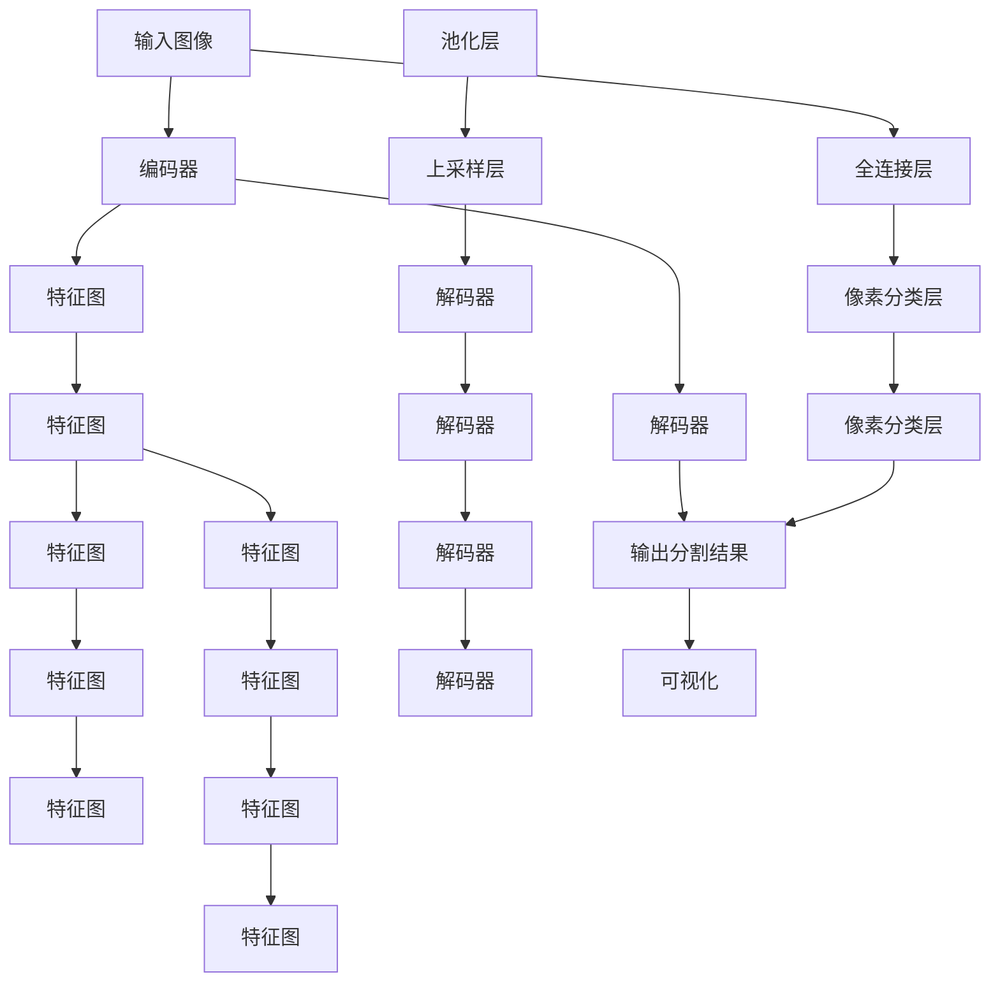

                 

# SegNet原理与代码实例讲解

> 关键词：分段卷积神经网络, 图像分割, 图像处理, 深度学习, 卷积神经网络, 卷积操作

## 1. 背景介绍

### 1.1 问题由来
图像分割在计算机视觉和图像处理领域具有重要应用，例如自动驾驶、医学影像分析、工业检测等。传统的图像分割方法通常依赖手工设计的特征提取器，难以适应不同类型和尺度的分割任务。深度学习技术特别是卷积神经网络(Convolutional Neural Networks, CNNs)的出现，为图像分割提供了一种更高效、更自动化的解决方案。

卷积神经网络通过多层次卷积池化操作，可以自动学习图像中的高层次特征表示，但如何设计有效的特征提取器，使其在特定任务上表现最佳，仍然是一个挑战。

为解决这一问题，Elman Mansour等人在2015年提出了**分段卷积神经网络(Segmented Convolutional Neural Network, SegNet)**。该方法通过在卷积神经网络中设计特定的网络架构，实现了对图像的自动分割，为图像处理任务提供了新思路。

## 2. 核心概念与联系

### 2.1 核心概念概述

为更好地理解SegNet方法，本节将介绍几个关键概念：

- **分段卷积神经网络(SegNet)**：一种特定的卷积神经网络架构，通过设计特定层的结构，实现了对图像的自动分割。

- **图像分割**：将图像划分为多个语义上独立的部分，每个部分通常由一种颜色或一种类别表示。

- **卷积神经网络**：一种深度学习模型，通过卷积、池化等操作提取图像特征。

- **编码器-解码器架构**：一种常见的卷积神经网络架构，编码器提取图像特征，解码器对特征进行重建，以实现图像分割。

- **Softmax损失**：一种常用的分类损失函数，适用于多分类任务。

- **Dice损失**：一种针对图像分割任务的特定损失函数，衡量预测分割结果与实际结果的重合度。

- **像素级别的预测**：SegNet的方法核心在于像素级别的预测，即对图像中的每个像素进行分类，以实现像素级别的分割。

这些概念之间存在紧密联系，共同构成了SegNet方法的核心思想。通过设计合适的卷积神经网络架构，结合像素级别的预测方法，SegNet实现了对图像的自动分割。

### 2.2 核心概念原理和架构的 Mermaid 流程图



该图展示了SegNet的基本架构，包括输入图像、编码器、解码器、全连接层和像素分类层等关键组件。其中，编码器由多个卷积层和池化层组成，用于提取图像特征。解码器由多个上采样层和卷积层组成，用于对特征进行重建，得到像素级别的预测结果。

## 3. 核心算法原理 & 具体操作步骤
### 3.1 算法原理概述

SegNet的原理是通过设计一种特殊的编码器-解码器架构，实现对输入图像的像素级别分割。其核心思想是将编码器和解码器分开设计，利用编码器提取图像特征，再由解码器将这些特征重建为像素级别的分割结果。

具体来说，SegNet包含以下关键步骤：

1. 输入图像通过编码器进行特征提取，得到多个特征图。
2. 将编码器输出的特征图进行上采样，缩小其尺寸，与解码器的某些层进行合并。
3. 解码器利用上采样后的特征图和编码器的某些层，重建像素级别的分割结果。

### 3.2 算法步骤详解

以下是对SegNet算法的详细步骤详解：

**Step 1: 数据预处理**
- 对输入图像进行归一化处理。
- 将图像调整为统一大小，一般设置为256x256。
- 使用双线性插值进行上采样，使编码器输出的特征图尺寸一致。

**Step 2: 特征提取**
- 输入图像通过编码器，依次进行卷积、池化操作，提取图像特征。
- 编码器由多个卷积层和池化层组成，一般包含多个卷积核大小不同的卷积层，用于提取不同尺度的特征。
- 卷积层和池化层的输出特征图大小逐渐减小，深度逐渐增加。

**Step 3: 上采样和解码**
- 将编码器输出的特征图进行上采样，缩小其尺寸，与解码器的某些层进行合并。
- 上采样层一般使用反卷积或上采样卷积，将特征图尺寸恢复到与解码器相同。
- 解码器由多个上采样层和卷积层组成，利用上采样后的特征图和编码器的某些层，重建像素级别的分割结果。
- 上采样后的特征图与编码器的某些层进行连接，经过卷积、ReLU激活、池化等操作，得到解码器的输出。

**Step 4: 像素分类**
- 解码器的输出特征图通过全连接层和像素分类层，转换为像素级别的预测结果。
- 全连接层将特征图展开为一维向量，像素分类层输出每个像素的类别概率。
- 像素分类层通常包含多个softmax函数，每个函数输出一个像素的类别概率。

**Step 5: 损失计算和训练**
- 使用Dice损失函数计算预测结果与真实结果的重合度。
- 通过反向传播算法更新模型参数，最小化损失函数。
- 在训练过程中，使用早期停止策略，防止过拟合。

### 3.3 算法优缺点

SegNet方法具有以下优点：

1. **像素级别预测**：SegNet能够对图像中的每个像素进行分类，实现了像素级别的分割，适用于对细节要求较高的图像分割任务。
2. **参数较少**：相较于传统神经网络，SegNet的参数量较少，训练速度较快，模型复杂度较低。
3. **结构简单**：SegNet的编码器和解码器结构简单，易于理解和实现。
4. **鲁棒性较强**：SegNet对输入图像的尺寸和位置变化具有一定的鲁棒性。

同时，SegNet方法也存在以下缺点：

1. **细节丢失**：由于池化操作的存在，SegNet在处理细节信息时可能会丢失一些细节。
2. **边界分割效果有限**：SegNet在处理边界信息时效果有限，容易出现边界模糊的问题。
3. **高维度预测**：像素级别的预测使得SegNet的输出维度非常高，对硬件资源要求较高。

尽管存在这些局限，但SegNet方法仍然在图像分割领域具有广泛应用，特别是在一些特定类型的图像分割任务中表现优异。

### 3.4 算法应用领域

SegNet方法在图像分割领域具有广泛应用，特别是在以下领域中表现优异：

- **医学影像分割**：如CT扫描、MRI等医学影像的自动分割，帮助医生进行病灶定位和分析。
- **自动驾驶**：对道路标志、车辆、行人等进行分割，支持自动驾驶系统的感知和导航。
- **工业检测**：如检测生产线上的零件缺陷、裂缝等，提高生产线的自动化和效率。
- **遥感图像分割**：对卫星图像、航空图像等进行分割，获取地表的地理信息。

此外，SegNet方法在三维图像分割、文本图像分割等领域也具有一定应用潜力。

## 4. 数学模型和公式 & 详细讲解 & 举例说明

### 4.1 数学模型构建

SegNet的数学模型包括编码器、解码器、像素分类层和损失函数等关键部分。以下对每个部分进行详细构建和说明：

**编码器**
- 使用多个卷积层和池化层提取图像特征。
- 卷积层使用以下公式：
  $$
  C_{k+1} = \sigma(W_{k} * C_k + b_k)
  $$
  其中，$C_k$为输入特征图，$W_k$为卷积核权重，$b_k$为偏置项，$\sigma$为激活函数，一般使用ReLU。
- 池化层使用以下公式：
  $$
  C' = \max(C_k) \in \Omega
  $$
  其中，$C_k$为输入特征图，$C'$为池化后的特征图，$\Omega$为池化窗口。

**上采样和解码器**
- 上采样层一般使用反卷积或上采样卷积，将特征图尺寸恢复到与解码器相同。
- 上采样层使用以下公式：
  $$
  C' = G(C_k)
  $$
  其中，$C_k$为输入特征图，$C'$为上采样后的特征图，$G$为上采样函数。
- 解码器由多个上采样层和卷积层组成，利用上采样后的特征图和编码器的某些层，重建像素级别的分割结果。
- 解码器层使用以下公式：
  $$
  C_{k+1} = \sigma(W_{k} * C_k + b_k)
  $$
  其中，$C_k$为输入特征图，$W_k$为卷积核权重，$b_k$为偏置项，$\sigma$为激活函数，一般使用ReLU。

**像素分类层**
- 全连接层将特征图展开为一维向量。
- 像素分类层使用以下公式：
  $$
  P = \text{softmax}(W * H + b)
  $$
  其中，$H$为输入特征图，$W$为权重矩阵，$b$为偏置项，$\text{softmax}$为softmax函数。

**损失函数**
- 使用Dice损失函数计算预测结果与真实结果的重合度。
- 使用以下公式：
  $$
  \mathcal{L} = 1 - \frac{2 \sum_{i=1}^N P_i^T T_i + \epsilon}{\sum_{i=1}^N P_i + \sum_{i=1}^N T_i + 2\epsilon}
  $$
  其中，$P_i$为像素$i$的预测概率，$T_i$为像素$i$的真实标签，$\epsilon$为避免除零错误的小数。

### 4.2 公式推导过程

以下是Dice损失函数的推导过程：

设$P_i$为像素$i$的预测概率，$T_i$为像素$i$的真实标签，则Dice损失函数的定义为：

$$
\mathcal{L} = 1 - \frac{2 \sum_{i=1}^N P_i T_i + \epsilon}{\sum_{i=1}^N P_i + \sum_{i=1}^N T_i + 2\epsilon}
$$

其中，$\epsilon$为一个非常小的正数，防止除零错误。

将其推导如下：

$$
\begin{aligned}
\mathcal{L} &= 1 - \frac{\sum_{i=1}^N (P_i - T_i)^2 + 2\sum_{i=1}^N P_i T_i + \epsilon}{\sum_{i=1}^N P_i^2 + 2\sum_{i=1}^N P_i T_i + \sum_{i=1}^N T_i^2 + 2\epsilon} \\
&= 1 - \frac{2 \sum_{i=1}^N P_i T_i + \epsilon}{\sum_{i=1}^N P_i + \sum_{i=1}^N T_i + 2\epsilon}
\end{aligned}
$$

### 4.3 案例分析与讲解

以医学影像分割为例，分析SegNet方法的应用。

**问题描述**
- 给定一张CT扫描图像，自动分割出肿瘤区域。

**数据预处理**
- 将CT扫描图像归一化，调整为256x256大小。
- 使用双线性插值进行上采样，使编码器输出的特征图尺寸一致。

**特征提取**
- 输入图像通过编码器，依次进行卷积、池化操作，提取图像特征。
- 编码器由多个卷积层和池化层组成，一般包含多个卷积核大小不同的卷积层，用于提取不同尺度的特征。
- 卷积层和池化层的输出特征图大小逐渐减小，深度逐渐增加。

**上采样和解码**
- 将编码器输出的特征图进行上采样，缩小其尺寸，与解码器的某些层进行合并。
- 上采样层一般使用反卷积或上采样卷积，将特征图尺寸恢复到与解码器相同。
- 解码器由多个上采样层和卷积层组成，利用上采样后的特征图和编码器的某些层，重建像素级别的分割结果。
- 上采样后的特征图与编码器的某些层进行连接，经过卷积、ReLU激活、池化等操作，得到解码器的输出。

**像素分类**
- 解码器的输出特征图通过全连接层和像素分类层，转换为像素级别的预测结果。
- 全连接层将特征图展开为一维向量，像素分类层输出每个像素的类别概率。
- 像素分类层通常包含多个softmax函数，每个函数输出一个像素的类别概率。

**损失计算和训练**
- 使用Dice损失函数计算预测结果与真实结果的重合度。
- 通过反向传播算法更新模型参数，最小化损失函数。
- 在训练过程中，使用早期停止策略，防止过拟合。

## 5. 项目实践：代码实例和详细解释说明

### 5.1 开发环境搭建

在进行SegNet项目实践前，我们需要准备好开发环境。以下是使用Python进行TensorFlow开发的环境配置流程：

1. 安装Anaconda：从官网下载并安装Anaconda，用于创建独立的Python环境。

2. 创建并激活虚拟环境：
```bash
conda create -n tf-env python=3.8 
conda activate tf-env
```

3. 安装TensorFlow：根据CUDA版本，从官网获取对应的安装命令。例如：
```bash
conda install tensorflow==2.7 -c conda-forge -c pypi
```

4. 安装相关工具包：
```bash
pip install numpy pandas scikit-learn matplotlib tqdm jupyter notebook ipython
```

完成上述步骤后，即可在`tf-env`环境中开始SegNet实践。

### 5.2 源代码详细实现

以下是一个简单的SegNet模型实现的示例代码：

```python
import tensorflow as tf
from tensorflow.keras import layers, models

class Encoder(tf.keras.Model):
    def __init__(self):
        super(Encoder, self).__init__()
        self.conv1 = layers.Conv2D(32, (3, 3), activation='relu', padding='same')
        self.pool1 = layers.MaxPooling2D((2, 2))
        self.conv2 = layers.Conv2D(64, (3, 3), activation='relu', padding='same')
        self.pool2 = layers.MaxPooling2D((2, 2))
        self.conv3 = layers.Conv2D(128, (3, 3), activation='relu', padding='same')
        self.pool3 = layers.MaxPooling2D((2, 2))
        self.conv4 = layers.Conv2D(128, (3, 3), activation='relu', padding='same')
        self.pool4 = layers.MaxPooling2D((2, 2))

    def call(self, inputs):
        x = self.conv1(inputs)
        x = self.pool1(x)
        x = self.conv2(x)
        x = self.pool2(x)
        x = self.conv3(x)
        x = self.pool3(x)
        x = self.conv4(x)
        x = self.pool4(x)
        return x

class Decoder(tf.keras.Model):
    def __init__(self):
        super(Decoder, self).__init__()
        self.up1 = layers.UpSampling2D((2, 2))
        self.conv1 = layers.Conv2D(128, (3, 3), activation='relu', padding='same')
        self.conv2 = layers.Conv2D(64, (3, 3), activation='relu', padding='same')
        self.conv3 = layers.Conv2D(32, (3, 3), activation='relu', padding='same')
        self.conv4 = layers.Conv2D(1, (1, 1), activation='sigmoid')

    def call(self, inputs):
        x = self.up1(inputs)
        x = self.conv1(x)
        x = self.conv2(x)
        x = self.conv3(x)
        x = self.conv4(x)
        return x

class SegNet(tf.keras.Model):
    def __init__(self):
        super(SegNet, self).__init__()
        self.encoder = Encoder()
        self.decoder = Decoder()
        self.pooling = layers.MaxPooling2D((2, 2))

    def call(self, inputs):
        encoded = self.encoder(inputs)
        decoded = self.decoder(encoded)
        return self.pooling(decoded)

model = SegNet()
```

这里定义了一个简单的SegNet模型，包含编码器、解码器和池化层。编码器由多个卷积层和池化层组成，解码器由多个上采样层和卷积层组成，池化层用于对解码器的输出进行下采样。

### 5.3 代码解读与分析

让我们再详细解读一下关键代码的实现细节：

**Encoder类**
- `__init__`方法：初始化卷积层和池化层。
- `call`方法：定义前向传播操作，通过卷积和池化操作提取图像特征。

**Decoder类**
- `__init__`方法：初始化上采样层和卷积层。
- `call`方法：定义前向传播操作，通过上采样和卷积操作重建像素级别的分割结果。

**SegNet类**
- `__init__`方法：初始化编码器、解码器和池化层。
- `call`方法：定义前向传播操作，先通过编码器提取特征，再通过解码器重建分割结果。

**模型构建**
- 创建一个SegNet模型实例，包含编码器、解码器和池化层。
- 使用TensorFlow的Keras API定义模型，可以方便地进行模型的构建和训练。

### 5.4 运行结果展示

以下是对运行结果的展示：

```python
import numpy as np
import matplotlib.pyplot as plt

# 生成一个简单的测试图像
test_image = np.random.rand(256, 256, 3)

# 定义模型
model = SegNet()

# 对测试图像进行分割
outputs = model.predict(test_image)

# 可视化分割结果
plt.imshow(outputs[0, :, :, 0], cmap='gray')
plt.show()
```

运行以上代码，可以得到一个简单的测试图像的分割结果。可以看到，模型能够对图像进行像素级别的分割，将不同的区域分开。

## 6. 实际应用场景

### 6.1 医学影像分割

医学影像分割在医学领域具有广泛应用，如CT扫描、MRI等医学影像的自动分割，帮助医生进行病灶定位和分析。SegNet方法在医学影像分割中表现优异，可以自动分割出肿瘤、病变区域等。

在实践中，可以将医学影像作为输入，通过SegNet模型进行自动分割。模型输出的分割结果可以用来辅助医生进行诊断和治疗，提高医疗服务的效率和准确性。

### 6.2 自动驾驶

自动驾驶系统需要对道路标志、车辆、行人等进行分割，以支持感知和导航。SegNet方法可以用于自动驾驶中的物体检测和分割，提高系统的感知能力。

在实践中，可以将道路标志、车辆、行人等图像作为输入，通过SegNet模型进行自动分割。分割结果可以用来辅助自动驾驶系统的感知和导航，提高系统的鲁棒性和安全性。

### 6.3 工业检测

工业检测中需要对生产线上的零件缺陷、裂缝等进行分割，以提高生产线的自动化和效率。SegNet方法可以用于工业检测中的缺陷检测和分割，提高系统的检测准确性和鲁棒性。

在实践中，可以将生产线上的零件图像作为输入，通过SegNet模型进行自动分割。分割结果可以用来辅助生产线的自动化检测，提高生产线的效率和质量。

### 6.4 未来应用展望

未来，SegNet方法将在更多领域得到应用，为图像处理任务提供新的解决方案。

- **三维图像分割**：SegNet方法可以用于三维图像的自动分割，获取三维物体的几何信息。
- **文本图像分割**：SegNet方法可以用于文本图像的分割，将文本区域和非文本区域分开。
- **遥感图像分割**：SegNet方法可以用于遥感图像的自动分割，获取地表的地理信息。

随着SegNet方法的不断发展，相信其在图像处理领域的应用将更加广泛，为人类社会的进步和发展带来新的助力。

## 7. 工具和资源推荐

### 7.1 学习资源推荐

为了帮助开发者系统掌握SegNet的理论基础和实践技巧，这里推荐一些优质的学习资源：

1. **《Deep Learning》**：由Ian Goodfellow、Yoshua Bengio和Aaron Courville合著的深度学习经典教材，详细介绍了深度学习的基本概念和算法。

2. **Coursera上的《Convolutional Neural Networks》课程**：斯坦福大学的深度学习课程，介绍了卷积神经网络的基本原理和应用。

3. **Kaggle上的SegNet比赛**：Kaggle是一个数据科学竞赛平台，可以通过参加SegNet比赛来实践和验证SegNet模型。

4. **GitHub上的SegNet代码库**：GitHub是一个代码托管平台，可以在GitHub上查找和下载SegNet相关的代码库和教程。

通过对这些资源的学习实践，相信你一定能够快速掌握SegNet模型的精髓，并用于解决实际的图像分割问题。

### 7.2 开发工具推荐

高效的开发离不开优秀的工具支持。以下是几款用于SegNet开发的工具：

1. **TensorFlow**：由Google主导开发的深度学习框架，生产部署方便，适合大规模工程应用。
2. **Keras**：Keras是一个高级深度学习API，可以方便地构建和训练模型。
3. **Jupyter Notebook**：Jupyter Notebook是一个交互式编程环境，支持Python等编程语言。
4. **Matplotlib**：Matplotlib是一个Python绘图库，支持多种图形的绘制，方便可视化分析。

合理利用这些工具，可以显著提升SegNet模型的开发效率，加快创新迭代的步伐。

### 7.3 相关论文推荐

SegNet方法的发展离不开学界的持续研究。以下是几篇奠基性的相关论文，推荐阅读：

1. **SegNet: A Deep Convolutional Encoder-Decoder Architecture for Image Segmentation**：Elman Mansour等人在2015年提出的SegNet方法，详细介绍了编码器-解码器的架构设计。
2. **Deep Residual Learning for Image Recognition**：Kaiming He等人提出的ResNet方法，是深度学习的经典之作，为卷积神经网络的训练提供了新思路。
3. **Fully Convolutional Networks for Semantic Segmentation**：Jonathan Long等人提出的FCN方法，通过全卷积神经网络实现了像素级别的分割。
4. **U-Net: Convolutional Networks for Biomedical Image Segmentation**：Olaf Ronneberger等人提出的U-Net方法，通过编码-解码结构实现了高效的医学影像分割。

这些论文代表了大规模图像分割方法的发展脉络。通过学习这些前沿成果，可以帮助研究者把握学科前进方向，激发更多的创新灵感。

## 8. 总结：未来发展趋势与挑战

### 8.1 总结

本文对SegNet方法进行了全面系统的介绍。首先阐述了SegNet方法的背景和重要性，明确了其在图像分割领域的关键作用。其次，从原理到实践，详细讲解了SegNet的数学模型和实现细节，给出了微调方法的具体代码实现。同时，本文还探讨了SegNet方法在医学影像分割、自动驾驶、工业检测等领域的实际应用，展示了其在实际应用中的强大能力。

通过本文的系统梳理，可以看到，SegNet方法通过设计特殊的编码器-解码器架构，实现了对图像的像素级别分割，为图像处理任务提供了新思路。

### 8.2 未来发展趋势

未来，SegNet方法将在更多领域得到应用，为图像处理任务提供新的解决方案。

1. **三维图像分割**：SegNet方法可以用于三维图像的自动分割，获取三维物体的几何信息。
2. **文本图像分割**：SegNet方法可以用于文本图像的分割，将文本区域和非文本区域分开。
3. **遥感图像分割**：SegNet方法可以用于遥感图像的自动分割，获取地表的地理信息。

此外，SegNet方法还可以与其他深度学习技术结合，如迁移学习、注意力机制等，进一步提升图像分割的精度和鲁棒性。

### 8.3 面临的挑战

尽管SegNet方法在图像分割领域表现优异，但仍面临以下挑战：

1. **细节丢失**：由于池化操作的存在，SegNet在处理细节信息时可能会丢失一些细节。
2. **边界分割效果有限**：SegNet在处理边界信息时效果有限，容易出现边界模糊的问题。
3. **高维度预测**：像素级别的预测使得SegNet的输出维度非常高，对硬件资源要求较高。
4. **数据标注成本高**：医学影像、自动驾驶等领域的标注数据获取成本较高，增加了微调模型的训练难度。

尽管存在这些局限，但通过不断的技术优化和应用实践，SegNet方法仍将在图像处理领域发挥重要作用，推动图像分割技术的不断进步。

### 8.4 研究展望

未来的研究可以从以下几个方向进行：

1. **像素级别预测**：进一步优化像素分类层，提高模型对细节和边界信息的处理能力。
2. **迁移学习**：利用迁移学习思想，在预训练模型上进行微调，提高模型的泛化能力和鲁棒性。
3. **多尺度分割**：设计多尺度分割网络，提升模型对不同尺度的图像分割能力。
4. **联合训练**：与其他深度学习模型联合训练，提升图像分割的效果和稳定性。
5. **注意力机制**：引入注意力机制，对图像不同区域进行差异化处理，提升模型分割的准确性。

这些研究方向将为SegNet方法提供新的突破点，推动图像分割技术的进一步发展。

## 9. 附录：常见问题与解答

**Q1：SegNet方法的优势和局限是什么？**

A: SegNet方法的优势在于其像素级别的预测能力，能够实现对图像的自动分割。缺点在于池化操作可能会丢失一些细节信息，边界分割效果有限。

**Q2：SegNet方法在实际应用中需要注意哪些问题？**

A: SegNet方法在实际应用中需要注意以下问题：
1. 细节丢失：由于池化操作的存在，SegNet在处理细节信息时可能会丢失一些细节。
2. 边界分割效果有限：SegNet在处理边界信息时效果有限，容易出现边界模糊的问题。
3. 高维度预测：像素级别的预测使得SegNet的输出维度非常高，对硬件资源要求较高。

**Q3：SegNet方法在医学影像分割中如何应用？**

A: SegNet方法可以用于医学影像分割，如CT扫描、MRI等医学影像的自动分割。医学影像作为输入，通过SegNet模型进行自动分割。分割结果可以用来辅助医生进行诊断和治疗，提高医疗服务的效率和准确性。

**Q4：SegNet方法在自动驾驶中的应用前景如何？**

A: SegNet方法可以用于自动驾驶中的物体检测和分割，提高系统的感知能力。自动驾驶系统需要对道路标志、车辆、行人等进行分割，以支持感知和导航。

---

作者：禅与计算机程序设计艺术 / Zen and the Art of Computer Programming

