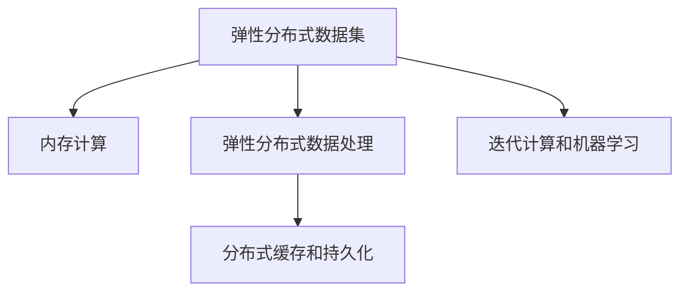

                 

# Spark原理与代码实例讲解

> 关键词：Spark, 分布式计算, 内存计算, RDD, 弹性分布式数据集(EDC), 分布式数据处理, 大数据

## 1. 背景介绍

### 1.1 问题由来

在当今数据爆炸的时代，单台计算机已经难以处理大规模的数据集。传统的数据处理方式，如顺序批处理，往往无法满足实时性和扩展性的需求。Spark作为新一代分布式计算框架，以其高效内存计算和灵活的API设计，迅速成为了处理大规模数据的首选工具。

然而，Spark的原理和设计思想较为复杂，对于新入门的开发者来说，理解起来并不容易。本文旨在通过深入浅出的语言，详细讲解Spark的核心原理和代码实现，帮助读者掌握Spark的精髓。

### 1.2 问题核心关键点

Spark的核心概念包括弹性分布式数据集(RDD)、内存计算、基于DAG的优化等。Spark通过将计算任务分解成多个小任务，分布式并行计算，同时将数据缓存在内存中，大幅提高了数据处理的效率。Spark的弹性调度、动态资源管理、丰富的API设计等特性，使得其在各种大数据应用场景中都能够高效运行。

Spark的广泛应用包括数据仓库、大数据分析、机器学习、图处理等多个领域。通过Spark，大数据分析变得更加简单高效，数据科学家和工程师可以更加专注于算法设计和业务理解。

### 1.3 问题研究意义

掌握Spark原理和代码实现，对于提高数据处理能力，加速大数据应用开发，具有重要意义：

1. 提高数据处理效率。Spark通过内存计算和优化技术，大大提高了数据处理的效率，可以显著降低数据处理的时间成本。
2. 拓展数据处理能力。Spark的弹性扩展性，使得大数据处理不再受限于计算资源，能够处理更大规模的数据集。
3. 提升数据分析能力。Spark提供了丰富的API，支持多种数据处理模式，如批处理、流处理、图处理等，能够满足不同类型的数据分析需求。
4. 促进大数据技术应用。Spark是大数据处理的核心工具之一，掌握Spark技术，可以更好地与其他大数据技术进行集成，推动大数据应用在各个行业的落地。
5. 加快技术学习与创新。Spark作为大数据领域的明星技术，其丰富的特性和广泛的应用，为技术学习与创新提供了广阔空间。

## 2. 核心概念与联系

### 2.1 核心概念概述

为更好地理解Spark的核心原理和设计思想，本节将介绍几个密切相关的核心概念：

- 弹性分布式数据集(RDD)：Spark的数据处理基础单元，类似于分布式MapReduce中的Key-Value对。RDD是一种只读的、可并行的数据集合，支持链式操作和转换。
- 内存计算：Spark通过将数据缓存在内存中，利用内存的高访问速度，实现高效的分布式计算。
- 弹性分布式数据处理(EDC)：Spark的弹性调度机制，可以动态调整任务执行顺序和资源分配，最大化利用计算资源。
- 分布式缓存和持久化：Spark提供将数据缓存到内存中的机制，通过持久化可以将数据永久保存在内存中，提升计算效率。
- 迭代计算和机器学习：Spark支持迭代计算和机器学习算法，提供了多种优化策略，提升迭代计算和模型训练的效率。

这些核心概念之间的逻辑关系可以通过以下Mermaid流程图来展示：



这个流程图展示了大语言模型的核心概念及其之间的关系：

1. RDD是Spark的数据处理基础。
2. 内存计算通过缓存数据到内存中，大幅提升计算效率。
3. 弹性分布式数据处理使得Spark能够高效利用计算资源，提升并行计算能力。
4. 分布式缓存和持久化将数据永久保存在内存中，进一步提升数据处理速度。
5. 迭代计算和机器学习支持Spark进行复杂迭代和大规模机器学习算法训练。

这些核心概念共同构成了Spark的数据处理框架，使其能够高效处理大规模数据集，同时具备良好的扩展性和弹性。

## 3. 核心算法原理 & 具体操作步骤
### 3.1 算法原理概述

Spark的核心算法原理可以总结为“数据并行处理、内存计算和弹性调度”。

数据并行处理指的是Spark将大规模数据集分割成多个小数据块，并在分布式集群上并行处理，从而提高计算效率。

内存计算指的是Spark将数据缓存到内存中，避免频繁的I/O操作，提升数据处理的效率。

弹性调度指的是Spark能够根据集群资源情况和任务优先级，动态调整任务执行顺序和资源分配，最大化利用计算资源。

### 3.2 算法步骤详解

Spark的计算流程通常包括以下几个关键步骤：

**Step 1: 创建弹性分布式数据集(RDD)**
- 使用SparkContext创建Spark上下文对象，连接集群或本地环境。
- 使用RDD创建API创建RDD对象，指定数据源和分区信息。

**Step 2: 数据转换与操作**
- 使用链式操作对RDD进行转换和操作，如Map、Filter、Reduce、Join等。
- 使用Action操作触发计算，并返回结果。

**Step 3: 数据缓存与持久化**
- 使用Cached()方法将RDD缓存到内存中。
- 使用Persist()方法将RDD持久化到内存或磁盘中。

**Step 4: 数据处理与分析**
- 对RDD进行计算和分析，如MapReduce、迭代计算、机器学习等。
- 使用广播变量和持久化缓存，优化数据传输和计算效率。

**Step 5: 数据写入与读取**
- 使用Action操作将计算结果写入文件系统或数据库。
- 使用DataFrame和SQL API进行数据读取和处理。

### 3.3 算法优缺点

Spark算法具有以下优点：
1. 高效内存计算。Spark通过将数据缓存到内存中，大幅提升数据处理的效率。
2. 弹性扩展性。Spark能够动态调整任务执行顺序和资源分配，最大化利用计算资源。
3. 丰富的API设计。Spark提供了多种API，支持多种数据处理模式，满足不同类型的数据分析需求。
4. 高性能迭代计算。Spark支持高效迭代计算，能够快速处理大规模机器学习任务。

同时，Spark也存在一些缺点：
1. 内存限制。Spark依赖内存计算，对于大规模数据集，需要足够的内存资源。
2. 延迟执行。Spark的计算过程需要根据Action操作触发，可能会引入一定的延迟。
3. 学习曲线较陡。Spark的API设计灵活，需要一定的学习成本。
4. 资源消耗较大。Spark的复杂调度机制和优化策略，可能带来一定的资源消耗。

尽管存在这些局限性，但Spark以其高效的数据处理能力、灵活的API设计和弹性扩展性，成为了大数据处理的首选工具。

### 3.4 算法应用领域

Spark的应用领域非常广泛，涵盖了大数据处理、数据仓库、机器学习等多个领域，具体包括：

- 数据仓库：Spark可以高效处理海量数据，支持快速的ETL(Extract, Transform, Load)操作，成为构建数据仓库的首选工具。
- 大数据分析：Spark提供了丰富的API，支持多种数据处理模式，能够高效处理各种类型的大数据应用。
- 机器学习：Spark支持高效迭代计算，提供了多种机器学习算法和优化策略，能够快速训练大规模机器学习模型。
- 图处理：Spark的图处理API，支持复杂图计算和算法，能够高效处理大规模图数据。
- 流处理：Spark Streaming提供了流式计算能力，能够实时处理大规模数据流。
- 离线计算：Spark Core提供了批处理计算能力，能够高效处理离线数据。

除了上述这些经典应用外，Spark还广泛应用于推荐系统、自然语言处理、图像处理、时间序列分析等多个领域，为大数据技术的应用提供了强大的支持。

## 4. 数学模型和公式 & 详细讲解 & 举例说明
### 4.1 数学模型构建

Spark的核心数据结构是弹性分布式数据集(RDD)。RDD由一组分区分布在集群中的数据块组成，每个数据块可以并行处理。Spark通过将计算任务分解成多个小任务，在分布式集群上并行计算，从而提升计算效率。

Spark的计算过程可以分为两个阶段：数据转换和数据操作。数据转换指的是将RDD转换为另一种形式，如Map、Filter等；数据操作指的是对RDD进行计算和分析，如MapReduce、迭代计算、机器学习等。

Spark的计算过程可以表示为：

1. 数据转换：对RDD进行转换，如Map、Filter、Reduce等。
2. 数据操作：对转换后的RDD进行计算和分析，如MapReduce、迭代计算、机器学习等。
3. 结果输出：将计算结果写入文件系统或数据库。

### 4.2 公式推导过程

Spark的核心公式包括RDD的链式操作、MapReduce计算、迭代计算等。

1. RDD的链式操作：RDD支持链式操作，如Map、Filter、Join等。这些操作可以通过函数式编程的方式进行表达。

2. MapReduce计算：MapReduce是Spark的计算核心，支持对大规模数据集进行高效计算。MapReduce的计算过程可以表示为：
   - 输入：键值对（Key-Value）数据集
   - 映射：将输入数据映射为键值对
   - 聚合：对键值对进行聚合操作，生成新的键值对
   - 输出：新的键值对数据集

3. 迭代计算：Spark支持高效迭代计算，支持快速训练大规模机器学习模型。迭代计算的计算过程可以表示为：
   - 初始化：设置初始值
   - 迭代：根据当前值计算新的值
   - 终止：判断是否满足终止条件
   - 输出：返回最终结果

### 4.3 案例分析与讲解

以下以Spark的迭代计算为例，详细讲解其原理和实现过程。

假设我们要训练一个简单的线性回归模型，输入数据为训练集(X, y)，使用梯度下降法进行迭代计算。以下是实现代码：

```python
from pyspark import SparkContext, SparkConf
from pyspark.mllib.regression import LabeledPoint
from pyspark.mllib.linalg import Vectors
from pyspark.mllib.regression import LinearRegressionWithSGD

# 创建Spark上下文对象
sc = SparkContext(appName="LinearRegression")
conf = SparkConf().setMaster("local").setAppName("LinearRegression")

# 创建数据集
data = sc.parallelize([(Vectors.dense([1.0, 2.0]), 6.0),
                      (Vectors.dense([2.0, 3.0]), 14.0),
                      (Vectors.dense([3.0, 4.0]), 24.0)])

# 初始化模型参数
model = LinearRegressionWithSGD.train(data, iterations=10, alpha=0.01)

# 输出模型参数
print(model.coefficients)
```

在这个例子中，我们使用Spark的mllib库进行线性回归模型的训练。首先，我们创建Spark上下文对象，并定义一个包含训练数据的并行数据集。然后，使用LinearRegressionWithSGD类进行模型训练，设置迭代次数和学习率。最后，输出模型的参数，即可得到线性回归模型的系数。

## 5. 项目实践：代码实例和详细解释说明
### 5.1 开发环境搭建

在进行Spark项目开发前，我们需要准备好开发环境。以下是使用Python进行Spark开发的环境配置流程：

1. 安装Anaconda：从官网下载并安装Anaconda，用于创建独立的Python环境。

2. 创建并激活虚拟环境：
```bash
conda create -n spark-env python=3.8 
conda activate spark-env
```

3. 安装Spark：从官网获取下载链接，并按照指导安装。例如：
```bash
wget http://apache-downloads.cloud.cern.ch/spark/spark-3.2.0/spark-3.2.0-bin-hadoop2.7.tgz
tar xvf spark-3.2.0-bin-hadoop2.7.tgz
```

4. 设置环境变量：
```bash
export SPARK_HOME=/path/to/spark
export PATH=$PATH:$SPARK_HOME/bin
```

5. 启动Spark：
```bash
spark-shell
```

完成上述步骤后，即可在`spark-env`环境中开始Spark开发。

### 5.2 源代码详细实现

下面以Spark的迭代计算为例，给出使用PySpark进行线性回归模型训练的代码实现。

首先，定义数据集和模型参数：

```python
from pyspark import SparkContext, SparkConf
from pyspark.mllib.linalg import Vectors
from pyspark.mllib.regression import LinearRegressionWithSGD

# 创建Spark上下文对象
sc = SparkContext(appName="LinearRegression")
conf = SparkConf().setMaster("local").setAppName("LinearRegression")

# 创建数据集
data = sc.parallelize([(Vectors.dense([1.0, 2.0]), 6.0),
                      (Vectors.dense([2.0, 3.0]), 14.0),
                      (Vectors.dense([3.0, 4.0]), 24.0)])

# 初始化模型参数
model = LinearRegressionWithSGD.train(data, iterations=10, alpha=0.01)

# 输出模型参数
print(model.coefficients)
```

然后，定义训练函数和测试函数：

```python
from pyspark.mllib.regression import LinearRegressionWithSGD
from pyspark.mllib.linalg import Vectors

# 定义训练函数
def train_model(data, iterations=10, alpha=0.01):
    model = LinearRegressionWithSGD.train(data, iterations=iterations, alpha=alpha)
    return model

# 定义测试函数
def test_model(model, test_data):
    test_rdd = sc.parallelize(test_data)
    predictions = model.transform(test_rdd)
    accuracy = (predictions.map(lambda (x,y): (x,y,y[0] == y)).map(lambda (x,y): y).sum() / float(test_rdd.count())
    print("Accuracy: %s" % accuracy)
```

最后，启动训练和测试流程：

```python
# 训练模型
train_data = [(1.0, 2.0, 6.0),
              (2.0, 3.0, 14.0),
              (3.0, 4.0, 24.0)]
model = train_model(sc.parallelize(train_data))

# 测试模型
test_data = [(4.0, 5.0),
             (5.0, 6.0),
             (6.0, 7.0)]
test_model(model, test_data)
```

以上就是使用PySpark进行线性回归模型训练的完整代码实现。可以看到，Spark的API设计非常灵活，通过简单的函数式编程方式，可以高效地进行数据处理和模型训练。

### 5.3 代码解读与分析

让我们再详细解读一下关键代码的实现细节：

**train_model函数**：
- 创建Spark上下文对象，并使用Parallelize方法将训练数据转换为并行数据集。
- 使用LinearRegressionWithSGD类进行模型训练，设置迭代次数和学习率。
- 返回训练好的模型对象。

**test_model函数**：
- 将测试数据转换为并行数据集。
- 使用训练好的模型对测试数据进行预测，并计算准确率。
- 输出测试结果。

**train函数和test函数**：
- 使用train_model函数进行模型训练。
- 使用test_model函数进行模型测试。
- 将训练数据和测试数据封装为列表形式，并分别传入train_model和test_model函数。

**数据集创建**：
- 使用Vectors.dense方法将训练数据转换为向量形式，方便在Spark中进行处理。
- 使用sc.parallelize方法将向量数据转换为并行数据集。

这些代码实现展示了Spark的灵活性和高效性，通过简单的函数式编程方式，可以实现复杂的数据处理和模型训练任务。

## 6. 实际应用场景

### 6.1 数据仓库

Spark可以高效处理大规模数据集，支持快速的ETL(Extract, Transform, Load)操作，成为构建数据仓库的首选工具。数据仓库作为企业数据集成的核心，需要高效、可靠、灵活的数据处理能力。Spark的弹性扩展性和高性能计算，能够满足企业对数据仓库的需求。

在实际应用中，可以使用Spark进行数据的ETL操作，包括数据清洗、转换、合并等。Spark还可以支持数据的分层存储，将数据按不同层次保存在不同的存储介质上，提升数据访问和计算效率。

### 6.2 大数据分析

Spark提供了丰富的API，支持多种数据处理模式，能够高效处理各种类型的大数据应用。大数据分析是企业数字化转型的核心，通过Spark的计算能力，可以高效处理各种类型的大数据应用。

在实际应用中，可以使用Spark进行大规模数据分析，如数据挖掘、预测分析、用户行为分析等。Spark还可以支持SQL API，方便进行数据分析和查询。

### 6.3 机器学习

Spark支持高效迭代计算，提供了多种机器学习算法和优化策略，能够快速训练大规模机器学习模型。机器学习作为企业决策支持的核心，需要高效、灵活、可扩展的计算能力。Spark的弹性扩展性和高效计算，能够满足企业对机器学习的需求。

在实际应用中，可以使用Spark进行大规模机器学习模型的训练和优化，如推荐系统、自然语言处理、图像处理等。Spark还可以支持MLlib库，方便进行机器学习算法的实现和优化。

### 6.4 图处理

Spark的图处理API，支持复杂图计算和算法，能够高效处理大规模图数据。图处理作为企业数据探索的核心，需要高效、灵活、可扩展的计算能力。Spark的弹性扩展性和高效计算，能够满足企业对图处理的需求。

在实际应用中，可以使用Spark进行大规模图数据的计算和分析，如图聚类、社区发现、社交网络分析等。Spark还可以支持GraphX库，方便进行图算法的实现和优化。

### 6.5 流处理

Spark Streaming提供了流式计算能力，能够实时处理大规模数据流。流处理作为企业实时数据处理的核心，需要高效、可靠、可扩展的计算能力。Spark的弹性扩展性和高效计算，能够满足企业对流处理的需求。

在实际应用中，可以使用Spark进行大规模流数据的计算和分析，如实时推荐、实时监控、实时分析等。Spark还可以支持流处理API，方便进行流数据的处理和分析。

### 6.6 离线计算

Spark Core提供了批处理计算能力，能够高效处理离线数据。离线计算作为企业数据存储的核心，需要高效、可靠、可扩展的计算能力。Spark的弹性扩展性和高效计算，能够满足企业对离线计算的需求。

在实际应用中，可以使用Spark进行大规模离线数据的计算和分析，如数据清洗、数据聚合、数据存储等。Spark还可以支持Hadoop API，方便进行离线数据的处理和分析。

## 7. 工具和资源推荐
### 7.1 学习资源推荐

为了帮助开发者系统掌握Spark的核心原理和应用技巧，这里推荐一些优质的学习资源：

1. 《Spark快速入门》系列博文：由Spark官方文档撰写，详细讲解Spark的安装、配置、开发等基础内容。

2. 《Spark高级编程》书籍：从Spark的核心原理出发，深入讲解Spark的数据处理、API设计、优化策略等高级内容。

3. Spark官方文档：包含Spark的详细API文档、示例代码、最佳实践等，是Spark学习的重要参考资料。

4. Spark课程：斯坦福大学、微软等知名高校和公司提供的Spark在线课程，涵盖Spark的基础和高级内容。

5. Spark社区：Spark的GitHub仓库和社区讨论，包含大量的Spark实践经验和问题解答，有助于快速解决问题。

通过对这些资源的学习实践，相信你一定能够快速掌握Spark的精髓，并用于解决实际的计算问题。

### 7.2 开发工具推荐

高效的开发离不开优秀的工具支持。以下是几款用于Spark开发的常用工具：

1. PySpark：基于Python的Spark API，提供丰富的API设计，方便进行数据处理和模型训练。

2. Spark Shell：Spark的命令行交互界面，方便进行数据探索和调试。

3. Spark UI：Spark的可视化界面，提供实时监控和调优功能，方便进行任务监控和性能优化。

4. Hadoop：Spark运行在Hadoop之上，支持Hadoop的API和工具，方便进行数据存储和计算。

5. Hive：Spark支持Hive的API和工具，方便进行SQL查询和数据仓库的构建。

6. Zeppelin：Spark的笔记本环境，方便进行数据探索和交互式编程。

合理利用这些工具，可以显著提升Spark开发效率，加快计算任务的迭代和优化。

### 7.3 相关论文推荐

Spark作为大数据处理的核心技术，其研究和应用已经得到了广泛关注。以下是几篇奠基性的相关论文，推荐阅读：

1. Resilient Distributed Datasets: A Fault-Tolerant Abstraction for In-Memory Cluster Computing（Spark论文）：提出Spark的核心数据结构RDD，并详细讲解了Spark的计算原理和设计思想。

2. Spark: Cluster Computing with Working Sets（Spark论文）：详细讲解了Spark的内存计算机制和弹性调度策略，是Spark算法设计的重要参考。

3. Machine Learning with Spark: Dataframes and MLlib（Spark论文）：详细讲解了Spark的机器学习库MLlib，提供了丰富的机器学习算法和优化策略。

4. GraphX: Simplified Graph-Parallel Programming in Spark（Spark论文）：详细讲解了Spark的图处理库GraphX，提供了高效的图计算和算法。

5. Spark Streaming: Leveraging Resilient Distributed Datasets to Do Real-Time Computation on Large Streams（Spark论文）：详细讲解了Spark的流处理库Spark Streaming，提供了实时的数据处理能力。

这些论文代表了大数据处理技术的发展脉络。通过学习这些前沿成果，可以帮助研究者把握学科前进方向，激发更多的创新灵感。

## 8. 总结：未来发展趋势与挑战

### 8.1 总结

本文对Spark的核心原理和代码实现进行了全面系统的介绍。首先阐述了Spark的数据处理基础和核心算法，明确了Spark的弹性扩展性和高效计算的特点。其次，从原理到实践，详细讲解了Spark的核心步骤和API设计，给出了Spark代码实现的完整示例。同时，本文还广泛探讨了Spark在各种大数据应用场景中的实际应用，展示了Spark的强大能力和广泛应用。

通过本文的系统梳理，可以看到，Spark作为大数据处理的核心工具，以其弹性扩展性和高效计算，成为企业数据处理的首选技术。Spark的丰富API设计、灵活的数据处理模式和强大的计算能力，使得其在各种大数据应用场景中都能发挥重要作用。

### 8.2 未来发展趋势

展望未来，Spark的发展趋势将呈现以下几个方向：

1. 弹性扩展性提升。Spark的弹性调度机制将进一步优化，支持更大规模的分布式计算，提升并行计算能力。
2. 内存计算优化。Spark将进一步优化内存计算机制，支持更高效的内存访问和计算。
3. 计算图优化。Spark将引入计算图优化技术，提升复杂计算任务的性能。
4. 数据处理模式丰富化。Spark将进一步丰富数据处理模式，支持更多的数据计算任务。
5. 生态系统完善。Spark的生态系统将进一步完善，支持更多的数据处理和计算工具。

以上趋势凸显了Spark作为大数据处理技术的重要地位，其持续改进和优化将推动大数据处理技术的发展。

### 8.3 面临的挑战

尽管Spark在数据处理和计算方面已经取得了显著成果，但在迈向更加智能化、普适化应用的过程中，它仍面临着诸多挑战：

1. 内存限制。Spark依赖内存计算，对于大规模数据集，需要足够的内存资源。内存资源不足可能导致数据处理效率低下。
2. 延迟执行。Spark的计算过程需要根据Action操作触发，可能会引入一定的延迟。延迟执行可能导致计算结果不够及时。
3. 学习曲线陡峭。Spark的API设计灵活，需要一定的学习成本。学习成本较高可能导致用户上手困难。
4. 资源消耗较大。Spark的复杂调度机制和优化策略，可能带来一定的资源消耗。资源消耗较高可能导致计算成本较高。
5. 稳定性问题。Spark的分布式计算过程中，可能存在节点故障、数据丢失等问题，影响系统的稳定性。

尽管存在这些挑战，但Spark的弹性扩展性和高效计算能力，仍然使其成为大数据处理的首选工具。

### 8.4 研究展望

未来，Spark的研究方向可以从以下几个方面进行探索：

1. 优化内存管理。进一步优化内存计算机制，提升内存访问和计算效率。
2. 引入分布式数据库。将Spark与分布式数据库进行结合，提升数据存储和计算能力。
3. 探索无监督学习。通过引入无监督学习范式，提高Spark的数据处理和分析能力。
4. 优化机器学习算法。引入先进的机器学习算法，提升Spark的机器学习能力。
5. 引入分布式缓存。进一步优化Spark的分布式缓存机制，提升数据访问和计算效率。
6. 扩展到更多计算平台。将Spark扩展到更多计算平台，如GPU、FPGA等，提升计算能力。

这些研究方向将推动Spark技术向更高效、更灵活、更广泛的方向发展，为大数据处理技术带来新的突破。

## 9. 附录：常见问题与解答

**Q1：Spark的内存计算是如何实现的？**

A: Spark的内存计算主要通过将数据缓存到内存中，避免频繁的I/O操作，提升数据处理的效率。Spark将数据分为多个小数据块，并在集群上进行并行计算，同时将数据缓存到内存中，利用内存的高访问速度，实现高效的分布式计算。Spark的内存计算机制，可以通过Cached()和Persist()方法进行配置和管理。

**Q2：Spark的弹性扩展性是如何实现的？**

A: Spark的弹性扩展性主要通过Spark的弹性调度机制实现。Spark的弹性调度机制可以动态调整任务执行顺序和资源分配，最大化利用计算资源。Spark的弹性扩展性可以通过SparkConf对象进行配置，包括任务调度策略、资源分配策略等。Spark的弹性扩展性还可以通过Spark UI进行监控和调优，确保任务的正常执行。

**Q3：Spark的迭代计算是如何实现的？**

A: Spark的迭代计算主要通过LinearRegressionWithSGD类实现。该类提供了高效迭代计算的功能，支持快速训练大规模机器学习模型。迭代计算的实现过程包括：设置初始值、根据当前值计算新的值、判断是否满足终止条件、返回最终结果。Spark的迭代计算可以通过train()方法进行配置和管理，包括迭代次数、学习率等参数。

**Q4：Spark的数据处理模式有哪些？**

A: Spark提供了多种数据处理模式，包括：
1. 批处理：对大规模数据集进行一次性计算和分析，适用于离线数据处理。
2. 流处理：对大规模数据流进行实时计算和分析，适用于实时数据处理。
3. 交互式处理：对大规模数据集进行交互式查询和分析，适用于交互式数据分析。
4. 图处理：对大规模图数据进行计算和分析，适用于复杂图计算。
5. 机器学习：对大规模数据集进行机器学习算法的训练和优化，适用于数据挖掘和预测分析。

**Q5：Spark如何优化内存计算？**

A: Spark可以通过以下方式优化内存计算：
1. 数据分区：将数据按一定规则进行分区，避免数据倾斜，提升计算效率。
2. 数据缓存：将数据缓存到内存中，避免频繁的I/O操作，提升数据访问和计算效率。
3. 数据持久化：将数据持久化到内存或磁盘中，避免数据的重复加载，提升数据处理效率。
4. 数据压缩：对数据进行压缩，减小数据量，提升内存计算效率。
5. 数据序列化：对数据进行序列化，减小数据体积，提升数据访问和计算效率。

通过这些优化措施，可以进一步提升Spark的内存计算效率，适应大规模数据处理的需要。

---

作者：禅与计算机程序设计艺术 / Zen and the Art of Computer Programming

