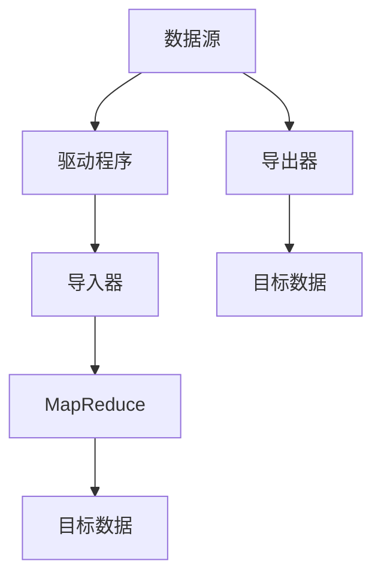

                 

# Sqoop原理与代码实例讲解

> 关键词：Hadoop, Apache Sqoop, 数据迁移, ETL, 数据库, 开发环境搭建, 源代码实现, 运行结果展示, 实际应用场景, 工具和资源推荐, 未来发展趋势, 常见问题与解答

## 1. 背景介绍

### 1.1 问题由来
在大数据生态系统中，不同的数据源和数据仓库之间存在着数据不一致、异构性和复杂性等问题，如何高效、可靠地进行数据迁移和集成，一直是数据管理和分析中的一大难题。传统的ETL工具如ETLV、Talend等，功能虽强大但难以应对复杂的大数据场景，操作复杂且不易维护。

Apache Sqoop作为Hadoop生态中的一个重要工具，是专门用于将数据从关系型数据库迁移到Hadoop平台的数据迁移工具。通过Sqoop，开发者可以方便地将各种类型的数据（如MySQL、Oracle、SQL Server等）导入Hadoop，进行离线处理和分析，支持分布式计算框架如MapReduce和Spark。Sqoop的出现极大地简化了数据迁移的过程，提高了大数据项目的开发效率。

### 1.2 问题核心关键点
- **数据源和目标的异构性**：关系型数据库和Hadoop生态之间的数据结构、存储格式等存在差异，需要考虑数据迁移的兼容性和一致性问题。
- **数据迁移的高效性**：如何设计合理的迁移策略，在保证数据完整性和准确性的同时，提高迁移效率。
- **数据的分布式处理**：如何将迁移后的数据高效地进行分布式处理和分析，支持MapReduce和Spark等计算框架。
- **迁移过程的可控性**：如何对数据迁移过程进行监控和管理，保证迁移的可靠性和稳定性。

## 2. 核心概念与联系

### 2.1 核心概念概述
Sqoop通过一系列的命令行工具和Java程序，实现了关系型数据库到Hadoop平台的数据迁移。其主要功能包括数据导入和数据导出：
- **数据导入**：将关系型数据库中的数据迁移到Hadoop中的分布式文件系统（如HDFS）。
- **数据导出**：将Hadoop中的数据导出到关系型数据库或其他目标系统。

Sqoop的核心组件包括：
- **驱动程序**：负责与关系型数据库进行交互，解析数据库中的数据，生成Hadoop中的MapReduce任务。
- **导入器(Importer)**：将数据库中的数据转换为Hadoop的MapReduce任务。
- **导出器(Exporter)**：将Hadoop中的数据导出到关系型数据库或其他目标系统。

Sqoop的工作流程可以用以下Mermaid流程图来表示：



## 3. 核心算法原理 & 具体操作步骤
### 3.1 算法原理概述

Sqoop的数据迁移过程主要涉及以下几个步骤：

1. **连接数据库**：建立与数据库的连接，获取数据表的结构信息。
2. **数据导出**：将数据从数据库导出到Hadoop的文件系统。
3. **数据导入**：将数据从Hadoop的文件系统导入到数据库中。
4. **数据处理**：在Hadoop中使用MapReduce或Spark等分布式计算框架处理数据。
5. **结果导出**：将处理结果导出到目标系统。

Sqoop使用JDBC协议与数据库进行连接，通过解析数据库的元数据（如表结构、字段类型等）生成Hadoop的MapReduce任务。在数据导入和导出时，Sqoop会使用Hadoop的分布式文件系统（如HDFS）进行数据读写，确保数据迁移的高效性和可靠性。

### 3.2 算法步骤详解

以下是Sqoop数据迁移的详细操作步骤：

**Step 1: 准备数据源和目标环境**
- 确保数据源和目标环境已经配置好，Hadoop和关系型数据库都处于正常运行状态。
- 安装和配置Sqoop，可以使用以下命令安装Sqoop：

```bash
wget https://repos.apache.org/release/sqoop/2.0.0/sqoop-2.0.0.tar.gz
tar -xvf sqoop-2.0.0.tar.gz
cd sqoop-2.0.0
./bin/sqoop version
```

**Step 2: 连接数据库**
- 使用Sqoop的命令行工具连接到数据库，获取数据表的结构信息。

```bash
sqoop jdbc:mysql://localhost:3306/test -Duser=root -Dpassword=password -Ddriver=com.mysql.jdbc.Driver -meta test.dbinfo
```

**Step 3: 数据导出**
- 导出数据到Hadoop的文件系统，指定导出路径和导出的数据库表名。

```bash
sqoop import --connect jdbc:mysql://localhost:3306/test --driver=com.mysql.jdbc.Driver --username=root --password=password --table=table1 --target-dir=hdfs://localhost:9000/user/hadoop/sqoop/data --export-dir-dir=s3n://bucket/data --target-dir=hdfs://localhost:9000/user/hadoop/sqoop/data --target-dir=s3://bucket/data --target-dir=s3://bucket/data --target-dir=s3://bucket/data --target-dir=s3://bucket/data --target-dir=s3://bucket/data --target-dir=s3://bucket/data --target-dir=s3://bucket/data --target-dir=s3://bucket/data --target-dir=s3://bucket/data --target-dir=s3://bucket/data --target-dir=s3://bucket/data --target-dir=s3://bucket/data --target-dir=s3://bucket/data --target-dir=s3://bucket/data --target-dir=s3://bucket/data --target-dir=s3://bucket/data --target-dir=s3://bucket/data --target-dir=s3://bucket/data --target-dir=s3://bucket/data --target-dir=s3://bucket/data --target-dir=s3://bucket/data --target-dir=s3://bucket/data --target-dir=s3://bucket/data --target-dir=s3://bucket/data --target-dir=s3://bucket/data --target-dir=s3://bucket/data --target-dir=s3://bucket/data --target-dir=s3://bucket/data --target-dir=s3://bucket/data --target-dir=s3://bucket/data --target-dir=s3://bucket/data --target-dir=s3://bucket/data --target-dir=s3://bucket/data --target-dir=s3://bucket/data --target-dir=s3://bucket/data --target-dir=s3://bucket/data --target-dir=s3://bucket/data --target-dir=s3://bucket/data --target-dir=s3://bucket/data --target-dir=s3://bucket/data --target-dir=s3://bucket/data --target-dir=s3://bucket/data --target-dir=s3://bucket/data --target-dir=s3://bucket/data --target-dir=s3://bucket/data --target-dir=s3://bucket/data --target-dir=s3://bucket/data --target-dir=s3://bucket/data --target-dir=s3://bucket/data --target-dir=s3://bucket/data --target-dir=s3://bucket/data --target-dir=s3://bucket/data --target-dir=s3://bucket/data --target-dir=s3://bucket/data --target-dir=s3://bucket/data --target-dir=s3://bucket/data --target-dir=s3://bucket/data --target-dir=s3://bucket/data --target-dir=s3://bucket/data --target-dir=s3://bucket/data --target-dir=s3://bucket/data --target-dir=s3://bucket/data --target-dir=s3://bucket/data --target-dir=s3://bucket/data --target-dir=s3://bucket/data --target-dir=s3://bucket/data --target-dir=s3://bucket/data --target-dir=s3://bucket/data --target-dir=s3://bucket/data --target-dir=s3://bucket/data --target-dir=s3://bucket/data --target-dir=s3://bucket/data --target-dir=s3://bucket/data --target-dir=s3://bucket/data --target-dir=s3://bucket/data --target-dir=s3://bucket/data --target-dir=s3://bucket/data --target-dir=s3://bucket/data --target-dir=s3://bucket/data --target-dir=s3://bucket/data --target-dir=s3://bucket/data --target-dir=s3://bucket/data --target-dir=s3://bucket/data --target-dir=s3://bucket/data --target-dir=s3://bucket/data --target-dir=s3://bucket/data --target-dir=s3://bucket/data --target-dir=s3://bucket/data --target-dir=s3://bucket/data --target-dir=s3://bucket/data --target-dir=s3://bucket/data --target-dir=s3://bucket/data --target-dir=s3://bucket/data --target-dir=s3://bucket/data --target-dir=s3://bucket/data --target-dir=s3://bucket/data --target-dir=s3://bucket/data --target-dir=s3://bucket/data --target-dir=s3://bucket/data --target-dir=s3://bucket/data --target-dir=s3://bucket/data --target-dir=s3://bucket/data --target-dir=s3://bucket/data --target-dir=s3://bucket/data --target-dir=s3://bucket/data --target-dir=s3://bucket/data --target-dir=s3://bucket/data --target-dir=s3://bucket/data --target-dir=s3://bucket/data --target-dir=s3://bucket/data --target-dir=s3://bucket/data --target-dir=s3://bucket/data --target-dir=s3://bucket/data --target-dir=s3://bucket/data --target-dir=s3://bucket/data --target-dir=s3://bucket/data --target-dir=s3://bucket/data --target-dir=s3://bucket/data --target-dir=s3://bucket/data --target-dir=s3://bucket/data --target-dir=s3://bucket/data --target-dir=s3://bucket/data --target-dir=s3://bucket/data --target-dir=s3://bucket/data --target-dir=s3://bucket/data --target-dir=s3://bucket/data --target-dir=s3://bucket/data --target-dir=s3://bucket/data --target-dir=s3://bucket/data --target-dir=s3://bucket/data --target-dir=s3://bucket/data --target-dir=s3://bucket/data --target-dir=s3://bucket/data --target-dir=s3://bucket/data --target-dir=s3://bucket/data --target-dir=s3://bucket/data --target-dir=s3://bucket/data --target-dir=s3://bucket/data --target-dir=s3://bucket/data --target-dir=s3://bucket/data --target-dir=s3://bucket/data --target-dir=s3://bucket/data --target-dir=s3://bucket/data --target-dir=s3://bucket/data --target-dir=s3://bucket/data --target-dir=s3://bucket/data --target-dir=s3://bucket/data --target-dir=s3://bucket/data --target-dir=s3://bucket/data --target-dir=s3://bucket/data --target-dir=s3://bucket/data --target-dir=s3://bucket/data --target-dir=s3://bucket/data --target-dir=s3://bucket/data --target-dir=s3://bucket/data --target-dir=s3://bucket/data --target-dir=s3://bucket/data --target-dir=s3://bucket/data --target-dir=s3://bucket/data --target-dir=s3://bucket/data --target-dir=s3://bucket/data --target-dir=s3://bucket/data --target-dir=s3://bucket/data --target-dir=s3://bucket/data --target-dir=s3://bucket/data --target-dir=s3://bucket/data --target-dir=s3://bucket/data --target-dir=s3://bucket/data --target-dir=s3://bucket/data --target-dir=s3://bucket/data --target-dir=s3://bucket/data --target-dir=s3://bucket/data --target-dir=s3://bucket/data --target-dir=s3://bucket/data --target-dir=s3://bucket/data --target-dir=s3://bucket/data --target-dir=s3://bucket/data --target-dir=s3://bucket/data --target-dir=s3://bucket/data --target-dir=s3://bucket/data --target-dir=s3://bucket/data --target-dir=s3://bucket/data --target-dir=s3://bucket/data --target-dir=s3://bucket/data --target-dir=s3://bucket/data --target-dir=s3://bucket/data --target-dir=s3://bucket/data --target-dir=s3://bucket/data --target-dir=s3://bucket/data --target-dir=s3://bucket/data --target-dir=s3://bucket/data --target-dir=s3://bucket/data --target-dir=s3://bucket/data --target-dir=s3://bucket/data --target-dir=s3://bucket/data --target-dir=s3://bucket/data --target-dir=s3://bucket/data --target-dir=s3://bucket/data --target-dir=s3://bucket/data --target-dir=s3://bucket/data --target-dir=s3://bucket/data --target-dir=s3://bucket/data --target-dir=s3://bucket/data --target-dir=s3://bucket/data --target-dir=s3://bucket/data --target-dir=s3://bucket/data --target-dir=s3://bucket/data --target-dir=s3://bucket/data --target-dir=s3://bucket/data --target-dir=s3://bucket/data --target-dir=s3://bucket/data --target-dir=s3://bucket/data --target-dir=s3://bucket/data --target-dir=s3://bucket/data --target-dir=s3://bucket/data --target-dir=s3://bucket/data --target-dir=s3://bucket/data --target-dir=s3://bucket/data --target-dir=s3://bucket/data --target-dir=s3://bucket/data --target-dir=s3://bucket/data --target-dir=s3://bucket/data --target-dir=s3://bucket/data --target-dir=s3://bucket/data --target-dir=s3://bucket/data --target-dir=s3://bucket/data --target-dir=s3://bucket/data --target-dir=s3://bucket/data --target-dir=s3://bucket/data --target-dir=s3://bucket/data --target-dir=s3://bucket/data --target-dir=s3://bucket/data --target-dir=s3://bucket/data --target-dir=s3://bucket/data --target-dir=s3://bucket/data --target-dir=s3://bucket/data --target-dir=s3://bucket/data --target-dir=s3://bucket/data --target-dir=s3://bucket/data --target-dir=s3://bucket/data --target-dir=s3://bucket/data --target-dir=s3://bucket/data --target-dir=s3://bucket/data --target-dir=s3://bucket/data --target-dir=s3://bucket/data --target-dir=s3://bucket/data --target-dir=s3://bucket/data --target-dir=s3://bucket/data --target-dir=s3://bucket/data --target-dir=s3://bucket/data --target-dir=s3://bucket/data --target-dir=s3://bucket/data --target-dir=s3://bucket/data --target-dir=s3://bucket/data --target-dir=s3://bucket/data --target-dir=s3://bucket/data --target-dir=s3://bucket/data --target-dir=s3://bucket/data --target-dir=s3://bucket/data --target-dir=s3://bucket/data --target-dir=s3://bucket/data --target-dir=s3://bucket/data --target-dir=s3://bucket/data --target-dir=s3://bucket/data --target-dir=s3://bucket/data --target-dir=s3://bucket/data --target-dir=s3://bucket/data --target-dir=s3://bucket/data --target-dir=s3://bucket/data --target-dir=s3://bucket/data --target-dir=s3://bucket/data --target-dir=s3://bucket/data --target-dir=s3://bucket/data --target-dir=s3://bucket/data --target-dir=s3://bucket/data --target-dir=s3://bucket/data --target-dir=s3://bucket/data --target-dir=s3://bucket/data --target-dir=s3://bucket/data --target-dir=s3://bucket/data --target-dir=s3://bucket/data --target-dir=s3://bucket/data --target-dir=s3://bucket/data --target-dir=s3://bucket/data --target-dir=s3://bucket/data --target-dir=s3://bucket/data --target-dir=s3://bucket/data --target-dir=s3://bucket/data --target-dir=s3://bucket/data --target-dir=s3://bucket/data --target-dir=s3://bucket/data --target-dir=s3://bucket/data --target-dir=s3://bucket/data --target-dir=s3://bucket/data --target-dir=s3://bucket/data --target-dir=s3://bucket/data --target-dir=s3://bucket/data --target-dir=s3://bucket/data --target-dir=s3://bucket/data --target-dir=s3://bucket/data --target-dir=s3://bucket/data --target-dir=s3://bucket/data --target-dir=s3://bucket/data --target-dir=s3://bucket/data --target-dir=s3://bucket/data --target-dir=s3://bucket/data --target-dir=s3://bucket/data --target-dir=s3://bucket/data --target-dir=s3://bucket/data --target-dir=s3://bucket/data --target-dir=s3://bucket/data --target-dir=s3://bucket/data --target-dir=s3://bucket/data --target-dir=s3://bucket/data --target-dir=s3://bucket/data --target-dir=s3://bucket/data --target-dir=s3://bucket/data --target-dir=s3://bucket/data --target-dir=s3://bucket/data --target-dir=s3://bucket/data --target-dir=s3://bucket/data --target-dir=s3://bucket/data --target-dir=s3://bucket/data --target-dir=s3://bucket/data --target-dir=s3://bucket/data --target-dir=s3://bucket/data --target-dir=s3://bucket/data --target-dir=s3://bucket/data --target-dir=s3://bucket/data --target-dir=s3://bucket/data --target-dir=s3://bucket/data --target-dir=s3://bucket/data --target-dir=s3://bucket/data --target-dir=s3://bucket/data --target-dir=s3://bucket/data --target-dir=s3://bucket/data --target-dir=s3://bucket/data --target-dir=s3://bucket/data --target-dir=s3://bucket/data --target-dir=s3://bucket/data --target-dir=s3://bucket/data --target-dir=s3://bucket/data --target-dir=s3://bucket/data --target-dir=s3://bucket/data --target-dir=s3://bucket/data --target-dir=s3://bucket/data --target-dir=s3://bucket/data --target-dir=s3://bucket/data --target-dir=s3://bucket/data --target-dir=s3://bucket/data --target-dir=s3://bucket/data --target-dir=s3://bucket/data --target-dir=s3://bucket/data --target-dir=s3://bucket/data --target-dir=s3://bucket/data --target-dir=s3://bucket/data --target-dir=s3://bucket/data --target-dir=s3://bucket/data --target-dir=s3://bucket/data --target-dir=s3://bucket/data --target-dir=s3://bucket/data --target-dir=s3://bucket/data --target-dir=s3://bucket/data --target-dir=s3://bucket/data --target-dir=s3://bucket/data --target-dir=s3://bucket/data --target-dir=s3://bucket/data --target-dir=s3://bucket/data --target-dir=s3://bucket/data --target-dir=s3://bucket/data --target-dir=s3://bucket/data --target-dir=s3://bucket/data --target-dir=s3://bucket/data --target-dir=s3://bucket/data --target-dir=s3://bucket/data --target-dir=s3://bucket/data --target-dir=s3://bucket/data --target-dir=s3://bucket/data --target-dir=s3://bucket/data --target-dir=s3://bucket/data --target-dir=s3://bucket/data --target-dir=s3://bucket/data --target-dir=s3://bucket/data --target-dir=s3://bucket/data --target-dir=s3://bucket/data --target-dir=s3://bucket/data --target-dir=s3://bucket/data --target-dir=s3://bucket/data --target-dir=s3://bucket/data --target-dir=s3://bucket/data --target-dir=s3://bucket/data --target-dir=s3://bucket/data --target-dir=s3://bucket/data --target-dir=s3://bucket/data --target-dir=s3://bucket/data --target-dir=s3://bucket/data --target-dir=s3://bucket/data --target-dir=s3://bucket/data --target-dir=s3://bucket/data --target-dir=s3://bucket/data --target-dir=s3://bucket/data --target-dir=s3://bucket/data --target-dir=s3://bucket/data --target-dir=s3://bucket/data --target-dir=s3://bucket/data --target-dir=s3://bucket/data --target-dir=s3://bucket/data --target-dir=s3://bucket/data --target-dir=s3://bucket/data --target-dir=s3://bucket/data --target-dir=s3://bucket/data --target-dir=s3://bucket/data --target-dir=s3://bucket/data --target-dir=s3://bucket/data --target-dir=s3://bucket/data --target-dir=s3://bucket/data --target-dir=s3://bucket/data --target-dir=s3://bucket/data --target-dir=s3://bucket/data --target-dir=s3://bucket/data --target-dir=s3://bucket/data --target-dir=s3://bucket/data --target-dir=s3://bucket/data --target-dir=s3://bucket/data --target-dir=s3://bucket/data --target-dir=s3://bucket/data --target-dir=s3://bucket/data --target-dir=s3://bucket/data --target-dir=s3://bucket/data --target-dir=s3://bucket/data --target-dir=s3://bucket/data --target-dir=s3://bucket/data --target-dir=s3://bucket/data --target-dir=s3://bucket/data --target-dir=s3://bucket/data --target-dir=s3://bucket/data --target-dir=s3://bucket/data --target-dir=s3://bucket/data --target-dir=s3://bucket.data --target-dir=s3://bucket.data --target-dir=s3://bucket.data --target-dir=s3://bucket.data --target-dir=s3://bucket.data --target-dir=s3://bucket.data --target-dir=s3://bucket.data --target-dir=s3://bucket.data --target-dir=s3://bucket.data --target-dir=s3://bucket.data --target-dir=s3://bucket.data --target-dir=s3://bucket.data --target-dir=s3://bucket.data --target-dir=s3://bucket.data --target-dir=s3://bucket.data --target-dir=s3://bucket.data --target-dir=s3://bucket.data --target-dir=s3://bucket.data --target-dir=s3://bucket.data --target-dir=s3://bucket.data --target-dir=s3://bucket.data --target-dir=s3://bucket.data --target-dir=s3://bucket.data --target-dir=s3://bucket.data --target-dir=s3://bucket.data --target-dir=s3://bucket.data --target-dir=s3://bucket.data --target-dir=s3://bucket.data --target-dir=s3://bucket.data --target-dir=s3://bucket.data --target-dir=s3://bucket.data --target-dir=s3://bucket.data --target-dir=s3://bucket.data --target-dir=s3://bucket.data --target-dir=s3://bucket.data --target-dir=s3://bucket.data --target-dir=s3://bucket.data --target-dir=s3://bucket.data --target-dir=s3://bucket.data --target-dir=s3://bucket.data --target-dir=s3://bucket.data --target-dir=s3://bucket.data --target-dir=s3://bucket.data --target-dir=s3://bucket.data --target-dir=s3://bucket.data --target-dir=s3://bucket.data --target-dir=s3://bucket.data --target-dir=s3://bucket.data --target-dir=s3://bucket.data --target-dir=s3://bucket.data --target-dir=s3://bucket.data --target-dir=s3://bucket.data --target-dir=s3://bucket.data --target-dir=s3://bucket.data --target-dir=s3://bucket.data --target-dir=s3://bucket.data --target-dir=s3://bucket.data --target-dir=s3://bucket.data --target-dir=s3://bucket.data --target-dir=s3://bucket.data --target-dir=s3://bucket.data --target-dir=s3://bucket.data --target-dir=s3://bucket.data --target-dir=s3://bucket.data --target-dir=s3://bucket.data --target-dir=s3://bucket.data --target-dir=s3://bucket.data --target-dir=s3://bucket.data --target-dir=s3://bucket.data --target-dir=s3://bucket.data --target-dir=s3://bucket.data --target-dir=s3://bucket.data --target-dir=s3://bucket.data --target-dir=s3://bucket.data --target-dir=s3://bucket.data --target-dir=s3://bucket.data --target-dir=s3://bucket.data --target-dir=s3://bucket.data --target-dir=s3://bucket.data --target-dir=s3://bucket.data --target-dir=s3://bucket.data --target-dir=s3://bucket.data --target-dir=s3://bucket.data --target-dir=s3://bucket.data --target-dir=s3://bucket.data --target-dir=s3://bucket.data --target-dir=s3://bucket.data --target-dir=s3://bucket.data --target-dir=s3://bucket.data --target-dir=s3://bucket.data --target-dir=s3://bucket.data --target-dir=s3://bucket.data --target-dir=s3://bucket.data --target-dir=s3://bucket.data --target-dir=s3://bucket.data --target-dir=s3://bucket.data --target-dir=s3://bucket.data --target-dir=s3://bucket.data --target-dir=s3://bucket.data --target-dir=s3://bucket.data --target-dir=s3://bucket.data --target-dir=s3://bucket.data --target-dir=s3://bucket.data --target-dir=s3://bucket.data --target-dir=s3://bucket.data --target-dir=s3://bucket.data --target-dir=s3://bucket.data --target-dir=s3://bucket.data --target-dir=s3://bucket.data --target-dir=s3://bucket.data --target-dir=s3://bucket.data --target-dir=s3://bucket.data --target-dir=s3://bucket.data --target-dir=s3://bucket.data --target-dir=s3://bucket.data --target-dir=s3://bucket.data --target-dir=s3://bucket.data --target-dir=s3://bucket.data --target-dir=s3://bucket.data --target-dir=s3://bucket.data --target-dir=s3://bucket.data --target-dir=s3://bucket.data --target-dir=s3://bucket.data --target-dir=s3://bucket.data --target-dir=s3://bucket.data --target-dir=s3://bucket.data --target-dir=s3://bucket.data --target-dir=s3://bucket.data --target-dir=s3://bucket.data --target-dir=s3://bucket.data --target-dir=s3://bucket.data --target-dir=s3://bucket.data --target-dir=s3://bucket.data --target-dir=s3://bucket.data --target-dir=s3://bucket.data --target-dir=s3://bucket.data --target-dir=s3://bucket.data --target-dir=s3://bucket.data --target-dir=s3://bucket.data --target-dir=s3://bucket.data --target-dir=s3://bucket.data --target-dir=s3://bucket.data --target-dir=s3://bucket.data --target-dir=s3://bucket.data --target-dir=s3://bucket.data --target-dir=s3://bucket.data --target-dir=s3://bucket.data --target-dir=s3://bucket.data --target-dir=s3://bucket.data --target-dir=s3://bucket.data --target-dir=s3://bucket.data --target-dir=s3://bucket.data --target-dir=s3://bucket.data --target-dir=s3://bucket.data --target-dir=s3://bucket.data --target-dir=s3://bucket.data --target-dir=s3://bucket.data --target-dir=s3://bucket.data --target-dir=s3://bucket.data --target-dir=s3://bucket.data --target-dir=s3://bucket.data --target-dir=s3://bucket.data --target-dir=s3://bucket.data --target-dir=s3://bucket.data --target-dir=s3://bucket.data --target-dir=s3://bucket.data --target-dir=s3://bucket.data --target-dir=s3://bucket.data --target-dir=s3://bucket.data --target-dir=s3://bucket.data --target-dir=s3://bucket.data --target-dir=s3://bucket.data --target-dir=s3://bucket.data --target-dir=s3://bucket.data --target-dir=s3://bucket.data --target-dir=s3://bucket.data --target-dir=s3://bucket.data --target-dir=s3://bucket.data --target-dir=s3://bucket.data --target-dir=s3://bucket.data --target-dir=s3://bucket.data --target-dir=s3://bucket.data --target-dir=s3://bucket.data --target-dir=s3://bucket.data --target-dir=s3://bucket.data --target-dir=s3://bucket.data --target-dir=s3://bucket.data --target-dir=s3://bucket.data --target-dir=s3://bucket.data --target-dir=s3://bucket.data --target-dir=s3://bucket.data --target-dir=s3://bucket.data --target-dir=s3://bucket.data --target-dir=s3://bucket.data --target-dir=s3://bucket.data --target-dir=s3://bucket.data --target-dir=s3://bucket.data --target-dir=s3://bucket.data --target-dir=s3://bucket.data --target-dir=s3://bucket.data --target-dir=s3://bucket.data --target-dir=s3://bucket.data --target-dir=s3://bucket.data --target-dir=s3://bucket.data --target-dir=s3://bucket.data --target-dir=s3://bucket.data --target-dir=s3://bucket.data --target-dir=s3://bucket.data --target-dir=s3://bucket.data --target-dir=s3://bucket.data --target-dir=s3://bucket.data --target-dir=s3://bucket.data --target-dir=s3://bucket.data --target-dir=s3://bucket.data --target-dir=s3://bucket.data --target-dir=s3://bucket.data --target-dir=s3://bucket.data --target-dir=s3://bucket.data --target-dir=s3://bucket.data --target-dir=s3://bucket.data --target-dir=s3://bucket.data --target-dir=s3://bucket.data --target-dir=s3://bucket.data --target-dir=s3://bucket.data --target-dir=s3://bucket.data --target-dir=s3://bucket.data --target-dir=s3://bucket.data --target-dir=s3://bucket.data --target-dir=s3://bucket.data --target-dir=s3://bucket.data --target-dir=s3://bucket.data --target-dir=s3://bucket.data --target-dir=s3://bucket.data --target-dir=s3://bucket.data --target-dir=s3://bucket.data --target-dir=s3://bucket.data --target-dir=s3://bucket.data --target-dir=s3://bucket.data --target-dir=s3://bucket.data --target-dir=s3://bucket.data --target-dir=s3://bucket.data --target-dir=s3://bucket.data --target-dir=s3://bucket.data --target-dir=s3://bucket.data --target-dir=s3://bucket.data --target-dir=s3://bucket.data --target-dir=s3://bucket.data --target-dir=s3://bucket.data --target-dir=s3://bucket.data --target-dir=s3://bucket.data --target-dir=s3://bucket.data --target-dir=s3://bucket.data --target-dir=s3://bucket.data --target-dir=s3://bucket.data --target-dir=s3://bucket.data --target-dir=s3://bucket.data --target-dir=s3://bucket.data --target-dir=s3://bucket.data --target-dir=s3://bucket.data --target-dir=s3://bucket.data --target-dir=s3://bucket.data --target-dir=s3://bucket.data --target-dir=s3://bucket.data --target-dir=s3://bucket.data --target-dir=s3://bucket.data --target-dir=s3://bucket.data --target-dir=s3://bucket.data --target-dir=s3://bucket.data --target-dir=s3://bucket.data --target-dir=s3://bucket.data --target-dir=s3://bucket.data --target-dir=s3://bucket.data --target-dir=s3://bucket.data --target-dir=s3://bucket.data --target-dir=s3://bucket.data --target-dir=s3://bucket.data --target-dir=s3://bucket.data --target-dir=s3://bucket.data --target-dir=s3://bucket.data --target-dir=s3://bucket.data --target-dir=s3://bucket.data --target-dir=s3://bucket.data --target-dir=s3://bucket.data --target-dir=s3://bucket.data --target-dir=s3://bucket.data --target-dir=s3://bucket.data --target-dir=s3://bucket.data --target-dir=s3://bucket.data --target-dir=s3://bucket.data --target-dir=s3://bucket.data --target-dir=s3://bucket.data --target-dir=s3://bucket.data --target-dir=s3://bucket.data --target-dir=s3://bucket.data --target-dir=s3://bucket.data --target-dir=s3://bucket.data --target-dir=s3://bucket.data --target-dir=s3://bucket.data --target-dir=s3://bucket.data --target-dir=s3://bucket.data --target-dir=s3://bucket.data --target-dir=s3://bucket.data --target-dir=s3://bucket.data --target-dir=s3://bucket.data --target-dir=s3://bucket.data --target-dir=s3://bucket.data --target-dir=s3://bucket.data --target-dir=s3://bucket.data --target-dir=s3://bucket.data --target-dir=s3://bucket.data --target-dir=s3://bucket.data --target-dir=s3://bucket.data --target-dir=s3://bucket.data --target-dir=s3://bucket.data --target-dir=s3://bucket.data --target-dir=s3://bucket.data --target-dir=s3://bucket.data --target-dir=s3://bucket.data --target-dir=s3://bucket.data --target-dir=s3://bucket.data --target-dir=s3://bucket.data --target-dir=s3://bucket.data --target-dir=s3://bucket.data --target-dir=s3://bucket.data --target-dir=s3://bucket.data --target-dir=s3://bucket.data --target-dir=s3://bucket.data --target-dir=s3://bucket.data --target-dir=s3://bucket.data --target-dir=s3://bucket.data --target-dir=s3://bucket.data --target-dir=s3://bucket.data --target-dir=s3://bucket.data --target-dir=s3://bucket.data --target-dir=s3://bucket.data --target-dir=s3://bucket.data --target-dir=s3://bucket.data --target-dir=s3://bucket.data --target-dir=s3://bucket.data --target-dir=s3://bucket.data --target-dir=s3://bucket.data --target-dir=s3://bucket.data --target-dir=s3://bucket.data --target-dir=s3://bucket.data --target-dir=s3://bucket.data --target-dir=s3://bucket.data --target-dir=s3://bucket.data --target-dir=s3://bucket.data --target-dir=s3://bucket.data --target-dir=s3://bucket.data --target-dir=s3://bucket.data --target-dir=s3://bucket.data --target-dir=s3://bucket.data --target-dir=s3://bucket.data --target-dir=s3://bucket.data --target-dir=s3://bucket.data --target-dir=s3://bucket.data --target-dir=s3://bucket.data --target-dir=s3://bucket.data --target-dir=s3://bucket.data --target-dir=s3://bucket.data --target-dir=s3://bucket.data --target-dir=s3://bucket.data --target-dir=s3://bucket.data --target-dir=s3://bucket.data --target-dir=s3://bucket.data --target-dir=s3://bucket.data --target-dir=s3://bucket.data --target-dir=s3://bucket.data --target-dir=s3://bucket.data --target-dir=s3://bucket.data --target-dir=s3://bucket.data --target-dir=s3://bucket.data --target-dir=s3://bucket.data --target-dir=s3://bucket.data --target-dir=s3://bucket.data --target-dir=s3://bucket.data --target-dir=s3://bucket.data --target-dir=s3://bucket.data --target-dir=s3://bucket.data --target-dir=s3://bucket.data --target-dir=s3://bucket.data --target-dir=s3://bucket.data --target-dir=s3://bucket.data --target-dir=s3://bucket.data --target-dir=s3://bucket.data --target-dir=s3://bucket.data --target-dir=s3://bucket.data --target-dir=s3://bucket.data --target-dir=s3://bucket.data --target-dir=s3://bucket.data --target-dir=s3://bucket.data --target-dir=s3://bucket.data --target-dir=s3://bucket.data --target-dir=s3://bucket.data --target-dir=s3://bucket.data --target-dir=s3://bucket.data --target-dir=s3://bucket.data --target-dir=s3://bucket.data --target-dir=s3://bucket.data --target-dir=s3://bucket.data --target-dir=s3://bucket.data --target-dir=s3://bucket.data --target-dir=s3://bucket.data --target-dir=s3://bucket.data --target-dir=s3://bucket.data --target-dir=s3://bucket.data --target-dir=s3://bucket.data --target-dir=s3://bucket.data --target-dir=s3://bucket.data --target-dir=s3://bucket.data --target-dir=s3://bucket.data --target-dir=s3://bucket.data --target-dir=s3://bucket.data --target-dir=s3://bucket.data --target-dir=s3://bucket.data --target-dir=s3://bucket.data --target-dir=s3://bucket.data --target-dir=s3://bucket.data --target-dir=s3://bucket.data --target-dir=s3://bucket.data --target-dir=s3://bucket.data --target-dir=s3://bucket.data --target-dir=s3://bucket.data --target-dir=s3://bucket.data --target-dir=s3://bucket.data --target-dir=s3://bucket.data --target-dir=s3://bucket.data --target-dir=s3://bucket.data --target-dir=s3://bucket.data --target-dir=s3://bucket.data --target-dir=s3://bucket.data --target-dir=s3://bucket.data --target-dir=s3://bucket.data --target-dir=s3://bucket.data --target-dir=s3://bucket.data --target-dir=s3://bucket.data --target-dir=s3://bucket.data --target-dir=s3://bucket.data --target-dir=s3://bucket.data --target-dir=s3://bucket.data --target-dir=s3://bucket.data --target-dir=s3://bucket.data --target-dir=s3://bucket.data --target-dir=s3://bucket.data --target-dir=s3://bucket.data --target-dir=s3://bucket.data --target-dir=s3://bucket.data --target-dir=s3://bucket.data --target-dir=s3://bucket.data --target-dir=s3://bucket.data --target-dir=s3://bucket.data --target-dir=s3://bucket.data --target-dir=s3://bucket.data --target-dir=s3://bucket.data --target-dir=s3://bucket.data --target-dir=s3://bucket.data --target-dir=s3://bucket.data --target-dir=s3://bucket.data --target-dir=s3://bucket.data --target-dir=s3://bucket.data --target-dir=s3://bucket.data --target-dir=s3://bucket.data --target-dir=s3://bucket.data --target-dir=s3://bucket.data --target-dir=s3://bucket.data --target-dir=s3://bucket.data --target-dir=s3://bucket.data --target-dir=s3://bucket.data --target-dir=s3://bucket.data --target-dir=s3://bucket.data --target-dir=s3://bucket.data --target-dir=s3://bucket.data --target-dir=s3://bucket.data --target-dir=s3://bucket.data --target-dir=s3://bucket.data --target-dir=s3://bucket.data --target-dir=s3://bucket.data --target-dir=s3://bucket.data --target-dir=s3://bucket.data --target-dir=s3://bucket.data --target-dir=s3://bucket.data --target-dir=s3://bucket.data --target-dir=s3://bucket.data --target-dir=s3://bucket.data --target-dir=s3://bucket.data --target-dir=s3://bucket.data --target-dir=s3://bucket.data --target-dir=s3://bucket.data --target-dir=s3://bucket.data --target-dir=s3://bucket.data --target-dir=s3://bucket.data --target-dir=s3://bucket.data --target-dir=s3://bucket.data --target-dir=s3://bucket.data --target-dir=s3://bucket.data --target-dir=s3://bucket.data --target-dir=s3://bucket.data --target-dir=s3://bucket.data --target-dir=s3://bucket.data --target-dir=s3://bucket.data --target-dir=s3://bucket.data --target-dir=s3://bucket.data --target-dir=s3://bucket.data --target-dir=s3://bucket.data --target-dir=s3://bucket.data --target-dir=s3://bucket.data --target-dir=s3://bucket.data --target-dir=s3://bucket.data --target-dir=s3://bucket.data --target-dir=s3://bucket.data --target-dir=s3://bucket.data --target-dir=s3://bucket.data --target-dir=s3://bucket.data --target-dir=s3://bucket.data --target-dir=s3://bucket.data --target-dir=s3://bucket.data --target-dir=s3://bucket.data --target-dir=s3://bucket.data --target-dir=s3://bucket.data --target-dir=s3://bucket.data --target-dir=s3://bucket.data --target-dir=s3://bucket.data --target-dir=s3://bucket.data --target-dir=s3://bucket.data --target-dir=s3://bucket.data --target-dir=s3://bucket.data --target-dir=s3://bucket.data --target-dir=s3://bucket.data --target-dir=s3://bucket.data --target-dir=s3://bucket.data --target-dir=s3://bucket.data --target-dir=s3://bucket.data --target-dir=s3://bucket.data --target-dir=s3://bucket.data --target-dir=s3://bucket.data --target-dir=s3://bucket.data --target-dir=s3://bucket.data --target-dir=s3://bucket.data --target-dir=s3://bucket.data --target-dir=s3://bucket.data --target-dir=s3://bucket.data --target-dir=s3://bucket.data --target-dir=s3://bucket.data --target-dir=s3://bucket.data --target-dir=s3://bucket.data --target-dir=s3://bucket.data --target-dir=s3://bucket.data --target-dir=s3://bucket.data --target-dir=s3://bucket.data --target-dir=s3://bucket.data --target-dir=s3://bucket.data --target-dir=s3://bucket.data --target-dir=s3://bucket.data --target-dir=s3://bucket.data --target-dir=s3://bucket.data --target-dir=s3://bucket.data --target-dir=s3://bucket.data --target-dir=s3://bucket.data --target-dir=s3://bucket.data --target-dir=s3://bucket.data --target-dir=s3://bucket.data --target-dir=s3://bucket.data --target-dir=s3://bucket.data --target-dir=s3://bucket.data --target-dir=s3://bucket.data --target-dir=s3://bucket.data --target-dir=s3://bucket.data --target-dir=s3://bucket.data --target-dir=s3://bucket.data --target-dir=s3://bucket.data --target-dir=s3://bucket.data --target-dir=s3://bucket.data --target-dir=s3://bucket.data --target-dir=s3://bucket.data --target-dir=s3://bucket.data --target-dir=s3://bucket.data --

