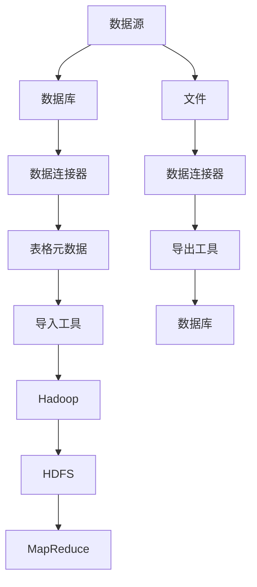

                 

# Sqoop增量导入原理与代码实例讲解

## 1. 背景介绍

Apache Sqoop 是一个开源的工具，主要用于将结构化数据从关系型数据库系统导入到 Hadoop 的 HDFS 或者 MapReduce 系统中。它同时也支持将数据从 Hadoop 系统导入到关系型数据库系统中。Sqoop 通过解析数据库的结构和索引信息，执行导入和导出操作，并在导入和导出过程中进行数据的转换和处理。

## 2. 核心概念与联系

### 2.1 Sqoop的核心概念

- **Sqoop**: 一种数据迁移工具，它能够将结构化数据从关系型数据库系统导入到 Hadoop 的 HDFS 或者 MapReduce 系统中，并且可以从 Hadoop 系统导入到关系型数据库系统中。

- **Hadoop**: 一个开源的分布式计算框架，广泛应用于大数据分析。

- **HDFS**: Hadoop 的分布式文件系统，它提供了一个可以存储大量数据的高可靠的文件系统。

- **MapReduce**: Hadoop 的编程模型和计算框架，它能够对大量数据进行并行处理。

- **_incremental import_**: Sqoop 提供的增量导入功能，可以在导入数据时只处理数据库中最近变化的数据。

### 2.2 Mermaid 流程图



## 3. 核心算法原理 & 具体操作步骤

### 3.1 _算法原理概述_

Sqoop 的增量导入原理基于 Last Modified Timestamp 和 Checkpointing 机制。增量导入的目标是只导入数据库中修改或插入的新数据，而不是重新导入整个表的所有数据。

- **Last Modified Timestamp**：Sqoop 会根据这个 Timestamp 来确定哪些数据是需要导入的。在执行增量导入之前，Sqoop 会在本地记录一个 Timestamp 作为 Checkpoint。之后，Sqoop 会查询数据库来获取所有自上次 Checkpoint 以来修改或插入的数据。这样可以保证只导入了新变化的数据。

- **Checkpointing**：Sqoop 的增量导入依赖于 Checkpointing 机制来维护状态。每次执行增量导入时，Sqoop 会在本地记录一个 Checkpoint，这个 Checkpoint 是一个标志，表示本次导入已经处理到了哪个数据点。下次执行增量导入时，Sqoop 会继续从上次的 Checkpoint 处开始导入新数据。

### 3.2 _算法步骤详解_

1. **初始化环境**：确保 Sqoop 和 Hadoop 环境已经正确安装和配置。
2. **配置命令**：使用 Sqoop 提供的命令行工具，配置增量导入命令，指定表名、数据库连接信息、导入的路径等。
3. **启动增量导入**：执行 Sqoop 命令，Sqoop 会连接数据库，查询 Last Modified Timestamp，并根据 Timestamp 来确定需要导入的数据。
4. **数据处理**：Sqoop 会使用 MapReduce 作业来处理这些数据，并将数据导入到 HDFS。
5. **维护 Checkpoint**：Sqoop 会在本地记录一个新的 Checkpoint，作为下次增量导入的起始点。

### 3.3 _算法优缺点_

**优点**：

- **减少数据量**：只导入新变化的数据，减少了处理的数据量，提高了导入效率。
- **确保数据完整性**：通过 Last Modified Timestamp 确保了只导入了最新的数据，避免了数据不一致的问题。

**缺点**：

- **依赖数据库的 Last Modified Timestamp**：如果数据库的 Timestamp 有误差，可能会导入错误的数据。
- **复杂性**：增量导入的原理和实现较为复杂，需要精确的配置和维护。

### 3.4 _算法应用领域_

Sqoop 的增量导入功能在大数据处理和数据同步中非常有用，可以应用于：

- **数据迁移**：将数据从关系型数据库系统迁移到 Hadoop 系统。
- **数据同步**：保持关系型数据库和 Hadoop 系统中的数据一致。
- **数据备份**：通过增量导入来备份数据，减少备份时间。

## 4. 数学模型和公式 & 详细讲解 & 举例说明

在 Sqoop 的增量导入中，并没有直接涉及到复杂的数学模型和公式。增量导入的核心在于数据库的 Last Modified Timestamp 和 Checkpointing 机制，而这些都是在数据库层面和 Sqoop 本身的实现逻辑层面实现的，较少涉及到具体的数学模型。

## 5. 项目实践：代码实例和详细解释说明

以下是一个 Sqoop 增量导入的简单代码实例：

```shell
# 确定导入的表名和数据库信息
--table mytable
--connect 'jdbc:mysql://localhost:3306/mydb?user=myuser&password=mypassword'

# 确定导入的路径和文件格式
--target-dir /user/sqoop_data
--as-textfile
--fields-terminated-by ','
--lines-terminated-by '\n'

# 配置增量导入参数
--check-column 1 # 最后修改时间的列
--last-value -1   # 上次 Checkpoint 的值

# 执行导入
import
```

这个命令首先指定了需要导入的表和数据库连接信息，接着指定了导入数据的路径和格式，并配置了增量导入的参数，包括最后修改时间的列和上次 Checkpoint 的值。最后执行了增量导入命令。

## 6. 实际应用场景

### 6.1 数据迁移

在数据迁移场景中，Sqoop 的增量导入功能尤为重要。用户可能需要定期将数据从旧的数据库系统迁移到新的 Hadoop 集群。在这个过程中，Sqoop 的增量导入可以帮助用户只迁移数据库中修改或插入的新数据，从而减少数据量，提高迁移效率。

### 6.2 数据同步

在数据同步场景中，Sqoop 的增量导入可以帮助用户保持关系型数据库和 Hadoop 系统中的数据一致。通过定期执行增量导入，用户可以确保两种系统中的数据在实时保持一致，减少数据不一致带来的问题。

### 6.3 数据备份

在数据备份场景中，Sqoop 的增量导入可以帮助用户快速备份数据库中的数据。通过只导入自上次备份以来的新数据，用户可以显著减少备份时间，提高备份效率。

### 6.4 未来应用展望

随着数据量的不断增长和数据处理的不断复杂化，Sqoop 的增量导入功能在未来的数据处理应用中将更加重要。随着技术的发展，Sqoop 可能会加入新的功能，比如支持更多的数据库系统，或者更好的处理大数据量的能力，以适应更复杂的数据处理需求。

## 7. 工具和资源推荐

### 7.1 学习资源推荐

对于想要深入了解 Sqoop 的用户，可以参考以下学习资源：

1. **Apache Sqoop官方文档**：Sqoop 的官方文档是学习 Sqoop 的最权威资源，提供了详细的使用指南和技术细节。
2. **《Apache Sqoop Essentials》**：这是一本专门讲解 Sqoop 的书籍，适合初学者和有经验的用户。

### 7.2 开发工具推荐

对于开发者来说，以下工具将有助于提高开发效率：

1. **Apache Hive**：Hive 是一个数据仓库系统，它可以提供类似于关系型数据库的查询语言（如 SQL）来处理 Hadoop 中的数据。
2. **Apache Pig**：Pig 是一个高级数据流语言和执行环境，用于分析和处理结构化数据。
3. **Apache Spark**：Spark 是一个快速、通用的大数据处理平台，它可以在内存中进行操作，提供高性能的数据处理能力。

### 7.3 相关论文推荐

对于想要深入研究 Sqoop 技术的研究者，可以阅读以下论文：

1. **《Apache Sqoop: A Vehicle for Integrating Relational Databases with Hadoop》**：这是 Sqoop 的最初论文，介绍了 Sqoop 的设计理念和技术实现。
2. **《Improving Incremental Data Integration with Apache Sqoop》**：这篇论文探讨了如何改进 Sqoop 的增量导入功能，以提高数据一致性和处理效率。

## 8. 总结：未来发展趋势与挑战

Sqoop 作为大数据处理领域的一员，其增量导入功能为数据迁移、数据同步和数据备份等场景提供了强大的支持。随着数据量的不断增长和技术的不断进步，Sqoop 的未来发展趋势和挑战将包括：

1. **适应更多的数据库系统**：随着不同数据库系统的发展，Sqoop 需要适应更多种类的数据库系统，以支持更广泛的数据迁移需求。
2. **优化处理大数据量的能力**：随着数据量的不断增长，Sqoop 需要优化其处理大数据量的能力，以减少处理时间，提高效率。
3. **解决数据一致性和完整性的挑战**：随着数据的不断增加，保持数据的一致性和完整性将成为Sqoop面临的主要挑战。

尽管Sqoop在大数据处理领域占据了重要地位，但面对不断变化的数据处理需求，Sqoop仍然需要不断创新和优化，以适应未来挑战和机遇。

---

作者：禅与计算机程序设计艺术 / Zen and the Art of Computer Programming

