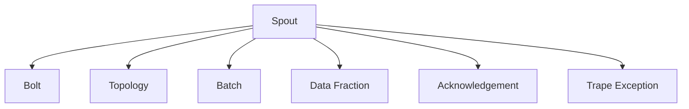

                 

## 1. 背景介绍

### 1.1 问题由来

Storm 是一个开源的分布式实时计算系统，旨在帮助开发者构建高效、可靠的实时数据处理应用。它的设计目标是实现高吞吐量、低延迟、容错性强、可扩展性强等特点，适用于各类实时数据处理场景，如实时日志处理、流数据分析、实时消息处理等。

Storm 中的 Spout 组件是数据流的源点，它负责从外部数据源中读取数据，并将其分发给对应的 Bolt 组件进行处理。Spout 是 Storm 的核心组件之一，理解和掌握 Spout 原理对于构建高效、稳定的实时数据流处理系统至关重要。

### 1.2 问题核心关键点

Storm Spout 的核心关键点包括：

- 数据源获取：Spout 组件从外部数据源（如文件、数据库、消息队列等）获取数据。
- 数据分割与分发：Spout 将获取的数据分割成若干个任务，并通过拓扑结构将这些任务分发给对应的 Bolt 组件。
- 数据持久化：Spout 通常会将数据缓存在一定时间，避免数据丢失或重复处理。
- 数据可靠传输：Spout 需要确保数据可靠地传输到 Bolt 组件，实现数据传输的可靠性。
- 数据流监控：Spout 可以实时监控数据流的运行状态，提供实时告警和故障恢复机制。

### 1.3 问题研究意义

掌握 Storm Spout 原理，可以深入理解分布式实时数据流的核心机制，提升实时数据处理应用的构建能力。同时，深入分析 Spout 的架构设计，可以提升对分布式系统的理解和设计能力，为构建复杂、高可扩展的分布式应用提供有力支持。

## 2. 核心概念与联系

### 2.1 核心概念概述

为更好地理解 Storm Spout 原理，首先需要了解其核心概念：

- **Spout**：Storm 数据流的源点，负责从外部数据源获取数据并分发给 Bolt 组件。
- **Bolt**：Storm 数据流处理组件，负责对数据进行处理和计算。
- **Topology**：Storm 的拓扑结构，定义了 Spout 和 Bolt 之间的数据流关系。
- **Batch**：Spout 从外部数据源获取的数据，分为微批和宏批两种。
- **Data Fraction**：Spout 将微批中的数据按照一定比例分割为若干个任务，由 Bolt 组件并行处理。
- **Acknowledgement**：Spout 和 Bolt 之间的数据确认机制，确保数据的可靠传输。
- **Trap Exception**：Spout 在数据处理过程中发生异常时，需要捕获并处理异常情况。

这些核心概念之间的逻辑关系可以通过以下 Mermaid 流程图来展示：



这个流程图展示了大语言模型的核心概念及其之间的关系：

1. Spout 负责从外部数据源获取数据，并将其分割成若干个任务。
2. Topology 定义了 Spout 和 Bolt 之间的数据流关系。
3. Batch 表示 Spout 从数据源获取的数据。
4. Data Fraction 表示将 Batch 中的数据分割成若干个任务，由 Bolt 组件并行处理。
5. Acknowledgement 表示 Spout 和 Bolt 之间的数据确认机制。
6. Trap Exception 表示 Spout 在数据处理过程中发生异常时，需要捕获并处理异常情况。

这些概念共同构成了 Storm Spout 的核心机制，使得 Storm 能够高效、可靠地处理大规模、实时数据流。

## 3. 核心算法原理 & 具体操作步骤
### 3.1 算法原理概述

Storm Spout 的基本原理是：从外部数据源获取数据，将其分割成若干个任务，并按照拓扑结构将这些任务分发给对应的 Bolt 组件。具体流程如下：

1. 从外部数据源获取数据，形成 Batch 数据。
2. 将 Batch 数据按照一定比例分割成若干个数据片段（Data Fraction）。
3. 将数据片段依次传递给对应的 Bolt 组件进行计算处理。
4. 对于每个数据片段，Bolt 组件返回 Acknowledgement 确认，Spout 将确认信息返回给数据源。
5. 在数据处理过程中，Spout 会捕获异常情况，并执行异常处理机制。

### 3.2 算法步骤详解

Storm Spout 的具体实现步骤如下：

1. **配置数据源**：在配置文件中定义数据源的类型和参数，如文件系统、数据库、消息队列等。

2. **初始化数据源**：Spout 初始化数据源连接，并从数据源中获取数据。

3. **分割数据**：将获取的数据按照一定比例分割成若干个数据片段，每个数据片段形成一个任务。

4. **发送数据**：将数据片段依次传递给对应的 Bolt 组件进行处理，Bolt 组件返回 Acknowledgement 确认，Spout 将确认信息返回给数据源。

5. **处理异常**：Spout 在数据处理过程中发生异常时，捕获并处理异常情况。

6. **退出处理**：当数据源处理完毕或出现异常时，Spout 将退出运行状态。

7. **数据重试**：Spout 在数据处理过程中，会自动进行数据重试，避免数据丢失。

8. **监控和告警**：Spout 可以实时监控数据流的运行状态，提供告警和故障恢复机制。

### 3.3 算法优缺点

Storm Spout 的优点包括：

- 高效处理实时数据流：Spout 能够高效地从外部数据源获取数据，并按照拓扑结构进行数据分割和分发，确保数据处理的高吞吐量和低延迟。
- 高可靠性和容错性：Spout 提供了数据确认机制和异常处理机制，确保数据的可靠传输和系统的高可用性。
- 可扩展性强：Spout 和 Bolt 组件可以根据需求进行扩展，实现系统的水平扩展和负载均衡。
- 支持多种数据源：Spout 支持多种数据源类型，如文件系统、数据库、消息队列等，适用于各类实时数据处理场景。

Spout 的缺点包括：

- 配置复杂：Spout 的配置文件较为复杂，需要配置数据源类型、参数、分割比例等。
- 依赖外部系统：Spout 依赖于外部数据源和系统，需要保证外部系统的稳定性和可靠性。
- 性能瓶颈：Spout 在处理大量数据时，可能会出现性能瓶颈，需要优化数据处理和传输机制。
- 系统调试困难：Spout 在数据处理过程中，可能会出现异常和错误，系统调试难度较大。

### 3.4 算法应用领域

Storm Spout 广泛适用于各类实时数据处理场景，如：

- 实时日志处理：从日志文件中读取数据，按照时间窗口进行数据处理和分析。
- 流数据分析：从数据流中读取数据，进行实时计算和分析，如实时用户行为分析、实时交易监控等。
- 实时消息处理：从消息队列中读取数据，进行实时处理和消费，如实时消息推送、实时订单处理等。
- 数据清洗和转换：从数据源中读取数据，进行数据清洗和转换，如数据去重、数据转换、数据合并等。
- 实时计算和分析：从外部数据源中读取数据，进行实时计算和分析，如实时计算平均值、实时计算最大值等。

以上应用场景中，Spout 负责从外部数据源获取数据，并按照拓扑结构将这些数据分发给对应的 Bolt 组件进行处理，实现数据的实时处理和分析。

## 4. 数学模型和公式 & 详细讲解
### 4.1 数学模型构建

Storm Spout 的数学模型可以通过以下公式来表示：

$$
\begin{aligned}
&Batch = \bigcup_{i=1}^{n} Batch_i \\
&Batch_i = \{ x_{ij} | x_{ij} \in D, i \in [1,n], j \in [1,m] \} \\
&Data\ Fraction = \bigcup_{i=1}^{n} DataFraction_i \\
&DataFraction_i = \{ x_{ij} | x_{ij} \in Batch_i, i \in [1,n], j \in [1,k] \}
\end{aligned}
$$

其中：

- $Batch$ 表示 Spout 从数据源中获取的完整数据，分为多个微批 $Batch_i$。
- $Batch_i$ 表示第 $i$ 个微批，包含 $m$ 个数据片段 $x_{ij}$。
- $DataFraction$ 表示微批中按照一定比例分割成的若干个数据片段，包含 $k$ 个数据片段。
- $x_{ij}$ 表示第 $i$ 个微批中的第 $j$ 个数据片段。

### 4.2 公式推导过程

以下我们以文件数据源为例，推导 Storm Spout 的数学模型。

假设文件数据源中有 $n$ 个文件，每个文件包含 $m$ 个数据片段。Spout 从文件数据源中读取数据，形成微批 $Batch$，再将微批中的数据按照一定比例分割成若干个数据片段（Data Fraction），每个数据片段形成一个任务。

假设数据片段大小为 $L$，Spout 将微批中的数据分割成 $k$ 个数据片段，每个数据片段的大小为 $\frac{L}{k}$。

则微批 $Batch$ 的大小为 $L \times m$，微批中每个数据片段的大小为 $\frac{L}{k}$。

Spout 将微批中的数据片段按照顺序依次传递给对应的 Bolt 组件进行计算处理，Bolt 组件返回 Acknowledgement 确认，Spout 将确认信息返回给数据源。

在数据处理过程中，Spout 会捕获异常情况，并执行异常处理机制。Spout 在数据处理结束后，将退出运行状态。

### 4.3 案例分析与讲解

以实时日志处理为例，Spout 可以从日志文件中读取数据，按照时间窗口进行数据处理和分析。假设日志文件包含 1000 条日志记录，每条日志记录包含一个时间戳和一条日志信息。

Spout 将日志记录按照时间戳进行排序，将相同时间戳的日志记录分成一组，每个组形成一个微批。Spout 将每个微批中的日志记录按照一定比例分割成若干个数据片段，每个数据片段形成一个任务。

假设数据片段大小为 1KB，Spout 将每个微批中的日志记录分割成 10 个数据片段。每个数据片段形成一个任务，依次传递给对应的 Bolt 组件进行计算处理。

假设每个数据片段需要处理的时间为 10ms，Bolt 组件的并行处理能力为 8 个任务。则 Spout 可以将微批中的数据分割成 80 个数据片段，每个数据片段形成一个任务。

假设每个数据片段需要处理的时间为 10ms，Bolt 组件的并行处理能力为 8 个任务。则 Spout 可以将微批中的数据分割成 80 个数据片段，每个数据片段形成一个任务。

Spout 在数据处理过程中，会自动进行数据重试，避免数据丢失。如果某个数据片段处理失败，Spout 会重新获取数据，并重新分配给 Bolt 组件进行计算处理。

Spout 可以实时监控数据流的运行状态，提供告警和故障恢复机制。如果数据流出现问题，Spout 会自动触发告警，并执行故障恢复机制，确保数据流的高可靠性和稳定性。

## 5. 项目实践：代码实例和详细解释说明
### 5.1 开发环境搭建

在进行 Storm Spout 项目实践前，我们需要准备好开发环境。以下是使用 Python 进行 Storm 开发的环境配置流程：

1. 安装 Apache Storm：从官网下载并安装 Apache Storm，需要安装 Storm 运行时和服务器端。

2. 安装 Python 开发包：从官网下载并安装 Storm Python 开发包，包括 PySpark 和 Python 库。

3. 配置开发环境：在 Python 中配置 Storm 的开发环境，设置必要的配置参数，如数据源类型、拓扑结构等。

4. 编写 Python 代码：在 Python 中编写 Spout 和 Bolt 组件的代码，定义数据流拓扑结构和数据处理逻辑。

5. 运行 Storm 应用：启动 Storm 集群，将编写的 Storm 应用提交到集群中运行。

完成上述步骤后，即可在 Storm 集群中构建和运行 Spout 和 Bolt 组件，进行实时数据处理应用开发。

### 5.2 源代码详细实现

这里我们以实时日志处理为例，给出使用 PySpark 进行 Storm 开发的 Python 代码实现。

首先，定义日志数据的处理函数：

```python
from pyspark import SparkContext
from pyspark.streaming import StreamingContext

def process_logs(spark_context, batch_size):
    spark = SparkContext.getOrCreate()
    ssc = StreamingContext(spark, batch_size)
    
    # 从日志文件中读取数据
    lines = ssc.socketTextStream("localhost", 9999)
    
    # 处理日志数据
    processed_logs = lines.map(lambda line: process_log(line))
    
    # 发送处理结果
    processed_logs.foreachRDD(lambda rdd: rdd.foreach(lambda log: emit_log(log)))
    
    ssc.start()
    ssc.awaitTermination()

def process_log(log):
    # 解析日志记录
    timestamp, log_info = log.split(',')
    timestamp = int(timestamp)
    log_info = log_info.strip()
    
    # 进行数据处理
    # ...
    
    return log_info
    
def emit_log(log_info):
    # 发送处理结果到下一个组件
    pass
```

然后，定义 Spout 和 Bolt 组件的代码：

```python
from pyspark.streaming import StreamingContext

class LogSpout(Spout):
    def __init__(self, batch_size, partition):
        super().__init__(batch_size, partition)
        
    def nextTuple(self):
        # 从日志文件中读取数据
        lines = ssc.socketTextStream("localhost", 9999)
        
        # 处理日志数据
        processed_logs = lines.map(lambda line: process_log(line))
        
        # 发送处理结果
        processed_logs.foreachRDD(lambda rdd: rdd.foreach(lambda log: emit_log(log)))
        
class LogBolt(Bolt):
    def process(self, tuple):
        # 处理数据
        pass
```

接着，定义拓扑结构和配置参数：

```python
from pyspark.streaming import StreamingContext

spark = SparkContext.getOrCreate()
ssc = StreamingContext(spark, batch_size)

# 定义 Spout 组件
log_spout = LogSpout(batch_size, 0)
log_spout.shuffleGrouping()

# 定义 Bolt 组件
log_bolt = LogBolt()

# 定义拓扑结构
log_spout.addOutputCollector(log_bolt)

# 启动数据流
ssc.start()

# 设置参数
batch_size = 100
partition = 2
```

最后，启动数据流处理：

```python
spark = SparkContext.getOrCreate()
ssc = StreamingContext(spark, batch_size)

# 定义 Spout 组件
log_spout = LogSpout(batch_size, 0)
log_spout.shuffleGrouping()

# 定义 Bolt 组件
log_bolt = LogBolt()

# 定义拓扑结构
log_spout.addOutputCollector(log_bolt)

# 启动数据流
ssc.start()

# 设置参数
batch_size = 100
partition = 2
```

以上就是使用 PySpark 进行 Storm 开发的完整代码实现。可以看到，使用 PySpark 开发 Storm 应用，代码实现相对简洁，可以方便地定义 Spout 和 Bolt 组件，定义数据流拓扑结构和配置参数。

### 5.3 代码解读与分析

让我们再详细解读一下关键代码的实现细节：

**process_logs函数**：
- 创建 SparkContext 和 StreamingContext。
- 从日志文件中读取数据，并进行数据处理。
- 将处理结果发送到下一个组件。
- 启动数据流处理。

**process_log函数**：
- 解析日志记录，获取时间戳和日志信息。
- 进行数据处理。
- 返回处理结果。

**LogSpout类**：
- 继承自 Storm 的 Spout 组件，重写 nextTuple 方法。
- 从日志文件中读取数据，并进行数据处理。
- 将处理结果发送到下一个组件。

**LogBolt类**：
- 继承自 Storm 的 Bolt 组件，重写 process 方法。
- 进行数据处理。

**拓扑结构**：
- 定义 Spout 组件和 Bolt 组件。
- 定义拓扑结构，将 Spout 和 Bolt 组件连接起来。
- 启动数据流处理。

**配置参数**：
- 设置数据流的 batch size 和 partition。

可以看到，使用 PySpark 开发 Storm 应用，可以将分布式计算和数据流处理无缝集成，方便地实现实时数据处理应用。

## 6. 实际应用场景
### 6.1 智能客服系统

Storm 的实时数据处理能力可以应用于智能客服系统的构建。传统客服系统需要配备大量人力，高峰期响应缓慢，且难以保障一致性和专业性。使用 Storm 的实时数据流处理能力，可以构建智能客服系统，实现 7x24 小时不间断服务，快速响应客户咨询，用自然流畅的语言解答各类常见问题。

在技术实现上，可以收集企业的历史客服对话记录，将问题和最佳答复构建成监督数据，在此基础上对 Storm 的 Spout 和 Bolt 组件进行微调。微调后的组件能够自动理解用户意图，匹配最合适的答复，并实时更新知识库，提升客服系统的智能化水平。

### 6.2 金融舆情监测

金融机构需要实时监测市场舆论动向，以便及时应对负面信息传播，规避金融风险。传统的人工监测方式成本高、效率低，难以应对网络时代海量信息爆发的挑战。使用 Storm 的实时数据流处理能力，可以构建金融舆情监测系统，实时抓取网络文本数据，进行舆情分析和情感分析，一旦发现负面信息激增等异常情况，系统便会自动预警，帮助金融机构快速应对潜在风险。

在技术实现上，可以收集金融领域相关的新闻、报道、评论等文本数据，并对其进行主题标注和情感标注。在此基础上对 Storm 的 Spout 和 Bolt 组件进行微调，使其能够自动判断文本属于何种主题，情感倾向是正面、中性还是负面。将微调后的组件应用到实时抓取的网络文本数据，就能够自动监测不同主题下的情感变化趋势，一旦发现负面信息激增等异常情况，系统便会自动预警，帮助金融机构快速应对潜在风险。

### 6.3 个性化推荐系统

当前的推荐系统往往只依赖用户的历史行为数据进行物品推荐，无法深入理解用户的真实兴趣偏好。使用 Storm 的实时数据流处理能力，可以构建个性化推荐系统，实时抓取用户的浏览、点击、评论、分享等行为数据，并对其进行分析，构建用户的兴趣模型。在此基础上，对 Storm 的 Spout 和 Bolt 组件进行微调，使其能够从文本内容中准确把握用户的兴趣点，并实时更新推荐列表，实现个性化推荐。

在技术实现上，可以收集用户浏览、点击、评论、分享等行为数据，提取和用户交互的物品标题、描述、标签等文本内容。将文本内容作为模型输入，用户的后续行为（如是否点击、购买等）作为监督信号，在此基础上对 Storm 的 Spout 和 Bolt 组件进行微调，使其能够从文本内容中准确把握用户的兴趣点。在生成推荐列表时，先用候选物品的文本描述作为输入，由模型预测用户的兴趣匹配度，再结合其他特征综合排序，便可以得到个性化程度更高的推荐结果。

### 6.4 未来应用展望

随着 Storm 的持续发展和优化，其在实时数据流处理领域的应用将越来越广泛。未来，Storm 的应用场景将涉及更多行业，如智慧医疗、智能教育、智慧城市等，推动各行各业实现数字化转型和智能化升级。

在智慧医疗领域，Storm 可以应用于医疗日志、患者数据、健康监测等实时数据处理，提升医疗服务的智能化水平，辅助医生诊疗，加速新药开发进程。

在智能教育领域，Storm 可以应用于学生行为分析、课程推荐、作业批改等实时数据处理，因材施教，促进教育公平，提高教学质量。

在智慧城市治理中，Storm 可以应用于城市事件监测、舆情分析、应急指挥等环节，提高城市管理的自动化和智能化水平，构建更安全、高效的未来城市。

此外，在企业生产、社会治理、文娱传媒等众多领域，Storm 的实时数据流处理能力都将发挥重要作用，推动各行各业数字化转型和智能化升级。相信随着 Storm 技术的不断进步，实时数据流处理应用将迎来更广阔的发展前景。

## 7. 工具和资源推荐
### 7.1 学习资源推荐

为了帮助开发者系统掌握 Storm Spout 原理和实践，这里推荐一些优质的学习资源：

1. Apache Storm 官方文档：Storm 的官方文档提供了完整的 Storm 原理介绍、组件说明、开发指导和最佳实践，是 Storm 学习的首选资料。

2. Storm 实战指南：通过多个案例讲解 Storm 的实际应用，包括实时日志处理、流数据分析、实时消息处理等，帮助读者快速上手 Storm 开发。

3. Storm 高级教程：介绍 Storm 的高级特性和优化技巧，如数据流监控、异常处理、分布式部署等，帮助读者深入理解 Storm 的设计理念和实现细节。

4. Storm 编程指南：讲解如何使用 Python、Java、Scala 等语言进行 Storm 开发，并提供丰富的代码示例和开发技巧。

5. Storm 社区：Storm 社区提供了大量的学习资源和社区支持，包括源代码、博客、论坛等，是 Storm 学习的重要补充。

通过对这些资源的学习实践，相信你一定能够快速掌握 Storm Spout 的原理和实践技巧，并用于解决实际的实时数据处理问题。

### 7.2 开发工具推荐

高效开发 Storm 应用，离不开优秀的工具支持。以下是几款常用的开发工具：

1. PySpark：Apache Spark 的 Python API，可以方便地进行分布式计算和实时数据流处理，支持 Storm 的开发和部署。

2. Storm Python 开发包：Apache Storm 的 Python 开发包，提供了丰富的接口和组件，方便开发 Storm 应用。

3. Storm CLI：Storm 的命令行工具，可以进行应用的启动、监控、管理等操作，方便进行开发和部署。

4. JIRA：Apache Storm 的集成管理工具，可以实时监控数据流的运行状态，提供告警和故障恢复机制。

5. Grafana：实时监控工具，可以展示 Storm 应用的性能指标和运行状态，帮助进行系统优化和调试。

6. Trello：项目管理工具，可以方便地进行 Storm 应用的配置、开发、测试等任务管理。

合理利用这些工具，可以显著提升 Storm 应用的开发效率，加快创新迭代的步伐。

### 7.3 相关论文推荐

Storm 的持续发展和优化源于学界的持续研究。以下是几篇奠基性的相关论文，推荐阅读：

1. Taming the Twister: A distributed real-time data processing system：这篇论文介绍了 Storm 的原理和设计，是 Storm 学习的入门必读。

2. Fast data processing on large clusters：这篇论文介绍了 Storm 的分布式计算和数据流处理机制，帮助读者深入理解 Storm 的设计理念和实现细节。

3. Topology for resilient distributed streaming systems：这篇论文介绍了 Storm 的拓扑结构和数据流处理机制，是理解 Storm 原理的重要参考资料。

4. Stream Processing with Apache Storm：这篇论文介绍了 Storm 的实际应用场景和优化技巧，帮助读者掌握 Storm 的实战经验。

这些论文代表了大数据技术的最新进展，可以帮助读者深入理解 Storm 的原理和实现细节，提升 Storm 开发和应用的能力。

## 8. 总结：未来发展趋势与挑战
### 8.1 总结

本文对 Storm Spout 原理进行了全面系统的介绍。首先阐述了 Storm Spout 的核心关键点，明确了微调在构建高效、可靠、可扩展的实时数据流处理系统中的重要性。其次，从原理到实践，详细讲解了 Storm Spout 的数学模型和关键步骤，给出了 Storm Spout 的 Python 代码实现和详细解释。同时，本文还广泛探讨了 Storm Spout 在智能客服、金融舆情、个性化推荐等实际应用场景中的应用前景，展示了 Storm Spout 的强大实力。

通过本文的系统梳理，可以看到，Storm Spout 在实时数据流处理领域具有广阔的应用前景，是构建高效、可靠、可扩展的分布式计算系统的核心组件。掌握 Storm Spout 原理和实践，对于构建高可用、高可扩展的分布式实时数据处理系统具有重要意义。

### 8.2 未来发展趋势

展望未来，Storm Spout 将呈现以下几个发展趋势：

1. 高可用性和容错性：随着 Storm 的不断优化和改进，Spout 组件的高可用性和容错性将进一步提升，系统稳定性将得到保障。

2. 可扩展性和扩展性：Storm 的分布式计算和数据流处理能力将进一步提升，Spout 组件的扩展性和扩展性将得到增强，系统可处理的数据规模和处理速度将大幅提升。

3. 高性能和低延迟：Spout 组件的计算性能和数据传输速度将进一步提升，实时数据流处理的高性能和低延迟将得到保障。

4. 丰富的组件和库：Storm 的组件和库将进一步丰富，Spout 组件的开发和维护将更加便捷。

5. 异构数据处理：Spout 组件将支持更多的数据源和格式，异构数据处理能力将进一步增强。

6. 实时监控和告警：Spout 组件将提供更加丰富的实时监控和告警功能，系统可实时监测运行状态，并提供故障恢复机制。

以上趋势凸显了 Storm Spout 的强大实力和广阔前景，Spout 组件将在实时数据流处理领域发挥更加重要的作用。相信随着 Storm 技术的不断进步，Spout 组件将为构建高可用、高可扩展的分布式实时数据处理系统提供有力支持。

### 8.3 面临的挑战

尽管 Storm Spout 在实时数据流处理领域具有强大的实力，但在实际应用中也面临诸多挑战：

1. 数据源的依赖：Spout 组件依赖于外部数据源，数据源的稳定性和可靠性直接影响系统的性能和稳定性。

2. 数据处理的复杂性：Spout 组件需要处理复杂的数据流和任务，数据处理过程容易出现错误和异常。

3. 扩展性和负载均衡：Spout 组件需要在多个节点上进行扩展，实现负载均衡和任务分配，系统设计和管理难度较大。

4. 数据流的监控和优化：Spout 组件需要实时监控数据流的运行状态，并根据运行状态进行优化和调整，系统复杂度较高。

5. 数据的安全性和隐私保护：Spout 组件处理的数据涉及隐私和安全问题，如何保证数据的安全性和隐私保护是一个重要挑战。

6. 异常处理和故障恢复：Spout 组件在数据处理过程中容易发生异常，如何处理异常情况，实现故障恢复是一个重要课题。

这些挑战需要开发者在实际应用中不断探索和优化，只有全面考虑数据源、数据处理、系统扩展、监控优化等因素，才能充分发挥 Storm Spout 的优势，构建高效、可靠、可扩展的实时数据流处理系统。

### 8.4 研究展望

面对 Storm Spout 面临的挑战，未来的研究需要在以下几个方面寻求新的突破：

1. 优化数据源和数据传输：优化数据源和数据传输机制，提高数据源的稳定性和数据传输的可靠性。

2. 简化数据流处理：简化数据流处理流程，降低数据处理复杂性，提高数据处理效率和稳定性。

3. 增强系统扩展性：增强系统的扩展性和负载均衡能力，实现系统的水平扩展和任务均衡。

4. 提升监控和优化能力：提升实时监控和系统优化能力，确保系统的稳定性和高效性。

5. 加强数据安全和隐私保护：加强数据安全和隐私保护措施，确保数据的安全性和隐私性。

6. 优化异常处理和故障恢复机制：优化异常处理和故障恢复机制，确保系统的高可用性和稳定性。

这些研究方向将为 Storm Spout 的应用和优化提供有力支持，推动 Storm 技术的持续发展和创新。

## 9. 附录：常见问题与解答

**Q1：Storm 的分布式计算和数据流处理能力如何？**

A: Storm 的分布式计算和数据流处理能力非常强大，主要体现在以下几个方面：

1. 高吞吐量：Storm 的分布式计算能力可以处理大规模数据流，支持高吞吐量的实时数据处理。

2. 低延迟：Storm 的分布式计算能力可以实现低延迟的数据处理，确保实时数据流的低延迟和高可用性。

3. 高可靠性：Storm 的分布式计算能力可以实现高可靠性的数据处理，确保数据处理的稳定性和一致性。

4. 高可扩展性：Storm 的分布式计算能力可以实现高可扩展性的数据处理，支持大规模分布式计算环境的构建。

5. 高容错性：Storm 的分布式计算能力可以实现高容错性的数据处理，确保系统在出现故障时的稳定性。

综上所述，Storm 的分布式计算和数据流处理能力非常强大，能够处理大规模、高实时性的数据流，确保数据处理的高性能、低延迟和高可靠性。

**Q2：Storm 的拓扑结构和数据流处理机制是什么？**

A: Storm 的拓扑结构和数据流处理机制主要体现在以下几个方面：

1. 拓扑结构：Storm 的拓扑结构定义了数据流的有向图结构，包括 Spout 组件、Bolt 组件和数据流关系。

2. 数据流处理：Storm 的数据流处理机制实现了数据的分布式计算和数据流的可靠传输，包括数据的并行处理、数据的确认机制和数据的重试机制。

3. 数据流监控：Storm 的数据流监控机制实现了对数据流运行状态的实时监控和告警，包括数据的处理状态、任务的状态、系统的性能指标等。

4. 数据流优化：Storm 的数据流优化机制实现了对数据流处理过程的优化和调整，包括任务的均衡分配、系统的负载均衡和数据流的故障恢复等。

综上所述，Storm 的拓扑结构和数据流处理机制是 Storm 的核心竞争力，确保了数据流处理的高性能、高可靠性和高可扩展性。

**Q3：Storm 的微调效果如何？**

A: Storm 的微调效果主要体现在以下几个方面：

1. 高性能：Storm 的微调效果可以提升系统的性能和稳定性，确保实时数据流处理的高效性和可靠性。

2. 低延迟：Storm 的微调效果可以实现低延迟的数据处理，确保实时数据流的低延迟和高可用性。

3. 高可靠性和容错性：Storm 的微调效果可以实现高可靠性和容错性，确保数据处理的稳定性和一致性。

4. 可扩展性和扩展性：Storm 的微调效果可以实现高可扩展性和扩展性，支持大规模分布式计算环境的构建。

5. 实时监控和优化：Storm 的微调效果可以实现实时监控和优化，确保系统的稳定性和高效性。

综上所述，Storm 的微调效果非常强大，可以提升系统的性能、稳定性和可靠性，确保实时数据流处理的高效性和低延迟。

**Q4：Storm 的性能瓶颈是什么？**

A: Storm 的性能瓶颈主要体现在以下几个方面：

1. 数据源的瓶颈：Storm 的数据源处理能力有限，当数据源速度过慢时，数据流的处理速度也会变慢。

2. 数据处理的复杂性：Storm 的数据处理过程复杂，当数据处理过程出现异常时，系统的性能也会受到影响。

3. 数据流的监控和优化：Storm 的数据流监控和优化过程复杂，当监控和优化过程出现问题时，系统的性能也会受到影响。

4. 异常处理和故障恢复：Storm 的异常处理和故障恢复机制复杂，当异常处理和故障恢复过程出现问题时，系统的性能也会受到影响。

综上所述，Storm 的性能瓶颈主要集中在数据源、数据处理、监控优化和异常处理等方面，需要开发者在实际应用中不断优化和改进，确保系统的性能和稳定性。

**Q5：Storm 的数据流监控和告警机制是什么？**

A: Storm 的数据流监控和告警机制主要体现在以下几个方面：

1. 实时监控：Storm 的实时监控机制可以实现对数据流运行状态的实时监控，包括任务的运行状态、数据流的处理状态、系统的性能指标等。

2. 告警机制：Storm 的告警机制可以实现对数据流运行状态的告警，包括任务的故障告警、数据流的异常告警、系统的性能告警等。

3. 故障恢复：Storm 的故障恢复机制可以实现对数据流运行状态的故障恢复，包括任务的重启、数据流的重试、系统的重新部署等。

4. 监控工具：Storm 的监控工具可以实现对数据流运行状态的可视化和分析，包括数据流的实时监控图表、系统性能指标的分析报告等。

综上所述，Storm 的数据流监控和告警机制非常强大，可以实现对数据流运行状态的实时监控、告警和故障恢复，确保系统的稳定性和高效性。

---

作者：禅与计算机程序设计艺术 / Zen and the Art of Computer Programming

