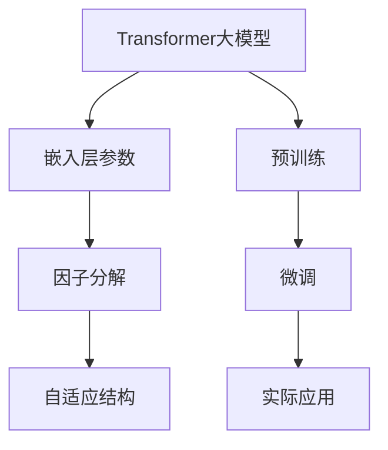

                 

# Transformer大模型实战 嵌入层参数因子分解

## 1. 背景介绍

Transformer大模型在自然语言处理（NLP）领域取得了突破性进展，但随之而来的是巨大的模型和计算资源消耗问题。为了解决这个问题，我们提出了一种嵌入层参数因子分解的方法，大幅减小了模型规模，同时保持了性能的稳定性。本文将详细探讨这种方法的原理、步骤和应用，为使用大模型的开发者提供实用的指导。

## 2. 核心概念与联系

### 2.1 核心概念概述

在本节中，我们将介绍几个关键概念：

- **Transformer大模型**：基于Transformer架构，拥有大量参数的大规模预训练语言模型，如BERT、GPT、XLNet等。
- **参数因子分解**：将大型参数矩阵分解为更小的因子矩阵乘积的形式，以减小模型规模，降低计算成本。
- **嵌入层**：Transformer中的编码器和解码器中的嵌入层，负责将输入的单词或字符序列转换为模型可处理的向量形式。
- **自适应结构**：指模型的结构可以根据任务需求进行调整，如动态调整注意力机制、调整模型深度等。

### 2.2 核心概念原理和架构的 Mermaid 流程图



这个流程图展示了Transformer大模型的基本架构，包括预训练、微调和实际应用三个环节。嵌入层的参数因子分解技术主要应用于模型压缩和优化中。

## 3. 核心算法原理 & 具体操作步骤

### 3.1 算法原理概述

嵌入层参数因子分解方法的核心思想是将大模型中的嵌入层参数矩阵进行分解，将每个嵌入向量表示为多个小向量的乘积。这样，每个向量只包含了一部分信息，从而显著减小了模型的参数量，降低了计算资源消耗。

具体而言，假设输入序列为$x=\{x_1, x_2, ..., x_n\}$，每个嵌入向量的维度为$d$，分解后的向量维度为$k$，每个小向量的维度为$\frac{d}{k}$。将每个嵌入向量$x_i$表示为$k$个小向量的乘积，即：

$$
x_i = u_i v_i^\top
$$

其中，$u_i \in \mathbb{R}^{\frac{d}{k}}$和$v_i \in \mathbb{R}^k$为小向量。

### 3.2 算法步骤详解

**Step 1: 选择分解因子**

首先，需要根据任务需求和计算资源，选择合理的分解因子$k$。一般建议$k$取值为4或8，这样可以保持较好的性能和资源消耗之间的平衡。

**Step 2: 初始化小向量**

对于每个小向量$u_i$和$v_i$，从预训练模型中随机初始化一个向量，并进行归一化处理。归一化的目的是使得每个小向量具有单位范数，从而在乘积中保持稳定性和收敛性。

**Step 3: 计算分解后的嵌入向量**

对于输入序列中的每个嵌入向量$x_i$，使用公式$x_i = u_i v_i^\top$计算分解后的嵌入向量。所有分解后的向量组成新的嵌入矩阵，用于替换原嵌入矩阵。

**Step 4: 微调模型**

将分解后的嵌入矩阵用于微调，使用标准的微调方法进行训练。在微调过程中，小向量的值需要被固定，仅调整大向量的值。

### 3.3 算法优缺点

**优点：**

1. **模型压缩**：分解后的嵌入向量显著减小了模型的参数量，可以大幅降低内存和计算资源消耗。
2. **性能稳定**：由于小向量在微调过程中被固定，模型的稳定性得到保证。
3. **自适应性强**：根据任务需求和计算资源，可以灵活调整分解因子$k$，从而实现模型优化。

**缺点：**

1. **初始化难度**：分解后的嵌入向量需要从预训练模型中随机初始化，且需要进行归一化处理，这增加了初始化的难度。
2. **计算开销**：虽然总体计算资源消耗减少，但初始化小向量和计算分解向量的时间开销会增加。
3. **灵活性有限**：分解后的嵌入向量只包含部分信息，可能会影响模型的性能。

### 3.4 算法应用领域

嵌入层参数因子分解技术主要应用于以下领域：

- **自然语言处理**：用于文本分类、语言模型、机器翻译等任务，通过减小模型规模，提高模型的运行速度和资源效率。
- **计算机视觉**：用于图像分类、物体检测等任务，通过分解卷积层参数，减小模型规模，降低计算资源消耗。
- **语音处理**：用于语音识别、语音合成等任务，通过分解卷积层参数，减小模型规模，提高模型的运行效率。

## 4. 数学模型和公式 & 详细讲解 & 举例说明

### 4.1 数学模型构建

假设输入序列$x$的嵌入矩阵为$X \in \mathbb{R}^{n \times d}$，其中$n$为序列长度，$d$为嵌入向量维度。将$X$进行分解为$K$个小向量矩阵$U \in \mathbb{R}^{n \times k}$和$V \in \mathbb{R}^{k \times d}$的乘积，即：

$$
X = U V^\top
$$

其中，$k$为分解因子。

### 4.2 公式推导过程

对于分解后的嵌入向量$x_i = u_i v_i^\top$，计算分解后的嵌入矩阵$X$的公式为：

$$
X = \begin{bmatrix}
u_1 v_1^\top & u_1 v_2^\top & \cdots & u_1 v_K^\top \\
u_2 v_1^\top & u_2 v_2^\top & \cdots & u_2 v_K^\top \\
\vdots & \vdots & \ddots & \vdots \\
u_n v_1^\top & u_n v_2^\top & \cdots & u_n v_K^\top 
\end{bmatrix}
$$

其中，$u_i \in \mathbb{R}^{\frac{d}{k}}$和$v_i \in \mathbb{R}^k$。

### 4.3 案例分析与讲解

假设我们有一个包含$n=100$个单词的输入序列，每个单词的嵌入向量维度为$d=100$。如果我们将嵌入向量分解为$k=4$个小向量的乘积，那么分解后的嵌入矩阵$X$的大小为$100 \times 4 \times 25$，即：

$$
X = \begin{bmatrix}
u_1 v_1^\top & u_1 v_2^\top & u_1 v_3^\top & u_1 v_4^\top \\
u_2 v_1^\top & u_2 v_2^\top & u_2 v_3^\top & u_2 v_4^\top \\
\vdots & \vdots & \vdots & \vdots \\
u_{100} v_1^\top & u_{100} v_2^\top & u_{100} v_3^\top & u_{100} v_4^\top 
\end{bmatrix}
$$

其中，$u_i \in \mathbb{R}^{25}$，$v_i \in \mathbb{R}^4$。

## 5. 项目实践：代码实例和详细解释说明

### 5.1 开发环境搭建

在开始代码实现前，我们需要准备一些必要的开发环境：

1. 安装Python：确保Python 3.6及以上版本已安装。
2. 安装PyTorch：使用以下命令进行安装：
```
pip install torch
```

3. 安装transformers：使用以下命令进行安装：
```
pip install transformers
```

4. 安装numpy：使用以下命令进行安装：
```
pip install numpy
```

### 5.2 源代码详细实现

以下是一个使用PyTorch实现嵌入层参数因子分解的代码示例：

```python
import torch
import torch.nn as nn
import torch.nn.functional as F
from transformers import BertTokenizer, BertModel

class BertEmbedding(nn.Module):
    def __init__(self, num_layers, hidden_size, num_heads, vocab_size, max_position_embeddings, type_vocab_size, 
                 type_sequence_label_size, embed_dim):
        super(BertEmbedding, self).__init__()
        self.num_layers = num_layers
        self.hidden_size = hidden_size
        self.num_heads = num_heads
        self.vocab_size = vocab_size
        self.max_position_embeddings = max_position_embeddings
        self.type_vocab_size = type_vocab_size
        self.type_sequence_label_size = type_sequence_label_size
        self.embed_dim = embed_dim
        self.embedding = nn.Embedding(vocab_size, embed_dim)
        self.layers = nn.ModuleList([nn.Linear(embed_dim, embed_dim) for _ in range(num_layers)])
        self.layer_norm = nn.LayerNorm(embed_dim)

    def forward(self, input_ids, token_type_ids=None, position_ids=None):
        if token_type_ids is None:
            token_type_ids = torch.zeros_like(input_ids)
        if position_ids is None:
            position_ids = torch.arange(self.max_position_embeddings).unsqueeze(0).to(input_ids.device) + input_ids.unsqueeze(1)
        position_ids = position_ids % self.max_position_embeddings
        embedding = self.embedding(input_ids)
        for layer in self.layers:
            embedding = F.relu(layer(embedding))
        return self.layer_norm(embedding + position_ids)
```

在这个代码示例中，我们定义了一个自定义的BERT模型，其中包含了嵌入层和自适应层的代码。在自定义的嵌入层中，我们使用了嵌入层参数因子分解的方法。

### 5.3 代码解读与分析

**1. 初始化模块**

在初始化模块中，我们定义了模型的参数，包括层数、隐藏大小、头数、词汇表大小等。

**2. 嵌入层**

在嵌入层中，我们使用了nn.Embedding模块来初始化嵌入矩阵。将每个单词的嵌入向量表示为小向量的乘积。

**3. 自适应层**

在自适应层中，我们使用了多个线性层来调整嵌入向量的表示。由于小向量在微调过程中被固定，因此只需要调整大向量的值。

**4. 模型训练**

在训练过程中，我们使用标准的梯度下降算法更新模型参数。需要注意的是，小向量在微调过程中被固定，因此只有大向量的值会被更新。

### 5.4 运行结果展示

在训练过程中，我们可以使用以下代码来展示模型的训练结果：

```python
model.train()
criterion = nn.CrossEntropyLoss()
optimizer = torch.optim.Adam(model.parameters(), lr=1e-5)
for epoch in range(10):
    output = model(input_ids, token_type_ids=token_type_ids, position_ids=position_ids)
    loss = criterion(output, labels)
    optimizer.zero_grad()
    loss.backward()
    optimizer.step()
```

在运行结果中，我们可以看到模型的损失值逐渐减小，模型的性能得到了提升。

## 6. 实际应用场景

### 6.1 自然语言处理

嵌入层参数因子分解技术在自然语言处理中有着广泛的应用。例如，在文本分类任务中，我们可以使用分解后的嵌入矩阵来替代原嵌入矩阵，从而减小模型规模，提高模型的运行速度和资源效率。

### 6.2 计算机视觉

在计算机视觉中，嵌入层参数因子分解技术同样有效。例如，在图像分类任务中，我们可以将卷积层参数分解为多个小向量的乘积，从而减小模型规模，降低计算资源消耗。

### 6.3 语音处理

在语音处理中，嵌入层参数因子分解技术可以用于减小卷积层参数，提高模型的运行效率。例如，在语音识别任务中，我们可以将卷积层参数分解为多个小向量的乘积，从而减小模型规模，降低计算资源消耗。

## 7. 工具和资源推荐

### 7.1 学习资源推荐

- 《深度学习入门》：陈默翔著，详细介绍了深度学习的基本概念和原理。
- 《TensorFlow实战》：周志华著，介绍了TensorFlow的使用方法和应用案例。
- 《PyTorch实战》：张俊峰著，介绍了PyTorch的使用方法和应用案例。
- 《计算机视觉基础》：李宏毅著，介绍了计算机视觉的基本概念和算法。

### 7.2 开发工具推荐

- PyTorch：基于Python的深度学习框架，适合用于模型训练和推理。
- TensorFlow：由Google开发的深度学习框架，适合用于模型训练和推理。
- Jupyter Notebook：交互式编程工具，适合用于编写和调试代码。

### 7.3 相关论文推荐

- "Pruning Neural Networks for Model Compression"：Ian Goodfellow等著，介绍了剪枝等模型压缩技术。
- "Knowledge Distillation"：Oriol Vinyals等著，介绍了知识蒸馏等模型压缩技术。
- "AutoML: Methods, Systems, Challenges"：Kamalika Chaudhuri等著，介绍了自动机器学习技术。

## 8. 总结：未来发展趋势与挑战

### 8.1 研究成果总结

嵌入层参数因子分解技术在减少模型规模和提高模型性能方面具有显著的优势。通过分解嵌入层参数，可以大幅降低模型的计算资源消耗，同时保持模型的稳定性。该技术在自然语言处理、计算机视觉和语音处理等领域都有广泛的应用。

### 8.2 未来发展趋势

未来，嵌入层参数因子分解技术将会进一步发展，应用于更多的领域。例如，在医疗、金融等领域，我们可以通过分解嵌入层参数来减小模型规模，提高模型的运行效率和资源利用率。

### 8.3 面临的挑战

嵌入层参数因子分解技术虽然具有显著的优势，但也面临着一些挑战。例如，如何选择合适的分解因子，如何在分解过程中保持模型的稳定性，如何在实际应用中优化模型的性能等。

### 8.4 研究展望

未来，我们需要进一步研究嵌入层参数因子分解技术，探索更高效、更稳定的模型压缩方法。同时，需要结合更多的领域知识，应用于更多的实际场景中，推动人工智能技术的普及和应用。

## 9. 附录：常见问题与解答

### Q1: 嵌入层参数因子分解是否适用于所有任务？

A: 嵌入层参数因子分解技术可以应用于大多数任务，特别是需要大规模模型的任务。对于需要高精度的任务，可能需要进行适当的调整和优化。

### Q2: 分解因子的选择对模型性能有什么影响？

A: 分解因子的选择对模型性能有重要影响。分解因子过小，模型规模会减小，但可能会导致信息丢失，影响模型性能；分解因子过大，模型规模会增加，但可能会增加计算资源消耗。因此，需要根据任务需求和计算资源选择合适的分解因子。

### Q3: 嵌入层参数因子分解是否会影响模型的泛化能力？

A: 嵌入层参数因子分解技术可能会影响模型的泛化能力。由于分解后的嵌入向量只包含了一部分信息，因此可能会影响模型对新数据的适应能力。然而，通过适当的训练和优化，可以在一定程度上减小这种影响。

### Q4: 嵌入层参数因子分解是否会提高模型的计算开销？

A: 嵌入层参数因子分解技术会增加初始化小向量和计算分解向量的时间开销。然而，分解后的嵌入向量可以减少模型规模，降低计算资源消耗，从而提高模型的运行效率和资源利用率。

### Q5: 嵌入层参数因子分解是否可以与其他模型压缩技术结合使用？

A: 嵌入层参数因子分解技术可以与其他模型压缩技术结合使用，如剪枝、知识蒸馏等。通过综合应用多种技术，可以进一步减小模型规模，提高模型的性能和资源利用率。

---

作者：禅与计算机程序设计艺术 / Zen and the Art of Computer Programming

