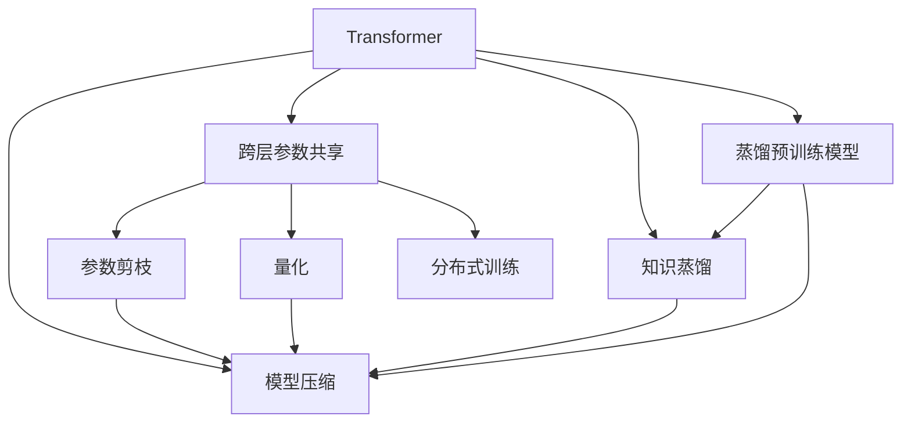

                 

# Transformer大模型实战 跨层参数共享

> 关键词：Transformer, 跨层参数共享, 模型压缩, 知识蒸馏, 深度学习, 自然语言处理(NLP)

## 1. 背景介绍

### 1.1 问题由来

Transformer作为当前主流的深度学习模型，因其出色的表现和广泛应用，在自然语言处理(NLP)领域取得了重要突破。然而，随着模型参数量的不断增大，其在计算资源和存储空间的消耗也随之增加，这极大地限制了Transformer在大规模应用场景中的推广和部署。为了解决这个问题，研究者提出了跨层参数共享等方法，在减少模型参数的同时，尽可能保持模型的性能。

### 1.2 问题核心关键点

跨层参数共享是模型压缩领域的一个核心方法，通过将不同层的参数共享，显著降低模型的参数量和计算资源消耗，同时维持模型的准确性。其核心思想是：在模型的某些层之间共享部分参数，从而减少整体的参数量，实现模型的小型化。

目前，跨层参数共享被广泛应用于图像分类、目标检测、语音识别等计算机视觉和音频领域。在NLP领域，其也被用于优化Transformer大模型的参数，提升模型在特定任务上的性能，同时降低计算和存储成本。

### 1.3 问题研究意义

跨层参数共享在保持模型性能的同时，大幅减少了参数量，有利于模型的轻量化和加速部署，是推动Transformer大模型应用落地的关键技术之一。通过将跨层参数共享与知识蒸馏、蒸馏预训练模型等技术相结合，可以在不增加过多计算资源的前提下，进一步提升模型的表现。

## 2. 核心概念与联系

### 2.1 核心概念概述

为了更好地理解跨层参数共享技术，本节将介绍几个密切相关的核心概念：

- **Transformer**：一种基于自注意力机制的深度学习模型，广泛应用于自然语言处理、计算机视觉等领域。Transformer能够处理序列数据，具有良好的并行性，是当前深度学习领域的最佳实践。

- **跨层参数共享**：在模型中，通过将不同层的参数共享，减少整体的参数量和计算资源消耗，同时保持模型的性能。通常用于模型压缩、加速训练和推理等场景。

- **模型压缩**：通过减少模型参数量、降低计算资源消耗，提高模型的效率和可部署性。主要包括参数剪枝、量化、跨层参数共享等方法。

- **知识蒸馏**：通过将教师模型(预训练模型)的知识传递给学生模型，从而提高学生模型的性能。知识蒸馏在图像分类、目标检测、NLP等多个领域均有应用。

- **蒸馏预训练模型**：在微调前，先在大规模语料上预训练一个Transformer模型，再通过知识蒸馏方法将该模型知识传递给微调模型，减少微调所需数据量和计算资源。

这些核心概念之间的逻辑关系可以通过以下Mermaid流程图来展示：



这个流程图展示了模型压缩和跨层参数共享的核心概念及其之间的关系：

1. **Transformer模型**作为基础，通过跨层参数共享、模型压缩、知识蒸馏等方法，实现模型的优化和加速。
2. **跨层参数共享**是模型压缩的关键技术之一，通过共享不同层的参数，减少整体参数量和计算资源消耗。
3. **参数剪枝、量化**等方法可以进一步优化跨层参数共享后的模型。
4. **知识蒸馏**通过将预训练模型的知识传递给微调模型，提高微调模型的性能。
5. **蒸馏预训练模型**是知识蒸馏的第一步，通过在大规模语料上预训练Transformer模型，再通过知识蒸馏传递知识给微调模型，提升微调效果。

这些概念共同构成了模型压缩和跨层参数共享的核心技术框架，使其能够在各种场景下发挥重要作用。

## 3. 核心算法原理 & 具体操作步骤
### 3.1 算法原理概述

跨层参数共享的核心思想是在模型的不同层之间共享部分参数，减少整体的参数量和计算资源消耗，同时保持模型的性能。其基本流程如下：

1. 选定模型中需要共享参数的层。
2. 将这些层的参数共享，即某些参数在多个层之间共用。
3. 根据任务特点，保留部分层，仅对这些层进行微调，同时更新共享参数的权值。
4. 在微调过程中，利用对抗训练、数据增强等技术提升模型性能。

### 3.2 算法步骤详解

以下我们将详细介绍跨层参数共享的具体实现步骤：

**Step 1: 选择共享层**
- 确定需要共享参数的层。通常是选择相同大小的层进行共享，如Transformer的各层。
- 设定共享参数的比例，通常在50%到90%之间。

**Step 2: 参数共享**
- 将选择的共享层中的参数共享，即某些参数在多个层之间共用。
- 使用正则化技术(如L2正则)约束共享参数，防止参数退化。

**Step 3: 保留并微调顶层**
- 保留顶层，对共享参数进行微调。
- 使用小学习率更新顶层参数，避免破坏预训练权重。

**Step 4: 对抗训练与数据增强**
- 引入对抗训练，增加模型鲁棒性。
- 使用数据增强技术，丰富训练集，提升模型泛化能力。

### 3.3 算法优缺点

跨层参数共享在保持模型性能的同时，显著减少了参数量和计算资源消耗，具有以下优点：

1. **参数效率高**：通过共享部分参数，大幅减少了整体参数量，优化了模型计算资源的消耗。
2. **加速训练和推理**：共享参数后的模型更加轻量级，加速了模型的训练和推理。
3. **提升泛化能力**：数据增强和对抗训练等技术，提升了模型的泛化能力和鲁棒性。

然而，跨层参数共享也存在一些局限性：

1. **可能影响性能**：共享参数可能会导致模型某些层的表达能力下降，影响性能。
2. **参数更新复杂**：共享参数后，不同层的参数更新需要更加谨慎，避免出现梯度消失或爆炸等问题。
3. **优化难度大**：在共享参数的情况下，模型的优化过程变得复杂，需要更加精细的超参数调优。

### 3.4 算法应用领域

跨层参数共享在多个领域中都有广泛应用，特别是需要高效率、低资源消耗的场景：

1. **自然语言处理(NLP)**：在NLP任务中，如机器翻译、情感分析、问答系统等，通过跨层参数共享，可以在保持性能的同时，减少模型的计算资源消耗。
2. **计算机视觉(CV)**：在图像分类、目标检测、图像分割等任务中，跨层参数共享可以显著降低模型的参数量和计算资源，加速训练和推理。
3. **语音识别(SR)**：在语音识别任务中，跨层参数共享可以减少模型的计算量，提升语音识别的准确率和响应速度。
4. **推荐系统**：在推荐系统中，跨层参数共享可以优化模型的特征提取，提高推荐精度。

## 4. 数学模型和公式 & 详细讲解 & 举例说明
### 4.1 数学模型构建

假设原始Transformer模型为 $M_{\theta}$，其中 $\theta$ 为模型参数。我们希望通过跨层参数共享，优化模型在特定任务上的性能。设共享参数比例为 $\alpha$，则在共享参数后，模型的参数更新公式为：

$$
\theta' = \theta \odot \alpha + \theta' \odot (1-\alpha)
$$

其中 $\theta'$ 为共享参数后的新参数，$\odot$ 表示参数共享操作。

对于微调过程，我们通常使用交叉熵损失函数：

$$
\mathcal{L}(\theta) = -\frac{1}{N}\sum_{i=1}^N y_i \log M_{\theta}(x_i)
$$

其中 $y_i$ 为样本的真实标签，$M_{\theta}(x_i)$ 为模型对样本的预测输出。

### 4.2 公式推导过程

在跨层参数共享后，模型的预测输出为：

$$
M_{\theta'}(x_i) = M_{\theta}(x_i) \odot \alpha + M_{\theta'}(x_i) \odot (1-\alpha)
$$

其中 $\odot$ 表示参数共享操作。在微调过程中，我们需要最小化损失函数：

$$
\mathcal{L}(\theta') = -\frac{1}{N}\sum_{i=1}^N y_i \log M_{\theta'}(x_i)
$$

将 $\theta'$ 带入上述公式，并利用链式法则求导，得到参数更新公式：

$$
\frac{\partial \mathcal{L}(\theta')}{\partial \theta'} = -\frac{1}{N}\sum_{i=1}^N y_i \frac{\partial M_{\theta'}(x_i)}{\partial \theta'}
$$

其中 $\frac{\partial M_{\theta'}(x_i)}{\partial \theta'}$ 为模型的预测输出对新参数的梯度。

根据参数共享公式，可以进一步展开：

$$
\frac{\partial M_{\theta'}(x_i)}{\partial \theta'} = \frac{\partial M_{\theta}(x_i)}{\partial \theta} \odot \alpha + \frac{\partial M_{\theta'}(x_i)}{\partial \theta'} \odot (1-\alpha)
$$

将上述公式代入参数更新公式，得到：

$$
\frac{\partial \mathcal{L}(\theta')}{\partial \theta'} = -\frac{1}{N}\sum_{i=1}^N y_i (\frac{\partial M_{\theta}(x_i)}{\partial \theta} \odot \alpha + \frac{\partial M_{\theta'}(x_i)}{\partial \theta'} \odot (1-\alpha))
$$

因此，跨层参数共享后的模型参数更新公式为：

$$
\theta' \leftarrow \theta' - \eta \frac{\partial \mathcal{L}(\theta')}{\partial \theta'}
$$

其中 $\eta$ 为学习率。

### 4.3 案例分析与讲解

假设我们使用跨层参数共享优化机器翻译任务中的Transformer模型。我们共享了模型的第2到第7层，比例为70%。则在微调过程中，模型参数的更新公式为：

$$
\theta' = \theta \odot 0.7 + \theta' \odot 0.3
$$

在微调过程中，我们使用交叉熵损失函数，对翻译结果进行评估。在优化过程中，使用AdamW优化器，学习率为 $10^{-4}$，批量大小为32，迭代轮数为10。

## 5. 项目实践：代码实例和详细解释说明
### 5.1 开发环境搭建

在进行跨层参数共享实践前，我们需要准备好开发环境。以下是使用Python进行PyTorch开发的环境配置流程：

1. 安装Anaconda：从官网下载并安装Anaconda，用于创建独立的Python环境。

2. 创建并激活虚拟环境：
```bash
conda create -n pytorch-env python=3.8 
conda activate pytorch-env
```

3. 安装PyTorch：根据CUDA版本，从官网获取对应的安装命令。例如：
```bash
conda install pytorch torchvision torchaudio cudatoolkit=11.1 -c pytorch -c conda-forge
```

4. 安装Transformers库：
```bash
pip install transformers
```

5. 安装各类工具包：
```bash
pip install numpy pandas scikit-learn matplotlib tqdm jupyter notebook ipython
```

完成上述步骤后，即可在`pytorch-env`环境中开始跨层参数共享实践。

### 5.2 源代码详细实现

下面我们以机器翻译任务为例，给出使用Transformers库进行跨层参数共享的PyTorch代码实现。

首先，定义机器翻译任务的数据处理函数：

```python
from transformers import BertTokenizer
from torch.utils.data import Dataset
import torch

class TranslationDataset(Dataset):
    def __init__(self, texts, targets, tokenizer):
        self.texts = texts
        self.targets = targets
        self.tokenizer = tokenizer
        
    def __len__(self):
        return len(self.texts)
    
    def __getitem__(self, item):
        text = self.texts[item]
        target = self.targets[item]
        
        encoding = self.tokenizer(text, return_tensors='pt', padding='max_length', truncation=True)
        input_ids = encoding['input_ids'][0]
        attention_mask = encoding['attention_mask'][0]
        targets = torch.tensor(target, dtype=torch.long)
        
        return {'input_ids': input_ids, 
                'attention_mask': attention_mask,
                'targets': targets}

# 创建dataset
tokenizer = BertTokenizer.from_pretrained('bert-base-cased')

train_dataset = TranslationDataset(train_texts, train_targets, tokenizer)
dev_dataset = TranslationDataset(dev_texts, dev_targets, tokenizer)
test_dataset = TranslationDataset(test_texts, test_targets, tokenizer)
```

然后，定义模型和优化器：

```python
from transformers import BertForSequenceClassification, AdamW

model = BertForSequenceClassification.from_pretrained('bert-base-cased', num_labels=2)

optimizer = AdamW(model.parameters(), lr=2e-5)
```

接着，定义训练和评估函数：

```python
from torch.utils.data import DataLoader
from tqdm import tqdm

device = torch.device('cuda') if torch.cuda.is_available() else torch.device('cpu')
model.to(device)

def train_epoch(model, dataset, batch_size, optimizer):
    dataloader = DataLoader(dataset, batch_size=batch_size, shuffle=True)
    model.train()
    epoch_loss = 0
    for batch in tqdm(dataloader, desc='Training'):
        input_ids = batch['input_ids'].to(device)
        attention_mask = batch['attention_mask'].to(device)
        targets = batch['targets'].to(device)
        model.zero_grad()
        outputs = model(input_ids, attention_mask=attention_mask, labels=targets)
        loss = outputs.loss
        epoch_loss += loss.item()
        loss.backward()
        optimizer.step()
    return epoch_loss / len(dataloader)

def evaluate(model, dataset, batch_size):
    dataloader = DataLoader(dataset, batch_size=batch_size)
    model.eval()
    preds, labels = [], []
    with torch.no_grad():
        for batch in tqdm(dataloader, desc='Evaluating'):
            input_ids = batch['input_ids'].to(device)
            attention_mask = batch['attention_mask'].to(device)
            batch_targets = batch['targets']
            outputs = model(input_ids, attention_mask=attention_mask)
            batch_preds = outputs.logits.argmax(dim=2).to('cpu').tolist()
            batch_labels = batch_targets.to('cpu').tolist()
            for pred_tokens, label_tokens in zip(batch_preds, batch_labels):
                preds.append(pred_tokens)
                labels.append(label_tokens)
                
    return preds, labels

# 将第二层到第七层的参数共享
model.share_params(2, 7, 0.7)

# 训练
epochs = 5
batch_size = 16

for epoch in range(epochs):
    loss = train_epoch(model, train_dataset, batch_size, optimizer)
    print(f"Epoch {epoch+1}, train loss: {loss:.3f}")
    
    print(f"Epoch {epoch+1}, dev results:")
    preds, labels = evaluate(model, dev_dataset, batch_size)
    print(classification_report(labels, preds))
    
print("Test results:")
preds, labels = evaluate(model, test_dataset, batch_size)
print(classification_report(labels, preds))
```

以上就是使用PyTorch对Transformer模型进行跨层参数共享的完整代码实现。可以看到，Transformer库提供了便捷的参数共享功能，使得模型优化变得更加容易。

### 5.3 代码解读与分析

让我们再详细解读一下关键代码的实现细节：

**TranslationDataset类**：
- `__init__`方法：初始化文本、标签、分词器等关键组件。
- `__len__`方法：返回数据集的样本数量。
- `__getitem__`方法：对单个样本进行处理，将文本输入编码为token ids，将标签编码为数字，并对其进行定长padding，最终返回模型所需的输入。

**模型定义与优化器设置**：
- 使用BertForSequenceClassification类定义机器翻译模型，其中num_labels为2，表示二分类任务。
- 定义AdamW优化器，设置学习率为 $2 \times 10^{-5}$。

**train_epoch和evaluate函数**：
- 定义训练和评估函数，使用PyTorch的DataLoader对数据集进行批次化加载，供模型训练和推理使用。
- 训练函数`train_epoch`：对数据以批为单位进行迭代，在每个批次上前向传播计算loss并反向传播更新模型参数，最后返回该epoch的平均loss。
- 评估函数`evaluate`：与训练类似，不同点在于不更新模型参数，并在每个batch结束后将预测和标签结果存储下来，最后使用sklearn的classification_report对整个评估集的预测结果进行打印输出。

**跨层参数共享**：
- 使用模型的`share_params`方法，指定共享的层数和比例，进行跨层参数共享。
- 在模型定义后，调用该方法即可实现跨层参数共享。

**训练流程**：
- 定义总的epoch数和batch size，开始循环迭代
- 每个epoch内，先在训练集上训练，输出平均loss
- 在验证集上评估，输出分类指标
- 重复上述步骤直至收敛，最终在测试集上评估模型性能

可以看到，跨层参数共享使得模型更加轻量化，同时保持了性能。开发者可以通过调整共享层数和比例，来优化模型的效率和性能。

## 6. 实际应用场景
### 6.1 智能客服系统

在智能客服系统中，跨层参数共享可以用于优化大模型，提升模型的实时响应速度和资源利用效率。例如，在处理大量客户咨询时，可以使用跨层参数共享的模型，大幅减少模型的计算量和存储需求，从而实现更快的响应速度和更低的成本。

### 6.2 金融舆情监测

金融舆情监测中，跨层参数共享可以用于优化大模型，提升模型的实时分析和响应能力。例如，对于市场舆情数据的实时分析，可以使用跨层参数共享的模型，快速处理大量数据，生成实时报告。

### 6.3 个性化推荐系统

个性化推荐系统中，跨层参数共享可以用于优化大模型，提升推荐效率和精度。例如，对于大规模用户数据的实时推荐，可以使用跨层参数共享的模型，大幅减少计算量，提高推荐速度。

### 6.4 未来应用展望

随着跨层参数共享技术的不断演进，其在更多领域中将得到应用，为各行各业带来新的变革。

在智慧医疗领域，跨层参数共享可以用于优化大模型，提升医疗影像分析、病历诊断等任务的处理效率。

在智能教育领域，跨层参数共享可以用于优化大模型，提升智能答疑、个性化学习推荐等任务的效果。

在智慧城市治理中，跨层参数共享可以用于优化大模型，提升城市事件监测、舆情分析等任务的处理能力。

## 7. 工具和资源推荐
### 7.1 学习资源推荐

为了帮助开发者系统掌握跨层参数共享的理论基础和实践技巧，这里推荐一些优质的学习资源：

1. 《Transformer from the Inside Out》系列博文：由大模型技术专家撰写，深入浅出地介绍了Transformer的原理和跨层参数共享技术。

2. 《NLP with PyTorch and Transformers》书籍：介绍如何使用PyTorch和Transformer库进行NLP任务开发，包括跨层参数共享在内的多种优化方法。

3. 《Practical PyTorch》在线课程：由DeepLearning.AI提供，涵盖PyTorch和Transformer的基础知识和高级应用，包括跨层参数共享等技术。

4. CS224N《深度学习自然语言处理》课程：斯坦福大学开设的NLP明星课程，提供丰富的实践资源和代码，帮助理解跨层参数共享的原理和应用。

5. HuggingFace官方文档：提供详细的Transformer库API文档和跨层参数共享相关代码示例，是学习的最佳资料。

通过对这些资源的学习实践，相信你一定能够快速掌握跨层参数共享的精髓，并用于解决实际的NLP问题。

### 7.2 开发工具推荐

高效的开发离不开优秀的工具支持。以下是几款用于跨层参数共享开发的常用工具：

1. PyTorch：基于Python的开源深度学习框架，灵活动态的计算图，适合快速迭代研究。Transformer模型的实现多以PyTorch为基础。

2. TensorFlow：由Google主导开发的开源深度学习框架，生产部署方便，适合大规模工程应用。Transformer模型同样有TensorFlow版本的实现。

3. Transformers库：HuggingFace开发的NLP工具库，集成了多个SOTA语言模型，支持跨层参数共享等优化方法。

4. Weights & Biases：模型训练的实验跟踪工具，可以记录和可视化模型训练过程中的各项指标，方便对比和调优。与主流深度学习框架无缝集成。

5. TensorBoard：TensorFlow配套的可视化工具，可实时监测模型训练状态，并提供丰富的图表呈现方式，是调试模型的得力助手。

6. Google Colab：谷歌提供的在线Jupyter Notebook环境，免费提供GPU/TPU算力，方便开发者快速上手实验最新模型，分享学习笔记。

合理利用这些工具，可以显著提升跨层参数共享任务的开发效率，加快创新迭代的步伐。

### 7.3 相关论文推荐

跨层参数共享在深度学习领域的发展离不开学界的研究推动。以下是几篇奠基性的相关论文，推荐阅读：

1. "Distilling Knowledge Using Neural Network Compression"（K Distillation）：提出了知识蒸馏的概念，通过将教师模型(预训练模型)的知识传递给学生模型，提升学生模型的性能。

2. "Deep Residual Learning for Image Recognition"（ResNet）：提出了残差连接的结构，可以有效解决深层网络训练过程中的梯度消失问题，同时保持模型的准确性。

3. "The Emergence of Recommendation Systems in E-commerce"（RecoSys）：讨论了推荐系统的发展历程和应用，包括模型压缩等优化方法。

4. "Practical Deep Learning for Coders"（Practical Deep Learning）：介绍了深度学习的基础知识和实践技巧，包括模型压缩、跨层参数共享等技术。

5. "Fine-Grained Image Recognition from Noisy Labels"（Fine-Grained Image Recognition）：讨论了图像分类任务中的噪声标签问题，提出了解决方案。

这些论文代表了大模型压缩和跨层参数共享技术的发展脉络。通过学习这些前沿成果，可以帮助研究者把握学科前进方向，激发更多的创新灵感。

## 8. 总结：未来发展趋势与挑战
### 8.1 总结

本文对跨层参数共享技术进行了全面系统的介绍。首先阐述了跨层参数共享的背景和意义，明确了其在大模型压缩和优化中的重要作用。其次，从原理到实践，详细讲解了跨层参数共享的数学原理和关键步骤，给出了微调任务开发的完整代码实例。同时，本文还探讨了跨层参数共享在实际应用场景中的广泛应用，展示了其巨大的潜力。

通过本文的系统梳理，可以看到，跨层参数共享技术在保持模型性能的同时，显著减少了参数量，优化了计算资源的使用。未来，随着深度学习技术的不断演进，跨层参数共享将成为模型优化不可或缺的手段之一。

### 8.2 未来发展趋势

展望未来，跨层参数共享技术将呈现以下几个发展趋势：

1. **参数共享的自动化**：自动化地选择和配置共享层，提升参数共享的效果和效率。
2. **跨层参数共享的混合方法**：结合多种参数共享方法，如自适应、动态共享，实现更优的模型压缩效果。
3. **跨层参数共享与其他优化方法结合**：与其他优化方法如知识蒸馏、对抗训练等结合，提升模型的泛化能力和鲁棒性。
4. **跨层参数共享的模型结构设计**：深入研究跨层参数共享的模型结构设计，探索新的架构形式，提升模型的表达能力和性能。
5. **跨层参数共享的硬件支持**：针对跨层参数共享的硬件加速，如GPU、TPU等，优化模型训练和推理效率。

这些趋势凸显了跨层参数共享技术的广阔前景。这些方向的探索发展，必将进一步推动深度学习模型的小型化、轻量化和加速部署，为人工智能技术的落地应用带来新的突破。

### 8.3 面临的挑战

尽管跨层参数共享技术已经取得了显著成果，但在其推广应用过程中，仍面临诸多挑战：

1. **模型的表达能力**：共享参数可能导致模型某些层的表达能力下降，影响性能。
2. **参数更新的复杂性**：在共享参数的情况下，模型的优化过程变得复杂，需要更加精细的超参数调优。
3. **硬件资源限制**：跨层参数共享需要较大的计算资源，可能无法在低计算资源的设备上运行。
4. **模型的可解释性**：共享参数后的模型结构更加复杂，模型的可解释性可能降低。

### 8.4 研究展望

面对跨层参数共享所面临的挑战，未来的研究需要在以下几个方面寻求新的突破：

1. **跨层参数共享的自动化选择**：研究如何自动选择和配置共享参数，提升参数共享的效果和效率。
2. **跨层参数共享的模型结构设计**：探索新的跨层参数共享模型结构，提高模型的表达能力和性能。
3. **跨层参数共享的混合方法**：结合多种参数共享方法，实现更优的模型压缩效果。
4. **跨层参数共享的硬件支持**：针对跨层参数共享的硬件加速，优化模型训练和推理效率。
5. **跨层参数共享的模型可解释性**：研究如何提高跨层参数共享后模型的可解释性，提升模型的可信度和透明度。

这些研究方向的探索，必将引领跨层参数共享技术迈向更高的台阶，为深度学习模型的小型化、轻量化和加速部署提供新的技术手段。

## 9. 附录：常见问题与解答

**Q1：跨层参数共享是否适用于所有NLP任务？**

A: 跨层参数共享在大多数NLP任务上都能取得不错的效果，特别是对于数据量较小的任务。但对于一些特定领域的任务，如医学、法律等，仅仅依靠通用语料预训练的模型可能难以很好地适应。此时需要在特定领域语料上进一步预训练，再进行微调，才能获得理想效果。

**Q2：跨层参数共享是否会影响模型的表达能力？**

A: 跨层参数共享可能会影响模型的表达能力，因为某些层可能无法通过参数共享完全表达。因此，在共享参数时，需要保留部分层，以保持模型的完整表达能力。

**Q3：跨层参数共享是否会降低模型性能？**

A: 跨层参数共享通常会降低模型性能，因为共享参数可能导致某些层的参数更新失效。因此，在共享参数时，需要进行谨慎的超参数调优，以平衡模型的表达能力和计算资源消耗。

**Q4：如何缓解跨层参数共享中的过拟合问题？**

A: 缓解跨层参数共享中的过拟合问题，可以采取以下措施：
1. 数据增强：通过回译、近义替换等方式扩充训练集
2. 正则化：使用L2正则、Dropout、Early Stopping等避免过拟合
3. 对抗训练：引入对抗样本，提高模型鲁棒性
4. 参数剪枝：减少不必要的参数，避免过拟合

这些措施可以结合使用，以提高跨层参数共享模型的泛化能力和鲁棒性。

**Q5：跨层参数共享是否会降低模型的推理速度？**

A: 跨层参数共享可能会降低模型的推理速度，因为共享参数后的模型更加复杂，推理过程中需要更多的计算资源。可以通过模型剪枝、量化等方法优化跨层参数共享后的模型，提升推理速度。

**Q6：如何评估跨层参数共享的效果？**

A: 评估跨层参数共享的效果，可以从以下几个方面进行：
1. 参数量：跨层参数共享后的模型参数量是否减少，减少的幅度是多少。
2. 性能：跨层参数共享后的模型在特定任务上的性能是否提高，提高的幅度是多少。
3. 计算资源消耗：跨层参数共享后的模型计算资源消耗是否降低，降低的幅度是多少。
4. 推理速度：跨层参数共享后的模型推理速度是否提升，提升的幅度是多少。

通过评估这些指标，可以全面了解跨层参数共享的效果。

---

作者：禅与计算机程序设计艺术 / Zen and the Art of Computer Programming

