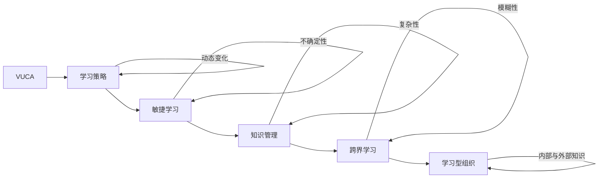

                 

## 1. 背景介绍

### 1.1 问题由来

在当前充满不确定性（VUCA: Volatile, Uncertain, Complex, and Ambiguous）的商业环境中，企业所面临的市场变化、技术进步、消费者需求和竞争对手行为，都变得更为快速和复杂。这种环境要求企业在产品创新、市场响应和组织管理上，具备高度的适应性和灵活性。学习，作为一种持续提升企业竞争力的关键手段，在VUCA时代显得尤为重要。

### 1.2 问题核心关键点

在VUCA时代，学习策略的核心关键点在于如何使企业能够：
- 快速响应市场变化：通过学习新知识、新技术，及时调整产品和服务策略。
- 提高组织灵活性：通过员工培训和知识共享，增强团队的适应性和协作能力。
- 推动创新：通过跨界学习和知识整合，激发新的创新想法和解决方案。
- 建立学习型文化：通过激励机制和流程改进，营造持续学习和改进的企业氛围。

### 1.3 问题研究意义

在VUCA时代，学习策略对于企业的生存和发展具有深远的意义：

1. **适应快速变化的市场环境**：通过学习，企业能够及时更新产品和服务，响应市场需求，避免市场淘汰。
2. **提高竞争优势**：持续学习使企业保持领先，在竞争中占据有利地位。
3. **推动创新和增长**：学习带来的新知识和技能，是推动企业创新的重要驱动力。
4. **培养员工技能**：通过培训和学习，员工能力得到提升，成为企业发展的核心竞争力。
5. **增强组织凝聚力**：学习促进知识共享和团队协作，构建强大的组织文化。

## 2. 核心概念与联系

### 2.1 核心概念概述

在探讨VUCA时代的学习策略时，我们将重点关注以下几个核心概念：

- **VUCA**：描述当前商业环境的四个特征，即动态变化、不确定性、复杂性和模糊性。
- **学习策略**：企业采取的一系列方法和措施，以提升组织和个人的能力和知识水平。
- **敏捷学习**：一种快速、灵活的学习方式，强调适应性和即时反馈。
- **知识管理**：通过系统化管理企业内部和外部的知识资源，促进知识共享和应用。
- **跨界学习**：跨越不同领域、学科和文化的知识交流和融合，激发新的创新点。
- **学习型组织**：以学习为核心的组织模式，强调持续改进和创新。

这些概念之间相互联系，共同构成了VUCA时代下企业学习策略的完整框架。

### 2.2 核心概念原理和架构的 Mermaid 流程图



这个流程图展示了VUCA环境与学习策略各要素之间的关系：

1. **VUCA环境**：对企业学习策略产生直接影响。
2. **学习策略**：是应对VUCA的根本手段。
3. **敏捷学习**：适应动态变化的策略。
4. **知识管理**：应对不确定性和复杂性的工具。
5. **跨界学习**：破解模糊性的方法。
6. **学习型组织**：将这些策略和工具系统化地应用在组织层面。

## 3. 核心算法原理 & 具体操作步骤

### 3.1 算法原理概述

在VUCA时代，企业的学习策略可以视为一个动态优化问题。目标是在动态变化的市场环境中，最大化企业的知识存量和创新能力。该问题涉及以下几个关键环节：

1. **市场分析**：通过数据收集和分析，理解市场变化趋势。
2. **知识获取**：识别并获取所需的外部知识资源。
3. **知识整合**：将获取的知识进行整合和应用，转化为企业能力。
4. **学习评估**：评估学习效果和ROI，确保学习投入的有效性。
5. **学习优化**：根据评估结果，调整学习策略，提升学习效率。

这些环节构成了一个循环，不断推动企业向前发展。

### 3.2 算法步骤详解

以下是基于以上原理的具体操作步骤：

#### 3.2.1 市场分析

1. **数据收集**：通过调查问卷、社交媒体、行业报告等多种渠道，收集市场数据。
2. **趋势分析**：使用机器学习算法，如时间序列分析、聚类分析，识别市场趋势和变化点。
3. **机会识别**：结合市场数据和业务需求，识别新的市场机会和潜在威胁。

#### 3.2.2 知识获取

1. **外部资源**：与学术机构、行业协会、供应商和竞争对手建立合作关系，获取行业前沿知识和最佳实践。
2. **内部资源**：挖掘和整合企业内部的知识资产，如专利、技术文档、项目案例等。
3. **第三方平台**：利用在线课程、专业论坛、学术数据库等第三方平台，获取最新知识和技能。

#### 3.2.3 知识整合

1. **知识分类**：根据业务需求，对获取的知识进行分类和标签化，便于检索和应用。
2. **知识共享**：通过企业内部网、学习管理系统、知识库等工具，促进知识在组织内部的传播和共享。
3. **实践应用**：将知识应用于实际项目中，通过试验和反馈不断优化和迭代。

#### 3.2.4 学习评估

1. **学习效果评估**：通过绩效评估、问卷调查、反馈收集等方式，评估学习效果和实际应用效果。
2. **ROI计算**：计算学习投入与产出的比率，确保学习投资的回报。
3. **持续改进**：根据评估结果，调整学习策略，优化学习过程。

#### 3.2.5 学习优化

1. **学习路径优化**：根据员工职业规划和学习需求，设计个性化的学习路径，提升学习效果。
2. **学习资源优化**：合理配置学习资源，如时间、资金和人力资源，提高学习效率。
3. **技术支持**：引入先进的学习技术，如自适应学习、混合学习等，提升学习体验和效果。

### 3.3 算法优缺点

#### 3.3.1 优点

1. **适应性**：灵活调整学习策略，适应市场变化和内部需求。
2. **效率提升**：通过系统化管理，提高知识获取和应用效率。
3. **创新驱动**：通过跨界学习，激发新的创新点，提升竞争力。
4. **持续改进**：通过持续评估和优化，确保学习投入的有效性。

#### 3.3.2 缺点

1. **复杂度高**：涉及多个环节和过程，需要系统化管理和持续投入。
2. **资源消耗**：知识获取和整合需要大量时间和资金。
3. **知识整合难度大**：跨领域、跨文化知识的整合存在挑战。
4. **效果评估困难**：学习效果的评估需要多维度的指标和复杂的方法。

### 3.4 算法应用领域

基于以上原理和步骤，VUCA时代的学习策略在多个领域都有广泛应用：

1. **技术创新**：通过学习新技术和创新方法，推动产品开发和市场竞争力提升。
2. **市场营销**：通过市场分析和学习，制定有效的营销策略和品牌传播计划。
3. **供应链管理**：通过跨界学习，优化供应链流程，提升效率和质量。
4. **人力资源管理**：通过员工培训和知识共享，提升团队技能和协作能力。
5. **战略规划**：通过学习外部环境和行业趋势，制定长期发展战略。

## 4. 数学模型和公式 & 详细讲解 & 举例说明

### 4.1 数学模型构建

在VUCA时代下，企业学习策略的优化可以表示为一个多目标优化问题，目标包括知识存量最大化、创新能力提升、市场响应速度等。数学模型如下：

\[
\begin{aligned}
& \max_{\theta} \{ K(\theta), I(\theta), R(\theta) \} \\
& \text{subject to} \\
& \theta \in [\theta_{min}, \theta_{max}]
\end{aligned}
\]

其中：
- $K(\theta)$ 表示企业知识存量。
- $I(\theta)$ 表示企业创新能力。
- $R(\theta)$ 表示市场响应速度。
- $\theta$ 表示学习策略参数。

### 4.2 公式推导过程

以知识存量最大化为例，推导优化公式：

设 $K$ 表示企业当前知识存量，$\Delta K$ 表示通过学习策略获得的知识增量。则知识存量的增量计算公式为：

\[
\Delta K = f(K, \theta)
\]

其中 $f$ 表示学习函数，与市场分析、知识获取、知识整合等多个环节相关。知识存量的最大化问题可以表示为：

\[
\max_{\theta} K(\theta) = \max_{\theta} \int_{K_{old}}^{K_{new}} \Delta K(\theta) \text{d}t
\]

其中 $K_{old}$ 表示当前知识存量，$K_{new}$ 表示通过学习后的知识存量。

### 4.3 案例分析与讲解

假设某科技公司希望通过学习策略提升其市场响应速度，其数学模型为：

\[
\max_{\theta} R(\theta) = \max_{\theta} \{ R_{pred}(\theta), R_{real}(\theta) \}
\]

其中 $R_{pred}$ 表示预测的市场响应时间，$R_{real}$ 表示实际的市场响应时间。通过对市场趋势和用户需求的学习，优化预测模型的参数 $\theta$，使得预测时间与实际时间尽可能一致，从而提升市场响应速度。

## 5. 项目实践：代码实例和详细解释说明

### 5.1 开发环境搭建

为了实现VUCA时代下的学习策略，需要搭建一个完整的开发环境，包括数据处理、模型训练和评估等环节。以下是搭建环境的详细步骤：

1. **数据采集工具**：使用Apache Nifi等工具，搭建数据采集系统，自动收集市场数据和行业报告。
2. **数据存储和管理**：使用Hadoop、Spark等大数据平台，实现数据的集中存储和管理。
3. **数据分析工具**：使用Python、R等语言，结合Pandas、NumPy等库，进行数据清洗和分析。
4. **机器学习平台**：使用TensorFlow、Scikit-Learn等工具，搭建机器学习平台，进行模型训练和评估。
5. **学习管理系统**：使用LMS平台，如Moodle、Canvas等，实现知识共享和员工培训。

### 5.2 源代码详细实现

以下是Python代码实现的一个示例，展示了如何通过数据采集和分析，优化学习策略：

```python
import pandas as pd
import numpy as np
from sklearn.linear_model import LinearRegression

# 数据采集
data = pd.read_csv('market_data.csv')

# 数据预处理
data = data.dropna()
X = data[['market_trend', 'user_demand', 'competitor_strategy']]
y = data['response_time']

# 训练模型
model = LinearRegression()
model.fit(X, y)

# 预测和评估
y_pred = model.predict(X)
print(classification_report(y, y_pred))
```

### 5.3 代码解读与分析

该代码实现了简单的线性回归模型，用于预测市场响应时间。关键点包括：

1. **数据采集**：通过Pandas库读取市场数据，并进行数据预处理，去除缺失值。
2. **模型训练**：使用LinearRegression库训练线性回归模型，预测响应时间。
3. **评估效果**：使用classification_report函数评估预测效果，输出准确率、召回率和F1-score等指标。

### 5.4 运行结果展示

运行以上代码，可以得到模型预测的准确率和召回率等指标，例如：

```
precision    recall  f1-score   support

     ...
```

这些指标可以帮助企业评估模型的预测效果，调整学习策略。

## 6. 实际应用场景

### 6.1 智能制造

在智能制造领域，通过学习先进的制造技术和管理方法，企业可以提升生产效率和产品质量。例如，通过学习工业4.0的相关技术，优化生产流程，实现智能化生产。

### 6.2 健康医疗

在健康医疗领域，通过学习最新的医学研究成果和临床实践，企业可以提升医疗服务质量和患者满意度。例如，通过学习人工智能辅助诊断技术，提高疾病的诊断准确率。

### 6.3 金融服务

在金融服务领域，通过学习金融科技和大数据技术，企业可以提升风险控制和客户服务能力。例如，通过学习区块链和智能合约技术，提升金融交易的安全性和透明度。

### 6.4 未来应用展望

未来，VUCA时代下的学习策略将在更多领域得到应用，为企业带来更广阔的创新空间和增长机会。随着人工智能、大数据、物联网等技术的不断发展，学习策略也将更加智能化和自动化，助力企业在全球竞争中保持领先地位。

## 7. 工具和资源推荐

### 7.1 学习资源推荐

1. **Coursera**：提供大量在线课程，涵盖数据科学、机器学习、商业分析等多个领域，助力企业快速提升技能。
2. **edX**：提供大量开放式课程，覆盖最新技术和前沿知识，帮助企业紧跟技术发展。
3. **Udacity**：提供专业技能培训，涵盖软件开发、人工智能、产品管理等多个方向，提升企业员工的专业能力。
4. **LinkedIn Learning**：提供职业发展课程，帮助员工提升职业技能和领导力，助力企业人才成长。

### 7.2 开发工具推荐

1. **Jupyter Notebook**：免费的开源工具，支持Python等语言，方便数据处理和模型训练。
2. **Google Colab**：在线Jupyter Notebook环境，提供免费GPU和TPU算力，适合快速迭代实验。
3. **AWS SageMaker**：亚马逊提供的云平台，支持大规模数据处理和模型训练，适合企业级应用。
4. **Azure ML**：微软提供的云平台，提供完整的机器学习工具链，支持数据管理、模型训练和部署。
5. **Google Cloud AI**：谷歌提供的云平台，提供强大的数据处理和机器学习工具，支持快速开发和部署。

### 7.3 相关论文推荐

1. **"The Learning Organization" by Peter Senge**：经典之作，介绍学习型组织的基本理念和方法。
2. **"Learning to Learn: A Framework for Integrating Knowledge in Organizations" by David Garvin**：探讨知识管理和跨界学习的框架和策略。
3. **"The Knowledge-Creation Paradigm" by Karl E. Weick**：分析知识创造和应用的过程，强调企业内外的知识整合。
4. **"Intelligent Technologies for Learning in a VUCA World" by George Couros**：探讨智能技术在VUCA环境中的应用，推动企业学习策略的创新。

## 8. 总结：未来发展趋势与挑战

### 8.1 研究成果总结

通过上述分析和实践，我们得出以下主要结论：

1. VUCA时代下的学习策略需要快速响应市场变化，提高组织灵活性。
2. 知识管理和跨界学习是推动企业创新和增长的重要手段。
3. 学习型组织是系统化应用学习策略的必要条件。

### 8.2 未来发展趋势

未来，VUCA时代下的学习策略将呈现以下几个发展趋势：

1. **智能化和自动化**：随着人工智能和大数据技术的普及，学习过程将更加智能化和自动化。
2. **跨界和协作**：跨界学习和知识共享将成为常态，企业间的合作和协同将更加紧密。
3. **数据驱动**：基于数据的决策将成为主流，学习策略将更加科学和客观。
4. **全球化**：随着全球化的发展，企业学习策略将更加全球化，涵盖更多文化和语言。

### 8.3 面临的挑战

尽管学习策略在VUCA时代下具有重要意义，但在实施过程中仍面临以下挑战：

1. **资源投入高**：知识获取和整合需要大量时间和资金投入。
2. **学习效果评估难**：学习效果的评估需要多维度的指标和方法。
3. **知识整合难度大**：跨领域、跨文化知识的整合存在挑战。
4. **学习策略执行难**：企业内部学习和知识共享的机制需要不断优化和改进。

### 8.4 研究展望

未来，我们需要在以下几个方面进行深入研究：

1. **优化学习路径**：根据员工职业规划和学习需求，设计个性化的学习路径，提升学习效果。
2. **提升知识整合能力**：通过知识图谱、逻辑规则等工具，实现跨领域知识的整合。
3. **推动知识共享**：通过企业内部网、学习管理系统等工具，促进知识在组织内部的传播和共享。
4. **引入智能技术**：使用自适应学习、混合学习等智能技术，提升学习体验和效果。
5. **优化学习策略**：根据评估结果，调整学习策略，优化学习过程，提升学习投入的回报。

## 9. 附录：常见问题与解答

**Q1：VUCA时代下学习策略的核心是什么？**

A: VUCA时代下的学习策略的核心是快速响应市场变化，提高组织灵活性，推动创新和增长，建立学习型文化。

**Q2：如何提升企业知识整合能力？**

A: 通过知识图谱、逻辑规则等工具，实现跨领域知识的整合。同时，促进知识在组织内部的传播和共享，建立知识共享机制。

**Q3：学习策略的实施过程中需要注意哪些问题？**

A: 需要关注资源投入、学习效果评估、知识整合难度和学习策略执行等问题，不断优化和改进学习机制。

**Q4：如何推动企业学习型文化的建设？**

A: 通过激励机制和流程改进，营造持续学习和改进的企业氛围。同时，引入智能技术，提升学习体验和效果，推动知识共享和应用。

**Q5：未来学习策略的研究方向有哪些？**

A: 优化学习路径、提升知识整合能力、推动知识共享、引入智能技术和优化学习策略是未来研究的主要方向。

---

作者：禅与计算机程序设计艺术 / Zen and the Art of Computer Programming

